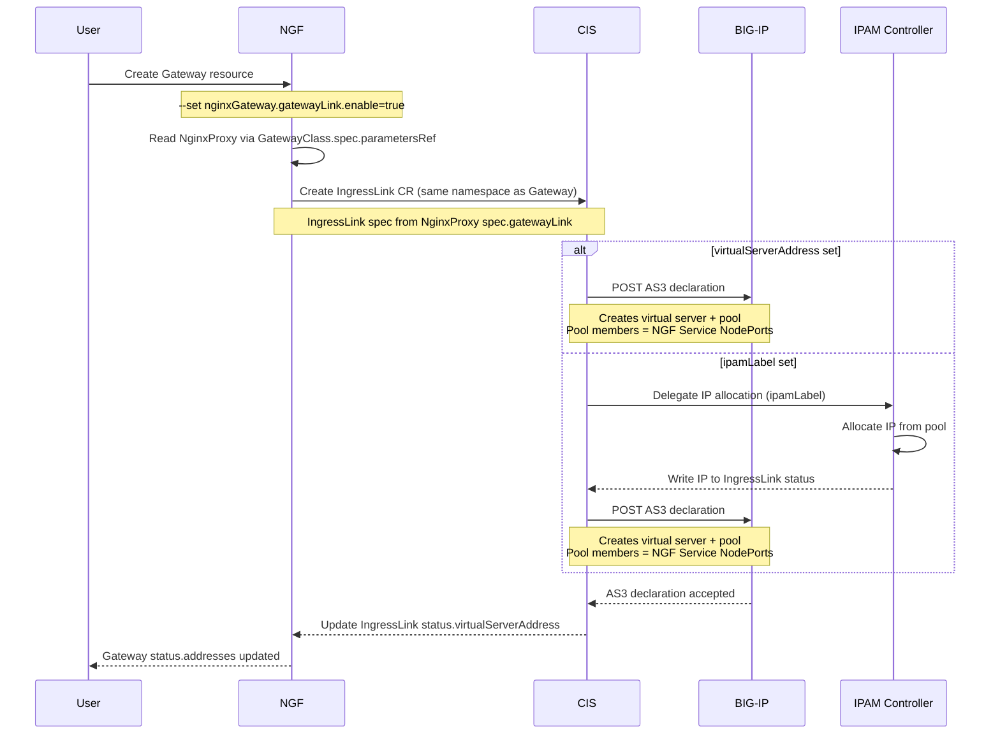
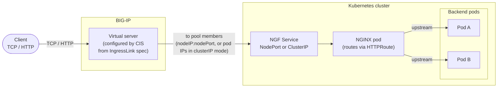

# Enhancement Proposal-5432: BIG-IP GatewayLink Integration

- Issue: https://github.com/nginx/nginx-gateway-fabric/issues/5432
- Status: Provisional

## Summary

This Enhancement Proposal extends the [NginxProxy API](../../apis/v1alpha2/nginxproxy_types.go) with an `externalLoadBalancers` API to support integrations with external load balancers that front NGINX Gateway Fabric. The first such integration is with F5 BIG-IP through F5 Container Ingress Services (CIS). When enabled, NGINX Gateway Fabric provisions a CIS `IngressLink` resource for each Gateway. CIS uses it to create a virtual server and its pool on BIG-IP that fronts NGINX Gateway Fabric as an external load balancer.

## Goals

- Extend the NginxProxy API with an `externalLoadBalancers` API to support integrations with different external load balancers.
- Add `gatewayLink` to `externalLoadBalancers` API to support integration with BIG-IP as an external load balancer configured using the F5 CIS IngressLink CRD.
- Expose the IngressLink fields through the `gatewayLink` API, so the BIG-IP virtual server can be configured from NginxProxy. The `selector` field is the only exception: NGINX Gateway Fabric sets it internally to match the data plane Service it provisions for the Gateway.
- Tie the IngressLink lifecycle to its Gateway, so it is created and deleted alongside the Gateway.

## Non-Goals

- Modifying the F5 Container Ingress Service's Ingress resource.
- Setting up the BIG-IP stack. Installing and configuring BIG-IP stack is the operator's responsibility.

## Introduction

F5 BIG-IP is commonly deployed as the external load balancer in front of Kubernetes ingress. F5 CIS watches Kubernetes resources and configures BIG-IP declaratively via a declarative configuration API named Application Services 3 (AS3). CIS supports an `IngressLink` custom resource definition (`ingresslinks.cis.f5.com`) that is designed to link an external load balancer to an in-cluster ingress data plane. An IngressLink resource creates a BIG-IP virtual server and a pool whose members are selected from a Kubernetes Service based on selector labels. The IngressLink's `selector` is a label selector: CIS finds the Service whose labels match it, reads that Service's endpoints, and programs them as the pool members (node IP and node port in `nodeport` mode, or pod IPs in `cluster` mode). As the Service's endpoints change, CIS keeps the pool in sync. NGINX Gateway Fabric sets this selector itself to match the data plane Service it provisions for the Gateway, so users do not configure it.

We will use the IngressLink resource available in CIS to configure BIG-IP so that it can act as an external load balancer in front of Nginx Gateway Fabric. The client connections will arrive at BIG-IP and are then forwarded to NGINX Gateway Fabric and routed to the backend applications. The data plane is provisioned per-Gateway, so each Gateway gets its own Service. Since the service determines the pool members in BigIP, each gateway will create its own gateway link hence its own IngressLink, virtual server, and pool on BIG-IP. This gives per-Gateway isolation that maps naturally onto BIG-IP virtual servers and partitions.

## API, Customer Driven Interfaces, and User Experience

### Architecture and data flow

To better understand how resources are created in the cluster and reflected back into BigIP lets look at the diagram below:



NGINX Gateway Fabric must be installed with `--set nginxGateway.gatewayLink.enable=true` so that the controller starts watching the IngressLink CRDs. With that in place, the flow for a Gateway is:

1. A user creates a Gateway that references an NginxProxy with `gatewayLink.enabled: true`.
2. NGF reads the NginxProxy and provisions the data plane Deployment and Service for the Gateway.
3. NGF creates one IngressLink resource in the Gateway's namespace, owned by the Gateway, with its spec built from the NginxProxy `gatewayLink` configuration.
4. CIS sees the IngressLink and configures BIG-IP. If `virtualServerAddress` is set, CIS posts an AS3 declaration that creates the virtual server and pool directly. If `ipamLabel` is set instead, the F5 IPAM Controller first allocates an IP from the labelled pool and writes it to the IngressLink status, and then CIS posts the AS3 declaration using that IP.
5. CIS writes the virtual server address back to the IngressLink status.
6. NGF reads the IngressLink status and writes the virtual server address into `Gateway.status.addresses`.

Because the IngressLink is owned by the Gateway, deleting the Gateway removes the IngressLink and, in turn, the BIG-IP virtual server and pool. GatewayLink is configured under `NginxProxy.spec.externalLoadBalancerServices.gatewayLink`. Every field maps directly into the IngressLink spec consumed by CIS.

At runtime, traffic flows from the client through the BIG-IP virtual server to the NGF data plane, which routes it to the backends:



### API definitions

The following fields will be added to `NginxProxy` API:

```yaml
// ExternalLoadBalancersSpec defines configuration for integrating with external
// load balancers that front NGINX Gateway Fabric. Each field configures a
// specific external load balancer integration.
type ExternalLoadBalancersSpec struct {
	// GatewayLink defines the configuration for integrating with F5 BIG-IP
	// as the external load balancer for NGINX Gateway Fabric using the F5
	// Container Ingress Services.
	//
	// +optional
	GatewayLink *GatewayLinkSpec `json:"gatewayLink,omitempty"`
}

// GatewayLinkSpec defines the configuration for integrating with F5 BIG-IP
// as the external load balancer for NGINX Gateway Fabric using F5
// Container Ingress Services.
//
// +kubebuilder:validation:XValidation:message="virtualServerAddress and ipamLabel are mutually exclusive",rule="!(has(self.virtualServerAddress) && has(self.ipamLabel))"
// +kubebuilder:validation:XValidation:message="one of virtualServerAddress or ipamLabel must be set",rule="has(self.virtualServerAddress) || has(self.ipamLabel)"
// +kubebuilder:validation:XValidation:message="partition cannot be Common",rule="!has(self.partition) || self.partition != 'Common'"
//
//nolint:lll
type GatewayLinkSpec struct {
	// Enabled indicates whether GatewayLink integration is enabled.
	//
	// +optional
	Enabled *bool `json:"enabled,omitempty"`

	// VirtualServerAddress is the static IP address to configure on BIG-IP for the virtual server.
	// This is mutually exclusive with IPAMLabel.
	//
	// +kubebuilder:validation:Pattern=`^(([0-9]|[1-9][0-9]|1[0-9]{2}|2[0-4][0-9]|25[0-5])\.){3}([0-9]|[1-9][0-9]|1[0-9]{2}|2[0-4][0-9]|25[0-5])$`
	// +optional
	VirtualServerAddress *string `json:"virtualServerAddress,omitempty"`

	// VirtualServerName is a custom name for the BIG-IP virtual server.
	//
	// +kubebuilder:validation:Pattern=`^[a-zA-Z]+([A-Za-z0-9-._+])*([A-Za-z0-9])$`
	// +optional
	VirtualServerName *string `json:"virtualServerName,omitempty"`

	// IPAMLabel is the label used by F5 IPAM Controller to allocate an IP address.
	// The IPAM controller will assign an IP from the pool associated with this label.
	// This is mutually exclusive with VirtualServerAddress.
	//
	// +kubebuilder:validation:Pattern=`^[a-zA-Z]+[-A-Za-z0-9_.:]+[A-Za-z0-9]+$`
	// +optional
	IPAMLabel *string `json:"ipamLabel,omitempty"`

	// Host is the hostname for the BIG-IP virtual server.
	//
	// +optional
	Host *gatewayv1.Hostname `json:"host,omitempty"`

	// Partition is the BIG-IP partition where resources will be created.
	// The partition must already exist on BIG-IP and cannot be "Common".
	//
	// +kubebuilder:validation:Pattern=`^[a-zA-Z]+[-A-Za-z0-9_.]+$`
	// +optional
	Partition *string `json:"partition,omitempty"`

	// BigIPRouteDomain is the route domain ID for the BIG-IP virtual server.
	//
	// +kubebuilder:validation:Minimum=0
	// +kubebuilder:validation:Maximum=65535
	// +optional
	BigIPRouteDomain *int32 `json:"bigipRouteDomain,omitempty"`

	// TLS defines the TLS configuration for the BIG-IP virtual server.
	//
	// +optional
	TLS *GatewayLinkTLS `json:"tls,omitempty"`

	// MultiCluster defines the multi-cluster configuration for load balancing traffic
	// across NGINX Gateway Fabric instances in multiple clusters.
	//
	// +optional
	MultiCluster *GatewayLinkMultiCluster `json:"multiCluster,omitempty"`

	// IRules is a list of BIG-IP iRules to apply to the virtual server.
	// Each iRule must be specified using the full path format /partition/irule_name,
	// for example "/Common/Proxy_Protocol_iRule".
	//
	// +kubebuilder:validation:items:Pattern=`^/[a-zA-Z]+([A-Za-z0-9-_+]+/)+([-A-Za-z0-9_.:]+/?)*$`
	// +optional
	IRules []string `json:"iRules,omitempty"`

	// Monitors is a list of BIG-IP health monitors to associate with the virtual server pool.
	//
	// +optional
	Monitors []GatewayLinkMonitor `json:"monitors,omitempty"`

	// ServiceAddress configures Layer 3 settings for the BIG-IP virtual server address.
	//
	// +optional
	ServiceAddress *GatewayLinkServiceAddress `json:"serviceAddress,omitempty"`
}

// GatewayLinkServiceAddress configures Layer 3 settings for the BIG-IP virtual server address.
type GatewayLinkServiceAddress struct {
	// ARPEnabled controls whether BIG-IP answers ARP requests for the virtual server address.
	//
	// +optional
	ARPEnabled *bool `json:"arpEnabled,omitempty"`

	// ICMPEcho controls whether the virtual server address responds to ICMP echo (ping).
	//
	// +optional
	ICMPEcho *ICMPEcho `json:"icmpEcho,omitempty"`

	// RouteAdvertisement controls how BIG-IP advertises a route to the virtual server address.
	//
	// +optional
	RouteAdvertisement *RouteAdvertisement `json:"routeAdvertisement,omitempty"`

	// SpanningEnabled enables spanning for the virtual server address across traffic groups.
	//
	// +optional
	SpanningEnabled *bool `json:"spanningEnabled,omitempty"`

	// TrafficGroup is the BIG-IP traffic group that owns the virtual server address,
	// in the full path format, for example "/Common/traffic-group-test".
	//
	// +kubebuilder:validation:Pattern=`^/([A-Za-z0-9-_+]+/)+([-A-Za-z0-9_.:]+/?)*$`
	// +optional
	TrafficGroup *string `json:"trafficGroup,omitempty"`
}

// ICMPEcho controls whether the BIG-IP virtual server address responds to ICMP echo.
// +kubebuilder:validation:Enum=enable;disable;selective
type ICMPEcho string

const (
	// ICMPEchoEnable means the virtual server address always responds to ICMP echo.
	ICMPEchoEnable ICMPEcho = "enable"

	// ICMPEchoDisable means the virtual server address never responds to ICMP echo.
	ICMPEchoDisable ICMPEcho = "disable"

	// ICMPEchoSelective means BIG-IP responds to ICMP echo based on the state of the virtual server.
	ICMPEchoSelective ICMPEcho = "selective"
)

// RouteAdvertisement controls how BIG-IP advertises a route to the virtual server address.
// +kubebuilder:validation:Enum=enable;disable;selective;always;any;all
type RouteAdvertisement string

const (
	// RouteAdvertisementEnable enables route advertisement for the virtual server address.
	RouteAdvertisementEnable RouteAdvertisement = "enable"

	// RouteAdvertisementDisable disables route advertisement for the virtual server address.
	RouteAdvertisementDisable RouteAdvertisement = "disable"

	// RouteAdvertisementSelective advertises the route based on the state of the virtual server.
	RouteAdvertisementSelective RouteAdvertisement = "selective"

	// RouteAdvertisementAlways always advertises the route.
	RouteAdvertisementAlways RouteAdvertisement = "always"

	// RouteAdvertisementAny advertises the route while any virtual server using the address is available.
	RouteAdvertisementAny RouteAdvertisement = "any"

	// RouteAdvertisementAll advertises the route while all virtual servers using the address are available.
	RouteAdvertisementAll RouteAdvertisement = "all"
)

// TLSReferenceType specifies where the BIG-IP SSL profiles come from.
// +kubebuilder:validation:Enum=bigip;secret
type TLSReferenceType string

const (
	// TLSReferenceBigIP means the SSL profiles already exist on BIG-IP.
	TLSReferenceBigIP TLSReferenceType = "bigip"

	// TLSReferenceSecret means the SSL profiles are sourced from Kubernetes secrets.
	TLSReferenceSecret TLSReferenceType = "secret"
)

// GatewayLinkTLS defines the TLS configuration for the BIG-IP virtual server.
type GatewayLinkTLS struct {
	// Reference specifies the source of the SSL profiles. "bigip" means the profiles already
	// exist on BIG-IP. "secret" means they come from Kubernetes secrets of type kubernetes.io/tls.
	//
	// +optional
	Reference *TLSReferenceType `json:"reference,omitempty"`

	// ClientSSLs is a list of client SSL profiles that BIG-IP uses to terminate TLS from the client.
	// When reference is "bigip", each entry is the full path of a profile on BIG-IP in the form
	// /partition/profile_name, for example /Common/clientssl. When reference is "secret", each entry
	// is the name of a Kubernetes secret of type kubernetes.io/tls that holds the certificate and key.
	//
	// +kubebuilder:validation:items:Pattern=`^/?[a-zA-Z]+([-A-Za-z0-9_+]+/)*([-A-Za-z0-9_.:]+/?)*$`
	// +optional
	ClientSSLs []string `json:"clientSSLs,omitempty"`

	// ServerSSLs is a list of server SSL profiles that BIG-IP uses to re-encrypt traffic to NGINX.
	// When reference is "bigip", each entry is the full path of a profile on BIG-IP in the form
	// /partition/profile_name, for example /Common/serverssl. When reference is "secret", each entry
	// is the name of a Kubernetes secret of type kubernetes.io/tls that holds the certificate and key.
	//
	// +kubebuilder:validation:items:Pattern=`^/?[a-zA-Z]+([-A-Za-z0-9_+]+/)*([-A-Za-z0-9_.:]+/?)*$`
	// +optional
	ServerSSLs []string `json:"serverSSLs,omitempty"`
}

// GatewayLinkMonitor defines a BIG-IP health monitor reference.
type GatewayLinkMonitor struct {
	// Name is the full path of the health monitor on BIG-IP (e.g., "/Common/http").
	//
	// +kubebuilder:validation:Pattern=`^/[a-zA-Z]+([A-Za-z0-9-_+]+/)+([-A-Za-z0-9_.:]+/?)*$`
	// +kubebuilder:validation:Required
	Name string `json:"name"`

	// Reference specifies the source of the monitor. Currently only "bigip" is supported.
	//
	// +kubebuilder:validation:Enum=bigip
	// +kubebuilder:validation:Required
	Reference string `json:"reference"`
}

// GatewayLinkMultiCluster defines the multi-cluster configuration for GatewayLink.
// When configured, CIS will load balance traffic across NGINX Gateway Fabric instances
// in multiple clusters.
type GatewayLinkMultiCluster struct {
	// LocalClusterName is the name of the current cluster as configured in the CIS deployment
	// (--cluster-name flag).
	//
	// +kubebuilder:validation:Required
	LocalClusterName string `json:"localClusterName"`

	// RemoteClusters is the list of remote clusters that also run NGINX Gateway Fabric.
	//
	// +kubebuilder:validation:MinItems=1
	RemoteClusters []GatewayLinkRemoteCluster `json:"remoteClusters"`
}

// GatewayLinkRemoteCluster defines a remote cluster for multi-cluster load balancing.
type GatewayLinkRemoteCluster struct {
	// ClusterName is one of the names of the remote clusters as configured in the CIS deployment.
	//
	// +kubebuilder:validation:Required
	ClusterName *string `json:"clusterName"`

	// Namespace is the namespace of the NGINX Gateway Fabric service in the remote cluster.
	// If not specified, defaults to the local Gateway's namespace.
	//
	// +optional
	Namespace *string `json:"namespace,omitempty"`

	// Service is the name of the NGINX Gateway Fabric service in the remote cluster.
	// If not specified, defaults to the local Gateway's service name.
	//
	// +optional
	Service *string `json:"service,omitempty"`

	// Weight is the load balancing weight for this cluster's service.
	//
	// +kubebuilder:validation:Minimum=0
	// +kubebuilder:validation:Maximum=256
	// +optional
	Weight *int32 `json:"weight,omitempty"`
}
```

Below is an example of GatewayLink configuration using the `NginxProxy` CRD:

```yaml
apiVersion: gateway.nginx.org/v1alpha2
kind: NginxProxy
metadata:
  name: nginx-proxy-gatewaylink
spec:
  externalLoadBalancers:
     gatewayLink:
       enabled: true
       virtualServerAddress: "10.8.3.101"   # or ipamLabel
       iRules:
         - "/Common/Proxy_Protocol_iRule"
     rewriteClientIP:
       mode: ProxyProtocol
       trustedAddresses:
         - type: CIDR
           value: "10.8.0.0/14"
     kubernetes:
       service:
         type: NodePort          # must match CIS --pool-member-type
```

List of supported fields to configure Big-IP on IngressLink CRD:

| Field | Type | Default | Description |
| --- | --- | --- | --- |
| `enabled` | bool | false | Enables GatewayLink so that NGF creates an IngressLink for the Gateway. |
| `virtualServerAddress` | IPv4 string | — | The static IP address for the BIG-IP virtual server. This is mutually exclusive with `ipamLabel`. |
| `ipamLabel` | string | — | A label that tells the F5 IPAM Controller to allocate the virtual server IP from a pool. This is mutually exclusive with `virtualServerAddress`. |
| `virtualServerName` | string | CIS-generated | A custom name for the BIG-IP virtual server. |
| `host` | hostname | — | The hostname for the virtual server. BIG-IP uses it for host based matching. |
| `partition` | string | — | The BIG-IP partition where CIS creates resources. The partition must already exist on BIG-IP and it cannot be `Common`. |
| `bigipRouteDomain` | int32 | 0 | The route domain for the virtual server. It is used for segmented Layer 3 address spaces and accepts a value from 0 to 65535. |
| `iRules` | []string | — | The iRules to attach to the virtual server. Each entry is a full path in the form `/partition/name`. CIS currently requires at least one. |
| `monitors` | []object | — | The BIG-IP health monitors for the pool. Each entry has a `name`, which is a full path, and a `reference`, which is set to `bigip`. |
| `tls.reference` | enum | — | The source of the SSL profiles. Use `bigip` for profiles that exist on BIG-IP, or `secret` for profiles sourced from Kubernetes secrets. |
| `tls.clientSSLs` | []string | — | The client SSL profiles that BIG-IP uses to terminate TLS from the client. |
| `tls.serverSSLs` | []string | — | The server SSL profiles that BIG-IP uses to re-encrypt traffic to NGINX. |
| `multiCluster.localClusterName` | string | — | The name of this cluster as configured in CIS. Setting it enables load balancing one virtual server across clusters. |
| `multiCluster.remoteClusters[]` | list | — | The list of remote clusters. Each entry has a `clusterName`, an optional `namespace` and `service`, and an optional `weight` from 0 to 256. |
| `selector` | labelSelector | — | Selects the backend Service for the pool. NGINX Gateway Fabric sets this itself to match the data plane Service, so it is not user configurable. |
| `serviceAddress` | object | — | The Layer 3 settings for the virtual server address. It includes `trafficGroup`, which is the failover unit for HA, along with `arpEnabled`, `icmpEcho`, `routeAdvertisement`, and `spanningEnabled`. |

### Installation

GatewayLink is gated by a control plane flag, set via Helm:

```bash
helm install ngf oci://ghcr.io/nginx/charts/nginx-gateway-fabric \
  --set nginxGateway.gatewayLink.enable=true
```

The F5 `IngressLink` CRD (`ingresslinks.cis.f5.com`) and F5 CIS (in custom-resource mode) must be installed in the cluster. The CIS BIG-IP partition referenced by `partition` must exist before use.

### Understanding the correlation between service type and CIS pool member type

The Gateway data plane Service type (`kubernetes.service.type`) must match the CIS `--pool-member-type`. The service type determines how BIG-IP reaches NGINX Gateway Fabric, and configuring it correctly is essential because it decides what CIS puts into the pool of the virtual server it creates on BIG-IP.

With CIS in `nodeport` mode, the Service must be `NodePort` and CIS populates the pool with each node's IP and the Service's allocated node port, so BIG-IP needs reachability to the node IP and node port, and traffic takes an extra hop through `kube-proxy` on the node before reaching a pod. With CIS in `cluster` mode, the Service must be `ClusterIP` and CIS programs the pod IPs directly, giving BIG-IP true pod-level load balancing and health checking, but this requires BIG-IP to have a network path to the pod network (a routed CNI, or a static route to the pod CIDR via the node).

If the Service type and the pool member type do not match, the pool will not be populated. For example, if the Service is `ClusterIP` while CIS is in `nodeport` mode, CIS cannot populate the pool and logs an error such as `Requested service backend ... not of NodePort or LoadBalancer type`; the virtual server may still come up but it will have no members and so will not serve traffic.

A few additional points about pool members:

- Health monitoring: CIS attaches a health monitor to the pool and members only go up when the monitor passes. Expose the readiness endpoint using the Nginx deployment so BIG-IP marks members healthy, or supply an explicit monitor via the `monitors` field.
- Scaling: The pool tracks the backing endpoints, so scaling the data plane (more or fewer replicas) updates the pool members automatically with no change to the IngressLink needed.
- IPv4 vs IPv6: In a dual-stack Service, CIS may add both IPv4 and IPv6 members; the IPv6 member can show as down when only IPv4 is on the data path. This is expected and does not affect IPv4 traffic.
- Multi-cluster: With `multiCluster`, CIS builds one pool per cluster from each cluster's Service (resolved over a kubeconfig), and members across clusters are combined under the single virtual server. Multi-cluster requires `nodeport` mode.

### Production

In production, you can configure other `gatewayLink` fields. A common setup looks could look like this:

- Use a `ClusterIP` Service with CIS in `cluster` mode, so BIG-IP sends traffic straight to the pods.
- Use a dedicated `partition` to keep each environment separate on BIG-IP. This is not mandatory.
- Set a `monitor` so BIG-IP knows how to health check the pods.
- Set `tls` profiles so BIG-IP handles TLS, using a certificate that lives on BIG-IP.

```yaml
apiVersion: gateway.nginx.org/v1alpha2
kind: NginxProxy
metadata:
  name: nginx-proxy-gatewaylink-prod
spec:
  externalLoadBalancers:
    gatewayLink:
      enabled: true
      virtualServerAddress: "10.8.3.101"   # or ipamLabel for dynamic allocation
      partition: "production"
      monitors:
        - name: "/Common/http"             # explicit pool health monitor
          reference: bigip
      tls:
        reference: bigip                   # SSL profiles live on BIG-IP
        clientSSLs:
          - "/Common/cafe-clientssl"       # BIG-IP terminates client TLS with this cert
        serverSSLs:
          - "/Common/serverssl"            # BIG-IP re-encrypts to NGINX
    kubernetes:
      service:
        type: ClusterIP                    # matches CIS --pool-member-type=cluster
```

These fields can be set using the `NginxProxy` resource and they have the following purpose on BigIP side:

- Direct pod load balancing — `cluster` mode plus a `ClusterIP` Service puts pod IPs in the pool. BIG-IP must have a route to the pod network for this.
- Tenant isolation — a dedicated `partition` keeps each environment's virtual servers and pools separate on BIG-IP.
- Explicit health checks — a `monitor` defines exactly how BIG-IP decides a pool member is healthy.
- TLS profiles and certificates — `tls.clientSSLs`/`serverSSLs` reference SSL profiles on BIG-IP, or use `reference: secret` to source them from Kubernetes secrets.

### Big-IP HA mode

BIG-IP can run as a pair of devices, one active and one standby. If the active device fails, the standby takes over, so the virtual server IP has to move to whichever device is currently active.

To make the IP move, set `serviceAddress.trafficGroup` to a floating traffic group such as `/Common/traffic-group-test`. This ties the virtual server IP to the failover unit. When the standby becomes active it takes over the IP, and traffic keeps flowing without any change in Kubernetes.

This assumes the two BIG-IPs are already set up as a working HA pair on the BIG-IP side. They must be in the same device trust group and have config sync enabled so that both devices share the same configuration. That setup is the operator's responsibility. NGF only sets the traffic group through `serviceAddress`.

### Multi-cluster configuration

A single BIG-IP virtual server can load balance across NGF instances in multiple clusters using `gatewayLink.multiCluster`. NGF translates this into the IngressLink's `multiClusterServices`. CIS runs in one cluster and watches the others, so it needs a kubeconfig for each remote cluster and the cluster names must match across the CIS deployment, its extended ConfigMap, and `gatewayLink.multiCluster`. Multi-cluster requires `nodeport` pool mode, and each cluster's Gateway must expose a Service with the same name and namespace that the configuration references.

### Preserving the real ClientIP

BIG-IP opens its own connection to the data plane, so by default NGINX sees BIG-IP as the client instead of the real caller. To preserve the original client IP, BIG-IP prepends a PROXY protocol header (via the `Proxy_Protocol_iRule` referenced in `gatewayLink.iRules`) and NGINX is told to read it using the existing [`rewriteClientIP`](rewrite-client-ip.md) API:

```yaml
spec:
  gatewayLink:
    iRules:
      - "/Common/Proxy_Protocol_iRule"
  rewriteClientIP:
    mode: ProxyProtocol
    trustedAddresses:
      - type: CIDR
        value: "10.145.32.0/19"   # the BIG-IP self-IP subnet
```

`trustedAddresses` is a security control. NGINX only honors a PROXY header from a source listed in this field, so the field must contain the BIG-IP self-IP that originates traffic to the pods. Use that self-IP's subnet. In an HA pair, cover both devices' self-IPs, because either one can be the active sender. Both sides also have to agree on whether PROXY protocol is in use. If NGINX expects a PROXY header but BIG-IP is not sending one, or BIG-IP sends one but NGINX is not expecting it, the connection fails.

### API Definition


## Use Cases

- Exposes Nginx Gateway Fabric behind an existing BIG-IP without manually configuring virtual servers and pools.
- This enables us to have per-tenant isolation since each Gateway maps to its own virtual server on BIG-IP.
- We get centralized IP management via the F5 IPAM Controller instead of hand-assigned VIPs.
- TLS offload or re-encryption at BIG-IP using existing BIG-IP SSL profiles.
- It lets us preserve client IP through BIG-IP using `PROXY protocol` with the existing Rewrite Client IP feature.

## Known Limitations

The `tls` field configures BIG-IP-side SSL profiles so that BIG-IP can terminate or re-encrypt TLS. In testing, CIS accepted the `tls` configuration but did not apply the SSL profiles to the IngressLink virtual server. The virtual server was created as a plain TCP virtual server with no SSL, for both the `bigip` and `secret` reference types. The supported way to serve HTTPS is therefore to terminate TLS at NGINX Gateway Fabric using a Gateway HTTPS listener, which BIG-IP forwards to over TCP. BIG-IP-side TLS offload through the IngressLink may depend on the CIS version, so confirm it against the CIS version in use before relying on it.

Within `serviceAddress`, the `icmpEcho` and `trafficGroup` settings were verified to take effect on BIG-IP. The `arpEnabled`, `spanningEnabled`, and `routeAdvertisement` settings were confirmed to reach BIG-IP and be applied to the virtual server address, but their runtime behavior was not exercised because that requires a more involved network setup, such as a dynamic routing peer for route advertisement.

## Testing

We will add functional tests that exercise the integration end to end against a real BIG-IP. We have access to a long-standing BIG-IP instance to run them against.

The test flow:

1. Install NGF with the GatewayLink integration enabled.
2. Mount the BIG-IP public key into the test environment and create a dedicated partition on BIG-IP for the test run.
3. Run the test in two configurations. The first uses a static `virtualServerAddress`. The second uses the F5 IPAM Controller with an `ipamLabel` so that the address is allocated dynamically. Both runs use production settings.
4. Create a Gateway and verify that NGF provisions the `IngressLink` and that CIS configures the virtual server and pool on BIG-IP.
5. Send traffic to the virtual server IP and confirm that it reaches the application through NGF.
6. Tear down the test by deleting the partition and removing the public key from the BIG-IP stack.

## Security Considerations

- We do not hold BIG-IP credentials. CIS holds them and securing communication between BigIP and CIS is an operator responsibility documented as a prerequisite.
- Client IP preservation via PROXY protocol requires `trustedAddresses` to be scoped to the BIG-IP source range which could lead an overly broad range would let untrusted sources spoof client IPs.
- TLS secrets, when `tls.reference: secret`, are read by CIS; managing their access is an operator responsibility.

## Alternatives

- LoadBalancer Service with a cloud/MetalLB controller: works where a Service LoadBalancer implementation exists, but does not leverage BIG-IP features (iRules, profiles, monitors, partitions) or the F5 operational model. GatewayLink targets environments standardized on BIG-IP.
- Manual BIG-IP configuration: operators define virtual servers and pools by hand. Loses the declarative, Gateway-lifecycle-driven automation and drifts as data plane endpoints change.

## References

- [Rewrite Client IP proposal](rewrite-client-ip.md)
- [Gateway Settings (NginxProxy) proposal](gateway-settings.md)
- [F5 Container Ingress Services](https://github.com/F5Networks/k8s-bigip-ctlr)
- [IngressLink CRD](https://github.com/F5Networks/k8s-bigip-ctlr/blob/68c2c90ee30299350b169a6415e18ed3378a4a1f/docs/config_examples/customResourceDefinitions/customresourcedefinitions.yml#L1114)
