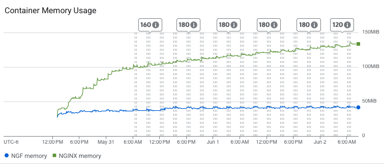
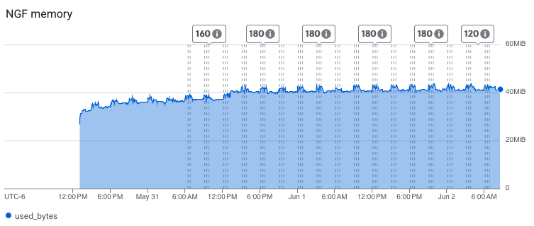

# Results

## Summary

These results are incomplete and may be inaccurate. The test was stopped manually about 1 day early, and results such as logs and traffic summary were not collected properly by the teardown scripts/functions.

There are fewer dashboards to collect now after the change in architecture, as we don't have the same metrics as we did before, mainly relating to reloads.

One thing of note is the significant increase in memory usage for the NGINX container.

## Test environment

NGINX Plus: true

NGINX Gateway Fabric:

- Commit: cc3c907ff668d886cac719df2d77b685370ad5f8
- Date: 2025-05-30T18:25:58Z
- Dirty: false

GKE Cluster:

- Node count: 3
- k8s version: v1.32.4-gke.1106006
- vCPUs per node: 2
- RAM per node: 4015484Ki
- Max pods per node: 110
- Zone: us-west2-a
- Instance Type: e2-medium

## Traffic

HTTP:

```text
```

HTTPS:

```text
```


## Error Logs

### nginx-gateway


### nginx
2025/06/01 15:34:12 [error] 78#78: *157671523 no live upstreams while connecting to upstream, client: 35.236.69.111, server: cafe.example.com, request: "GET /tea HTTP/1.1", upstream: "http://longevity_tea_80/tea", host: "cafe.example.com"

## Key Metrics

### Containers memory



### NGF Container Memory



### Containers CPU


