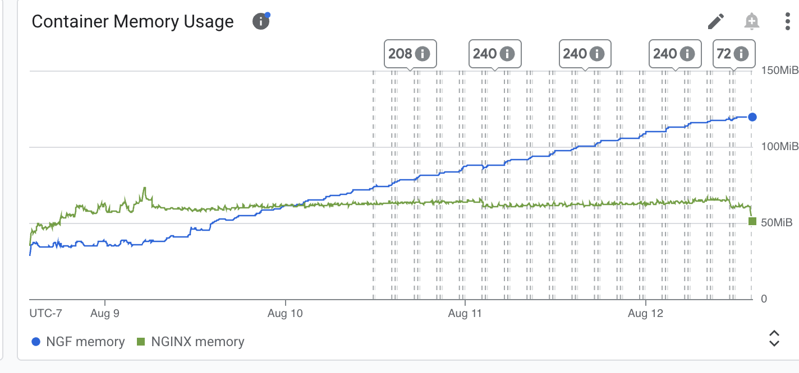
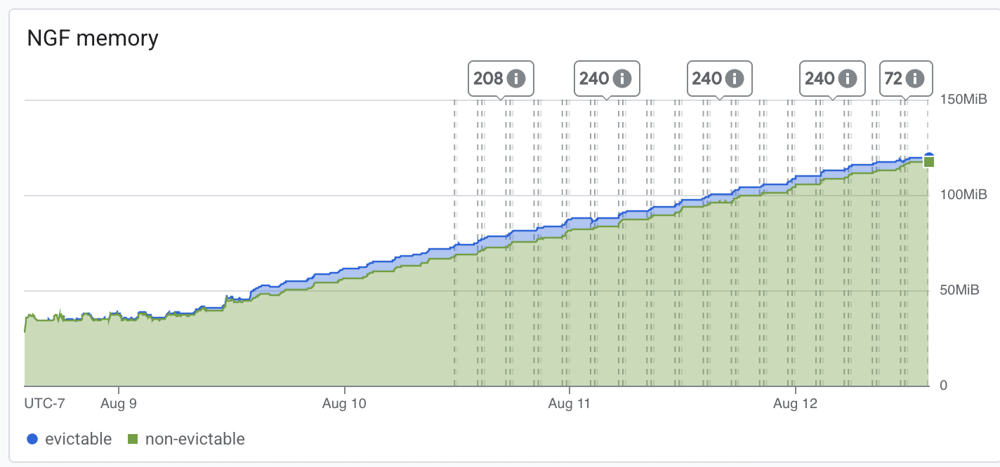
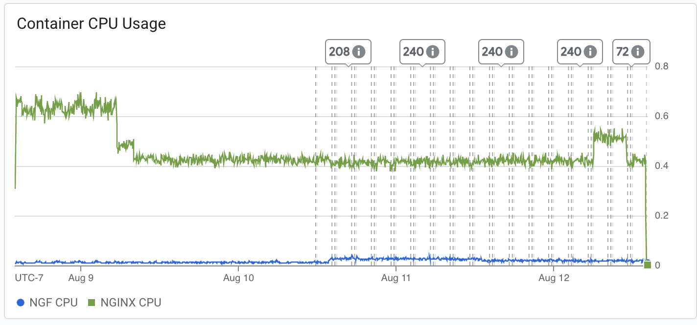

# Results

## Test environment

NGINX Plus: false

NGINX Gateway Fabric:

- Commit: 00112a4f92025967d82b04fccc9df98b314e06b8
- Date: 2025-08-08T19:16:31Z
- Dirty: false

GKE Cluster:

- Node count: 3
- k8s version: v1.33.2-gke.1240000
- vCPUs per node: 2
- RAM per node: 4015676Ki
- Max pods per node: 110
- Zone: us-central1-c
- Instance Type: e2-medium

## Summary:

- Overwhelming majority of traffic responses were non-2xx or 3xx responses. 
- Increase in memory usage for both NGF and NGINX. 
- CPU usage remained consistant with past results. 
- Errors seen seem to be similar to the singular error in the 1.6.0 plus test run. 

## Traffic

HTTP:

```text
Running 5760m test @ http://cafe.example.com/coffee
  2 threads and 100 connections
  Thread Stats   Avg      Stdev     Max   +/- Stdev
    Latency    99.75ms   99.46ms   2.00s    86.19%
    Req/Sec   503.99    399.94     5.27k    72.34%
  340520035 requests in 5760.00m, 97.24GB read
  Socket errors: connect 0, read 52470, write 0, timeout 74144
  Non-2xx or 3xx responses: 307049999
Requests/sec:    985.30
Transfer/sec:    295.05KB
```

HTTPS:

```text
Running 5760m test @ https://cafe.example.com/tea
  2 threads and 100 connections
  Thread Stats   Avg      Stdev     Max   +/- Stdev
    Latency   105.85ms   99.39ms   1.98s    83.25%
    Req/Sec   467.11    378.48     5.08k    73.91%
  315478863 requests in 5760.00m, 90.82GB read
  Socket errors: connect 0, read 51813, write 0, timeout 69436
  Non-2xx or 3xx responses: 269078873
Requests/sec:    912.84
Transfer/sec:    275.55KB
```

## Key Metrics

### Containers memory



### NGF Container Memory



### Containers CPU




## Error Logs

### nginx-gateway

error=failed to list *v1.ServiceAccount: Unauthorized;level=error;logger=controller-runtime.cache.UnhandledError;msg=Failed to watch;reflector=pkg/mod/k8s.io/client-go@v0.33.3/tools/cache/reflector.go:285;stacktrace=k8s.io/apimachinery/pkg/util/runtime.logError
	pkg/mod/k8s.io/apimachinery@v0.33.3/pkg/util/runtime/runtime.go:226
k8s.io/apimachinery/pkg/util/runtime.handleError
	pkg/mod/k8s.io/apimachinery@v0.33.3/pkg/util/runtime/runtime.go:217
k8s.io/apimachinery/pkg/util/runtime.HandleErrorWithContext
	pkg/mod/k8s.io/apimachinery@v0.33.3/pkg/util/runtime/runtime.go:203
k8s.io/client-go/tools/cache.DefaultWatchErrorHandler
	pkg/mod/k8s.io/client-go@v0.33.3/tools/cache/reflector.go:200
k8s.io/client-go/tools/cache.(*Reflector).RunWithContext.func1
	pkg/mod/k8s.io/client-go@v0.33.3/tools/cache/reflector.go:360
k8s.io/apimachinery/pkg/util/wait.BackoffUntil.func1
	pkg/mod/k8s.io/apimachinery@v0.33.3/pkg/util/wait/backoff.go:233
k8s.io/apimachinery/pkg/util/wait.BackoffUntilWithContext.func1
	pkg/mod/k8s.io/apimachinery@v0.33.3/pkg/util/wait/backoff.go:255
k8s.io/apimachinery/pkg/util/wait.BackoffUntilWithContext
	pkg/mod/k8s.io/apimachinery@v0.33.3/pkg/util/wait/backoff.go:256
k8s.io/apimachinery/pkg/util/wait.BackoffUntil
	pkg/mod/k8s.io/apimachinery@v0.33.3/pkg/util/wait/backoff.go:233
k8s.io/client-go/tools/cache.(*Reflector).RunWithContext
	pkg/mod/k8s.io/client-go@v0.33.3/tools/cache/reflector.go:358
k8s.io/client-go/tools/cache.(*controller).RunWithContext.(*Group).StartWithContext.func3
	pkg/mod/k8s.io/apimachinery@v0.33.3/pkg/util/wait/wait.go:63
k8s.io/apimachinery/pkg/util/wait.(*Group).Start.func1
	pkg/mod/k8s.io/apimachinery@v0.33.3/pkg/util/wait/wait.go:72;ts=2025-08-12T21:16:49Z;type=*v1.ServiceAccount
error=failed to list *v1.Service: Unauthorized;level=error;logger=controller-runtime.cache.UnhandledError;msg=Failed to watch;reflector=pkg/mod/k8s.io/client-go@v0.33.3/tools/cache/reflector.go:285;stacktrace=k8s.io/apimachinery/pkg/util/runtime.logError
	pkg/mod/k8s.io/apimachinery@v0.33.3/pkg/util/runtime/runtime.go:226
k8s.io/apimachinery/pkg/util/runtime.handleError
	pkg/mod/k8s.io/apimachinery@v0.33.3/pkg/util/runtime/runtime.go:217
k8s.io/apimachinery/pkg/util/runtime.HandleErrorWithContext
	pkg/mod/k8s.io/apimachinery@v0.33.3/pkg/util/runtime/runtime.go:203
k8s.io/client-go/tools/cache.DefaultWatchErrorHandler
	pkg/mod/k8s.io/client-go@v0.33.3/tools/cache/reflector.go:200
k8s.io/client-go/tools/cache.(*Reflector).RunWithContext.func1
	pkg/mod/k8s.io/client-go@v0.33.3/tools/cache/reflector.go:360
k8s.io/apimachinery/pkg/util/wait.BackoffUntil.func1
	pkg/mod/k8s.io/apimachinery@v0.33.3/pkg/util/wait/backoff.go:233
k8s.io/apimachinery/pkg/util/wait.BackoffUntilWithContext.func1
	pkg/mod/k8s.io/apimachinery@v0.33.3/pkg/util/wait/backoff.go:255
k8s.io/apimachinery/pkg/util/wait.BackoffUntilWithContext
	pkg/mod/k8s.io/apimachinery@v0.33.3/pkg/util/wait/backoff.go:256
k8s.io/apimachinery/pkg/util/wait.BackoffUntil
	pkg/mod/k8s.io/apimachinery@v0.33.3/pkg/util/wait/backoff.go:233
k8s.io/client-go/tools/cache.(*Reflector).RunWithContext
	pkg/mod/k8s.io/client-go@v0.33.3/tools/cache/reflector.go:358
k8s.io/client-go/tools/cache.(*controller).RunWithContext.(*Group).StartWithContext.func3
	pkg/mod/k8s.io/apimachinery@v0.33.3/pkg/util/wait/wait.go:63
k8s.io/apimachinery/pkg/util/wait.(*Group).Start.func1
	pkg/mod/k8s.io/apimachinery@v0.33.3/pkg/util/wait/wait.go:72;ts=2025-08-12T21:16:48Z;type=*v1.Service
error=failed to list *v1.ConfigMap: Unauthorized;level=error;logger=controller-runtime.cache.UnhandledError;msg=Failed to watch;reflector=pkg/mod/k8s.io/client-go@v0.33.3/tools/cache/reflector.go:285;stacktrace=k8s.io/apimachinery/pkg/util/runtime.logError
	pkg/mod/k8s.io/apimachinery@v0.33.3/pkg/util/runtime/runtime.go:226
k8s.io/apimachinery/pkg/util/runtime.handleError
	pkg/mod/k8s.io/apimachinery@v0.33.3/pkg/util/runtime/runtime.go:217
k8s.io/apimachinery/pkg/util/runtime.HandleErrorWithContext
	pkg/mod/k8s.io/apimachinery@v0.33.3/pkg/util/runtime/runtime.go:203
k8s.io/client-go/tools/cache.DefaultWatchErrorHandler
	pkg/mod/k8s.io/client-go@v0.33.3/tools/cache/reflector.go:200
k8s.io/client-go/tools/cache.(*Reflector).RunWithContext.func1
	pkg/mod/k8s.io/client-go@v0.33.3/tools/cache/reflector.go:360
k8s.io/apimachinery/pkg/util/wait.BackoffUntil.func1
	pkg/mod/k8s.io/apimachinery@v0.33.3/pkg/util/wait/backoff.go:233
k8s.io/apimachinery/pkg/util/wait.BackoffUntilWithContext.func1
	pkg/mod/k8s.io/apimachinery@v0.33.3/pkg/util/wait/backoff.go:255
k8s.io/apimachinery/pkg/util/wait.BackoffUntilWithContext
	pkg/mod/k8s.io/apimachinery@v0.33.3/pkg/util/wait/backoff.go:256
k8s.io/apimachinery/pkg/util/wait.BackoffUntil
	pkg/mod/k8s.io/apimachinery@v0.33.3/pkg/util/wait/backoff.go:233
k8s.io/client-go/tools/cache.(*Reflector).RunWithContext
	pkg/mod/k8s.io/client-go@v0.33.3/tools/cache/reflector.go:358
k8s.io/client-go/tools/cache.(*controller).RunWithContext.(*Group).StartWithContext.func3
	pkg/mod/k8s.io/apimachinery@v0.33.3/pkg/util/wait/wait.go:63
k8s.io/apimachinery/pkg/util/wait.(*Group).Start.func1
	pkg/mod/k8s.io/apimachinery@v0.33.3/pkg/util/wait/wait.go:72;ts=2025-08-12T21:16:48Z;type=*v1.ConfigMap
error=failed to list *v1.HTTPRoute: Unauthorized;level=error;logger=controller-runtime.cache.UnhandledError;msg=Failed to watch;reflector=pkg/mod/k8s.io/client-go@v0.33.3/tools/cache/reflector.go:285;stacktrace=k8s.io/apimachinery/pkg/util/runtime.logError
	pkg/mod/k8s.io/apimachinery@v0.33.3/pkg/util/runtime/runtime.go:226
k8s.io/apimachinery/pkg/util/runtime.handleError
	pkg/mod/k8s.io/apimachinery@v0.33.3/pkg/util/runtime/runtime.go:217
k8s.io/apimachinery/pkg/util/runtime.HandleErrorWithContext
	pkg/mod/k8s.io/apimachinery@v0.33.3/pkg/util/runtime/runtime.go:203
k8s.io/client-go/tools/cache.DefaultWatchErrorHandler
	pkg/mod/k8s.io/client-go@v0.33.3/tools/cache/reflector.go:200
k8s.io/client-go/tools/cache.(*Reflector).RunWithContext.func1
	pkg/mod/k8s.io/client-go@v0.33.3/tools/cache/reflector.go:360
k8s.io/apimachinery/pkg/util/wait.BackoffUntil.func1
	pkg/mod/k8s.io/apimachinery@v0.33.3/pkg/util/wait/backoff.go:233
k8s.io/apimachinery/pkg/util/wait.BackoffUntilWithContext.func1
	pkg/mod/k8s.io/apimachinery@v0.33.3/pkg/util/wait/backoff.go:255
k8s.io/apimachinery/pkg/util/wait.BackoffUntilWithContext
	pkg/mod/k8s.io/apimachinery@v0.33.3/pkg/util/wait/backoff.go:256
k8s.io/apimachinery/pkg/util/wait.BackoffUntil
	pkg/mod/k8s.io/apimachinery@v0.33.3/pkg/util/wait/backoff.go:233
k8s.io/client-go/tools/cache.(*Reflector).RunWithContext
	pkg/mod/k8s.io/client-go@v0.33.3/tools/cache/reflector.go:358
k8s.io/client-go/tools/cache.(*controller).RunWithContext.(*Group).StartWithContext.func3
	pkg/mod/k8s.io/apimachinery@v0.33.3/pkg/util/wait/wait.go:63
k8s.io/apimachinery/pkg/util/wait.(*Group).Start.func1
	pkg/mod/k8s.io/apimachinery@v0.33.3/pkg/util/wait/wait.go:72;ts=2025-08-12T21:16:46Z;type=*v1.HTTPRoute
error=failed to list *v1.GatewayClass: Unauthorized;level=error;logger=controller-runtime.cache.UnhandledError;msg=Failed to watch;reflector=pkg/mod/k8s.io/client-go@v0.33.3/tools/cache/reflector.go:285;stacktrace=k8s.io/apimachinery/pkg/util/runtime.logError
	pkg/mod/k8s.io/apimachinery@v0.33.3/pkg/util/runtime/runtime.go:226
k8s.io/apimachinery/pkg/util/runtime.handleError
	pkg/mod/k8s.io/apimachinery@v0.33.3/pkg/util/runtime/runtime.go:217
k8s.io/apimachinery/pkg/util/runtime.HandleErrorWithContext
	pkg/mod/k8s.io/apimachinery@v0.33.3/pkg/util/runtime/runtime.go:203
k8s.io/client-go/tools/cache.DefaultWatchErrorHandler
	pkg/mod/k8s.io/client-go@v0.33.3/tools/cache/reflector.go:200
k8s.io/client-go/tools/cache.(*Reflector).RunWithContext.func1
	pkg/mod/k8s.io/client-go@v0.33.3/tools/cache/reflector.go:360
k8s.io/apimachinery/pkg/util/wait.BackoffUntil.func1
	pkg/mod/k8s.io/apimachinery@v0.33.3/pkg/util/wait/backoff.go:233
k8s.io/apimachinery/pkg/util/wait.BackoffUntilWithContext.func1
	pkg/mod/k8s.io/apimachinery@v0.33.3/pkg/util/wait/backoff.go:255
k8s.io/apimachinery/pkg/util/wait.BackoffUntilWithContext
	pkg/mod/k8s.io/apimachinery@v0.33.3/pkg/util/wait/backoff.go:256
k8s.io/apimachinery/pkg/util/wait.BackoffUntil
	pkg/mod/k8s.io/apimachinery@v0.33.3/pkg/util/wait/backoff.go:233
k8s.io/client-go/tools/cache.(*Reflector).RunWithContext
	pkg/mod/k8s.io/client-go@v0.33.3/tools/cache/reflector.go:358
k8s.io/client-go/tools/cache.(*controller).RunWithContext.(*Group).StartWithContext.func3
	pkg/mod/k8s.io/apimachinery@v0.33.3/pkg/util/wait/wait.go:63
k8s.io/apimachinery/pkg/util/wait.(*Group).Start.func1
	pkg/mod/k8s.io/apimachinery@v0.33.3/pkg/util/wait/wait.go:72;ts=2025-08-12T21:16:45Z;type=*v1.GatewayClass
error=failed to list *v1.EndpointSlice: Unauthorized;level=error;logger=controller-runtime.cache.UnhandledError;msg=Failed to watch;reflector=pkg/mod/k8s.io/client-go@v0.33.3/tools/cache/reflector.go:285;stacktrace=k8s.io/apimachinery/pkg/util/runtime.logError
	pkg/mod/k8s.io/apimachinery@v0.33.3/pkg/util/runtime/runtime.go:226
k8s.io/apimachinery/pkg/util/runtime.handleError
	pkg/mod/k8s.io/apimachinery@v0.33.3/pkg/util/runtime/runtime.go:217
k8s.io/apimachinery/pkg/util/runtime.HandleErrorWithContext
	pkg/mod/k8s.io/apimachinery@v0.33.3/pkg/util/runtime/runtime.go:203
k8s.io/client-go/tools/cache.DefaultWatchErrorHandler
	pkg/mod/k8s.io/client-go@v0.33.3/tools/cache/reflector.go:200
k8s.io/client-go/tools/cache.(*Reflector).RunWithContext.func1
	pkg/mod/k8s.io/client-go@v0.33.3/tools/cache/reflector.go:360
k8s.io/apimachinery/pkg/util/wait.BackoffUntil.func1
	pkg/mod/k8s.io/apimachinery@v0.33.3/pkg/util/wait/backoff.go:233
k8s.io/apimachinery/pkg/util/wait.BackoffUntilWithContext.func1
	pkg/mod/k8s.io/apimachinery@v0.33.3/pkg/util/wait/backoff.go:255
k8s.io/apimachinery/pkg/util/wait.BackoffUntilWithContext
	pkg/mod/k8s.io/apimachinery@v0.33.3/pkg/util/wait/backoff.go:256
k8s.io/apimachinery/pkg/util/wait.BackoffUntil
	pkg/mod/k8s.io/apimachinery@v0.33.3/pkg/util/wait/backoff.go:233
k8s.io/client-go/tools/cache.(*Reflector).RunWithContext
	pkg/mod/k8s.io/client-go@v0.33.3/tools/cache/reflector.go:358
k8s.io/client-go/tools/cache.(*controller).RunWithContext.(*Group).StartWithContext.func3
	pkg/mod/k8s.io/apimachinery@v0.33.3/pkg/util/wait/wait.go:63
k8s.io/apimachinery/pkg/util/wait.(*Group).Start.func1
	pkg/mod/k8s.io/apimachinery@v0.33.3/pkg/util/wait/wait.go:72;ts=2025-08-12T21:16:45Z;type=*v1.EndpointSlice
error=failed to list *v1.Secret: Unauthorized;level=error;logger=controller-runtime.cache.UnhandledError;msg=Failed to watch;reflector=pkg/mod/k8s.io/client-go@v0.33.3/tools/cache/reflector.go:285;stacktrace=k8s.io/apimachinery/pkg/util/runtime.logError
	pkg/mod/k8s.io/apimachinery@v0.33.3/pkg/util/runtime/runtime.go:226
k8s.io/apimachinery/pkg/util/runtime.handleError
	pkg/mod/k8s.io/apimachinery@v0.33.3/pkg/util/runtime/runtime.go:217
k8s.io/apimachinery/pkg/util/runtime.HandleErrorWithContext
	pkg/mod/k8s.io/apimachinery@v0.33.3/pkg/util/runtime/runtime.go:203
k8s.io/client-go/tools/cache.DefaultWatchErrorHandler
	pkg/mod/k8s.io/client-go@v0.33.3/tools/cache/reflector.go:200
k8s.io/client-go/tools/cache.(*Reflector).RunWithContext.func1
	pkg/mod/k8s.io/client-go@v0.33.3/tools/cache/reflector.go:360
k8s.io/apimachinery/pkg/util/wait.BackoffUntil.func1
	pkg/mod/k8s.io/apimachinery@v0.33.3/pkg/util/wait/backoff.go:233
k8s.io/apimachinery/pkg/util/wait.BackoffUntilWithContext.func1
	pkg/mod/k8s.io/apimachinery@v0.33.3/pkg/util/wait/backoff.go:255
k8s.io/apimachinery/pkg/util/wait.BackoffUntilWithContext
	pkg/mod/k8s.io/apimachinery@v0.33.3/pkg/util/wait/backoff.go:256
k8s.io/apimachinery/pkg/util/wait.BackoffUntil
	pkg/mod/k8s.io/apimachinery@v0.33.3/pkg/util/wait/backoff.go:233
k8s.io/client-go/tools/cache.(*Reflector).RunWithContext
	pkg/mod/k8s.io/client-go@v0.33.3/tools/cache/reflector.go:358
k8s.io/client-go/tools/cache.(*controller).RunWithContext.(*Group).StartWithContext.func3
	pkg/mod/k8s.io/apimachinery@v0.33.3/pkg/util/wait/wait.go:63
k8s.io/apimachinery/pkg/util/wait.(*Group).Start.func1
	pkg/mod/k8s.io/apimachinery@v0.33.3/pkg/util/wait/wait.go:72;ts=2025-08-12T21:16:45Z;type=*v1.Secret
error=failed to list *v1.GRPCRoute: Unauthorized;level=error;logger=controller-runtime.cache.UnhandledError;msg=Failed to watch;reflector=pkg/mod/k8s.io/client-go@v0.33.3/tools/cache/reflector.go:285;stacktrace=k8s.io/apimachinery/pkg/util/runtime.logError
	pkg/mod/k8s.io/apimachinery@v0.33.3/pkg/util/runtime/runtime.go:226
k8s.io/apimachinery/pkg/util/runtime.handleError
	pkg/mod/k8s.io/apimachinery@v0.33.3/pkg/util/runtime/runtime.go:217
k8s.io/apimachinery/pkg/util/runtime.HandleErrorWithContext
	pkg/mod/k8s.io/apimachinery@v0.33.3/pkg/util/runtime/runtime.go:203
k8s.io/client-go/tools/cache.DefaultWatchErrorHandler
	pkg/mod/k8s.io/client-go@v0.33.3/tools/cache/reflector.go:200
k8s.io/client-go/tools/cache.(*Reflector).RunWithContext.func1
	pkg/mod/k8s.io/client-go@v0.33.3/tools/cache/reflector.go:360
k8s.io/apimachinery/pkg/util/wait.BackoffUntil.func1
	pkg/mod/k8s.io/apimachinery@v0.33.3/pkg/util/wait/backoff.go:233
k8s.io/apimachinery/pkg/util/wait.BackoffUntilWithContext.func1
	pkg/mod/k8s.io/apimachinery@v0.33.3/pkg/util/wait/backoff.go:255
k8s.io/apimachinery/pkg/util/wait.BackoffUntilWithContext
	pkg/mod/k8s.io/apimachinery@v0.33.3/pkg/util/wait/backoff.go:256
k8s.io/apimachinery/pkg/util/wait.BackoffUntil
	pkg/mod/k8s.io/apimachinery@v0.33.3/pkg/util/wait/backoff.go:233
k8s.io/client-go/tools/cache.(*Reflector).RunWithContext
	pkg/mod/k8s.io/client-go@v0.33.3/tools/cache/reflector.go:358
k8s.io/client-go/tools/cache.(*controller).RunWithContext.(*Group).StartWithContext.func3
	pkg/mod/k8s.io/apimachinery@v0.33.3/pkg/util/wait/wait.go:63
k8s.io/apimachinery/pkg/util/wait.(*Group).Start.func1
	pkg/mod/k8s.io/apimachinery@v0.33.3/pkg/util/wait/wait.go:72;ts=2025-08-12T21:16:44Z;type=*v1.GRPCRoute
error=failed to list *v1.Namespace: Unauthorized;level=error;logger=controller-runtime.cache.UnhandledError;msg=Failed to watch;reflector=pkg/mod/k8s.io/client-go@v0.33.3/tools/cache/reflector.go:285;stacktrace=k8s.io/apimachinery/pkg/util/runtime.logError
	pkg/mod/k8s.io/apimachinery@v0.33.3/pkg/util/runtime/runtime.go:226
k8s.io/apimachinery/pkg/util/runtime.handleError
	pkg/mod/k8s.io/apimachinery@v0.33.3/pkg/util/runtime/runtime.go:217
k8s.io/apimachinery/pkg/util/runtime.HandleErrorWithContext
	pkg/mod/k8s.io/apimachinery@v0.33.3/pkg/util/runtime/runtime.go:203
k8s.io/client-go/tools/cache.DefaultWatchErrorHandler
	pkg/mod/k8s.io/client-go@v0.33.3/tools/cache/reflector.go:200
k8s.io/client-go/tools/cache.(*Reflector).RunWithContext.func1
	pkg/mod/k8s.io/client-go@v0.33.3/tools/cache/reflector.go:360
k8s.io/apimachinery/pkg/util/wait.BackoffUntil.func1
	pkg/mod/k8s.io/apimachinery@v0.33.3/pkg/util/wait/backoff.go:233
k8s.io/apimachinery/pkg/util/wait.BackoffUntilWithContext.func1
	pkg/mod/k8s.io/apimachinery@v0.33.3/pkg/util/wait/backoff.go:255
k8s.io/apimachinery/pkg/util/wait.BackoffUntilWithContext
	pkg/mod/k8s.io/apimachinery@v0.33.3/pkg/util/wait/backoff.go:256
k8s.io/apimachinery/pkg/util/wait.BackoffUntil
	pkg/mod/k8s.io/apimachinery@v0.33.3/pkg/util/wait/backoff.go:233
k8s.io/client-go/tools/cache.(*Reflector).RunWithContext
	pkg/mod/k8s.io/client-go@v0.33.3/tools/cache/reflector.go:358
k8s.io/client-go/tools/cache.(*controller).RunWithContext.(*Group).StartWithContext.func3
	pkg/mod/k8s.io/apimachinery@v0.33.3/pkg/util/wait/wait.go:63
k8s.io/apimachinery/pkg/util/wait.(*Group).Start.func1
	pkg/mod/k8s.io/apimachinery@v0.33.3/pkg/util/wait/wait.go:72;ts=2025-08-12T21:16:44Z;type=*v1.Namespace
error=failed to list *v1.DaemonSet: Unauthorized;level=error;logger=controller-runtime.cache.UnhandledError;msg=Failed to watch;reflector=pkg/mod/k8s.io/client-go@v0.33.3/tools/cache/reflector.go:285;stacktrace=k8s.io/apimachinery/pkg/util/runtime.logError
	pkg/mod/k8s.io/apimachinery@v0.33.3/pkg/util/runtime/runtime.go:226
k8s.io/apimachinery/pkg/util/runtime.handleError
	pkg/mod/k8s.io/apimachinery@v0.33.3/pkg/util/runtime/runtime.go:217
k8s.io/apimachinery/pkg/util/runtime.HandleErrorWithContext
	pkg/mod/k8s.io/apimachinery@v0.33.3/pkg/util/runtime/runtime.go:203
k8s.io/client-go/tools/cache.DefaultWatchErrorHandler
	pkg/mod/k8s.io/client-go@v0.33.3/tools/cache/reflector.go:200
k8s.io/client-go/tools/cache.(*Reflector).RunWithContext.func1
	pkg/mod/k8s.io/client-go@v0.33.3/tools/cache/reflector.go:360
k8s.io/apimachinery/pkg/util/wait.BackoffUntil.func1
	pkg/mod/k8s.io/apimachinery@v0.33.3/pkg/util/wait/backoff.go:233
k8s.io/apimachinery/pkg/util/wait.BackoffUntilWithContext.func1
	pkg/mod/k8s.io/apimachinery@v0.33.3/pkg/util/wait/backoff.go:255
k8s.io/apimachinery/pkg/util/wait.BackoffUntilWithContext
	pkg/mod/k8s.io/apimachinery@v0.33.3/pkg/util/wait/backoff.go:256
k8s.io/apimachinery/pkg/util/wait.BackoffUntil
	pkg/mod/k8s.io/apimachinery@v0.33.3/pkg/util/wait/backoff.go:233
k8s.io/client-go/tools/cache.(*Reflector).RunWithContext
	pkg/mod/k8s.io/client-go@v0.33.3/tools/cache/reflector.go:358
k8s.io/client-go/tools/cache.(*controller).RunWithContext.(*Group).StartWithContext.func3
	pkg/mod/k8s.io/apimachinery@v0.33.3/pkg/util/wait/wait.go:63
k8s.io/apimachinery/pkg/util/wait.(*Group).Start.func1
	pkg/mod/k8s.io/apimachinery@v0.33.3/pkg/util/wait/wait.go:72;ts=2025-08-12T21:16:42Z;type=*v1.DaemonSet
error=failed to list *v1beta1.ReferenceGrant: Unauthorized;level=error;logger=controller-runtime.cache.UnhandledError;msg=Failed to watch;reflector=pkg/mod/k8s.io/client-go@v0.33.3/tools/cache/reflector.go:285;stacktrace=k8s.io/apimachinery/pkg/util/runtime.logError
	pkg/mod/k8s.io/apimachinery@v0.33.3/pkg/util/runtime/runtime.go:226
k8s.io/apimachinery/pkg/util/runtime.handleError
	pkg/mod/k8s.io/apimachinery@v0.33.3/pkg/util/runtime/runtime.go:217
k8s.io/apimachinery/pkg/util/runtime.HandleErrorWithContext
	pkg/mod/k8s.io/apimachinery@v0.33.3/pkg/util/runtime/runtime.go:203
k8s.io/client-go/tools/cache.DefaultWatchErrorHandler
	pkg/mod/k8s.io/client-go@v0.33.3/tools/cache/reflector.go:200
k8s.io/client-go/tools/cache.(*Reflector).RunWithContext.func1
	pkg/mod/k8s.io/client-go@v0.33.3/tools/cache/reflector.go:360
k8s.io/apimachinery/pkg/util/wait.BackoffUntil.func1
	pkg/mod/k8s.io/apimachinery@v0.33.3/pkg/util/wait/backoff.go:233
k8s.io/apimachinery/pkg/util/wait.BackoffUntilWithContext.func1
	pkg/mod/k8s.io/apimachinery@v0.33.3/pkg/util/wait/backoff.go:255
k8s.io/apimachinery/pkg/util/wait.BackoffUntilWithContext
	pkg/mod/k8s.io/apimachinery@v0.33.3/pkg/util/wait/backoff.go:256
k8s.io/apimachinery/pkg/util/wait.BackoffUntil
	pkg/mod/k8s.io/apimachinery@v0.33.3/pkg/util/wait/backoff.go:233
k8s.io/client-go/tools/cache.(*Reflector).RunWithContext
	pkg/mod/k8s.io/client-go@v0.33.3/tools/cache/reflector.go:358
k8s.io/client-go/tools/cache.(*controller).RunWithContext.(*Group).StartWithContext.func3
	pkg/mod/k8s.io/apimachinery@v0.33.3/pkg/util/wait/wait.go:63
k8s.io/apimachinery/pkg/util/wait.(*Group).Start.func1
	pkg/mod/k8s.io/apimachinery@v0.33.3/pkg/util/wait/wait.go:72;ts=2025-08-12T21:16:41Z;type=*v1beta1.ReferenceGrant
error=failed to list *v1alpha1.ClientSettingsPolicy: Unauthorized;level=error;logger=controller-runtime.cache.UnhandledError;msg=Failed to watch;reflector=pkg/mod/k8s.io/client-go@v0.33.3/tools/cache/reflector.go:285;stacktrace=k8s.io/apimachinery/pkg/util/runtime.logError
	pkg/mod/k8s.io/apimachinery@v0.33.3/pkg/util/runtime/runtime.go:226
k8s.io/apimachinery/pkg/util/runtime.handleError
	pkg/mod/k8s.io/apimachinery@v0.33.3/pkg/util/runtime/runtime.go:217
k8s.io/apimachinery/pkg/util/runtime.HandleErrorWithContext
	pkg/mod/k8s.io/apimachinery@v0.33.3/pkg/util/runtime/runtime.go:203
k8s.io/client-go/tools/cache.DefaultWatchErrorHandler
	pkg/mod/k8s.io/client-go@v0.33.3/tools/cache/reflector.go:200
k8s.io/client-go/tools/cache.(*Reflector).RunWithContext.func1
	pkg/mod/k8s.io/client-go@v0.33.3/tools/cache/reflector.go:360
k8s.io/apimachinery/pkg/util/wait.BackoffUntil.func1
	pkg/mod/k8s.io/apimachinery@v0.33.3/pkg/util/wait/backoff.go:233
k8s.io/apimachinery/pkg/util/wait.BackoffUntilWithContext.func1
	pkg/mod/k8s.io/apimachinery@v0.33.3/pkg/util/wait/backoff.go:255
k8s.io/apimachinery/pkg/util/wait.BackoffUntilWithContext
	pkg/mod/k8s.io/apimachinery@v0.33.3/pkg/util/wait/backoff.go:256
k8s.io/apimachinery/pkg/util/wait.BackoffUntil
	pkg/mod/k8s.io/apimachinery@v0.33.3/pkg/util/wait/backoff.go:233
k8s.io/client-go/tools/cache.(*Reflector).RunWithContext
	pkg/mod/k8s.io/client-go@v0.33.3/tools/cache/reflector.go:358
k8s.io/client-go/tools/cache.(*controller).RunWithContext.(*Group).StartWithContext.func3
	pkg/mod/k8s.io/apimachinery@v0.33.3/pkg/util/wait/wait.go:63
k8s.io/apimachinery/pkg/util/wait.(*Group).Start.func1
	pkg/mod/k8s.io/apimachinery@v0.33.3/pkg/util/wait/wait.go:72;ts=2025-08-12T21:16:41Z;type=*v1alpha1.ClientSettingsPolicy
error=failed to list *v1alpha1.UpstreamSettingsPolicy: Unauthorized;level=error;logger=controller-runtime.cache.UnhandledError;msg=Failed to watch;reflector=pkg/mod/k8s.io/client-go@v0.33.3/tools/cache/reflector.go:285;stacktrace=k8s.io/apimachinery/pkg/util/runtime.logError
	pkg/mod/k8s.io/apimachinery@v0.33.3/pkg/util/runtime/runtime.go:226
k8s.io/apimachinery/pkg/util/runtime.handleError
	pkg/mod/k8s.io/apimachinery@v0.33.3/pkg/util/runtime/runtime.go:217
k8s.io/apimachinery/pkg/util/runtime.HandleErrorWithContext
	pkg/mod/k8s.io/apimachinery@v0.33.3/pkg/util/runtime/runtime.go:203
k8s.io/client-go/tools/cache.DefaultWatchErrorHandler
	pkg/mod/k8s.io/client-go@v0.33.3/tools/cache/reflector.go:200
k8s.io/client-go/tools/cache.(*Reflector).RunWithContext.func1
	pkg/mod/k8s.io/client-go@v0.33.3/tools/cache/reflector.go:360
k8s.io/apimachinery/pkg/util/wait.BackoffUntil.func1
	pkg/mod/k8s.io/apimachinery@v0.33.3/pkg/util/wait/backoff.go:233
k8s.io/apimachinery/pkg/util/wait.BackoffUntilWithContext.func1
	pkg/mod/k8s.io/apimachinery@v0.33.3/pkg/util/wait/backoff.go:255
k8s.io/apimachinery/pkg/util/wait.BackoffUntilWithContext
	pkg/mod/k8s.io/apimachinery@v0.33.3/pkg/util/wait/backoff.go:256
k8s.io/apimachinery/pkg/util/wait.BackoffUntil
	pkg/mod/k8s.io/apimachinery@v0.33.3/pkg/util/wait/backoff.go:233
k8s.io/client-go/tools/cache.(*Reflector).RunWithContext
	pkg/mod/k8s.io/client-go@v0.33.3/tools/cache/reflector.go:358
k8s.io/client-go/tools/cache.(*controller).RunWithContext.(*Group).StartWithContext.func3
	pkg/mod/k8s.io/apimachinery@v0.33.3/pkg/util/wait/wait.go:63
k8s.io/apimachinery/pkg/util/wait.(*Group).Start.func1
	pkg/mod/k8s.io/apimachinery@v0.33.3/pkg/util/wait/wait.go:72;ts=2025-08-12T21:16:41Z;type=*v1alpha1.UpstreamSettingsPolicy
error=failed to list *v1.PartialObjectMetadata: Unauthorized;level=error;logger=controller-runtime.cache.UnhandledError;msg=Failed to watch;reflector=pkg/mod/k8s.io/client-go@v0.33.3/tools/cache/reflector.go:285;stacktrace=k8s.io/apimachinery/pkg/util/runtime.logError
	pkg/mod/k8s.io/apimachinery@v0.33.3/pkg/util/runtime/runtime.go:226
k8s.io/apimachinery/pkg/util/runtime.handleError
	pkg/mod/k8s.io/apimachinery@v0.33.3/pkg/util/runtime/runtime.go:217
k8s.io/apimachinery/pkg/util/runtime.HandleErrorWithContext
	pkg/mod/k8s.io/apimachinery@v0.33.3/pkg/util/runtime/runtime.go:203
k8s.io/client-go/tools/cache.DefaultWatchErrorHandler
	pkg/mod/k8s.io/client-go@v0.33.3/tools/cache/reflector.go:200
k8s.io/client-go/tools/cache.(*Reflector).RunWithContext.func1
	pkg/mod/k8s.io/client-go@v0.33.3/tools/cache/reflector.go:360
k8s.io/apimachinery/pkg/util/wait.BackoffUntil.func1
	pkg/mod/k8s.io/apimachinery@v0.33.3/pkg/util/wait/backoff.go:233
k8s.io/apimachinery/pkg/util/wait.BackoffUntilWithContext.func1
	pkg/mod/k8s.io/apimachinery@v0.33.3/pkg/util/wait/backoff.go:255
k8s.io/apimachinery/pkg/util/wait.BackoffUntilWithContext
	pkg/mod/k8s.io/apimachinery@v0.33.3/pkg/util/wait/backoff.go:256
k8s.io/apimachinery/pkg/util/wait.BackoffUntil
	pkg/mod/k8s.io/apimachinery@v0.33.3/pkg/util/wait/backoff.go:233
k8s.io/client-go/tools/cache.(*Reflector).RunWithContext
	pkg/mod/k8s.io/client-go@v0.33.3/tools/cache/reflector.go:358
k8s.io/client-go/tools/cache.(*controller).RunWithContext.(*Group).StartWithContext.func3
	pkg/mod/k8s.io/apimachinery@v0.33.3/pkg/util/wait/wait.go:63
k8s.io/apimachinery/pkg/util/wait.(*Group).Start.func1
	pkg/mod/k8s.io/apimachinery@v0.33.3/pkg/util/wait/wait.go:72;ts=2025-08-12T21:16:39Z;type=*v1.PartialObjectMetadata
error=failed to list *v1alpha2.ObservabilityPolicy: Unauthorized;level=error;logger=controller-runtime.cache.UnhandledError;msg=Failed to watch;reflector=pkg/mod/k8s.io/client-go@v0.33.3/tools/cache/reflector.go:285;stacktrace=k8s.io/apimachinery/pkg/util/runtime.logError
	pkg/mod/k8s.io/apimachinery@v0.33.3/pkg/util/runtime/runtime.go:226
k8s.io/apimachinery/pkg/util/runtime.handleError
	pkg/mod/k8s.io/apimachinery@v0.33.3/pkg/util/runtime/runtime.go:217
k8s.io/apimachinery/pkg/util/runtime.HandleErrorWithContext
	pkg/mod/k8s.io/apimachinery@v0.33.3/pkg/util/runtime/runtime.go:203
k8s.io/client-go/tools/cache.DefaultWatchErrorHandler
	pkg/mod/k8s.io/client-go@v0.33.3/tools/cache/reflector.go:200
k8s.io/client-go/tools/cache.(*Reflector).RunWithContext.func1
	pkg/mod/k8s.io/client-go@v0.33.3/tools/cache/reflector.go:360
k8s.io/apimachinery/pkg/util/wait.BackoffUntil.func1
	pkg/mod/k8s.io/apimachinery@v0.33.3/pkg/util/wait/backoff.go:233
k8s.io/apimachinery/pkg/util/wait.BackoffUntilWithContext.func1
	pkg/mod/k8s.io/apimachinery@v0.33.3/pkg/util/wait/backoff.go:255
k8s.io/apimachinery/pkg/util/wait.BackoffUntilWithContext
	pkg/mod/k8s.io/apimachinery@v0.33.3/pkg/util/wait/backoff.go:256
k8s.io/apimachinery/pkg/util/wait.BackoffUntil
	pkg/mod/k8s.io/apimachinery@v0.33.3/pkg/util/wait/backoff.go:233
k8s.io/client-go/tools/cache.(*Reflector).RunWithContext
	pkg/mod/k8s.io/client-go@v0.33.3/tools/cache/reflector.go:358
k8s.io/client-go/tools/cache.(*controller).RunWithContext.(*Group).StartWithContext.func3
	pkg/mod/k8s.io/apimachinery@v0.33.3/pkg/util/wait/wait.go:63
k8s.io/apimachinery/pkg/util/wait.(*Group).Start.func1
	pkg/mod/k8s.io/apimachinery@v0.33.3/pkg/util/wait/wait.go:72;ts=2025-08-12T21:16:39Z;type=*v1alpha2.ObservabilityPolicy
error=failed to list *v1.Pod: Unauthorized;level=error;logger=controller-runtime.cache.UnhandledError;msg=Failed to watch;reflector=pkg/mod/k8s.io/client-go@v0.33.3/tools/cache/reflector.go:285;stacktrace=k8s.io/apimachinery/pkg/util/runtime.logError
	pkg/mod/k8s.io/apimachinery@v0.33.3/pkg/util/runtime/runtime.go:226
k8s.io/apimachinery/pkg/util/runtime.handleError
	pkg/mod/k8s.io/apimachinery@v0.33.3/pkg/util/runtime/runtime.go:217
k8s.io/apimachinery/pkg/util/runtime.HandleErrorWithContext
	pkg/mod/k8s.io/apimachinery@v0.33.3/pkg/util/runtime/runtime.go:203
k8s.io/client-go/tools/cache.DefaultWatchErrorHandler
	pkg/mod/k8s.io/client-go@v0.33.3/tools/cache/reflector.go:200
k8s.io/client-go/tools/cache.(*Reflector).RunWithContext.func1
	pkg/mod/k8s.io/client-go@v0.33.3/tools/cache/reflector.go:360
k8s.io/apimachinery/pkg/util/wait.BackoffUntil.func1
	pkg/mod/k8s.io/apimachinery@v0.33.3/pkg/util/wait/backoff.go:233
k8s.io/apimachinery/pkg/util/wait.BackoffUntilWithContext.func1
	pkg/mod/k8s.io/apimachinery@v0.33.3/pkg/util/wait/backoff.go:255
k8s.io/apimachinery/pkg/util/wait.BackoffUntilWithContext
	pkg/mod/k8s.io/apimachinery@v0.33.3/pkg/util/wait/backoff.go:256
k8s.io/apimachinery/pkg/util/wait.BackoffUntil
	pkg/mod/k8s.io/apimachinery@v0.33.3/pkg/util/wait/backoff.go:233
k8s.io/client-go/tools/cache.(*Reflector).RunWithContext
	pkg/mod/k8s.io/client-go@v0.33.3/tools/cache/reflector.go:358
k8s.io/client-go/tools/cache.(*controller).RunWithContext.(*Group).StartWithContext.func3
	pkg/mod/k8s.io/apimachinery@v0.33.3/pkg/util/wait/wait.go:63
k8s.io/apimachinery/pkg/util/wait.(*Group).Start.func1
	pkg/mod/k8s.io/apimachinery@v0.33.3/pkg/util/wait/wait.go:72;ts=2025-08-12T21:16:39Z;type=*v1.Pod
error=failed to list *v1alpha1.SnippetsFilter: Unauthorized;level=error;logger=controller-runtime.cache.UnhandledError;msg=Failed to watch;reflector=pkg/mod/k8s.io/client-go@v0.33.3/tools/cache/reflector.go:285;stacktrace=k8s.io/apimachinery/pkg/util/runtime.logError
	pkg/mod/k8s.io/apimachinery@v0.33.3/pkg/util/runtime/runtime.go:226
k8s.io/apimachinery/pkg/util/runtime.handleError
	pkg/mod/k8s.io/apimachinery@v0.33.3/pkg/util/runtime/runtime.go:217
k8s.io/apimachinery/pkg/util/runtime.HandleErrorWithContext
	pkg/mod/k8s.io/apimachinery@v0.33.3/pkg/util/runtime/runtime.go:203
k8s.io/client-go/tools/cache.DefaultWatchErrorHandler
	pkg/mod/k8s.io/client-go@v0.33.3/tools/cache/reflector.go:200
k8s.io/client-go/tools/cache.(*Reflector).RunWithContext.func1
	pkg/mod/k8s.io/client-go@v0.33.3/tools/cache/reflector.go:360
k8s.io/apimachinery/pkg/util/wait.BackoffUntil.func1
	pkg/mod/k8s.io/apimachinery@v0.33.3/pkg/util/wait/backoff.go:233
k8s.io/apimachinery/pkg/util/wait.BackoffUntilWithContext.func1
	pkg/mod/k8s.io/apimachinery@v0.33.3/pkg/util/wait/backoff.go:255
k8s.io/apimachinery/pkg/util/wait.BackoffUntilWithContext
	pkg/mod/k8s.io/apimachinery@v0.33.3/pkg/util/wait/backoff.go:256
k8s.io/apimachinery/pkg/util/wait.BackoffUntil
	pkg/mod/k8s.io/apimachinery@v0.33.3/pkg/util/wait/backoff.go:233
k8s.io/client-go/tools/cache.(*Reflector).RunWithContext
	pkg/mod/k8s.io/client-go@v0.33.3/tools/cache/reflector.go:358
k8s.io/client-go/tools/cache.(*controller).RunWithContext.(*Group).StartWithContext.func3
	pkg/mod/k8s.io/apimachinery@v0.33.3/pkg/util/wait/wait.go:63
k8s.io/apimachinery/pkg/util/wait.(*Group).Start.func1
	pkg/mod/k8s.io/apimachinery@v0.33.3/pkg/util/wait/wait.go:72;ts=2025-08-12T21:16:39Z;type=*v1alpha1.SnippetsFilter
error=failed to list *v1alpha1.NginxGateway: Unauthorized;level=error;logger=controller-runtime.cache.UnhandledError;msg=Failed to watch;reflector=pkg/mod/k8s.io/client-go@v0.33.3/tools/cache/reflector.go:285;stacktrace=k8s.io/apimachinery/pkg/util/runtime.logError
	pkg/mod/k8s.io/apimachinery@v0.33.3/pkg/util/runtime/runtime.go:226
k8s.io/apimachinery/pkg/util/runtime.handleError
	pkg/mod/k8s.io/apimachinery@v0.33.3/pkg/util/runtime/runtime.go:217
k8s.io/apimachinery/pkg/util/runtime.HandleErrorWithContext
	pkg/mod/k8s.io/apimachinery@v0.33.3/pkg/util/runtime/runtime.go:203
k8s.io/client-go/tools/cache.DefaultWatchErrorHandler
	pkg/mod/k8s.io/client-go@v0.33.3/tools/cache/reflector.go:200
k8s.io/client-go/tools/cache.(*Reflector).RunWithContext.func1
	pkg/mod/k8s.io/client-go@v0.33.3/tools/cache/reflector.go:360
k8s.io/apimachinery/pkg/util/wait.BackoffUntil.func1
	pkg/mod/k8s.io/apimachinery@v0.33.3/pkg/util/wait/backoff.go:233
k8s.io/apimachinery/pkg/util/wait.BackoffUntilWithContext.func1
	pkg/mod/k8s.io/apimachinery@v0.33.3/pkg/util/wait/backoff.go:255
k8s.io/apimachinery/pkg/util/wait.BackoffUntilWithContext
	pkg/mod/k8s.io/apimachinery@v0.33.3/pkg/util/wait/backoff.go:256
k8s.io/apimachinery/pkg/util/wait.BackoffUntil
	pkg/mod/k8s.io/apimachinery@v0.33.3/pkg/util/wait/backoff.go:233
k8s.io/client-go/tools/cache.(*Reflector).RunWithContext
	pkg/mod/k8s.io/client-go@v0.33.3/tools/cache/reflector.go:358
k8s.io/client-go/tools/cache.(*controller).RunWithContext.(*Group).StartWithContext.func3
	pkg/mod/k8s.io/apimachinery@v0.33.3/pkg/util/wait/wait.go:63
k8s.io/apimachinery/pkg/util/wait.(*Group).Start.func1
	pkg/mod/k8s.io/apimachinery@v0.33.3/pkg/util/wait/wait.go:72;ts=2025-08-12T21:16:38Z;type=*v1alpha1.NginxGateway
error=failed to list *v1.ServiceAccount: Unauthorized;level=error;logger=controller-runtime.cache.UnhandledError;msg=Failed to watch;reflector=pkg/mod/k8s.io/client-go@v0.33.3/tools/cache/reflector.go:285;stacktrace=k8s.io/apimachinery/pkg/util/runtime.logError
	pkg/mod/k8s.io/apimachinery@v0.33.3/pkg/util/runtime/runtime.go:226
k8s.io/apimachinery/pkg/util/runtime.handleError
	pkg/mod/k8s.io/apimachinery@v0.33.3/pkg/util/runtime/runtime.go:217
k8s.io/apimachinery/pkg/util/runtime.HandleErrorWithContext
	pkg/mod/k8s.io/apimachinery@v0.33.3/pkg/util/runtime/runtime.go:203
k8s.io/client-go/tools/cache.DefaultWatchErrorHandler
	pkg/mod/k8s.io/client-go@v0.33.3/tools/cache/reflector.go:200
k8s.io/client-go/tools/cache.(*Reflector).RunWithContext.func1
	pkg/mod/k8s.io/client-go@v0.33.3/tools/cache/reflector.go:360
k8s.io/apimachinery/pkg/util/wait.BackoffUntil.func1
	pkg/mod/k8s.io/apimachinery@v0.33.3/pkg/util/wait/backoff.go:233
k8s.io/apimachinery/pkg/util/wait.BackoffUntilWithContext.func1
	pkg/mod/k8s.io/apimachinery@v0.33.3/pkg/util/wait/backoff.go:255
k8s.io/apimachinery/pkg/util/wait.BackoffUntilWithContext
	pkg/mod/k8s.io/apimachinery@v0.33.3/pkg/util/wait/backoff.go:256
k8s.io/apimachinery/pkg/util/wait.BackoffUntil
	pkg/mod/k8s.io/apimachinery@v0.33.3/pkg/util/wait/backoff.go:233
k8s.io/client-go/tools/cache.(*Reflector).RunWithContext
	pkg/mod/k8s.io/client-go@v0.33.3/tools/cache/reflector.go:358
k8s.io/client-go/tools/cache.(*controller).RunWithContext.(*Group).StartWithContext.func3
	pkg/mod/k8s.io/apimachinery@v0.33.3/pkg/util/wait/wait.go:63
k8s.io/apimachinery/pkg/util/wait.(*Group).Start.func1
	pkg/mod/k8s.io/apimachinery@v0.33.3/pkg/util/wait/wait.go:72;ts=2025-08-12T21:16:38Z;type=*v1.ServiceAccount
error=failed to list *v1.EndpointSlice: Unauthorized;level=error;logger=controller-runtime.cache.UnhandledError;msg=Failed to watch;reflector=pkg/mod/k8s.io/client-go@v0.33.3/tools/cache/reflector.go:285;stacktrace=k8s.io/apimachinery/pkg/util/runtime.logError
	pkg/mod/k8s.io/apimachinery@v0.33.3/pkg/util/runtime/runtime.go:226
k8s.io/apimachinery/pkg/util/runtime.handleError
	pkg/mod/k8s.io/apimachinery@v0.33.3/pkg/util/runtime/runtime.go:217
k8s.io/apimachinery/pkg/util/runtime.HandleErrorWithContext
	pkg/mod/k8s.io/apimachinery@v0.33.3/pkg/util/runtime/runtime.go:203
k8s.io/client-go/tools/cache.DefaultWatchErrorHandler
	pkg/mod/k8s.io/client-go@v0.33.3/tools/cache/reflector.go:200
k8s.io/client-go/tools/cache.(*Reflector).RunWithContext.func1
	pkg/mod/k8s.io/client-go@v0.33.3/tools/cache/reflector.go:360
k8s.io/apimachinery/pkg/util/wait.BackoffUntil.func1
	pkg/mod/k8s.io/apimachinery@v0.33.3/pkg/util/wait/backoff.go:233
k8s.io/apimachinery/pkg/util/wait.BackoffUntilWithContext.func1
	pkg/mod/k8s.io/apimachinery@v0.33.3/pkg/util/wait/backoff.go:255
k8s.io/apimachinery/pkg/util/wait.BackoffUntilWithContext
	pkg/mod/k8s.io/apimachinery@v0.33.3/pkg/util/wait/backoff.go:256
k8s.io/apimachinery/pkg/util/wait.BackoffUntil
	pkg/mod/k8s.io/apimachinery@v0.33.3/pkg/util/wait/backoff.go:233
k8s.io/client-go/tools/cache.(*Reflector).RunWithContext
	pkg/mod/k8s.io/client-go@v0.33.3/tools/cache/reflector.go:358
k8s.io/client-go/tools/cache.(*controller).RunWithContext.(*Group).StartWithContext.func3
	pkg/mod/k8s.io/apimachinery@v0.33.3/pkg/util/wait/wait.go:63
k8s.io/apimachinery/pkg/util/wait.(*Group).Start.func1
	pkg/mod/k8s.io/apimachinery@v0.33.3/pkg/util/wait/wait.go:72;ts=2025-08-12T21:16:38Z;type=*v1.EndpointSlice
error=failed to list *v1.Deployment: Unauthorized;level=error;logger=controller-runtime.cache.UnhandledError;msg=Failed to watch;reflector=pkg/mod/k8s.io/client-go@v0.33.3/tools/cache/reflector.go:285;stacktrace=k8s.io/apimachinery/pkg/util/runtime.logError
	pkg/mod/k8s.io/apimachinery@v0.33.3/pkg/util/runtime/runtime.go:226
k8s.io/apimachinery/pkg/util/runtime.handleError
	pkg/mod/k8s.io/apimachinery@v0.33.3/pkg/util/runtime/runtime.go:217
k8s.io/apimachinery/pkg/util/runtime.HandleErrorWithContext
	pkg/mod/k8s.io/apimachinery@v0.33.3/pkg/util/runtime/runtime.go:203
k8s.io/client-go/tools/cache.DefaultWatchErrorHandler
	pkg/mod/k8s.io/client-go@v0.33.3/tools/cache/reflector.go:200
k8s.io/client-go/tools/cache.(*Reflector).RunWithContext.func1
	pkg/mod/k8s.io/client-go@v0.33.3/tools/cache/reflector.go:360
k8s.io/apimachinery/pkg/util/wait.BackoffUntil.func1
	pkg/mod/k8s.io/apimachinery@v0.33.3/pkg/util/wait/backoff.go:233
k8s.io/apimachinery/pkg/util/wait.BackoffUntilWithContext.func1
	pkg/mod/k8s.io/apimachinery@v0.33.3/pkg/util/wait/backoff.go:255
k8s.io/apimachinery/pkg/util/wait.BackoffUntilWithContext
	pkg/mod/k8s.io/apimachinery@v0.33.3/pkg/util/wait/backoff.go:256
k8s.io/apimachinery/pkg/util/wait.BackoffUntil
	pkg/mod/k8s.io/apimachinery@v0.33.3/pkg/util/wait/backoff.go:233
k8s.io/client-go/tools/cache.(*Reflector).RunWithContext
	pkg/mod/k8s.io/client-go@v0.33.3/tools/cache/reflector.go:358
k8s.io/client-go/tools/cache.(*controller).RunWithContext.(*Group).StartWithContext.func3
	pkg/mod/k8s.io/apimachinery@v0.33.3/pkg/util/wait/wait.go:63
k8s.io/apimachinery/pkg/util/wait.(*Group).Start.func1
	pkg/mod/k8s.io/apimachinery@v0.33.3/pkg/util/wait/wait.go:72;ts=2025-08-12T21:16:38Z;type=*v1.Deployment
error=failed to list *v2.HorizontalPodAutoscaler: Unauthorized;level=error;logger=controller-runtime.cache.UnhandledError;msg=Failed to watch;reflector=pkg/mod/k8s.io/client-go@v0.33.3/tools/cache/reflector.go:285;stacktrace=k8s.io/apimachinery/pkg/util/runtime.logError
	pkg/mod/k8s.io/apimachinery@v0.33.3/pkg/util/runtime/runtime.go:226
k8s.io/apimachinery/pkg/util/runtime.handleError
	pkg/mod/k8s.io/apimachinery@v0.33.3/pkg/util/runtime/runtime.go:217
k8s.io/apimachinery/pkg/util/runtime.HandleErrorWithContext
	pkg/mod/k8s.io/apimachinery@v0.33.3/pkg/util/runtime/runtime.go:203
k8s.io/client-go/tools/cache.DefaultWatchErrorHandler
	pkg/mod/k8s.io/client-go@v0.33.3/tools/cache/reflector.go:200
k8s.io/client-go/tools/cache.(*Reflector).RunWithContext.func1
	pkg/mod/k8s.io/client-go@v0.33.3/tools/cache/reflector.go:360
k8s.io/apimachinery/pkg/util/wait.BackoffUntil.func1
	pkg/mod/k8s.io/apimachinery@v0.33.3/pkg/util/wait/backoff.go:233
k8s.io/apimachinery/pkg/util/wait.BackoffUntilWithContext.func1
	pkg/mod/k8s.io/apimachinery@v0.33.3/pkg/util/wait/backoff.go:255
k8s.io/apimachinery/pkg/util/wait.BackoffUntilWithContext
	pkg/mod/k8s.io/apimachinery@v0.33.3/pkg/util/wait/backoff.go:256
k8s.io/apimachinery/pkg/util/wait.BackoffUntil
	pkg/mod/k8s.io/apimachinery@v0.33.3/pkg/util/wait/backoff.go:233
k8s.io/client-go/tools/cache.(*Reflector).RunWithContext
	pkg/mod/k8s.io/client-go@v0.33.3/tools/cache/reflector.go:358
k8s.io/client-go/tools/cache.(*controller).RunWithContext.(*Group).StartWithContext.func3
	pkg/mod/k8s.io/apimachinery@v0.33.3/pkg/util/wait/wait.go:63
k8s.io/apimachinery/pkg/util/wait.(*Group).Start.func1
	pkg/mod/k8s.io/apimachinery@v0.33.3/pkg/util/wait/wait.go:72;ts=2025-08-12T21:16:38Z;type=*v2.HorizontalPodAutoscaler
error=failed to list *v1.ConfigMap: Unauthorized;level=error;logger=controller-runtime.cache.UnhandledError;msg=Failed to watch;reflector=pkg/mod/k8s.io/client-go@v0.33.3/tools/cache/reflector.go:285;stacktrace=k8s.io/apimachinery/pkg/util/runtime.logError
	pkg/mod/k8s.io/apimachinery@v0.33.3/pkg/util/runtime/runtime.go:226
k8s.io/apimachinery/pkg/util/runtime.handleError
	pkg/mod/k8s.io/apimachinery@v0.33.3/pkg/util/runtime/runtime.go:217
k8s.io/apimachinery/pkg/util/runtime.HandleErrorWithContext
	pkg/mod/k8s.io/apimachinery@v0.33.3/pkg/util/runtime/runtime.go:203
k8s.io/client-go/tools/cache.DefaultWatchErrorHandler
	pkg/mod/k8s.io/client-go@v0.33.3/tools/cache/reflector.go:200
k8s.io/client-go/tools/cache.(*Reflector).RunWithContext.func1
	pkg/mod/k8s.io/client-go@v0.33.3/tools/cache/reflector.go:360
k8s.io/apimachinery/pkg/util/wait.BackoffUntil.func1
	pkg/mod/k8s.io/apimachinery@v0.33.3/pkg/util/wait/backoff.go:233
k8s.io/apimachinery/pkg/util/wait.BackoffUntilWithContext.func1
	pkg/mod/k8s.io/apimachinery@v0.33.3/pkg/util/wait/backoff.go:255
k8s.io/apimachinery/pkg/util/wait.BackoffUntilWithContext
	pkg/mod/k8s.io/apimachinery@v0.33.3/pkg/util/wait/backoff.go:256
k8s.io/apimachinery/pkg/util/wait.BackoffUntil
	pkg/mod/k8s.io/apimachinery@v0.33.3/pkg/util/wait/backoff.go:233
k8s.io/client-go/tools/cache.(*Reflector).RunWithContext
	pkg/mod/k8s.io/client-go@v0.33.3/tools/cache/reflector.go:358
k8s.io/client-go/tools/cache.(*controller).RunWithContext.(*Group).StartWithContext.func3
	pkg/mod/k8s.io/apimachinery@v0.33.3/pkg/util/wait/wait.go:63
k8s.io/apimachinery/pkg/util/wait.(*Group).Start.func1
	pkg/mod/k8s.io/apimachinery@v0.33.3/pkg/util/wait/wait.go:72;ts=2025-08-12T21:16:38Z;type=*v1.ConfigMap
error=failed to list *v1.Service: Unauthorized;level=error;logger=controller-runtime.cache.UnhandledError;msg=Failed to watch;reflector=pkg/mod/k8s.io/client-go@v0.33.3/tools/cache/reflector.go:285;stacktrace=k8s.io/apimachinery/pkg/util/runtime.logError
	pkg/mod/k8s.io/apimachinery@v0.33.3/pkg/util/runtime/runtime.go:226
k8s.io/apimachinery/pkg/util/runtime.handleError
	pkg/mod/k8s.io/apimachinery@v0.33.3/pkg/util/runtime/runtime.go:217
k8s.io/apimachinery/pkg/util/runtime.HandleErrorWithContext
	pkg/mod/k8s.io/apimachinery@v0.33.3/pkg/util/runtime/runtime.go:203
k8s.io/client-go/tools/cache.DefaultWatchErrorHandler
	pkg/mod/k8s.io/client-go@v0.33.3/tools/cache/reflector.go:200
k8s.io/client-go/tools/cache.(*Reflector).RunWithContext.func1
	pkg/mod/k8s.io/client-go@v0.33.3/tools/cache/reflector.go:360
k8s.io/apimachinery/pkg/util/wait.BackoffUntil.func1
	pkg/mod/k8s.io/apimachinery@v0.33.3/pkg/util/wait/backoff.go:233
k8s.io/apimachinery/pkg/util/wait.BackoffUntilWithContext.func1
	pkg/mod/k8s.io/apimachinery@v0.33.3/pkg/util/wait/backoff.go:255
k8s.io/apimachinery/pkg/util/wait.BackoffUntilWithContext
	pkg/mod/k8s.io/apimachinery@v0.33.3/pkg/util/wait/backoff.go:256
k8s.io/apimachinery/pkg/util/wait.BackoffUntil
	pkg/mod/k8s.io/apimachinery@v0.33.3/pkg/util/wait/backoff.go:233
k8s.io/client-go/tools/cache.(*Reflector).RunWithContext
	pkg/mod/k8s.io/client-go@v0.33.3/tools/cache/reflector.go:358
k8s.io/client-go/tools/cache.(*controller).RunWithContext.(*Group).StartWithContext.func3
	pkg/mod/k8s.io/apimachinery@v0.33.3/pkg/util/wait/wait.go:63
k8s.io/apimachinery/pkg/util/wait.(*Group).Start.func1
	pkg/mod/k8s.io/apimachinery@v0.33.3/pkg/util/wait/wait.go:72;ts=2025-08-12T21:16:37Z;type=*v1.Service
error=failed to list *v1alpha2.NginxProxy: Unauthorized;level=error;logger=controller-runtime.cache.UnhandledError;msg=Failed to watch;reflector=pkg/mod/k8s.io/client-go@v0.33.3/tools/cache/reflector.go:285;stacktrace=k8s.io/apimachinery/pkg/util/runtime.logError
	pkg/mod/k8s.io/apimachinery@v0.33.3/pkg/util/runtime/runtime.go:226
k8s.io/apimachinery/pkg/util/runtime.handleError
	pkg/mod/k8s.io/apimachinery@v0.33.3/pkg/util/runtime/runtime.go:217
k8s.io/apimachinery/pkg/util/runtime.HandleErrorWithContext
	pkg/mod/k8s.io/apimachinery@v0.33.3/pkg/util/runtime/runtime.go:203
k8s.io/client-go/tools/cache.DefaultWatchErrorHandler
	pkg/mod/k8s.io/client-go@v0.33.3/tools/cache/reflector.go:200
k8s.io/client-go/tools/cache.(*Reflector).RunWithContext.func1
	pkg/mod/k8s.io/client-go@v0.33.3/tools/cache/reflector.go:360
k8s.io/apimachinery/pkg/util/wait.BackoffUntil.func1
	pkg/mod/k8s.io/apimachinery@v0.33.3/pkg/util/wait/backoff.go:233
k8s.io/apimachinery/pkg/util/wait.BackoffUntilWithContext.func1
	pkg/mod/k8s.io/apimachinery@v0.33.3/pkg/util/wait/backoff.go:255
k8s.io/apimachinery/pkg/util/wait.BackoffUntilWithContext
	pkg/mod/k8s.io/apimachinery@v0.33.3/pkg/util/wait/backoff.go:256
k8s.io/apimachinery/pkg/util/wait.BackoffUntil
	pkg/mod/k8s.io/apimachinery@v0.33.3/pkg/util/wait/backoff.go:233
k8s.io/client-go/tools/cache.(*Reflector).RunWithContext
	pkg/mod/k8s.io/client-go@v0.33.3/tools/cache/reflector.go:358
k8s.io/client-go/tools/cache.(*controller).RunWithContext.(*Group).StartWithContext.func3
	pkg/mod/k8s.io/apimachinery@v0.33.3/pkg/util/wait/wait.go:63
k8s.io/apimachinery/pkg/util/wait.(*Group).Start.func1
	pkg/mod/k8s.io/apimachinery@v0.33.3/pkg/util/wait/wait.go:72;ts=2025-08-12T21:16:36Z;type=*v1alpha2.NginxProxy
error=failed to list *v1.Gateway: Unauthorized;level=error;logger=controller-runtime.cache.UnhandledError;msg=Failed to watch;reflector=pkg/mod/k8s.io/client-go@v0.33.3/tools/cache/reflector.go:285;stacktrace=k8s.io/apimachinery/pkg/util/runtime.logError
	pkg/mod/k8s.io/apimachinery@v0.33.3/pkg/util/runtime/runtime.go:226
k8s.io/apimachinery/pkg/util/runtime.handleError
	pkg/mod/k8s.io/apimachinery@v0.33.3/pkg/util/runtime/runtime.go:217
k8s.io/apimachinery/pkg/util/runtime.HandleErrorWithContext
	pkg/mod/k8s.io/apimachinery@v0.33.3/pkg/util/runtime/runtime.go:203
k8s.io/client-go/tools/cache.DefaultWatchErrorHandler
	pkg/mod/k8s.io/client-go@v0.33.3/tools/cache/reflector.go:200
k8s.io/client-go/tools/cache.(*Reflector).RunWithContext.func1
	pkg/mod/k8s.io/client-go@v0.33.3/tools/cache/reflector.go:360
k8s.io/apimachinery/pkg/util/wait.BackoffUntil.func1
	pkg/mod/k8s.io/apimachinery@v0.33.3/pkg/util/wait/backoff.go:233
k8s.io/apimachinery/pkg/util/wait.BackoffUntilWithContext.func1
	pkg/mod/k8s.io/apimachinery@v0.33.3/pkg/util/wait/backoff.go:255
k8s.io/apimachinery/pkg/util/wait.BackoffUntilWithContext
	pkg/mod/k8s.io/apimachinery@v0.33.3/pkg/util/wait/backoff.go:256
k8s.io/apimachinery/pkg/util/wait.BackoffUntil
	pkg/mod/k8s.io/apimachinery@v0.33.3/pkg/util/wait/backoff.go:233
k8s.io/client-go/tools/cache.(*Reflector).RunWithContext
	pkg/mod/k8s.io/client-go@v0.33.3/tools/cache/reflector.go:358
k8s.io/client-go/tools/cache.(*controller).RunWithContext.(*Group).StartWithContext.func3
	pkg/mod/k8s.io/apimachinery@v0.33.3/pkg/util/wait/wait.go:63
k8s.io/apimachinery/pkg/util/wait.(*Group).Start.func1
	pkg/mod/k8s.io/apimachinery@v0.33.3/pkg/util/wait/wait.go:72;ts=2025-08-12T21:16:35Z;type=*v1.Gateway
error=failed to list *v1.HTTPRoute: Unauthorized;level=error;logger=controller-runtime.cache.UnhandledError;msg=Failed to watch;reflector=pkg/mod/k8s.io/client-go@v0.33.3/tools/cache/reflector.go:285;stacktrace=k8s.io/apimachinery/pkg/util/runtime.logError
	pkg/mod/k8s.io/apimachinery@v0.33.3/pkg/util/runtime/runtime.go:226
k8s.io/apimachinery/pkg/util/runtime.handleError
	pkg/mod/k8s.io/apimachinery@v0.33.3/pkg/util/runtime/runtime.go:217
k8s.io/apimachinery/pkg/util/runtime.HandleErrorWithContext
	pkg/mod/k8s.io/apimachinery@v0.33.3/pkg/util/runtime/runtime.go:203
k8s.io/client-go/tools/cache.DefaultWatchErrorHandler
	pkg/mod/k8s.io/client-go@v0.33.3/tools/cache/reflector.go:200
k8s.io/client-go/tools/cache.(*Reflector).RunWithContext.func1
	pkg/mod/k8s.io/client-go@v0.33.3/tools/cache/reflector.go:360
k8s.io/apimachinery/pkg/util/wait.BackoffUntil.func1
	pkg/mod/k8s.io/apimachinery@v0.33.3/pkg/util/wait/backoff.go:233
k8s.io/apimachinery/pkg/util/wait.BackoffUntilWithContext.func1
	pkg/mod/k8s.io/apimachinery@v0.33.3/pkg/util/wait/backoff.go:255
k8s.io/apimachinery/pkg/util/wait.BackoffUntilWithContext
	pkg/mod/k8s.io/apimachinery@v0.33.3/pkg/util/wait/backoff.go:256
k8s.io/apimachinery/pkg/util/wait.BackoffUntil
	pkg/mod/k8s.io/apimachinery@v0.33.3/pkg/util/wait/backoff.go:233
k8s.io/client-go/tools/cache.(*Reflector).RunWithContext
	pkg/mod/k8s.io/client-go@v0.33.3/tools/cache/reflector.go:358
k8s.io/client-go/tools/cache.(*controller).RunWithContext.(*Group).StartWithContext.func3
	pkg/mod/k8s.io/apimachinery@v0.33.3/pkg/util/wait/wait.go:63
k8s.io/apimachinery/pkg/util/wait.(*Group).Start.func1
	pkg/mod/k8s.io/apimachinery@v0.33.3/pkg/util/wait/wait.go:72;ts=2025-08-12T21:16:34Z;type=*v1.HTTPRoute
error=failed to list *v1.GatewayClass: Unauthorized;level=error;logger=controller-runtime.cache.UnhandledError;msg=Failed to watch;reflector=pkg/mod/k8s.io/client-go@v0.33.3/tools/cache/reflector.go:285;stacktrace=k8s.io/apimachinery/pkg/util/runtime.logError
	pkg/mod/k8s.io/apimachinery@v0.33.3/pkg/util/runtime/runtime.go:226
k8s.io/apimachinery/pkg/util/runtime.handleError
	pkg/mod/k8s.io/apimachinery@v0.33.3/pkg/util/runtime/runtime.go:217
k8s.io/apimachinery/pkg/util/runtime.HandleErrorWithContext
	pkg/mod/k8s.io/apimachinery@v0.33.3/pkg/util/runtime/runtime.go:203
k8s.io/client-go/tools/cache.DefaultWatchErrorHandler
	pkg/mod/k8s.io/client-go@v0.33.3/tools/cache/reflector.go:200
k8s.io/client-go/tools/cache.(*Reflector).RunWithContext.func1
	pkg/mod/k8s.io/client-go@v0.33.3/tools/cache/reflector.go:360
k8s.io/apimachinery/pkg/util/wait.BackoffUntil.func1
	pkg/mod/k8s.io/apimachinery@v0.33.3/pkg/util/wait/backoff.go:233
k8s.io/apimachinery/pkg/util/wait.BackoffUntilWithContext.func1
	pkg/mod/k8s.io/apimachinery@v0.33.3/pkg/util/wait/backoff.go:255
k8s.io/apimachinery/pkg/util/wait.BackoffUntilWithContext
	pkg/mod/k8s.io/apimachinery@v0.33.3/pkg/util/wait/backoff.go:256
k8s.io/apimachinery/pkg/util/wait.BackoffUntil
	pkg/mod/k8s.io/apimachinery@v0.33.3/pkg/util/wait/backoff.go:233
k8s.io/client-go/tools/cache.(*Reflector).RunWithContext
	pkg/mod/k8s.io/client-go@v0.33.3/tools/cache/reflector.go:358
k8s.io/client-go/tools/cache.(*controller).RunWithContext.(*Group).StartWithContext.func3
	pkg/mod/k8s.io/apimachinery@v0.33.3/pkg/util/wait/wait.go:63
k8s.io/apimachinery/pkg/util/wait.(*Group).Start.func1
	pkg/mod/k8s.io/apimachinery@v0.33.3/pkg/util/wait/wait.go:72;ts=2025-08-12T21:16:33Z;type=*v1.GatewayClass
error=failed to list *v1.PartialObjectMetadata: Unauthorized;level=error;logger=controller-runtime.cache.UnhandledError;msg=Failed to watch;reflector=pkg/mod/k8s.io/client-go@v0.33.3/tools/cache/reflector.go:285;stacktrace=k8s.io/apimachinery/pkg/util/runtime.logError
	pkg/mod/k8s.io/apimachinery@v0.33.3/pkg/util/runtime/runtime.go:226
k8s.io/apimachinery/pkg/util/runtime.handleError
	pkg/mod/k8s.io/apimachinery@v0.33.3/pkg/util/runtime/runtime.go:217
k8s.io/apimachinery/pkg/util/runtime.HandleErrorWithContext
	pkg/mod/k8s.io/apimachinery@v0.33.3/pkg/util/runtime/runtime.go:203
k8s.io/client-go/tools/cache.DefaultWatchErrorHandler
	pkg/mod/k8s.io/client-go@v0.33.3/tools/cache/reflector.go:200
k8s.io/client-go/tools/cache.(*Reflector).RunWithContext.func1
	pkg/mod/k8s.io/client-go@v0.33.3/tools/cache/reflector.go:360
k8s.io/apimachinery/pkg/util/wait.BackoffUntil.func1
	pkg/mod/k8s.io/apimachinery@v0.33.3/pkg/util/wait/backoff.go:233
k8s.io/apimachinery/pkg/util/wait.BackoffUntilWithContext.func1
	pkg/mod/k8s.io/apimachinery@v0.33.3/pkg/util/wait/backoff.go:255
k8s.io/apimachinery/pkg/util/wait.BackoffUntilWithContext
	pkg/mod/k8s.io/apimachinery@v0.33.3/pkg/util/wait/backoff.go:256
k8s.io/apimachinery/pkg/util/wait.BackoffUntil
	pkg/mod/k8s.io/apimachinery@v0.33.3/pkg/util/wait/backoff.go:233
k8s.io/client-go/tools/cache.(*Reflector).RunWithContext
	pkg/mod/k8s.io/client-go@v0.33.3/tools/cache/reflector.go:358
k8s.io/client-go/tools/cache.(*controller).RunWithContext.(*Group).StartWithContext.func3
	pkg/mod/k8s.io/apimachinery@v0.33.3/pkg/util/wait/wait.go:63
k8s.io/apimachinery/pkg/util/wait.(*Group).Start.func1
	pkg/mod/k8s.io/apimachinery@v0.33.3/pkg/util/wait/wait.go:72;ts=2025-08-12T21:16:33Z;type=*v1.PartialObjectMetadata
error=failed to list *v1.EndpointSlice: Unauthorized;level=error;logger=controller-runtime.cache.UnhandledError;msg=Failed to watch;reflector=pkg/mod/k8s.io/client-go@v0.33.3/tools/cache/reflector.go:285;stacktrace=k8s.io/apimachinery/pkg/util/runtime.logError
	pkg/mod/k8s.io/apimachinery@v0.33.3/pkg/util/runtime/runtime.go:226
k8s.io/apimachinery/pkg/util/runtime.handleError
	pkg/mod/k8s.io/apimachinery@v0.33.3/pkg/util/runtime/runtime.go:217
k8s.io/apimachinery/pkg/util/runtime.HandleErrorWithContext
	pkg/mod/k8s.io/apimachinery@v0.33.3/pkg/util/runtime/runtime.go:203
k8s.io/client-go/tools/cache.DefaultWatchErrorHandler
	pkg/mod/k8s.io/client-go@v0.33.3/tools/cache/reflector.go:200
k8s.io/client-go/tools/cache.(*Reflector).RunWithContext.func1
	pkg/mod/k8s.io/client-go@v0.33.3/tools/cache/reflector.go:360
k8s.io/apimachinery/pkg/util/wait.BackoffUntil.func1
	pkg/mod/k8s.io/apimachinery@v0.33.3/pkg/util/wait/backoff.go:233
k8s.io/apimachinery/pkg/util/wait.BackoffUntilWithContext.func1
	pkg/mod/k8s.io/apimachinery@v0.33.3/pkg/util/wait/backoff.go:255
k8s.io/apimachinery/pkg/util/wait.BackoffUntilWithContext
	pkg/mod/k8s.io/apimachinery@v0.33.3/pkg/util/wait/backoff.go:256
k8s.io/apimachinery/pkg/util/wait.BackoffUntil
	pkg/mod/k8s.io/apimachinery@v0.33.3/pkg/util/wait/backoff.go:233
k8s.io/client-go/tools/cache.(*Reflector).RunWithContext
	pkg/mod/k8s.io/client-go@v0.33.3/tools/cache/reflector.go:358
k8s.io/client-go/tools/cache.(*controller).RunWithContext.(*Group).StartWithContext.func3
	pkg/mod/k8s.io/apimachinery@v0.33.3/pkg/util/wait/wait.go:63
k8s.io/apimachinery/pkg/util/wait.(*Group).Start.func1
	pkg/mod/k8s.io/apimachinery@v0.33.3/pkg/util/wait/wait.go:72;ts=2025-08-12T21:16:33Z;type=*v1.EndpointSlice
error=failed to list *v1.DaemonSet: Unauthorized;level=error;logger=controller-runtime.cache.UnhandledError;msg=Failed to watch;reflector=pkg/mod/k8s.io/client-go@v0.33.3/tools/cache/reflector.go:285;stacktrace=k8s.io/apimachinery/pkg/util/runtime.logError
	pkg/mod/k8s.io/apimachinery@v0.33.3/pkg/util/runtime/runtime.go:226
k8s.io/apimachinery/pkg/util/runtime.handleError
	pkg/mod/k8s.io/apimachinery@v0.33.3/pkg/util/runtime/runtime.go:217
k8s.io/apimachinery/pkg/util/runtime.HandleErrorWithContext
	pkg/mod/k8s.io/apimachinery@v0.33.3/pkg/util/runtime/runtime.go:203
k8s.io/client-go/tools/cache.DefaultWatchErrorHandler
	pkg/mod/k8s.io/client-go@v0.33.3/tools/cache/reflector.go:200
k8s.io/client-go/tools/cache.(*Reflector).RunWithContext.func1
	pkg/mod/k8s.io/client-go@v0.33.3/tools/cache/reflector.go:360
k8s.io/apimachinery/pkg/util/wait.BackoffUntil.func1
	pkg/mod/k8s.io/apimachinery@v0.33.3/pkg/util/wait/backoff.go:233
k8s.io/apimachinery/pkg/util/wait.BackoffUntilWithContext.func1
	pkg/mod/k8s.io/apimachinery@v0.33.3/pkg/util/wait/backoff.go:255
k8s.io/apimachinery/pkg/util/wait.BackoffUntilWithContext
	pkg/mod/k8s.io/apimachinery@v0.33.3/pkg/util/wait/backoff.go:256
k8s.io/apimachinery/pkg/util/wait.BackoffUntil
	pkg/mod/k8s.io/apimachinery@v0.33.3/pkg/util/wait/backoff.go:233
k8s.io/client-go/tools/cache.(*Reflector).RunWithContext
	pkg/mod/k8s.io/client-go@v0.33.3/tools/cache/reflector.go:358
k8s.io/client-go/tools/cache.(*controller).RunWithContext.(*Group).StartWithContext.func3
	pkg/mod/k8s.io/apimachinery@v0.33.3/pkg/util/wait/wait.go:63
k8s.io/apimachinery/pkg/util/wait.(*Group).Start.func1
	pkg/mod/k8s.io/apimachinery@v0.33.3/pkg/util/wait/wait.go:72;ts=2025-08-12T21:16:33Z;type=*v1.DaemonSet
error=failed to list *v1.Secret: Unauthorized;level=error;logger=controller-runtime.cache.UnhandledError;msg=Failed to watch;reflector=pkg/mod/k8s.io/client-go@v0.33.3/tools/cache/reflector.go:285;stacktrace=k8s.io/apimachinery/pkg/util/runtime.logError
	pkg/mod/k8s.io/apimachinery@v0.33.3/pkg/util/runtime/runtime.go:226
k8s.io/apimachinery/pkg/util/runtime.handleError
	pkg/mod/k8s.io/apimachinery@v0.33.3/pkg/util/runtime/runtime.go:217
k8s.io/apimachinery/pkg/util/runtime.HandleErrorWithContext
	pkg/mod/k8s.io/apimachinery@v0.33.3/pkg/util/runtime/runtime.go:203
k8s.io/client-go/tools/cache.DefaultWatchErrorHandler
	pkg/mod/k8s.io/client-go@v0.33.3/tools/cache/reflector.go:200
k8s.io/client-go/tools/cache.(*Reflector).RunWithContext.func1
	pkg/mod/k8s.io/client-go@v0.33.3/tools/cache/reflector.go:360
k8s.io/apimachinery/pkg/util/wait.BackoffUntil.func1
	pkg/mod/k8s.io/apimachinery@v0.33.3/pkg/util/wait/backoff.go:233
k8s.io/apimachinery/pkg/util/wait.BackoffUntilWithContext.func1
	pkg/mod/k8s.io/apimachinery@v0.33.3/pkg/util/wait/backoff.go:255
k8s.io/apimachinery/pkg/util/wait.BackoffUntilWithContext
	pkg/mod/k8s.io/apimachinery@v0.33.3/pkg/util/wait/backoff.go:256
k8s.io/apimachinery/pkg/util/wait.BackoffUntil
	pkg/mod/k8s.io/apimachinery@v0.33.3/pkg/util/wait/backoff.go:233
k8s.io/client-go/tools/cache.(*Reflector).RunWithContext
	pkg/mod/k8s.io/client-go@v0.33.3/tools/cache/reflector.go:358
k8s.io/client-go/tools/cache.(*controller).RunWithContext.(*Group).StartWithContext.func3
	pkg/mod/k8s.io/apimachinery@v0.33.3/pkg/util/wait/wait.go:63
k8s.io/apimachinery/pkg/util/wait.(*Group).Start.func1
	pkg/mod/k8s.io/apimachinery@v0.33.3/pkg/util/wait/wait.go:72;ts=2025-08-12T21:16:33Z;type=*v1.Secret
error=failed to list *v1alpha1.UpstreamSettingsPolicy: Unauthorized;level=error;logger=controller-runtime.cache.UnhandledError;msg=Failed to watch;reflector=pkg/mod/k8s.io/client-go@v0.33.3/tools/cache/reflector.go:285;stacktrace=k8s.io/apimachinery/pkg/util/runtime.logError
	pkg/mod/k8s.io/apimachinery@v0.33.3/pkg/util/runtime/runtime.go:226
k8s.io/apimachinery/pkg/util/runtime.handleError
	pkg/mod/k8s.io/apimachinery@v0.33.3/pkg/util/runtime/runtime.go:217
k8s.io/apimachinery/pkg/util/runtime.HandleErrorWithContext
	pkg/mod/k8s.io/apimachinery@v0.33.3/pkg/util/runtime/runtime.go:203
k8s.io/client-go/tools/cache.DefaultWatchErrorHandler
	pkg/mod/k8s.io/client-go@v0.33.3/tools/cache/reflector.go:200
k8s.io/client-go/tools/cache.(*Reflector).RunWithContext.func1
	pkg/mod/k8s.io/client-go@v0.33.3/tools/cache/reflector.go:360
k8s.io/apimachinery/pkg/util/wait.BackoffUntil.func1
	pkg/mod/k8s.io/apimachinery@v0.33.3/pkg/util/wait/backoff.go:233
k8s.io/apimachinery/pkg/util/wait.BackoffUntilWithContext.func1
	pkg/mod/k8s.io/apimachinery@v0.33.3/pkg/util/wait/backoff.go:255
k8s.io/apimachinery/pkg/util/wait.BackoffUntilWithContext
	pkg/mod/k8s.io/apimachinery@v0.33.3/pkg/util/wait/backoff.go:256
k8s.io/apimachinery/pkg/util/wait.BackoffUntil
	pkg/mod/k8s.io/apimachinery@v0.33.3/pkg/util/wait/backoff.go:233
k8s.io/client-go/tools/cache.(*Reflector).RunWithContext
	pkg/mod/k8s.io/client-go@v0.33.3/tools/cache/reflector.go:358
k8s.io/client-go/tools/cache.(*controller).RunWithContext.(*Group).StartWithContext.func3
	pkg/mod/k8s.io/apimachinery@v0.33.3/pkg/util/wait/wait.go:63
k8s.io/apimachinery/pkg/util/wait.(*Group).Start.func1
	pkg/mod/k8s.io/apimachinery@v0.33.3/pkg/util/wait/wait.go:72;ts=2025-08-12T21:16:32Z;type=*v1alpha1.UpstreamSettingsPolicy
error=failed to list *v1.Service: Unauthorized;level=error;logger=controller-runtime.cache.UnhandledError;msg=Failed to watch;reflector=pkg/mod/k8s.io/client-go@v0.33.3/tools/cache/reflector.go:285;stacktrace=k8s.io/apimachinery/pkg/util/runtime.logError
	pkg/mod/k8s.io/apimachinery@v0.33.3/pkg/util/runtime/runtime.go:226
k8s.io/apimachinery/pkg/util/runtime.handleError
	pkg/mod/k8s.io/apimachinery@v0.33.3/pkg/util/runtime/runtime.go:217
k8s.io/apimachinery/pkg/util/runtime.HandleErrorWithContext
	pkg/mod/k8s.io/apimachinery@v0.33.3/pkg/util/runtime/runtime.go:203
k8s.io/client-go/tools/cache.DefaultWatchErrorHandler
	pkg/mod/k8s.io/client-go@v0.33.3/tools/cache/reflector.go:200
k8s.io/client-go/tools/cache.(*Reflector).RunWithContext.func1
	pkg/mod/k8s.io/client-go@v0.33.3/tools/cache/reflector.go:360
k8s.io/apimachinery/pkg/util/wait.BackoffUntil.func1
	pkg/mod/k8s.io/apimachinery@v0.33.3/pkg/util/wait/backoff.go:233
k8s.io/apimachinery/pkg/util/wait.BackoffUntilWithContext.func1
	pkg/mod/k8s.io/apimachinery@v0.33.3/pkg/util/wait/backoff.go:255
k8s.io/apimachinery/pkg/util/wait.BackoffUntilWithContext
	pkg/mod/k8s.io/apimachinery@v0.33.3/pkg/util/wait/backoff.go:256
k8s.io/apimachinery/pkg/util/wait.BackoffUntil
	pkg/mod/k8s.io/apimachinery@v0.33.3/pkg/util/wait/backoff.go:233
k8s.io/client-go/tools/cache.(*Reflector).RunWithContext
	pkg/mod/k8s.io/client-go@v0.33.3/tools/cache/reflector.go:358
k8s.io/client-go/tools/cache.(*controller).RunWithContext.(*Group).StartWithContext.func3
	pkg/mod/k8s.io/apimachinery@v0.33.3/pkg/util/wait/wait.go:63
k8s.io/apimachinery/pkg/util/wait.(*Group).Start.func1
	pkg/mod/k8s.io/apimachinery@v0.33.3/pkg/util/wait/wait.go:72;ts=2025-08-12T21:16:32Z;type=*v1.Service
error=failed to list *v1.GRPCRoute: Unauthorized;level=error;logger=controller-runtime.cache.UnhandledError;msg=Failed to watch;reflector=pkg/mod/k8s.io/client-go@v0.33.3/tools/cache/reflector.go:285;stacktrace=k8s.io/apimachinery/pkg/util/runtime.logError
	pkg/mod/k8s.io/apimachinery@v0.33.3/pkg/util/runtime/runtime.go:226
k8s.io/apimachinery/pkg/util/runtime.handleError
	pkg/mod/k8s.io/apimachinery@v0.33.3/pkg/util/runtime/runtime.go:217
k8s.io/apimachinery/pkg/util/runtime.HandleErrorWithContext
	pkg/mod/k8s.io/apimachinery@v0.33.3/pkg/util/runtime/runtime.go:203
k8s.io/client-go/tools/cache.DefaultWatchErrorHandler
	pkg/mod/k8s.io/client-go@v0.33.3/tools/cache/reflector.go:200
k8s.io/client-go/tools/cache.(*Reflector).RunWithContext.func1
	pkg/mod/k8s.io/client-go@v0.33.3/tools/cache/reflector.go:360
k8s.io/apimachinery/pkg/util/wait.BackoffUntil.func1
	pkg/mod/k8s.io/apimachinery@v0.33.3/pkg/util/wait/backoff.go:233
k8s.io/apimachinery/pkg/util/wait.BackoffUntilWithContext.func1
	pkg/mod/k8s.io/apimachinery@v0.33.3/pkg/util/wait/backoff.go:255
k8s.io/apimachinery/pkg/util/wait.BackoffUntilWithContext
	pkg/mod/k8s.io/apimachinery@v0.33.3/pkg/util/wait/backoff.go:256
k8s.io/apimachinery/pkg/util/wait.BackoffUntil
	pkg/mod/k8s.io/apimachinery@v0.33.3/pkg/util/wait/backoff.go:233
k8s.io/client-go/tools/cache.(*Reflector).RunWithContext
	pkg/mod/k8s.io/client-go@v0.33.3/tools/cache/reflector.go:358
k8s.io/client-go/tools/cache.(*controller).RunWithContext.(*Group).StartWithContext.func3
	pkg/mod/k8s.io/apimachinery@v0.33.3/pkg/util/wait/wait.go:63
k8s.io/apimachinery/pkg/util/wait.(*Group).Start.func1
	pkg/mod/k8s.io/apimachinery@v0.33.3/pkg/util/wait/wait.go:72;ts=2025-08-12T21:16:32Z;type=*v1.GRPCRoute
error=failed to list *v1.Pod: Unauthorized;level=error;logger=controller-runtime.cache.UnhandledError;msg=Failed to watch;reflector=pkg/mod/k8s.io/client-go@v0.33.3/tools/cache/reflector.go:285;stacktrace=k8s.io/apimachinery/pkg/util/runtime.logError
	pkg/mod/k8s.io/apimachinery@v0.33.3/pkg/util/runtime/runtime.go:226
k8s.io/apimachinery/pkg/util/runtime.handleError
	pkg/mod/k8s.io/apimachinery@v0.33.3/pkg/util/runtime/runtime.go:217
k8s.io/apimachinery/pkg/util/runtime.HandleErrorWithContext
	pkg/mod/k8s.io/apimachinery@v0.33.3/pkg/util/runtime/runtime.go:203
k8s.io/client-go/tools/cache.DefaultWatchErrorHandler
	pkg/mod/k8s.io/client-go@v0.33.3/tools/cache/reflector.go:200
k8s.io/client-go/tools/cache.(*Reflector).RunWithContext.func1
	pkg/mod/k8s.io/client-go@v0.33.3/tools/cache/reflector.go:360
k8s.io/apimachinery/pkg/util/wait.BackoffUntil.func1
	pkg/mod/k8s.io/apimachinery@v0.33.3/pkg/util/wait/backoff.go:233
k8s.io/apimachinery/pkg/util/wait.BackoffUntilWithContext.func1
	pkg/mod/k8s.io/apimachinery@v0.33.3/pkg/util/wait/backoff.go:255
k8s.io/apimachinery/pkg/util/wait.BackoffUntilWithContext
	pkg/mod/k8s.io/apimachinery@v0.33.3/pkg/util/wait/backoff.go:256
k8s.io/apimachinery/pkg/util/wait.BackoffUntil
	pkg/mod/k8s.io/apimachinery@v0.33.3/pkg/util/wait/backoff.go:233
k8s.io/client-go/tools/cache.(*Reflector).RunWithContext
	pkg/mod/k8s.io/client-go@v0.33.3/tools/cache/reflector.go:358
k8s.io/client-go/tools/cache.(*controller).RunWithContext.(*Group).StartWithContext.func3
	pkg/mod/k8s.io/apimachinery@v0.33.3/pkg/util/wait/wait.go:63
k8s.io/apimachinery/pkg/util/wait.(*Group).Start.func1
	pkg/mod/k8s.io/apimachinery@v0.33.3/pkg/util/wait/wait.go:72;ts=2025-08-12T21:16:32Z;type=*v1.Pod
error=failed to list *v1.Namespace: Unauthorized;level=error;logger=controller-runtime.cache.UnhandledError;msg=Failed to watch;reflector=pkg/mod/k8s.io/client-go@v0.33.3/tools/cache/reflector.go:285;stacktrace=k8s.io/apimachinery/pkg/util/runtime.logError
	pkg/mod/k8s.io/apimachinery@v0.33.3/pkg/util/runtime/runtime.go:226
k8s.io/apimachinery/pkg/util/runtime.handleError
	pkg/mod/k8s.io/apimachinery@v0.33.3/pkg/util/runtime/runtime.go:217
k8s.io/apimachinery/pkg/util/runtime.HandleErrorWithContext
	pkg/mod/k8s.io/apimachinery@v0.33.3/pkg/util/runtime/runtime.go:203
k8s.io/client-go/tools/cache.DefaultWatchErrorHandler
	pkg/mod/k8s.io/client-go@v0.33.3/tools/cache/reflector.go:200
k8s.io/client-go/tools/cache.(*Reflector).RunWithContext.func1
	pkg/mod/k8s.io/client-go@v0.33.3/tools/cache/reflector.go:360
k8s.io/apimachinery/pkg/util/wait.BackoffUntil.func1
	pkg/mod/k8s.io/apimachinery@v0.33.3/pkg/util/wait/backoff.go:233
k8s.io/apimachinery/pkg/util/wait.BackoffUntilWithContext.func1
	pkg/mod/k8s.io/apimachinery@v0.33.3/pkg/util/wait/backoff.go:255
k8s.io/apimachinery/pkg/util/wait.BackoffUntilWithContext
	pkg/mod/k8s.io/apimachinery@v0.33.3/pkg/util/wait/backoff.go:256
k8s.io/apimachinery/pkg/util/wait.BackoffUntil
	pkg/mod/k8s.io/apimachinery@v0.33.3/pkg/util/wait/backoff.go:233
k8s.io/client-go/tools/cache.(*Reflector).RunWithContext
	pkg/mod/k8s.io/client-go@v0.33.3/tools/cache/reflector.go:358
k8s.io/client-go/tools/cache.(*controller).RunWithContext.(*Group).StartWithContext.func3
	pkg/mod/k8s.io/apimachinery@v0.33.3/pkg/util/wait/wait.go:63
k8s.io/apimachinery/pkg/util/wait.(*Group).Start.func1
	pkg/mod/k8s.io/apimachinery@v0.33.3/pkg/util/wait/wait.go:72;ts=2025-08-12T21:16:32Z;type=*v1.Namespace
error=failed to list *v1.ServiceAccount: Unauthorized;level=error;logger=controller-runtime.cache.UnhandledError;msg=Failed to watch;reflector=pkg/mod/k8s.io/client-go@v0.33.3/tools/cache/reflector.go:285;stacktrace=k8s.io/apimachinery/pkg/util/runtime.logError
	pkg/mod/k8s.io/apimachinery@v0.33.3/pkg/util/runtime/runtime.go:226
k8s.io/apimachinery/pkg/util/runtime.handleError
	pkg/mod/k8s.io/apimachinery@v0.33.3/pkg/util/runtime/runtime.go:217
k8s.io/apimachinery/pkg/util/runtime.HandleErrorWithContext
	pkg/mod/k8s.io/apimachinery@v0.33.3/pkg/util/runtime/runtime.go:203
k8s.io/client-go/tools/cache.DefaultWatchErrorHandler
	pkg/mod/k8s.io/client-go@v0.33.3/tools/cache/reflector.go:200
k8s.io/client-go/tools/cache.(*Reflector).RunWithContext.func1
	pkg/mod/k8s.io/client-go@v0.33.3/tools/cache/reflector.go:360
k8s.io/apimachinery/pkg/util/wait.BackoffUntil.func1
	pkg/mod/k8s.io/apimachinery@v0.33.3/pkg/util/wait/backoff.go:233
k8s.io/apimachinery/pkg/util/wait.BackoffUntilWithContext.func1
	pkg/mod/k8s.io/apimachinery@v0.33.3/pkg/util/wait/backoff.go:255
k8s.io/apimachinery/pkg/util/wait.BackoffUntilWithContext
	pkg/mod/k8s.io/apimachinery@v0.33.3/pkg/util/wait/backoff.go:256
k8s.io/apimachinery/pkg/util/wait.BackoffUntil
	pkg/mod/k8s.io/apimachinery@v0.33.3/pkg/util/wait/backoff.go:233
k8s.io/client-go/tools/cache.(*Reflector).RunWithContext
	pkg/mod/k8s.io/client-go@v0.33.3/tools/cache/reflector.go:358
k8s.io/client-go/tools/cache.(*controller).RunWithContext.(*Group).StartWithContext.func3
	pkg/mod/k8s.io/apimachinery@v0.33.3/pkg/util/wait/wait.go:63
k8s.io/apimachinery/pkg/util/wait.(*Group).Start.func1
	pkg/mod/k8s.io/apimachinery@v0.33.3/pkg/util/wait/wait.go:72;ts=2025-08-12T21:16:32Z;type=*v1.ServiceAccount
error=failed to list *v1beta1.ReferenceGrant: Unauthorized;level=error;logger=controller-runtime.cache.UnhandledError;msg=Failed to watch;reflector=pkg/mod/k8s.io/client-go@v0.33.3/tools/cache/reflector.go:285;stacktrace=k8s.io/apimachinery/pkg/util/runtime.logError
	pkg/mod/k8s.io/apimachinery@v0.33.3/pkg/util/runtime/runtime.go:226
k8s.io/apimachinery/pkg/util/runtime.handleError
	pkg/mod/k8s.io/apimachinery@v0.33.3/pkg/util/runtime/runtime.go:217
k8s.io/apimachinery/pkg/util/runtime.HandleErrorWithContext
	pkg/mod/k8s.io/apimachinery@v0.33.3/pkg/util/runtime/runtime.go:203
k8s.io/client-go/tools/cache.DefaultWatchErrorHandler
	pkg/mod/k8s.io/client-go@v0.33.3/tools/cache/reflector.go:200
k8s.io/client-go/tools/cache.(*Reflector).RunWithContext.func1
	pkg/mod/k8s.io/client-go@v0.33.3/tools/cache/reflector.go:360
k8s.io/apimachinery/pkg/util/wait.BackoffUntil.func1
	pkg/mod/k8s.io/apimachinery@v0.33.3/pkg/util/wait/backoff.go:233
k8s.io/apimachinery/pkg/util/wait.BackoffUntilWithContext.func1
	pkg/mod/k8s.io/apimachinery@v0.33.3/pkg/util/wait/backoff.go:255
k8s.io/apimachinery/pkg/util/wait.BackoffUntilWithContext
	pkg/mod/k8s.io/apimachinery@v0.33.3/pkg/util/wait/backoff.go:256
k8s.io/apimachinery/pkg/util/wait.BackoffUntil
	pkg/mod/k8s.io/apimachinery@v0.33.3/pkg/util/wait/backoff.go:233
k8s.io/client-go/tools/cache.(*Reflector).RunWithContext
	pkg/mod/k8s.io/client-go@v0.33.3/tools/cache/reflector.go:358
k8s.io/client-go/tools/cache.(*controller).RunWithContext.(*Group).StartWithContext.func3
	pkg/mod/k8s.io/apimachinery@v0.33.3/pkg/util/wait/wait.go:63
k8s.io/apimachinery/pkg/util/wait.(*Group).Start.func1
	pkg/mod/k8s.io/apimachinery@v0.33.3/pkg/util/wait/wait.go:72;ts=2025-08-12T21:16:32Z;type=*v1beta1.ReferenceGrant
error=failed to list *v2.HorizontalPodAutoscaler: Unauthorized;level=error;logger=controller-runtime.cache.UnhandledError;msg=Failed to watch;reflector=pkg/mod/k8s.io/client-go@v0.33.3/tools/cache/reflector.go:285;stacktrace=k8s.io/apimachinery/pkg/util/runtime.logError
	pkg/mod/k8s.io/apimachinery@v0.33.3/pkg/util/runtime/runtime.go:226
k8s.io/apimachinery/pkg/util/runtime.handleError
	pkg/mod/k8s.io/apimachinery@v0.33.3/pkg/util/runtime/runtime.go:217
k8s.io/apimachinery/pkg/util/runtime.HandleErrorWithContext
	pkg/mod/k8s.io/apimachinery@v0.33.3/pkg/util/runtime/runtime.go:203
k8s.io/client-go/tools/cache.DefaultWatchErrorHandler
	pkg/mod/k8s.io/client-go@v0.33.3/tools/cache/reflector.go:200
k8s.io/client-go/tools/cache.(*Reflector).RunWithContext.func1
	pkg/mod/k8s.io/client-go@v0.33.3/tools/cache/reflector.go:360
k8s.io/apimachinery/pkg/util/wait.BackoffUntil.func1
	pkg/mod/k8s.io/apimachinery@v0.33.3/pkg/util/wait/backoff.go:233
k8s.io/apimachinery/pkg/util/wait.BackoffUntilWithContext.func1
	pkg/mod/k8s.io/apimachinery@v0.33.3/pkg/util/wait/backoff.go:255
k8s.io/apimachinery/pkg/util/wait.BackoffUntilWithContext
	pkg/mod/k8s.io/apimachinery@v0.33.3/pkg/util/wait/backoff.go:256
k8s.io/apimachinery/pkg/util/wait.BackoffUntil
	pkg/mod/k8s.io/apimachinery@v0.33.3/pkg/util/wait/backoff.go:233
k8s.io/client-go/tools/cache.(*Reflector).RunWithContext
	pkg/mod/k8s.io/client-go@v0.33.3/tools/cache/reflector.go:358
k8s.io/client-go/tools/cache.(*controller).RunWithContext.(*Group).StartWithContext.func3
	pkg/mod/k8s.io/apimachinery@v0.33.3/pkg/util/wait/wait.go:63
k8s.io/apimachinery/pkg/util/wait.(*Group).Start.func1
	pkg/mod/k8s.io/apimachinery@v0.33.3/pkg/util/wait/wait.go:72;ts=2025-08-12T21:16:32Z;type=*v2.HorizontalPodAutoscaler
error=failed to list *v1.ConfigMap: Unauthorized;level=error;logger=controller-runtime.cache.UnhandledError;msg=Failed to watch;reflector=pkg/mod/k8s.io/client-go@v0.33.3/tools/cache/reflector.go:285;stacktrace=k8s.io/apimachinery/pkg/util/runtime.logError
	pkg/mod/k8s.io/apimachinery@v0.33.3/pkg/util/runtime/runtime.go:226
k8s.io/apimachinery/pkg/util/runtime.handleError
	pkg/mod/k8s.io/apimachinery@v0.33.3/pkg/util/runtime/runtime.go:217
k8s.io/apimachinery/pkg/util/runtime.HandleErrorWithContext
	pkg/mod/k8s.io/apimachinery@v0.33.3/pkg/util/runtime/runtime.go:203
k8s.io/client-go/tools/cache.DefaultWatchErrorHandler
	pkg/mod/k8s.io/client-go@v0.33.3/tools/cache/reflector.go:200
k8s.io/client-go/tools/cache.(*Reflector).RunWithContext.func1
	pkg/mod/k8s.io/client-go@v0.33.3/tools/cache/reflector.go:360
k8s.io/apimachinery/pkg/util/wait.BackoffUntil.func1
	pkg/mod/k8s.io/apimachinery@v0.33.3/pkg/util/wait/backoff.go:233
k8s.io/apimachinery/pkg/util/wait.BackoffUntilWithContext.func1
	pkg/mod/k8s.io/apimachinery@v0.33.3/pkg/util/wait/backoff.go:255
k8s.io/apimachinery/pkg/util/wait.BackoffUntilWithContext
	pkg/mod/k8s.io/apimachinery@v0.33.3/pkg/util/wait/backoff.go:256
k8s.io/apimachinery/pkg/util/wait.BackoffUntil
	pkg/mod/k8s.io/apimachinery@v0.33.3/pkg/util/wait/backoff.go:233
k8s.io/client-go/tools/cache.(*Reflector).RunWithContext
	pkg/mod/k8s.io/client-go@v0.33.3/tools/cache/reflector.go:358
k8s.io/client-go/tools/cache.(*controller).RunWithContext.(*Group).StartWithContext.func3
	pkg/mod/k8s.io/apimachinery@v0.33.3/pkg/util/wait/wait.go:63
k8s.io/apimachinery/pkg/util/wait.(*Group).Start.func1
	pkg/mod/k8s.io/apimachinery@v0.33.3/pkg/util/wait/wait.go:72;ts=2025-08-12T21:16:32Z;type=*v1.ConfigMap
error=failed to list *v1alpha1.ClientSettingsPolicy: Unauthorized;level=error;logger=controller-runtime.cache.UnhandledError;msg=Failed to watch;reflector=pkg/mod/k8s.io/client-go@v0.33.3/tools/cache/reflector.go:285;stacktrace=k8s.io/apimachinery/pkg/util/runtime.logError
	pkg/mod/k8s.io/apimachinery@v0.33.3/pkg/util/runtime/runtime.go:226
k8s.io/apimachinery/pkg/util/runtime.handleError
	pkg/mod/k8s.io/apimachinery@v0.33.3/pkg/util/runtime/runtime.go:217
k8s.io/apimachinery/pkg/util/runtime.HandleErrorWithContext
	pkg/mod/k8s.io/apimachinery@v0.33.3/pkg/util/runtime/runtime.go:203
k8s.io/client-go/tools/cache.DefaultWatchErrorHandler
	pkg/mod/k8s.io/client-go@v0.33.3/tools/cache/reflector.go:200
k8s.io/client-go/tools/cache.(*Reflector).RunWithContext.func1
	pkg/mod/k8s.io/client-go@v0.33.3/tools/cache/reflector.go:360
k8s.io/apimachinery/pkg/util/wait.BackoffUntil.func1
	pkg/mod/k8s.io/apimachinery@v0.33.3/pkg/util/wait/backoff.go:233
k8s.io/apimachinery/pkg/util/wait.BackoffUntilWithContext.func1
	pkg/mod/k8s.io/apimachinery@v0.33.3/pkg/util/wait/backoff.go:255
k8s.io/apimachinery/pkg/util/wait.BackoffUntilWithContext
	pkg/mod/k8s.io/apimachinery@v0.33.3/pkg/util/wait/backoff.go:256
k8s.io/apimachinery/pkg/util/wait.BackoffUntil
	pkg/mod/k8s.io/apimachinery@v0.33.3/pkg/util/wait/backoff.go:233
k8s.io/client-go/tools/cache.(*Reflector).RunWithContext
	pkg/mod/k8s.io/client-go@v0.33.3/tools/cache/reflector.go:358
k8s.io/client-go/tools/cache.(*controller).RunWithContext.(*Group).StartWithContext.func3
	pkg/mod/k8s.io/apimachinery@v0.33.3/pkg/util/wait/wait.go:63
k8s.io/apimachinery/pkg/util/wait.(*Group).Start.func1
	pkg/mod/k8s.io/apimachinery@v0.33.3/pkg/util/wait/wait.go:72;ts=2025-08-12T21:16:31Z;type=*v1alpha1.ClientSettingsPolicy
error=failed to list *v1alpha2.ObservabilityPolicy: Unauthorized;level=error;logger=controller-runtime.cache.UnhandledError;msg=Failed to watch;reflector=pkg/mod/k8s.io/client-go@v0.33.3/tools/cache/reflector.go:285;stacktrace=k8s.io/apimachinery/pkg/util/runtime.logError
	pkg/mod/k8s.io/apimachinery@v0.33.3/pkg/util/runtime/runtime.go:226
k8s.io/apimachinery/pkg/util/runtime.handleError
	pkg/mod/k8s.io/apimachinery@v0.33.3/pkg/util/runtime/runtime.go:217
k8s.io/apimachinery/pkg/util/runtime.HandleErrorWithContext
	pkg/mod/k8s.io/apimachinery@v0.33.3/pkg/util/runtime/runtime.go:203
k8s.io/client-go/tools/cache.DefaultWatchErrorHandler
	pkg/mod/k8s.io/client-go@v0.33.3/tools/cache/reflector.go:200
k8s.io/client-go/tools/cache.(*Reflector).RunWithContext.func1
	pkg/mod/k8s.io/client-go@v0.33.3/tools/cache/reflector.go:360
k8s.io/apimachinery/pkg/util/wait.BackoffUntil.func1
	pkg/mod/k8s.io/apimachinery@v0.33.3/pkg/util/wait/backoff.go:233
k8s.io/apimachinery/pkg/util/wait.BackoffUntilWithContext.func1
	pkg/mod/k8s.io/apimachinery@v0.33.3/pkg/util/wait/backoff.go:255
k8s.io/apimachinery/pkg/util/wait.BackoffUntilWithContext
	pkg/mod/k8s.io/apimachinery@v0.33.3/pkg/util/wait/backoff.go:256
k8s.io/apimachinery/pkg/util/wait.BackoffUntil
	pkg/mod/k8s.io/apimachinery@v0.33.3/pkg/util/wait/backoff.go:233
k8s.io/client-go/tools/cache.(*Reflector).RunWithContext
	pkg/mod/k8s.io/client-go@v0.33.3/tools/cache/reflector.go:358
k8s.io/client-go/tools/cache.(*controller).RunWithContext.(*Group).StartWithContext.func3
	pkg/mod/k8s.io/apimachinery@v0.33.3/pkg/util/wait/wait.go:63
k8s.io/apimachinery/pkg/util/wait.(*Group).Start.func1
	pkg/mod/k8s.io/apimachinery@v0.33.3/pkg/util/wait/wait.go:72;ts=2025-08-12T21:16:31Z;type=*v1alpha2.ObservabilityPolicy
error=failed to list *v1.EndpointSlice: Unauthorized;level=error;logger=controller-runtime.cache.UnhandledError;msg=Failed to watch;reflector=pkg/mod/k8s.io/client-go@v0.33.3/tools/cache/reflector.go:285;stacktrace=k8s.io/apimachinery/pkg/util/runtime.logError
	pkg/mod/k8s.io/apimachinery@v0.33.3/pkg/util/runtime/runtime.go:226
k8s.io/apimachinery/pkg/util/runtime.handleError
	pkg/mod/k8s.io/apimachinery@v0.33.3/pkg/util/runtime/runtime.go:217
k8s.io/apimachinery/pkg/util/runtime.HandleErrorWithContext
	pkg/mod/k8s.io/apimachinery@v0.33.3/pkg/util/runtime/runtime.go:203
k8s.io/client-go/tools/cache.DefaultWatchErrorHandler
	pkg/mod/k8s.io/client-go@v0.33.3/tools/cache/reflector.go:200
k8s.io/client-go/tools/cache.(*Reflector).RunWithContext.func1
	pkg/mod/k8s.io/client-go@v0.33.3/tools/cache/reflector.go:360
k8s.io/apimachinery/pkg/util/wait.BackoffUntil.func1
	pkg/mod/k8s.io/apimachinery@v0.33.3/pkg/util/wait/backoff.go:233
k8s.io/apimachinery/pkg/util/wait.BackoffUntilWithContext.func1
	pkg/mod/k8s.io/apimachinery@v0.33.3/pkg/util/wait/backoff.go:255
k8s.io/apimachinery/pkg/util/wait.BackoffUntilWithContext
	pkg/mod/k8s.io/apimachinery@v0.33.3/pkg/util/wait/backoff.go:256
k8s.io/apimachinery/pkg/util/wait.BackoffUntil
	pkg/mod/k8s.io/apimachinery@v0.33.3/pkg/util/wait/backoff.go:233
k8s.io/client-go/tools/cache.(*Reflector).RunWithContext
	pkg/mod/k8s.io/client-go@v0.33.3/tools/cache/reflector.go:358
k8s.io/client-go/tools/cache.(*controller).RunWithContext.(*Group).StartWithContext.func3
	pkg/mod/k8s.io/apimachinery@v0.33.3/pkg/util/wait/wait.go:63
k8s.io/apimachinery/pkg/util/wait.(*Group).Start.func1
	pkg/mod/k8s.io/apimachinery@v0.33.3/pkg/util/wait/wait.go:72;ts=2025-08-12T21:16:30Z;type=*v1.EndpointSlice
error=Unauthorized;event={'name': 'ngf-longevity-nginx-gateway-fabric-leader-election.185b2191ecfbb89c', 'namespace': 'nginx-gateway'};level=error;msg=Server rejected event (will not retry!);stacktrace=k8s.io/client-go/tools/record.recordEvent
	pkg/mod/k8s.io/client-go@v0.33.3/tools/record/event.go:359
k8s.io/client-go/tools/record.(*eventBroadcasterImpl).recordToSink
	pkg/mod/k8s.io/client-go@v0.33.3/tools/record/event.go:302
k8s.io/client-go/tools/record.(*eventBroadcasterImpl).StartRecordingToSink.func1
	pkg/mod/k8s.io/client-go@v0.33.3/tools/record/event.go:279
k8s.io/client-go/tools/record.(*eventBroadcasterImpl).StartEventWatcher.func1
	pkg/mod/k8s.io/client-go@v0.33.3/tools/record/event.go:418;ts=2025-08-12T21:16:30Z
error=leader election lost;level=error;msg=error received after stop sequence was engaged;stacktrace=sigs.k8s.io/controller-runtime/pkg/manager.(*controllerManager).engageStopProcedure.func1
	pkg/mod/sigs.k8s.io/controller-runtime@v0.21.0/pkg/manager/internal.go:512;ts=2025-08-12T21:16:30Z
level=error;msg=error retrieving resource lock nginx-gateway/ngf-longevity-nginx-gateway-fabric-leader-election: context deadline exceeded;stacktrace=k8s.io/client-go/tools/leaderelection.(*LeaderElector).tryAcquireOrRenew
	pkg/mod/k8s.io/client-go@v0.33.3/tools/leaderelection/leaderelection.go:436
k8s.io/client-go/tools/leaderelection.(*LeaderElector).renew.func1.1
	pkg/mod/k8s.io/client-go@v0.33.3/tools/leaderelection/leaderelection.go:285
k8s.io/apimachinery/pkg/util/wait.loopConditionUntilContext.func2
	pkg/mod/k8s.io/apimachinery@v0.33.3/pkg/util/wait/loop.go:87
k8s.io/apimachinery/pkg/util/wait.loopConditionUntilContext
	pkg/mod/k8s.io/apimachinery@v0.33.3/pkg/util/wait/loop.go:88
k8s.io/apimachinery/pkg/util/wait.PollUntilContextTimeout
	pkg/mod/k8s.io/apimachinery@v0.33.3/pkg/util/wait/poll.go:48
k8s.io/client-go/tools/leaderelection.(*LeaderElector).renew.func1
	pkg/mod/k8s.io/client-go@v0.33.3/tools/leaderelection/leaderelection.go:283
k8s.io/apimachinery/pkg/util/wait.BackoffUntil.func1
	pkg/mod/k8s.io/apimachinery@v0.33.3/pkg/util/wait/backoff.go:233
k8s.io/apimachinery/pkg/util/wait.BackoffUntilWithContext.func1
	pkg/mod/k8s.io/apimachinery@v0.33.3/pkg/util/wait/backoff.go:255
k8s.io/apimachinery/pkg/util/wait.BackoffUntilWithContext
	pkg/mod/k8s.io/apimachinery@v0.33.3/pkg/util/wait/backoff.go:256
k8s.io/apimachinery/pkg/util/wait.BackoffUntil
	pkg/mod/k8s.io/apimachinery@v0.33.3/pkg/util/wait/backoff.go:233
k8s.io/apimachinery/pkg/util/wait.JitterUntil
	pkg/mod/k8s.io/apimachinery@v0.33.3/pkg/util/wait/backoff.go:210
k8s.io/apimachinery/pkg/util/wait.Until
	pkg/mod/k8s.io/apimachinery@v0.33.3/pkg/util/wait/backoff.go:163
k8s.io/client-go/tools/leaderelection.(*LeaderElector).renew
	pkg/mod/k8s.io/client-go@v0.33.3/tools/leaderelection/leaderelection.go:282
k8s.io/client-go/tools/leaderelection.(*LeaderElector).Run
	pkg/mod/k8s.io/client-go@v0.33.3/tools/leaderelection/leaderelection.go:221
sigs.k8s.io/controller-runtime/pkg/manager.(*controllerManager).Start.func3
	pkg/mod/sigs.k8s.io/controller-runtime@v0.21.0/pkg/manager/internal.go:449;ts=2025-08-12T21:16:30Z
level=error;msg=Failed to update lock optimistically: context deadline exceeded, falling back to slow path;stacktrace=k8s.io/client-go/tools/leaderelection.(*LeaderElector).tryAcquireOrRenew
	pkg/mod/k8s.io/client-go@v0.33.3/tools/leaderelection/leaderelection.go:429
k8s.io/client-go/tools/leaderelection.(*LeaderElector).renew.func1.1
	pkg/mod/k8s.io/client-go@v0.33.3/tools/leaderelection/leaderelection.go:285
k8s.io/apimachinery/pkg/util/wait.loopConditionUntilContext.func2
	pkg/mod/k8s.io/apimachinery@v0.33.3/pkg/util/wait/loop.go:87
k8s.io/apimachinery/pkg/util/wait.loopConditionUntilContext
	pkg/mod/k8s.io/apimachinery@v0.33.3/pkg/util/wait/loop.go:88
k8s.io/apimachinery/pkg/util/wait.PollUntilContextTimeout
	pkg/mod/k8s.io/apimachinery@v0.33.3/pkg/util/wait/poll.go:48
k8s.io/client-go/tools/leaderelection.(*LeaderElector).renew.func1
	pkg/mod/k8s.io/client-go@v0.33.3/tools/leaderelection/leaderelection.go:283
k8s.io/apimachinery/pkg/util/wait.BackoffUntil.func1
	pkg/mod/k8s.io/apimachinery@v0.33.3/pkg/util/wait/backoff.go:233
k8s.io/apimachinery/pkg/util/wait.BackoffUntilWithContext.func1
	pkg/mod/k8s.io/apimachinery@v0.33.3/pkg/util/wait/backoff.go:255
k8s.io/apimachinery/pkg/util/wait.BackoffUntilWithContext
	pkg/mod/k8s.io/apimachinery@v0.33.3/pkg/util/wait/backoff.go:256
k8s.io/apimachinery/pkg/util/wait.BackoffUntil
	pkg/mod/k8s.io/apimachinery@v0.33.3/pkg/util/wait/backoff.go:233
k8s.io/apimachinery/pkg/util/wait.JitterUntil
	pkg/mod/k8s.io/apimachinery@v0.33.3/pkg/util/wait/backoff.go:210
k8s.io/apimachinery/pkg/util/wait.Until
	pkg/mod/k8s.io/apimachinery@v0.33.3/pkg/util/wait/backoff.go:163
k8s.io/client-go/tools/leaderelection.(*LeaderElector).renew
	pkg/mod/k8s.io/client-go@v0.33.3/tools/leaderelection/leaderelection.go:282
k8s.io/client-go/tools/leaderelection.(*LeaderElector).Run
	pkg/mod/k8s.io/client-go@v0.33.3/tools/leaderelection/leaderelection.go:221
sigs.k8s.io/controller-runtime/pkg/manager.(*controllerManager).Start.func3
	pkg/mod/sigs.k8s.io/controller-runtime@v0.21.0/pkg/manager/internal.go:449;ts=2025-08-12T21:16:30Z
error=failed to list *v1alpha1.SnippetsFilter: Unauthorized;level=error;logger=controller-runtime.cache.UnhandledError;msg=Failed to watch;reflector=pkg/mod/k8s.io/client-go@v0.33.3/tools/cache/reflector.go:285;stacktrace=k8s.io/apimachinery/pkg/util/runtime.logError
	pkg/mod/k8s.io/apimachinery@v0.33.3/pkg/util/runtime/runtime.go:226
k8s.io/apimachinery/pkg/util/runtime.handleError
	pkg/mod/k8s.io/apimachinery@v0.33.3/pkg/util/runtime/runtime.go:217
k8s.io/apimachinery/pkg/util/runtime.HandleErrorWithContext
	pkg/mod/k8s.io/apimachinery@v0.33.3/pkg/util/runtime/runtime.go:203
k8s.io/client-go/tools/cache.DefaultWatchErrorHandler
	pkg/mod/k8s.io/client-go@v0.33.3/tools/cache/reflector.go:200
k8s.io/client-go/tools/cache.(*Reflector).RunWithContext.func1
	pkg/mod/k8s.io/client-go@v0.33.3/tools/cache/reflector.go:360
k8s.io/apimachinery/pkg/util/wait.BackoffUntil.func1
	pkg/mod/k8s.io/apimachinery@v0.33.3/pkg/util/wait/backoff.go:233
k8s.io/apimachinery/pkg/util/wait.BackoffUntilWithContext.func1
	pkg/mod/k8s.io/apimachinery@v0.33.3/pkg/util/wait/backoff.go:255
k8s.io/apimachinery/pkg/util/wait.BackoffUntilWithContext
	pkg/mod/k8s.io/apimachinery@v0.33.3/pkg/util/wait/backoff.go:256
k8s.io/apimachinery/pkg/util/wait.BackoffUntil
	pkg/mod/k8s.io/apimachinery@v0.33.3/pkg/util/wait/backoff.go:233
k8s.io/client-go/tools/cache.(*Reflector).RunWithContext
	pkg/mod/k8s.io/client-go@v0.33.3/tools/cache/reflector.go:358
k8s.io/client-go/tools/cache.(*controller).RunWithContext.(*Group).StartWithContext.func3
	pkg/mod/k8s.io/apimachinery@v0.33.3/pkg/util/wait/wait.go:63
k8s.io/apimachinery/pkg/util/wait.(*Group).Start.func1
	pkg/mod/k8s.io/apimachinery@v0.33.3/pkg/util/wait/wait.go:72;ts=2025-08-12T21:16:30Z;type=*v1alpha1.SnippetsFilter
error=failed to list *v2.HorizontalPodAutoscaler: Unauthorized;level=error;logger=controller-runtime.cache.UnhandledError;msg=Failed to watch;reflector=pkg/mod/k8s.io/client-go@v0.33.3/tools/cache/reflector.go:285;stacktrace=k8s.io/apimachinery/pkg/util/runtime.logError
	pkg/mod/k8s.io/apimachinery@v0.33.3/pkg/util/runtime/runtime.go:226
k8s.io/apimachinery/pkg/util/runtime.handleError
	pkg/mod/k8s.io/apimachinery@v0.33.3/pkg/util/runtime/runtime.go:217
k8s.io/apimachinery/pkg/util/runtime.HandleErrorWithContext
	pkg/mod/k8s.io/apimachinery@v0.33.3/pkg/util/runtime/runtime.go:203
k8s.io/client-go/tools/cache.DefaultWatchErrorHandler
	pkg/mod/k8s.io/client-go@v0.33.3/tools/cache/reflector.go:200
k8s.io/client-go/tools/cache.(*Reflector).RunWithContext.func1
	pkg/mod/k8s.io/client-go@v0.33.3/tools/cache/reflector.go:360
k8s.io/apimachinery/pkg/util/wait.BackoffUntil.func1
	pkg/mod/k8s.io/apimachinery@v0.33.3/pkg/util/wait/backoff.go:233
k8s.io/apimachinery/pkg/util/wait.BackoffUntilWithContext.func1
	pkg/mod/k8s.io/apimachinery@v0.33.3/pkg/util/wait/backoff.go:255
k8s.io/apimachinery/pkg/util/wait.BackoffUntilWithContext
	pkg/mod/k8s.io/apimachinery@v0.33.3/pkg/util/wait/backoff.go:256
k8s.io/apimachinery/pkg/util/wait.BackoffUntil
	pkg/mod/k8s.io/apimachinery@v0.33.3/pkg/util/wait/backoff.go:233
k8s.io/client-go/tools/cache.(*Reflector).RunWithContext
	pkg/mod/k8s.io/client-go@v0.33.3/tools/cache/reflector.go:358
k8s.io/client-go/tools/cache.(*controller).RunWithContext.(*Group).StartWithContext.func3
	pkg/mod/k8s.io/apimachinery@v0.33.3/pkg/util/wait/wait.go:63
k8s.io/apimachinery/pkg/util/wait.(*Group).Start.func1
	pkg/mod/k8s.io/apimachinery@v0.33.3/pkg/util/wait/wait.go:72;ts=2025-08-12T21:16:30Z;type=*v2.HorizontalPodAutoscaler
error=failed to list *v1.Service: Unauthorized;level=error;logger=controller-runtime.cache.UnhandledError;msg=Failed to watch;reflector=pkg/mod/k8s.io/client-go@v0.33.3/tools/cache/reflector.go:285;stacktrace=k8s.io/apimachinery/pkg/util/runtime.logError
	pkg/mod/k8s.io/apimachinery@v0.33.3/pkg/util/runtime/runtime.go:226
k8s.io/apimachinery/pkg/util/runtime.handleError
	pkg/mod/k8s.io/apimachinery@v0.33.3/pkg/util/runtime/runtime.go:217
k8s.io/apimachinery/pkg/util/runtime.HandleErrorWithContext
	pkg/mod/k8s.io/apimachinery@v0.33.3/pkg/util/runtime/runtime.go:203
k8s.io/client-go/tools/cache.DefaultWatchErrorHandler
	pkg/mod/k8s.io/client-go@v0.33.3/tools/cache/reflector.go:200
k8s.io/client-go/tools/cache.(*Reflector).RunWithContext.func1
	pkg/mod/k8s.io/client-go@v0.33.3/tools/cache/reflector.go:360
k8s.io/apimachinery/pkg/util/wait.BackoffUntil.func1
	pkg/mod/k8s.io/apimachinery@v0.33.3/pkg/util/wait/backoff.go:233
k8s.io/apimachinery/pkg/util/wait.BackoffUntilWithContext.func1
	pkg/mod/k8s.io/apimachinery@v0.33.3/pkg/util/wait/backoff.go:255
k8s.io/apimachinery/pkg/util/wait.BackoffUntilWithContext
	pkg/mod/k8s.io/apimachinery@v0.33.3/pkg/util/wait/backoff.go:256
k8s.io/apimachinery/pkg/util/wait.BackoffUntil
	pkg/mod/k8s.io/apimachinery@v0.33.3/pkg/util/wait/backoff.go:233
k8s.io/client-go/tools/cache.(*Reflector).RunWithContext
	pkg/mod/k8s.io/client-go@v0.33.3/tools/cache/reflector.go:358
k8s.io/client-go/tools/cache.(*controller).RunWithContext.(*Group).StartWithContext.func3
	pkg/mod/k8s.io/apimachinery@v0.33.3/pkg/util/wait/wait.go:63
k8s.io/apimachinery/pkg/util/wait.(*Group).Start.func1
	pkg/mod/k8s.io/apimachinery@v0.33.3/pkg/util/wait/wait.go:72;ts=2025-08-12T21:16:30Z;type=*v1.Service
error=failed to list *v1.ServiceAccount: Unauthorized;level=error;logger=controller-runtime.cache.UnhandledError;msg=Failed to watch;reflector=pkg/mod/k8s.io/client-go@v0.33.3/tools/cache/reflector.go:285;stacktrace=k8s.io/apimachinery/pkg/util/runtime.logError
	pkg/mod/k8s.io/apimachinery@v0.33.3/pkg/util/runtime/runtime.go:226
k8s.io/apimachinery/pkg/util/runtime.handleError
	pkg/mod/k8s.io/apimachinery@v0.33.3/pkg/util/runtime/runtime.go:217
k8s.io/apimachinery/pkg/util/runtime.HandleErrorWithContext
	pkg/mod/k8s.io/apimachinery@v0.33.3/pkg/util/runtime/runtime.go:203
k8s.io/client-go/tools/cache.DefaultWatchErrorHandler
	pkg/mod/k8s.io/client-go@v0.33.3/tools/cache/reflector.go:200
k8s.io/client-go/tools/cache.(*Reflector).RunWithContext.func1
	pkg/mod/k8s.io/client-go@v0.33.3/tools/cache/reflector.go:360
k8s.io/apimachinery/pkg/util/wait.BackoffUntil.func1
	pkg/mod/k8s.io/apimachinery@v0.33.3/pkg/util/wait/backoff.go:233
k8s.io/apimachinery/pkg/util/wait.BackoffUntilWithContext.func1
	pkg/mod/k8s.io/apimachinery@v0.33.3/pkg/util/wait/backoff.go:255
k8s.io/apimachinery/pkg/util/wait.BackoffUntilWithContext
	pkg/mod/k8s.io/apimachinery@v0.33.3/pkg/util/wait/backoff.go:256
k8s.io/apimachinery/pkg/util/wait.BackoffUntil
	pkg/mod/k8s.io/apimachinery@v0.33.3/pkg/util/wait/backoff.go:233
k8s.io/client-go/tools/cache.(*Reflector).RunWithContext
	pkg/mod/k8s.io/client-go@v0.33.3/tools/cache/reflector.go:358
k8s.io/client-go/tools/cache.(*controller).RunWithContext.(*Group).StartWithContext.func3
	pkg/mod/k8s.io/apimachinery@v0.33.3/pkg/util/wait/wait.go:63
k8s.io/apimachinery/pkg/util/wait.(*Group).Start.func1
	pkg/mod/k8s.io/apimachinery@v0.33.3/pkg/util/wait/wait.go:72;ts=2025-08-12T21:16:29Z;type=*v1.ServiceAccount
error=failed to list *v1.ConfigMap: Unauthorized;level=error;logger=controller-runtime.cache.UnhandledError;msg=Failed to watch;reflector=pkg/mod/k8s.io/client-go@v0.33.3/tools/cache/reflector.go:285;stacktrace=k8s.io/apimachinery/pkg/util/runtime.logError
	pkg/mod/k8s.io/apimachinery@v0.33.3/pkg/util/runtime/runtime.go:226
k8s.io/apimachinery/pkg/util/runtime.handleError
	pkg/mod/k8s.io/apimachinery@v0.33.3/pkg/util/runtime/runtime.go:217
k8s.io/apimachinery/pkg/util/runtime.HandleErrorWithContext
	pkg/mod/k8s.io/apimachinery@v0.33.3/pkg/util/runtime/runtime.go:203
k8s.io/client-go/tools/cache.DefaultWatchErrorHandler
	pkg/mod/k8s.io/client-go@v0.33.3/tools/cache/reflector.go:200
k8s.io/client-go/tools/cache.(*Reflector).RunWithContext.func1
	pkg/mod/k8s.io/client-go@v0.33.3/tools/cache/reflector.go:360
k8s.io/apimachinery/pkg/util/wait.BackoffUntil.func1
	pkg/mod/k8s.io/apimachinery@v0.33.3/pkg/util/wait/backoff.go:233
k8s.io/apimachinery/pkg/util/wait.BackoffUntilWithContext.func1
	pkg/mod/k8s.io/apimachinery@v0.33.3/pkg/util/wait/backoff.go:255
k8s.io/apimachinery/pkg/util/wait.BackoffUntilWithContext
	pkg/mod/k8s.io/apimachinery@v0.33.3/pkg/util/wait/backoff.go:256
k8s.io/apimachinery/pkg/util/wait.BackoffUntil
	pkg/mod/k8s.io/apimachinery@v0.33.3/pkg/util/wait/backoff.go:233
k8s.io/client-go/tools/cache.(*Reflector).RunWithContext
	pkg/mod/k8s.io/client-go@v0.33.3/tools/cache/reflector.go:358
k8s.io/client-go/tools/cache.(*controller).RunWithContext.(*Group).StartWithContext.func3
	pkg/mod/k8s.io/apimachinery@v0.33.3/pkg/util/wait/wait.go:63
k8s.io/apimachinery/pkg/util/wait.(*Group).Start.func1
	pkg/mod/k8s.io/apimachinery@v0.33.3/pkg/util/wait/wait.go:72;ts=2025-08-12T21:16:29Z;type=*v1.ConfigMap
error=Unauthorized;level=error;logger=controller-runtime.cache.UnhandledError;msg=Failed to watch;reflector=pkg/mod/k8s.io/client-go@v0.33.3/tools/cache/reflector.go:285;stacktrace=k8s.io/apimachinery/pkg/util/runtime.logError
	pkg/mod/k8s.io/apimachinery@v0.33.3/pkg/util/runtime/runtime.go:226
k8s.io/apimachinery/pkg/util/runtime.handleError
	pkg/mod/k8s.io/apimachinery@v0.33.3/pkg/util/runtime/runtime.go:217
k8s.io/apimachinery/pkg/util/runtime.HandleErrorWithContext
	pkg/mod/k8s.io/apimachinery@v0.33.3/pkg/util/runtime/runtime.go:203
k8s.io/client-go/tools/cache.DefaultWatchErrorHandler
	pkg/mod/k8s.io/client-go@v0.33.3/tools/cache/reflector.go:200
k8s.io/client-go/tools/cache.(*Reflector).RunWithContext.func1
	pkg/mod/k8s.io/client-go@v0.33.3/tools/cache/reflector.go:360
k8s.io/apimachinery/pkg/util/wait.BackoffUntil.func1
	pkg/mod/k8s.io/apimachinery@v0.33.3/pkg/util/wait/backoff.go:233
k8s.io/apimachinery/pkg/util/wait.BackoffUntilWithContext.func1
	pkg/mod/k8s.io/apimachinery@v0.33.3/pkg/util/wait/backoff.go:255
k8s.io/apimachinery/pkg/util/wait.BackoffUntilWithContext
	pkg/mod/k8s.io/apimachinery@v0.33.3/pkg/util/wait/backoff.go:256
k8s.io/apimachinery/pkg/util/wait.BackoffUntil
	pkg/mod/k8s.io/apimachinery@v0.33.3/pkg/util/wait/backoff.go:233
k8s.io/client-go/tools/cache.(*Reflector).RunWithContext
	pkg/mod/k8s.io/client-go@v0.33.3/tools/cache/reflector.go:358
k8s.io/client-go/tools/cache.(*controller).RunWithContext.(*Group).StartWithContext.func3
	pkg/mod/k8s.io/apimachinery@v0.33.3/pkg/util/wait/wait.go:63
k8s.io/apimachinery/pkg/util/wait.(*Group).Start.func1
	pkg/mod/k8s.io/apimachinery@v0.33.3/pkg/util/wait/wait.go:72;ts=2025-08-12T21:16:29Z;type=*v1.EndpointSlice
error=failed to list *v1.HTTPRoute: Unauthorized;level=error;logger=controller-runtime.cache.UnhandledError;msg=Failed to watch;reflector=pkg/mod/k8s.io/client-go@v0.33.3/tools/cache/reflector.go:285;stacktrace=k8s.io/apimachinery/pkg/util/runtime.logError
	pkg/mod/k8s.io/apimachinery@v0.33.3/pkg/util/runtime/runtime.go:226
k8s.io/apimachinery/pkg/util/runtime.handleError
	pkg/mod/k8s.io/apimachinery@v0.33.3/pkg/util/runtime/runtime.go:217
k8s.io/apimachinery/pkg/util/runtime.HandleErrorWithContext
	pkg/mod/k8s.io/apimachinery@v0.33.3/pkg/util/runtime/runtime.go:203
k8s.io/client-go/tools/cache.DefaultWatchErrorHandler
	pkg/mod/k8s.io/client-go@v0.33.3/tools/cache/reflector.go:200
k8s.io/client-go/tools/cache.(*Reflector).RunWithContext.func1
	pkg/mod/k8s.io/client-go@v0.33.3/tools/cache/reflector.go:360
k8s.io/apimachinery/pkg/util/wait.BackoffUntil.func1
	pkg/mod/k8s.io/apimachinery@v0.33.3/pkg/util/wait/backoff.go:233
k8s.io/apimachinery/pkg/util/wait.BackoffUntilWithContext.func1
	pkg/mod/k8s.io/apimachinery@v0.33.3/pkg/util/wait/backoff.go:255
k8s.io/apimachinery/pkg/util/wait.BackoffUntilWithContext
	pkg/mod/k8s.io/apimachinery@v0.33.3/pkg/util/wait/backoff.go:256
k8s.io/apimachinery/pkg/util/wait.BackoffUntil
	pkg/mod/k8s.io/apimachinery@v0.33.3/pkg/util/wait/backoff.go:233
k8s.io/client-go/tools/cache.(*Reflector).RunWithContext
	pkg/mod/k8s.io/client-go@v0.33.3/tools/cache/reflector.go:358
k8s.io/client-go/tools/cache.(*controller).RunWithContext.(*Group).StartWithContext.func3
	pkg/mod/k8s.io/apimachinery@v0.33.3/pkg/util/wait/wait.go:63
k8s.io/apimachinery/pkg/util/wait.(*Group).Start.func1
	pkg/mod/k8s.io/apimachinery@v0.33.3/pkg/util/wait/wait.go:72;ts=2025-08-12T21:16:29Z;type=*v1.HTTPRoute
error=failed to list *v1alpha1.NginxGateway: Unauthorized;level=error;logger=controller-runtime.cache.UnhandledError;msg=Failed to watch;reflector=pkg/mod/k8s.io/client-go@v0.33.3/tools/cache/reflector.go:285;stacktrace=k8s.io/apimachinery/pkg/util/runtime.logError
	pkg/mod/k8s.io/apimachinery@v0.33.3/pkg/util/runtime/runtime.go:226
k8s.io/apimachinery/pkg/util/runtime.handleError
	pkg/mod/k8s.io/apimachinery@v0.33.3/pkg/util/runtime/runtime.go:217
k8s.io/apimachinery/pkg/util/runtime.HandleErrorWithContext
	pkg/mod/k8s.io/apimachinery@v0.33.3/pkg/util/runtime/runtime.go:203
k8s.io/client-go/tools/cache.DefaultWatchErrorHandler
	pkg/mod/k8s.io/client-go@v0.33.3/tools/cache/reflector.go:200
k8s.io/client-go/tools/cache.(*Reflector).RunWithContext.func1
	pkg/mod/k8s.io/client-go@v0.33.3/tools/cache/reflector.go:360
k8s.io/apimachinery/pkg/util/wait.BackoffUntil.func1
	pkg/mod/k8s.io/apimachinery@v0.33.3/pkg/util/wait/backoff.go:233
k8s.io/apimachinery/pkg/util/wait.BackoffUntilWithContext.func1
	pkg/mod/k8s.io/apimachinery@v0.33.3/pkg/util/wait/backoff.go:255
k8s.io/apimachinery/pkg/util/wait.BackoffUntilWithContext
	pkg/mod/k8s.io/apimachinery@v0.33.3/pkg/util/wait/backoff.go:256
k8s.io/apimachinery/pkg/util/wait.BackoffUntil
	pkg/mod/k8s.io/apimachinery@v0.33.3/pkg/util/wait/backoff.go:233
k8s.io/client-go/tools/cache.(*Reflector).RunWithContext
	pkg/mod/k8s.io/client-go@v0.33.3/tools/cache/reflector.go:358
k8s.io/client-go/tools/cache.(*controller).RunWithContext.(*Group).StartWithContext.func3
	pkg/mod/k8s.io/apimachinery@v0.33.3/pkg/util/wait/wait.go:63
k8s.io/apimachinery/pkg/util/wait.(*Group).Start.func1
	pkg/mod/k8s.io/apimachinery@v0.33.3/pkg/util/wait/wait.go:72;ts=2025-08-12T21:16:28Z;type=*v1alpha1.NginxGateway
error=Unauthorized;level=error;logger=controller-runtime.cache.UnhandledError;msg=Failed to watch;reflector=pkg/mod/k8s.io/client-go@v0.33.3/tools/cache/reflector.go:285;stacktrace=k8s.io/apimachinery/pkg/util/runtime.logError
	pkg/mod/k8s.io/apimachinery@v0.33.3/pkg/util/runtime/runtime.go:226
k8s.io/apimachinery/pkg/util/runtime.handleError
	pkg/mod/k8s.io/apimachinery@v0.33.3/pkg/util/runtime/runtime.go:217
k8s.io/apimachinery/pkg/util/runtime.HandleErrorWithContext
	pkg/mod/k8s.io/apimachinery@v0.33.3/pkg/util/runtime/runtime.go:203
k8s.io/client-go/tools/cache.DefaultWatchErrorHandler
	pkg/mod/k8s.io/client-go@v0.33.3/tools/cache/reflector.go:200
k8s.io/client-go/tools/cache.(*Reflector).RunWithContext.func1
	pkg/mod/k8s.io/client-go@v0.33.3/tools/cache/reflector.go:360
k8s.io/apimachinery/pkg/util/wait.BackoffUntil.func1
	pkg/mod/k8s.io/apimachinery@v0.33.3/pkg/util/wait/backoff.go:233
k8s.io/apimachinery/pkg/util/wait.BackoffUntilWithContext.func1
	pkg/mod/k8s.io/apimachinery@v0.33.3/pkg/util/wait/backoff.go:255
k8s.io/apimachinery/pkg/util/wait.BackoffUntilWithContext
	pkg/mod/k8s.io/apimachinery@v0.33.3/pkg/util/wait/backoff.go:256
k8s.io/apimachinery/pkg/util/wait.BackoffUntil
	pkg/mod/k8s.io/apimachinery@v0.33.3/pkg/util/wait/backoff.go:233
k8s.io/client-go/tools/cache.(*Reflector).RunWithContext
	pkg/mod/k8s.io/client-go@v0.33.3/tools/cache/reflector.go:358
k8s.io/client-go/tools/cache.(*controller).RunWithContext.(*Group).StartWithContext.func3
	pkg/mod/k8s.io/apimachinery@v0.33.3/pkg/util/wait/wait.go:63
k8s.io/apimachinery/pkg/util/wait.(*Group).Start.func1
	pkg/mod/k8s.io/apimachinery@v0.33.3/pkg/util/wait/wait.go:72;ts=2025-08-12T21:16:28Z;type=*v2.HorizontalPodAutoscaler
error=failed to list *v1.Deployment: Unauthorized;level=error;logger=controller-runtime.cache.UnhandledError;msg=Failed to watch;reflector=pkg/mod/k8s.io/client-go@v0.33.3/tools/cache/reflector.go:285;stacktrace=k8s.io/apimachinery/pkg/util/runtime.logError
	pkg/mod/k8s.io/apimachinery@v0.33.3/pkg/util/runtime/runtime.go:226
k8s.io/apimachinery/pkg/util/runtime.handleError
	pkg/mod/k8s.io/apimachinery@v0.33.3/pkg/util/runtime/runtime.go:217
k8s.io/apimachinery/pkg/util/runtime.HandleErrorWithContext
	pkg/mod/k8s.io/apimachinery@v0.33.3/pkg/util/runtime/runtime.go:203
k8s.io/client-go/tools/cache.DefaultWatchErrorHandler
	pkg/mod/k8s.io/client-go@v0.33.3/tools/cache/reflector.go:200
k8s.io/client-go/tools/cache.(*Reflector).RunWithContext.func1
	pkg/mod/k8s.io/client-go@v0.33.3/tools/cache/reflector.go:360
k8s.io/apimachinery/pkg/util/wait.BackoffUntil.func1
	pkg/mod/k8s.io/apimachinery@v0.33.3/pkg/util/wait/backoff.go:233
k8s.io/apimachinery/pkg/util/wait.BackoffUntilWithContext.func1
	pkg/mod/k8s.io/apimachinery@v0.33.3/pkg/util/wait/backoff.go:255
k8s.io/apimachinery/pkg/util/wait.BackoffUntilWithContext
	pkg/mod/k8s.io/apimachinery@v0.33.3/pkg/util/wait/backoff.go:256
k8s.io/apimachinery/pkg/util/wait.BackoffUntil
	pkg/mod/k8s.io/apimachinery@v0.33.3/pkg/util/wait/backoff.go:233
k8s.io/client-go/tools/cache.(*Reflector).RunWithContext
	pkg/mod/k8s.io/client-go@v0.33.3/tools/cache/reflector.go:358
k8s.io/client-go/tools/cache.(*controller).RunWithContext.(*Group).StartWithContext.func3
	pkg/mod/k8s.io/apimachinery@v0.33.3/pkg/util/wait/wait.go:63
k8s.io/apimachinery/pkg/util/wait.(*Group).Start.func1
	pkg/mod/k8s.io/apimachinery@v0.33.3/pkg/util/wait/wait.go:72;ts=2025-08-12T21:16:28Z;type=*v1.Deployment
error=Unauthorized;level=error;logger=controller-runtime.cache.UnhandledError;msg=Failed to watch;reflector=pkg/mod/k8s.io/client-go@v0.33.3/tools/cache/reflector.go:285;stacktrace=k8s.io/apimachinery/pkg/util/runtime.logError
	pkg/mod/k8s.io/apimachinery@v0.33.3/pkg/util/runtime/runtime.go:226
k8s.io/apimachinery/pkg/util/runtime.handleError
	pkg/mod/k8s.io/apimachinery@v0.33.3/pkg/util/runtime/runtime.go:217
k8s.io/apimachinery/pkg/util/runtime.HandleErrorWithContext
	pkg/mod/k8s.io/apimachinery@v0.33.3/pkg/util/runtime/runtime.go:203
k8s.io/client-go/tools/cache.DefaultWatchErrorHandler
	pkg/mod/k8s.io/client-go@v0.33.3/tools/cache/reflector.go:200
k8s.io/client-go/tools/cache.(*Reflector).RunWithContext.func1
	pkg/mod/k8s.io/client-go@v0.33.3/tools/cache/reflector.go:360
k8s.io/apimachinery/pkg/util/wait.BackoffUntil.func1
	pkg/mod/k8s.io/apimachinery@v0.33.3/pkg/util/wait/backoff.go:233
k8s.io/apimachinery/pkg/util/wait.BackoffUntilWithContext.func1
	pkg/mod/k8s.io/apimachinery@v0.33.3/pkg/util/wait/backoff.go:255
k8s.io/apimachinery/pkg/util/wait.BackoffUntilWithContext
	pkg/mod/k8s.io/apimachinery@v0.33.3/pkg/util/wait/backoff.go:256
k8s.io/apimachinery/pkg/util/wait.BackoffUntil
	pkg/mod/k8s.io/apimachinery@v0.33.3/pkg/util/wait/backoff.go:233
k8s.io/client-go/tools/cache.(*Reflector).RunWithContext
	pkg/mod/k8s.io/client-go@v0.33.3/tools/cache/reflector.go:358
k8s.io/client-go/tools/cache.(*controller).RunWithContext.(*Group).StartWithContext.func3
	pkg/mod/k8s.io/apimachinery@v0.33.3/pkg/util/wait/wait.go:63
k8s.io/apimachinery/pkg/util/wait.(*Group).Start.func1
	pkg/mod/k8s.io/apimachinery@v0.33.3/pkg/util/wait/wait.go:72;ts=2025-08-12T21:16:28Z;type=*v1.Service
level=error;msg=error retrieving resource lock nginx-gateway/ngf-longevity-nginx-gateway-fabric-leader-election: Unauthorized;stacktrace=k8s.io/client-go/tools/leaderelection.(*LeaderElector).tryAcquireOrRenew
	pkg/mod/k8s.io/client-go@v0.33.3/tools/leaderelection/leaderelection.go:436
k8s.io/client-go/tools/leaderelection.(*LeaderElector).renew.func1.1
	pkg/mod/k8s.io/client-go@v0.33.3/tools/leaderelection/leaderelection.go:285
k8s.io/apimachinery/pkg/util/wait.loopConditionUntilContext.func2
	pkg/mod/k8s.io/apimachinery@v0.33.3/pkg/util/wait/loop.go:87
k8s.io/apimachinery/pkg/util/wait.loopConditionUntilContext
	pkg/mod/k8s.io/apimachinery@v0.33.3/pkg/util/wait/loop.go:88
k8s.io/apimachinery/pkg/util/wait.PollUntilContextTimeout
	pkg/mod/k8s.io/apimachinery@v0.33.3/pkg/util/wait/poll.go:48
k8s.io/client-go/tools/leaderelection.(*LeaderElector).renew.func1
	pkg/mod/k8s.io/client-go@v0.33.3/tools/leaderelection/leaderelection.go:283
k8s.io/apimachinery/pkg/util/wait.BackoffUntil.func1
	pkg/mod/k8s.io/apimachinery@v0.33.3/pkg/util/wait/backoff.go:233
k8s.io/apimachinery/pkg/util/wait.BackoffUntilWithContext.func1
	pkg/mod/k8s.io/apimachinery@v0.33.3/pkg/util/wait/backoff.go:255
k8s.io/apimachinery/pkg/util/wait.BackoffUntilWithContext
	pkg/mod/k8s.io/apimachinery@v0.33.3/pkg/util/wait/backoff.go:256
k8s.io/apimachinery/pkg/util/wait.BackoffUntil
	pkg/mod/k8s.io/apimachinery@v0.33.3/pkg/util/wait/backoff.go:233
k8s.io/apimachinery/pkg/util/wait.JitterUntil
	pkg/mod/k8s.io/apimachinery@v0.33.3/pkg/util/wait/backoff.go:210
k8s.io/apimachinery/pkg/util/wait.Until
	pkg/mod/k8s.io/apimachinery@v0.33.3/pkg/util/wait/backoff.go:163
k8s.io/client-go/tools/leaderelection.(*LeaderElector).renew
	pkg/mod/k8s.io/client-go@v0.33.3/tools/leaderelection/leaderelection.go:282
k8s.io/client-go/tools/leaderelection.(*LeaderElector).Run
	pkg/mod/k8s.io/client-go@v0.33.3/tools/leaderelection/leaderelection.go:221
sigs.k8s.io/controller-runtime/pkg/manager.(*controllerManager).Start.func3
	pkg/mod/sigs.k8s.io/controller-runtime@v0.21.0/pkg/manager/internal.go:449;ts=2025-08-12T21:16:28Z
level=error;msg=Failed to update lock optimistically: Unauthorized, falling back to slow path;stacktrace=k8s.io/client-go/tools/leaderelection.(*LeaderElector).tryAcquireOrRenew
	pkg/mod/k8s.io/client-go@v0.33.3/tools/leaderelection/leaderelection.go:429
k8s.io/client-go/tools/leaderelection.(*LeaderElector).renew.func1.1
	pkg/mod/k8s.io/client-go@v0.33.3/tools/leaderelection/leaderelection.go:285
k8s.io/apimachinery/pkg/util/wait.loopConditionUntilContext.func2
	pkg/mod/k8s.io/apimachinery@v0.33.3/pkg/util/wait/loop.go:87
k8s.io/apimachinery/pkg/util/wait.loopConditionUntilContext
	pkg/mod/k8s.io/apimachinery@v0.33.3/pkg/util/wait/loop.go:88
k8s.io/apimachinery/pkg/util/wait.PollUntilContextTimeout
	pkg/mod/k8s.io/apimachinery@v0.33.3/pkg/util/wait/poll.go:48
k8s.io/client-go/tools/leaderelection.(*LeaderElector).renew.func1
	pkg/mod/k8s.io/client-go@v0.33.3/tools/leaderelection/leaderelection.go:283
k8s.io/apimachinery/pkg/util/wait.BackoffUntil.func1
	pkg/mod/k8s.io/apimachinery@v0.33.3/pkg/util/wait/backoff.go:233
k8s.io/apimachinery/pkg/util/wait.BackoffUntilWithContext.func1
	pkg/mod/k8s.io/apimachinery@v0.33.3/pkg/util/wait/backoff.go:255
k8s.io/apimachinery/pkg/util/wait.BackoffUntilWithContext
	pkg/mod/k8s.io/apimachinery@v0.33.3/pkg/util/wait/backoff.go:256
k8s.io/apimachinery/pkg/util/wait.BackoffUntil
	pkg/mod/k8s.io/apimachinery@v0.33.3/pkg/util/wait/backoff.go:233
k8s.io/apimachinery/pkg/util/wait.JitterUntil
	pkg/mod/k8s.io/apimachinery@v0.33.3/pkg/util/wait/backoff.go:210
k8s.io/apimachinery/pkg/util/wait.Until
	pkg/mod/k8s.io/apimachinery@v0.33.3/pkg/util/wait/backoff.go:163
k8s.io/client-go/tools/leaderelection.(*LeaderElector).renew
	pkg/mod/k8s.io/client-go@v0.33.3/tools/leaderelection/leaderelection.go:282
k8s.io/client-go/tools/leaderelection.(*LeaderElector).Run
	pkg/mod/k8s.io/client-go@v0.33.3/tools/leaderelection/leaderelection.go:221
sigs.k8s.io/controller-runtime/pkg/manager.(*controllerManager).Start.func3
	pkg/mod/sigs.k8s.io/controller-runtime@v0.21.0/pkg/manager/internal.go:449;ts=2025-08-12T21:16:28Z
error=failed to list *v1.DaemonSet: Unauthorized;level=error;logger=controller-runtime.cache.UnhandledError;msg=Failed to watch;reflector=pkg/mod/k8s.io/client-go@v0.33.3/tools/cache/reflector.go:285;stacktrace=k8s.io/apimachinery/pkg/util/runtime.logError
	pkg/mod/k8s.io/apimachinery@v0.33.3/pkg/util/runtime/runtime.go:226
k8s.io/apimachinery/pkg/util/runtime.handleError
	pkg/mod/k8s.io/apimachinery@v0.33.3/pkg/util/runtime/runtime.go:217
k8s.io/apimachinery/pkg/util/runtime.HandleErrorWithContext
	pkg/mod/k8s.io/apimachinery@v0.33.3/pkg/util/runtime/runtime.go:203
k8s.io/client-go/tools/cache.DefaultWatchErrorHandler
	pkg/mod/k8s.io/client-go@v0.33.3/tools/cache/reflector.go:200
k8s.io/client-go/tools/cache.(*Reflector).RunWithContext.func1
	pkg/mod/k8s.io/client-go@v0.33.3/tools/cache/reflector.go:360
k8s.io/apimachinery/pkg/util/wait.BackoffUntil.func1
	pkg/mod/k8s.io/apimachinery@v0.33.3/pkg/util/wait/backoff.go:233
k8s.io/apimachinery/pkg/util/wait.BackoffUntilWithContext.func1
	pkg/mod/k8s.io/apimachinery@v0.33.3/pkg/util/wait/backoff.go:255
k8s.io/apimachinery/pkg/util/wait.BackoffUntilWithContext
	pkg/mod/k8s.io/apimachinery@v0.33.3/pkg/util/wait/backoff.go:256
k8s.io/apimachinery/pkg/util/wait.BackoffUntil
	pkg/mod/k8s.io/apimachinery@v0.33.3/pkg/util/wait/backoff.go:233
k8s.io/client-go/tools/cache.(*Reflector).RunWithContext
	pkg/mod/k8s.io/client-go@v0.33.3/tools/cache/reflector.go:358
k8s.io/client-go/tools/cache.(*controller).RunWithContext.(*Group).StartWithContext.func3
	pkg/mod/k8s.io/apimachinery@v0.33.3/pkg/util/wait/wait.go:63
k8s.io/apimachinery/pkg/util/wait.(*Group).Start.func1
	pkg/mod/k8s.io/apimachinery@v0.33.3/pkg/util/wait/wait.go:72;ts=2025-08-12T21:16:28Z;type=*v1.DaemonSet
error=serviceaccounts is forbidden: User "system:serviceaccount:nginx-gateway:ngf-longevity-nginx-gateway-fabric" cannot watch resource "serviceaccounts" in API group "" at the cluster scope;level=error;logger=controller-runtime.cache.UnhandledError;msg=Failed to watch;reflector=pkg/mod/k8s.io/client-go@v0.33.3/tools/cache/reflector.go:285;stacktrace=k8s.io/apimachinery/pkg/util/runtime.logError
	pkg/mod/k8s.io/apimachinery@v0.33.3/pkg/util/runtime/runtime.go:226
k8s.io/apimachinery/pkg/util/runtime.handleError
	pkg/mod/k8s.io/apimachinery@v0.33.3/pkg/util/runtime/runtime.go:217
k8s.io/apimachinery/pkg/util/runtime.HandleErrorWithContext
	pkg/mod/k8s.io/apimachinery@v0.33.3/pkg/util/runtime/runtime.go:203
k8s.io/client-go/tools/cache.DefaultWatchErrorHandler
	pkg/mod/k8s.io/client-go@v0.33.3/tools/cache/reflector.go:200
k8s.io/client-go/tools/cache.(*Reflector).RunWithContext.func1
	pkg/mod/k8s.io/client-go@v0.33.3/tools/cache/reflector.go:360
k8s.io/apimachinery/pkg/util/wait.BackoffUntil.func1
	pkg/mod/k8s.io/apimachinery@v0.33.3/pkg/util/wait/backoff.go:233
k8s.io/apimachinery/pkg/util/wait.BackoffUntilWithContext.func1
	pkg/mod/k8s.io/apimachinery@v0.33.3/pkg/util/wait/backoff.go:255
k8s.io/apimachinery/pkg/util/wait.BackoffUntilWithContext
	pkg/mod/k8s.io/apimachinery@v0.33.3/pkg/util/wait/backoff.go:256
k8s.io/apimachinery/pkg/util/wait.BackoffUntil
	pkg/mod/k8s.io/apimachinery@v0.33.3/pkg/util/wait/backoff.go:233
k8s.io/client-go/tools/cache.(*Reflector).RunWithContext
	pkg/mod/k8s.io/client-go@v0.33.3/tools/cache/reflector.go:358
k8s.io/client-go/tools/cache.(*controller).RunWithContext.(*Group).StartWithContext.func3
	pkg/mod/k8s.io/apimachinery@v0.33.3/pkg/util/wait/wait.go:63
k8s.io/apimachinery/pkg/util/wait.(*Group).Start.func1
	pkg/mod/k8s.io/apimachinery@v0.33.3/pkg/util/wait/wait.go:72;ts=2025-08-12T21:16:28Z;type=*v1.ServiceAccount
error=configmaps is forbidden: User "system:serviceaccount:nginx-gateway:ngf-longevity-nginx-gateway-fabric" cannot watch resource "configmaps" in API group "" at the cluster scope;level=error;logger=controller-runtime.cache.UnhandledError;msg=Failed to watch;reflector=pkg/mod/k8s.io/client-go@v0.33.3/tools/cache/reflector.go:285;stacktrace=k8s.io/apimachinery/pkg/util/runtime.logError
	pkg/mod/k8s.io/apimachinery@v0.33.3/pkg/util/runtime/runtime.go:226
k8s.io/apimachinery/pkg/util/runtime.handleError
	pkg/mod/k8s.io/apimachinery@v0.33.3/pkg/util/runtime/runtime.go:217
k8s.io/apimachinery/pkg/util/runtime.HandleErrorWithContext
	pkg/mod/k8s.io/apimachinery@v0.33.3/pkg/util/runtime/runtime.go:203
k8s.io/client-go/tools/cache.DefaultWatchErrorHandler
	pkg/mod/k8s.io/client-go@v0.33.3/tools/cache/reflector.go:200
k8s.io/client-go/tools/cache.(*Reflector).RunWithContext.func1
	pkg/mod/k8s.io/client-go@v0.33.3/tools/cache/reflector.go:360
k8s.io/apimachinery/pkg/util/wait.BackoffUntil.func1
	pkg/mod/k8s.io/apimachinery@v0.33.3/pkg/util/wait/backoff.go:233
k8s.io/apimachinery/pkg/util/wait.BackoffUntilWithContext.func1
	pkg/mod/k8s.io/apimachinery@v0.33.3/pkg/util/wait/backoff.go:255
k8s.io/apimachinery/pkg/util/wait.BackoffUntilWithContext
	pkg/mod/k8s.io/apimachinery@v0.33.3/pkg/util/wait/backoff.go:256
k8s.io/apimachinery/pkg/util/wait.BackoffUntil
	pkg/mod/k8s.io/apimachinery@v0.33.3/pkg/util/wait/backoff.go:233
k8s.io/client-go/tools/cache.(*Reflector).RunWithContext
	pkg/mod/k8s.io/client-go@v0.33.3/tools/cache/reflector.go:358
k8s.io/client-go/tools/cache.(*controller).RunWithContext.(*Group).StartWithContext.func3
	pkg/mod/k8s.io/apimachinery@v0.33.3/pkg/util/wait/wait.go:63
k8s.io/apimachinery/pkg/util/wait.(*Group).Start.func1
	pkg/mod/k8s.io/apimachinery@v0.33.3/pkg/util/wait/wait.go:72;ts=2025-08-12T21:16:28Z;type=*v1.ConfigMap
error=failed to list *v1.PartialObjectMetadata: customresourcedefinitions.apiextensions.k8s.io is forbidden: User "system:serviceaccount:nginx-gateway:ngf-longevity-nginx-gateway-fabric" cannot list resource "customresourcedefinitions" in API group "apiextensions.k8s.io" at the cluster scope;level=error;logger=controller-runtime.cache.UnhandledError;msg=Failed to watch;reflector=pkg/mod/k8s.io/client-go@v0.33.3/tools/cache/reflector.go:285;stacktrace=k8s.io/apimachinery/pkg/util/runtime.logError
	pkg/mod/k8s.io/apimachinery@v0.33.3/pkg/util/runtime/runtime.go:226
k8s.io/apimachinery/pkg/util/runtime.handleError
	pkg/mod/k8s.io/apimachinery@v0.33.3/pkg/util/runtime/runtime.go:217
k8s.io/apimachinery/pkg/util/runtime.HandleErrorWithContext
	pkg/mod/k8s.io/apimachinery@v0.33.3/pkg/util/runtime/runtime.go:203
k8s.io/client-go/tools/cache.DefaultWatchErrorHandler
	pkg/mod/k8s.io/client-go@v0.33.3/tools/cache/reflector.go:200
k8s.io/client-go/tools/cache.(*Reflector).RunWithContext.func1
	pkg/mod/k8s.io/client-go@v0.33.3/tools/cache/reflector.go:360
k8s.io/apimachinery/pkg/util/wait.BackoffUntil.func1
	pkg/mod/k8s.io/apimachinery@v0.33.3/pkg/util/wait/backoff.go:233
k8s.io/apimachinery/pkg/util/wait.BackoffUntilWithContext.func1
	pkg/mod/k8s.io/apimachinery@v0.33.3/pkg/util/wait/backoff.go:255
k8s.io/apimachinery/pkg/util/wait.BackoffUntilWithContext
	pkg/mod/k8s.io/apimachinery@v0.33.3/pkg/util/wait/backoff.go:256
k8s.io/apimachinery/pkg/util/wait.BackoffUntil
	pkg/mod/k8s.io/apimachinery@v0.33.3/pkg/util/wait/backoff.go:233
k8s.io/client-go/tools/cache.(*Reflector).RunWithContext
	pkg/mod/k8s.io/client-go@v0.33.3/tools/cache/reflector.go:358
k8s.io/client-go/tools/cache.(*controller).RunWithContext.(*Group).StartWithContext.func3
	pkg/mod/k8s.io/apimachinery@v0.33.3/pkg/util/wait/wait.go:63
k8s.io/apimachinery/pkg/util/wait.(*Group).Start.func1
	pkg/mod/k8s.io/apimachinery@v0.33.3/pkg/util/wait/wait.go:72;ts=2025-08-12T21:16:28Z;type=*v1.PartialObjectMetadata
error=failed to list *v1.GRPCRoute: grpcroutes.gateway.networking.k8s.io is forbidden: User "system:serviceaccount:nginx-gateway:ngf-longevity-nginx-gateway-fabric" cannot list resource "grpcroutes" in API group "gateway.networking.k8s.io" at the cluster scope;level=error;logger=controller-runtime.cache.UnhandledError;msg=Failed to watch;reflector=pkg/mod/k8s.io/client-go@v0.33.3/tools/cache/reflector.go:285;stacktrace=k8s.io/apimachinery/pkg/util/runtime.logError
	pkg/mod/k8s.io/apimachinery@v0.33.3/pkg/util/runtime/runtime.go:226
k8s.io/apimachinery/pkg/util/runtime.handleError
	pkg/mod/k8s.io/apimachinery@v0.33.3/pkg/util/runtime/runtime.go:217
k8s.io/apimachinery/pkg/util/runtime.HandleErrorWithContext
	pkg/mod/k8s.io/apimachinery@v0.33.3/pkg/util/runtime/runtime.go:203
k8s.io/client-go/tools/cache.DefaultWatchErrorHandler
	pkg/mod/k8s.io/client-go@v0.33.3/tools/cache/reflector.go:200
k8s.io/client-go/tools/cache.(*Reflector).RunWithContext.func1
	pkg/mod/k8s.io/client-go@v0.33.3/tools/cache/reflector.go:360
k8s.io/apimachinery/pkg/util/wait.BackoffUntil.func1
	pkg/mod/k8s.io/apimachinery@v0.33.3/pkg/util/wait/backoff.go:233
k8s.io/apimachinery/pkg/util/wait.BackoffUntilWithContext.func1
	pkg/mod/k8s.io/apimachinery@v0.33.3/pkg/util/wait/backoff.go:255
k8s.io/apimachinery/pkg/util/wait.BackoffUntilWithContext
	pkg/mod/k8s.io/apimachinery@v0.33.3/pkg/util/wait/backoff.go:256
k8s.io/apimachinery/pkg/util/wait.BackoffUntil
	pkg/mod/k8s.io/apimachinery@v0.33.3/pkg/util/wait/backoff.go:233
k8s.io/client-go/tools/cache.(*Reflector).RunWithContext
	pkg/mod/k8s.io/client-go@v0.33.3/tools/cache/reflector.go:358
k8s.io/client-go/tools/cache.(*controller).RunWithContext.(*Group).StartWithContext.func3
	pkg/mod/k8s.io/apimachinery@v0.33.3/pkg/util/wait/wait.go:63
k8s.io/apimachinery/pkg/util/wait.(*Group).Start.func1
	pkg/mod/k8s.io/apimachinery@v0.33.3/pkg/util/wait/wait.go:72;ts=2025-08-12T21:16:28Z;type=*v1.GRPCRoute
error=failed to list *v1.GatewayClass: gatewayclasses.gateway.networking.k8s.io is forbidden: User "system:serviceaccount:nginx-gateway:ngf-longevity-nginx-gateway-fabric" cannot list resource "gatewayclasses" in API group "gateway.networking.k8s.io" at the cluster scope;level=error;logger=controller-runtime.cache.UnhandledError;msg=Failed to watch;reflector=pkg/mod/k8s.io/client-go@v0.33.3/tools/cache/reflector.go:285;stacktrace=k8s.io/apimachinery/pkg/util/runtime.logError
	pkg/mod/k8s.io/apimachinery@v0.33.3/pkg/util/runtime/runtime.go:226
k8s.io/apimachinery/pkg/util/runtime.handleError
	pkg/mod/k8s.io/apimachinery@v0.33.3/pkg/util/runtime/runtime.go:217
k8s.io/apimachinery/pkg/util/runtime.HandleErrorWithContext
	pkg/mod/k8s.io/apimachinery@v0.33.3/pkg/util/runtime/runtime.go:203
k8s.io/client-go/tools/cache.DefaultWatchErrorHandler
	pkg/mod/k8s.io/client-go@v0.33.3/tools/cache/reflector.go:200
k8s.io/client-go/tools/cache.(*Reflector).RunWithContext.func1
	pkg/mod/k8s.io/client-go@v0.33.3/tools/cache/reflector.go:360
k8s.io/apimachinery/pkg/util/wait.BackoffUntil.func1
	pkg/mod/k8s.io/apimachinery@v0.33.3/pkg/util/wait/backoff.go:233
k8s.io/apimachinery/pkg/util/wait.BackoffUntilWithContext.func1
	pkg/mod/k8s.io/apimachinery@v0.33.3/pkg/util/wait/backoff.go:255
k8s.io/apimachinery/pkg/util/wait.BackoffUntilWithContext
	pkg/mod/k8s.io/apimachinery@v0.33.3/pkg/util/wait/backoff.go:256
k8s.io/apimachinery/pkg/util/wait.BackoffUntil
	pkg/mod/k8s.io/apimachinery@v0.33.3/pkg/util/wait/backoff.go:233
k8s.io/client-go/tools/cache.(*Reflector).RunWithContext
	pkg/mod/k8s.io/client-go@v0.33.3/tools/cache/reflector.go:358
k8s.io/client-go/tools/cache.(*controller).RunWithContext.(*Group).StartWithContext.func3
	pkg/mod/k8s.io/apimachinery@v0.33.3/pkg/util/wait/wait.go:63
k8s.io/apimachinery/pkg/util/wait.(*Group).Start.func1
	pkg/mod/k8s.io/apimachinery@v0.33.3/pkg/util/wait/wait.go:72;ts=2025-08-12T21:16:27Z;type=*v1.GatewayClass
error=failed to list *v1.Gateway: gateways.gateway.networking.k8s.io is forbidden: User "system:serviceaccount:nginx-gateway:ngf-longevity-nginx-gateway-fabric" cannot list resource "gateways" in API group "gateway.networking.k8s.io" at the cluster scope;level=error;logger=controller-runtime.cache.UnhandledError;msg=Failed to watch;reflector=pkg/mod/k8s.io/client-go@v0.33.3/tools/cache/reflector.go:285;stacktrace=k8s.io/apimachinery/pkg/util/runtime.logError
	pkg/mod/k8s.io/apimachinery@v0.33.3/pkg/util/runtime/runtime.go:226
k8s.io/apimachinery/pkg/util/runtime.handleError
	pkg/mod/k8s.io/apimachinery@v0.33.3/pkg/util/runtime/runtime.go:217
k8s.io/apimachinery/pkg/util/runtime.HandleErrorWithContext
	pkg/mod/k8s.io/apimachinery@v0.33.3/pkg/util/runtime/runtime.go:203
k8s.io/client-go/tools/cache.DefaultWatchErrorHandler
	pkg/mod/k8s.io/client-go@v0.33.3/tools/cache/reflector.go:200
k8s.io/client-go/tools/cache.(*Reflector).RunWithContext.func1
	pkg/mod/k8s.io/client-go@v0.33.3/tools/cache/reflector.go:360
k8s.io/apimachinery/pkg/util/wait.BackoffUntil.func1
	pkg/mod/k8s.io/apimachinery@v0.33.3/pkg/util/wait/backoff.go:233
k8s.io/apimachinery/pkg/util/wait.BackoffUntilWithContext.func1
	pkg/mod/k8s.io/apimachinery@v0.33.3/pkg/util/wait/backoff.go:255
k8s.io/apimachinery/pkg/util/wait.BackoffUntilWithContext
	pkg/mod/k8s.io/apimachinery@v0.33.3/pkg/util/wait/backoff.go:256
k8s.io/apimachinery/pkg/util/wait.BackoffUntil
	pkg/mod/k8s.io/apimachinery@v0.33.3/pkg/util/wait/backoff.go:233
k8s.io/client-go/tools/cache.(*Reflector).RunWithContext
	pkg/mod/k8s.io/client-go@v0.33.3/tools/cache/reflector.go:358
k8s.io/client-go/tools/cache.(*controller).RunWithContext.(*Group).StartWithContext.func3
	pkg/mod/k8s.io/apimachinery@v0.33.3/pkg/util/wait/wait.go:63
k8s.io/apimachinery/pkg/util/wait.(*Group).Start.func1
	pkg/mod/k8s.io/apimachinery@v0.33.3/pkg/util/wait/wait.go:72;ts=2025-08-12T21:16:27Z;type=*v1.Gateway
error=failed to list *v1alpha2.NginxProxy: nginxproxies.gateway.nginx.org is forbidden: User "system:serviceaccount:nginx-gateway:ngf-longevity-nginx-gateway-fabric" cannot list resource "nginxproxies" in API group "gateway.nginx.org" at the cluster scope;level=error;logger=controller-runtime.cache.UnhandledError;msg=Failed to watch;reflector=pkg/mod/k8s.io/client-go@v0.33.3/tools/cache/reflector.go:285;stacktrace=k8s.io/apimachinery/pkg/util/runtime.logError
	pkg/mod/k8s.io/apimachinery@v0.33.3/pkg/util/runtime/runtime.go:226
k8s.io/apimachinery/pkg/util/runtime.handleError
	pkg/mod/k8s.io/apimachinery@v0.33.3/pkg/util/runtime/runtime.go:217
k8s.io/apimachinery/pkg/util/runtime.HandleErrorWithContext
	pkg/mod/k8s.io/apimachinery@v0.33.3/pkg/util/runtime/runtime.go:203
k8s.io/client-go/tools/cache.DefaultWatchErrorHandler
	pkg/mod/k8s.io/client-go@v0.33.3/tools/cache/reflector.go:200
k8s.io/client-go/tools/cache.(*Reflector).RunWithContext.func1
	pkg/mod/k8s.io/client-go@v0.33.3/tools/cache/reflector.go:360
k8s.io/apimachinery/pkg/util/wait.BackoffUntil.func1
	pkg/mod/k8s.io/apimachinery@v0.33.3/pkg/util/wait/backoff.go:233
k8s.io/apimachinery/pkg/util/wait.BackoffUntilWithContext.func1
	pkg/mod/k8s.io/apimachinery@v0.33.3/pkg/util/wait/backoff.go:255
k8s.io/apimachinery/pkg/util/wait.BackoffUntilWithContext
	pkg/mod/k8s.io/apimachinery@v0.33.3/pkg/util/wait/backoff.go:256
k8s.io/apimachinery/pkg/util/wait.BackoffUntil
	pkg/mod/k8s.io/apimachinery@v0.33.3/pkg/util/wait/backoff.go:233
k8s.io/client-go/tools/cache.(*Reflector).RunWithContext
	pkg/mod/k8s.io/client-go@v0.33.3/tools/cache/reflector.go:358
k8s.io/client-go/tools/cache.(*controller).RunWithContext.(*Group).StartWithContext.func3
	pkg/mod/k8s.io/apimachinery@v0.33.3/pkg/util/wait/wait.go:63
k8s.io/apimachinery/pkg/util/wait.(*Group).Start.func1
	pkg/mod/k8s.io/apimachinery@v0.33.3/pkg/util/wait/wait.go:72;ts=2025-08-12T21:16:27Z;type=*v1alpha2.NginxProxy
error=failed to list *v1.Namespace: namespaces is forbidden: User "system:serviceaccount:nginx-gateway:ngf-longevity-nginx-gateway-fabric" cannot list resource "namespaces" in API group "" at the cluster scope;level=error;logger=controller-runtime.cache.UnhandledError;msg=Failed to watch;reflector=pkg/mod/k8s.io/client-go@v0.33.3/tools/cache/reflector.go:285;stacktrace=k8s.io/apimachinery/pkg/util/runtime.logError
	pkg/mod/k8s.io/apimachinery@v0.33.3/pkg/util/runtime/runtime.go:226
k8s.io/apimachinery/pkg/util/runtime.handleError
	pkg/mod/k8s.io/apimachinery@v0.33.3/pkg/util/runtime/runtime.go:217
k8s.io/apimachinery/pkg/util/runtime.HandleErrorWithContext
	pkg/mod/k8s.io/apimachinery@v0.33.3/pkg/util/runtime/runtime.go:203
k8s.io/client-go/tools/cache.DefaultWatchErrorHandler
	pkg/mod/k8s.io/client-go@v0.33.3/tools/cache/reflector.go:200
k8s.io/client-go/tools/cache.(*Reflector).RunWithContext.func1
	pkg/mod/k8s.io/client-go@v0.33.3/tools/cache/reflector.go:360
k8s.io/apimachinery/pkg/util/wait.BackoffUntil.func1
	pkg/mod/k8s.io/apimachinery@v0.33.3/pkg/util/wait/backoff.go:233
k8s.io/apimachinery/pkg/util/wait.BackoffUntilWithContext.func1
	pkg/mod/k8s.io/apimachinery@v0.33.3/pkg/util/wait/backoff.go:255
k8s.io/apimachinery/pkg/util/wait.BackoffUntilWithContext
	pkg/mod/k8s.io/apimachinery@v0.33.3/pkg/util/wait/backoff.go:256
k8s.io/apimachinery/pkg/util/wait.BackoffUntil
	pkg/mod/k8s.io/apimachinery@v0.33.3/pkg/util/wait/backoff.go:233
k8s.io/client-go/tools/cache.(*Reflector).RunWithContext
	pkg/mod/k8s.io/client-go@v0.33.3/tools/cache/reflector.go:358
k8s.io/client-go/tools/cache.(*controller).RunWithContext.(*Group).StartWithContext.func3
	pkg/mod/k8s.io/apimachinery@v0.33.3/pkg/util/wait/wait.go:63
k8s.io/apimachinery/pkg/util/wait.(*Group).Start.func1
	pkg/mod/k8s.io/apimachinery@v0.33.3/pkg/util/wait/wait.go:72;ts=2025-08-12T21:16:27Z;type=*v1.Namespace
error=failed to list *v1.Pod: pods is forbidden: User "system:serviceaccount:nginx-gateway:ngf-longevity-nginx-gateway-fabric" cannot list resource "pods" in API group "" at the cluster scope;level=error;logger=controller-runtime.cache.UnhandledError;msg=Failed to watch;reflector=pkg/mod/k8s.io/client-go@v0.33.3/tools/cache/reflector.go:285;stacktrace=k8s.io/apimachinery/pkg/util/runtime.logError
	pkg/mod/k8s.io/apimachinery@v0.33.3/pkg/util/runtime/runtime.go:226
k8s.io/apimachinery/pkg/util/runtime.handleError
	pkg/mod/k8s.io/apimachinery@v0.33.3/pkg/util/runtime/runtime.go:217
k8s.io/apimachinery/pkg/util/runtime.HandleErrorWithContext
	pkg/mod/k8s.io/apimachinery@v0.33.3/pkg/util/runtime/runtime.go:203
k8s.io/client-go/tools/cache.DefaultWatchErrorHandler
	pkg/mod/k8s.io/client-go@v0.33.3/tools/cache/reflector.go:200
k8s.io/client-go/tools/cache.(*Reflector).RunWithContext.func1
	pkg/mod/k8s.io/client-go@v0.33.3/tools/cache/reflector.go:360
k8s.io/apimachinery/pkg/util/wait.BackoffUntil.func1
	pkg/mod/k8s.io/apimachinery@v0.33.3/pkg/util/wait/backoff.go:233
k8s.io/apimachinery/pkg/util/wait.BackoffUntilWithContext.func1
	pkg/mod/k8s.io/apimachinery@v0.33.3/pkg/util/wait/backoff.go:255
k8s.io/apimachinery/pkg/util/wait.BackoffUntilWithContext
	pkg/mod/k8s.io/apimachinery@v0.33.3/pkg/util/wait/backoff.go:256
k8s.io/apimachinery/pkg/util/wait.BackoffUntil
	pkg/mod/k8s.io/apimachinery@v0.33.3/pkg/util/wait/backoff.go:233
k8s.io/client-go/tools/cache.(*Reflector).RunWithContext
	pkg/mod/k8s.io/client-go@v0.33.3/tools/cache/reflector.go:358
k8s.io/client-go/tools/cache.(*controller).RunWithContext.(*Group).StartWithContext.func3
	pkg/mod/k8s.io/apimachinery@v0.33.3/pkg/util/wait/wait.go:63
k8s.io/apimachinery/pkg/util/wait.(*Group).Start.func1
	pkg/mod/k8s.io/apimachinery@v0.33.3/pkg/util/wait/wait.go:72;ts=2025-08-12T21:16:27Z;type=*v1.Pod
error=failed to list *v1.Secret: secrets is forbidden: User "system:serviceaccount:nginx-gateway:ngf-longevity-nginx-gateway-fabric" cannot list resource "secrets" in API group "" at the cluster scope;level=error;logger=controller-runtime.cache.UnhandledError;msg=Failed to watch;reflector=pkg/mod/k8s.io/client-go@v0.33.3/tools/cache/reflector.go:285;stacktrace=k8s.io/apimachinery/pkg/util/runtime.logError
	pkg/mod/k8s.io/apimachinery@v0.33.3/pkg/util/runtime/runtime.go:226
k8s.io/apimachinery/pkg/util/runtime.handleError
	pkg/mod/k8s.io/apimachinery@v0.33.3/pkg/util/runtime/runtime.go:217
k8s.io/apimachinery/pkg/util/runtime.HandleErrorWithContext
	pkg/mod/k8s.io/apimachinery@v0.33.3/pkg/util/runtime/runtime.go:203
k8s.io/client-go/tools/cache.DefaultWatchErrorHandler
	pkg/mod/k8s.io/client-go@v0.33.3/tools/cache/reflector.go:200
k8s.io/client-go/tools/cache.(*Reflector).RunWithContext.func1
	pkg/mod/k8s.io/client-go@v0.33.3/tools/cache/reflector.go:360
k8s.io/apimachinery/pkg/util/wait.BackoffUntil.func1
	pkg/mod/k8s.io/apimachinery@v0.33.3/pkg/util/wait/backoff.go:233
k8s.io/apimachinery/pkg/util/wait.BackoffUntilWithContext.func1
	pkg/mod/k8s.io/apimachinery@v0.33.3/pkg/util/wait/backoff.go:255
k8s.io/apimachinery/pkg/util/wait.BackoffUntilWithContext
	pkg/mod/k8s.io/apimachinery@v0.33.3/pkg/util/wait/backoff.go:256
k8s.io/apimachinery/pkg/util/wait.BackoffUntil
	pkg/mod/k8s.io/apimachinery@v0.33.3/pkg/util/wait/backoff.go:233
k8s.io/client-go/tools/cache.(*Reflector).RunWithContext
	pkg/mod/k8s.io/client-go@v0.33.3/tools/cache/reflector.go:358
k8s.io/client-go/tools/cache.(*controller).RunWithContext.(*Group).StartWithContext.func3
	pkg/mod/k8s.io/apimachinery@v0.33.3/pkg/util/wait/wait.go:63
k8s.io/apimachinery/pkg/util/wait.(*Group).Start.func1
	pkg/mod/k8s.io/apimachinery@v0.33.3/pkg/util/wait/wait.go:72;ts=2025-08-12T21:16:26Z;type=*v1.Secret
error=failed to list *v1alpha1.UpstreamSettingsPolicy: upstreamsettingspolicies.gateway.nginx.org is forbidden: User "system:serviceaccount:nginx-gateway:ngf-longevity-nginx-gateway-fabric" cannot list resource "upstreamsettingspolicies" in API group "gateway.nginx.org" at the cluster scope;level=error;logger=controller-runtime.cache.UnhandledError;msg=Failed to watch;reflector=pkg/mod/k8s.io/client-go@v0.33.3/tools/cache/reflector.go:285;stacktrace=k8s.io/apimachinery/pkg/util/runtime.logError
	pkg/mod/k8s.io/apimachinery@v0.33.3/pkg/util/runtime/runtime.go:226
k8s.io/apimachinery/pkg/util/runtime.handleError
	pkg/mod/k8s.io/apimachinery@v0.33.3/pkg/util/runtime/runtime.go:217
k8s.io/apimachinery/pkg/util/runtime.HandleErrorWithContext
	pkg/mod/k8s.io/apimachinery@v0.33.3/pkg/util/runtime/runtime.go:203
k8s.io/client-go/tools/cache.DefaultWatchErrorHandler
	pkg/mod/k8s.io/client-go@v0.33.3/tools/cache/reflector.go:200
k8s.io/client-go/tools/cache.(*Reflector).RunWithContext.func1
	pkg/mod/k8s.io/client-go@v0.33.3/tools/cache/reflector.go:360
k8s.io/apimachinery/pkg/util/wait.BackoffUntil.func1
	pkg/mod/k8s.io/apimachinery@v0.33.3/pkg/util/wait/backoff.go:233
k8s.io/apimachinery/pkg/util/wait.BackoffUntilWithContext.func1
	pkg/mod/k8s.io/apimachinery@v0.33.3/pkg/util/wait/backoff.go:255
k8s.io/apimachinery/pkg/util/wait.BackoffUntilWithContext
	pkg/mod/k8s.io/apimachinery@v0.33.3/pkg/util/wait/backoff.go:256
k8s.io/apimachinery/pkg/util/wait.BackoffUntil
	pkg/mod/k8s.io/apimachinery@v0.33.3/pkg/util/wait/backoff.go:233
k8s.io/client-go/tools/cache.(*Reflector).RunWithContext
	pkg/mod/k8s.io/client-go@v0.33.3/tools/cache/reflector.go:358
k8s.io/client-go/tools/cache.(*controller).RunWithContext.(*Group).StartWithContext.func3
	pkg/mod/k8s.io/apimachinery@v0.33.3/pkg/util/wait/wait.go:63
k8s.io/apimachinery/pkg/util/wait.(*Group).Start.func1
	pkg/mod/k8s.io/apimachinery@v0.33.3/pkg/util/wait/wait.go:72;ts=2025-08-12T21:16:26Z;type=*v1alpha1.UpstreamSettingsPolicy
level=error;msg=error retrieving resource lock nginx-gateway/ngf-longevity-nginx-gateway-fabric-leader-election: leases.coordination.k8s.io "ngf-longevity-nginx-gateway-fabric-leader-election" is forbidden: User "system:serviceaccount:nginx-gateway:ngf-longevity-nginx-gateway-fabric" cannot get resource "leases" in API group "coordination.k8s.io" in the namespace "nginx-gateway";stacktrace=k8s.io/client-go/tools/leaderelection.(*LeaderElector).tryAcquireOrRenew
	pkg/mod/k8s.io/client-go@v0.33.3/tools/leaderelection/leaderelection.go:436
k8s.io/client-go/tools/leaderelection.(*LeaderElector).renew.func1.1
	pkg/mod/k8s.io/client-go@v0.33.3/tools/leaderelection/leaderelection.go:285
k8s.io/apimachinery/pkg/util/wait.loopConditionUntilContext.func2
	pkg/mod/k8s.io/apimachinery@v0.33.3/pkg/util/wait/loop.go:87
k8s.io/apimachinery/pkg/util/wait.loopConditionUntilContext
	pkg/mod/k8s.io/apimachinery@v0.33.3/pkg/util/wait/loop.go:88
k8s.io/apimachinery/pkg/util/wait.PollUntilContextTimeout
	pkg/mod/k8s.io/apimachinery@v0.33.3/pkg/util/wait/poll.go:48
k8s.io/client-go/tools/leaderelection.(*LeaderElector).renew.func1
	pkg/mod/k8s.io/client-go@v0.33.3/tools/leaderelection/leaderelection.go:283
k8s.io/apimachinery/pkg/util/wait.BackoffUntil.func1
	pkg/mod/k8s.io/apimachinery@v0.33.3/pkg/util/wait/backoff.go:233
k8s.io/apimachinery/pkg/util/wait.BackoffUntilWithContext.func1
	pkg/mod/k8s.io/apimachinery@v0.33.3/pkg/util/wait/backoff.go:255
k8s.io/apimachinery/pkg/util/wait.BackoffUntilWithContext
	pkg/mod/k8s.io/apimachinery@v0.33.3/pkg/util/wait/backoff.go:256
k8s.io/apimachinery/pkg/util/wait.BackoffUntil
	pkg/mod/k8s.io/apimachinery@v0.33.3/pkg/util/wait/backoff.go:233
k8s.io/apimachinery/pkg/util/wait.JitterUntil
	pkg/mod/k8s.io/apimachinery@v0.33.3/pkg/util/wait/backoff.go:210
k8s.io/apimachinery/pkg/util/wait.Until
	pkg/mod/k8s.io/apimachinery@v0.33.3/pkg/util/wait/backoff.go:163
k8s.io/client-go/tools/leaderelection.(*LeaderElector).renew
	pkg/mod/k8s.io/client-go@v0.33.3/tools/leaderelection/leaderelection.go:282
k8s.io/client-go/tools/leaderelection.(*LeaderElector).Run
	pkg/mod/k8s.io/client-go@v0.33.3/tools/leaderelection/leaderelection.go:221
sigs.k8s.io/controller-runtime/pkg/manager.(*controllerManager).Start.func3
	pkg/mod/sigs.k8s.io/controller-runtime@v0.21.0/pkg/manager/internal.go:449;ts=2025-08-12T21:16:26Z
level=error;msg=Failed to update lock optimistically: leases.coordination.k8s.io "ngf-longevity-nginx-gateway-fabric-leader-election" is forbidden: User "system:serviceaccount:nginx-gateway:ngf-longevity-nginx-gateway-fabric" cannot update resource "leases" in API group "coordination.k8s.io" in the namespace "nginx-gateway", falling back to slow path;stacktrace=k8s.io/client-go/tools/leaderelection.(*LeaderElector).tryAcquireOrRenew
	pkg/mod/k8s.io/client-go@v0.33.3/tools/leaderelection/leaderelection.go:429
k8s.io/client-go/tools/leaderelection.(*LeaderElector).renew.func1.1
	pkg/mod/k8s.io/client-go@v0.33.3/tools/leaderelection/leaderelection.go:285
k8s.io/apimachinery/pkg/util/wait.loopConditionUntilContext.func2
	pkg/mod/k8s.io/apimachinery@v0.33.3/pkg/util/wait/loop.go:87
k8s.io/apimachinery/pkg/util/wait.loopConditionUntilContext
	pkg/mod/k8s.io/apimachinery@v0.33.3/pkg/util/wait/loop.go:88
k8s.io/apimachinery/pkg/util/wait.PollUntilContextTimeout
	pkg/mod/k8s.io/apimachinery@v0.33.3/pkg/util/wait/poll.go:48
k8s.io/client-go/tools/leaderelection.(*LeaderElector).renew.func1
	pkg/mod/k8s.io/client-go@v0.33.3/tools/leaderelection/leaderelection.go:283
k8s.io/apimachinery/pkg/util/wait.BackoffUntil.func1
	pkg/mod/k8s.io/apimachinery@v0.33.3/pkg/util/wait/backoff.go:233
k8s.io/apimachinery/pkg/util/wait.BackoffUntilWithContext.func1
	pkg/mod/k8s.io/apimachinery@v0.33.3/pkg/util/wait/backoff.go:255
k8s.io/apimachinery/pkg/util/wait.BackoffUntilWithContext
	pkg/mod/k8s.io/apimachinery@v0.33.3/pkg/util/wait/backoff.go:256
k8s.io/apimachinery/pkg/util/wait.BackoffUntil
	pkg/mod/k8s.io/apimachinery@v0.33.3/pkg/util/wait/backoff.go:233
k8s.io/apimachinery/pkg/util/wait.JitterUntil
	pkg/mod/k8s.io/apimachinery@v0.33.3/pkg/util/wait/backoff.go:210
k8s.io/apimachinery/pkg/util/wait.Until
	pkg/mod/k8s.io/apimachinery@v0.33.3/pkg/util/wait/backoff.go:163
k8s.io/client-go/tools/leaderelection.(*LeaderElector).renew
	pkg/mod/k8s.io/client-go@v0.33.3/tools/leaderelection/leaderelection.go:282
k8s.io/client-go/tools/leaderelection.(*LeaderElector).Run
	pkg/mod/k8s.io/client-go@v0.33.3/tools/leaderelection/leaderelection.go:221
sigs.k8s.io/controller-runtime/pkg/manager.(*controllerManager).Start.func3
	pkg/mod/sigs.k8s.io/controller-runtime@v0.21.0/pkg/manager/internal.go:449;ts=2025-08-12T21:16:26Z
error=failed to list *v1alpha1.SnippetsFilter: snippetsfilters.gateway.nginx.org is forbidden: User "system:serviceaccount:nginx-gateway:ngf-longevity-nginx-gateway-fabric" cannot list resource "snippetsfilters" in API group "gateway.nginx.org" at the cluster scope;level=error;logger=controller-runtime.cache.UnhandledError;msg=Failed to watch;reflector=pkg/mod/k8s.io/client-go@v0.33.3/tools/cache/reflector.go:285;stacktrace=k8s.io/apimachinery/pkg/util/runtime.logError
	pkg/mod/k8s.io/apimachinery@v0.33.3/pkg/util/runtime/runtime.go:226
k8s.io/apimachinery/pkg/util/runtime.handleError
	pkg/mod/k8s.io/apimachinery@v0.33.3/pkg/util/runtime/runtime.go:217
k8s.io/apimachinery/pkg/util/runtime.HandleErrorWithContext
	pkg/mod/k8s.io/apimachinery@v0.33.3/pkg/util/runtime/runtime.go:203
k8s.io/client-go/tools/cache.DefaultWatchErrorHandler
	pkg/mod/k8s.io/client-go@v0.33.3/tools/cache/reflector.go:200
k8s.io/client-go/tools/cache.(*Reflector).RunWithContext.func1
	pkg/mod/k8s.io/client-go@v0.33.3/tools/cache/reflector.go:360
k8s.io/apimachinery/pkg/util/wait.BackoffUntil.func1
	pkg/mod/k8s.io/apimachinery@v0.33.3/pkg/util/wait/backoff.go:233
k8s.io/apimachinery/pkg/util/wait.BackoffUntilWithContext.func1
	pkg/mod/k8s.io/apimachinery@v0.33.3/pkg/util/wait/backoff.go:255
k8s.io/apimachinery/pkg/util/wait.BackoffUntilWithContext
	pkg/mod/k8s.io/apimachinery@v0.33.3/pkg/util/wait/backoff.go:256
k8s.io/apimachinery/pkg/util/wait.BackoffUntil
	pkg/mod/k8s.io/apimachinery@v0.33.3/pkg/util/wait/backoff.go:233
k8s.io/client-go/tools/cache.(*Reflector).RunWithContext
	pkg/mod/k8s.io/client-go@v0.33.3/tools/cache/reflector.go:358
k8s.io/client-go/tools/cache.(*controller).RunWithContext.(*Group).StartWithContext.func3
	pkg/mod/k8s.io/apimachinery@v0.33.3/pkg/util/wait/wait.go:63
k8s.io/apimachinery/pkg/util/wait.(*Group).Start.func1
	pkg/mod/k8s.io/apimachinery@v0.33.3/pkg/util/wait/wait.go:72;ts=2025-08-12T21:16:26Z;type=*v1alpha1.SnippetsFilter
error=failed to list *v1.HTTPRoute: httproutes.gateway.networking.k8s.io is forbidden: User "system:serviceaccount:nginx-gateway:ngf-longevity-nginx-gateway-fabric" cannot list resource "httproutes" in API group "gateway.networking.k8s.io" at the cluster scope;level=error;logger=controller-runtime.cache.UnhandledError;msg=Failed to watch;reflector=pkg/mod/k8s.io/client-go@v0.33.3/tools/cache/reflector.go:285;stacktrace=k8s.io/apimachinery/pkg/util/runtime.logError
	pkg/mod/k8s.io/apimachinery@v0.33.3/pkg/util/runtime/runtime.go:226
k8s.io/apimachinery/pkg/util/runtime.handleError
	pkg/mod/k8s.io/apimachinery@v0.33.3/pkg/util/runtime/runtime.go:217
k8s.io/apimachinery/pkg/util/runtime.HandleErrorWithContext
	pkg/mod/k8s.io/apimachinery@v0.33.3/pkg/util/runtime/runtime.go:203
k8s.io/client-go/tools/cache.DefaultWatchErrorHandler
	pkg/mod/k8s.io/client-go@v0.33.3/tools/cache/reflector.go:200
k8s.io/client-go/tools/cache.(*Reflector).RunWithContext.func1
	pkg/mod/k8s.io/client-go@v0.33.3/tools/cache/reflector.go:360
k8s.io/apimachinery/pkg/util/wait.BackoffUntil.func1
	pkg/mod/k8s.io/apimachinery@v0.33.3/pkg/util/wait/backoff.go:233
k8s.io/apimachinery/pkg/util/wait.BackoffUntilWithContext.func1
	pkg/mod/k8s.io/apimachinery@v0.33.3/pkg/util/wait/backoff.go:255
k8s.io/apimachinery/pkg/util/wait.BackoffUntilWithContext
	pkg/mod/k8s.io/apimachinery@v0.33.3/pkg/util/wait/backoff.go:256
k8s.io/apimachinery/pkg/util/wait.BackoffUntil
	pkg/mod/k8s.io/apimachinery@v0.33.3/pkg/util/wait/backoff.go:233
k8s.io/client-go/tools/cache.(*Reflector).RunWithContext
	pkg/mod/k8s.io/client-go@v0.33.3/tools/cache/reflector.go:358
k8s.io/client-go/tools/cache.(*controller).RunWithContext.(*Group).StartWithContext.func3
	pkg/mod/k8s.io/apimachinery@v0.33.3/pkg/util/wait/wait.go:63
k8s.io/apimachinery/pkg/util/wait.(*Group).Start.func1
	pkg/mod/k8s.io/apimachinery@v0.33.3/pkg/util/wait/wait.go:72;ts=2025-08-12T21:16:26Z;type=*v1.HTTPRoute
error=failed to list *v1alpha2.ObservabilityPolicy: observabilitypolicies.gateway.nginx.org is forbidden: User "system:serviceaccount:nginx-gateway:ngf-longevity-nginx-gateway-fabric" cannot list resource "observabilitypolicies" in API group "gateway.nginx.org" at the cluster scope;level=error;logger=controller-runtime.cache.UnhandledError;msg=Failed to watch;reflector=pkg/mod/k8s.io/client-go@v0.33.3/tools/cache/reflector.go:285;stacktrace=k8s.io/apimachinery/pkg/util/runtime.logError
	pkg/mod/k8s.io/apimachinery@v0.33.3/pkg/util/runtime/runtime.go:226
k8s.io/apimachinery/pkg/util/runtime.handleError
	pkg/mod/k8s.io/apimachinery@v0.33.3/pkg/util/runtime/runtime.go:217
k8s.io/apimachinery/pkg/util/runtime.HandleErrorWithContext
	pkg/mod/k8s.io/apimachinery@v0.33.3/pkg/util/runtime/runtime.go:203
k8s.io/client-go/tools/cache.DefaultWatchErrorHandler
	pkg/mod/k8s.io/client-go@v0.33.3/tools/cache/reflector.go:200
k8s.io/client-go/tools/cache.(*Reflector).RunWithContext.func1
	pkg/mod/k8s.io/client-go@v0.33.3/tools/cache/reflector.go:360
k8s.io/apimachinery/pkg/util/wait.BackoffUntil.func1
	pkg/mod/k8s.io/apimachinery@v0.33.3/pkg/util/wait/backoff.go:233
k8s.io/apimachinery/pkg/util/wait.BackoffUntilWithContext.func1
	pkg/mod/k8s.io/apimachinery@v0.33.3/pkg/util/wait/backoff.go:255
k8s.io/apimachinery/pkg/util/wait.BackoffUntilWithContext
	pkg/mod/k8s.io/apimachinery@v0.33.3/pkg/util/wait/backoff.go:256
k8s.io/apimachinery/pkg/util/wait.BackoffUntil
	pkg/mod/k8s.io/apimachinery@v0.33.3/pkg/util/wait/backoff.go:233
k8s.io/client-go/tools/cache.(*Reflector).RunWithContext
	pkg/mod/k8s.io/client-go@v0.33.3/tools/cache/reflector.go:358
k8s.io/client-go/tools/cache.(*controller).RunWithContext.(*Group).StartWithContext.func3
	pkg/mod/k8s.io/apimachinery@v0.33.3/pkg/util/wait/wait.go:63
k8s.io/apimachinery/pkg/util/wait.(*Group).Start.func1
	pkg/mod/k8s.io/apimachinery@v0.33.3/pkg/util/wait/wait.go:72;ts=2025-08-12T21:16:25Z;type=*v1alpha2.ObservabilityPolicy
error=failed to list *v1.DaemonSet: daemonsets.apps is forbidden: User "system:serviceaccount:nginx-gateway:ngf-longevity-nginx-gateway-fabric" cannot list resource "daemonsets" in API group "apps" at the cluster scope;level=error;logger=controller-runtime.cache.UnhandledError;msg=Failed to watch;reflector=pkg/mod/k8s.io/client-go@v0.33.3/tools/cache/reflector.go:285;stacktrace=k8s.io/apimachinery/pkg/util/runtime.logError
	pkg/mod/k8s.io/apimachinery@v0.33.3/pkg/util/runtime/runtime.go:226
k8s.io/apimachinery/pkg/util/runtime.handleError
	pkg/mod/k8s.io/apimachinery@v0.33.3/pkg/util/runtime/runtime.go:217
k8s.io/apimachinery/pkg/util/runtime.HandleErrorWithContext
	pkg/mod/k8s.io/apimachinery@v0.33.3/pkg/util/runtime/runtime.go:203
k8s.io/client-go/tools/cache.DefaultWatchErrorHandler
	pkg/mod/k8s.io/client-go@v0.33.3/tools/cache/reflector.go:200
k8s.io/client-go/tools/cache.(*Reflector).RunWithContext.func1
	pkg/mod/k8s.io/client-go@v0.33.3/tools/cache/reflector.go:360
k8s.io/apimachinery/pkg/util/wait.BackoffUntil.func1
	pkg/mod/k8s.io/apimachinery@v0.33.3/pkg/util/wait/backoff.go:233
k8s.io/apimachinery/pkg/util/wait.BackoffUntilWithContext.func1
	pkg/mod/k8s.io/apimachinery@v0.33.3/pkg/util/wait/backoff.go:255
k8s.io/apimachinery/pkg/util/wait.BackoffUntilWithContext
	pkg/mod/k8s.io/apimachinery@v0.33.3/pkg/util/wait/backoff.go:256
k8s.io/apimachinery/pkg/util/wait.BackoffUntil
	pkg/mod/k8s.io/apimachinery@v0.33.3/pkg/util/wait/backoff.go:233
k8s.io/client-go/tools/cache.(*Reflector).RunWithContext
	pkg/mod/k8s.io/client-go@v0.33.3/tools/cache/reflector.go:358
k8s.io/client-go/tools/cache.(*controller).RunWithContext.(*Group).StartWithContext.func3
	pkg/mod/k8s.io/apimachinery@v0.33.3/pkg/util/wait/wait.go:63
k8s.io/apimachinery/pkg/util/wait.(*Group).Start.func1
	pkg/mod/k8s.io/apimachinery@v0.33.3/pkg/util/wait/wait.go:72;ts=2025-08-12T21:16:25Z;type=*v1.DaemonSet
error=failed to list *v1beta1.ReferenceGrant: referencegrants.gateway.networking.k8s.io is forbidden: User "system:serviceaccount:nginx-gateway:ngf-longevity-nginx-gateway-fabric" cannot list resource "referencegrants" in API group "gateway.networking.k8s.io" at the cluster scope;level=error;logger=controller-runtime.cache.UnhandledError;msg=Failed to watch;reflector=pkg/mod/k8s.io/client-go@v0.33.3/tools/cache/reflector.go:285;stacktrace=k8s.io/apimachinery/pkg/util/runtime.logError
	pkg/mod/k8s.io/apimachinery@v0.33.3/pkg/util/runtime/runtime.go:226
k8s.io/apimachinery/pkg/util/runtime.handleError
	pkg/mod/k8s.io/apimachinery@v0.33.3/pkg/util/runtime/runtime.go:217
k8s.io/apimachinery/pkg/util/runtime.HandleErrorWithContext
	pkg/mod/k8s.io/apimachinery@v0.33.3/pkg/util/runtime/runtime.go:203
k8s.io/client-go/tools/cache.DefaultWatchErrorHandler
	pkg/mod/k8s.io/client-go@v0.33.3/tools/cache/reflector.go:200
k8s.io/client-go/tools/cache.(*Reflector).RunWithContext.func1
	pkg/mod/k8s.io/client-go@v0.33.3/tools/cache/reflector.go:360
k8s.io/apimachinery/pkg/util/wait.BackoffUntil.func1
	pkg/mod/k8s.io/apimachinery@v0.33.3/pkg/util/wait/backoff.go:233
k8s.io/apimachinery/pkg/util/wait.BackoffUntilWithContext.func1
	pkg/mod/k8s.io/apimachinery@v0.33.3/pkg/util/wait/backoff.go:255
k8s.io/apimachinery/pkg/util/wait.BackoffUntilWithContext
	pkg/mod/k8s.io/apimachinery@v0.33.3/pkg/util/wait/backoff.go:256
k8s.io/apimachinery/pkg/util/wait.BackoffUntil
	pkg/mod/k8s.io/apimachinery@v0.33.3/pkg/util/wait/backoff.go:233
k8s.io/client-go/tools/cache.(*Reflector).RunWithContext
	pkg/mod/k8s.io/client-go@v0.33.3/tools/cache/reflector.go:358
k8s.io/client-go/tools/cache.(*controller).RunWithContext.(*Group).StartWithContext.func3
	pkg/mod/k8s.io/apimachinery@v0.33.3/pkg/util/wait/wait.go:63
k8s.io/apimachinery/pkg/util/wait.(*Group).Start.func1
	pkg/mod/k8s.io/apimachinery@v0.33.3/pkg/util/wait/wait.go:72;ts=2025-08-12T21:16:25Z;type=*v1beta1.ReferenceGrant
error=failed to list *v1.GRPCRoute: grpcroutes.gateway.networking.k8s.io is forbidden: User "system:serviceaccount:nginx-gateway:ngf-longevity-nginx-gateway-fabric" cannot list resource "grpcroutes" in API group "gateway.networking.k8s.io" at the cluster scope;level=error;logger=controller-runtime.cache.UnhandledError;msg=Failed to watch;reflector=pkg/mod/k8s.io/client-go@v0.33.3/tools/cache/reflector.go:285;stacktrace=k8s.io/apimachinery/pkg/util/runtime.logError
	pkg/mod/k8s.io/apimachinery@v0.33.3/pkg/util/runtime/runtime.go:226
k8s.io/apimachinery/pkg/util/runtime.handleError
	pkg/mod/k8s.io/apimachinery@v0.33.3/pkg/util/runtime/runtime.go:217
k8s.io/apimachinery/pkg/util/runtime.HandleErrorWithContext
	pkg/mod/k8s.io/apimachinery@v0.33.3/pkg/util/runtime/runtime.go:203
k8s.io/client-go/tools/cache.DefaultWatchErrorHandler
	pkg/mod/k8s.io/client-go@v0.33.3/tools/cache/reflector.go:200
k8s.io/client-go/tools/cache.(*Reflector).RunWithContext.func1
	pkg/mod/k8s.io/client-go@v0.33.3/tools/cache/reflector.go:360
k8s.io/apimachinery/pkg/util/wait.BackoffUntil.func1
	pkg/mod/k8s.io/apimachinery@v0.33.3/pkg/util/wait/backoff.go:233
k8s.io/apimachinery/pkg/util/wait.BackoffUntilWithContext.func1
	pkg/mod/k8s.io/apimachinery@v0.33.3/pkg/util/wait/backoff.go:255
k8s.io/apimachinery/pkg/util/wait.BackoffUntilWithContext
	pkg/mod/k8s.io/apimachinery@v0.33.3/pkg/util/wait/backoff.go:256
k8s.io/apimachinery/pkg/util/wait.BackoffUntil
	pkg/mod/k8s.io/apimachinery@v0.33.3/pkg/util/wait/backoff.go:233
k8s.io/client-go/tools/cache.(*Reflector).RunWithContext
	pkg/mod/k8s.io/client-go@v0.33.3/tools/cache/reflector.go:358
k8s.io/client-go/tools/cache.(*controller).RunWithContext.(*Group).StartWithContext.func3
	pkg/mod/k8s.io/apimachinery@v0.33.3/pkg/util/wait/wait.go:63
k8s.io/apimachinery/pkg/util/wait.(*Group).Start.func1
	pkg/mod/k8s.io/apimachinery@v0.33.3/pkg/util/wait/wait.go:72;ts=2025-08-12T21:16:25Z;type=*v1.GRPCRoute
error=failed to list *v1alpha1.ClientSettingsPolicy: clientsettingspolicies.gateway.nginx.org is forbidden: User "system:serviceaccount:nginx-gateway:ngf-longevity-nginx-gateway-fabric" cannot list resource "clientsettingspolicies" in API group "gateway.nginx.org" at the cluster scope;level=error;logger=controller-runtime.cache.UnhandledError;msg=Failed to watch;reflector=pkg/mod/k8s.io/client-go@v0.33.3/tools/cache/reflector.go:285;stacktrace=k8s.io/apimachinery/pkg/util/runtime.logError
	pkg/mod/k8s.io/apimachinery@v0.33.3/pkg/util/runtime/runtime.go:226
k8s.io/apimachinery/pkg/util/runtime.handleError
	pkg/mod/k8s.io/apimachinery@v0.33.3/pkg/util/runtime/runtime.go:217
k8s.io/apimachinery/pkg/util/runtime.HandleErrorWithContext
	pkg/mod/k8s.io/apimachinery@v0.33.3/pkg/util/runtime/runtime.go:203
k8s.io/client-go/tools/cache.DefaultWatchErrorHandler
	pkg/mod/k8s.io/client-go@v0.33.3/tools/cache/reflector.go:200
k8s.io/client-go/tools/cache.(*Reflector).RunWithContext.func1
	pkg/mod/k8s.io/client-go@v0.33.3/tools/cache/reflector.go:360
k8s.io/apimachinery/pkg/util/wait.BackoffUntil.func1
	pkg/mod/k8s.io/apimachinery@v0.33.3/pkg/util/wait/backoff.go:233
k8s.io/apimachinery/pkg/util/wait.BackoffUntilWithContext.func1
	pkg/mod/k8s.io/apimachinery@v0.33.3/pkg/util/wait/backoff.go:255
k8s.io/apimachinery/pkg/util/wait.BackoffUntilWithContext
	pkg/mod/k8s.io/apimachinery@v0.33.3/pkg/util/wait/backoff.go:256
k8s.io/apimachinery/pkg/util/wait.BackoffUntil
	pkg/mod/k8s.io/apimachinery@v0.33.3/pkg/util/wait/backoff.go:233
k8s.io/client-go/tools/cache.(*Reflector).RunWithContext
	pkg/mod/k8s.io/client-go@v0.33.3/tools/cache/reflector.go:358
k8s.io/client-go/tools/cache.(*controller).RunWithContext.(*Group).StartWithContext.func3
	pkg/mod/k8s.io/apimachinery@v0.33.3/pkg/util/wait/wait.go:63
k8s.io/apimachinery/pkg/util/wait.(*Group).Start.func1
	pkg/mod/k8s.io/apimachinery@v0.33.3/pkg/util/wait/wait.go:72;ts=2025-08-12T21:16:25Z;type=*v1alpha1.ClientSettingsPolicy
error=failed to list *v1.PartialObjectMetadata: customresourcedefinitions.apiextensions.k8s.io is forbidden: User "system:serviceaccount:nginx-gateway:ngf-longevity-nginx-gateway-fabric" cannot list resource "customresourcedefinitions" in API group "apiextensions.k8s.io" at the cluster scope;level=error;logger=controller-runtime.cache.UnhandledError;msg=Failed to watch;reflector=pkg/mod/k8s.io/client-go@v0.33.3/tools/cache/reflector.go:285;stacktrace=k8s.io/apimachinery/pkg/util/runtime.logError
	pkg/mod/k8s.io/apimachinery@v0.33.3/pkg/util/runtime/runtime.go:226
k8s.io/apimachinery/pkg/util/runtime.handleError
	pkg/mod/k8s.io/apimachinery@v0.33.3/pkg/util/runtime/runtime.go:217
k8s.io/apimachinery/pkg/util/runtime.HandleErrorWithContext
	pkg/mod/k8s.io/apimachinery@v0.33.3/pkg/util/runtime/runtime.go:203
k8s.io/client-go/tools/cache.DefaultWatchErrorHandler
	pkg/mod/k8s.io/client-go@v0.33.3/tools/cache/reflector.go:200
k8s.io/client-go/tools/cache.(*Reflector).RunWithContext.func1
	pkg/mod/k8s.io/client-go@v0.33.3/tools/cache/reflector.go:360
k8s.io/apimachinery/pkg/util/wait.BackoffUntil.func1
	pkg/mod/k8s.io/apimachinery@v0.33.3/pkg/util/wait/backoff.go:233
k8s.io/apimachinery/pkg/util/wait.BackoffUntilWithContext.func1
	pkg/mod/k8s.io/apimachinery@v0.33.3/pkg/util/wait/backoff.go:255
k8s.io/apimachinery/pkg/util/wait.BackoffUntilWithContext
	pkg/mod/k8s.io/apimachinery@v0.33.3/pkg/util/wait/backoff.go:256
k8s.io/apimachinery/pkg/util/wait.BackoffUntil
	pkg/mod/k8s.io/apimachinery@v0.33.3/pkg/util/wait/backoff.go:233
k8s.io/client-go/tools/cache.(*Reflector).RunWithContext
	pkg/mod/k8s.io/client-go@v0.33.3/tools/cache/reflector.go:358
k8s.io/client-go/tools/cache.(*controller).RunWithContext.(*Group).StartWithContext.func3
	pkg/mod/k8s.io/apimachinery@v0.33.3/pkg/util/wait/wait.go:63
k8s.io/apimachinery/pkg/util/wait.(*Group).Start.func1
	pkg/mod/k8s.io/apimachinery@v0.33.3/pkg/util/wait/wait.go:72;ts=2025-08-12T21:16:25Z;type=*v1.PartialObjectMetadata
error=failed to list *v1alpha1.NginxGateway: nginxgateways.gateway.nginx.org is forbidden: User "system:serviceaccount:nginx-gateway:ngf-longevity-nginx-gateway-fabric" cannot list resource "nginxgateways" in API group "gateway.nginx.org" at the cluster scope;level=error;logger=controller-runtime.cache.UnhandledError;msg=Failed to watch;reflector=pkg/mod/k8s.io/client-go@v0.33.3/tools/cache/reflector.go:285;stacktrace=k8s.io/apimachinery/pkg/util/runtime.logError
	pkg/mod/k8s.io/apimachinery@v0.33.3/pkg/util/runtime/runtime.go:226
k8s.io/apimachinery/pkg/util/runtime.handleError
	pkg/mod/k8s.io/apimachinery@v0.33.3/pkg/util/runtime/runtime.go:217
k8s.io/apimachinery/pkg/util/runtime.HandleErrorWithContext
	pkg/mod/k8s.io/apimachinery@v0.33.3/pkg/util/runtime/runtime.go:203
k8s.io/client-go/tools/cache.DefaultWatchErrorHandler
	pkg/mod/k8s.io/client-go@v0.33.3/tools/cache/reflector.go:200
k8s.io/client-go/tools/cache.(*Reflector).RunWithContext.func1
	pkg/mod/k8s.io/client-go@v0.33.3/tools/cache/reflector.go:360
k8s.io/apimachinery/pkg/util/wait.BackoffUntil.func1
	pkg/mod/k8s.io/apimachinery@v0.33.3/pkg/util/wait/backoff.go:233
k8s.io/apimachinery/pkg/util/wait.BackoffUntilWithContext.func1
	pkg/mod/k8s.io/apimachinery@v0.33.3/pkg/util/wait/backoff.go:255
k8s.io/apimachinery/pkg/util/wait.BackoffUntilWithContext
	pkg/mod/k8s.io/apimachinery@v0.33.3/pkg/util/wait/backoff.go:256
k8s.io/apimachinery/pkg/util/wait.BackoffUntil
	pkg/mod/k8s.io/apimachinery@v0.33.3/pkg/util/wait/backoff.go:233
k8s.io/client-go/tools/cache.(*Reflector).RunWithContext
	pkg/mod/k8s.io/client-go@v0.33.3/tools/cache/reflector.go:358
k8s.io/client-go/tools/cache.(*controller).RunWithContext.(*Group).StartWithContext.func3
	pkg/mod/k8s.io/apimachinery@v0.33.3/pkg/util/wait/wait.go:63
k8s.io/apimachinery/pkg/util/wait.(*Group).Start.func1
	pkg/mod/k8s.io/apimachinery@v0.33.3/pkg/util/wait/wait.go:72;ts=2025-08-12T21:16:25Z;type=*v1alpha1.NginxGateway
error=failed to list *v1.Secret: secrets is forbidden: User "system:serviceaccount:nginx-gateway:ngf-longevity-nginx-gateway-fabric" cannot list resource "secrets" in API group "" at the cluster scope;level=error;logger=controller-runtime.cache.UnhandledError;msg=Failed to watch;reflector=pkg/mod/k8s.io/client-go@v0.33.3/tools/cache/reflector.go:285;stacktrace=k8s.io/apimachinery/pkg/util/runtime.logError
	pkg/mod/k8s.io/apimachinery@v0.33.3/pkg/util/runtime/runtime.go:226
k8s.io/apimachinery/pkg/util/runtime.handleError
	pkg/mod/k8s.io/apimachinery@v0.33.3/pkg/util/runtime/runtime.go:217
k8s.io/apimachinery/pkg/util/runtime.HandleErrorWithContext
	pkg/mod/k8s.io/apimachinery@v0.33.3/pkg/util/runtime/runtime.go:203
k8s.io/client-go/tools/cache.DefaultWatchErrorHandler
	pkg/mod/k8s.io/client-go@v0.33.3/tools/cache/reflector.go:200
k8s.io/client-go/tools/cache.(*Reflector).RunWithContext.func1
	pkg/mod/k8s.io/client-go@v0.33.3/tools/cache/reflector.go:360
k8s.io/apimachinery/pkg/util/wait.BackoffUntil.func1
	pkg/mod/k8s.io/apimachinery@v0.33.3/pkg/util/wait/backoff.go:233
k8s.io/apimachinery/pkg/util/wait.BackoffUntilWithContext.func1
	pkg/mod/k8s.io/apimachinery@v0.33.3/pkg/util/wait/backoff.go:255
k8s.io/apimachinery/pkg/util/wait.BackoffUntilWithContext
	pkg/mod/k8s.io/apimachinery@v0.33.3/pkg/util/wait/backoff.go:256
k8s.io/apimachinery/pkg/util/wait.BackoffUntil
	pkg/mod/k8s.io/apimachinery@v0.33.3/pkg/util/wait/backoff.go:233
k8s.io/client-go/tools/cache.(*Reflector).RunWithContext
	pkg/mod/k8s.io/client-go@v0.33.3/tools/cache/reflector.go:358
k8s.io/client-go/tools/cache.(*controller).RunWithContext.(*Group).StartWithContext.func3
	pkg/mod/k8s.io/apimachinery@v0.33.3/pkg/util/wait/wait.go:63
k8s.io/apimachinery/pkg/util/wait.(*Group).Start.func1
	pkg/mod/k8s.io/apimachinery@v0.33.3/pkg/util/wait/wait.go:72;ts=2025-08-12T21:16:24Z;type=*v1.Secret
error=failed to list *v1.GatewayClass: gatewayclasses.gateway.networking.k8s.io is forbidden: User "system:serviceaccount:nginx-gateway:ngf-longevity-nginx-gateway-fabric" cannot list resource "gatewayclasses" in API group "gateway.networking.k8s.io" at the cluster scope;level=error;logger=controller-runtime.cache.UnhandledError;msg=Failed to watch;reflector=pkg/mod/k8s.io/client-go@v0.33.3/tools/cache/reflector.go:285;stacktrace=k8s.io/apimachinery/pkg/util/runtime.logError
	pkg/mod/k8s.io/apimachinery@v0.33.3/pkg/util/runtime/runtime.go:226
k8s.io/apimachinery/pkg/util/runtime.handleError
	pkg/mod/k8s.io/apimachinery@v0.33.3/pkg/util/runtime/runtime.go:217
k8s.io/apimachinery/pkg/util/runtime.HandleErrorWithContext
	pkg/mod/k8s.io/apimachinery@v0.33.3/pkg/util/runtime/runtime.go:203
k8s.io/client-go/tools/cache.DefaultWatchErrorHandler
	pkg/mod/k8s.io/client-go@v0.33.3/tools/cache/reflector.go:200
k8s.io/client-go/tools/cache.(*Reflector).RunWithContext.func1
	pkg/mod/k8s.io/client-go@v0.33.3/tools/cache/reflector.go:360
k8s.io/apimachinery/pkg/util/wait.BackoffUntil.func1
	pkg/mod/k8s.io/apimachinery@v0.33.3/pkg/util/wait/backoff.go:233
k8s.io/apimachinery/pkg/util/wait.BackoffUntilWithContext.func1
	pkg/mod/k8s.io/apimachinery@v0.33.3/pkg/util/wait/backoff.go:255
k8s.io/apimachinery/pkg/util/wait.BackoffUntilWithContext
	pkg/mod/k8s.io/apimachinery@v0.33.3/pkg/util/wait/backoff.go:256
k8s.io/apimachinery/pkg/util/wait.BackoffUntil
	pkg/mod/k8s.io/apimachinery@v0.33.3/pkg/util/wait/backoff.go:233
k8s.io/client-go/tools/cache.(*Reflector).RunWithContext
	pkg/mod/k8s.io/client-go@v0.33.3/tools/cache/reflector.go:358
k8s.io/client-go/tools/cache.(*controller).RunWithContext.(*Group).StartWithContext.func3
	pkg/mod/k8s.io/apimachinery@v0.33.3/pkg/util/wait/wait.go:63
k8s.io/apimachinery/pkg/util/wait.(*Group).Start.func1
	pkg/mod/k8s.io/apimachinery@v0.33.3/pkg/util/wait/wait.go:72;ts=2025-08-12T21:16:24Z;type=*v1.GatewayClass
error=failed to list *v1.Namespace: namespaces is forbidden: User "system:serviceaccount:nginx-gateway:ngf-longevity-nginx-gateway-fabric" cannot list resource "namespaces" in API group "" at the cluster scope;level=error;logger=controller-runtime.cache.UnhandledError;msg=Failed to watch;reflector=pkg/mod/k8s.io/client-go@v0.33.3/tools/cache/reflector.go:285;stacktrace=k8s.io/apimachinery/pkg/util/runtime.logError
	pkg/mod/k8s.io/apimachinery@v0.33.3/pkg/util/runtime/runtime.go:226
k8s.io/apimachinery/pkg/util/runtime.handleError
	pkg/mod/k8s.io/apimachinery@v0.33.3/pkg/util/runtime/runtime.go:217
k8s.io/apimachinery/pkg/util/runtime.HandleErrorWithContext
	pkg/mod/k8s.io/apimachinery@v0.33.3/pkg/util/runtime/runtime.go:203
k8s.io/client-go/tools/cache.DefaultWatchErrorHandler
	pkg/mod/k8s.io/client-go@v0.33.3/tools/cache/reflector.go:200
k8s.io/client-go/tools/cache.(*Reflector).RunWithContext.func1
	pkg/mod/k8s.io/client-go@v0.33.3/tools/cache/reflector.go:360
k8s.io/apimachinery/pkg/util/wait.BackoffUntil.func1
	pkg/mod/k8s.io/apimachinery@v0.33.3/pkg/util/wait/backoff.go:233
k8s.io/apimachinery/pkg/util/wait.BackoffUntilWithContext.func1
	pkg/mod/k8s.io/apimachinery@v0.33.3/pkg/util/wait/backoff.go:255
k8s.io/apimachinery/pkg/util/wait.BackoffUntilWithContext
	pkg/mod/k8s.io/apimachinery@v0.33.3/pkg/util/wait/backoff.go:256
k8s.io/apimachinery/pkg/util/wait.BackoffUntil
	pkg/mod/k8s.io/apimachinery@v0.33.3/pkg/util/wait/backoff.go:233
k8s.io/client-go/tools/cache.(*Reflector).RunWithContext
	pkg/mod/k8s.io/client-go@v0.33.3/tools/cache/reflector.go:358
k8s.io/client-go/tools/cache.(*controller).RunWithContext.(*Group).StartWithContext.func3
	pkg/mod/k8s.io/apimachinery@v0.33.3/pkg/util/wait/wait.go:63
k8s.io/apimachinery/pkg/util/wait.(*Group).Start.func1
	pkg/mod/k8s.io/apimachinery@v0.33.3/pkg/util/wait/wait.go:72;ts=2025-08-12T21:16:24Z;type=*v1.Namespace
error=daemonsets.apps is forbidden: User "system:serviceaccount:nginx-gateway:ngf-longevity-nginx-gateway-fabric" cannot watch resource "daemonsets" in API group "apps" at the cluster scope;level=error;logger=controller-runtime.cache.UnhandledError;msg=Failed to watch;reflector=pkg/mod/k8s.io/client-go@v0.33.3/tools/cache/reflector.go:285;stacktrace=k8s.io/apimachinery/pkg/util/runtime.logError
	pkg/mod/k8s.io/apimachinery@v0.33.3/pkg/util/runtime/runtime.go:226
k8s.io/apimachinery/pkg/util/runtime.handleError
	pkg/mod/k8s.io/apimachinery@v0.33.3/pkg/util/runtime/runtime.go:217
k8s.io/apimachinery/pkg/util/runtime.HandleErrorWithContext
	pkg/mod/k8s.io/apimachinery@v0.33.3/pkg/util/runtime/runtime.go:203
k8s.io/client-go/tools/cache.DefaultWatchErrorHandler
	pkg/mod/k8s.io/client-go@v0.33.3/tools/cache/reflector.go:200
k8s.io/client-go/tools/cache.(*Reflector).RunWithContext.func1
	pkg/mod/k8s.io/client-go@v0.33.3/tools/cache/reflector.go:360
k8s.io/apimachinery/pkg/util/wait.BackoffUntil.func1
	pkg/mod/k8s.io/apimachinery@v0.33.3/pkg/util/wait/backoff.go:233
k8s.io/apimachinery/pkg/util/wait.BackoffUntilWithContext.func1
	pkg/mod/k8s.io/apimachinery@v0.33.3/pkg/util/wait/backoff.go:255
k8s.io/apimachinery/pkg/util/wait.BackoffUntilWithContext
	pkg/mod/k8s.io/apimachinery@v0.33.3/pkg/util/wait/backoff.go:256
k8s.io/apimachinery/pkg/util/wait.BackoffUntil
	pkg/mod/k8s.io/apimachinery@v0.33.3/pkg/util/wait/backoff.go:233
k8s.io/client-go/tools/cache.(*Reflector).RunWithContext
	pkg/mod/k8s.io/client-go@v0.33.3/tools/cache/reflector.go:358
k8s.io/client-go/tools/cache.(*controller).RunWithContext.(*Group).StartWithContext.func3
	pkg/mod/k8s.io/apimachinery@v0.33.3/pkg/util/wait/wait.go:63
k8s.io/apimachinery/pkg/util/wait.(*Group).Start.func1
	pkg/mod/k8s.io/apimachinery@v0.33.3/pkg/util/wait/wait.go:72;ts=2025-08-12T21:16:24Z;type=*v1.DaemonSet
error=httproutes.gateway.networking.k8s.io is forbidden: User "system:serviceaccount:nginx-gateway:ngf-longevity-nginx-gateway-fabric" cannot watch resource "httproutes" in API group "gateway.networking.k8s.io" at the cluster scope;level=error;logger=controller-runtime.cache.UnhandledError;msg=Failed to watch;reflector=pkg/mod/k8s.io/client-go@v0.33.3/tools/cache/reflector.go:285;stacktrace=k8s.io/apimachinery/pkg/util/runtime.logError
	pkg/mod/k8s.io/apimachinery@v0.33.3/pkg/util/runtime/runtime.go:226
k8s.io/apimachinery/pkg/util/runtime.handleError
	pkg/mod/k8s.io/apimachinery@v0.33.3/pkg/util/runtime/runtime.go:217
k8s.io/apimachinery/pkg/util/runtime.HandleErrorWithContext
	pkg/mod/k8s.io/apimachinery@v0.33.3/pkg/util/runtime/runtime.go:203
k8s.io/client-go/tools/cache.DefaultWatchErrorHandler
	pkg/mod/k8s.io/client-go@v0.33.3/tools/cache/reflector.go:200
k8s.io/client-go/tools/cache.(*Reflector).RunWithContext.func1
	pkg/mod/k8s.io/client-go@v0.33.3/tools/cache/reflector.go:360
k8s.io/apimachinery/pkg/util/wait.BackoffUntil.func1
	pkg/mod/k8s.io/apimachinery@v0.33.3/pkg/util/wait/backoff.go:233
k8s.io/apimachinery/pkg/util/wait.BackoffUntilWithContext.func1
	pkg/mod/k8s.io/apimachinery@v0.33.3/pkg/util/wait/backoff.go:255
k8s.io/apimachinery/pkg/util/wait.BackoffUntilWithContext
	pkg/mod/k8s.io/apimachinery@v0.33.3/pkg/util/wait/backoff.go:256
k8s.io/apimachinery/pkg/util/wait.BackoffUntil
	pkg/mod/k8s.io/apimachinery@v0.33.3/pkg/util/wait/backoff.go:233
k8s.io/client-go/tools/cache.(*Reflector).RunWithContext
	pkg/mod/k8s.io/client-go@v0.33.3/tools/cache/reflector.go:358
k8s.io/client-go/tools/cache.(*controller).RunWithContext.(*Group).StartWithContext.func3
	pkg/mod/k8s.io/apimachinery@v0.33.3/pkg/util/wait/wait.go:63
k8s.io/apimachinery/pkg/util/wait.(*Group).Start.func1
	pkg/mod/k8s.io/apimachinery@v0.33.3/pkg/util/wait/wait.go:72;ts=2025-08-12T21:16:24Z;type=*v1.HTTPRoute
error=failed to list *v1alpha1.UpstreamSettingsPolicy: upstreamsettingspolicies.gateway.nginx.org is forbidden: User "system:serviceaccount:nginx-gateway:ngf-longevity-nginx-gateway-fabric" cannot list resource "upstreamsettingspolicies" in API group "gateway.nginx.org" at the cluster scope;level=error;logger=controller-runtime.cache.UnhandledError;msg=Failed to watch;reflector=pkg/mod/k8s.io/client-go@v0.33.3/tools/cache/reflector.go:285;stacktrace=k8s.io/apimachinery/pkg/util/runtime.logError
	pkg/mod/k8s.io/apimachinery@v0.33.3/pkg/util/runtime/runtime.go:226
k8s.io/apimachinery/pkg/util/runtime.handleError
	pkg/mod/k8s.io/apimachinery@v0.33.3/pkg/util/runtime/runtime.go:217
k8s.io/apimachinery/pkg/util/runtime.HandleErrorWithContext
	pkg/mod/k8s.io/apimachinery@v0.33.3/pkg/util/runtime/runtime.go:203
k8s.io/client-go/tools/cache.DefaultWatchErrorHandler
	pkg/mod/k8s.io/client-go@v0.33.3/tools/cache/reflector.go:200
k8s.io/client-go/tools/cache.(*Reflector).RunWithContext.func1
	pkg/mod/k8s.io/client-go@v0.33.3/tools/cache/reflector.go:360
k8s.io/apimachinery/pkg/util/wait.BackoffUntil.func1
	pkg/mod/k8s.io/apimachinery@v0.33.3/pkg/util/wait/backoff.go:233
k8s.io/apimachinery/pkg/util/wait.BackoffUntilWithContext.func1
	pkg/mod/k8s.io/apimachinery@v0.33.3/pkg/util/wait/backoff.go:255
k8s.io/apimachinery/pkg/util/wait.BackoffUntilWithContext
	pkg/mod/k8s.io/apimachinery@v0.33.3/pkg/util/wait/backoff.go:256
k8s.io/apimachinery/pkg/util/wait.BackoffUntil
	pkg/mod/k8s.io/apimachinery@v0.33.3/pkg/util/wait/backoff.go:233
k8s.io/client-go/tools/cache.(*Reflector).RunWithContext
	pkg/mod/k8s.io/client-go@v0.33.3/tools/cache/reflector.go:358
k8s.io/client-go/tools/cache.(*controller).RunWithContext.(*Group).StartWithContext.func3
	pkg/mod/k8s.io/apimachinery@v0.33.3/pkg/util/wait/wait.go:63
k8s.io/apimachinery/pkg/util/wait.(*Group).Start.func1
	pkg/mod/k8s.io/apimachinery@v0.33.3/pkg/util/wait/wait.go:72;ts=2025-08-12T21:16:24Z;type=*v1alpha1.UpstreamSettingsPolicy
level=error;msg=error retrieving resource lock nginx-gateway/ngf-longevity-nginx-gateway-fabric-leader-election: leases.coordination.k8s.io "ngf-longevity-nginx-gateway-fabric-leader-election" is forbidden: User "system:serviceaccount:nginx-gateway:ngf-longevity-nginx-gateway-fabric" cannot get resource "leases" in API group "coordination.k8s.io" in the namespace "nginx-gateway";stacktrace=k8s.io/client-go/tools/leaderelection.(*LeaderElector).tryAcquireOrRenew
	pkg/mod/k8s.io/client-go@v0.33.3/tools/leaderelection/leaderelection.go:436
k8s.io/client-go/tools/leaderelection.(*LeaderElector).renew.func1.1
	pkg/mod/k8s.io/client-go@v0.33.3/tools/leaderelection/leaderelection.go:285
k8s.io/apimachinery/pkg/util/wait.loopConditionUntilContext.func2
	pkg/mod/k8s.io/apimachinery@v0.33.3/pkg/util/wait/loop.go:87
k8s.io/apimachinery/pkg/util/wait.loopConditionUntilContext
	pkg/mod/k8s.io/apimachinery@v0.33.3/pkg/util/wait/loop.go:88
k8s.io/apimachinery/pkg/util/wait.PollUntilContextTimeout
	pkg/mod/k8s.io/apimachinery@v0.33.3/pkg/util/wait/poll.go:48
k8s.io/client-go/tools/leaderelection.(*LeaderElector).renew.func1
	pkg/mod/k8s.io/client-go@v0.33.3/tools/leaderelection/leaderelection.go:283
k8s.io/apimachinery/pkg/util/wait.BackoffUntil.func1
	pkg/mod/k8s.io/apimachinery@v0.33.3/pkg/util/wait/backoff.go:233
k8s.io/apimachinery/pkg/util/wait.BackoffUntilWithContext.func1
	pkg/mod/k8s.io/apimachinery@v0.33.3/pkg/util/wait/backoff.go:255
k8s.io/apimachinery/pkg/util/wait.BackoffUntilWithContext
	pkg/mod/k8s.io/apimachinery@v0.33.3/pkg/util/wait/backoff.go:256
k8s.io/apimachinery/pkg/util/wait.BackoffUntil
	pkg/mod/k8s.io/apimachinery@v0.33.3/pkg/util/wait/backoff.go:233
k8s.io/apimachinery/pkg/util/wait.JitterUntil
	pkg/mod/k8s.io/apimachinery@v0.33.3/pkg/util/wait/backoff.go:210
k8s.io/apimachinery/pkg/util/wait.Until
	pkg/mod/k8s.io/apimachinery@v0.33.3/pkg/util/wait/backoff.go:163
k8s.io/client-go/tools/leaderelection.(*LeaderElector).renew
	pkg/mod/k8s.io/client-go@v0.33.3/tools/leaderelection/leaderelection.go:282
k8s.io/client-go/tools/leaderelection.(*LeaderElector).Run
	pkg/mod/k8s.io/client-go@v0.33.3/tools/leaderelection/leaderelection.go:221
sigs.k8s.io/controller-runtime/pkg/manager.(*controllerManager).Start.func3
	pkg/mod/sigs.k8s.io/controller-runtime@v0.21.0/pkg/manager/internal.go:449;ts=2025-08-12T21:16:24Z
level=error;msg=Failed to update lock optimistically: leases.coordination.k8s.io "ngf-longevity-nginx-gateway-fabric-leader-election" is forbidden: User "system:serviceaccount:nginx-gateway:ngf-longevity-nginx-gateway-fabric" cannot update resource "leases" in API group "coordination.k8s.io" in the namespace "nginx-gateway", falling back to slow path;stacktrace=k8s.io/client-go/tools/leaderelection.(*LeaderElector).tryAcquireOrRenew
	pkg/mod/k8s.io/client-go@v0.33.3/tools/leaderelection/leaderelection.go:429
k8s.io/client-go/tools/leaderelection.(*LeaderElector).renew.func1.1
	pkg/mod/k8s.io/client-go@v0.33.3/tools/leaderelection/leaderelection.go:285
k8s.io/apimachinery/pkg/util/wait.loopConditionUntilContext.func2
	pkg/mod/k8s.io/apimachinery@v0.33.3/pkg/util/wait/loop.go:87
k8s.io/apimachinery/pkg/util/wait.loopConditionUntilContext
	pkg/mod/k8s.io/apimachinery@v0.33.3/pkg/util/wait/loop.go:88
k8s.io/apimachinery/pkg/util/wait.PollUntilContextTimeout
	pkg/mod/k8s.io/apimachinery@v0.33.3/pkg/util/wait/poll.go:48
k8s.io/client-go/tools/leaderelection.(*LeaderElector).renew.func1
	pkg/mod/k8s.io/client-go@v0.33.3/tools/leaderelection/leaderelection.go:283
k8s.io/apimachinery/pkg/util/wait.BackoffUntil.func1
	pkg/mod/k8s.io/apimachinery@v0.33.3/pkg/util/wait/backoff.go:233
k8s.io/apimachinery/pkg/util/wait.BackoffUntilWithContext.func1
	pkg/mod/k8s.io/apimachinery@v0.33.3/pkg/util/wait/backoff.go:255
k8s.io/apimachinery/pkg/util/wait.BackoffUntilWithContext
	pkg/mod/k8s.io/apimachinery@v0.33.3/pkg/util/wait/backoff.go:256
k8s.io/apimachinery/pkg/util/wait.BackoffUntil
	pkg/mod/k8s.io/apimachinery@v0.33.3/pkg/util/wait/backoff.go:233
k8s.io/apimachinery/pkg/util/wait.JitterUntil
	pkg/mod/k8s.io/apimachinery@v0.33.3/pkg/util/wait/backoff.go:210
k8s.io/apimachinery/pkg/util/wait.Until
	pkg/mod/k8s.io/apimachinery@v0.33.3/pkg/util/wait/backoff.go:163
k8s.io/client-go/tools/leaderelection.(*LeaderElector).renew
	pkg/mod/k8s.io/client-go@v0.33.3/tools/leaderelection/leaderelection.go:282
k8s.io/client-go/tools/leaderelection.(*LeaderElector).Run
	pkg/mod/k8s.io/client-go@v0.33.3/tools/leaderelection/leaderelection.go:221
sigs.k8s.io/controller-runtime/pkg/manager.(*controllerManager).Start.func3
	pkg/mod/sigs.k8s.io/controller-runtime@v0.21.0/pkg/manager/internal.go:449;ts=2025-08-12T21:16:24Z
error=failed to list *v1alpha2.ObservabilityPolicy: observabilitypolicies.gateway.nginx.org is forbidden: User "system:serviceaccount:nginx-gateway:ngf-longevity-nginx-gateway-fabric" cannot list resource "observabilitypolicies" in API group "gateway.nginx.org" at the cluster scope;level=error;logger=controller-runtime.cache.UnhandledError;msg=Failed to watch;reflector=pkg/mod/k8s.io/client-go@v0.33.3/tools/cache/reflector.go:285;stacktrace=k8s.io/apimachinery/pkg/util/runtime.logError
	pkg/mod/k8s.io/apimachinery@v0.33.3/pkg/util/runtime/runtime.go:226
k8s.io/apimachinery/pkg/util/runtime.handleError
	pkg/mod/k8s.io/apimachinery@v0.33.3/pkg/util/runtime/runtime.go:217
k8s.io/apimachinery/pkg/util/runtime.HandleErrorWithContext
	pkg/mod/k8s.io/apimachinery@v0.33.3/pkg/util/runtime/runtime.go:203
k8s.io/client-go/tools/cache.DefaultWatchErrorHandler
	pkg/mod/k8s.io/client-go@v0.33.3/tools/cache/reflector.go:200
k8s.io/client-go/tools/cache.(*Reflector).RunWithContext.func1
	pkg/mod/k8s.io/client-go@v0.33.3/tools/cache/reflector.go:360
k8s.io/apimachinery/pkg/util/wait.BackoffUntil.func1
	pkg/mod/k8s.io/apimachinery@v0.33.3/pkg/util/wait/backoff.go:233
k8s.io/apimachinery/pkg/util/wait.BackoffUntilWithContext.func1
	pkg/mod/k8s.io/apimachinery@v0.33.3/pkg/util/wait/backoff.go:255
k8s.io/apimachinery/pkg/util/wait.BackoffUntilWithContext
	pkg/mod/k8s.io/apimachinery@v0.33.3/pkg/util/wait/backoff.go:256
k8s.io/apimachinery/pkg/util/wait.BackoffUntil
	pkg/mod/k8s.io/apimachinery@v0.33.3/pkg/util/wait/backoff.go:233
k8s.io/client-go/tools/cache.(*Reflector).RunWithContext
	pkg/mod/k8s.io/client-go@v0.33.3/tools/cache/reflector.go:358
k8s.io/client-go/tools/cache.(*controller).RunWithContext.(*Group).StartWithContext.func3
	pkg/mod/k8s.io/apimachinery@v0.33.3/pkg/util/wait/wait.go:63
k8s.io/apimachinery/pkg/util/wait.(*Group).Start.func1
	pkg/mod/k8s.io/apimachinery@v0.33.3/pkg/util/wait/wait.go:72;ts=2025-08-12T21:16:24Z;type=*v1alpha2.ObservabilityPolicy
error=customresourcedefinitions.apiextensions.k8s.io is forbidden: User "system:serviceaccount:nginx-gateway:ngf-longevity-nginx-gateway-fabric" cannot watch resource "customresourcedefinitions" in API group "apiextensions.k8s.io" at the cluster scope;level=error;logger=controller-runtime.cache.UnhandledError;msg=Failed to watch;reflector=pkg/mod/k8s.io/client-go@v0.33.3/tools/cache/reflector.go:285;stacktrace=k8s.io/apimachinery/pkg/util/runtime.logError
	pkg/mod/k8s.io/apimachinery@v0.33.3/pkg/util/runtime/runtime.go:226
k8s.io/apimachinery/pkg/util/runtime.handleError
	pkg/mod/k8s.io/apimachinery@v0.33.3/pkg/util/runtime/runtime.go:217
k8s.io/apimachinery/pkg/util/runtime.HandleErrorWithContext
	pkg/mod/k8s.io/apimachinery@v0.33.3/pkg/util/runtime/runtime.go:203
k8s.io/client-go/tools/cache.DefaultWatchErrorHandler
	pkg/mod/k8s.io/client-go@v0.33.3/tools/cache/reflector.go:200
k8s.io/client-go/tools/cache.(*Reflector).RunWithContext.func1
	pkg/mod/k8s.io/client-go@v0.33.3/tools/cache/reflector.go:360
k8s.io/apimachinery/pkg/util/wait.BackoffUntil.func1
	pkg/mod/k8s.io/apimachinery@v0.33.3/pkg/util/wait/backoff.go:233
k8s.io/apimachinery/pkg/util/wait.BackoffUntilWithContext.func1
	pkg/mod/k8s.io/apimachinery@v0.33.3/pkg/util/wait/backoff.go:255
k8s.io/apimachinery/pkg/util/wait.BackoffUntilWithContext
	pkg/mod/k8s.io/apimachinery@v0.33.3/pkg/util/wait/backoff.go:256
k8s.io/apimachinery/pkg/util/wait.BackoffUntil
	pkg/mod/k8s.io/apimachinery@v0.33.3/pkg/util/wait/backoff.go:233
k8s.io/client-go/tools/cache.(*Reflector).RunWithContext
	pkg/mod/k8s.io/client-go@v0.33.3/tools/cache/reflector.go:358
k8s.io/client-go/tools/cache.(*controller).RunWithContext.(*Group).StartWithContext.func3
	pkg/mod/k8s.io/apimachinery@v0.33.3/pkg/util/wait/wait.go:63
k8s.io/apimachinery/pkg/util/wait.(*Group).Start.func1
	pkg/mod/k8s.io/apimachinery@v0.33.3/pkg/util/wait/wait.go:72;ts=2025-08-12T21:16:24Z;type=*v1.PartialObjectMetadata
error=failed to list *v1.Pod: pods is forbidden: User "system:serviceaccount:nginx-gateway:ngf-longevity-nginx-gateway-fabric" cannot list resource "pods" in API group "" at the cluster scope;level=error;logger=controller-runtime.cache.UnhandledError;msg=Failed to watch;reflector=pkg/mod/k8s.io/client-go@v0.33.3/tools/cache/reflector.go:285;stacktrace=k8s.io/apimachinery/pkg/util/runtime.logError
	pkg/mod/k8s.io/apimachinery@v0.33.3/pkg/util/runtime/runtime.go:226
k8s.io/apimachinery/pkg/util/runtime.handleError
	pkg/mod/k8s.io/apimachinery@v0.33.3/pkg/util/runtime/runtime.go:217
k8s.io/apimachinery/pkg/util/runtime.HandleErrorWithContext
	pkg/mod/k8s.io/apimachinery@v0.33.3/pkg/util/runtime/runtime.go:203
k8s.io/client-go/tools/cache.DefaultWatchErrorHandler
	pkg/mod/k8s.io/client-go@v0.33.3/tools/cache/reflector.go:200
k8s.io/client-go/tools/cache.(*Reflector).RunWithContext.func1
	pkg/mod/k8s.io/client-go@v0.33.3/tools/cache/reflector.go:360
k8s.io/apimachinery/pkg/util/wait.BackoffUntil.func1
	pkg/mod/k8s.io/apimachinery@v0.33.3/pkg/util/wait/backoff.go:233
k8s.io/apimachinery/pkg/util/wait.BackoffUntilWithContext.func1
	pkg/mod/k8s.io/apimachinery@v0.33.3/pkg/util/wait/backoff.go:255
k8s.io/apimachinery/pkg/util/wait.BackoffUntilWithContext
	pkg/mod/k8s.io/apimachinery@v0.33.3/pkg/util/wait/backoff.go:256
k8s.io/apimachinery/pkg/util/wait.BackoffUntil
	pkg/mod/k8s.io/apimachinery@v0.33.3/pkg/util/wait/backoff.go:233
k8s.io/client-go/tools/cache.(*Reflector).RunWithContext
	pkg/mod/k8s.io/client-go@v0.33.3/tools/cache/reflector.go:358
k8s.io/client-go/tools/cache.(*controller).RunWithContext.(*Group).StartWithContext.func3
	pkg/mod/k8s.io/apimachinery@v0.33.3/pkg/util/wait/wait.go:63
k8s.io/apimachinery/pkg/util/wait.(*Group).Start.func1
	pkg/mod/k8s.io/apimachinery@v0.33.3/pkg/util/wait/wait.go:72;ts=2025-08-12T21:16:24Z;type=*v1.Pod
error=grpcroutes.gateway.networking.k8s.io is forbidden: User "system:serviceaccount:nginx-gateway:ngf-longevity-nginx-gateway-fabric" cannot watch resource "grpcroutes" in API group "gateway.networking.k8s.io" at the cluster scope;level=error;logger=controller-runtime.cache.UnhandledError;msg=Failed to watch;reflector=pkg/mod/k8s.io/client-go@v0.33.3/tools/cache/reflector.go:285;stacktrace=k8s.io/apimachinery/pkg/util/runtime.logError
	pkg/mod/k8s.io/apimachinery@v0.33.3/pkg/util/runtime/runtime.go:226
k8s.io/apimachinery/pkg/util/runtime.handleError
	pkg/mod/k8s.io/apimachinery@v0.33.3/pkg/util/runtime/runtime.go:217
k8s.io/apimachinery/pkg/util/runtime.HandleErrorWithContext
	pkg/mod/k8s.io/apimachinery@v0.33.3/pkg/util/runtime/runtime.go:203
k8s.io/client-go/tools/cache.DefaultWatchErrorHandler
	pkg/mod/k8s.io/client-go@v0.33.3/tools/cache/reflector.go:200
k8s.io/client-go/tools/cache.(*Reflector).RunWithContext.func1
	pkg/mod/k8s.io/client-go@v0.33.3/tools/cache/reflector.go:360
k8s.io/apimachinery/pkg/util/wait.BackoffUntil.func1
	pkg/mod/k8s.io/apimachinery@v0.33.3/pkg/util/wait/backoff.go:233
k8s.io/apimachinery/pkg/util/wait.BackoffUntilWithContext.func1
	pkg/mod/k8s.io/apimachinery@v0.33.3/pkg/util/wait/backoff.go:255
k8s.io/apimachinery/pkg/util/wait.BackoffUntilWithContext
	pkg/mod/k8s.io/apimachinery@v0.33.3/pkg/util/wait/backoff.go:256
k8s.io/apimachinery/pkg/util/wait.BackoffUntil
	pkg/mod/k8s.io/apimachinery@v0.33.3/pkg/util/wait/backoff.go:233
k8s.io/client-go/tools/cache.(*Reflector).RunWithContext
	pkg/mod/k8s.io/client-go@v0.33.3/tools/cache/reflector.go:358
k8s.io/client-go/tools/cache.(*controller).RunWithContext.(*Group).StartWithContext.func3
	pkg/mod/k8s.io/apimachinery@v0.33.3/pkg/util/wait/wait.go:63
k8s.io/apimachinery/pkg/util/wait.(*Group).Start.func1
	pkg/mod/k8s.io/apimachinery@v0.33.3/pkg/util/wait/wait.go:72;ts=2025-08-12T21:16:24Z;type=*v1.GRPCRoute
error=failed to list *v1beta1.ReferenceGrant: referencegrants.gateway.networking.k8s.io is forbidden: User "system:serviceaccount:nginx-gateway:ngf-longevity-nginx-gateway-fabric" cannot list resource "referencegrants" in API group "gateway.networking.k8s.io" at the cluster scope;level=error;logger=controller-runtime.cache.UnhandledError;msg=Failed to watch;reflector=pkg/mod/k8s.io/client-go@v0.33.3/tools/cache/reflector.go:285;stacktrace=k8s.io/apimachinery/pkg/util/runtime.logError
	pkg/mod/k8s.io/apimachinery@v0.33.3/pkg/util/runtime/runtime.go:226
k8s.io/apimachinery/pkg/util/runtime.handleError
	pkg/mod/k8s.io/apimachinery@v0.33.3/pkg/util/runtime/runtime.go:217
k8s.io/apimachinery/pkg/util/runtime.HandleErrorWithContext
	pkg/mod/k8s.io/apimachinery@v0.33.3/pkg/util/runtime/runtime.go:203
k8s.io/client-go/tools/cache.DefaultWatchErrorHandler
	pkg/mod/k8s.io/client-go@v0.33.3/tools/cache/reflector.go:200
k8s.io/client-go/tools/cache.(*Reflector).RunWithContext.func1
	pkg/mod/k8s.io/client-go@v0.33.3/tools/cache/reflector.go:360
k8s.io/apimachinery/pkg/util/wait.BackoffUntil.func1
	pkg/mod/k8s.io/apimachinery@v0.33.3/pkg/util/wait/backoff.go:233
k8s.io/apimachinery/pkg/util/wait.BackoffUntilWithContext.func1
	pkg/mod/k8s.io/apimachinery@v0.33.3/pkg/util/wait/backoff.go:255
k8s.io/apimachinery/pkg/util/wait.BackoffUntilWithContext
	pkg/mod/k8s.io/apimachinery@v0.33.3/pkg/util/wait/backoff.go:256
k8s.io/apimachinery/pkg/util/wait.BackoffUntil
	pkg/mod/k8s.io/apimachinery@v0.33.3/pkg/util/wait/backoff.go:233
k8s.io/client-go/tools/cache.(*Reflector).RunWithContext
	pkg/mod/k8s.io/client-go@v0.33.3/tools/cache/reflector.go:358
k8s.io/client-go/tools/cache.(*controller).RunWithContext.(*Group).StartWithContext.func3
	pkg/mod/k8s.io/apimachinery@v0.33.3/pkg/util/wait/wait.go:63
k8s.io/apimachinery/pkg/util/wait.(*Group).Start.func1
	pkg/mod/k8s.io/apimachinery@v0.33.3/pkg/util/wait/wait.go:72;ts=2025-08-12T21:16:23Z;type=*v1beta1.ReferenceGrant
error=failed to list *v1alpha1.SnippetsFilter: snippetsfilters.gateway.nginx.org is forbidden: User "system:serviceaccount:nginx-gateway:ngf-longevity-nginx-gateway-fabric" cannot list resource "snippetsfilters" in API group "gateway.nginx.org" at the cluster scope;level=error;logger=controller-runtime.cache.UnhandledError;msg=Failed to watch;reflector=pkg/mod/k8s.io/client-go@v0.33.3/tools/cache/reflector.go:285;stacktrace=k8s.io/apimachinery/pkg/util/runtime.logError
	pkg/mod/k8s.io/apimachinery@v0.33.3/pkg/util/runtime/runtime.go:226
k8s.io/apimachinery/pkg/util/runtime.handleError
	pkg/mod/k8s.io/apimachinery@v0.33.3/pkg/util/runtime/runtime.go:217
k8s.io/apimachinery/pkg/util/runtime.HandleErrorWithContext
	pkg/mod/k8s.io/apimachinery@v0.33.3/pkg/util/runtime/runtime.go:203
k8s.io/client-go/tools/cache.DefaultWatchErrorHandler
	pkg/mod/k8s.io/client-go@v0.33.3/tools/cache/reflector.go:200
k8s.io/client-go/tools/cache.(*Reflector).RunWithContext.func1
	pkg/mod/k8s.io/client-go@v0.33.3/tools/cache/reflector.go:360
k8s.io/apimachinery/pkg/util/wait.BackoffUntil.func1
	pkg/mod/k8s.io/apimachinery@v0.33.3/pkg/util/wait/backoff.go:233
k8s.io/apimachinery/pkg/util/wait.BackoffUntilWithContext.func1
	pkg/mod/k8s.io/apimachinery@v0.33.3/pkg/util/wait/backoff.go:255
k8s.io/apimachinery/pkg/util/wait.BackoffUntilWithContext
	pkg/mod/k8s.io/apimachinery@v0.33.3/pkg/util/wait/backoff.go:256
k8s.io/apimachinery/pkg/util/wait.BackoffUntil
	pkg/mod/k8s.io/apimachinery@v0.33.3/pkg/util/wait/backoff.go:233
k8s.io/client-go/tools/cache.(*Reflector).RunWithContext
	pkg/mod/k8s.io/client-go@v0.33.3/tools/cache/reflector.go:358
k8s.io/client-go/tools/cache.(*controller).RunWithContext.(*Group).StartWithContext.func3
	pkg/mod/k8s.io/apimachinery@v0.33.3/pkg/util/wait/wait.go:63
k8s.io/apimachinery/pkg/util/wait.(*Group).Start.func1
	pkg/mod/k8s.io/apimachinery@v0.33.3/pkg/util/wait/wait.go:72;ts=2025-08-12T21:16:23Z;type=*v1alpha1.SnippetsFilter
error=failed to list *v1alpha2.NginxProxy: nginxproxies.gateway.nginx.org is forbidden: User "system:serviceaccount:nginx-gateway:ngf-longevity-nginx-gateway-fabric" cannot list resource "nginxproxies" in API group "gateway.nginx.org" at the cluster scope;level=error;logger=controller-runtime.cache.UnhandledError;msg=Failed to watch;reflector=pkg/mod/k8s.io/client-go@v0.33.3/tools/cache/reflector.go:285;stacktrace=k8s.io/apimachinery/pkg/util/runtime.logError
	pkg/mod/k8s.io/apimachinery@v0.33.3/pkg/util/runtime/runtime.go:226
k8s.io/apimachinery/pkg/util/runtime.handleError
	pkg/mod/k8s.io/apimachinery@v0.33.3/pkg/util/runtime/runtime.go:217
k8s.io/apimachinery/pkg/util/runtime.HandleErrorWithContext
	pkg/mod/k8s.io/apimachinery@v0.33.3/pkg/util/runtime/runtime.go:203
k8s.io/client-go/tools/cache.DefaultWatchErrorHandler
	pkg/mod/k8s.io/client-go@v0.33.3/tools/cache/reflector.go:200
k8s.io/client-go/tools/cache.(*Reflector).RunWithContext.func1
	pkg/mod/k8s.io/client-go@v0.33.3/tools/cache/reflector.go:360
k8s.io/apimachinery/pkg/util/wait.BackoffUntil.func1
	pkg/mod/k8s.io/apimachinery@v0.33.3/pkg/util/wait/backoff.go:233
k8s.io/apimachinery/pkg/util/wait.BackoffUntilWithContext.func1
	pkg/mod/k8s.io/apimachinery@v0.33.3/pkg/util/wait/backoff.go:255
k8s.io/apimachinery/pkg/util/wait.BackoffUntilWithContext
	pkg/mod/k8s.io/apimachinery@v0.33.3/pkg/util/wait/backoff.go:256
k8s.io/apimachinery/pkg/util/wait.BackoffUntil
	pkg/mod/k8s.io/apimachinery@v0.33.3/pkg/util/wait/backoff.go:233
k8s.io/client-go/tools/cache.(*Reflector).RunWithContext
	pkg/mod/k8s.io/client-go@v0.33.3/tools/cache/reflector.go:358
k8s.io/client-go/tools/cache.(*controller).RunWithContext.(*Group).StartWithContext.func3
	pkg/mod/k8s.io/apimachinery@v0.33.3/pkg/util/wait/wait.go:63
k8s.io/apimachinery/pkg/util/wait.(*Group).Start.func1
	pkg/mod/k8s.io/apimachinery@v0.33.3/pkg/util/wait/wait.go:72;ts=2025-08-12T21:16:23Z;type=*v1alpha2.NginxProxy
error=gatewayclasses.gateway.networking.k8s.io is forbidden: User "system:serviceaccount:nginx-gateway:ngf-longevity-nginx-gateway-fabric" cannot watch resource "gatewayclasses" in API group "gateway.networking.k8s.io" at the cluster scope;level=error;logger=controller-runtime.cache.UnhandledError;msg=Failed to watch;reflector=pkg/mod/k8s.io/client-go@v0.33.3/tools/cache/reflector.go:285;stacktrace=k8s.io/apimachinery/pkg/util/runtime.logError
	pkg/mod/k8s.io/apimachinery@v0.33.3/pkg/util/runtime/runtime.go:226
k8s.io/apimachinery/pkg/util/runtime.handleError
	pkg/mod/k8s.io/apimachinery@v0.33.3/pkg/util/runtime/runtime.go:217
k8s.io/apimachinery/pkg/util/runtime.HandleErrorWithContext
	pkg/mod/k8s.io/apimachinery@v0.33.3/pkg/util/runtime/runtime.go:203
k8s.io/client-go/tools/cache.DefaultWatchErrorHandler
	pkg/mod/k8s.io/client-go@v0.33.3/tools/cache/reflector.go:200
k8s.io/client-go/tools/cache.(*Reflector).RunWithContext.func1
	pkg/mod/k8s.io/client-go@v0.33.3/tools/cache/reflector.go:360
k8s.io/apimachinery/pkg/util/wait.BackoffUntil.func1
	pkg/mod/k8s.io/apimachinery@v0.33.3/pkg/util/wait/backoff.go:233
k8s.io/apimachinery/pkg/util/wait.BackoffUntilWithContext.func1
	pkg/mod/k8s.io/apimachinery@v0.33.3/pkg/util/wait/backoff.go:255
k8s.io/apimachinery/pkg/util/wait.BackoffUntilWithContext
	pkg/mod/k8s.io/apimachinery@v0.33.3/pkg/util/wait/backoff.go:256
k8s.io/apimachinery/pkg/util/wait.BackoffUntil
	pkg/mod/k8s.io/apimachinery@v0.33.3/pkg/util/wait/backoff.go:233
k8s.io/client-go/tools/cache.(*Reflector).RunWithContext
	pkg/mod/k8s.io/client-go@v0.33.3/tools/cache/reflector.go:358
k8s.io/client-go/tools/cache.(*controller).RunWithContext.(*Group).StartWithContext.func3
	pkg/mod/k8s.io/apimachinery@v0.33.3/pkg/util/wait/wait.go:63
k8s.io/apimachinery/pkg/util/wait.(*Group).Start.func1
	pkg/mod/k8s.io/apimachinery@v0.33.3/pkg/util/wait/wait.go:72;ts=2025-08-12T21:16:23Z;type=*v1.GatewayClass
error=failed to list *v1alpha1.ClientSettingsPolicy: clientsettingspolicies.gateway.nginx.org is forbidden: User "system:serviceaccount:nginx-gateway:ngf-longevity-nginx-gateway-fabric" cannot list resource "clientsettingspolicies" in API group "gateway.nginx.org" at the cluster scope;level=error;logger=controller-runtime.cache.UnhandledError;msg=Failed to watch;reflector=pkg/mod/k8s.io/client-go@v0.33.3/tools/cache/reflector.go:285;stacktrace=k8s.io/apimachinery/pkg/util/runtime.logError
	pkg/mod/k8s.io/apimachinery@v0.33.3/pkg/util/runtime/runtime.go:226
k8s.io/apimachinery/pkg/util/runtime.handleError
	pkg/mod/k8s.io/apimachinery@v0.33.3/pkg/util/runtime/runtime.go:217
k8s.io/apimachinery/pkg/util/runtime.HandleErrorWithContext
	pkg/mod/k8s.io/apimachinery@v0.33.3/pkg/util/runtime/runtime.go:203
k8s.io/client-go/tools/cache.DefaultWatchErrorHandler
	pkg/mod/k8s.io/client-go@v0.33.3/tools/cache/reflector.go:200
k8s.io/client-go/tools/cache.(*Reflector).RunWithContext.func1
	pkg/mod/k8s.io/client-go@v0.33.3/tools/cache/reflector.go:360
k8s.io/apimachinery/pkg/util/wait.BackoffUntil.func1
	pkg/mod/k8s.io/apimachinery@v0.33.3/pkg/util/wait/backoff.go:233
k8s.io/apimachinery/pkg/util/wait.BackoffUntilWithContext.func1
	pkg/mod/k8s.io/apimachinery@v0.33.3/pkg/util/wait/backoff.go:255
k8s.io/apimachinery/pkg/util/wait.BackoffUntilWithContext
	pkg/mod/k8s.io/apimachinery@v0.33.3/pkg/util/wait/backoff.go:256
k8s.io/apimachinery/pkg/util/wait.BackoffUntil
	pkg/mod/k8s.io/apimachinery@v0.33.3/pkg/util/wait/backoff.go:233
k8s.io/client-go/tools/cache.(*Reflector).RunWithContext
	pkg/mod/k8s.io/client-go@v0.33.3/tools/cache/reflector.go:358
k8s.io/client-go/tools/cache.(*controller).RunWithContext.(*Group).StartWithContext.func3
	pkg/mod/k8s.io/apimachinery@v0.33.3/pkg/util/wait/wait.go:63
k8s.io/apimachinery/pkg/util/wait.(*Group).Start.func1
	pkg/mod/k8s.io/apimachinery@v0.33.3/pkg/util/wait/wait.go:72;ts=2025-08-12T21:16:23Z;type=*v1alpha1.ClientSettingsPolicy
error=failed to list *v1alpha1.NginxGateway: nginxgateways.gateway.nginx.org is forbidden: User "system:serviceaccount:nginx-gateway:ngf-longevity-nginx-gateway-fabric" cannot list resource "nginxgateways" in API group "gateway.nginx.org" at the cluster scope;level=error;logger=controller-runtime.cache.UnhandledError;msg=Failed to watch;reflector=pkg/mod/k8s.io/client-go@v0.33.3/tools/cache/reflector.go:285;stacktrace=k8s.io/apimachinery/pkg/util/runtime.logError
	pkg/mod/k8s.io/apimachinery@v0.33.3/pkg/util/runtime/runtime.go:226
k8s.io/apimachinery/pkg/util/runtime.handleError
	pkg/mod/k8s.io/apimachinery@v0.33.3/pkg/util/runtime/runtime.go:217
k8s.io/apimachinery/pkg/util/runtime.HandleErrorWithContext
	pkg/mod/k8s.io/apimachinery@v0.33.3/pkg/util/runtime/runtime.go:203
k8s.io/client-go/tools/cache.DefaultWatchErrorHandler
	pkg/mod/k8s.io/client-go@v0.33.3/tools/cache/reflector.go:200
k8s.io/client-go/tools/cache.(*Reflector).RunWithContext.func1
	pkg/mod/k8s.io/client-go@v0.33.3/tools/cache/reflector.go:360
k8s.io/apimachinery/pkg/util/wait.BackoffUntil.func1
	pkg/mod/k8s.io/apimachinery@v0.33.3/pkg/util/wait/backoff.go:233
k8s.io/apimachinery/pkg/util/wait.BackoffUntilWithContext.func1
	pkg/mod/k8s.io/apimachinery@v0.33.3/pkg/util/wait/backoff.go:255
k8s.io/apimachinery/pkg/util/wait.BackoffUntilWithContext
	pkg/mod/k8s.io/apimachinery@v0.33.3/pkg/util/wait/backoff.go:256
k8s.io/apimachinery/pkg/util/wait.BackoffUntil
	pkg/mod/k8s.io/apimachinery@v0.33.3/pkg/util/wait/backoff.go:233
k8s.io/client-go/tools/cache.(*Reflector).RunWithContext
	pkg/mod/k8s.io/client-go@v0.33.3/tools/cache/reflector.go:358
k8s.io/client-go/tools/cache.(*controller).RunWithContext.(*Group).StartWithContext.func3
	pkg/mod/k8s.io/apimachinery@v0.33.3/pkg/util/wait/wait.go:63
k8s.io/apimachinery/pkg/util/wait.(*Group).Start.func1
	pkg/mod/k8s.io/apimachinery@v0.33.3/pkg/util/wait/wait.go:72;ts=2025-08-12T21:16:23Z;type=*v1alpha1.NginxGateway
error=secrets is forbidden: User "system:serviceaccount:nginx-gateway:ngf-longevity-nginx-gateway-fabric" cannot watch resource "secrets" in API group "" at the cluster scope;level=error;logger=controller-runtime.cache.UnhandledError;msg=Failed to watch;reflector=pkg/mod/k8s.io/client-go@v0.33.3/tools/cache/reflector.go:285;stacktrace=k8s.io/apimachinery/pkg/util/runtime.logError
	pkg/mod/k8s.io/apimachinery@v0.33.3/pkg/util/runtime/runtime.go:226
k8s.io/apimachinery/pkg/util/runtime.handleError
	pkg/mod/k8s.io/apimachinery@v0.33.3/pkg/util/runtime/runtime.go:217
k8s.io/apimachinery/pkg/util/runtime.HandleErrorWithContext
	pkg/mod/k8s.io/apimachinery@v0.33.3/pkg/util/runtime/runtime.go:203
k8s.io/client-go/tools/cache.DefaultWatchErrorHandler
	pkg/mod/k8s.io/client-go@v0.33.3/tools/cache/reflector.go:200
k8s.io/client-go/tools/cache.(*Reflector).RunWithContext.func1
	pkg/mod/k8s.io/client-go@v0.33.3/tools/cache/reflector.go:360
k8s.io/apimachinery/pkg/util/wait.BackoffUntil.func1
	pkg/mod/k8s.io/apimachinery@v0.33.3/pkg/util/wait/backoff.go:233
k8s.io/apimachinery/pkg/util/wait.BackoffUntilWithContext.func1
	pkg/mod/k8s.io/apimachinery@v0.33.3/pkg/util/wait/backoff.go:255
k8s.io/apimachinery/pkg/util/wait.BackoffUntilWithContext
	pkg/mod/k8s.io/apimachinery@v0.33.3/pkg/util/wait/backoff.go:256
k8s.io/apimachinery/pkg/util/wait.BackoffUntil
	pkg/mod/k8s.io/apimachinery@v0.33.3/pkg/util/wait/backoff.go:233
k8s.io/client-go/tools/cache.(*Reflector).RunWithContext
	pkg/mod/k8s.io/client-go@v0.33.3/tools/cache/reflector.go:358
k8s.io/client-go/tools/cache.(*controller).RunWithContext.(*Group).StartWithContext.func3
	pkg/mod/k8s.io/apimachinery@v0.33.3/pkg/util/wait/wait.go:63
k8s.io/apimachinery/pkg/util/wait.(*Group).Start.func1
	pkg/mod/k8s.io/apimachinery@v0.33.3/pkg/util/wait/wait.go:72;ts=2025-08-12T21:16:23Z;type=*v1.Secret
error=namespaces is forbidden: User "system:serviceaccount:nginx-gateway:ngf-longevity-nginx-gateway-fabric" cannot watch resource "namespaces" in API group "" at the cluster scope;level=error;logger=controller-runtime.cache.UnhandledError;msg=Failed to watch;reflector=pkg/mod/k8s.io/client-go@v0.33.3/tools/cache/reflector.go:285;stacktrace=k8s.io/apimachinery/pkg/util/runtime.logError
	pkg/mod/k8s.io/apimachinery@v0.33.3/pkg/util/runtime/runtime.go:226
k8s.io/apimachinery/pkg/util/runtime.handleError
	pkg/mod/k8s.io/apimachinery@v0.33.3/pkg/util/runtime/runtime.go:217
k8s.io/apimachinery/pkg/util/runtime.HandleErrorWithContext
	pkg/mod/k8s.io/apimachinery@v0.33.3/pkg/util/runtime/runtime.go:203
k8s.io/client-go/tools/cache.DefaultWatchErrorHandler
	pkg/mod/k8s.io/client-go@v0.33.3/tools/cache/reflector.go:200
k8s.io/client-go/tools/cache.(*Reflector).RunWithContext.func1
	pkg/mod/k8s.io/client-go@v0.33.3/tools/cache/reflector.go:360
k8s.io/apimachinery/pkg/util/wait.BackoffUntil.func1
	pkg/mod/k8s.io/apimachinery@v0.33.3/pkg/util/wait/backoff.go:233
k8s.io/apimachinery/pkg/util/wait.BackoffUntilWithContext.func1
	pkg/mod/k8s.io/apimachinery@v0.33.3/pkg/util/wait/backoff.go:255
k8s.io/apimachinery/pkg/util/wait.BackoffUntilWithContext
	pkg/mod/k8s.io/apimachinery@v0.33.3/pkg/util/wait/backoff.go:256
k8s.io/apimachinery/pkg/util/wait.BackoffUntil
	pkg/mod/k8s.io/apimachinery@v0.33.3/pkg/util/wait/backoff.go:233
k8s.io/client-go/tools/cache.(*Reflector).RunWithContext
	pkg/mod/k8s.io/client-go@v0.33.3/tools/cache/reflector.go:358
k8s.io/client-go/tools/cache.(*controller).RunWithContext.(*Group).StartWithContext.func3
	pkg/mod/k8s.io/apimachinery@v0.33.3/pkg/util/wait/wait.go:63
k8s.io/apimachinery/pkg/util/wait.(*Group).Start.func1
	pkg/mod/k8s.io/apimachinery@v0.33.3/pkg/util/wait/wait.go:72;ts=2025-08-12T21:16:23Z;type=*v1.Namespace
error=failed to list *v1.Gateway: gateways.gateway.networking.k8s.io is forbidden: User "system:serviceaccount:nginx-gateway:ngf-longevity-nginx-gateway-fabric" cannot list resource "gateways" in API group "gateway.networking.k8s.io" at the cluster scope;level=error;logger=controller-runtime.cache.UnhandledError;msg=Failed to watch;reflector=pkg/mod/k8s.io/client-go@v0.33.3/tools/cache/reflector.go:285;stacktrace=k8s.io/apimachinery/pkg/util/runtime.logError
	pkg/mod/k8s.io/apimachinery@v0.33.3/pkg/util/runtime/runtime.go:226
k8s.io/apimachinery/pkg/util/runtime.handleError
	pkg/mod/k8s.io/apimachinery@v0.33.3/pkg/util/runtime/runtime.go:217
k8s.io/apimachinery/pkg/util/runtime.HandleErrorWithContext
	pkg/mod/k8s.io/apimachinery@v0.33.3/pkg/util/runtime/runtime.go:203
k8s.io/client-go/tools/cache.DefaultWatchErrorHandler
	pkg/mod/k8s.io/client-go@v0.33.3/tools/cache/reflector.go:200
k8s.io/client-go/tools/cache.(*Reflector).RunWithContext.func1
	pkg/mod/k8s.io/client-go@v0.33.3/tools/cache/reflector.go:360
k8s.io/apimachinery/pkg/util/wait.BackoffUntil.func1
	pkg/mod/k8s.io/apimachinery@v0.33.3/pkg/util/wait/backoff.go:233
k8s.io/apimachinery/pkg/util/wait.BackoffUntilWithContext.func1
	pkg/mod/k8s.io/apimachinery@v0.33.3/pkg/util/wait/backoff.go:255
k8s.io/apimachinery/pkg/util/wait.BackoffUntilWithContext
	pkg/mod/k8s.io/apimachinery@v0.33.3/pkg/util/wait/backoff.go:256
k8s.io/apimachinery/pkg/util/wait.BackoffUntil
	pkg/mod/k8s.io/apimachinery@v0.33.3/pkg/util/wait/backoff.go:233
k8s.io/client-go/tools/cache.(*Reflector).RunWithContext
	pkg/mod/k8s.io/client-go@v0.33.3/tools/cache/reflector.go:358
k8s.io/client-go/tools/cache.(*controller).RunWithContext.(*Group).StartWithContext.func3
	pkg/mod/k8s.io/apimachinery@v0.33.3/pkg/util/wait/wait.go:63
k8s.io/apimachinery/pkg/util/wait.(*Group).Start.func1
	pkg/mod/k8s.io/apimachinery@v0.33.3/pkg/util/wait/wait.go:72;ts=2025-08-12T21:16:23Z;type=*v1.Gateway
error=pods is forbidden: User "system:serviceaccount:nginx-gateway:ngf-longevity-nginx-gateway-fabric" cannot watch resource "pods" in API group "" at the cluster scope;level=error;logger=controller-runtime.cache.UnhandledError;msg=Failed to watch;reflector=pkg/mod/k8s.io/client-go@v0.33.3/tools/cache/reflector.go:285;stacktrace=k8s.io/apimachinery/pkg/util/runtime.logError
	pkg/mod/k8s.io/apimachinery@v0.33.3/pkg/util/runtime/runtime.go:226
k8s.io/apimachinery/pkg/util/runtime.handleError
	pkg/mod/k8s.io/apimachinery@v0.33.3/pkg/util/runtime/runtime.go:217
k8s.io/apimachinery/pkg/util/runtime.HandleErrorWithContext
	pkg/mod/k8s.io/apimachinery@v0.33.3/pkg/util/runtime/runtime.go:203
k8s.io/client-go/tools/cache.DefaultWatchErrorHandler
	pkg/mod/k8s.io/client-go@v0.33.3/tools/cache/reflector.go:200
k8s.io/client-go/tools/cache.(*Reflector).RunWithContext.func1
	pkg/mod/k8s.io/client-go@v0.33.3/tools/cache/reflector.go:360
k8s.io/apimachinery/pkg/util/wait.BackoffUntil.func1
	pkg/mod/k8s.io/apimachinery@v0.33.3/pkg/util/wait/backoff.go:233
k8s.io/apimachinery/pkg/util/wait.BackoffUntilWithContext.func1
	pkg/mod/k8s.io/apimachinery@v0.33.3/pkg/util/wait/backoff.go:255
k8s.io/apimachinery/pkg/util/wait.BackoffUntilWithContext
	pkg/mod/k8s.io/apimachinery@v0.33.3/pkg/util/wait/backoff.go:256
k8s.io/apimachinery/pkg/util/wait.BackoffUntil
	pkg/mod/k8s.io/apimachinery@v0.33.3/pkg/util/wait/backoff.go:233
k8s.io/client-go/tools/cache.(*Reflector).RunWithContext
	pkg/mod/k8s.io/client-go@v0.33.3/tools/cache/reflector.go:358
k8s.io/client-go/tools/cache.(*controller).RunWithContext.(*Group).StartWithContext.func3
	pkg/mod/k8s.io/apimachinery@v0.33.3/pkg/util/wait/wait.go:63
k8s.io/apimachinery/pkg/util/wait.(*Group).Start.func1
	pkg/mod/k8s.io/apimachinery@v0.33.3/pkg/util/wait/wait.go:72;ts=2025-08-12T21:16:23Z;type=*v1.Pod
error=failed to list *v1.Deployment: deployments.apps is forbidden: User "system:serviceaccount:nginx-gateway:ngf-longevity-nginx-gateway-fabric" cannot list resource "deployments" in API group "apps" at the cluster scope;level=error;logger=controller-runtime.cache.UnhandledError;msg=Failed to watch;reflector=pkg/mod/k8s.io/client-go@v0.33.3/tools/cache/reflector.go:285;stacktrace=k8s.io/apimachinery/pkg/util/runtime.logError
	pkg/mod/k8s.io/apimachinery@v0.33.3/pkg/util/runtime/runtime.go:226
k8s.io/apimachinery/pkg/util/runtime.handleError
	pkg/mod/k8s.io/apimachinery@v0.33.3/pkg/util/runtime/runtime.go:217
k8s.io/apimachinery/pkg/util/runtime.HandleErrorWithContext
	pkg/mod/k8s.io/apimachinery@v0.33.3/pkg/util/runtime/runtime.go:203
k8s.io/client-go/tools/cache.DefaultWatchErrorHandler
	pkg/mod/k8s.io/client-go@v0.33.3/tools/cache/reflector.go:200
k8s.io/client-go/tools/cache.(*Reflector).RunWithContext.func1
	pkg/mod/k8s.io/client-go@v0.33.3/tools/cache/reflector.go:360
k8s.io/apimachinery/pkg/util/wait.BackoffUntil.func1
	pkg/mod/k8s.io/apimachinery@v0.33.3/pkg/util/wait/backoff.go:233
k8s.io/apimachinery/pkg/util/wait.BackoffUntilWithContext.func1
	pkg/mod/k8s.io/apimachinery@v0.33.3/pkg/util/wait/backoff.go:255
k8s.io/apimachinery/pkg/util/wait.BackoffUntilWithContext
	pkg/mod/k8s.io/apimachinery@v0.33.3/pkg/util/wait/backoff.go:256
k8s.io/apimachinery/pkg/util/wait.BackoffUntil
	pkg/mod/k8s.io/apimachinery@v0.33.3/pkg/util/wait/backoff.go:233
k8s.io/client-go/tools/cache.(*Reflector).RunWithContext
	pkg/mod/k8s.io/client-go@v0.33.3/tools/cache/reflector.go:358
k8s.io/client-go/tools/cache.(*controller).RunWithContext.(*Group).StartWithContext.func3
	pkg/mod/k8s.io/apimachinery@v0.33.3/pkg/util/wait/wait.go:63
k8s.io/apimachinery/pkg/util/wait.(*Group).Start.func1
	pkg/mod/k8s.io/apimachinery@v0.33.3/pkg/util/wait/wait.go:72;ts=2025-08-12T21:16:23Z;type=*v1.Deployment
error=upstreamsettingspolicies.gateway.nginx.org is forbidden: User "system:serviceaccount:nginx-gateway:ngf-longevity-nginx-gateway-fabric" cannot watch resource "upstreamsettingspolicies" in API group "gateway.nginx.org" at the cluster scope;level=error;logger=controller-runtime.cache.UnhandledError;msg=Failed to watch;reflector=pkg/mod/k8s.io/client-go@v0.33.3/tools/cache/reflector.go:285;stacktrace=k8s.io/apimachinery/pkg/util/runtime.logError
	pkg/mod/k8s.io/apimachinery@v0.33.3/pkg/util/runtime/runtime.go:226
k8s.io/apimachinery/pkg/util/runtime.handleError
	pkg/mod/k8s.io/apimachinery@v0.33.3/pkg/util/runtime/runtime.go:217
k8s.io/apimachinery/pkg/util/runtime.HandleErrorWithContext
	pkg/mod/k8s.io/apimachinery@v0.33.3/pkg/util/runtime/runtime.go:203
k8s.io/client-go/tools/cache.DefaultWatchErrorHandler
	pkg/mod/k8s.io/client-go@v0.33.3/tools/cache/reflector.go:200
k8s.io/client-go/tools/cache.(*Reflector).RunWithContext.func1
	pkg/mod/k8s.io/client-go@v0.33.3/tools/cache/reflector.go:360
k8s.io/apimachinery/pkg/util/wait.BackoffUntil.func1
	pkg/mod/k8s.io/apimachinery@v0.33.3/pkg/util/wait/backoff.go:233
k8s.io/apimachinery/pkg/util/wait.BackoffUntilWithContext.func1
	pkg/mod/k8s.io/apimachinery@v0.33.3/pkg/util/wait/backoff.go:255
k8s.io/apimachinery/pkg/util/wait.BackoffUntilWithContext
	pkg/mod/k8s.io/apimachinery@v0.33.3/pkg/util/wait/backoff.go:256
k8s.io/apimachinery/pkg/util/wait.BackoffUntil
	pkg/mod/k8s.io/apimachinery@v0.33.3/pkg/util/wait/backoff.go:233
k8s.io/client-go/tools/cache.(*Reflector).RunWithContext
	pkg/mod/k8s.io/client-go@v0.33.3/tools/cache/reflector.go:358
k8s.io/client-go/tools/cache.(*controller).RunWithContext.(*Group).StartWithContext.func3
	pkg/mod/k8s.io/apimachinery@v0.33.3/pkg/util/wait/wait.go:63
k8s.io/apimachinery/pkg/util/wait.(*Group).Start.func1
	pkg/mod/k8s.io/apimachinery@v0.33.3/pkg/util/wait/wait.go:72;ts=2025-08-12T21:16:22Z;type=*v1alpha1.UpstreamSettingsPolicy
error=snippetsfilters.gateway.nginx.org is forbidden: User "system:serviceaccount:nginx-gateway:ngf-longevity-nginx-gateway-fabric" cannot watch resource "snippetsfilters" in API group "gateway.nginx.org" at the cluster scope;level=error;logger=controller-runtime.cache.UnhandledError;msg=Failed to watch;reflector=pkg/mod/k8s.io/client-go@v0.33.3/tools/cache/reflector.go:285;stacktrace=k8s.io/apimachinery/pkg/util/runtime.logError
	pkg/mod/k8s.io/apimachinery@v0.33.3/pkg/util/runtime/runtime.go:226
k8s.io/apimachinery/pkg/util/runtime.handleError
	pkg/mod/k8s.io/apimachinery@v0.33.3/pkg/util/runtime/runtime.go:217
k8s.io/apimachinery/pkg/util/runtime.HandleErrorWithContext
	pkg/mod/k8s.io/apimachinery@v0.33.3/pkg/util/runtime/runtime.go:203
k8s.io/client-go/tools/cache.DefaultWatchErrorHandler
	pkg/mod/k8s.io/client-go@v0.33.3/tools/cache/reflector.go:200
k8s.io/client-go/tools/cache.(*Reflector).RunWithContext.func1
	pkg/mod/k8s.io/client-go@v0.33.3/tools/cache/reflector.go:360
k8s.io/apimachinery/pkg/util/wait.BackoffUntil.func1
	pkg/mod/k8s.io/apimachinery@v0.33.3/pkg/util/wait/backoff.go:233
k8s.io/apimachinery/pkg/util/wait.BackoffUntilWithContext.func1
	pkg/mod/k8s.io/apimachinery@v0.33.3/pkg/util/wait/backoff.go:255
k8s.io/apimachinery/pkg/util/wait.BackoffUntilWithContext
	pkg/mod/k8s.io/apimachinery@v0.33.3/pkg/util/wait/backoff.go:256
k8s.io/apimachinery/pkg/util/wait.BackoffUntil
	pkg/mod/k8s.io/apimachinery@v0.33.3/pkg/util/wait/backoff.go:233
k8s.io/client-go/tools/cache.(*Reflector).RunWithContext
	pkg/mod/k8s.io/client-go@v0.33.3/tools/cache/reflector.go:358
k8s.io/client-go/tools/cache.(*controller).RunWithContext.(*Group).StartWithContext.func3
	pkg/mod/k8s.io/apimachinery@v0.33.3/pkg/util/wait/wait.go:63
k8s.io/apimachinery/pkg/util/wait.(*Group).Start.func1
	pkg/mod/k8s.io/apimachinery@v0.33.3/pkg/util/wait/wait.go:72;ts=2025-08-12T21:16:22Z;type=*v1alpha1.SnippetsFilter
error=observabilitypolicies.gateway.nginx.org is forbidden: User "system:serviceaccount:nginx-gateway:ngf-longevity-nginx-gateway-fabric" cannot watch resource "observabilitypolicies" in API group "gateway.nginx.org" at the cluster scope;level=error;logger=controller-runtime.cache.UnhandledError;msg=Failed to watch;reflector=pkg/mod/k8s.io/client-go@v0.33.3/tools/cache/reflector.go:285;stacktrace=k8s.io/apimachinery/pkg/util/runtime.logError
	pkg/mod/k8s.io/apimachinery@v0.33.3/pkg/util/runtime/runtime.go:226
k8s.io/apimachinery/pkg/util/runtime.handleError
	pkg/mod/k8s.io/apimachinery@v0.33.3/pkg/util/runtime/runtime.go:217
k8s.io/apimachinery/pkg/util/runtime.HandleErrorWithContext
	pkg/mod/k8s.io/apimachinery@v0.33.3/pkg/util/runtime/runtime.go:203
k8s.io/client-go/tools/cache.DefaultWatchErrorHandler
	pkg/mod/k8s.io/client-go@v0.33.3/tools/cache/reflector.go:200
k8s.io/client-go/tools/cache.(*Reflector).RunWithContext.func1
	pkg/mod/k8s.io/client-go@v0.33.3/tools/cache/reflector.go:360
k8s.io/apimachinery/pkg/util/wait.BackoffUntil.func1
	pkg/mod/k8s.io/apimachinery@v0.33.3/pkg/util/wait/backoff.go:233
k8s.io/apimachinery/pkg/util/wait.BackoffUntilWithContext.func1
	pkg/mod/k8s.io/apimachinery@v0.33.3/pkg/util/wait/backoff.go:255
k8s.io/apimachinery/pkg/util/wait.BackoffUntilWithContext
	pkg/mod/k8s.io/apimachinery@v0.33.3/pkg/util/wait/backoff.go:256
k8s.io/apimachinery/pkg/util/wait.BackoffUntil
	pkg/mod/k8s.io/apimachinery@v0.33.3/pkg/util/wait/backoff.go:233
k8s.io/client-go/tools/cache.(*Reflector).RunWithContext
	pkg/mod/k8s.io/client-go@v0.33.3/tools/cache/reflector.go:358
k8s.io/client-go/tools/cache.(*controller).RunWithContext.(*Group).StartWithContext.func3
	pkg/mod/k8s.io/apimachinery@v0.33.3/pkg/util/wait/wait.go:63
k8s.io/apimachinery/pkg/util/wait.(*Group).Start.func1
	pkg/mod/k8s.io/apimachinery@v0.33.3/pkg/util/wait/wait.go:72;ts=2025-08-12T21:16:22Z;type=*v1alpha2.ObservabilityPolicy
error=nginxgateways.gateway.nginx.org is forbidden: User "system:serviceaccount:nginx-gateway:ngf-longevity-nginx-gateway-fabric" cannot watch resource "nginxgateways" in API group "gateway.nginx.org" at the cluster scope;level=error;logger=controller-runtime.cache.UnhandledError;msg=Failed to watch;reflector=pkg/mod/k8s.io/client-go@v0.33.3/tools/cache/reflector.go:285;stacktrace=k8s.io/apimachinery/pkg/util/runtime.logError
	pkg/mod/k8s.io/apimachinery@v0.33.3/pkg/util/runtime/runtime.go:226
k8s.io/apimachinery/pkg/util/runtime.handleError
	pkg/mod/k8s.io/apimachinery@v0.33.3/pkg/util/runtime/runtime.go:217
k8s.io/apimachinery/pkg/util/runtime.HandleErrorWithContext
	pkg/mod/k8s.io/apimachinery@v0.33.3/pkg/util/runtime/runtime.go:203
k8s.io/client-go/tools/cache.DefaultWatchErrorHandler
	pkg/mod/k8s.io/client-go@v0.33.3/tools/cache/reflector.go:200
k8s.io/client-go/tools/cache.(*Reflector).RunWithContext.func1
	pkg/mod/k8s.io/client-go@v0.33.3/tools/cache/reflector.go:360
k8s.io/apimachinery/pkg/util/wait.BackoffUntil.func1
	pkg/mod/k8s.io/apimachinery@v0.33.3/pkg/util/wait/backoff.go:233
k8s.io/apimachinery/pkg/util/wait.BackoffUntilWithContext.func1
	pkg/mod/k8s.io/apimachinery@v0.33.3/pkg/util/wait/backoff.go:255
k8s.io/apimachinery/pkg/util/wait.BackoffUntilWithContext
	pkg/mod/k8s.io/apimachinery@v0.33.3/pkg/util/wait/backoff.go:256
k8s.io/apimachinery/pkg/util/wait.BackoffUntil
	pkg/mod/k8s.io/apimachinery@v0.33.3/pkg/util/wait/backoff.go:233
k8s.io/client-go/tools/cache.(*Reflector).RunWithContext
	pkg/mod/k8s.io/client-go@v0.33.3/tools/cache/reflector.go:358
k8s.io/client-go/tools/cache.(*controller).RunWithContext.(*Group).StartWithContext.func3
	pkg/mod/k8s.io/apimachinery@v0.33.3/pkg/util/wait/wait.go:63
k8s.io/apimachinery/pkg/util/wait.(*Group).Start.func1
	pkg/mod/k8s.io/apimachinery@v0.33.3/pkg/util/wait/wait.go:72;ts=2025-08-12T21:16:22Z;type=*v1alpha1.NginxGateway
error=referencegrants.gateway.networking.k8s.io is forbidden: User "system:serviceaccount:nginx-gateway:ngf-longevity-nginx-gateway-fabric" cannot watch resource "referencegrants" in API group "gateway.networking.k8s.io" at the cluster scope;level=error;logger=controller-runtime.cache.UnhandledError;msg=Failed to watch;reflector=pkg/mod/k8s.io/client-go@v0.33.3/tools/cache/reflector.go:285;stacktrace=k8s.io/apimachinery/pkg/util/runtime.logError
	pkg/mod/k8s.io/apimachinery@v0.33.3/pkg/util/runtime/runtime.go:226
k8s.io/apimachinery/pkg/util/runtime.handleError
	pkg/mod/k8s.io/apimachinery@v0.33.3/pkg/util/runtime/runtime.go:217
k8s.io/apimachinery/pkg/util/runtime.HandleErrorWithContext
	pkg/mod/k8s.io/apimachinery@v0.33.3/pkg/util/runtime/runtime.go:203
k8s.io/client-go/tools/cache.DefaultWatchErrorHandler
	pkg/mod/k8s.io/client-go@v0.33.3/tools/cache/reflector.go:200
k8s.io/client-go/tools/cache.(*Reflector).RunWithContext.func1
	pkg/mod/k8s.io/client-go@v0.33.3/tools/cache/reflector.go:360
k8s.io/apimachinery/pkg/util/wait.BackoffUntil.func1
	pkg/mod/k8s.io/apimachinery@v0.33.3/pkg/util/wait/backoff.go:233
k8s.io/apimachinery/pkg/util/wait.BackoffUntilWithContext.func1
	pkg/mod/k8s.io/apimachinery@v0.33.3/pkg/util/wait/backoff.go:255
k8s.io/apimachinery/pkg/util/wait.BackoffUntilWithContext
	pkg/mod/k8s.io/apimachinery@v0.33.3/pkg/util/wait/backoff.go:256
k8s.io/apimachinery/pkg/util/wait.BackoffUntil
	pkg/mod/k8s.io/apimachinery@v0.33.3/pkg/util/wait/backoff.go:233
k8s.io/client-go/tools/cache.(*Reflector).RunWithContext
	pkg/mod/k8s.io/client-go@v0.33.3/tools/cache/reflector.go:358
k8s.io/client-go/tools/cache.(*controller).RunWithContext.(*Group).StartWithContext.func3
	pkg/mod/k8s.io/apimachinery@v0.33.3/pkg/util/wait/wait.go:63
k8s.io/apimachinery/pkg/util/wait.(*Group).Start.func1
	pkg/mod/k8s.io/apimachinery@v0.33.3/pkg/util/wait/wait.go:72;ts=2025-08-12T21:16:22Z;type=*v1beta1.ReferenceGrant
error=clientsettingspolicies.gateway.nginx.org is forbidden: User "system:serviceaccount:nginx-gateway:ngf-longevity-nginx-gateway-fabric" cannot watch resource "clientsettingspolicies" in API group "gateway.nginx.org" at the cluster scope;level=error;logger=controller-runtime.cache.UnhandledError;msg=Failed to watch;reflector=pkg/mod/k8s.io/client-go@v0.33.3/tools/cache/reflector.go:285;stacktrace=k8s.io/apimachinery/pkg/util/runtime.logError
	pkg/mod/k8s.io/apimachinery@v0.33.3/pkg/util/runtime/runtime.go:226
k8s.io/apimachinery/pkg/util/runtime.handleError
	pkg/mod/k8s.io/apimachinery@v0.33.3/pkg/util/runtime/runtime.go:217
k8s.io/apimachinery/pkg/util/runtime.HandleErrorWithContext
	pkg/mod/k8s.io/apimachinery@v0.33.3/pkg/util/runtime/runtime.go:203
k8s.io/client-go/tools/cache.DefaultWatchErrorHandler
	pkg/mod/k8s.io/client-go@v0.33.3/tools/cache/reflector.go:200
k8s.io/client-go/tools/cache.(*Reflector).RunWithContext.func1
	pkg/mod/k8s.io/client-go@v0.33.3/tools/cache/reflector.go:360
k8s.io/apimachinery/pkg/util/wait.BackoffUntil.func1
	pkg/mod/k8s.io/apimachinery@v0.33.3/pkg/util/wait/backoff.go:233
k8s.io/apimachinery/pkg/util/wait.BackoffUntilWithContext.func1
	pkg/mod/k8s.io/apimachinery@v0.33.3/pkg/util/wait/backoff.go:255
k8s.io/apimachinery/pkg/util/wait.BackoffUntilWithContext
	pkg/mod/k8s.io/apimachinery@v0.33.3/pkg/util/wait/backoff.go:256
k8s.io/apimachinery/pkg/util/wait.BackoffUntil
	pkg/mod/k8s.io/apimachinery@v0.33.3/pkg/util/wait/backoff.go:233
k8s.io/client-go/tools/cache.(*Reflector).RunWithContext
	pkg/mod/k8s.io/client-go@v0.33.3/tools/cache/reflector.go:358
k8s.io/client-go/tools/cache.(*controller).RunWithContext.(*Group).StartWithContext.func3
	pkg/mod/k8s.io/apimachinery@v0.33.3/pkg/util/wait/wait.go:63
k8s.io/apimachinery/pkg/util/wait.(*Group).Start.func1
	pkg/mod/k8s.io/apimachinery@v0.33.3/pkg/util/wait/wait.go:72;ts=2025-08-12T21:16:22Z;type=*v1alpha1.ClientSettingsPolicy
level=error;msg=error retrieving resource lock nginx-gateway/ngf-longevity-nginx-gateway-fabric-leader-election: leases.coordination.k8s.io "ngf-longevity-nginx-gateway-fabric-leader-election" is forbidden: User "system:serviceaccount:nginx-gateway:ngf-longevity-nginx-gateway-fabric" cannot get resource "leases" in API group "coordination.k8s.io" in the namespace "nginx-gateway";stacktrace=k8s.io/client-go/tools/leaderelection.(*LeaderElector).tryAcquireOrRenew
	pkg/mod/k8s.io/client-go@v0.33.3/tools/leaderelection/leaderelection.go:436
k8s.io/client-go/tools/leaderelection.(*LeaderElector).renew.func1.1
	pkg/mod/k8s.io/client-go@v0.33.3/tools/leaderelection/leaderelection.go:285
k8s.io/apimachinery/pkg/util/wait.loopConditionUntilContext.func2
	pkg/mod/k8s.io/apimachinery@v0.33.3/pkg/util/wait/loop.go:87
k8s.io/apimachinery/pkg/util/wait.loopConditionUntilContext
	pkg/mod/k8s.io/apimachinery@v0.33.3/pkg/util/wait/loop.go:88
k8s.io/apimachinery/pkg/util/wait.PollUntilContextTimeout
	pkg/mod/k8s.io/apimachinery@v0.33.3/pkg/util/wait/poll.go:48
k8s.io/client-go/tools/leaderelection.(*LeaderElector).renew.func1
	pkg/mod/k8s.io/client-go@v0.33.3/tools/leaderelection/leaderelection.go:283
k8s.io/apimachinery/pkg/util/wait.BackoffUntil.func1
	pkg/mod/k8s.io/apimachinery@v0.33.3/pkg/util/wait/backoff.go:233
k8s.io/apimachinery/pkg/util/wait.BackoffUntilWithContext.func1
	pkg/mod/k8s.io/apimachinery@v0.33.3/pkg/util/wait/backoff.go:255
k8s.io/apimachinery/pkg/util/wait.BackoffUntilWithContext
	pkg/mod/k8s.io/apimachinery@v0.33.3/pkg/util/wait/backoff.go:256
k8s.io/apimachinery/pkg/util/wait.BackoffUntil
	pkg/mod/k8s.io/apimachinery@v0.33.3/pkg/util/wait/backoff.go:233
k8s.io/apimachinery/pkg/util/wait.JitterUntil
	pkg/mod/k8s.io/apimachinery@v0.33.3/pkg/util/wait/backoff.go:210
k8s.io/apimachinery/pkg/util/wait.Until
	pkg/mod/k8s.io/apimachinery@v0.33.3/pkg/util/wait/backoff.go:163
k8s.io/client-go/tools/leaderelection.(*LeaderElector).renew
	pkg/mod/k8s.io/client-go@v0.33.3/tools/leaderelection/leaderelection.go:282
k8s.io/client-go/tools/leaderelection.(*LeaderElector).Run
	pkg/mod/k8s.io/client-go@v0.33.3/tools/leaderelection/leaderelection.go:221
sigs.k8s.io/controller-runtime/pkg/manager.(*controllerManager).Start.func3
	pkg/mod/sigs.k8s.io/controller-runtime@v0.21.0/pkg/manager/internal.go:449;ts=2025-08-12T21:16:22Z
level=error;msg=Failed to update lock optimistically: leases.coordination.k8s.io "ngf-longevity-nginx-gateway-fabric-leader-election" is forbidden: User "system:serviceaccount:nginx-gateway:ngf-longevity-nginx-gateway-fabric" cannot update resource "leases" in API group "coordination.k8s.io" in the namespace "nginx-gateway", falling back to slow path;stacktrace=k8s.io/client-go/tools/leaderelection.(*LeaderElector).tryAcquireOrRenew
	pkg/mod/k8s.io/client-go@v0.33.3/tools/leaderelection/leaderelection.go:429
k8s.io/client-go/tools/leaderelection.(*LeaderElector).renew.func1.1
	pkg/mod/k8s.io/client-go@v0.33.3/tools/leaderelection/leaderelection.go:285
k8s.io/apimachinery/pkg/util/wait.loopConditionUntilContext.func2
	pkg/mod/k8s.io/apimachinery@v0.33.3/pkg/util/wait/loop.go:87
k8s.io/apimachinery/pkg/util/wait.loopConditionUntilContext
	pkg/mod/k8s.io/apimachinery@v0.33.3/pkg/util/wait/loop.go:88
k8s.io/apimachinery/pkg/util/wait.PollUntilContextTimeout
	pkg/mod/k8s.io/apimachinery@v0.33.3/pkg/util/wait/poll.go:48
k8s.io/client-go/tools/leaderelection.(*LeaderElector).renew.func1
	pkg/mod/k8s.io/client-go@v0.33.3/tools/leaderelection/leaderelection.go:283
k8s.io/apimachinery/pkg/util/wait.BackoffUntil.func1
	pkg/mod/k8s.io/apimachinery@v0.33.3/pkg/util/wait/backoff.go:233
k8s.io/apimachinery/pkg/util/wait.BackoffUntilWithContext.func1
	pkg/mod/k8s.io/apimachinery@v0.33.3/pkg/util/wait/backoff.go:255
k8s.io/apimachinery/pkg/util/wait.BackoffUntilWithContext
	pkg/mod/k8s.io/apimachinery@v0.33.3/pkg/util/wait/backoff.go:256
k8s.io/apimachinery/pkg/util/wait.BackoffUntil
	pkg/mod/k8s.io/apimachinery@v0.33.3/pkg/util/wait/backoff.go:233
k8s.io/apimachinery/pkg/util/wait.JitterUntil
	pkg/mod/k8s.io/apimachinery@v0.33.3/pkg/util/wait/backoff.go:210
k8s.io/apimachinery/pkg/util/wait.Until
	pkg/mod/k8s.io/apimachinery@v0.33.3/pkg/util/wait/backoff.go:163
k8s.io/client-go/tools/leaderelection.(*LeaderElector).renew
	pkg/mod/k8s.io/client-go@v0.33.3/tools/leaderelection/leaderelection.go:282
k8s.io/client-go/tools/leaderelection.(*LeaderElector).Run
	pkg/mod/k8s.io/client-go@v0.33.3/tools/leaderelection/leaderelection.go:221
sigs.k8s.io/controller-runtime/pkg/manager.(*controllerManager).Start.func3
	pkg/mod/sigs.k8s.io/controller-runtime@v0.21.0/pkg/manager/internal.go:449;ts=2025-08-12T21:16:22Z
error=failed to list *v1.Gateway: gateways.gateway.networking.k8s.io is forbidden: User "system:serviceaccount:nginx-gateway:ngf-longevity-nginx-gateway-fabric" cannot list resource "gateways" in API group "gateway.networking.k8s.io" at the cluster scope;level=error;logger=controller-runtime.cache.UnhandledError;msg=Failed to watch;reflector=pkg/mod/k8s.io/client-go@v0.33.3/tools/cache/reflector.go:285;stacktrace=k8s.io/apimachinery/pkg/util/runtime.logError
	pkg/mod/k8s.io/apimachinery@v0.33.3/pkg/util/runtime/runtime.go:226
k8s.io/apimachinery/pkg/util/runtime.handleError
	pkg/mod/k8s.io/apimachinery@v0.33.3/pkg/util/runtime/runtime.go:217
k8s.io/apimachinery/pkg/util/runtime.HandleErrorWithContext
	pkg/mod/k8s.io/apimachinery@v0.33.3/pkg/util/runtime/runtime.go:203
k8s.io/client-go/tools/cache.DefaultWatchErrorHandler
	pkg/mod/k8s.io/client-go@v0.33.3/tools/cache/reflector.go:200
k8s.io/client-go/tools/cache.(*Reflector).RunWithContext.func1
	pkg/mod/k8s.io/client-go@v0.33.3/tools/cache/reflector.go:360
k8s.io/apimachinery/pkg/util/wait.BackoffUntil.func1
	pkg/mod/k8s.io/apimachinery@v0.33.3/pkg/util/wait/backoff.go:233
k8s.io/apimachinery/pkg/util/wait.BackoffUntilWithContext.func1
	pkg/mod/k8s.io/apimachinery@v0.33.3/pkg/util/wait/backoff.go:255
k8s.io/apimachinery/pkg/util/wait.BackoffUntilWithContext
	pkg/mod/k8s.io/apimachinery@v0.33.3/pkg/util/wait/backoff.go:256
k8s.io/apimachinery/pkg/util/wait.BackoffUntil
	pkg/mod/k8s.io/apimachinery@v0.33.3/pkg/util/wait/backoff.go:233
k8s.io/client-go/tools/cache.(*Reflector).RunWithContext
	pkg/mod/k8s.io/client-go@v0.33.3/tools/cache/reflector.go:358
k8s.io/client-go/tools/cache.(*controller).RunWithContext.(*Group).StartWithContext.func3
	pkg/mod/k8s.io/apimachinery@v0.33.3/pkg/util/wait/wait.go:63
k8s.io/apimachinery/pkg/util/wait.(*Group).Start.func1
	pkg/mod/k8s.io/apimachinery@v0.33.3/pkg/util/wait/wait.go:72;ts=2025-08-12T21:16:21Z;type=*v1.Gateway
error=failed to list *v1.Deployment: deployments.apps is forbidden: User "system:serviceaccount:nginx-gateway:ngf-longevity-nginx-gateway-fabric" cannot list resource "deployments" in API group "apps" at the cluster scope;level=error;logger=controller-runtime.cache.UnhandledError;msg=Failed to watch;reflector=pkg/mod/k8s.io/client-go@v0.33.3/tools/cache/reflector.go:285;stacktrace=k8s.io/apimachinery/pkg/util/runtime.logError
	pkg/mod/k8s.io/apimachinery@v0.33.3/pkg/util/runtime/runtime.go:226
k8s.io/apimachinery/pkg/util/runtime.handleError
	pkg/mod/k8s.io/apimachinery@v0.33.3/pkg/util/runtime/runtime.go:217
k8s.io/apimachinery/pkg/util/runtime.HandleErrorWithContext
	pkg/mod/k8s.io/apimachinery@v0.33.3/pkg/util/runtime/runtime.go:203
k8s.io/client-go/tools/cache.DefaultWatchErrorHandler
	pkg/mod/k8s.io/client-go@v0.33.3/tools/cache/reflector.go:200
k8s.io/client-go/tools/cache.(*Reflector).RunWithContext.func1
	pkg/mod/k8s.io/client-go@v0.33.3/tools/cache/reflector.go:360
k8s.io/apimachinery/pkg/util/wait.BackoffUntil.func1
	pkg/mod/k8s.io/apimachinery@v0.33.3/pkg/util/wait/backoff.go:233
k8s.io/apimachinery/pkg/util/wait.BackoffUntilWithContext.func1
	pkg/mod/k8s.io/apimachinery@v0.33.3/pkg/util/wait/backoff.go:255
k8s.io/apimachinery/pkg/util/wait.BackoffUntilWithContext
	pkg/mod/k8s.io/apimachinery@v0.33.3/pkg/util/wait/backoff.go:256
k8s.io/apimachinery/pkg/util/wait.BackoffUntil
	pkg/mod/k8s.io/apimachinery@v0.33.3/pkg/util/wait/backoff.go:233
k8s.io/client-go/tools/cache.(*Reflector).RunWithContext
	pkg/mod/k8s.io/client-go@v0.33.3/tools/cache/reflector.go:358
k8s.io/client-go/tools/cache.(*controller).RunWithContext.(*Group).StartWithContext.func3
	pkg/mod/k8s.io/apimachinery@v0.33.3/pkg/util/wait/wait.go:63
k8s.io/apimachinery/pkg/util/wait.(*Group).Start.func1
	pkg/mod/k8s.io/apimachinery@v0.33.3/pkg/util/wait/wait.go:72;ts=2025-08-12T21:16:21Z;type=*v1.Deployment
error=failed to list *v1alpha2.NginxProxy: nginxproxies.gateway.nginx.org is forbidden: User "system:serviceaccount:nginx-gateway:ngf-longevity-nginx-gateway-fabric" cannot list resource "nginxproxies" in API group "gateway.nginx.org" at the cluster scope;level=error;logger=controller-runtime.cache.UnhandledError;msg=Failed to watch;reflector=pkg/mod/k8s.io/client-go@v0.33.3/tools/cache/reflector.go:285;stacktrace=k8s.io/apimachinery/pkg/util/runtime.logError
	pkg/mod/k8s.io/apimachinery@v0.33.3/pkg/util/runtime/runtime.go:226
k8s.io/apimachinery/pkg/util/runtime.handleError
	pkg/mod/k8s.io/apimachinery@v0.33.3/pkg/util/runtime/runtime.go:217
k8s.io/apimachinery/pkg/util/runtime.HandleErrorWithContext
	pkg/mod/k8s.io/apimachinery@v0.33.3/pkg/util/runtime/runtime.go:203
k8s.io/client-go/tools/cache.DefaultWatchErrorHandler
	pkg/mod/k8s.io/client-go@v0.33.3/tools/cache/reflector.go:200
k8s.io/client-go/tools/cache.(*Reflector).RunWithContext.func1
	pkg/mod/k8s.io/client-go@v0.33.3/tools/cache/reflector.go:360
k8s.io/apimachinery/pkg/util/wait.BackoffUntil.func1
	pkg/mod/k8s.io/apimachinery@v0.33.3/pkg/util/wait/backoff.go:233
k8s.io/apimachinery/pkg/util/wait.BackoffUntilWithContext.func1
	pkg/mod/k8s.io/apimachinery@v0.33.3/pkg/util/wait/backoff.go:255
k8s.io/apimachinery/pkg/util/wait.BackoffUntilWithContext
	pkg/mod/k8s.io/apimachinery@v0.33.3/pkg/util/wait/backoff.go:256
k8s.io/apimachinery/pkg/util/wait.BackoffUntil
	pkg/mod/k8s.io/apimachinery@v0.33.3/pkg/util/wait/backoff.go:233
k8s.io/client-go/tools/cache.(*Reflector).RunWithContext
	pkg/mod/k8s.io/client-go@v0.33.3/tools/cache/reflector.go:358
k8s.io/client-go/tools/cache.(*controller).RunWithContext.(*Group).StartWithContext.func3
	pkg/mod/k8s.io/apimachinery@v0.33.3/pkg/util/wait/wait.go:63
k8s.io/apimachinery/pkg/util/wait.(*Group).Start.func1
	pkg/mod/k8s.io/apimachinery@v0.33.3/pkg/util/wait/wait.go:72;ts=2025-08-12T21:16:21Z;type=*v1alpha2.NginxProxy
level=error;msg=error retrieving resource lock nginx-gateway/ngf-longevity-nginx-gateway-fabric-leader-election: leases.coordination.k8s.io "ngf-longevity-nginx-gateway-fabric-leader-election" is forbidden: User "system:serviceaccount:nginx-gateway:ngf-longevity-nginx-gateway-fabric" cannot get resource "leases" in API group "coordination.k8s.io" in the namespace "nginx-gateway";stacktrace=k8s.io/client-go/tools/leaderelection.(*LeaderElector).tryAcquireOrRenew
	pkg/mod/k8s.io/client-go@v0.33.3/tools/leaderelection/leaderelection.go:436
k8s.io/client-go/tools/leaderelection.(*LeaderElector).renew.func1.1
	pkg/mod/k8s.io/client-go@v0.33.3/tools/leaderelection/leaderelection.go:285
k8s.io/apimachinery/pkg/util/wait.loopConditionUntilContext.func1
	pkg/mod/k8s.io/apimachinery@v0.33.3/pkg/util/wait/loop.go:53
k8s.io/apimachinery/pkg/util/wait.loopConditionUntilContext
	pkg/mod/k8s.io/apimachinery@v0.33.3/pkg/util/wait/loop.go:54
k8s.io/apimachinery/pkg/util/wait.PollUntilContextTimeout
	pkg/mod/k8s.io/apimachinery@v0.33.3/pkg/util/wait/poll.go:48
k8s.io/client-go/tools/leaderelection.(*LeaderElector).renew.func1
	pkg/mod/k8s.io/client-go@v0.33.3/tools/leaderelection/leaderelection.go:283
k8s.io/apimachinery/pkg/util/wait.BackoffUntil.func1
	pkg/mod/k8s.io/apimachinery@v0.33.3/pkg/util/wait/backoff.go:233
k8s.io/apimachinery/pkg/util/wait.BackoffUntilWithContext.func1
	pkg/mod/k8s.io/apimachinery@v0.33.3/pkg/util/wait/backoff.go:255
k8s.io/apimachinery/pkg/util/wait.BackoffUntilWithContext
	pkg/mod/k8s.io/apimachinery@v0.33.3/pkg/util/wait/backoff.go:256
k8s.io/apimachinery/pkg/util/wait.BackoffUntil
	pkg/mod/k8s.io/apimachinery@v0.33.3/pkg/util/wait/backoff.go:233
k8s.io/apimachinery/pkg/util/wait.JitterUntil
	pkg/mod/k8s.io/apimachinery@v0.33.3/pkg/util/wait/backoff.go:210
k8s.io/apimachinery/pkg/util/wait.Until
	pkg/mod/k8s.io/apimachinery@v0.33.3/pkg/util/wait/backoff.go:163
k8s.io/client-go/tools/leaderelection.(*LeaderElector).renew
	pkg/mod/k8s.io/client-go@v0.33.3/tools/leaderelection/leaderelection.go:282
k8s.io/client-go/tools/leaderelection.(*LeaderElector).Run
	pkg/mod/k8s.io/client-go@v0.33.3/tools/leaderelection/leaderelection.go:221
sigs.k8s.io/controller-runtime/pkg/manager.(*controllerManager).Start.func3
	pkg/mod/sigs.k8s.io/controller-runtime@v0.21.0/pkg/manager/internal.go:449;ts=2025-08-12T21:16:20Z
level=error;msg=Failed to update lock optimistically: leases.coordination.k8s.io "ngf-longevity-nginx-gateway-fabric-leader-election" is forbidden: User "system:serviceaccount:nginx-gateway:ngf-longevity-nginx-gateway-fabric" cannot update resource "leases" in API group "coordination.k8s.io" in the namespace "nginx-gateway", falling back to slow path;stacktrace=k8s.io/client-go/tools/leaderelection.(*LeaderElector).tryAcquireOrRenew
	pkg/mod/k8s.io/client-go@v0.33.3/tools/leaderelection/leaderelection.go:429
k8s.io/client-go/tools/leaderelection.(*LeaderElector).renew.func1.1
	pkg/mod/k8s.io/client-go@v0.33.3/tools/leaderelection/leaderelection.go:285
k8s.io/apimachinery/pkg/util/wait.loopConditionUntilContext.func1
	pkg/mod/k8s.io/apimachinery@v0.33.3/pkg/util/wait/loop.go:53
k8s.io/apimachinery/pkg/util/wait.loopConditionUntilContext
	pkg/mod/k8s.io/apimachinery@v0.33.3/pkg/util/wait/loop.go:54
k8s.io/apimachinery/pkg/util/wait.PollUntilContextTimeout
	pkg/mod/k8s.io/apimachinery@v0.33.3/pkg/util/wait/poll.go:48
k8s.io/client-go/tools/leaderelection.(*LeaderElector).renew.func1
	pkg/mod/k8s.io/client-go@v0.33.3/tools/leaderelection/leaderelection.go:283
k8s.io/apimachinery/pkg/util/wait.BackoffUntil.func1
	pkg/mod/k8s.io/apimachinery@v0.33.3/pkg/util/wait/backoff.go:233
k8s.io/apimachinery/pkg/util/wait.BackoffUntilWithContext.func1
	pkg/mod/k8s.io/apimachinery@v0.33.3/pkg/util/wait/backoff.go:255
k8s.io/apimachinery/pkg/util/wait.BackoffUntilWithContext
	pkg/mod/k8s.io/apimachinery@v0.33.3/pkg/util/wait/backoff.go:256
k8s.io/apimachinery/pkg/util/wait.BackoffUntil
	pkg/mod/k8s.io/apimachinery@v0.33.3/pkg/util/wait/backoff.go:233
k8s.io/apimachinery/pkg/util/wait.JitterUntil
	pkg/mod/k8s.io/apimachinery@v0.33.3/pkg/util/wait/backoff.go:210
k8s.io/apimachinery/pkg/util/wait.Until
	pkg/mod/k8s.io/apimachinery@v0.33.3/pkg/util/wait/backoff.go:163
k8s.io/client-go/tools/leaderelection.(*LeaderElector).renew
	pkg/mod/k8s.io/client-go@v0.33.3/tools/leaderelection/leaderelection.go:282
k8s.io/client-go/tools/leaderelection.(*LeaderElector).Run
	pkg/mod/k8s.io/client-go@v0.33.3/tools/leaderelection/leaderelection.go:221
sigs.k8s.io/controller-runtime/pkg/manager.(*controllerManager).Start.func3
	pkg/mod/sigs.k8s.io/controller-runtime@v0.21.0/pkg/manager/internal.go:449;ts=2025-08-12T21:16:20Z
error=deployments.apps is forbidden: User "system:serviceaccount:nginx-gateway:ngf-longevity-nginx-gateway-fabric" cannot watch resource "deployments" in API group "apps" at the cluster scope;level=error;logger=controller-runtime.cache.UnhandledError;msg=Failed to watch;reflector=pkg/mod/k8s.io/client-go@v0.33.3/tools/cache/reflector.go:285;stacktrace=k8s.io/apimachinery/pkg/util/runtime.logError
	pkg/mod/k8s.io/apimachinery@v0.33.3/pkg/util/runtime/runtime.go:226
k8s.io/apimachinery/pkg/util/runtime.handleError
	pkg/mod/k8s.io/apimachinery@v0.33.3/pkg/util/runtime/runtime.go:217
k8s.io/apimachinery/pkg/util/runtime.HandleErrorWithContext
	pkg/mod/k8s.io/apimachinery@v0.33.3/pkg/util/runtime/runtime.go:203
k8s.io/client-go/tools/cache.DefaultWatchErrorHandler
	pkg/mod/k8s.io/client-go@v0.33.3/tools/cache/reflector.go:200
k8s.io/client-go/tools/cache.(*Reflector).RunWithContext.func1
	pkg/mod/k8s.io/client-go@v0.33.3/tools/cache/reflector.go:360
k8s.io/apimachinery/pkg/util/wait.BackoffUntil.func1
	pkg/mod/k8s.io/apimachinery@v0.33.3/pkg/util/wait/backoff.go:233
k8s.io/apimachinery/pkg/util/wait.BackoffUntilWithContext.func1
	pkg/mod/k8s.io/apimachinery@v0.33.3/pkg/util/wait/backoff.go:255
k8s.io/apimachinery/pkg/util/wait.BackoffUntilWithContext
	pkg/mod/k8s.io/apimachinery@v0.33.3/pkg/util/wait/backoff.go:256
k8s.io/apimachinery/pkg/util/wait.BackoffUntil
	pkg/mod/k8s.io/apimachinery@v0.33.3/pkg/util/wait/backoff.go:233
k8s.io/client-go/tools/cache.(*Reflector).RunWithContext
	pkg/mod/k8s.io/client-go@v0.33.3/tools/cache/reflector.go:358
k8s.io/client-go/tools/cache.(*controller).RunWithContext.(*Group).StartWithContext.func3
	pkg/mod/k8s.io/apimachinery@v0.33.3/pkg/util/wait/wait.go:63
k8s.io/apimachinery/pkg/util/wait.(*Group).Start.func1
	pkg/mod/k8s.io/apimachinery@v0.33.3/pkg/util/wait/wait.go:72;ts=2025-08-12T21:16:20Z;type=*v1.Deployment
error=gateways.gateway.networking.k8s.io is forbidden: User "system:serviceaccount:nginx-gateway:ngf-longevity-nginx-gateway-fabric" cannot watch resource "gateways" in API group "gateway.networking.k8s.io" at the cluster scope;level=error;logger=controller-runtime.cache.UnhandledError;msg=Failed to watch;reflector=pkg/mod/k8s.io/client-go@v0.33.3/tools/cache/reflector.go:285;stacktrace=k8s.io/apimachinery/pkg/util/runtime.logError
	pkg/mod/k8s.io/apimachinery@v0.33.3/pkg/util/runtime/runtime.go:226
k8s.io/apimachinery/pkg/util/runtime.handleError
	pkg/mod/k8s.io/apimachinery@v0.33.3/pkg/util/runtime/runtime.go:217
k8s.io/apimachinery/pkg/util/runtime.HandleErrorWithContext
	pkg/mod/k8s.io/apimachinery@v0.33.3/pkg/util/runtime/runtime.go:203
k8s.io/client-go/tools/cache.DefaultWatchErrorHandler
	pkg/mod/k8s.io/client-go@v0.33.3/tools/cache/reflector.go:200
k8s.io/client-go/tools/cache.(*Reflector).RunWithContext.func1
	pkg/mod/k8s.io/client-go@v0.33.3/tools/cache/reflector.go:360
k8s.io/apimachinery/pkg/util/wait.BackoffUntil.func1
	pkg/mod/k8s.io/apimachinery@v0.33.3/pkg/util/wait/backoff.go:233
k8s.io/apimachinery/pkg/util/wait.BackoffUntilWithContext.func1
	pkg/mod/k8s.io/apimachinery@v0.33.3/pkg/util/wait/backoff.go:255
k8s.io/apimachinery/pkg/util/wait.BackoffUntilWithContext
	pkg/mod/k8s.io/apimachinery@v0.33.3/pkg/util/wait/backoff.go:256
k8s.io/apimachinery/pkg/util/wait.BackoffUntil
	pkg/mod/k8s.io/apimachinery@v0.33.3/pkg/util/wait/backoff.go:233
k8s.io/client-go/tools/cache.(*Reflector).RunWithContext
	pkg/mod/k8s.io/client-go@v0.33.3/tools/cache/reflector.go:358
k8s.io/client-go/tools/cache.(*controller).RunWithContext.(*Group).StartWithContext.func3
	pkg/mod/k8s.io/apimachinery@v0.33.3/pkg/util/wait/wait.go:63
k8s.io/apimachinery/pkg/util/wait.(*Group).Start.func1
	pkg/mod/k8s.io/apimachinery@v0.33.3/pkg/util/wait/wait.go:72;ts=2025-08-12T21:16:20Z;type=*v1.Gateway
error=nginxproxies.gateway.nginx.org is forbidden: User "system:serviceaccount:nginx-gateway:ngf-longevity-nginx-gateway-fabric" cannot watch resource "nginxproxies" in API group "gateway.nginx.org" at the cluster scope;level=error;logger=controller-runtime.cache.UnhandledError;msg=Failed to watch;reflector=pkg/mod/k8s.io/client-go@v0.33.3/tools/cache/reflector.go:285;stacktrace=k8s.io/apimachinery/pkg/util/runtime.logError
	pkg/mod/k8s.io/apimachinery@v0.33.3/pkg/util/runtime/runtime.go:226
k8s.io/apimachinery/pkg/util/runtime.handleError
	pkg/mod/k8s.io/apimachinery@v0.33.3/pkg/util/runtime/runtime.go:217
k8s.io/apimachinery/pkg/util/runtime.HandleErrorWithContext
	pkg/mod/k8s.io/apimachinery@v0.33.3/pkg/util/runtime/runtime.go:203
k8s.io/client-go/tools/cache.DefaultWatchErrorHandler
	pkg/mod/k8s.io/client-go@v0.33.3/tools/cache/reflector.go:200
k8s.io/client-go/tools/cache.(*Reflector).RunWithContext.func1
	pkg/mod/k8s.io/client-go@v0.33.3/tools/cache/reflector.go:360
k8s.io/apimachinery/pkg/util/wait.BackoffUntil.func1
	pkg/mod/k8s.io/apimachinery@v0.33.3/pkg/util/wait/backoff.go:233
k8s.io/apimachinery/pkg/util/wait.BackoffUntilWithContext.func1
	pkg/mod/k8s.io/apimachinery@v0.33.3/pkg/util/wait/backoff.go:255
k8s.io/apimachinery/pkg/util/wait.BackoffUntilWithContext
	pkg/mod/k8s.io/apimachinery@v0.33.3/pkg/util/wait/backoff.go:256
k8s.io/apimachinery/pkg/util/wait.BackoffUntil
	pkg/mod/k8s.io/apimachinery@v0.33.3/pkg/util/wait/backoff.go:233
k8s.io/client-go/tools/cache.(*Reflector).RunWithContext
	pkg/mod/k8s.io/client-go@v0.33.3/tools/cache/reflector.go:358
k8s.io/client-go/tools/cache.(*controller).RunWithContext.(*Group).StartWithContext.func3
	pkg/mod/k8s.io/apimachinery@v0.33.3/pkg/util/wait/wait.go:63
k8s.io/apimachinery/pkg/util/wait.(*Group).Start.func1
	pkg/mod/k8s.io/apimachinery@v0.33.3/pkg/util/wait/wait.go:72;ts=2025-08-12T21:16:20Z;type=*v1alpha2.NginxProxy

### nginx

Make command errored because there were so many errors in nginx-gateway that none were recorded if any. 
