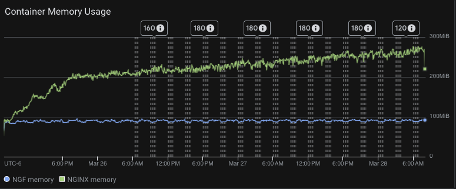
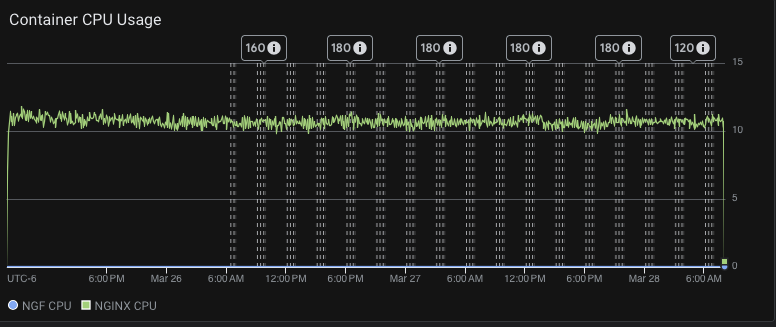

# Results

## Test environment

NGINX Plus: true

NGINX Gateway Fabric:

- Commit: 32f11becf5dee2aeeb0370dae9faba1c056676b9
- Date: 2026-03-25T02:32:18Z
- Dirty: false

GKE Cluster:

- Node count: 3
- k8s version: v1.34.4-gke.1130000
- vCPUs per node: 16
- RAM per node: 64305Mi
- Max pods per node: 110
- Zone: us-west1-b
- Instance Type: n2d-standard-16

## Summary

- Similar traffic numbers to previous results.
- Memory usage increase over time, similar to past results.
- CPU usage is significantly increased, this needs to be looked into.
- Significant number of "no live upstreams" logs from nginx.

## Traffic

HTTP:

```text
Running 4320m test @ http://cafe.example.com/coffee
  2 threads and 100 connections
  Thread Stats   Avg      Stdev     Max   +/- Stdev
    Latency     1.56ms    1.72ms   1.06s    88.23%
    Req/Sec    36.51k     2.92k   67.79k    69.46%
  18826410590 requests in 4320.00m, 2.40TB read
  Socket errors: connect 0, read 3034, write 0, timeout 0
  Non-2xx or 3xx responses: 499
Requests/sec:  72632.74
Transfer/sec:      9.70MB
```

HTTPS:

```text
Running 4320m test @ https://cafe.example.com/tea
  2 threads and 100 connections
  Thread Stats   Avg      Stdev     Max   +/- Stdev
    Latency     2.43ms    2.64ms   1.06s    84.81%
    Req/Sec    22.12k     2.67k   51.31k    78.31%
  11406699399 requests in 4320.00m, 1.45TB read
  Socket errors: connect 1, read 3288, write 0, timeout 0
  Non-2xx or 3xx responses: 410
Requests/sec:  44007.32
Transfer/sec:      5.88MB
```

## Key Metrics

### Containers memory



### Containers CPU



## Error Logs

### nginx-gateway


### nginx
2026/03/28 12:56:04 [error] 55253#55253: *98338420 no live upstreams while connecting to upstream, client: 10.138.0.58, server: cafe.example.com, request: "GET /coffee HTTP/1.1", upstream: "http://longevity_coffee_80/coffee", host: "cafe.example.com"
2026/03/28 12:54:05 [error] 55255#55255: *98292735 no live upstreams while connecting to upstream, client: 10.138.0.58, server: cafe.example.com, request: "GET /coffee HTTP/1.1", upstream: "http://longevity_coffee_80/coffee", host: "cafe.example.com"
2026/03/28 12:54:05 [error] 55245#55245: *98292328 no live upstreams while connecting to upstream, client: 10.138.0.58, server: cafe.example.com, request: "GET /coffee HTTP/1.1", upstream: "http://longevity_coffee_80/coffee", host: "cafe.example.com"
2026/03/28 12:52:06 [error] 55249#55249: *98247141 no live upstreams while connecting to upstream, client: 10.138.0.58, server: cafe.example.com, request: "GET /coffee HTTP/1.1", upstream: "http://longevity_coffee_80/coffee", host: "cafe.example.com"
2026/03/28 12:51:07 [error] 55248#55248: *98225682 no live upstreams while connecting to upstream, client: 10.138.0.58, server: cafe.example.com, request: "GET /coffee HTTP/1.1", upstream: "http://longevity_coffee_80/coffee", host: "cafe.example.com"
2026/03/28 12:50:05 [error] 55259#55259: *98202258 no live upstreams while connecting to upstream, client: 10.138.0.58, server: cafe.example.com, request: "GET /coffee HTTP/1.1", upstream: "http://longevity_coffee_80/coffee", host: "cafe.example.com"
2026/03/28 12:49:04 [error] 55257#55257: *98178847 no live upstreams while connecting to upstream, client: 10.138.0.58, server: cafe.example.com, request: "GET /coffee HTTP/1.1", upstream: "http://longevity_coffee_80/coffee", host: "cafe.example.com"
2026/03/28 12:49:03 [error] 55258#55258: *98178524 no live upstreams while connecting to upstream, client: 10.138.0.58, server: cafe.example.com, request: "GET /coffee HTTP/1.1", upstream: "http://longevity_coffee_80/coffee", host: "cafe.example.com"
2026/03/28 12:48:07 [error] 55259#55259: *98157921 no live upstreams while connecting to upstream, client: 10.138.0.58, server: cafe.example.com, request: "GET /coffee HTTP/1.1", upstream: "http://longevity_coffee_80/coffee", host: "cafe.example.com"
2026/03/28 12:48:07 [error] 55254#55254: *98157957 no live upstreams while connecting to upstream, client: 10.138.0.58, server: cafe.example.com, request: "GET /coffee HTTP/1.1", upstream: "http://longevity_coffee_80/coffee", host: "cafe.example.com"
2026/03/28 12:48:07 [error] 55253#55253: *98157881 no live upstreams while connecting to upstream, client: 10.138.0.58, server: cafe.example.com, request: "GET /coffee HTTP/1.1", upstream: "http://longevity_coffee_80/coffee", host: "cafe.example.com"
2026/03/28 12:48:07 [error] 55248#55248: *98157494 no live upstreams while connecting to upstream, client: 10.138.0.58, server: cafe.example.com, request: "GET /coffee HTTP/1.1", upstream: "http://longevity_coffee_80/coffee", host: "cafe.example.com"
2026/03/28 12:48:07 [error] 55250#55250: *98157832 no live upstreams while connecting to upstream, client: 10.138.0.58, server: cafe.example.com, request: "GET /coffee HTTP/1.1", upstream: "http://longevity_coffee_80/coffee", host: "cafe.example.com"
2026/03/28 12:48:07 [error] 55245#55245: *98157701 no live upstreams while connecting to upstream, client: 10.138.0.58, server: cafe.example.com, request: "GET /coffee HTTP/1.1", upstream: "http://longevity_coffee_80/coffee", host: "cafe.example.com"
2026/03/28 12:48:03 [error] 55244#55244: *98156046 no live upstreams while connecting to upstream, client: 10.138.0.58, server: cafe.example.com, request: "GET /coffee HTTP/1.1", upstream: "http://longevity_coffee_80/coffee", host: "cafe.example.com"
2026/03/28 12:48:03 [error] 55245#55245: *98155969 no live upstreams while connecting to upstream, client: 10.138.0.58, server: cafe.example.com, request: "GET /coffee HTTP/1.1", upstream: "http://longevity_coffee_80/coffee", host: "cafe.example.com"
2026/03/28 12:48:03 [error] 55254#55254: *98156121 no live upstreams while connecting to upstream, client: 10.138.0.58, server: cafe.example.com, request: "GET /coffee HTTP/1.1", upstream: "http://longevity_coffee_80/coffee", host: "cafe.example.com"
2026/03/28 12:47:06 [error] 55249#55249: *98135643 no live upstreams while connecting to upstream, client: 10.138.0.58, server: cafe.example.com, request: "GET /coffee HTTP/1.1", upstream: "http://longevity_coffee_80/coffee", host: "cafe.example.com"
2026/03/28 12:47:04 [error] 55250#55250: *98134539 no live upstreams while connecting to upstream, client: 10.138.0.58, server: cafe.example.com, request: "GET /coffee HTTP/1.1", upstream: "http://longevity_coffee_80/coffee", host: "cafe.example.com"
2026/03/28 12:47:04 [error] 55257#55257: *98134627 no live upstreams while connecting to upstream, client: 10.138.0.58, server: cafe.example.com, request: "GET /coffee HTTP/1.1", upstream: "http://longevity_coffee_80/coffee", host: "cafe.example.com"
2026/03/28 12:44:03 [error] 55260#55260: *98067637 no live upstreams while connecting to upstream, client: 10.138.0.58, server: cafe.example.com, request: "GET /coffee HTTP/1.1", upstream: "http://longevity_coffee_80/coffee", host: "cafe.example.com"
2026/03/28 12:40:03 [error] 55252#55252: *97974514 no live upstreams while connecting to upstream, client: 10.138.0.58, server: cafe.example.com, request: "GET /coffee HTTP/1.1", upstream: "http://longevity_coffee_80/coffee", host: "cafe.example.com"
2026/03/28 12:40:03 [error] 55248#55248: *97974635 no live upstreams while connecting to upstream, client: 10.138.0.58, server: cafe.example.com, request: "GET /coffee HTTP/1.1", upstream: "http://longevity_coffee_80/coffee", host: "cafe.example.com"
2026/03/28 12:39:05 [error] 55260#55260: *97951202 no live upstreams while connecting to upstream, client: 10.138.0.58, server: cafe.example.com, request: "GET /coffee HTTP/1.1", upstream: "http://longevity_coffee_80/coffee", host: "cafe.example.com"
2026/03/28 12:39:05 [error] 55248#55248: *97950744 no live upstreams while connecting to upstream, client: 10.138.0.58, server: cafe.example.com, request: "GET /coffee HTTP/1.1", upstream: "http://longevity_coffee_80/coffee", host: "cafe.example.com"
2026/03/28 12:38:03 [error] 55254#55254: *97926627 no live upstreams while connecting to upstream, client: 10.138.0.58, server: cafe.example.com, request: "GET /coffee HTTP/1.1", upstream: "http://longevity_coffee_80/coffee", host: "cafe.example.com"
2026/03/28 12:38:02 [error] 55256#55256: *97925984 no live upstreams while connecting to upstream, client: 10.138.0.58, server: cafe.example.com, request: "GET /coffee HTTP/1.1", upstream: "http://longevity_coffee_80/coffee", host: "cafe.example.com"
2026/03/28 12:36:02 [error] 55258#55258: *97880289 no live upstreams while connecting to upstream, client: 10.138.0.58, server: cafe.example.com, request: "GET /coffee HTTP/1.1", upstream: "http://longevity_coffee_80/coffee", host: "cafe.example.com"
2026/03/28 12:36:02 [error] 55245#55245: *97880772 no live upstreams while connecting to upstream, client: 10.138.0.58, server: cafe.example.com, request: "GET /coffee HTTP/1.1", upstream: "http://longevity_coffee_80/coffee", host: "cafe.example.com"
2026/03/28 12:32:07 [error] 55250#55250: *97786198 no live upstreams while connecting to upstream, client: 10.138.0.58, server: cafe.example.com, request: "GET /coffee HTTP/1.1", upstream: "http://longevity_coffee_80/coffee", host: "cafe.example.com"
2026/03/28 12:32:07 [error] 55251#55251: *97786158 no live upstreams while connecting to upstream, client: 10.138.0.58, server: cafe.example.com, request: "GET /coffee HTTP/1.1", upstream: "http://longevity_coffee_80/coffee", host: "cafe.example.com"
2026/03/28 12:32:07 [error] 55253#55253: *97786187 no live upstreams while connecting to upstream, client: 10.138.0.58, server: cafe.example.com, request: "GET /coffee HTTP/1.1", upstream: "http://longevity_coffee_80/coffee", host: "cafe.example.com"
2026/03/28 12:29:02 [error] 55244#55244: *97713760 no live upstreams while connecting to upstream, client: 10.138.0.58, server: cafe.example.com, request: "GET /coffee HTTP/1.1", upstream: "http://longevity_coffee_80/coffee", host: "cafe.example.com"
2026/03/28 12:28:07 [error] 55250#55250: *97692407 no live upstreams while connecting to upstream, client: 10.138.0.58, server: cafe.example.com, request: "GET /coffee HTTP/1.1", upstream: "http://longevity_coffee_80/coffee", host: "cafe.example.com"
2026/03/28 12:27:03 [error] 55247#55247: *97668558 no live upstreams while connecting to upstream, client: 10.138.0.58, server: cafe.example.com, request: "GET /coffee HTTP/1.1", upstream: "http://longevity_coffee_80/coffee", host: "cafe.example.com"
2026/03/28 12:27:03 [error] 55260#55260: *97668497 no live upstreams while connecting to upstream, client: 10.138.0.58, server: cafe.example.com, request: "GET /coffee HTTP/1.1", upstream: "http://longevity_coffee_80/coffee", host: "cafe.example.com"
2026/03/28 12:24:04 [error] 54601#54601: *97600011 no live upstreams while connecting to upstream, client: 10.138.0.58, server: cafe.example.com, request: "GET /coffee HTTP/1.1", upstream: "http://longevity_coffee_80/coffee", host: "cafe.example.com"
2026/03/28 12:22:05 [error] 54601#54601: *97556451 no live upstreams while connecting to upstream, client: 10.138.0.58, server: cafe.example.com, request: "GET /coffee HTTP/1.1", upstream: "http://longevity_coffee_80/coffee", host: "cafe.example.com"
2026/03/28 12:20:07 [error] 54597#54597: *97513176 no live upstreams while connecting to upstream, client: 10.138.0.58, server: cafe.example.com, request: "GET /coffee HTTP/1.1", upstream: "http://longevity_coffee_80/coffee", host: "cafe.example.com"
2026/03/28 12:19:03 [error] 54606#54606: *97489208 no live upstreams while connecting to upstream, client: 10.138.0.58, server: cafe.example.com, request: "GET /coffee HTTP/1.1", upstream: "http://longevity_coffee_80/coffee", host: "cafe.example.com"
2026/03/28 12:19:03 [error] 54591#54591: *97489258 no live upstreams while connecting to upstream, client: 10.138.0.58, server: cafe.example.com, request: "GET /coffee HTTP/1.1", upstream: "http://longevity_coffee_80/coffee", host: "cafe.example.com"
2026/03/28 12:16:03 [error] 54591#54591: *97422344 no live upstreams while connecting to upstream, client: 10.138.0.58, server: cafe.example.com, request: "GET /coffee HTTP/1.1", upstream: "http://longevity_coffee_80/coffee", host: "cafe.example.com"
2026/03/28 12:12:05 [error] 54596#54596: *97332423 no live upstreams while connecting to upstream, client: 10.138.0.58, server: cafe.example.com, request: "GET /coffee HTTP/1.1", upstream: "http://longevity_coffee_80/coffee", host: "cafe.example.com"
2026/03/28 12:11:04 [error] 54591#54591: *97308587 no live upstreams while connecting to upstream, client: 10.138.0.58, server: cafe.example.com, request: "GET /coffee HTTP/1.1", upstream: "http://longevity_coffee_80/coffee", host: "cafe.example.com"
2026/03/28 12:11:04 [error] 54607#54607: *97308380 no live upstreams while connecting to upstream, client: 10.138.0.58, server: cafe.example.com, request: "GET /coffee HTTP/1.1", upstream: "http://longevity_coffee_80/coffee", host: "cafe.example.com"
2026/03/28 12:10:05 [error] 54594#54594: *97286519 no live upstreams while connecting to upstream, client: 10.138.0.58, server: cafe.example.com, request: "GET /coffee HTTP/1.1", upstream: "http://longevity_coffee_80/coffee", host: "cafe.example.com"
2026/03/28 12:10:05 [error] 54599#54599: *97286457 no live upstreams while connecting to upstream, client: 10.138.0.58, server: cafe.example.com, request: "GET /coffee HTTP/1.1", upstream: "http://longevity_coffee_80/coffee", host: "cafe.example.com"
2026/03/28 12:10:05 [error] 54605#54605: *97286525 no live upstreams while connecting to upstream, client: 10.138.0.58, server: cafe.example.com, request: "GET /coffee HTTP/1.1", upstream: "http://longevity_coffee_80/coffee", host: "cafe.example.com"
2026/03/28 12:07:06 [error] 54595#54595: *97216766 no live upstreams while connecting to upstream, client: 10.138.0.58, server: cafe.example.com, request: "GET /coffee HTTP/1.1", upstream: "http://longevity_coffee_80/coffee", host: "cafe.example.com"
2026/03/28 12:06:03 [error] 54604#54604: *97189537 no live upstreams while connecting to upstream, client: 10.138.0.58, server: cafe.example.com, request: "GET /coffee HTTP/1.1", upstream: "http://longevity_coffee_80/coffee", host: "cafe.example.com"
2026/03/28 12:05:05 [error] 54596#54596: *97165829 no live upstreams while connecting to upstream, client: 10.138.0.58, server: cafe.example.com, request: "GET /coffee HTTP/1.1", upstream: "http://longevity_coffee_80/coffee", host: "cafe.example.com"
2026/03/28 12:01:03 [error] 54600#54600: *97066695 no live upstreams while connecting to upstream, client: 10.138.0.58, server: cafe.example.com, request: "GET /coffee HTTP/1.1", upstream: "http://longevity_coffee_80/coffee", host: "cafe.example.com"
2026/03/28 12:01:03 [error] 54606#54606: *97066431 no live upstreams while connecting to upstream, client: 10.138.0.58, server: cafe.example.com, request: "GET /coffee HTTP/1.1", upstream: "http://longevity_coffee_80/coffee", host: "cafe.example.com"
2026/03/28 12:00:07 [error] 54598#54598: *97044550 no live upstreams while connecting to upstream, client: 10.138.0.58, server: cafe.example.com, request: "GET /coffee HTTP/1.1", upstream: "http://longevity_coffee_80/coffee", host: "cafe.example.com"
2026/03/28 12:00:03 [error] 54598#54598: *97042453 no live upstreams while connecting to upstream, client: 10.138.0.58, server: cafe.example.com, request: "GET /coffee HTTP/1.1", upstream: "http://longevity_coffee_80/coffee", host: "cafe.example.com"
2026/03/28 09:59:06 [error] 52029#52029: *94240751 no live upstreams while connecting to upstream, client: 10.138.0.58, server: cafe.example.com, request: "GET /tea HTTP/1.1", upstream: "http://longevity_tea_80/tea", host: "cafe.example.com"
2026/03/28 09:59:06 [error] 52021#52021: *94240497 no live upstreams while connecting to upstream, client: 10.138.0.58, server: cafe.example.com, request: "GET /tea HTTP/1.1", upstream: "http://longevity_tea_80/tea", host: "cafe.example.com"
2026/03/28 09:59:04 [error] 52028#52028: *94239996 no live upstreams while connecting to upstream, client: 10.138.0.58, server: cafe.example.com, request: "GET /tea HTTP/1.1", upstream: "http://longevity_tea_80/tea", host: "cafe.example.com"
2026/03/28 09:56:05 [error] 52023#52023: *94172667 no live upstreams while connecting to upstream, client: 10.138.0.58, server: cafe.example.com, request: "GET /tea HTTP/1.1", upstream: "http://longevity_tea_80/tea", host: "cafe.example.com"
2026/03/28 09:56:05 [error] 52029#52029: *94172620 no live upstreams while connecting to upstream, client: 10.138.0.58, server: cafe.example.com, request: "GET /tea HTTP/1.1", upstream: "http://longevity_tea_80/tea", host: "cafe.example.com"
2026/03/28 09:55:03 [error] 52036#52036: *94148528 no live upstreams while connecting to upstream, client: 10.138.0.58, server: cafe.example.com, request: "GET /tea HTTP/1.1", upstream: "http://longevity_tea_80/tea", host: "cafe.example.com"
2026/03/28 09:50:02 [error] 52034#52034: *94030113 no live upstreams while connecting to upstream, client: 10.138.0.58, server: cafe.example.com, request: "GET /tea HTTP/1.1", upstream: "http://longevity_tea_80/tea", host: "cafe.example.com"
2026/03/28 09:48:04 [error] 52033#52033: *93984568 no live upstreams while connecting to upstream, client: 10.138.0.58, server: cafe.example.com, request: "GET /tea HTTP/1.1", upstream: "http://longevity_tea_80/tea", host: "cafe.example.com"
2026/03/28 09:48:04 [error] 52023#52023: *93983897 no live upstreams while connecting to upstream, client: 10.138.0.58, server: cafe.example.com, request: "GET /tea HTTP/1.1", upstream: "http://longevity_tea_80/tea", host: "cafe.example.com"
2026/03/28 09:48:03 [error] 52031#52031: *93983314 no live upstreams while connecting to upstream, client: 10.138.0.58, server: cafe.example.com, request: "GET /tea HTTP/1.1", upstream: "http://longevity_tea_80/tea", host: "cafe.example.com"
2026/03/28 09:46:02 [error] 52029#52029: *93935812 no live upstreams while connecting to upstream, client: 10.138.0.58, server: cafe.example.com, request: "GET /tea HTTP/1.1", upstream: "http://longevity_tea_80/tea", host: "cafe.example.com"
2026/03/28 09:46:02 [error] 52033#52033: *93936062 no live upstreams while connecting to upstream, client: 10.138.0.58, server: cafe.example.com, request: "GET /tea HTTP/1.1", upstream: "http://longevity_tea_80/tea", host: "cafe.example.com"
2026/03/28 09:46:02 [error] 52035#52035: *93936612 no live upstreams while connecting to upstream, client: 10.138.0.58, server: cafe.example.com, request: "GET /tea HTTP/1.1", upstream: "http://longevity_tea_80/tea", host: "cafe.example.com"
2026/03/28 09:44:02 [error] 52032#52032: *93891269 no live upstreams while connecting to upstream, client: 10.138.0.58, server: cafe.example.com, request: "GET /tea HTTP/1.1", upstream: "http://longevity_tea_80/tea", host: "cafe.example.com"
2026/03/28 09:37:03 [error] 52026#52026: *93730924 no live upstreams while connecting to upstream, client: 10.138.0.58, server: cafe.example.com, request: "GET /tea HTTP/1.1", upstream: "http://longevity_tea_80/tea", host: "cafe.example.com"
2026/03/28 09:30:05 [error] 52034#52034: *93571454 no live upstreams while connecting to upstream, client: 10.138.0.58, server: cafe.example.com, request: "GET /tea HTTP/1.1", upstream: "http://longevity_tea_80/tea", host: "cafe.example.com"
2026/03/28 09:27:02 [error] 52027#52027: *93499826 no live upstreams while connecting to upstream, client: 10.138.0.58, server: cafe.example.com, request: "GET /tea HTTP/1.1", upstream: "http://longevity_tea_80/tea", host: "cafe.example.com"
2026/03/28 09:27:02 [error] 52025#52025: *93499794 no live upstreams while connecting to upstream, client: 10.138.0.58, server: cafe.example.com, request: "GET /tea HTTP/1.1", upstream: "http://longevity_tea_80/tea", host: "cafe.example.com"
2026/03/28 09:26:03 [error] 52029#52029: *93476968 no live upstreams while connecting to upstream, client: 10.138.0.58, server: cafe.example.com, request: "GET /tea HTTP/1.1", upstream: "http://longevity_tea_80/tea", host: "cafe.example.com"
2026/03/28 09:25:02 [error] 52030#52030: *93453450 no live upstreams while connecting to upstream, client: 10.138.0.58, server: cafe.example.com, request: "GET /tea HTTP/1.1", upstream: "http://longevity_tea_80/tea", host: "cafe.example.com"
2026/03/28 09:23:04 [error] 52028#52028: *93407878 no live upstreams while connecting to upstream, client: 10.138.0.58, server: cafe.example.com, request: "GET /tea HTTP/1.1", upstream: "http://longevity_tea_80/tea", host: "cafe.example.com"
2026/03/28 09:15:05 [error] 52032#52032: *93223581 no live upstreams while connecting to upstream, client: 10.138.0.58, server: cafe.example.com, request: "GET /tea HTTP/1.1", upstream: "http://longevity_tea_80/tea", host: "cafe.example.com"
2026/03/28 09:14:02 [error] 52031#52031: *93200011 no live upstreams while connecting to upstream, client: 10.138.0.58, server: cafe.example.com, request: "GET /tea HTTP/1.1", upstream: "http://longevity_tea_80/tea", host: "cafe.example.com"
2026/03/28 09:11:04 [error] 52031#52031: *93130430 no live upstreams while connecting to upstream, client: 10.138.0.58, server: cafe.example.com, request: "GET /tea HTTP/1.1", upstream: "http://longevity_tea_80/tea", host: "cafe.example.com"
2026/03/28 09:11:04 [error] 52025#52025: *93130281 no live upstreams while connecting to upstream, client: 10.138.0.58, server: cafe.example.com, request: "GET /tea HTTP/1.1", upstream: "http://longevity_tea_80/tea", host: "cafe.example.com"
2026/03/28 09:11:04 [error] 52023#52023: *93130891 no live upstreams while connecting to upstream, client: 10.138.0.58, server: cafe.example.com, request: "GET /tea HTTP/1.1", upstream: "http://longevity_tea_80/tea", host: "cafe.example.com"
2026/03/28 09:11:04 [error] 52035#52035: *93130850 no live upstreams while connecting to upstream, client: 10.138.0.58, server: cafe.example.com, request: "GET /tea HTTP/1.1", upstream: "http://longevity_tea_80/tea", host: "cafe.example.com"
2026/03/28 09:10:05 [error] 52026#52026: *93107831 no live upstreams while connecting to upstream, client: 10.138.0.58, server: cafe.example.com, request: "GET /tea HTTP/1.1", upstream: "http://longevity_tea_80/tea", host: "cafe.example.com"
2026/03/28 09:08:07 [error] 52027#52027: *93061474 no live upstreams while connecting to upstream, client: 10.138.0.58, server: cafe.example.com, request: "GET /tea HTTP/1.1", upstream: "http://longevity_tea_80/tea", host: "cafe.example.com"
2026/03/28 09:07:02 [error] 52024#52024: *93036666 no live upstreams while connecting to upstream, client: 10.138.0.58, server: cafe.example.com, request: "GET /tea HTTP/1.1", upstream: "http://longevity_tea_80/tea", host: "cafe.example.com"
2026/03/28 09:02:04 [error] 52034#52034: *92919228 no live upstreams while connecting to upstream, client: 10.138.0.58, server: cafe.example.com, request: "GET /tea HTTP/1.1", upstream: "http://longevity_tea_80/tea", host: "cafe.example.com"
2026/03/28 09:01:05 [error] 52020#52020: *92896970 no live upstreams while connecting to upstream, client: 10.138.0.58, server: cafe.example.com, request: "GET /tea HTTP/1.1", upstream: "http://longevity_tea_80/tea", host: "cafe.example.com"
2026/03/28 09:01:02 [error] 52031#52031: *92895855 no live upstreams while connecting to upstream, client: 10.138.0.58, server: cafe.example.com, request: "GET /tea HTTP/1.1", upstream: "http://longevity_tea_80/tea", host: "cafe.example.com"
2026/03/28 06:59:07 [error] 50124#50124: *90117614 no live upstreams while connecting to upstream, client: 10.138.0.58, server: cafe.example.com, request: "GET /coffee HTTP/1.1", upstream: "http://longevity_coffee_80/coffee", host: "cafe.example.com"
2026/03/28 06:58:07 [error] 50115#50115: *90094784 no live upstreams while connecting to upstream, client: 10.138.0.58, server: cafe.example.com, request: "GET /coffee HTTP/1.1", upstream: "http://longevity_coffee_80/coffee", host: "cafe.example.com"
2026/03/28 06:58:04 [error] 50112#50112: *90093926 no live upstreams while connecting to upstream, client: 10.138.0.58, server: cafe.example.com, request: "GET /coffee HTTP/1.1", upstream: "http://longevity_coffee_80/coffee", host: "cafe.example.com"
2026/03/28 06:56:03 [error] 50120#50120: *90045980 no live upstreams while connecting to upstream, client: 10.138.0.58, server: cafe.example.com, request: "GET /coffee HTTP/1.1", upstream: "http://longevity_coffee_80/coffee", host: "cafe.example.com"
2026/03/28 06:56:03 [error] 50116#50116: *90045614 no live upstreams while connecting to upstream, client: 10.138.0.58, server: cafe.example.com, request: "GET /coffee HTTP/1.1", upstream: "http://longevity_coffee_80/coffee", host: "cafe.example.com"
2026/03/28 06:56:03 [error] 50126#50126: *90045503 no live upstreams while connecting to upstream, client: 10.138.0.58, server: cafe.example.com, request: "GET /coffee HTTP/1.1", upstream: "http://longevity_coffee_80/coffee", host: "cafe.example.com"
2026/03/28 06:54:04 [error] 50122#50122: *89998861 no live upstreams while connecting to upstream, client: 10.138.0.58, server: cafe.example.com, request: "GET /coffee HTTP/1.1", upstream: "http://longevity_coffee_80/coffee", host: "cafe.example.com"
2026/03/28 06:54:03 [error] 50118#50118: *89998048 no live upstreams while connecting to upstream, client: 10.138.0.58, server: cafe.example.com, request: "GET /coffee HTTP/1.1", upstream: "http://longevity_coffee_80/coffee", host: "cafe.example.com"
2026/03/28 06:53:04 [error] 50121#50121: *89974923 no live upstreams while connecting to upstream, client: 10.138.0.58, server: cafe.example.com, request: "GET /coffee HTTP/1.1", upstream: "http://longevity_coffee_80/coffee", host: "cafe.example.com"
2026/03/28 06:49:03 [error] 50123#50123: *89882812 no live upstreams while connecting to upstream, client: 10.138.0.58, server: cafe.example.com, request: "GET /coffee HTTP/1.1", upstream: "http://longevity_coffee_80/coffee", host: "cafe.example.com"
2026/03/28 06:42:03 [error] 50120#50120: *89720709 no live upstreams while connecting to upstream, client: 10.138.0.58, server: cafe.example.com, request: "GET /coffee HTTP/1.1", upstream: "http://longevity_coffee_80/coffee", host: "cafe.example.com"
2026/03/28 06:42:03 [error] 50125#50125: *89720845 no live upstreams while connecting to upstream, client: 10.138.0.58, server: cafe.example.com, request: "GET /coffee HTTP/1.1", upstream: "http://longevity_coffee_80/coffee", host: "cafe.example.com"
2026/03/28 06:41:03 [error] 50125#50125: *89698816 no live upstreams while connecting to upstream, client: 10.138.0.58, server: cafe.example.com, request: "GET /coffee HTTP/1.1", upstream: "http://longevity_coffee_80/coffee", host: "cafe.example.com"
2026/03/28 06:41:02 [error] 50116#50116: *89698010 no live upstreams while connecting to upstream, client: 10.138.0.58, server: cafe.example.com, request: "GET /coffee HTTP/1.1", upstream: "http://longevity_coffee_80/coffee", host: "cafe.example.com"
2026/03/28 06:40:07 [error] 50124#50124: *89676715 no live upstreams while connecting to upstream, client: 10.138.0.58, server: cafe.example.com, request: "GET /coffee HTTP/1.1", upstream: "http://longevity_coffee_80/coffee", host: "cafe.example.com"
2026/03/28 06:40:05 [error] 50123#50123: *89676010 no live upstreams while connecting to upstream, client: 10.138.0.58, server: cafe.example.com, request: "GET /coffee HTTP/1.1", upstream: "http://longevity_coffee_80/coffee", host: "cafe.example.com"
2026/03/28 06:39:03 [error] 50111#50111: *89652635 no live upstreams while connecting to upstream, client: 10.138.0.58, server: cafe.example.com, request: "GET /coffee HTTP/1.1", upstream: "http://longevity_coffee_80/coffee", host: "cafe.example.com"
2026/03/28 06:38:04 [error] 50111#50111: *89629987 no live upstreams while connecting to upstream, client: 10.138.0.58, server: cafe.example.com, request: "GET /coffee HTTP/1.1", upstream: "http://longevity_coffee_80/coffee", host: "cafe.example.com"
2026/03/28 06:38:02 [error] 50127#50127: *89629399 no live upstreams while connecting to upstream, client: 10.138.0.58, server: cafe.example.com, request: "GET /coffee HTTP/1.1", upstream: "http://longevity_coffee_80/coffee", host: "cafe.example.com"
2026/03/28 06:38:02 [error] 50120#50120: *89629379 no live upstreams while connecting to upstream, client: 10.138.0.58, server: cafe.example.com, request: "GET /coffee HTTP/1.1", upstream: "http://longevity_coffee_80/coffee", host: "cafe.example.com"
2026/03/28 06:38:02 [error] 50119#50119: *89629302 no live upstreams while connecting to upstream, client: 10.138.0.58, server: cafe.example.com, request: "GET /coffee HTTP/1.1", upstream: "http://longevity_coffee_80/coffee", host: "cafe.example.com"
2026/03/28 06:36:02 [error] 50122#50122: *89581909 no live upstreams while connecting to upstream, client: 10.138.0.58, server: cafe.example.com, request: "GET /coffee HTTP/1.1", upstream: "http://longevity_coffee_80/coffee", host: "cafe.example.com"
2026/03/28 06:35:05 [error] 50119#50119: *89559577 no live upstreams while connecting to upstream, client: 10.138.0.58, server: cafe.example.com, request: "GET /coffee HTTP/1.1", upstream: "http://longevity_coffee_80/coffee", host: "cafe.example.com"
2026/03/28 06:35:04 [error] 50124#50124: *89559624 no live upstreams while connecting to upstream, client: 10.138.0.58, server: cafe.example.com, request: "GET /coffee HTTP/1.1", upstream: "http://longevity_coffee_80/coffee", host: "cafe.example.com"
2026/03/28 06:29:05 [error] 50126#50126: *89418120 no live upstreams while connecting to upstream, client: 10.138.0.58, server: cafe.example.com, request: "GET /coffee HTTP/1.1", upstream: "http://longevity_coffee_80/coffee", host: "cafe.example.com"
2026/03/28 06:29:05 [error] 50125#50125: *89418599 no live upstreams while connecting to upstream, client: 10.138.0.58, server: cafe.example.com, request: "GET /coffee HTTP/1.1", upstream: "http://longevity_coffee_80/coffee", host: "cafe.example.com"
2026/03/28 06:29:05 [error] 50120#50120: *89418257 no live upstreams while connecting to upstream, client: 10.138.0.58, server: cafe.example.com, request: "GET /coffee HTTP/1.1", upstream: "http://longevity_coffee_80/coffee", host: "cafe.example.com"
2026/03/28 06:26:05 [error] 50125#50125: *89346588 no live upstreams while connecting to upstream, client: 10.138.0.58, server: cafe.example.com, request: "GET /coffee HTTP/1.1", upstream: "http://longevity_coffee_80/coffee", host: "cafe.example.com"
2026/03/28 06:26:04 [error] 50116#50116: *89346482 no live upstreams while connecting to upstream, client: 10.138.0.58, server: cafe.example.com, request: "GET /coffee HTTP/1.1", upstream: "http://longevity_coffee_80/coffee", host: "cafe.example.com"
2026/03/28 06:25:04 [error] 50114#50114: *89322207 no live upstreams while connecting to upstream, client: 10.138.0.58, server: cafe.example.com, request: "GET /coffee HTTP/1.1", upstream: "http://longevity_coffee_80/coffee", host: "cafe.example.com"
2026/03/28 06:22:07 [error] 50126#50126: *89253799 no live upstreams while connecting to upstream, client: 10.138.0.58, server: cafe.example.com, request: "GET /coffee HTTP/1.1", upstream: "http://longevity_coffee_80/coffee", host: "cafe.example.com"
2026/03/28 06:22:04 [error] 50121#50121: *89252820 no live upstreams while connecting to upstream, client: 10.138.0.58, server: cafe.example.com, request: "GET /coffee HTTP/1.1", upstream: "http://longevity_coffee_80/coffee", host: "cafe.example.com"
2026/03/28 06:20:05 [error] 50115#50115: *89207819 no live upstreams while connecting to upstream, client: 10.138.0.58, server: cafe.example.com, request: "GET /coffee HTTP/1.1", upstream: "http://longevity_coffee_80/coffee", host: "cafe.example.com"
2026/03/28 06:15:02 [error] 50125#50125: *89089860 no live upstreams while connecting to upstream, client: 10.138.0.58, server: cafe.example.com, request: "GET /coffee HTTP/1.1", upstream: "http://longevity_coffee_80/coffee", host: "cafe.example.com"
2026/03/28 06:15:02 [error] 50124#50124: *89090252 no live upstreams while connecting to upstream, client: 10.138.0.58, server: cafe.example.com, request: "GET /coffee HTTP/1.1", upstream: "http://longevity_coffee_80/coffee", host: "cafe.example.com"
2026/03/28 06:12:13 [error] 50116#50116: *89024689 no live upstreams while connecting to upstream, client: 10.138.0.58, server: cafe.example.com, request: "GET /coffee HTTP/1.1", upstream: "http://longevity_coffee_80/coffee", host: "cafe.example.com"
2026/03/28 06:03:07 [error] 50112#50112: *88818667 no live upstreams while connecting to upstream, client: 10.138.0.58, server: cafe.example.com, request: "GET /coffee HTTP/1.1", upstream: "http://longevity_coffee_80/coffee", host: "cafe.example.com"
2026/03/28 06:00:06 [error] 50125#50125: *88749804 no live upstreams while connecting to upstream, client: 10.138.0.58, server: cafe.example.com, request: "GET /coffee HTTP/1.1", upstream: "http://longevity_coffee_80/coffee", host: "cafe.example.com"
2026/03/28 06:00:02 [error] 50114#50114: *88748075 no live upstreams while connecting to upstream, client: 10.138.0.58, server: cafe.example.com, request: "GET /coffee HTTP/1.1", upstream: "http://longevity_coffee_80/coffee", host: "cafe.example.com"
2026/03/28 03:58:16 [error] 47539#47539: *85983191 no live upstreams while connecting to upstream, client: 10.138.0.58, server: cafe.example.com, request: "GET /tea HTTP/1.1", upstream: "http://longevity_tea_80/tea", host: "cafe.example.com"
2026/03/28 03:58:16 [error] 47535#47535: *85983619 no live upstreams while connecting to upstream, client: 10.138.0.58, server: cafe.example.com, request: "GET /tea HTTP/1.1", upstream: "http://longevity_tea_80/tea", host: "cafe.example.com"
2026/03/28 03:54:04 [error] 47533#47533: *85886544 no live upstreams while connecting to upstream, client: 10.138.0.58, server: cafe.example.com, request: "GET /tea HTTP/1.1", upstream: "http://longevity_tea_80/tea", host: "cafe.example.com"
2026/03/28 03:52:02 [error] 47534#47534: *85839995 no live upstreams while connecting to upstream, client: 10.138.0.58, server: cafe.example.com, request: "GET /tea HTTP/1.1", upstream: "http://longevity_tea_80/tea", host: "cafe.example.com"
2026/03/28 03:51:05 [error] 47525#47525: *85818423 no live upstreams while connecting to upstream, client: 10.138.0.58, server: cafe.example.com, request: "GET /tea HTTP/1.1", upstream: "http://longevity_tea_80/tea", host: "cafe.example.com"
2026/03/28 03:47:05 [error] 47525#47525: *85726262 no live upstreams while connecting to upstream, client: 10.138.0.58, server: cafe.example.com, request: "GET /tea HTTP/1.1", upstream: "http://longevity_tea_80/tea", host: "cafe.example.com"
2026/03/28 03:46:03 [error] 47536#47536: *85701625 no live upstreams while connecting to upstream, client: 10.138.0.58, server: cafe.example.com, request: "GET /tea HTTP/1.1", upstream: "http://longevity_tea_80/tea", host: "cafe.example.com"
2026/03/28 03:45:04 [error] 47530#47530: *85679715 no live upstreams while connecting to upstream, client: 10.138.0.58, server: cafe.example.com, request: "GET /tea HTTP/1.1", upstream: "http://longevity_tea_80/tea", host: "cafe.example.com"
2026/03/28 03:44:07 [error] 47533#47533: *85657665 no live upstreams while connecting to upstream, client: 10.138.0.58, server: cafe.example.com, request: "GET /tea HTTP/1.1", upstream: "http://longevity_tea_80/tea", host: "cafe.example.com"
2026/03/28 03:44:04 [error] 47539#47539: *85657295 no live upstreams while connecting to upstream, client: 10.138.0.58, server: cafe.example.com, request: "GET /tea HTTP/1.1", upstream: "http://longevity_tea_80/tea", host: "cafe.example.com"
2026/03/28 03:42:02 [error] 47535#47535: *85610770 no live upstreams while connecting to upstream, client: 10.138.0.58, server: cafe.example.com, request: "GET /tea HTTP/1.1", upstream: "http://longevity_tea_80/tea", host: "cafe.example.com"
2026/03/28 03:41:06 [error] 47531#47531: *85589996 no live upstreams while connecting to upstream, client: 10.138.0.58, server: cafe.example.com, request: "GET /tea HTTP/1.1", upstream: "http://longevity_tea_80/tea", host: "cafe.example.com"
2026/03/28 03:37:03 [error] 47541#47541: *85496605 no live upstreams while connecting to upstream, client: 10.138.0.58, server: cafe.example.com, request: "GET /tea HTTP/1.1", upstream: "http://longevity_tea_80/tea", host: "cafe.example.com"
2026/03/28 03:31:04 [error] 47541#47541: *85362179 no live upstreams while connecting to upstream, client: 10.138.0.58, server: cafe.example.com, request: "GET /tea HTTP/1.1", upstream: "http://longevity_tea_80/tea", host: "cafe.example.com"
2026/03/28 03:31:04 [error] 47530#47530: *85362812 no live upstreams while connecting to upstream, client: 10.138.0.58, server: cafe.example.com, request: "GET /tea HTTP/1.1", upstream: "http://longevity_tea_80/tea", host: "cafe.example.com"
2026/03/28 03:31:04 [error] 47528#47528: *85361981 no live upstreams while connecting to upstream, client: 10.138.0.58, server: cafe.example.com, request: "GET /tea HTTP/1.1", upstream: "http://longevity_tea_80/tea", host: "cafe.example.com"
2026/03/28 03:31:04 [error] 47534#47534: *85362616 no live upstreams while connecting to upstream, client: 10.138.0.58, server: cafe.example.com, request: "GET /tea HTTP/1.1", upstream: "http://longevity_tea_80/tea", host: "cafe.example.com"
2026/03/28 03:28:02 [error] 47528#47528: *85292287 no live upstreams while connecting to upstream, client: 10.138.0.58, server: cafe.example.com, request: "GET /tea HTTP/1.1", upstream: "http://longevity_tea_80/tea", host: "cafe.example.com"
2026/03/28 03:27:05 [error] 47538#47538: *85269777 no live upstreams while connecting to upstream, client: 10.138.0.58, server: cafe.example.com, request: "GET /tea HTTP/1.1", upstream: "http://longevity_tea_80/tea", host: "cafe.example.com"
2026/03/28 03:26:04 [error] 47530#47530: *85245397 no live upstreams while connecting to upstream, client: 10.138.0.58, server: cafe.example.com, request: "GET /tea HTTP/1.1", upstream: "http://longevity_tea_80/tea", host: "cafe.example.com"
2026/03/28 03:26:04 [error] 47532#47532: *85245643 no live upstreams while connecting to upstream, client: 10.138.0.58, server: cafe.example.com, request: "GET /tea HTTP/1.1", upstream: "http://longevity_tea_80/tea", host: "cafe.example.com"
2026/03/28 03:25:04 [error] 47530#47530: *85221932 no live upstreams while connecting to upstream, client: 10.138.0.58, server: cafe.example.com, request: "GET /tea HTTP/1.1", upstream: "http://longevity_tea_80/tea", host: "cafe.example.com"
2026/03/28 03:25:04 [error] 47540#47540: *85222814 no live upstreams while connecting to upstream, client: 10.138.0.58, server: cafe.example.com, request: "GET /tea HTTP/1.1", upstream: "http://longevity_tea_80/tea", host: "cafe.example.com"
2026/03/28 03:25:04 [error] 47538#47538: *85222081 no live upstreams while connecting to upstream, client: 10.138.0.58, server: cafe.example.com, request: "GET /tea HTTP/1.1", upstream: "http://longevity_tea_80/tea", host: "cafe.example.com"
2026/03/28 03:23:02 [error] 47530#47530: *85175475 no live upstreams while connecting to upstream, client: 10.138.0.58, server: cafe.example.com, request: "GET /tea HTTP/1.1", upstream: "http://longevity_tea_80/tea", host: "cafe.example.com"
2026/03/28 03:22:04 [error] 47540#47540: *85151379 no live upstreams while connecting to upstream, client: 10.138.0.58, server: cafe.example.com, request: "GET /tea HTTP/1.1", upstream: "http://longevity_tea_80/tea", host: "cafe.example.com"
2026/03/28 03:22:04 [error] 47531#47531: *85151557 no live upstreams while connecting to upstream, client: 10.138.0.58, server: cafe.example.com, request: "GET /tea HTTP/1.1", upstream: "http://longevity_tea_80/tea", host: "cafe.example.com"
2026/03/28 03:22:03 [error] 47539#47539: *85150813 no live upstreams while connecting to upstream, client: 10.138.0.58, server: cafe.example.com, request: "GET /tea HTTP/1.1", upstream: "http://longevity_tea_80/tea", host: "cafe.example.com"
2026/03/28 03:22:03 [error] 47526#47526: *85150512 no live upstreams while connecting to upstream, client: 10.138.0.58, server: cafe.example.com, request: "GET /tea HTTP/1.1", upstream: "http://longevity_tea_80/tea", host: "cafe.example.com"
2026/03/28 03:20:04 [error] 47533#47533: *85104905 no live upstreams while connecting to upstream, client: 10.138.0.58, server: cafe.example.com, request: "GET /tea HTTP/1.1", upstream: "http://longevity_tea_80/tea", host: "cafe.example.com"
2026/03/28 03:18:02 [error] 47535#47535: *85057668 no live upstreams while connecting to upstream, client: 10.138.0.58, server: cafe.example.com, request: "GET /tea HTTP/1.1", upstream: "http://longevity_tea_80/tea", host: "cafe.example.com"
2026/03/28 03:18:02 [error] 47540#47540: *85057928 no live upstreams while connecting to upstream, client: 10.138.0.58, server: cafe.example.com, request: "GET /tea HTTP/1.1", upstream: "http://longevity_tea_80/tea", host: "cafe.example.com"
2026/03/28 03:12:02 [error] 47538#47538: *84918214 no live upstreams while connecting to upstream, client: 10.138.0.58, server: cafe.example.com, request: "GET /tea HTTP/1.1", upstream: "http://longevity_tea_80/tea", host: "cafe.example.com"
2026/03/28 03:09:02 [error] 47538#47538: *84848877 no live upstreams while connecting to upstream, client: 10.138.0.58, server: cafe.example.com, request: "GET /tea HTTP/1.1", upstream: "http://longevity_tea_80/tea", host: "cafe.example.com"
2026/03/28 03:08:07 [error] 47538#47538: *84828209 no live upstreams while connecting to upstream, client: 10.138.0.58, server: cafe.example.com, request: "GET /tea HTTP/1.1", upstream: "http://longevity_tea_80/tea", host: "cafe.example.com"
2026/03/28 03:02:05 [error] 47528#47528: *84689869 no live upstreams while connecting to upstream, client: 10.138.0.58, server: cafe.example.com, request: "GET /tea HTTP/1.1", upstream: "http://longevity_tea_80/tea", host: "cafe.example.com"
2026/03/28 00:55:02 [error] 45616#45616: *81710848 no live upstreams while connecting to upstream, client: 10.138.0.58, server: cafe.example.com, request: "GET /coffee HTTP/1.1", upstream: "http://longevity_coffee_80/coffee", host: "cafe.example.com"
2026/03/28 00:55:02 [error] 45617#45617: *81710686 no live upstreams while connecting to upstream, client: 10.138.0.58, server: cafe.example.com, request: "GET /coffee HTTP/1.1", upstream: "http://longevity_coffee_80/coffee", host: "cafe.example.com"
2026/03/28 00:55:02 [error] 45623#45623: *81710797 no live upstreams while connecting to upstream, client: 10.138.0.58, server: cafe.example.com, request: "GET /coffee HTTP/1.1", upstream: "http://longevity_coffee_80/coffee", host: "cafe.example.com"
2026/03/28 00:55:02 [error] 45620#45620: *81711198 no live upstreams while connecting to upstream, client: 10.138.0.58, server: cafe.example.com, request: "GET /coffee HTTP/1.1", upstream: "http://longevity_coffee_80/coffee", host: "cafe.example.com"
2026/03/28 00:55:02 [error] 45630#45630: *81711245 no live upstreams while connecting to upstream, client: 10.138.0.58, server: cafe.example.com, request: "GET /coffee HTTP/1.1", upstream: "http://longevity_coffee_80/coffee", host: "cafe.example.com"
2026/03/28 00:55:02 [error] 45628#45628: *81710817 no live upstreams while connecting to upstream, client: 10.138.0.58, server: cafe.example.com, request: "GET /coffee HTTP/1.1", upstream: "http://longevity_coffee_80/coffee", host: "cafe.example.com"
2026/03/28 00:55:02 [error] 45629#45629: *81710681 no live upstreams while connecting to upstream, client: 10.138.0.58, server: cafe.example.com, request: "GET /coffee HTTP/1.1", upstream: "http://longevity_coffee_80/coffee", host: "cafe.example.com"
2026/03/28 00:55:02 [error] 45621#45621: *81710960 no live upstreams while connecting to upstream, client: 10.138.0.58, server: cafe.example.com, request: "GET /coffee HTTP/1.1", upstream: "http://longevity_coffee_80/coffee", host: "cafe.example.com"
2026/03/28 00:55:02 [error] 45619#45619: *81710664 no live upstreams while connecting to upstream, client: 10.138.0.58, server: cafe.example.com, request: "GET /coffee HTTP/1.1", upstream: "http://longevity_coffee_80/coffee", host: "cafe.example.com"
2026/03/28 00:55:02 [error] 45631#45631: *81710793 no live upstreams while connecting to upstream, client: 10.138.0.58, server: cafe.example.com, request: "GET /coffee HTTP/1.1", upstream: "http://longevity_coffee_80/coffee", host: "cafe.example.com"
2026/03/28 00:55:02 [error] 45626#45626: *81710991 no live upstreams while connecting to upstream, client: 10.138.0.58, server: cafe.example.com, request: "GET /coffee HTTP/1.1", upstream: "http://longevity_coffee_80/coffee", host: "cafe.example.com"
2026/03/28 00:55:02 [error] 45622#45622: *81710957 no live upstreams while connecting to upstream, client: 10.138.0.58, server: cafe.example.com, request: "GET /coffee HTTP/1.1", upstream: "http://longevity_coffee_80/coffee", host: "cafe.example.com"
2026/03/28 00:51:04 [error] 45616#45616: *81616233 no live upstreams while connecting to upstream, client: 10.138.0.58, server: cafe.example.com, request: "GET /coffee HTTP/1.1", upstream: "http://longevity_coffee_80/coffee", host: "cafe.example.com"
2026/03/28 00:50:05 [error] 45630#45630: *81590945 no live upstreams while connecting to upstream, client: 10.138.0.58, server: cafe.example.com, request: "GET /coffee HTTP/1.1", upstream: "http://longevity_coffee_80/coffee", host: "cafe.example.com"
2026/03/28 00:49:03 [error] 45626#45626: *81566955 no live upstreams while connecting to upstream, client: 10.138.0.58, server: cafe.example.com, request: "GET /coffee HTTP/1.1", upstream: "http://longevity_coffee_80/coffee", host: "cafe.example.com"
2026/03/28 00:48:06 [error] 45620#45620: *81543760 no live upstreams while connecting to upstream, client: 10.138.0.58, server: cafe.example.com, request: "GET /coffee HTTP/1.1", upstream: "http://longevity_coffee_80/coffee", host: "cafe.example.com"
2026/03/28 00:48:06 [error] 45625#45625: *81543752 no live upstreams while connecting to upstream, client: 10.138.0.58, server: cafe.example.com, request: "GET /coffee HTTP/1.1", upstream: "http://longevity_coffee_80/coffee", host: "cafe.example.com"
2026/03/28 00:48:02 [error] 45627#45627: *81541946 no live upstreams while connecting to upstream, client: 10.138.0.58, server: cafe.example.com, request: "GET /coffee HTTP/1.1", upstream: "http://longevity_coffee_80/coffee", host: "cafe.example.com"
2026/03/28 00:48:02 [error] 45625#45625: *81541769 no live upstreams while connecting to upstream, client: 10.138.0.58, server: cafe.example.com, request: "GET /coffee HTTP/1.1", upstream: "http://longevity_coffee_80/coffee", host: "cafe.example.com"
2026/03/28 00:45:04 [error] 45627#45627: *81465780 no live upstreams while connecting to upstream, client: 10.138.0.58, server: cafe.example.com, request: "GET /coffee HTTP/1.1", upstream: "http://longevity_coffee_80/coffee", host: "cafe.example.com"
2026/03/28 00:44:05 [error] 45620#45620: *81442023 no live upstreams while connecting to upstream, client: 10.138.0.58, server: cafe.example.com, request: "GET /coffee HTTP/1.1", upstream: "http://longevity_coffee_80/coffee", host: "cafe.example.com"
2026/03/28 00:40:02 [error] 45626#45626: *81341429 no live upstreams while connecting to upstream, client: 10.138.0.58, server: cafe.example.com, request: "GET /coffee HTTP/1.1", upstream: "http://longevity_coffee_80/coffee", host: "cafe.example.com"
2026/03/28 00:39:04 [error] 45623#45623: *81316706 no live upstreams while connecting to upstream, client: 10.138.0.58, server: cafe.example.com, request: "GET /coffee HTTP/1.1", upstream: "http://longevity_coffee_80/coffee", host: "cafe.example.com"
2026/03/28 00:37:05 [error] 45623#45623: *81265714 no live upstreams while connecting to upstream, client: 10.138.0.58, server: cafe.example.com, request: "GET /coffee HTTP/1.1", upstream: "http://longevity_coffee_80/coffee", host: "cafe.example.com"
2026/03/28 00:37:02 [error] 45617#45617: *81264238 no live upstreams while connecting to upstream, client: 10.138.0.58, server: cafe.example.com, request: "GET /coffee HTTP/1.1", upstream: "http://longevity_coffee_80/coffee", host: "cafe.example.com"
2026/03/28 00:33:05 [error] 45631#45631: *81167508 no live upstreams while connecting to upstream, client: 10.138.0.58, server: cafe.example.com, request: "GET /coffee HTTP/1.1", upstream: "http://longevity_coffee_80/coffee", host: "cafe.example.com"
2026/03/28 00:28:04 [error] 45621#45621: *81047681 no live upstreams while connecting to upstream, client: 10.138.0.58, server: cafe.example.com, request: "GET /coffee HTTP/1.1", upstream: "http://longevity_coffee_80/coffee", host: "cafe.example.com"
2026/03/28 00:24:02 [error] 45624#45624: *80947637 no live upstreams while connecting to upstream, client: 10.138.0.58, server: cafe.example.com, request: "GET /coffee HTTP/1.1", upstream: "http://longevity_coffee_80/coffee", host: "cafe.example.com"
2026/03/28 00:23:05 [error] 45617#45617: *80924100 no live upstreams while connecting to upstream, client: 10.138.0.58, server: cafe.example.com, request: "GET /coffee HTTP/1.1", upstream: "http://longevity_coffee_80/coffee", host: "cafe.example.com"
2026/03/28 00:23:05 [error] 45619#45619: *80924046 no live upstreams while connecting to upstream, client: 10.138.0.58, server: cafe.example.com, request: "GET /coffee HTTP/1.1", upstream: "http://longevity_coffee_80/coffee", host: "cafe.example.com"
2026/03/28 00:23:05 [error] 45623#45623: *80924370 no live upstreams while connecting to upstream, client: 10.138.0.58, server: cafe.example.com, request: "GET /coffee HTTP/1.1", upstream: "http://longevity_coffee_80/coffee", host: "cafe.example.com"
2026/03/28 00:20:02 [error] 45627#45627: *80849850 no live upstreams while connecting to upstream, client: 10.138.0.58, server: cafe.example.com, request: "GET /coffee HTTP/1.1", upstream: "http://longevity_coffee_80/coffee", host: "cafe.example.com"
2026/03/28 00:20:02 [error] 45625#45625: *80849482 no live upstreams while connecting to upstream, client: 10.138.0.58, server: cafe.example.com, request: "GET /coffee HTTP/1.1", upstream: "http://longevity_coffee_80/coffee", host: "cafe.example.com"
2026/03/28 00:19:03 [error] 45623#45623: *80824176 no live upstreams while connecting to upstream, client: 10.138.0.58, server: cafe.example.com, request: "GET /coffee HTTP/1.1", upstream: "http://longevity_coffee_80/coffee", host: "cafe.example.com"
2026/03/28 00:09:04 [error] 44968#44968: *80573162 no live upstreams while connecting to upstream, client: 10.138.0.58, server: cafe.example.com, request: "GET /coffee HTTP/1.1", upstream: "http://longevity_coffee_80/coffee", host: "cafe.example.com"
2026/03/28 00:08:03 [error] 44968#44968: *80549602 no live upstreams while connecting to upstream, client: 10.138.0.58, server: cafe.example.com, request: "GET /coffee HTTP/1.1", upstream: "http://longevity_coffee_80/coffee", host: "cafe.example.com"
2026/03/28 00:04:07 [error] 44980#44980: *80454760 no live upstreams while connecting to upstream, client: 10.138.0.58, server: cafe.example.com, request: "GET /coffee HTTP/1.1", upstream: "http://longevity_coffee_80/coffee", host: "cafe.example.com"
2026/03/28 00:01:05 [error] 44977#44977: *80378551 no live upstreams while connecting to upstream, client: 10.138.0.58, server: cafe.example.com, request: "GET /coffee HTTP/1.1", upstream: "http://longevity_coffee_80/coffee", host: "cafe.example.com"
2026/03/28 00:01:05 [error] 44975#44975: *80378856 no live upstreams while connecting to upstream, client: 10.138.0.58, server: cafe.example.com, request: "GET /coffee HTTP/1.1", upstream: "http://longevity_coffee_80/coffee", host: "cafe.example.com"
2026/03/28 00:01:05 [error] 44983#44983: *80378735 no live upstreams while connecting to upstream, client: 10.138.0.58, server: cafe.example.com, request: "GET /coffee HTTP/1.1", upstream: "http://longevity_coffee_80/coffee", host: "cafe.example.com"
2026/03/28 00:01:05 [error] 44980#44980: *80378756 no live upstreams while connecting to upstream, client: 10.138.0.58, server: cafe.example.com, request: "GET /coffee HTTP/1.1", upstream: "http://longevity_coffee_80/coffee", host: "cafe.example.com"
2026/03/28 00:00:07 [error] 44973#44973: *80354518 no live upstreams while connecting to upstream, client: 10.138.0.58, server: cafe.example.com, request: "GET /coffee HTTP/1.1", upstream: "http://longevity_coffee_80/coffee", host: "cafe.example.com"
2026/03/28 00:00:02 [error] 44982#44982: *80352458 no live upstreams while connecting to upstream, client: 10.138.0.58, server: cafe.example.com, request: "GET /coffee HTTP/1.1", upstream: "http://longevity_coffee_80/coffee", host: "cafe.example.com"
2026/03/27 21:54:07 [error] 43675#43675: *77416428 no live upstreams while connecting to upstream, client: 10.138.0.58, server: cafe.example.com, request: "GET /tea HTTP/1.1", upstream: "http://longevity_tea_80/tea", host: "cafe.example.com"
2026/03/27 21:54:07 [error] 43673#43673: *77416021 no live upstreams while connecting to upstream, client: 10.138.0.58, server: cafe.example.com, request: "GET /tea HTTP/1.1", upstream: "http://longevity_tea_80/tea", host: "cafe.example.com"
2026/03/27 21:54:07 [error] 43676#43676: *77415931 no live upstreams while connecting to upstream, client: 10.138.0.58, server: cafe.example.com, request: "GET /tea HTTP/1.1", upstream: "http://longevity_tea_80/tea", host: "cafe.example.com"
2026/03/27 21:54:07 [error] 43665#43665: *77416874 no live upstreams while connecting to upstream, client: 10.138.0.58, server: cafe.example.com, request: "GET /tea HTTP/1.1", upstream: "http://longevity_tea_80/tea", host: "cafe.example.com"
2026/03/27 21:53:06 [error] 43668#43668: *77391491 no live upstreams while connecting to upstream, client: 10.138.0.58, server: cafe.example.com, request: "GET /tea HTTP/1.1", upstream: "http://longevity_tea_80/tea", host: "cafe.example.com"
2026/03/27 21:53:06 [error] 43664#43664: *77391347 no live upstreams while connecting to upstream, client: 10.138.0.58, server: cafe.example.com, request: "GET /tea HTTP/1.1", upstream: "http://longevity_tea_80/tea", host: "cafe.example.com"
2026/03/27 21:53:06 [error] 43665#43665: *77391110 no live upstreams while connecting to upstream, client: 10.138.0.58, server: cafe.example.com, request: "GET /tea HTTP/1.1", upstream: "http://longevity_tea_80/tea", host: "cafe.example.com"
2026/03/27 21:52:05 [error] 43676#43676: *77367155 no live upstreams while connecting to upstream, client: 10.138.0.58, server: cafe.example.com, request: "GET /tea HTTP/1.1", upstream: "http://longevity_tea_80/tea", host: "cafe.example.com"
2026/03/27 21:52:05 [error] 43666#43666: *77367330 no live upstreams while connecting to upstream, client: 10.138.0.58, server: cafe.example.com, request: "GET /tea HTTP/1.1", upstream: "http://longevity_tea_80/tea", host: "cafe.example.com"
2026/03/27 21:52:04 [error] 43673#43673: *77366716 no live upstreams while connecting to upstream, client: 10.138.0.58, server: cafe.example.com, request: "GET /tea HTTP/1.1", upstream: "http://longevity_tea_80/tea", host: "cafe.example.com"
2026/03/27 21:52:02 [error] 43671#43671: *77366022 no live upstreams while connecting to upstream, client: 10.138.0.58, server: cafe.example.com, request: "GET /tea HTTP/1.1", upstream: "http://longevity_tea_80/tea", host: "cafe.example.com"
2026/03/27 21:51:05 [error] 43670#43670: *77343625 no live upstreams while connecting to upstream, client: 10.138.0.58, server: cafe.example.com, request: "GET /tea HTTP/1.1", upstream: "http://longevity_tea_80/tea", host: "cafe.example.com"
2026/03/27 21:49:05 [error] 42393#42393: *77293245 no live upstreams while connecting to upstream, client: 10.138.0.58, server: cafe.example.com, request: "GET /tea HTTP/1.1", upstream: "http://longevity_tea_80/tea", host: "cafe.example.com"
2026/03/27 21:49:05 [error] 42398#42398: *77293354 no live upstreams while connecting to upstream, client: 10.138.0.58, server: cafe.example.com, request: "GET /tea HTTP/1.1", upstream: "http://longevity_tea_80/tea", host: "cafe.example.com"
2026/03/27 21:49:05 [error] 42397#42397: *77293589 no live upstreams while connecting to upstream, client: 10.138.0.58, server: cafe.example.com, request: "GET /tea HTTP/1.1", upstream: "http://longevity_tea_80/tea", host: "cafe.example.com"
2026/03/27 21:49:05 [error] 42388#42388: *77293885 no live upstreams while connecting to upstream, client: 10.138.0.58, server: cafe.example.com, request: "GET /tea HTTP/1.1", upstream: "http://longevity_tea_80/tea", host: "cafe.example.com"
2026/03/27 21:49:05 [error] 42382#42382: *77293768 no live upstreams while connecting to upstream, client: 10.138.0.58, server: cafe.example.com, request: "GET /tea HTTP/1.1", upstream: "http://longevity_tea_80/tea", host: "cafe.example.com"
2026/03/27 21:49:05 [error] 42385#42385: *77293802 no live upstreams while connecting to upstream, client: 10.138.0.58, server: cafe.example.com, request: "GET /tea HTTP/1.1", upstream: "http://longevity_tea_80/tea", host: "cafe.example.com"
2026/03/27 21:49:05 [error] 42390#42390: *77294007 no live upstreams while connecting to upstream, client: 10.138.0.58, server: cafe.example.com, request: "GET /tea HTTP/1.1", upstream: "http://longevity_tea_80/tea", host: "cafe.example.com"
2026/03/27 21:47:03 [error] 42387#42387: *77242834 no live upstreams while connecting to upstream, client: 10.138.0.58, server: cafe.example.com, request: "GET /tea HTTP/1.1", upstream: "http://longevity_tea_80/tea", host: "cafe.example.com"
2026/03/27 21:46:03 [error] 42392#42392: *77219892 no live upstreams while connecting to upstream, client: 10.138.0.58, server: cafe.example.com, request: "GET /tea HTTP/1.1", upstream: "http://longevity_tea_80/tea", host: "cafe.example.com"
2026/03/27 21:46:03 [error] 42394#42394: *77219688 no live upstreams while connecting to upstream, client: 10.138.0.58, server: cafe.example.com, request: "GET /tea HTTP/1.1", upstream: "http://longevity_tea_80/tea", host: "cafe.example.com"
2026/03/27 21:41:05 [error] 42389#42389: *77101067 no live upstreams while connecting to upstream, client: 10.138.0.58, server: cafe.example.com, request: "GET /tea HTTP/1.1", upstream: "http://longevity_tea_80/tea", host: "cafe.example.com"
2026/03/27 21:38:06 [error] 42383#42383: *77029546 no live upstreams while connecting to upstream, client: 10.138.0.58, server: cafe.example.com, request: "GET /tea HTTP/1.1", upstream: "http://longevity_tea_80/tea", host: "cafe.example.com"
2026/03/27 21:35:03 [error] 42387#42387: *76956416 no live upstreams while connecting to upstream, client: 10.138.0.58, server: cafe.example.com, request: "GET /tea HTTP/1.1", upstream: "http://longevity_tea_80/tea", host: "cafe.example.com"
2026/03/27 21:35:03 [error] 42386#42386: *76956210 no live upstreams while connecting to upstream, client: 10.138.0.58, server: cafe.example.com, request: "GET /tea HTTP/1.1", upstream: "http://longevity_tea_80/tea", host: "cafe.example.com"
2026/03/27 21:34:03 [error] 42386#42386: *76931898 no live upstreams while connecting to upstream, client: 10.138.0.58, server: cafe.example.com, request: "GET /tea HTTP/1.1", upstream: "http://longevity_tea_80/tea", host: "cafe.example.com"
2026/03/27 21:32:05 [error] 42393#42393: *76884655 no live upstreams while connecting to upstream, client: 10.138.0.58, server: cafe.example.com, request: "GET /tea HTTP/1.1", upstream: "http://longevity_tea_80/tea", host: "cafe.example.com"
2026/03/27 21:27:05 [error] 42393#42393: *76767025 no live upstreams while connecting to upstream, client: 10.138.0.58, server: cafe.example.com, request: "GET /tea HTTP/1.1", upstream: "http://longevity_tea_80/tea", host: "cafe.example.com"
2026/03/27 21:24:03 [error] 42396#42396: *76698156 no live upstreams while connecting to upstream, client: 10.138.0.58, server: cafe.example.com, request: "GET /tea HTTP/1.1", upstream: "http://longevity_tea_80/tea", host: "cafe.example.com"
2026/03/27 21:22:02 [error] 42387#42387: *76651144 no live upstreams while connecting to upstream, client: 10.138.0.58, server: cafe.example.com, request: "GET /tea HTTP/1.1", upstream: "http://longevity_tea_80/tea", host: "cafe.example.com"
2026/03/27 21:21:02 [error] 42396#42396: *76626487 no live upstreams while connecting to upstream, client: 10.138.0.58, server: cafe.example.com, request: "GET /tea HTTP/1.1", upstream: "http://longevity_tea_80/tea", host: "cafe.example.com"
2026/03/27 21:21:02 [error] 42393#42393: *76626654 no live upstreams while connecting to upstream, client: 10.138.0.58, server: cafe.example.com, request: "GET /tea HTTP/1.1", upstream: "http://longevity_tea_80/tea", host: "cafe.example.com"
2026/03/27 21:21:02 [error] 42395#42395: *76626520 no live upstreams while connecting to upstream, client: 10.138.0.58, server: cafe.example.com, request: "GET /tea HTTP/1.1", upstream: "http://longevity_tea_80/tea", host: "cafe.example.com"
2026/03/27 21:18:04 [error] 42389#42389: *76555009 no live upstreams while connecting to upstream, client: 10.138.0.58, server: cafe.example.com, request: "GET /tea HTTP/1.1", upstream: "http://longevity_tea_80/tea", host: "cafe.example.com"
2026/03/27 21:18:04 [error] 42393#42393: *76554613 no live upstreams while connecting to upstream, client: 10.138.0.58, server: cafe.example.com, request: "GET /tea HTTP/1.1", upstream: "http://longevity_tea_80/tea", host: "cafe.example.com"
2026/03/27 21:18:04 [error] 42394#42394: *76555037 no live upstreams while connecting to upstream, client: 10.138.0.58, server: cafe.example.com, request: "GET /tea HTTP/1.1", upstream: "http://longevity_tea_80/tea", host: "cafe.example.com"
2026/03/27 21:18:04 [error] 42385#42385: *76554438 no live upstreams while connecting to upstream, client: 10.138.0.58, server: cafe.example.com, request: "GET /tea HTTP/1.1", upstream: "http://longevity_tea_80/tea", host: "cafe.example.com"
2026/03/27 21:18:04 [error] 42392#42392: *76554530 no live upstreams while connecting to upstream, client: 10.138.0.58, server: cafe.example.com, request: "GET /tea HTTP/1.1", upstream: "http://longevity_tea_80/tea", host: "cafe.example.com"
2026/03/27 21:17:05 [error] 42387#42387: *76531034 no live upstreams while connecting to upstream, client: 10.138.0.58, server: cafe.example.com, request: "GET /tea HTTP/1.1", upstream: "http://longevity_tea_80/tea", host: "cafe.example.com"
2026/03/27 21:17:05 [error] 42390#42390: *76531151 no live upstreams while connecting to upstream, client: 10.138.0.58, server: cafe.example.com, request: "GET /tea HTTP/1.1", upstream: "http://longevity_tea_80/tea", host: "cafe.example.com"
2026/03/27 21:17:05 [error] 42394#42394: *76531261 no live upstreams while connecting to upstream, client: 10.138.0.58, server: cafe.example.com, request: "GET /tea HTTP/1.1", upstream: "http://longevity_tea_80/tea", host: "cafe.example.com"
2026/03/27 21:17:05 [error] 42397#42397: *76531058 no live upstreams while connecting to upstream, client: 10.138.0.58, server: cafe.example.com, request: "GET /tea HTTP/1.1", upstream: "http://longevity_tea_80/tea", host: "cafe.example.com"
2026/03/27 21:15:02 [error] 42398#42398: *76482293 no live upstreams while connecting to upstream, client: 10.138.0.58, server: cafe.example.com, request: "GET /tea HTTP/1.1", upstream: "http://longevity_tea_80/tea", host: "cafe.example.com"
2026/03/27 21:13:03 [error] 42382#42382: *76433485 no live upstreams while connecting to upstream, client: 10.138.0.58, server: cafe.example.com, request: "GET /tea HTTP/1.1", upstream: "http://longevity_tea_80/tea", host: "cafe.example.com"
2026/03/27 21:07:04 [error] 42397#42397: *76292357 no live upstreams while connecting to upstream, client: 10.138.0.58, server: cafe.example.com, request: "GET /tea HTTP/1.1", upstream: "http://longevity_tea_80/tea", host: "cafe.example.com"
2026/03/27 21:06:05 [error] 42388#42388: *76269029 no live upstreams while connecting to upstream, client: 10.138.0.58, server: cafe.example.com, request: "GET /tea HTTP/1.1", upstream: "http://longevity_tea_80/tea", host: "cafe.example.com"
2026/03/27 21:06:02 [error] 42389#42389: *76267199 no live upstreams while connecting to upstream, client: 10.138.0.58, server: cafe.example.com, request: "GET /tea HTTP/1.1", upstream: "http://longevity_tea_80/tea", host: "cafe.example.com"
2026/03/27 21:06:02 [error] 42397#42397: *76267984 no live upstreams while connecting to upstream, client: 10.138.0.58, server: cafe.example.com, request: "GET /tea HTTP/1.1", upstream: "http://longevity_tea_80/tea", host: "cafe.example.com"
2026/03/27 21:06:02 [error] 42388#42388: *76267995 no live upstreams while connecting to upstream, client: 10.138.0.58, server: cafe.example.com, request: "GET /tea HTTP/1.1", upstream: "http://longevity_tea_80/tea", host: "cafe.example.com"
2026/03/27 21:04:02 [error] 42386#42386: *76217691 no live upstreams while connecting to upstream, client: 10.138.0.58, server: cafe.example.com, request: "GET /tea HTTP/1.1", upstream: "http://longevity_tea_80/tea", host: "cafe.example.com"
2026/03/27 21:02:02 [error] 42393#42393: *76169280 no live upstreams while connecting to upstream, client: 10.138.0.58, server: cafe.example.com, request: "GET /tea HTTP/1.1", upstream: "http://longevity_tea_80/tea", host: "cafe.example.com"
2026/03/27 21:01:03 [error] 42394#42394: *76143857 no live upstreams while connecting to upstream, client: 10.138.0.58, server: cafe.example.com, request: "GET /tea HTTP/1.1", upstream: "http://longevity_tea_80/tea", host: "cafe.example.com"
2026/03/27 18:59:04 [error] 41097#41097: *73294136 no live upstreams while connecting to upstream, client: 10.138.0.58, server: cafe.example.com, request: "GET /coffee HTTP/1.1", upstream: "http://longevity_coffee_80/coffee", host: "cafe.example.com"
2026/03/27 18:51:03 [error] 41110#41110: *73111816 no live upstreams while connecting to upstream, client: 10.138.0.58, server: cafe.example.com, request: "GET /coffee HTTP/1.1", upstream: "http://longevity_coffee_80/coffee", host: "cafe.example.com"
2026/03/27 18:51:03 [error] 41109#41109: *73111908 no live upstreams while connecting to upstream, client: 10.138.0.58, server: cafe.example.com, request: "GET /coffee HTTP/1.1", upstream: "http://longevity_coffee_80/coffee", host: "cafe.example.com"
2026/03/27 18:48:05 [error] 41100#41100: *73039854 no live upstreams while connecting to upstream, client: 10.138.0.58, server: cafe.example.com, request: "GET /coffee HTTP/1.1", upstream: "http://longevity_coffee_80/coffee", host: "cafe.example.com"
2026/03/27 18:46:06 [error] 41095#41095: *72995598 no live upstreams while connecting to upstream, client: 10.138.0.58, server: cafe.example.com, request: "GET /coffee HTTP/1.1", upstream: "http://longevity_coffee_80/coffee", host: "cafe.example.com"
2026/03/27 18:46:04 [error] 41109#41109: *72994683 no live upstreams while connecting to upstream, client: 10.138.0.58, server: cafe.example.com, request: "GET /coffee HTTP/1.1", upstream: "http://longevity_coffee_80/coffee", host: "cafe.example.com"
2026/03/27 18:46:04 [error] 41106#41106: *72994864 no live upstreams while connecting to upstream, client: 10.138.0.58, server: cafe.example.com, request: "GET /coffee HTTP/1.1", upstream: "http://longevity_coffee_80/coffee", host: "cafe.example.com"
2026/03/27 18:42:07 [error] 41099#41099: *72903399 no live upstreams while connecting to upstream, client: 10.138.0.58, server: cafe.example.com, request: "GET /coffee HTTP/1.1", upstream: "http://longevity_coffee_80/coffee", host: "cafe.example.com"
2026/03/27 18:41:07 [error] 41095#41095: *72880813 no live upstreams while connecting to upstream, client: 10.138.0.58, server: cafe.example.com, request: "GET /coffee HTTP/1.1", upstream: "http://longevity_coffee_80/coffee", host: "cafe.example.com"
2026/03/27 18:41:02 [error] 41098#41098: *72879155 no live upstreams while connecting to upstream, client: 10.138.0.58, server: cafe.example.com, request: "GET /coffee HTTP/1.1", upstream: "http://longevity_coffee_80/coffee", host: "cafe.example.com"
2026/03/27 18:36:04 [error] 41100#41100: *72764677 no live upstreams while connecting to upstream, client: 10.138.0.58, server: cafe.example.com, request: "GET /coffee HTTP/1.1", upstream: "http://longevity_coffee_80/coffee", host: "cafe.example.com"
2026/03/27 18:36:04 [error] 41111#41111: *72764802 no live upstreams while connecting to upstream, client: 10.138.0.58, server: cafe.example.com, request: "GET /coffee HTTP/1.1", upstream: "http://longevity_coffee_80/coffee", host: "cafe.example.com"
2026/03/27 18:36:04 [error] 41101#41101: *72764909 no live upstreams while connecting to upstream, client: 10.138.0.58, server: cafe.example.com, request: "GET /coffee HTTP/1.1", upstream: "http://longevity_coffee_80/coffee", host: "cafe.example.com"
2026/03/27 18:36:04 [error] 41099#41099: *72764592 no live upstreams while connecting to upstream, client: 10.138.0.58, server: cafe.example.com, request: "GET /coffee HTTP/1.1", upstream: "http://longevity_coffee_80/coffee", host: "cafe.example.com"
2026/03/27 18:36:04 [error] 41110#41110: *72764521 no live upstreams while connecting to upstream, client: 10.138.0.58, server: cafe.example.com, request: "GET /coffee HTTP/1.1", upstream: "http://longevity_coffee_80/coffee", host: "cafe.example.com"
2026/03/27 18:36:02 [error] 41100#41100: *72763908 no live upstreams while connecting to upstream, client: 10.138.0.58, server: cafe.example.com, request: "GET /coffee HTTP/1.1", upstream: "http://longevity_coffee_80/coffee", host: "cafe.example.com"
2026/03/27 18:36:02 [error] 41101#41101: *72763614 no live upstreams while connecting to upstream, client: 10.138.0.58, server: cafe.example.com, request: "GET /coffee HTTP/1.1", upstream: "http://longevity_coffee_80/coffee", host: "cafe.example.com"
2026/03/27 18:33:04 [error] 40455#40455: *72695581 no live upstreams while connecting to upstream, client: 10.138.0.58, server: cafe.example.com, request: "GET /coffee HTTP/1.1", upstream: "http://longevity_coffee_80/coffee", host: "cafe.example.com"
2026/03/27 18:31:03 [error] 40448#40448: *72649570 no live upstreams while connecting to upstream, client: 10.138.0.58, server: cafe.example.com, request: "GET /coffee HTTP/1.1", upstream: "http://longevity_coffee_80/coffee", host: "cafe.example.com"
2026/03/27 18:30:05 [error] 40450#40450: *72627203 no live upstreams while connecting to upstream, client: 10.138.0.58, server: cafe.example.com, request: "GET /coffee HTTP/1.1", upstream: "http://longevity_coffee_80/coffee", host: "cafe.example.com"
2026/03/27 18:26:07 [error] 40452#40452: *72536050 no live upstreams while connecting to upstream, client: 10.138.0.58, server: cafe.example.com, request: "GET /coffee HTTP/1.1", upstream: "http://longevity_coffee_80/coffee", host: "cafe.example.com"
2026/03/27 18:25:07 [error] 40448#40448: *72513980 no live upstreams while connecting to upstream, client: 10.138.0.58, server: cafe.example.com, request: "GET /coffee HTTP/1.1", upstream: "http://longevity_coffee_80/coffee", host: "cafe.example.com"
2026/03/27 18:25:07 [error] 40447#40447: *72514160 no live upstreams while connecting to upstream, client: 10.138.0.58, server: cafe.example.com, request: "GET /coffee HTTP/1.1", upstream: "http://longevity_coffee_80/coffee", host: "cafe.example.com"
2026/03/27 18:24:03 [error] 40462#40462: *72490607 no live upstreams while connecting to upstream, client: 10.138.0.58, server: cafe.example.com, request: "GET /coffee HTTP/1.1", upstream: "http://longevity_coffee_80/coffee", host: "cafe.example.com"
2026/03/27 18:24:03 [error] 40450#40450: *72490817 no live upstreams while connecting to upstream, client: 10.138.0.58, server: cafe.example.com, request: "GET /coffee HTTP/1.1", upstream: "http://longevity_coffee_80/coffee", host: "cafe.example.com"
2026/03/27 18:19:15 [error] 40462#40462: *72379030 no live upstreams while connecting to upstream, client: 10.138.0.58, server: cafe.example.com, request: "GET /coffee HTTP/1.1", upstream: "http://longevity_coffee_80/coffee", host: "cafe.example.com"
2026/03/27 18:19:14 [error] 40461#40461: *72377724 no live upstreams while connecting to upstream, client: 10.138.0.58, server: cafe.example.com, request: "GET /coffee HTTP/1.1", upstream: "http://longevity_coffee_80/coffee", host: "cafe.example.com"
2026/03/27 18:15:05 [error] 40447#40447: *72281628 no live upstreams while connecting to upstream, client: 10.138.0.58, server: cafe.example.com, request: "GET /coffee HTTP/1.1", upstream: "http://longevity_coffee_80/coffee", host: "cafe.example.com"
2026/03/27 18:14:02 [error] 40462#40462: *72257685 no live upstreams while connecting to upstream, client: 10.138.0.58, server: cafe.example.com, request: "GET /coffee HTTP/1.1", upstream: "http://longevity_coffee_80/coffee", host: "cafe.example.com"
2026/03/27 18:14:02 [error] 40450#40450: *72257841 no live upstreams while connecting to upstream, client: 10.138.0.58, server: cafe.example.com, request: "GET /coffee HTTP/1.1", upstream: "http://longevity_coffee_80/coffee", host: "cafe.example.com"
2026/03/27 18:12:04 [error] 40450#40450: *72213152 no live upstreams while connecting to upstream, client: 10.138.0.58, server: cafe.example.com, request: "GET /coffee HTTP/1.1", upstream: "http://longevity_coffee_80/coffee", host: "cafe.example.com"
2026/03/27 18:08:03 [error] 40451#40451: *72118372 no live upstreams while connecting to upstream, client: 10.138.0.58, server: cafe.example.com, request: "GET /coffee HTTP/1.1", upstream: "http://longevity_coffee_80/coffee", host: "cafe.example.com"
2026/03/27 18:08:03 [error] 40460#40460: *72118482 no live upstreams while connecting to upstream, client: 10.138.0.58, server: cafe.example.com, request: "GET /coffee HTTP/1.1", upstream: "http://longevity_coffee_80/coffee", host: "cafe.example.com"
2026/03/27 18:08:03 [error] 40463#40463: *72118445 no live upstreams while connecting to upstream, client: 10.138.0.58, server: cafe.example.com, request: "GET /coffee HTTP/1.1", upstream: "http://longevity_coffee_80/coffee", host: "cafe.example.com"
2026/03/27 18:06:05 [error] 40463#40463: *72073408 no live upstreams while connecting to upstream, client: 10.138.0.58, server: cafe.example.com, request: "GET /coffee HTTP/1.1", upstream: "http://longevity_coffee_80/coffee", host: "cafe.example.com"
2026/03/27 18:03:06 [error] 40447#40447: *72003376 no live upstreams while connecting to upstream, client: 10.138.0.58, server: cafe.example.com, request: "GET /coffee HTTP/1.1", upstream: "http://longevity_coffee_80/coffee", host: "cafe.example.com"
2026/03/27 18:02:07 [error] 40458#40458: *71980300 no live upstreams while connecting to upstream, client: 10.138.0.58, server: cafe.example.com, request: "GET /coffee HTTP/1.1", upstream: "http://longevity_coffee_80/coffee", host: "cafe.example.com"
2026/03/27 18:02:07 [error] 40462#40462: *71980347 no live upstreams while connecting to upstream, client: 10.138.0.58, server: cafe.example.com, request: "GET /coffee HTTP/1.1", upstream: "http://longevity_coffee_80/coffee", host: "cafe.example.com"
2026/03/27 18:02:07 [error] 40461#40461: *71980413 no live upstreams while connecting to upstream, client: 10.138.0.58, server: cafe.example.com, request: "GET /coffee HTTP/1.1", upstream: "http://longevity_coffee_80/coffee", host: "cafe.example.com"
2026/03/27 18:01:05 [error] 40455#40455: *71956407 no live upstreams while connecting to upstream, client: 10.138.0.58, server: cafe.example.com, request: "GET /coffee HTTP/1.1", upstream: "http://longevity_coffee_80/coffee", host: "cafe.example.com"
2026/03/27 18:00:04 [error] 40459#40459: *71932830 no live upstreams while connecting to upstream, client: 10.138.0.58, server: cafe.example.com, request: "GET /coffee HTTP/1.1", upstream: "http://longevity_coffee_80/coffee", host: "cafe.example.com"
2026/03/27 18:00:04 [error] 40458#40458: *71932813 no live upstreams while connecting to upstream, client: 10.138.0.58, server: cafe.example.com, request: "GET /coffee HTTP/1.1", upstream: "http://longevity_coffee_80/coffee", host: "cafe.example.com"
2026/03/27 18:00:03 [error] 40456#40456: *71931784 no live upstreams while connecting to upstream, client: 10.138.0.58, server: cafe.example.com, request: "GET /coffee HTTP/1.1", upstream: "http://longevity_coffee_80/coffee", host: "cafe.example.com"
2026/03/27 18:00:03 [error] 40459#40459: *71932066 no live upstreams while connecting to upstream, client: 10.138.0.58, server: cafe.example.com, request: "GET /coffee HTTP/1.1", upstream: "http://longevity_coffee_80/coffee", host: "cafe.example.com"
2026/03/27 15:58:02 [error] 38549#38549: *69127463 no live upstreams while connecting to upstream, client: 10.138.0.58, server: cafe.example.com, request: "GET /tea HTTP/1.1", upstream: "http://longevity_tea_80/tea", host: "cafe.example.com"
2026/03/27 15:55:06 [error] 38553#38553: *69054753 no live upstreams while connecting to upstream, client: 10.138.0.58, server: cafe.example.com, request: "GET /tea HTTP/1.1", upstream: "http://longevity_tea_80/tea", host: "cafe.example.com"
2026/03/27 15:46:15 [error] 38562#38562: *68843378 no live upstreams while connecting to upstream, client: 10.138.0.58, server: cafe.example.com, request: "GET /tea HTTP/1.1", upstream: "http://longevity_tea_80/tea", host: "cafe.example.com"
2026/03/27 15:41:04 [error] 38564#38564: *68719262 no live upstreams while connecting to upstream, client: 10.138.0.58, server: cafe.example.com, request: "GET /tea HTTP/1.1", upstream: "http://longevity_tea_80/tea", host: "cafe.example.com"
2026/03/27 15:41:04 [error] 38562#38562: *68718778 no live upstreams while connecting to upstream, client: 10.138.0.58, server: cafe.example.com, request: "GET /tea HTTP/1.1", upstream: "http://longevity_tea_80/tea", host: "cafe.example.com"
2026/03/27 15:38:02 [error] 38552#38552: *68650937 no live upstreams while connecting to upstream, client: 10.138.0.58, server: cafe.example.com, request: "GET /tea HTTP/1.1", upstream: "http://longevity_tea_80/tea", host: "cafe.example.com"
2026/03/27 15:38:02 [error] 38553#38553: *68651040 no live upstreams while connecting to upstream, client: 10.138.0.58, server: cafe.example.com, request: "GET /tea HTTP/1.1", upstream: "http://longevity_tea_80/tea", host: "cafe.example.com"
2026/03/27 15:29:03 [error] 38564#38564: *68438524 no live upstreams while connecting to upstream, client: 10.138.0.58, server: cafe.example.com, request: "GET /tea HTTP/1.1", upstream: "http://longevity_tea_80/tea", host: "cafe.example.com"
2026/03/27 15:23:14 [error] 38548#38548: *68304518 no live upstreams while connecting to upstream, client: 10.138.0.58, server: cafe.example.com, request: "GET /tea HTTP/1.1", upstream: "http://longevity_tea_80/tea", host: "cafe.example.com"
2026/03/27 15:09:03 [error] 37896#37896: *67979442 no live upstreams while connecting to upstream, client: 10.138.0.58, server: cafe.example.com, request: "GET /tea HTTP/1.1", upstream: "http://longevity_tea_80/tea", host: "cafe.example.com"
2026/03/27 15:08:03 [error] 37904#37904: *67957284 no live upstreams while connecting to upstream, client: 10.138.0.58, server: cafe.example.com, request: "GET /tea HTTP/1.1", upstream: "http://longevity_tea_80/tea", host: "cafe.example.com"
2026/03/27 15:08:03 [error] 37907#37907: *67957602 no live upstreams while connecting to upstream, client: 10.138.0.58, server: cafe.example.com, request: "GET /tea HTTP/1.1", upstream: "http://longevity_tea_80/tea", host: "cafe.example.com"
2026/03/27 15:06:05 [error] 37911#37911: *67910164 no live upstreams while connecting to upstream, client: 10.138.0.58, server: cafe.example.com, request: "GET /tea HTTP/1.1", upstream: "http://longevity_tea_80/tea", host: "cafe.example.com"
2026/03/27 15:06:05 [error] 37896#37896: *67910227 no live upstreams while connecting to upstream, client: 10.138.0.58, server: cafe.example.com, request: "GET /tea HTTP/1.1", upstream: "http://longevity_tea_80/tea", host: "cafe.example.com"
2026/03/27 15:02:05 [error] 37909#37909: *67814216 no live upstreams while connecting to upstream, client: 10.138.0.58, server: cafe.example.com, request: "GET /tea HTTP/1.1", upstream: "http://longevity_tea_80/tea", host: "cafe.example.com"
2026/03/27 15:00:02 [error] 37895#37895: *67767349 no live upstreams while connecting to upstream, client: 10.138.0.58, server: cafe.example.com, request: "GET /tea HTTP/1.1", upstream: "http://longevity_tea_80/tea", host: "cafe.example.com"

10.138.0.58 - - [28/Mar/2026:12:56:04 +0000] "GET /coffee HTTP/1.1" 502 150 "-" "-"
2026/03/28 12:56:04 [error] 55253#55253: *98338420 no live upstreams while connecting to upstream, client: 10.138.0.58, server: cafe.example.com, request: "GET /coffee HTTP/1.1", upstream: "http://longevity_coffee_80/coffee", host: "cafe.example.com"
2026/03/28 12:54:05 [error] 55255#55255: *98292735 no live upstreams while connecting to upstream, client: 10.138.0.58, server: cafe.example.com, request: "GET /coffee HTTP/1.1", upstream: "http://longevity_coffee_80/coffee", host: "cafe.example.com"
10.138.0.58 - - [28/Mar/2026:12:54:05 +0000] "GET /coffee HTTP/1.1" 502 150 "-" "-"
10.138.0.58 - - [28/Mar/2026:12:54:05 +0000] "GET /coffee HTTP/1.1" 502 150 "-" "-"
2026/03/28 12:54:05 [error] 55245#55245: *98292328 no live upstreams while connecting to upstream, client: 10.138.0.58, server: cafe.example.com, request: "GET /coffee HTTP/1.1", upstream: "http://longevity_coffee_80/coffee", host: "cafe.example.com"
2026/03/28 12:52:06 [error] 55249#55249: *98247141 no live upstreams while connecting to upstream, client: 10.138.0.58, server: cafe.example.com, request: "GET /coffee HTTP/1.1", upstream: "http://longevity_coffee_80/coffee", host: "cafe.example.com"
10.138.0.58 - - [28/Mar/2026:12:52:06 +0000] "GET /coffee HTTP/1.1" 502 150 "-" "-"
2026/03/28 12:51:07 [error] 55248#55248: *98225682 no live upstreams while connecting to upstream, client: 10.138.0.58, server: cafe.example.com, request: "GET /coffee HTTP/1.1", upstream: "http://longevity_coffee_80/coffee", host: "cafe.example.com"
10.138.0.58 - - [28/Mar/2026:12:51:07 +0000] "GET /coffee HTTP/1.1" 502 150 "-" "-"
10.138.0.58 - - [28/Mar/2026:12:50:05 +0000] "GET /coffee HTTP/1.1" 502 150 "-" "-"
2026/03/28 12:50:05 [error] 55259#55259: *98202258 no live upstreams while connecting to upstream, client: 10.138.0.58, server: cafe.example.com, request: "GET /coffee HTTP/1.1", upstream: "http://longevity_coffee_80/coffee", host: "cafe.example.com"
2026/03/28 12:49:04 [error] 55257#55257: *98178847 no live upstreams while connecting to upstream, client: 10.138.0.58, server: cafe.example.com, request: "GET /coffee HTTP/1.1", upstream: "http://longevity_coffee_80/coffee", host: "cafe.example.com"
10.138.0.58 - - [28/Mar/2026:12:49:04 +0000] "GET /coffee HTTP/1.1" 502 150 "-" "-"
10.138.0.58 - - [28/Mar/2026:12:49:03 +0000] "GET /coffee HTTP/1.1" 502 150 "-" "-"
2026/03/28 12:49:03 [error] 55258#55258: *98178524 no live upstreams while connecting to upstream, client: 10.138.0.58, server: cafe.example.com, request: "GET /coffee HTTP/1.1", upstream: "http://longevity_coffee_80/coffee", host: "cafe.example.com"
10.138.0.58 - - [28/Mar/2026:12:48:07 +0000] "GET /coffee HTTP/1.1" 502 150 "-" "-"
10.138.0.58 - - [28/Mar/2026:12:48:07 +0000] "GET /coffee HTTP/1.1" 502 150 "-" "-"
10.138.0.58 - - [28/Mar/2026:12:48:07 +0000] "GET /coffee HTTP/1.1" 502 150 "-" "-"
10.138.0.58 - - [28/Mar/2026:12:48:07 +0000] "GET /coffee HTTP/1.1" 502 150 "-" "-"
10.138.0.58 - - [28/Mar/2026:12:48:07 +0000] "GET /coffee HTTP/1.1" 502 150 "-" "-"
10.138.0.58 - - [28/Mar/2026:12:48:07 +0000] "GET /coffee HTTP/1.1" 502 150 "-" "-"
2026/03/28 12:48:07 [error] 55259#55259: *98157921 no live upstreams while connecting to upstream, client: 10.138.0.58, server: cafe.example.com, request: "GET /coffee HTTP/1.1", upstream: "http://longevity_coffee_80/coffee", host: "cafe.example.com"
2026/03/28 12:48:07 [error] 55254#55254: *98157957 no live upstreams while connecting to upstream, client: 10.138.0.58, server: cafe.example.com, request: "GET /coffee HTTP/1.1", upstream: "http://longevity_coffee_80/coffee", host: "cafe.example.com"
2026/03/28 12:48:07 [error] 55253#55253: *98157881 no live upstreams while connecting to upstream, client: 10.138.0.58, server: cafe.example.com, request: "GET /coffee HTTP/1.1", upstream: "http://longevity_coffee_80/coffee", host: "cafe.example.com"
2026/03/28 12:48:07 [error] 55248#55248: *98157494 no live upstreams while connecting to upstream, client: 10.138.0.58, server: cafe.example.com, request: "GET /coffee HTTP/1.1", upstream: "http://longevity_coffee_80/coffee", host: "cafe.example.com"
2026/03/28 12:48:07 [error] 55250#55250: *98157832 no live upstreams while connecting to upstream, client: 10.138.0.58, server: cafe.example.com, request: "GET /coffee HTTP/1.1", upstream: "http://longevity_coffee_80/coffee", host: "cafe.example.com"
2026/03/28 12:48:07 [error] 55245#55245: *98157701 no live upstreams while connecting to upstream, client: 10.138.0.58, server: cafe.example.com, request: "GET /coffee HTTP/1.1", upstream: "http://longevity_coffee_80/coffee", host: "cafe.example.com"
2026/03/28 12:48:03 [error] 55244#55244: *98156046 no live upstreams while connecting to upstream, client: 10.138.0.58, server: cafe.example.com, request: "GET /coffee HTTP/1.1", upstream: "http://longevity_coffee_80/coffee", host: "cafe.example.com"
2026/03/28 12:48:03 [error] 55245#55245: *98155969 no live upstreams while connecting to upstream, client: 10.138.0.58, server: cafe.example.com, request: "GET /coffee HTTP/1.1", upstream: "http://longevity_coffee_80/coffee", host: "cafe.example.com"
10.138.0.58 - - [28/Mar/2026:12:48:03 +0000] "GET /coffee HTTP/1.1" 502 150 "-" "-"
10.138.0.58 - - [28/Mar/2026:12:48:03 +0000] "GET /coffee HTTP/1.1" 502 150 "-" "-"
2026/03/28 12:48:03 [error] 55254#55254: *98156121 no live upstreams while connecting to upstream, client: 10.138.0.58, server: cafe.example.com, request: "GET /coffee HTTP/1.1", upstream: "http://longevity_coffee_80/coffee", host: "cafe.example.com"
10.138.0.58 - - [28/Mar/2026:12:48:03 +0000] "GET /coffee HTTP/1.1" 502 150 "-" "-"
10.138.0.58 - - [28/Mar/2026:12:47:06 +0000] "GET /coffee HTTP/1.1" 502 150 "-" "-"
2026/03/28 12:47:06 [error] 55249#55249: *98135643 no live upstreams while connecting to upstream, client: 10.138.0.58, server: cafe.example.com, request: "GET /coffee HTTP/1.1", upstream: "http://longevity_coffee_80/coffee", host: "cafe.example.com"
10.138.0.58 - - [28/Mar/2026:12:47:04 +0000] "GET /coffee HTTP/1.1" 502 150 "-" "-"
2026/03/28 12:47:04 [error] 55250#55250: *98134539 no live upstreams while connecting to upstream, client: 10.138.0.58, server: cafe.example.com, request: "GET /coffee HTTP/1.1", upstream: "http://longevity_coffee_80/coffee", host: "cafe.example.com"
2026/03/28 12:47:04 [error] 55257#55257: *98134627 no live upstreams while connecting to upstream, client: 10.138.0.58, server: cafe.example.com, request: "GET /coffee HTTP/1.1", upstream: "http://longevity_coffee_80/coffee", host: "cafe.example.com"
10.138.0.58 - - [28/Mar/2026:12:47:04 +0000] "GET /coffee HTTP/1.1" 502 150 "-" "-"
10.138.0.58 - - [28/Mar/2026:12:44:03 +0000] "GET /coffee HTTP/1.1" 502 150 "-" "-"
2026/03/28 12:44:03 [error] 55260#55260: *98067637 no live upstreams while connecting to upstream, client: 10.138.0.58, server: cafe.example.com, request: "GET /coffee HTTP/1.1", upstream: "http://longevity_coffee_80/coffee", host: "cafe.example.com"
10.138.0.58 - - [28/Mar/2026:12:40:03 +0000] "GET /coffee HTTP/1.1" 502 150 "-" "-"
2026/03/28 12:40:03 [error] 55252#55252: *97974514 no live upstreams while connecting to upstream, client: 10.138.0.58, server: cafe.example.com, request: "GET /coffee HTTP/1.1", upstream: "http://longevity_coffee_80/coffee", host: "cafe.example.com"
2026/03/28 12:40:03 [error] 55248#55248: *97974635 no live upstreams while connecting to upstream, client: 10.138.0.58, server: cafe.example.com, request: "GET /coffee HTTP/1.1", upstream: "http://longevity_coffee_80/coffee", host: "cafe.example.com"
10.138.0.58 - - [28/Mar/2026:12:40:03 +0000] "GET /coffee HTTP/1.1" 502 150 "-" "-"
2026/03/28 12:39:05 [error] 55260#55260: *97951202 no live upstreams while connecting to upstream, client: 10.138.0.58, server: cafe.example.com, request: "GET /coffee HTTP/1.1", upstream: "http://longevity_coffee_80/coffee", host: "cafe.example.com"
2026/03/28 12:39:05 [error] 55248#55248: *97950744 no live upstreams while connecting to upstream, client: 10.138.0.58, server: cafe.example.com, request: "GET /coffee HTTP/1.1", upstream: "http://longevity_coffee_80/coffee", host: "cafe.example.com"
10.138.0.58 - - [28/Mar/2026:12:39:05 +0000] "GET /coffee HTTP/1.1" 502 150 "-" "-"
10.138.0.58 - - [28/Mar/2026:12:39:05 +0000] "GET /coffee HTTP/1.1" 502 150 "-" "-"
2026/03/28 12:38:03 [error] 55254#55254: *97926627 no live upstreams while connecting to upstream, client: 10.138.0.58, server: cafe.example.com, request: "GET /coffee HTTP/1.1", upstream: "http://longevity_coffee_80/coffee", host: "cafe.example.com"
10.138.0.58 - - [28/Mar/2026:12:38:03 +0000] "GET /coffee HTTP/1.1" 502 150 "-" "-"
10.138.0.58 - - [28/Mar/2026:12:38:02 +0000] "GET /coffee HTTP/1.1" 502 150 "-" "-"
2026/03/28 12:38:02 [error] 55256#55256: *97925984 no live upstreams while connecting to upstream, client: 10.138.0.58, server: cafe.example.com, request: "GET /coffee HTTP/1.1", upstream: "http://longevity_coffee_80/coffee", host: "cafe.example.com"
2026/03/28 12:36:02 [error] 55258#55258: *97880289 no live upstreams while connecting to upstream, client: 10.138.0.58, server: cafe.example.com, request: "GET /coffee HTTP/1.1", upstream: "http://longevity_coffee_80/coffee", host: "cafe.example.com"
10.138.0.58 - - [28/Mar/2026:12:36:02 +0000] "GET /coffee HTTP/1.1" 502 150 "-" "-"
2026/03/28 12:36:02 [error] 55245#55245: *97880772 no live upstreams while connecting to upstream, client: 10.138.0.58, server: cafe.example.com, request: "GET /coffee HTTP/1.1", upstream: "http://longevity_coffee_80/coffee", host: "cafe.example.com"
10.138.0.58 - - [28/Mar/2026:12:36:02 +0000] "GET /coffee HTTP/1.1" 502 150 "-" "-"
10.138.0.58 - - [28/Mar/2026:12:32:07 +0000] "GET /coffee HTTP/1.1" 502 150 "-" "-"
10.138.0.58 - - [28/Mar/2026:12:32:07 +0000] "GET /coffee HTTP/1.1" 502 150 "-" "-"
10.138.0.58 - - [28/Mar/2026:12:32:07 +0000] "GET /coffee HTTP/1.1" 502 150 "-" "-"
2026/03/28 12:32:07 [error] 55250#55250: *97786198 no live upstreams while connecting to upstream, client: 10.138.0.58, server: cafe.example.com, request: "GET /coffee HTTP/1.1", upstream: "http://longevity_coffee_80/coffee", host: "cafe.example.com"
2026/03/28 12:32:07 [error] 55251#55251: *97786158 no live upstreams while connecting to upstream, client: 10.138.0.58, server: cafe.example.com, request: "GET /coffee HTTP/1.1", upstream: "http://longevity_coffee_80/coffee", host: "cafe.example.com"
2026/03/28 12:32:07 [error] 55253#55253: *97786187 no live upstreams while connecting to upstream, client: 10.138.0.58, server: cafe.example.com, request: "GET /coffee HTTP/1.1", upstream: "http://longevity_coffee_80/coffee", host: "cafe.example.com"
10.138.0.58 - - [28/Mar/2026:12:29:02 +0000] "GET /coffee HTTP/1.1" 502 150 "-" "-"
2026/03/28 12:29:02 [error] 55244#55244: *97713760 no live upstreams while connecting to upstream, client: 10.138.0.58, server: cafe.example.com, request: "GET /coffee HTTP/1.1", upstream: "http://longevity_coffee_80/coffee", host: "cafe.example.com"
2026/03/28 12:28:07 [error] 55250#55250: *97692407 no live upstreams while connecting to upstream, client: 10.138.0.58, server: cafe.example.com, request: "GET /coffee HTTP/1.1", upstream: "http://longevity_coffee_80/coffee", host: "cafe.example.com"
10.138.0.58 - - [28/Mar/2026:12:28:07 +0000] "GET /coffee HTTP/1.1" 502 150 "-" "-"
10.138.0.58 - - [28/Mar/2026:12:27:03 +0000] "GET /coffee HTTP/1.1" 502 150 "-" "-"
2026/03/28 12:27:03 [error] 55247#55247: *97668558 no live upstreams while connecting to upstream, client: 10.138.0.58, server: cafe.example.com, request: "GET /coffee HTTP/1.1", upstream: "http://longevity_coffee_80/coffee", host: "cafe.example.com"
10.138.0.58 - - [28/Mar/2026:12:27:03 +0000] "GET /coffee HTTP/1.1" 502 150 "-" "-"
2026/03/28 12:27:03 [error] 55260#55260: *97668497 no live upstreams while connecting to upstream, client: 10.138.0.58, server: cafe.example.com, request: "GET /coffee HTTP/1.1", upstream: "http://longevity_coffee_80/coffee", host: "cafe.example.com"
10.138.0.58 - - [28/Mar/2026:12:24:04 +0000] "GET /coffee HTTP/1.1" 502 150 "-" "-"
2026/03/28 12:24:04 [error] 54601#54601: *97600011 no live upstreams while connecting to upstream, client: 10.138.0.58, server: cafe.example.com, request: "GET /coffee HTTP/1.1", upstream: "http://longevity_coffee_80/coffee", host: "cafe.example.com"
10.138.0.58 - - [28/Mar/2026:12:22:05 +0000] "GET /coffee HTTP/1.1" 502 150 "-" "-"
2026/03/28 12:22:05 [error] 54601#54601: *97556451 no live upstreams while connecting to upstream, client: 10.138.0.58, server: cafe.example.com, request: "GET /coffee HTTP/1.1", upstream: "http://longevity_coffee_80/coffee", host: "cafe.example.com"
2026/03/28 12:20:07 [error] 54597#54597: *97513176 no live upstreams while connecting to upstream, client: 10.138.0.58, server: cafe.example.com, request: "GET /coffee HTTP/1.1", upstream: "http://longevity_coffee_80/coffee", host: "cafe.example.com"
10.138.0.58 - - [28/Mar/2026:12:20:07 +0000] "GET /coffee HTTP/1.1" 502 150 "-" "-"
10.138.0.58 - - [28/Mar/2026:12:19:03 +0000] "GET /coffee HTTP/1.1" 502 150 "-" "-"
2026/03/28 12:19:03 [error] 54606#54606: *97489208 no live upstreams while connecting to upstream, client: 10.138.0.58, server: cafe.example.com, request: "GET /coffee HTTP/1.1", upstream: "http://longevity_coffee_80/coffee", host: "cafe.example.com"
2026/03/28 12:19:03 [error] 54591#54591: *97489258 no live upstreams while connecting to upstream, client: 10.138.0.58, server: cafe.example.com, request: "GET /coffee HTTP/1.1", upstream: "http://longevity_coffee_80/coffee", host: "cafe.example.com"
10.138.0.58 - - [28/Mar/2026:12:19:03 +0000] "GET /coffee HTTP/1.1" 502 150 "-" "-"
10.138.0.58 - - [28/Mar/2026:12:16:03 +0000] "GET /coffee HTTP/1.1" 502 150 "-" "-"
2026/03/28 12:16:03 [error] 54591#54591: *97422344 no live upstreams while connecting to upstream, client: 10.138.0.58, server: cafe.example.com, request: "GET /coffee HTTP/1.1", upstream: "http://longevity_coffee_80/coffee", host: "cafe.example.com"
2026/03/28 12:12:05 [error] 54596#54596: *97332423 no live upstreams while connecting to upstream, client: 10.138.0.58, server: cafe.example.com, request: "GET /coffee HTTP/1.1", upstream: "http://longevity_coffee_80/coffee", host: "cafe.example.com"
10.138.0.58 - - [28/Mar/2026:12:12:05 +0000] "GET /coffee HTTP/1.1" 502 150 "-" "-"
10.138.0.58 - - [28/Mar/2026:12:11:04 +0000] "GET /coffee HTTP/1.1" 502 150 "-" "-"
2026/03/28 12:11:04 [error] 54591#54591: *97308587 no live upstreams while connecting to upstream, client: 10.138.0.58, server: cafe.example.com, request: "GET /coffee HTTP/1.1", upstream: "http://longevity_coffee_80/coffee", host: "cafe.example.com"
10.138.0.58 - - [28/Mar/2026:12:11:04 +0000] "GET /coffee HTTP/1.1" 502 150 "-" "-"
2026/03/28 12:11:04 [error] 54607#54607: *97308380 no live upstreams while connecting to upstream, client: 10.138.0.58, server: cafe.example.com, request: "GET /coffee HTTP/1.1", upstream: "http://longevity_coffee_80/coffee", host: "cafe.example.com"
10.138.0.58 - - [28/Mar/2026:12:10:05 +0000] "GET /coffee HTTP/1.1" 502 150 "-" "-"
10.138.0.58 - - [28/Mar/2026:12:10:05 +0000] "GET /coffee HTTP/1.1" 502 150 "-" "-"
2026/03/28 12:10:05 [error] 54594#54594: *97286519 no live upstreams while connecting to upstream, client: 10.138.0.58, server: cafe.example.com, request: "GET /coffee HTTP/1.1", upstream: "http://longevity_coffee_80/coffee", host: "cafe.example.com"
2026/03/28 12:10:05 [error] 54599#54599: *97286457 no live upstreams while connecting to upstream, client: 10.138.0.58, server: cafe.example.com, request: "GET /coffee HTTP/1.1", upstream: "http://longevity_coffee_80/coffee", host: "cafe.example.com"
10.138.0.58 - - [28/Mar/2026:12:10:05 +0000] "GET /coffee HTTP/1.1" 502 150 "-" "-"
2026/03/28 12:10:05 [error] 54605#54605: *97286525 no live upstreams while connecting to upstream, client: 10.138.0.58, server: cafe.example.com, request: "GET /coffee HTTP/1.1", upstream: "http://longevity_coffee_80/coffee", host: "cafe.example.com"
10.138.0.58 - - [28/Mar/2026:12:07:06 +0000] "GET /coffee HTTP/1.1" 502 150 "-" "-"
2026/03/28 12:07:06 [error] 54595#54595: *97216766 no live upstreams while connecting to upstream, client: 10.138.0.58, server: cafe.example.com, request: "GET /coffee HTTP/1.1", upstream: "http://longevity_coffee_80/coffee", host: "cafe.example.com"
10.138.0.58 - - [28/Mar/2026:12:06:03 +0000] "GET /coffee HTTP/1.1" 502 150 "-" "-"
2026/03/28 12:06:03 [error] 54604#54604: *97189537 no live upstreams while connecting to upstream, client: 10.138.0.58, server: cafe.example.com, request: "GET /coffee HTTP/1.1", upstream: "http://longevity_coffee_80/coffee", host: "cafe.example.com"
10.138.0.58 - - [28/Mar/2026:12:05:05 +0000] "GET /coffee HTTP/1.1" 502 150 "-" "-"
2026/03/28 12:05:05 [error] 54596#54596: *97165829 no live upstreams while connecting to upstream, client: 10.138.0.58, server: cafe.example.com, request: "GET /coffee HTTP/1.1", upstream: "http://longevity_coffee_80/coffee", host: "cafe.example.com"
10.138.0.58 - - [28/Mar/2026:12:01:03 +0000] "GET /coffee HTTP/1.1" 502 150 "-" "-"
10.138.0.58 - - [28/Mar/2026:12:01:03 +0000] "GET /coffee HTTP/1.1" 502 150 "-" "-"
2026/03/28 12:01:03 [error] 54600#54600: *97066695 no live upstreams while connecting to upstream, client: 10.138.0.58, server: cafe.example.com, request: "GET /coffee HTTP/1.1", upstream: "http://longevity_coffee_80/coffee", host: "cafe.example.com"
2026/03/28 12:01:03 [error] 54606#54606: *97066431 no live upstreams while connecting to upstream, client: 10.138.0.58, server: cafe.example.com, request: "GET /coffee HTTP/1.1", upstream: "http://longevity_coffee_80/coffee", host: "cafe.example.com"
10.138.0.58 - - [28/Mar/2026:12:00:07 +0000] "GET /coffee HTTP/1.1" 502 150 "-" "-"
2026/03/28 12:00:07 [error] 54598#54598: *97044550 no live upstreams while connecting to upstream, client: 10.138.0.58, server: cafe.example.com, request: "GET /coffee HTTP/1.1", upstream: "http://longevity_coffee_80/coffee", host: "cafe.example.com"
10.138.0.58 - - [28/Mar/2026:12:00:03 +0000] "GET /coffee HTTP/1.1" 502 150 "-" "-"
2026/03/28 12:00:03 [error] 54598#54598: *97042453 no live upstreams while connecting to upstream, client: 10.138.0.58, server: cafe.example.com, request: "GET /coffee HTTP/1.1", upstream: "http://longevity_coffee_80/coffee", host: "cafe.example.com"
10.138.0.58 - - [28/Mar/2026:09:59:06 +0000] "GET /tea HTTP/1.1" 502 150 "-" "-"
10.138.0.58 - - [28/Mar/2026:09:59:06 +0000] "GET /tea HTTP/1.1" 502 150 "-" "-"
2026/03/28 09:59:06 [error] 52029#52029: *94240751 no live upstreams while connecting to upstream, client: 10.138.0.58, server: cafe.example.com, request: "GET /tea HTTP/1.1", upstream: "http://longevity_tea_80/tea", host: "cafe.example.com"
2026/03/28 09:59:06 [error] 52021#52021: *94240497 no live upstreams while connecting to upstream, client: 10.138.0.58, server: cafe.example.com, request: "GET /tea HTTP/1.1", upstream: "http://longevity_tea_80/tea", host: "cafe.example.com"
10.138.0.58 - - [28/Mar/2026:09:59:04 +0000] "GET /tea HTTP/1.1" 502 150 "-" "-"
2026/03/28 09:59:04 [error] 52028#52028: *94239996 no live upstreams while connecting to upstream, client: 10.138.0.58, server: cafe.example.com, request: "GET /tea HTTP/1.1", upstream: "http://longevity_tea_80/tea", host: "cafe.example.com"
10.138.0.58 - - [28/Mar/2026:09:56:05 +0000] "GET /tea HTTP/1.1" 502 150 "-" "-"
2026/03/28 09:56:05 [error] 52023#52023: *94172667 no live upstreams while connecting to upstream, client: 10.138.0.58, server: cafe.example.com, request: "GET /tea HTTP/1.1", upstream: "http://longevity_tea_80/tea", host: "cafe.example.com"
10.138.0.58 - - [28/Mar/2026:09:56:05 +0000] "GET /tea HTTP/1.1" 502 150 "-" "-"
2026/03/28 09:56:05 [error] 52029#52029: *94172620 no live upstreams while connecting to upstream, client: 10.138.0.58, server: cafe.example.com, request: "GET /tea HTTP/1.1", upstream: "http://longevity_tea_80/tea", host: "cafe.example.com"
10.138.0.58 - - [28/Mar/2026:09:55:03 +0000] "GET /tea HTTP/1.1" 502 150 "-" "-"
2026/03/28 09:55:03 [error] 52036#52036: *94148528 no live upstreams while connecting to upstream, client: 10.138.0.58, server: cafe.example.com, request: "GET /tea HTTP/1.1", upstream: "http://longevity_tea_80/tea", host: "cafe.example.com"
2026/03/28 09:50:02 [error] 52034#52034: *94030113 no live upstreams while connecting to upstream, client: 10.138.0.58, server: cafe.example.com, request: "GET /tea HTTP/1.1", upstream: "http://longevity_tea_80/tea", host: "cafe.example.com"
10.138.0.58 - - [28/Mar/2026:09:50:02 +0000] "GET /tea HTTP/1.1" 502 150 "-" "-"
10.138.0.58 - - [28/Mar/2026:09:48:04 +0000] "GET /tea HTTP/1.1" 502 150 "-" "-"
2026/03/28 09:48:04 [error] 52033#52033: *93984568 no live upstreams while connecting to upstream, client: 10.138.0.58, server: cafe.example.com, request: "GET /tea HTTP/1.1", upstream: "http://longevity_tea_80/tea", host: "cafe.example.com"
10.138.0.58 - - [28/Mar/2026:09:48:04 +0000] "GET /tea HTTP/1.1" 502 150 "-" "-"
2026/03/28 09:48:04 [error] 52023#52023: *93983897 no live upstreams while connecting to upstream, client: 10.138.0.58, server: cafe.example.com, request: "GET /tea HTTP/1.1", upstream: "http://longevity_tea_80/tea", host: "cafe.example.com"
10.138.0.58 - - [28/Mar/2026:09:48:03 +0000] "GET /tea HTTP/1.1" 502 150 "-" "-"
2026/03/28 09:48:03 [error] 52031#52031: *93983314 no live upstreams while connecting to upstream, client: 10.138.0.58, server: cafe.example.com, request: "GET /tea HTTP/1.1", upstream: "http://longevity_tea_80/tea", host: "cafe.example.com"
10.138.0.58 - - [28/Mar/2026:09:46:02 +0000] "GET /tea HTTP/1.1" 502 150 "-" "-"
2026/03/28 09:46:02 [error] 52029#52029: *93935812 no live upstreams while connecting to upstream, client: 10.138.0.58, server: cafe.example.com, request: "GET /tea HTTP/1.1", upstream: "http://longevity_tea_80/tea", host: "cafe.example.com"
2026/03/28 09:46:02 [error] 52033#52033: *93936062 no live upstreams while connecting to upstream, client: 10.138.0.58, server: cafe.example.com, request: "GET /tea HTTP/1.1", upstream: "http://longevity_tea_80/tea", host: "cafe.example.com"
2026/03/28 09:46:02 [error] 52035#52035: *93936612 no live upstreams while connecting to upstream, client: 10.138.0.58, server: cafe.example.com, request: "GET /tea HTTP/1.1", upstream: "http://longevity_tea_80/tea", host: "cafe.example.com"
10.138.0.58 - - [28/Mar/2026:09:46:02 +0000] "GET /tea HTTP/1.1" 502 150 "-" "-"
10.138.0.58 - - [28/Mar/2026:09:46:02 +0000] "GET /tea HTTP/1.1" 502 150 "-" "-"
10.138.0.58 - - [28/Mar/2026:09:44:02 +0000] "GET /tea HTTP/1.1" 502 150 "-" "-"
2026/03/28 09:44:02 [error] 52032#52032: *93891269 no live upstreams while connecting to upstream, client: 10.138.0.58, server: cafe.example.com, request: "GET /tea HTTP/1.1", upstream: "http://longevity_tea_80/tea", host: "cafe.example.com"
10.138.0.58 - - [28/Mar/2026:09:37:03 +0000] "GET /tea HTTP/1.1" 502 150 "-" "-"
2026/03/28 09:37:03 [error] 52026#52026: *93730924 no live upstreams while connecting to upstream, client: 10.138.0.58, server: cafe.example.com, request: "GET /tea HTTP/1.1", upstream: "http://longevity_tea_80/tea", host: "cafe.example.com"
10.138.0.58 - - [28/Mar/2026:09:30:05 +0000] "GET /tea HTTP/1.1" 502 150 "-" "-"
2026/03/28 09:30:05 [error] 52034#52034: *93571454 no live upstreams while connecting to upstream, client: 10.138.0.58, server: cafe.example.com, request: "GET /tea HTTP/1.1", upstream: "http://longevity_tea_80/tea", host: "cafe.example.com"
10.138.0.58 - - [28/Mar/2026:09:27:02 +0000] "GET /tea HTTP/1.1" 502 150 "-" "-"
10.138.0.58 - - [28/Mar/2026:09:27:02 +0000] "GET /tea HTTP/1.1" 502 150 "-" "-"
10.138.0.58 - - [28/Mar/2026:09:26:03 +0000] "GET /tea HTTP/1.1" 502 150 "-" "-"
2026/03/28 09:26:03 [error] 52029#52029: *93476968 no live upstreams while connecting to upstream, client: 10.138.0.58, server: cafe.example.com, request: "GET /tea HTTP/1.1", upstream: "http://longevity_tea_80/tea", host: "cafe.example.com"
2026/03/28 09:25:02 [error] 52030#52030: *93453450 no live upstreams while connecting to upstream, client: 10.138.0.58, server: cafe.example.com, request: "GET /tea HTTP/1.1", upstream: "http://longevity_tea_80/tea", host: "cafe.example.com"
10.138.0.58 - - [28/Mar/2026:09:25:02 +0000] "GET /tea HTTP/1.1" 502 150 "-" "-"
2026/03/28 09:23:04 [error] 52028#52028: *93407878 no live upstreams while connecting to upstream, client: 10.138.0.58, server: cafe.example.com, request: "GET /tea HTTP/1.1", upstream: "http://longevity_tea_80/tea", host: "cafe.example.com"
10.138.0.58 - - [28/Mar/2026:09:23:04 +0000] "GET /tea HTTP/1.1" 502 150 "-" "-"
2026/03/28 09:15:05 [error] 52032#52032: *93223581 no live upstreams while connecting to upstream, client: 10.138.0.58, server: cafe.example.com, request: "GET /tea HTTP/1.1", upstream: "http://longevity_tea_80/tea", host: "cafe.example.com"
10.138.0.58 - - [28/Mar/2026:09:15:05 +0000] "GET /tea HTTP/1.1" 502 150 "-" "-"
10.138.0.58 - - [28/Mar/2026:09:14:02 +0000] "GET /tea HTTP/1.1" 502 150 "-" "-"
2026/03/28 09:11:04 [error] 52031#52031: *93130430 no live upstreams while connecting to upstream, client: 10.138.0.58, server: cafe.example.com, request: "GET /tea HTTP/1.1", upstream: "http://longevity_tea_80/tea", host: "cafe.example.com"
10.138.0.58 - - [28/Mar/2026:09:11:04 +0000] "GET /tea HTTP/1.1" 502 150 "-" "-"
2026/03/28 09:11:04 [error] 52025#52025: *93130281 no live upstreams while connecting to upstream, client: 10.138.0.58, server: cafe.example.com, request: "GET /tea HTTP/1.1", upstream: "http://longevity_tea_80/tea", host: "cafe.example.com"
10.138.0.58 - - [28/Mar/2026:09:11:04 +0000] "GET /tea HTTP/1.1" 502 150 "-" "-"
2026/03/28 09:11:04 [error] 52023#52023: *93130891 no live upstreams while connecting to upstream, client: 10.138.0.58, server: cafe.example.com, request: "GET /tea HTTP/1.1", upstream: "http://longevity_tea_80/tea", host: "cafe.example.com"
10.138.0.58 - - [28/Mar/2026:09:11:04 +0000] "GET /tea HTTP/1.1" 502 150 "-" "-"
2026/03/28 09:11:04 [error] 52035#52035: *93130850 no live upstreams while connecting to upstream, client: 10.138.0.58, server: cafe.example.com, request: "GET /tea HTTP/1.1", upstream: "http://longevity_tea_80/tea", host: "cafe.example.com"
10.138.0.58 - - [28/Mar/2026:09:11:04 +0000] "GET /tea HTTP/1.1" 502 150 "-" "-"
2026/03/28 09:10:05 [error] 52026#52026: *93107831 no live upstreams while connecting to upstream, client: 10.138.0.58, server: cafe.example.com, request: "GET /tea HTTP/1.1", upstream: "http://longevity_tea_80/tea", host: "cafe.example.com"
10.138.0.58 - - [28/Mar/2026:09:10:05 +0000] "GET /tea HTTP/1.1" 502 150 "-" "-"
2026/03/28 09:08:07 [error] 52027#52027: *93061474 no live upstreams while connecting to upstream, client: 10.138.0.58, server: cafe.example.com, request: "GET /tea HTTP/1.1", upstream: "http://longevity_tea_80/tea", host: "cafe.example.com"
10.138.0.58 - - [28/Mar/2026:09:08:07 +0000] "GET /tea HTTP/1.1" 502 150 "-" "-"
10.138.0.58 - - [28/Mar/2026:09:07:02 +0000] "GET /tea HTTP/1.1" 502 150 "-" "-"
2026/03/28 09:07:02 [error] 52024#52024: *93036666 no live upstreams while connecting to upstream, client: 10.138.0.58, server: cafe.example.com, request: "GET /tea HTTP/1.1", upstream: "http://longevity_tea_80/tea", host: "cafe.example.com"
2026/03/28 09:02:04 [error] 52034#52034: *92919228 no live upstreams while connecting to upstream, client: 10.138.0.58, server: cafe.example.com, request: "GET /tea HTTP/1.1", upstream: "http://longevity_tea_80/tea", host: "cafe.example.com"
10.138.0.58 - - [28/Mar/2026:09:02:04 +0000] "GET /tea HTTP/1.1" 502 150 "-" "-"
10.138.0.58 - - [28/Mar/2026:09:01:05 +0000] "GET /tea HTTP/1.1" 502 150 "-" "-"
2026/03/28 09:01:05 [error] 52020#52020: *92896970 no live upstreams while connecting to upstream, client: 10.138.0.58, server: cafe.example.com, request: "GET /tea HTTP/1.1", upstream: "http://longevity_tea_80/tea", host: "cafe.example.com"
10.138.0.58 - - [28/Mar/2026:09:01:02 +0000] "GET /tea HTTP/1.1" 502 150 "-" "-"
2026/03/28 09:01:02 [error] 52031#52031: *92895855 no live upstreams while connecting to upstream, client: 10.138.0.58, server: cafe.example.com, request: "GET /tea HTTP/1.1", upstream: "http://longevity_tea_80/tea", host: "cafe.example.com"
2026/03/28 06:59:07 [error] 50124#50124: *90117614 no live upstreams while connecting to upstream, client: 10.138.0.58, server: cafe.example.com, request: "GET /coffee HTTP/1.1", upstream: "http://longevity_coffee_80/coffee", host: "cafe.example.com"
10.138.0.58 - - [28/Mar/2026:06:59:07 +0000] "GET /coffee HTTP/1.1" 502 150 "-" "-"
2026/03/28 06:58:07 [error] 50115#50115: *90094784 no live upstreams while connecting to upstream, client: 10.138.0.58, server: cafe.example.com, request: "GET /coffee HTTP/1.1", upstream: "http://longevity_coffee_80/coffee", host: "cafe.example.com"
10.138.0.58 - - [28/Mar/2026:06:58:07 +0000] "GET /coffee HTTP/1.1" 502 150 "-" "-"
2026/03/28 06:58:04 [error] 50112#50112: *90093926 no live upstreams while connecting to upstream, client: 10.138.0.58, server: cafe.example.com, request: "GET /coffee HTTP/1.1", upstream: "http://longevity_coffee_80/coffee", host: "cafe.example.com"
10.138.0.58 - - [28/Mar/2026:06:58:04 +0000] "GET /coffee HTTP/1.1" 502 150 "-" "-"
10.138.0.58 - - [28/Mar/2026:06:56:03 +0000] "GET /coffee HTTP/1.1" 502 150 "-" "-"
2026/03/28 06:56:03 [error] 50120#50120: *90045980 no live upstreams while connecting to upstream, client: 10.138.0.58, server: cafe.example.com, request: "GET /coffee HTTP/1.1", upstream: "http://longevity_coffee_80/coffee", host: "cafe.example.com"
10.138.0.58 - - [28/Mar/2026:06:56:03 +0000] "GET /coffee HTTP/1.1" 502 150 "-" "-"
10.138.0.58 - - [28/Mar/2026:06:56:03 +0000] "GET /coffee HTTP/1.1" 502 150 "-" "-"
2026/03/28 06:56:03 [error] 50116#50116: *90045614 no live upstreams while connecting to upstream, client: 10.138.0.58, server: cafe.example.com, request: "GET /coffee HTTP/1.1", upstream: "http://longevity_coffee_80/coffee", host: "cafe.example.com"
2026/03/28 06:56:03 [error] 50126#50126: *90045503 no live upstreams while connecting to upstream, client: 10.138.0.58, server: cafe.example.com, request: "GET /coffee HTTP/1.1", upstream: "http://longevity_coffee_80/coffee", host: "cafe.example.com"
2026/03/28 06:54:04 [error] 50122#50122: *89998861 no live upstreams while connecting to upstream, client: 10.138.0.58, server: cafe.example.com, request: "GET /coffee HTTP/1.1", upstream: "http://longevity_coffee_80/coffee", host: "cafe.example.com"
10.138.0.58 - - [28/Mar/2026:06:54:04 +0000] "GET /coffee HTTP/1.1" 502 150 "-" "-"
2026/03/28 06:54:03 [error] 50118#50118: *89998048 no live upstreams while connecting to upstream, client: 10.138.0.58, server: cafe.example.com, request: "GET /coffee HTTP/1.1", upstream: "http://longevity_coffee_80/coffee", host: "cafe.example.com"
10.138.0.58 - - [28/Mar/2026:06:54:03 +0000] "GET /coffee HTTP/1.1" 502 150 "-" "-"
10.138.0.58 - - [28/Mar/2026:06:53:04 +0000] "GET /coffee HTTP/1.1" 502 150 "-" "-"
2026/03/28 06:53:04 [error] 50121#50121: *89974923 no live upstreams while connecting to upstream, client: 10.138.0.58, server: cafe.example.com, request: "GET /coffee HTTP/1.1", upstream: "http://longevity_coffee_80/coffee", host: "cafe.example.com"
2026/03/28 06:49:03 [error] 50123#50123: *89882812 no live upstreams while connecting to upstream, client: 10.138.0.58, server: cafe.example.com, request: "GET /coffee HTTP/1.1", upstream: "http://longevity_coffee_80/coffee", host: "cafe.example.com"
10.138.0.58 - - [28/Mar/2026:06:49:03 +0000] "GET /coffee HTTP/1.1" 502 150 "-" "-"
2026/03/28 06:42:03 [error] 50120#50120: *89720709 no live upstreams while connecting to upstream, client: 10.138.0.58, server: cafe.example.com, request: "GET /coffee HTTP/1.1", upstream: "http://longevity_coffee_80/coffee", host: "cafe.example.com"
2026/03/28 06:42:03 [error] 50125#50125: *89720845 no live upstreams while connecting to upstream, client: 10.138.0.58, server: cafe.example.com, request: "GET /coffee HTTP/1.1", upstream: "http://longevity_coffee_80/coffee", host: "cafe.example.com"
10.138.0.58 - - [28/Mar/2026:06:42:03 +0000] "GET /coffee HTTP/1.1" 502 150 "-" "-"
10.138.0.58 - - [28/Mar/2026:06:42:03 +0000] "GET /coffee HTTP/1.1" 502 150 "-" "-"
10.138.0.58 - - [28/Mar/2026:06:41:03 +0000] "GET /coffee HTTP/1.1" 502 150 "-" "-"
2026/03/28 06:41:03 [error] 50125#50125: *89698816 no live upstreams while connecting to upstream, client: 10.138.0.58, server: cafe.example.com, request: "GET /coffee HTTP/1.1", upstream: "http://longevity_coffee_80/coffee", host: "cafe.example.com"
2026/03/28 06:41:02 [error] 50116#50116: *89698010 no live upstreams while connecting to upstream, client: 10.138.0.58, server: cafe.example.com, request: "GET /coffee HTTP/1.1", upstream: "http://longevity_coffee_80/coffee", host: "cafe.example.com"
10.138.0.58 - - [28/Mar/2026:06:41:02 +0000] "GET /coffee HTTP/1.1" 502 150 "-" "-"
10.138.0.58 - - [28/Mar/2026:06:40:07 +0000] "GET /coffee HTTP/1.1" 502 150 "-" "-"
2026/03/28 06:40:07 [error] 50124#50124: *89676715 no live upstreams while connecting to upstream, client: 10.138.0.58, server: cafe.example.com, request: "GET /coffee HTTP/1.1", upstream: "http://longevity_coffee_80/coffee", host: "cafe.example.com"
2026/03/28 06:40:05 [error] 50123#50123: *89676010 no live upstreams while connecting to upstream, client: 10.138.0.58, server: cafe.example.com, request: "GET /coffee HTTP/1.1", upstream: "http://longevity_coffee_80/coffee", host: "cafe.example.com"
10.138.0.58 - - [28/Mar/2026:06:40:05 +0000] "GET /coffee HTTP/1.1" 502 150 "-" "-"
2026/03/28 06:39:03 [error] 50111#50111: *89652635 no live upstreams while connecting to upstream, client: 10.138.0.58, server: cafe.example.com, request: "GET /coffee HTTP/1.1", upstream: "http://longevity_coffee_80/coffee", host: "cafe.example.com"
10.138.0.58 - - [28/Mar/2026:06:39:03 +0000] "GET /coffee HTTP/1.1" 502 150 "-" "-"
2026/03/28 06:38:04 [error] 50111#50111: *89629987 no live upstreams while connecting to upstream, client: 10.138.0.58, server: cafe.example.com, request: "GET /coffee HTTP/1.1", upstream: "http://longevity_coffee_80/coffee", host: "cafe.example.com"
10.138.0.58 - - [28/Mar/2026:06:38:04 +0000] "GET /coffee HTTP/1.1" 502 150 "-" "-"
10.138.0.58 - - [28/Mar/2026:06:38:02 +0000] "GET /coffee HTTP/1.1" 502 150 "-" "-"
10.138.0.58 - - [28/Mar/2026:06:38:02 +0000] "GET /coffee HTTP/1.1" 502 150 "-" "-"
10.138.0.58 - - [28/Mar/2026:06:38:02 +0000] "GET /coffee HTTP/1.1" 502 150 "-" "-"
2026/03/28 06:38:02 [error] 50127#50127: *89629399 no live upstreams while connecting to upstream, client: 10.138.0.58, server: cafe.example.com, request: "GET /coffee HTTP/1.1", upstream: "http://longevity_coffee_80/coffee", host: "cafe.example.com"
2026/03/28 06:38:02 [error] 50120#50120: *89629379 no live upstreams while connecting to upstream, client: 10.138.0.58, server: cafe.example.com, request: "GET /coffee HTTP/1.1", upstream: "http://longevity_coffee_80/coffee", host: "cafe.example.com"
2026/03/28 06:38:02 [error] 50119#50119: *89629302 no live upstreams while connecting to upstream, client: 10.138.0.58, server: cafe.example.com, request: "GET /coffee HTTP/1.1", upstream: "http://longevity_coffee_80/coffee", host: "cafe.example.com"
2026/03/28 06:36:02 [error] 50122#50122: *89581909 no live upstreams while connecting to upstream, client: 10.138.0.58, server: cafe.example.com, request: "GET /coffee HTTP/1.1", upstream: "http://longevity_coffee_80/coffee", host: "cafe.example.com"
10.138.0.58 - - [28/Mar/2026:06:36:02 +0000] "GET /coffee HTTP/1.1" 502 150 "-" "-"
2026/03/28 06:35:05 [error] 50119#50119: *89559577 no live upstreams while connecting to upstream, client: 10.138.0.58, server: cafe.example.com, request: "GET /coffee HTTP/1.1", upstream: "http://longevity_coffee_80/coffee", host: "cafe.example.com"
10.138.0.58 - - [28/Mar/2026:06:35:05 +0000] "GET /coffee HTTP/1.1" 502 150 "-" "-"
2026/03/28 06:35:04 [error] 50124#50124: *89559624 no live upstreams while connecting to upstream, client: 10.138.0.58, server: cafe.example.com, request: "GET /coffee HTTP/1.1", upstream: "http://longevity_coffee_80/coffee", host: "cafe.example.com"
10.138.0.58 - - [28/Mar/2026:06:35:04 +0000] "GET /coffee HTTP/1.1" 502 150 "-" "-"
10.138.0.58 - - [28/Mar/2026:06:29:05 +0000] "GET /coffee HTTP/1.1" 502 150 "-" "-"
2026/03/28 06:29:05 [error] 50126#50126: *89418120 no live upstreams while connecting to upstream, client: 10.138.0.58, server: cafe.example.com, request: "GET /coffee HTTP/1.1", upstream: "http://longevity_coffee_80/coffee", host: "cafe.example.com"
2026/03/28 06:29:05 [error] 50125#50125: *89418599 no live upstreams while connecting to upstream, client: 10.138.0.58, server: cafe.example.com, request: "GET /coffee HTTP/1.1", upstream: "http://longevity_coffee_80/coffee", host: "cafe.example.com"
10.138.0.58 - - [28/Mar/2026:06:29:05 +0000] "GET /coffee HTTP/1.1" 502 150 "-" "-"
2026/03/28 06:29:05 [error] 50120#50120: *89418257 no live upstreams while connecting to upstream, client: 10.138.0.58, server: cafe.example.com, request: "GET /coffee HTTP/1.1", upstream: "http://longevity_coffee_80/coffee", host: "cafe.example.com"
10.138.0.58 - - [28/Mar/2026:06:29:05 +0000] "GET /coffee HTTP/1.1" 502 150 "-" "-"
10.138.0.58 - - [28/Mar/2026:06:26:05 +0000] "GET /coffee HTTP/1.1" 502 150 "-" "-"
2026/03/28 06:26:05 [error] 50125#50125: *89346588 no live upstreams while connecting to upstream, client: 10.138.0.58, server: cafe.example.com, request: "GET /coffee HTTP/1.1", upstream: "http://longevity_coffee_80/coffee", host: "cafe.example.com"
10.138.0.58 - - [28/Mar/2026:06:26:04 +0000] "GET /coffee HTTP/1.1" 502 150 "-" "-"
2026/03/28 06:26:04 [error] 50116#50116: *89346482 no live upstreams while connecting to upstream, client: 10.138.0.58, server: cafe.example.com, request: "GET /coffee HTTP/1.1", upstream: "http://longevity_coffee_80/coffee", host: "cafe.example.com"
10.138.0.58 - - [28/Mar/2026:06:25:04 +0000] "GET /coffee HTTP/1.1" 502 150 "-" "-"
2026/03/28 06:25:04 [error] 50114#50114: *89322207 no live upstreams while connecting to upstream, client: 10.138.0.58, server: cafe.example.com, request: "GET /coffee HTTP/1.1", upstream: "http://longevity_coffee_80/coffee", host: "cafe.example.com"
10.138.0.58 - - [28/Mar/2026:06:22:07 +0000] "GET /coffee HTTP/1.1" 502 150 "-" "-"
2026/03/28 06:22:07 [error] 50126#50126: *89253799 no live upstreams while connecting to upstream, client: 10.138.0.58, server: cafe.example.com, request: "GET /coffee HTTP/1.1", upstream: "http://longevity_coffee_80/coffee", host: "cafe.example.com"
10.138.0.58 - - [28/Mar/2026:06:22:04 +0000] "GET /coffee HTTP/1.1" 502 150 "-" "-"
2026/03/28 06:22:04 [error] 50121#50121: *89252820 no live upstreams while connecting to upstream, client: 10.138.0.58, server: cafe.example.com, request: "GET /coffee HTTP/1.1", upstream: "http://longevity_coffee_80/coffee", host: "cafe.example.com"
10.138.0.58 - - [28/Mar/2026:06:20:05 +0000] "GET /coffee HTTP/1.1" 502 150 "-" "-"
2026/03/28 06:20:05 [error] 50115#50115: *89207819 no live upstreams while connecting to upstream, client: 10.138.0.58, server: cafe.example.com, request: "GET /coffee HTTP/1.1", upstream: "http://longevity_coffee_80/coffee", host: "cafe.example.com"
10.138.0.58 - - [28/Mar/2026:06:15:02 +0000] "GET /coffee HTTP/1.1" 502 150 "-" "-"
2026/03/28 06:15:02 [error] 50125#50125: *89089860 no live upstreams while connecting to upstream, client: 10.138.0.58, server: cafe.example.com, request: "GET /coffee HTTP/1.1", upstream: "http://longevity_coffee_80/coffee", host: "cafe.example.com"
10.138.0.58 - - [28/Mar/2026:06:15:02 +0000] "GET /coffee HTTP/1.1" 502 150 "-" "-"
2026/03/28 06:15:02 [error] 50124#50124: *89090252 no live upstreams while connecting to upstream, client: 10.138.0.58, server: cafe.example.com, request: "GET /coffee HTTP/1.1", upstream: "http://longevity_coffee_80/coffee", host: "cafe.example.com"
2026/03/28 06:12:13 [error] 50116#50116: *89024689 no live upstreams while connecting to upstream, client: 10.138.0.58, server: cafe.example.com, request: "GET /coffee HTTP/1.1", upstream: "http://longevity_coffee_80/coffee", host: "cafe.example.com"
10.138.0.58 - - [28/Mar/2026:06:12:13 +0000] "GET /coffee HTTP/1.1" 502 150 "-" "-"
10.138.0.58 - - [28/Mar/2026:06:03:07 +0000] "GET /coffee HTTP/1.1" 502 150 "-" "-"
2026/03/28 06:03:07 [error] 50112#50112: *88818667 no live upstreams while connecting to upstream, client: 10.138.0.58, server: cafe.example.com, request: "GET /coffee HTTP/1.1", upstream: "http://longevity_coffee_80/coffee", host: "cafe.example.com"
2026/03/28 06:00:06 [error] 50125#50125: *88749804 no live upstreams while connecting to upstream, client: 10.138.0.58, server: cafe.example.com, request: "GET /coffee HTTP/1.1", upstream: "http://longevity_coffee_80/coffee", host: "cafe.example.com"
10.138.0.58 - - [28/Mar/2026:06:00:06 +0000] "GET /coffee HTTP/1.1" 502 150 "-" "-"
10.138.0.58 - - [28/Mar/2026:06:00:02 +0000] "GET /coffee HTTP/1.1" 502 150 "-" "-"
2026/03/28 06:00:02 [error] 50114#50114: *88748075 no live upstreams while connecting to upstream, client: 10.138.0.58, server: cafe.example.com, request: "GET /coffee HTTP/1.1", upstream: "http://longevity_coffee_80/coffee", host: "cafe.example.com"
10.138.0.58 - - [28/Mar/2026:03:58:16 +0000] "GET /tea HTTP/1.1" 502 150 "-" "-"
2026/03/28 03:58:16 [error] 47539#47539: *85983191 no live upstreams while connecting to upstream, client: 10.138.0.58, server: cafe.example.com, request: "GET /tea HTTP/1.1", upstream: "http://longevity_tea_80/tea", host: "cafe.example.com"
2026/03/28 03:58:16 [error] 47535#47535: *85983619 no live upstreams while connecting to upstream, client: 10.138.0.58, server: cafe.example.com, request: "GET /tea HTTP/1.1", upstream: "http://longevity_tea_80/tea", host: "cafe.example.com"
10.138.0.58 - - [28/Mar/2026:03:58:16 +0000] "GET /tea HTTP/1.1" 502 150 "-" "-"
10.138.0.58 - - [28/Mar/2026:03:54:04 +0000] "GET /tea HTTP/1.1" 502 150 "-" "-"
2026/03/28 03:54:04 [error] 47533#47533: *85886544 no live upstreams while connecting to upstream, client: 10.138.0.58, server: cafe.example.com, request: "GET /tea HTTP/1.1", upstream: "http://longevity_tea_80/tea", host: "cafe.example.com"
2026/03/28 03:52:02 [error] 47534#47534: *85839995 no live upstreams while connecting to upstream, client: 10.138.0.58, server: cafe.example.com, request: "GET /tea HTTP/1.1", upstream: "http://longevity_tea_80/tea", host: "cafe.example.com"
10.138.0.58 - - [28/Mar/2026:03:52:02 +0000] "GET /tea HTTP/1.1" 502 150 "-" "-"
10.138.0.58 - - [28/Mar/2026:03:51:05 +0000] "GET /tea HTTP/1.1" 502 150 "-" "-"
2026/03/28 03:51:05 [error] 47525#47525: *85818423 no live upstreams while connecting to upstream, client: 10.138.0.58, server: cafe.example.com, request: "GET /tea HTTP/1.1", upstream: "http://longevity_tea_80/tea", host: "cafe.example.com"
2026/03/28 03:47:05 [error] 47525#47525: *85726262 no live upstreams while connecting to upstream, client: 10.138.0.58, server: cafe.example.com, request: "GET /tea HTTP/1.1", upstream: "http://longevity_tea_80/tea", host: "cafe.example.com"
10.138.0.58 - - [28/Mar/2026:03:47:05 +0000] "GET /tea HTTP/1.1" 502 150 "-" "-"
2026/03/28 03:46:03 [error] 47536#47536: *85701625 no live upstreams while connecting to upstream, client: 10.138.0.58, server: cafe.example.com, request: "GET /tea HTTP/1.1", upstream: "http://longevity_tea_80/tea", host: "cafe.example.com"
10.138.0.58 - - [28/Mar/2026:03:46:03 +0000] "GET /tea HTTP/1.1" 502 150 "-" "-"
10.138.0.58 - - [28/Mar/2026:03:45:04 +0000] "GET /tea HTTP/1.1" 502 150 "-" "-"
2026/03/28 03:45:04 [error] 47530#47530: *85679715 no live upstreams while connecting to upstream, client: 10.138.0.58, server: cafe.example.com, request: "GET /tea HTTP/1.1", upstream: "http://longevity_tea_80/tea", host: "cafe.example.com"
10.138.0.58 - - [28/Mar/2026:03:44:07 +0000] "GET /tea HTTP/1.1" 502 150 "-" "-"
2026/03/28 03:44:07 [error] 47533#47533: *85657665 no live upstreams while connecting to upstream, client: 10.138.0.58, server: cafe.example.com, request: "GET /tea HTTP/1.1", upstream: "http://longevity_tea_80/tea", host: "cafe.example.com"
2026/03/28 03:44:04 [error] 47539#47539: *85657295 no live upstreams while connecting to upstream, client: 10.138.0.58, server: cafe.example.com, request: "GET /tea HTTP/1.1", upstream: "http://longevity_tea_80/tea", host: "cafe.example.com"
10.138.0.58 - - [28/Mar/2026:03:44:04 +0000] "GET /tea HTTP/1.1" 502 150 "-" "-"
2026/03/28 03:42:02 [error] 47535#47535: *85610770 no live upstreams while connecting to upstream, client: 10.138.0.58, server: cafe.example.com, request: "GET /tea HTTP/1.1", upstream: "http://longevity_tea_80/tea", host: "cafe.example.com"
10.138.0.58 - - [28/Mar/2026:03:42:02 +0000] "GET /tea HTTP/1.1" 502 150 "-" "-"
2026/03/28 03:41:06 [error] 47531#47531: *85589996 no live upstreams while connecting to upstream, client: 10.138.0.58, server: cafe.example.com, request: "GET /tea HTTP/1.1", upstream: "http://longevity_tea_80/tea", host: "cafe.example.com"
10.138.0.58 - - [28/Mar/2026:03:41:06 +0000] "GET /tea HTTP/1.1" 502 150 "-" "-"
2026/03/28 03:37:03 [error] 47541#47541: *85496605 no live upstreams while connecting to upstream, client: 10.138.0.58, server: cafe.example.com, request: "GET /tea HTTP/1.1", upstream: "http://longevity_tea_80/tea", host: "cafe.example.com"
10.138.0.58 - - [28/Mar/2026:03:37:03 +0000] "GET /tea HTTP/1.1" 502 150 "-" "-"
10.138.0.58 - - [28/Mar/2026:03:31:04 +0000] "GET /tea HTTP/1.1" 502 150 "-" "-"
10.138.0.58 - - [28/Mar/2026:03:31:04 +0000] "GET /tea HTTP/1.1" 502 150 "-" "-"
10.138.0.58 - - [28/Mar/2026:03:31:04 +0000] "GET /tea HTTP/1.1" 502 150 "-" "-"
2026/03/28 03:31:04 [error] 47541#47541: *85362179 no live upstreams while connecting to upstream, client: 10.138.0.58, server: cafe.example.com, request: "GET /tea HTTP/1.1", upstream: "http://longevity_tea_80/tea", host: "cafe.example.com"
2026/03/28 03:31:04 [error] 47530#47530: *85362812 no live upstreams while connecting to upstream, client: 10.138.0.58, server: cafe.example.com, request: "GET /tea HTTP/1.1", upstream: "http://longevity_tea_80/tea", host: "cafe.example.com"
2026/03/28 03:31:04 [error] 47528#47528: *85361981 no live upstreams while connecting to upstream, client: 10.138.0.58, server: cafe.example.com, request: "GET /tea HTTP/1.1", upstream: "http://longevity_tea_80/tea", host: "cafe.example.com"
10.138.0.58 - - [28/Mar/2026:03:31:04 +0000] "GET /tea HTTP/1.1" 502 150 "-" "-"
2026/03/28 03:31:04 [error] 47534#47534: *85362616 no live upstreams while connecting to upstream, client: 10.138.0.58, server: cafe.example.com, request: "GET /tea HTTP/1.1", upstream: "http://longevity_tea_80/tea", host: "cafe.example.com"
2026/03/28 03:28:02 [error] 47528#47528: *85292287 no live upstreams while connecting to upstream, client: 10.138.0.58, server: cafe.example.com, request: "GET /tea HTTP/1.1", upstream: "http://longevity_tea_80/tea", host: "cafe.example.com"
10.138.0.58 - - [28/Mar/2026:03:28:02 +0000] "GET /tea HTTP/1.1" 502 150 "-" "-"
10.138.0.58 - - [28/Mar/2026:03:27:05 +0000] "GET /tea HTTP/1.1" 502 150 "-" "-"
2026/03/28 03:27:05 [error] 47538#47538: *85269777 no live upstreams while connecting to upstream, client: 10.138.0.58, server: cafe.example.com, request: "GET /tea HTTP/1.1", upstream: "http://longevity_tea_80/tea", host: "cafe.example.com"
10.138.0.58 - - [28/Mar/2026:03:26:04 +0000] "GET /tea HTTP/1.1" 502 150 "-" "-"
10.138.0.58 - - [28/Mar/2026:03:26:04 +0000] "GET /tea HTTP/1.1" 502 150 "-" "-"
2026/03/28 03:26:04 [error] 47530#47530: *85245397 no live upstreams while connecting to upstream, client: 10.138.0.58, server: cafe.example.com, request: "GET /tea HTTP/1.1", upstream: "http://longevity_tea_80/tea", host: "cafe.example.com"
2026/03/28 03:26:04 [error] 47532#47532: *85245643 no live upstreams while connecting to upstream, client: 10.138.0.58, server: cafe.example.com, request: "GET /tea HTTP/1.1", upstream: "http://longevity_tea_80/tea", host: "cafe.example.com"
2026/03/28 03:25:04 [error] 47530#47530: *85221932 no live upstreams while connecting to upstream, client: 10.138.0.58, server: cafe.example.com, request: "GET /tea HTTP/1.1", upstream: "http://longevity_tea_80/tea", host: "cafe.example.com"
10.138.0.58 - - [28/Mar/2026:03:25:04 +0000] "GET /tea HTTP/1.1" 502 150 "-" "-"
2026/03/28 03:25:04 [error] 47540#47540: *85222814 no live upstreams while connecting to upstream, client: 10.138.0.58, server: cafe.example.com, request: "GET /tea HTTP/1.1", upstream: "http://longevity_tea_80/tea", host: "cafe.example.com"
10.138.0.58 - - [28/Mar/2026:03:25:04 +0000] "GET /tea HTTP/1.1" 502 150 "-" "-"
10.138.0.58 - - [28/Mar/2026:03:25:04 +0000] "GET /tea HTTP/1.1" 502 150 "-" "-"
2026/03/28 03:25:04 [error] 47538#47538: *85222081 no live upstreams while connecting to upstream, client: 10.138.0.58, server: cafe.example.com, request: "GET /tea HTTP/1.1", upstream: "http://longevity_tea_80/tea", host: "cafe.example.com"
10.138.0.58 - - [28/Mar/2026:03:23:02 +0000] "GET /tea HTTP/1.1" 502 150 "-" "-"
2026/03/28 03:23:02 [error] 47530#47530: *85175475 no live upstreams while connecting to upstream, client: 10.138.0.58, server: cafe.example.com, request: "GET /tea HTTP/1.1", upstream: "http://longevity_tea_80/tea", host: "cafe.example.com"
10.138.0.58 - - [28/Mar/2026:03:22:04 +0000] "GET /tea HTTP/1.1" 502 150 "-" "-"
10.138.0.58 - - [28/Mar/2026:03:22:04 +0000] "GET /tea HTTP/1.1" 502 150 "-" "-"
2026/03/28 03:22:04 [error] 47540#47540: *85151379 no live upstreams while connecting to upstream, client: 10.138.0.58, server: cafe.example.com, request: "GET /tea HTTP/1.1", upstream: "http://longevity_tea_80/tea", host: "cafe.example.com"
2026/03/28 03:22:04 [error] 47531#47531: *85151557 no live upstreams while connecting to upstream, client: 10.138.0.58, server: cafe.example.com, request: "GET /tea HTTP/1.1", upstream: "http://longevity_tea_80/tea", host: "cafe.example.com"
10.138.0.58 - - [28/Mar/2026:03:22:03 +0000] "GET /tea HTTP/1.1" 502 150 "-" "-"
2026/03/28 03:22:03 [error] 47539#47539: *85150813 no live upstreams while connecting to upstream, client: 10.138.0.58, server: cafe.example.com, request: "GET /tea HTTP/1.1", upstream: "http://longevity_tea_80/tea", host: "cafe.example.com"
2026/03/28 03:22:03 [error] 47526#47526: *85150512 no live upstreams while connecting to upstream, client: 10.138.0.58, server: cafe.example.com, request: "GET /tea HTTP/1.1", upstream: "http://longevity_tea_80/tea", host: "cafe.example.com"
10.138.0.58 - - [28/Mar/2026:03:22:03 +0000] "GET /tea HTTP/1.1" 502 150 "-" "-"
10.138.0.58 - - [28/Mar/2026:03:20:04 +0000] "GET /tea HTTP/1.1" 502 150 "-" "-"
2026/03/28 03:20:04 [error] 47533#47533: *85104905 no live upstreams while connecting to upstream, client: 10.138.0.58, server: cafe.example.com, request: "GET /tea HTTP/1.1", upstream: "http://longevity_tea_80/tea", host: "cafe.example.com"
2026/03/28 03:18:02 [error] 47535#47535: *85057668 no live upstreams while connecting to upstream, client: 10.138.0.58, server: cafe.example.com, request: "GET /tea HTTP/1.1", upstream: "http://longevity_tea_80/tea", host: "cafe.example.com"
10.138.0.58 - - [28/Mar/2026:03:18:02 +0000] "GET /tea HTTP/1.1" 502 150 "-" "-"
2026/03/28 03:18:02 [error] 47540#47540: *85057928 no live upstreams while connecting to upstream, client: 10.138.0.58, server: cafe.example.com, request: "GET /tea HTTP/1.1", upstream: "http://longevity_tea_80/tea", host: "cafe.example.com"
10.138.0.58 - - [28/Mar/2026:03:18:02 +0000] "GET /tea HTTP/1.1" 502 150 "-" "-"
2026/03/28 03:12:02 [error] 47538#47538: *84918214 no live upstreams while connecting to upstream, client: 10.138.0.58, server: cafe.example.com, request: "GET /tea HTTP/1.1", upstream: "http://longevity_tea_80/tea", host: "cafe.example.com"
10.138.0.58 - - [28/Mar/2026:03:12:02 +0000] "GET /tea HTTP/1.1" 502 150 "-" "-"
2026/03/28 03:09:02 [error] 47538#47538: *84848877 no live upstreams while connecting to upstream, client: 10.138.0.58, server: cafe.example.com, request: "GET /tea HTTP/1.1", upstream: "http://longevity_tea_80/tea", host: "cafe.example.com"
10.138.0.58 - - [28/Mar/2026:03:09:02 +0000] "GET /tea HTTP/1.1" 502 150 "-" "-"
10.138.0.58 - - [28/Mar/2026:03:08:07 +0000] "GET /tea HTTP/1.1" 502 150 "-" "-"
2026/03/28 03:08:07 [error] 47538#47538: *84828209 no live upstreams while connecting to upstream, client: 10.138.0.58, server: cafe.example.com, request: "GET /tea HTTP/1.1", upstream: "http://longevity_tea_80/tea", host: "cafe.example.com"
2026/03/28 03:02:05 [error] 47528#47528: *84689869 no live upstreams while connecting to upstream, client: 10.138.0.58, server: cafe.example.com, request: "GET /tea HTTP/1.1", upstream: "http://longevity_tea_80/tea", host: "cafe.example.com"
10.138.0.58 - - [28/Mar/2026:03:02:05 +0000] "GET /tea HTTP/1.1" 502 150 "-" "-"
2026/03/28 00:55:02 [error] 45616#45616: *81710848 no live upstreams while connecting to upstream, client: 10.138.0.58, server: cafe.example.com, request: "GET /coffee HTTP/1.1", upstream: "http://longevity_coffee_80/coffee", host: "cafe.example.com"
2026/03/28 00:55:02 [error] 45617#45617: *81710686 no live upstreams while connecting to upstream, client: 10.138.0.58, server: cafe.example.com, request: "GET /coffee HTTP/1.1", upstream: "http://longevity_coffee_80/coffee", host: "cafe.example.com"
2026/03/28 00:55:02 [error] 45623#45623: *81710797 no live upstreams while connecting to upstream, client: 10.138.0.58, server: cafe.example.com, request: "GET /coffee HTTP/1.1", upstream: "http://longevity_coffee_80/coffee", host: "cafe.example.com"
2026/03/28 00:55:02 [error] 45620#45620: *81711198 no live upstreams while connecting to upstream, client: 10.138.0.58, server: cafe.example.com, request: "GET /coffee HTTP/1.1", upstream: "http://longevity_coffee_80/coffee", host: "cafe.example.com"
2026/03/28 00:55:02 [error] 45630#45630: *81711245 no live upstreams while connecting to upstream, client: 10.138.0.58, server: cafe.example.com, request: "GET /coffee HTTP/1.1", upstream: "http://longevity_coffee_80/coffee", host: "cafe.example.com"
10.138.0.58 - - [28/Mar/2026:00:55:02 +0000] "GET /coffee HTTP/1.1" 502 150 "-" "-"
10.138.0.58 - - [28/Mar/2026:00:55:02 +0000] "GET /coffee HTTP/1.1" 502 150 "-" "-"
10.138.0.58 - - [28/Mar/2026:00:55:02 +0000] "GET /coffee HTTP/1.1" 502 150 "-" "-"
10.138.0.58 - - [28/Mar/2026:00:55:02 +0000] "GET /coffee HTTP/1.1" 502 150 "-" "-"
10.138.0.58 - - [28/Mar/2026:00:55:02 +0000] "GET /coffee HTTP/1.1" 502 150 "-" "-"
2026/03/28 00:55:02 [error] 45628#45628: *81710817 no live upstreams while connecting to upstream, client: 10.138.0.58, server: cafe.example.com, request: "GET /coffee HTTP/1.1", upstream: "http://longevity_coffee_80/coffee", host: "cafe.example.com"
10.138.0.58 - - [28/Mar/2026:00:55:02 +0000] "GET /coffee HTTP/1.1" 502 150 "-" "-"
10.138.0.58 - - [28/Mar/2026:00:55:02 +0000] "GET /coffee HTTP/1.1" 502 150 "-" "-"
10.138.0.58 - - [28/Mar/2026:00:55:02 +0000] "GET /coffee HTTP/1.1" 502 150 "-" "-"
10.138.0.58 - - [28/Mar/2026:00:55:02 +0000] "GET /coffee HTTP/1.1" 502 150 "-" "-"
10.138.0.58 - - [28/Mar/2026:00:55:02 +0000] "GET /coffee HTTP/1.1" 502 150 "-" "-"
2026/03/28 00:55:02 [error] 45629#45629: *81710681 no live upstreams while connecting to upstream, client: 10.138.0.58, server: cafe.example.com, request: "GET /coffee HTTP/1.1", upstream: "http://longevity_coffee_80/coffee", host: "cafe.example.com"
2026/03/28 00:55:02 [error] 45621#45621: *81710960 no live upstreams while connecting to upstream, client: 10.138.0.58, server: cafe.example.com, request: "GET /coffee HTTP/1.1", upstream: "http://longevity_coffee_80/coffee", host: "cafe.example.com"
2026/03/28 00:55:02 [error] 45619#45619: *81710664 no live upstreams while connecting to upstream, client: 10.138.0.58, server: cafe.example.com, request: "GET /coffee HTTP/1.1", upstream: "http://longevity_coffee_80/coffee", host: "cafe.example.com"
2026/03/28 00:55:02 [error] 45631#45631: *81710793 no live upstreams while connecting to upstream, client: 10.138.0.58, server: cafe.example.com, request: "GET /coffee HTTP/1.1", upstream: "http://longevity_coffee_80/coffee", host: "cafe.example.com"
2026/03/28 00:55:02 [error] 45626#45626: *81710991 no live upstreams while connecting to upstream, client: 10.138.0.58, server: cafe.example.com, request: "GET /coffee HTTP/1.1", upstream: "http://longevity_coffee_80/coffee", host: "cafe.example.com"
10.138.0.58 - - [28/Mar/2026:00:55:02 +0000] "GET /coffee HTTP/1.1" 502 150 "-" "-"
2026/03/28 00:55:02 [error] 45622#45622: *81710957 no live upstreams while connecting to upstream, client: 10.138.0.58, server: cafe.example.com, request: "GET /coffee HTTP/1.1", upstream: "http://longevity_coffee_80/coffee", host: "cafe.example.com"
10.138.0.58 - - [28/Mar/2026:00:55:02 +0000] "GET /coffee HTTP/1.1" 502 150 "-" "-"
10.138.0.58 - - [28/Mar/2026:00:51:04 +0000] "GET /coffee HTTP/1.1" 502 150 "-" "-"
2026/03/28 00:51:04 [error] 45616#45616: *81616233 no live upstreams while connecting to upstream, client: 10.138.0.58, server: cafe.example.com, request: "GET /coffee HTTP/1.1", upstream: "http://longevity_coffee_80/coffee", host: "cafe.example.com"
10.138.0.58 - - [28/Mar/2026:00:50:05 +0000] "GET /coffee HTTP/1.1" 502 150 "-" "-"
2026/03/28 00:50:05 [error] 45630#45630: *81590945 no live upstreams while connecting to upstream, client: 10.138.0.58, server: cafe.example.com, request: "GET /coffee HTTP/1.1", upstream: "http://longevity_coffee_80/coffee", host: "cafe.example.com"
10.138.0.58 - - [28/Mar/2026:00:49:03 +0000] "GET /coffee HTTP/1.1" 502 150 "-" "-"
2026/03/28 00:49:03 [error] 45626#45626: *81566955 no live upstreams while connecting to upstream, client: 10.138.0.58, server: cafe.example.com, request: "GET /coffee HTTP/1.1", upstream: "http://longevity_coffee_80/coffee", host: "cafe.example.com"
2026/03/28 00:48:06 [error] 45620#45620: *81543760 no live upstreams while connecting to upstream, client: 10.138.0.58, server: cafe.example.com, request: "GET /coffee HTTP/1.1", upstream: "http://longevity_coffee_80/coffee", host: "cafe.example.com"
10.138.0.58 - - [28/Mar/2026:00:48:06 +0000] "GET /coffee HTTP/1.1" 502 150 "-" "-"
2026/03/28 00:48:06 [error] 45625#45625: *81543752 no live upstreams while connecting to upstream, client: 10.138.0.58, server: cafe.example.com, request: "GET /coffee HTTP/1.1", upstream: "http://longevity_coffee_80/coffee", host: "cafe.example.com"
10.138.0.58 - - [28/Mar/2026:00:48:06 +0000] "GET /coffee HTTP/1.1" 502 150 "-" "-"
10.138.0.58 - - [28/Mar/2026:00:48:02 +0000] "GET /coffee HTTP/1.1" 502 150 "-" "-"
2026/03/28 00:48:02 [error] 45627#45627: *81541946 no live upstreams while connecting to upstream, client: 10.138.0.58, server: cafe.example.com, request: "GET /coffee HTTP/1.1", upstream: "http://longevity_coffee_80/coffee", host: "cafe.example.com"
2026/03/28 00:48:02 [error] 45625#45625: *81541769 no live upstreams while connecting to upstream, client: 10.138.0.58, server: cafe.example.com, request: "GET /coffee HTTP/1.1", upstream: "http://longevity_coffee_80/coffee", host: "cafe.example.com"
10.138.0.58 - - [28/Mar/2026:00:48:02 +0000] "GET /coffee HTTP/1.1" 502 150 "-" "-"
2026/03/28 00:45:04 [error] 45627#45627: *81465780 no live upstreams while connecting to upstream, client: 10.138.0.58, server: cafe.example.com, request: "GET /coffee HTTP/1.1", upstream: "http://longevity_coffee_80/coffee", host: "cafe.example.com"
10.138.0.58 - - [28/Mar/2026:00:45:04 +0000] "GET /coffee HTTP/1.1" 502 150 "-" "-"
10.138.0.58 - - [28/Mar/2026:00:44:05 +0000] "GET /coffee HTTP/1.1" 502 150 "-" "-"
2026/03/28 00:44:05 [error] 45620#45620: *81442023 no live upstreams while connecting to upstream, client: 10.138.0.58, server: cafe.example.com, request: "GET /coffee HTTP/1.1", upstream: "http://longevity_coffee_80/coffee", host: "cafe.example.com"
10.138.0.58 - - [28/Mar/2026:00:40:02 +0000] "GET /coffee HTTP/1.1" 502 150 "-" "-"
2026/03/28 00:40:02 [error] 45626#45626: *81341429 no live upstreams while connecting to upstream, client: 10.138.0.58, server: cafe.example.com, request: "GET /coffee HTTP/1.1", upstream: "http://longevity_coffee_80/coffee", host: "cafe.example.com"
2026/03/28 00:39:04 [error] 45623#45623: *81316706 no live upstreams while connecting to upstream, client: 10.138.0.58, server: cafe.example.com, request: "GET /coffee HTTP/1.1", upstream: "http://longevity_coffee_80/coffee", host: "cafe.example.com"
10.138.0.58 - - [28/Mar/2026:00:39:04 +0000] "GET /coffee HTTP/1.1" 502 150 "-" "-"
10.138.0.58 - - [28/Mar/2026:00:37:05 +0000] "GET /coffee HTTP/1.1" 502 150 "-" "-"
2026/03/28 00:37:05 [error] 45623#45623: *81265714 no live upstreams while connecting to upstream, client: 10.138.0.58, server: cafe.example.com, request: "GET /coffee HTTP/1.1", upstream: "http://longevity_coffee_80/coffee", host: "cafe.example.com"
2026/03/28 00:37:02 [error] 45617#45617: *81264238 no live upstreams while connecting to upstream, client: 10.138.0.58, server: cafe.example.com, request: "GET /coffee HTTP/1.1", upstream: "http://longevity_coffee_80/coffee", host: "cafe.example.com"
10.138.0.58 - - [28/Mar/2026:00:37:02 +0000] "GET /coffee HTTP/1.1" 502 150 "-" "-"
10.138.0.58 - - [28/Mar/2026:00:33:05 +0000] "GET /coffee HTTP/1.1" 502 150 "-" "-"
2026/03/28 00:33:05 [error] 45631#45631: *81167508 no live upstreams while connecting to upstream, client: 10.138.0.58, server: cafe.example.com, request: "GET /coffee HTTP/1.1", upstream: "http://longevity_coffee_80/coffee", host: "cafe.example.com"
2026/03/28 00:28:04 [error] 45621#45621: *81047681 no live upstreams while connecting to upstream, client: 10.138.0.58, server: cafe.example.com, request: "GET /coffee HTTP/1.1", upstream: "http://longevity_coffee_80/coffee", host: "cafe.example.com"
10.138.0.58 - - [28/Mar/2026:00:28:04 +0000] "GET /coffee HTTP/1.1" 502 150 "-" "-"
2026/03/28 00:24:02 [error] 45624#45624: *80947637 no live upstreams while connecting to upstream, client: 10.138.0.58, server: cafe.example.com, request: "GET /coffee HTTP/1.1", upstream: "http://longevity_coffee_80/coffee", host: "cafe.example.com"
10.138.0.58 - - [28/Mar/2026:00:24:02 +0000] "GET /coffee HTTP/1.1" 502 150 "-" "-"
10.138.0.58 - - [28/Mar/2026:00:23:05 +0000] "GET /coffee HTTP/1.1" 502 150 "-" "-"
2026/03/28 00:23:05 [error] 45617#45617: *80924100 no live upstreams while connecting to upstream, client: 10.138.0.58, server: cafe.example.com, request: "GET /coffee HTTP/1.1", upstream: "http://longevity_coffee_80/coffee", host: "cafe.example.com"
10.138.0.58 - - [28/Mar/2026:00:23:05 +0000] "GET /coffee HTTP/1.1" 502 150 "-" "-"
10.138.0.58 - - [28/Mar/2026:00:23:05 +0000] "GET /coffee HTTP/1.1" 502 150 "-" "-"
2026/03/28 00:23:05 [error] 45619#45619: *80924046 no live upstreams while connecting to upstream, client: 10.138.0.58, server: cafe.example.com, request: "GET /coffee HTTP/1.1", upstream: "http://longevity_coffee_80/coffee", host: "cafe.example.com"
2026/03/28 00:23:05 [error] 45623#45623: *80924370 no live upstreams while connecting to upstream, client: 10.138.0.58, server: cafe.example.com, request: "GET /coffee HTTP/1.1", upstream: "http://longevity_coffee_80/coffee", host: "cafe.example.com"
10.138.0.58 - - [28/Mar/2026:00:20:02 +0000] "GET /coffee HTTP/1.1" 502 150 "-" "-"
2026/03/28 00:20:02 [error] 45627#45627: *80849850 no live upstreams while connecting to upstream, client: 10.138.0.58, server: cafe.example.com, request: "GET /coffee HTTP/1.1", upstream: "http://longevity_coffee_80/coffee", host: "cafe.example.com"
2026/03/28 00:20:02 [error] 45625#45625: *80849482 no live upstreams while connecting to upstream, client: 10.138.0.58, server: cafe.example.com, request: "GET /coffee HTTP/1.1", upstream: "http://longevity_coffee_80/coffee", host: "cafe.example.com"
10.138.0.58 - - [28/Mar/2026:00:20:02 +0000] "GET /coffee HTTP/1.1" 502 150 "-" "-"
10.138.0.58 - - [28/Mar/2026:00:19:03 +0000] "GET /coffee HTTP/1.1" 502 150 "-" "-"
2026/03/28 00:19:03 [error] 45623#45623: *80824176 no live upstreams while connecting to upstream, client: 10.138.0.58, server: cafe.example.com, request: "GET /coffee HTTP/1.1", upstream: "http://longevity_coffee_80/coffee", host: "cafe.example.com"
10.138.0.58 - - [28/Mar/2026:00:09:04 +0000] "GET /coffee HTTP/1.1" 502 150 "-" "-"
2026/03/28 00:09:04 [error] 44968#44968: *80573162 no live upstreams while connecting to upstream, client: 10.138.0.58, server: cafe.example.com, request: "GET /coffee HTTP/1.1", upstream: "http://longevity_coffee_80/coffee", host: "cafe.example.com"
2026/03/28 00:08:03 [error] 44968#44968: *80549602 no live upstreams while connecting to upstream, client: 10.138.0.58, server: cafe.example.com, request: "GET /coffee HTTP/1.1", upstream: "http://longevity_coffee_80/coffee", host: "cafe.example.com"
10.138.0.58 - - [28/Mar/2026:00:08:03 +0000] "GET /coffee HTTP/1.1" 502 150 "-" "-"
10.138.0.58 - - [28/Mar/2026:00:04:07 +0000] "GET /coffee HTTP/1.1" 502 150 "-" "-"
2026/03/28 00:04:07 [error] 44980#44980: *80454760 no live upstreams while connecting to upstream, client: 10.138.0.58, server: cafe.example.com, request: "GET /coffee HTTP/1.1", upstream: "http://longevity_coffee_80/coffee", host: "cafe.example.com"
10.138.0.58 - - [28/Mar/2026:00:01:05 +0000] "GET /coffee HTTP/1.1" 502 150 "-" "-"
2026/03/28 00:01:05 [error] 44977#44977: *80378551 no live upstreams while connecting to upstream, client: 10.138.0.58, server: cafe.example.com, request: "GET /coffee HTTP/1.1", upstream: "http://longevity_coffee_80/coffee", host: "cafe.example.com"
2026/03/28 00:01:05 [error] 44975#44975: *80378856 no live upstreams while connecting to upstream, client: 10.138.0.58, server: cafe.example.com, request: "GET /coffee HTTP/1.1", upstream: "http://longevity_coffee_80/coffee", host: "cafe.example.com"
2026/03/28 00:01:05 [error] 44983#44983: *80378735 no live upstreams while connecting to upstream, client: 10.138.0.58, server: cafe.example.com, request: "GET /coffee HTTP/1.1", upstream: "http://longevity_coffee_80/coffee", host: "cafe.example.com"
2026/03/28 00:01:05 [error] 44980#44980: *80378756 no live upstreams while connecting to upstream, client: 10.138.0.58, server: cafe.example.com, request: "GET /coffee HTTP/1.1", upstream: "http://longevity_coffee_80/coffee", host: "cafe.example.com"
10.138.0.58 - - [28/Mar/2026:00:01:05 +0000] "GET /coffee HTTP/1.1" 502 150 "-" "-"
10.138.0.58 - - [28/Mar/2026:00:01:05 +0000] "GET /coffee HTTP/1.1" 502 150 "-" "-"
10.138.0.58 - - [28/Mar/2026:00:01:05 +0000] "GET /coffee HTTP/1.1" 502 150 "-" "-"
2026/03/28 00:00:07 [error] 44973#44973: *80354518 no live upstreams while connecting to upstream, client: 10.138.0.58, server: cafe.example.com, request: "GET /coffee HTTP/1.1", upstream: "http://longevity_coffee_80/coffee", host: "cafe.example.com"
10.138.0.58 - - [28/Mar/2026:00:00:07 +0000] "GET /coffee HTTP/1.1" 502 150 "-" "-"
10.138.0.58 - - [28/Mar/2026:00:00:02 +0000] "GET /coffee HTTP/1.1" 502 150 "-" "-"
2026/03/28 00:00:02 [error] 44982#44982: *80352458 no live upstreams while connecting to upstream, client: 10.138.0.58, server: cafe.example.com, request: "GET /coffee HTTP/1.1", upstream: "http://longevity_coffee_80/coffee", host: "cafe.example.com"
2026/03/27 21:54:07 [error] 43675#43675: *77416428 no live upstreams while connecting to upstream, client: 10.138.0.58, server: cafe.example.com, request: "GET /tea HTTP/1.1", upstream: "http://longevity_tea_80/tea", host: "cafe.example.com"
2026/03/27 21:54:07 [error] 43673#43673: *77416021 no live upstreams while connecting to upstream, client: 10.138.0.58, server: cafe.example.com, request: "GET /tea HTTP/1.1", upstream: "http://longevity_tea_80/tea", host: "cafe.example.com"
2026/03/27 21:54:07 [error] 43676#43676: *77415931 no live upstreams while connecting to upstream, client: 10.138.0.58, server: cafe.example.com, request: "GET /tea HTTP/1.1", upstream: "http://longevity_tea_80/tea", host: "cafe.example.com"
10.138.0.58 - - [27/Mar/2026:21:54:07 +0000] "GET /tea HTTP/1.1" 502 150 "-" "-"
10.138.0.58 - - [27/Mar/2026:21:54:07 +0000] "GET /tea HTTP/1.1" 502 150 "-" "-"
10.138.0.58 - - [27/Mar/2026:21:54:07 +0000] "GET /tea HTTP/1.1" 502 150 "-" "-"
10.138.0.58 - - [27/Mar/2026:21:54:07 +0000] "GET /tea HTTP/1.1" 502 150 "-" "-"
2026/03/27 21:54:07 [error] 43665#43665: *77416874 no live upstreams while connecting to upstream, client: 10.138.0.58, server: cafe.example.com, request: "GET /tea HTTP/1.1", upstream: "http://longevity_tea_80/tea", host: "cafe.example.com"
10.138.0.58 - - [27/Mar/2026:21:53:06 +0000] "GET /tea HTTP/1.1" 502 150 "-" "-"
2026/03/27 21:53:06 [error] 43668#43668: *77391491 no live upstreams while connecting to upstream, client: 10.138.0.58, server: cafe.example.com, request: "GET /tea HTTP/1.1", upstream: "http://longevity_tea_80/tea", host: "cafe.example.com"
2026/03/27 21:53:06 [error] 43664#43664: *77391347 no live upstreams while connecting to upstream, client: 10.138.0.58, server: cafe.example.com, request: "GET /tea HTTP/1.1", upstream: "http://longevity_tea_80/tea", host: "cafe.example.com"
10.138.0.58 - - [27/Mar/2026:21:53:06 +0000] "GET /tea HTTP/1.1" 502 150 "-" "-"
10.138.0.58 - - [27/Mar/2026:21:53:06 +0000] "GET /tea HTTP/1.1" 502 150 "-" "-"
2026/03/27 21:53:06 [error] 43665#43665: *77391110 no live upstreams while connecting to upstream, client: 10.138.0.58, server: cafe.example.com, request: "GET /tea HTTP/1.1", upstream: "http://longevity_tea_80/tea", host: "cafe.example.com"
10.138.0.58 - - [27/Mar/2026:21:52:05 +0000] "GET /tea HTTP/1.1" 502 150 "-" "-"
10.138.0.58 - - [27/Mar/2026:21:52:05 +0000] "GET /tea HTTP/1.1" 502 150 "-" "-"
2026/03/27 21:52:05 [error] 43676#43676: *77367155 no live upstreams while connecting to upstream, client: 10.138.0.58, server: cafe.example.com, request: "GET /tea HTTP/1.1", upstream: "http://longevity_tea_80/tea", host: "cafe.example.com"
2026/03/27 21:52:05 [error] 43666#43666: *77367330 no live upstreams while connecting to upstream, client: 10.138.0.58, server: cafe.example.com, request: "GET /tea HTTP/1.1", upstream: "http://longevity_tea_80/tea", host: "cafe.example.com"
2026/03/27 21:52:04 [error] 43673#43673: *77366716 no live upstreams while connecting to upstream, client: 10.138.0.58, server: cafe.example.com, request: "GET /tea HTTP/1.1", upstream: "http://longevity_tea_80/tea", host: "cafe.example.com"
10.138.0.58 - - [27/Mar/2026:21:52:04 +0000] "GET /tea HTTP/1.1" 502 150 "-" "-"
2026/03/27 21:52:02 [error] 43671#43671: *77366022 no live upstreams while connecting to upstream, client: 10.138.0.58, server: cafe.example.com, request: "GET /tea HTTP/1.1", upstream: "http://longevity_tea_80/tea", host: "cafe.example.com"
10.138.0.58 - - [27/Mar/2026:21:52:02 +0000] "GET /tea HTTP/1.1" 502 150 "-" "-"
10.138.0.58 - - [27/Mar/2026:21:51:05 +0000] "GET /tea HTTP/1.1" 502 150 "-" "-"
2026/03/27 21:51:05 [error] 43670#43670: *77343625 no live upstreams while connecting to upstream, client: 10.138.0.58, server: cafe.example.com, request: "GET /tea HTTP/1.1", upstream: "http://longevity_tea_80/tea", host: "cafe.example.com"
10.138.0.58 - - [27/Mar/2026:21:49:05 +0000] "GET /tea HTTP/1.1" 502 150 "-" "-"
2026/03/27 21:49:05 [error] 42393#42393: *77293245 no live upstreams while connecting to upstream, client: 10.138.0.58, server: cafe.example.com, request: "GET /tea HTTP/1.1", upstream: "http://longevity_tea_80/tea", host: "cafe.example.com"
10.138.0.58 - - [27/Mar/2026:21:49:05 +0000] "GET /tea HTTP/1.1" 502 150 "-" "-"
10.138.0.58 - - [27/Mar/2026:21:49:05 +0000] "GET /tea HTTP/1.1" 502 150 "-" "-"
10.138.0.58 - - [27/Mar/2026:21:49:05 +0000] "GET /tea HTTP/1.1" 502 150 "-" "-"
2026/03/27 21:49:05 [error] 42398#42398: *77293354 no live upstreams while connecting to upstream, client: 10.138.0.58, server: cafe.example.com, request: "GET /tea HTTP/1.1", upstream: "http://longevity_tea_80/tea", host: "cafe.example.com"
10.138.0.58 - - [27/Mar/2026:21:49:05 +0000] "GET /tea HTTP/1.1" 502 150 "-" "-"
10.138.0.58 - - [27/Mar/2026:21:49:05 +0000] "GET /tea HTTP/1.1" 502 150 "-" "-"
2026/03/27 21:49:05 [error] 42397#42397: *77293589 no live upstreams while connecting to upstream, client: 10.138.0.58, server: cafe.example.com, request: "GET /tea HTTP/1.1", upstream: "http://longevity_tea_80/tea", host: "cafe.example.com"
2026/03/27 21:49:05 [error] 42388#42388: *77293885 no live upstreams while connecting to upstream, client: 10.138.0.58, server: cafe.example.com, request: "GET /tea HTTP/1.1", upstream: "http://longevity_tea_80/tea", host: "cafe.example.com"
2026/03/27 21:49:05 [error] 42382#42382: *77293768 no live upstreams while connecting to upstream, client: 10.138.0.58, server: cafe.example.com, request: "GET /tea HTTP/1.1", upstream: "http://longevity_tea_80/tea", host: "cafe.example.com"
2026/03/27 21:49:05 [error] 42385#42385: *77293802 no live upstreams while connecting to upstream, client: 10.138.0.58, server: cafe.example.com, request: "GET /tea HTTP/1.1", upstream: "http://longevity_tea_80/tea", host: "cafe.example.com"
10.138.0.58 - - [27/Mar/2026:21:49:05 +0000] "GET /tea HTTP/1.1" 502 150 "-" "-"
2026/03/27 21:49:05 [error] 42390#42390: *77294007 no live upstreams while connecting to upstream, client: 10.138.0.58, server: cafe.example.com, request: "GET /tea HTTP/1.1", upstream: "http://longevity_tea_80/tea", host: "cafe.example.com"
2026/03/27 21:47:03 [error] 42387#42387: *77242834 no live upstreams while connecting to upstream, client: 10.138.0.58, server: cafe.example.com, request: "GET /tea HTTP/1.1", upstream: "http://longevity_tea_80/tea", host: "cafe.example.com"
10.138.0.58 - - [27/Mar/2026:21:47:03 +0000] "GET /tea HTTP/1.1" 502 150 "-" "-"
2026/03/27 21:46:03 [error] 42392#42392: *77219892 no live upstreams while connecting to upstream, client: 10.138.0.58, server: cafe.example.com, request: "GET /tea HTTP/1.1", upstream: "http://longevity_tea_80/tea", host: "cafe.example.com"
10.138.0.58 - - [27/Mar/2026:21:46:03 +0000] "GET /tea HTTP/1.1" 502 150 "-" "-"
10.138.0.58 - - [27/Mar/2026:21:46:03 +0000] "GET /tea HTTP/1.1" 502 150 "-" "-"
2026/03/27 21:46:03 [error] 42394#42394: *77219688 no live upstreams while connecting to upstream, client: 10.138.0.58, server: cafe.example.com, request: "GET /tea HTTP/1.1", upstream: "http://longevity_tea_80/tea", host: "cafe.example.com"
10.138.0.58 - - [27/Mar/2026:21:41:05 +0000] "GET /tea HTTP/1.1" 502 150 "-" "-"
2026/03/27 21:41:05 [error] 42389#42389: *77101067 no live upstreams while connecting to upstream, client: 10.138.0.58, server: cafe.example.com, request: "GET /tea HTTP/1.1", upstream: "http://longevity_tea_80/tea", host: "cafe.example.com"
2026/03/27 21:38:06 [error] 42383#42383: *77029546 no live upstreams while connecting to upstream, client: 10.138.0.58, server: cafe.example.com, request: "GET /tea HTTP/1.1", upstream: "http://longevity_tea_80/tea", host: "cafe.example.com"
10.138.0.58 - - [27/Mar/2026:21:38:06 +0000] "GET /tea HTTP/1.1" 502 150 "-" "-"
10.138.0.58 - - [27/Mar/2026:21:35:03 +0000] "GET /tea HTTP/1.1" 502 150 "-" "-"
2026/03/27 21:35:03 [error] 42387#42387: *76956416 no live upstreams while connecting to upstream, client: 10.138.0.58, server: cafe.example.com, request: "GET /tea HTTP/1.1", upstream: "http://longevity_tea_80/tea", host: "cafe.example.com"
10.138.0.58 - - [27/Mar/2026:21:35:03 +0000] "GET /tea HTTP/1.1" 502 150 "-" "-"
2026/03/27 21:35:03 [error] 42386#42386: *76956210 no live upstreams while connecting to upstream, client: 10.138.0.58, server: cafe.example.com, request: "GET /tea HTTP/1.1", upstream: "http://longevity_tea_80/tea", host: "cafe.example.com"
2026/03/27 21:34:03 [error] 42386#42386: *76931898 no live upstreams while connecting to upstream, client: 10.138.0.58, server: cafe.example.com, request: "GET /tea HTTP/1.1", upstream: "http://longevity_tea_80/tea", host: "cafe.example.com"
10.138.0.58 - - [27/Mar/2026:21:34:03 +0000] "GET /tea HTTP/1.1" 502 150 "-" "-"
2026/03/27 21:32:05 [error] 42393#42393: *76884655 no live upstreams while connecting to upstream, client: 10.138.0.58, server: cafe.example.com, request: "GET /tea HTTP/1.1", upstream: "http://longevity_tea_80/tea", host: "cafe.example.com"
10.138.0.58 - - [27/Mar/2026:21:32:05 +0000] "GET /tea HTTP/1.1" 502 150 "-" "-"
2026/03/27 21:27:05 [error] 42393#42393: *76767025 no live upstreams while connecting to upstream, client: 10.138.0.58, server: cafe.example.com, request: "GET /tea HTTP/1.1", upstream: "http://longevity_tea_80/tea", host: "cafe.example.com"
10.138.0.58 - - [27/Mar/2026:21:27:05 +0000] "GET /tea HTTP/1.1" 502 150 "-" "-"
2026/03/27 21:24:03 [error] 42396#42396: *76698156 no live upstreams while connecting to upstream, client: 10.138.0.58, server: cafe.example.com, request: "GET /tea HTTP/1.1", upstream: "http://longevity_tea_80/tea", host: "cafe.example.com"
10.138.0.58 - - [27/Mar/2026:21:24:03 +0000] "GET /tea HTTP/1.1" 502 150 "-" "-"
10.138.0.58 - - [27/Mar/2026:21:22:02 +0000] "GET /tea HTTP/1.1" 502 150 "-" "-"
2026/03/27 21:22:02 [error] 42387#42387: *76651144 no live upstreams while connecting to upstream, client: 10.138.0.58, server: cafe.example.com, request: "GET /tea HTTP/1.1", upstream: "http://longevity_tea_80/tea", host: "cafe.example.com"
10.138.0.58 - - [27/Mar/2026:21:21:02 +0000] "GET /tea HTTP/1.1" 502 150 "-" "-"
2026/03/27 21:21:02 [error] 42396#42396: *76626487 no live upstreams while connecting to upstream, client: 10.138.0.58, server: cafe.example.com, request: "GET /tea HTTP/1.1", upstream: "http://longevity_tea_80/tea", host: "cafe.example.com"
2026/03/27 21:21:02 [error] 42393#42393: *76626654 no live upstreams while connecting to upstream, client: 10.138.0.58, server: cafe.example.com, request: "GET /tea HTTP/1.1", upstream: "http://longevity_tea_80/tea", host: "cafe.example.com"
10.138.0.58 - - [27/Mar/2026:21:21:02 +0000] "GET /tea HTTP/1.1" 502 150 "-" "-"
2026/03/27 21:21:02 [error] 42395#42395: *76626520 no live upstreams while connecting to upstream, client: 10.138.0.58, server: cafe.example.com, request: "GET /tea HTTP/1.1", upstream: "http://longevity_tea_80/tea", host: "cafe.example.com"
10.138.0.58 - - [27/Mar/2026:21:21:02 +0000] "GET /tea HTTP/1.1" 502 150 "-" "-"
10.138.0.58 - - [27/Mar/2026:21:18:04 +0000] "GET /tea HTTP/1.1" 502 150 "-" "-"
2026/03/27 21:18:04 [error] 42389#42389: *76555009 no live upstreams while connecting to upstream, client: 10.138.0.58, server: cafe.example.com, request: "GET /tea HTTP/1.1", upstream: "http://longevity_tea_80/tea", host: "cafe.example.com"
2026/03/27 21:18:04 [error] 42393#42393: *76554613 no live upstreams while connecting to upstream, client: 10.138.0.58, server: cafe.example.com, request: "GET /tea HTTP/1.1", upstream: "http://longevity_tea_80/tea", host: "cafe.example.com"
10.138.0.58 - - [27/Mar/2026:21:18:04 +0000] "GET /tea HTTP/1.1" 502 150 "-" "-"
10.138.0.58 - - [27/Mar/2026:21:18:04 +0000] "GET /tea HTTP/1.1" 502 150 "-" "-"
10.138.0.58 - - [27/Mar/2026:21:18:04 +0000] "GET /tea HTTP/1.1" 502 150 "-" "-"
10.138.0.58 - - [27/Mar/2026:21:18:04 +0000] "GET /tea HTTP/1.1" 502 150 "-" "-"
2026/03/27 21:18:04 [error] 42394#42394: *76555037 no live upstreams while connecting to upstream, client: 10.138.0.58, server: cafe.example.com, request: "GET /tea HTTP/1.1", upstream: "http://longevity_tea_80/tea", host: "cafe.example.com"
2026/03/27 21:18:04 [error] 42385#42385: *76554438 no live upstreams while connecting to upstream, client: 10.138.0.58, server: cafe.example.com, request: "GET /tea HTTP/1.1", upstream: "http://longevity_tea_80/tea", host: "cafe.example.com"
2026/03/27 21:18:04 [error] 42392#42392: *76554530 no live upstreams while connecting to upstream, client: 10.138.0.58, server: cafe.example.com, request: "GET /tea HTTP/1.1", upstream: "http://longevity_tea_80/tea", host: "cafe.example.com"
10.138.0.58 - - [27/Mar/2026:21:17:05 +0000] "GET /tea HTTP/1.1" 502 150 "-" "-"
2026/03/27 21:17:05 [error] 42387#42387: *76531034 no live upstreams while connecting to upstream, client: 10.138.0.58, server: cafe.example.com, request: "GET /tea HTTP/1.1", upstream: "http://longevity_tea_80/tea", host: "cafe.example.com"
10.138.0.58 - - [27/Mar/2026:21:17:05 +0000] "GET /tea HTTP/1.1" 502 150 "-" "-"
10.138.0.58 - - [27/Mar/2026:21:17:05 +0000] "GET /tea HTTP/1.1" 502 150 "-" "-"
2026/03/27 21:17:05 [error] 42390#42390: *76531151 no live upstreams while connecting to upstream, client: 10.138.0.58, server: cafe.example.com, request: "GET /tea HTTP/1.1", upstream: "http://longevity_tea_80/tea", host: "cafe.example.com"
2026/03/27 21:17:05 [error] 42394#42394: *76531261 no live upstreams while connecting to upstream, client: 10.138.0.58, server: cafe.example.com, request: "GET /tea HTTP/1.1", upstream: "http://longevity_tea_80/tea", host: "cafe.example.com"
10.138.0.58 - - [27/Mar/2026:21:17:05 +0000] "GET /tea HTTP/1.1" 502 150 "-" "-"
2026/03/27 21:17:05 [error] 42397#42397: *76531058 no live upstreams while connecting to upstream, client: 10.138.0.58, server: cafe.example.com, request: "GET /tea HTTP/1.1", upstream: "http://longevity_tea_80/tea", host: "cafe.example.com"
2026/03/27 21:15:02 [error] 42398#42398: *76482293 no live upstreams while connecting to upstream, client: 10.138.0.58, server: cafe.example.com, request: "GET /tea HTTP/1.1", upstream: "http://longevity_tea_80/tea", host: "cafe.example.com"
10.138.0.58 - - [27/Mar/2026:21:15:02 +0000] "GET /tea HTTP/1.1" 502 150 "-" "-"
10.138.0.58 - - [27/Mar/2026:21:13:03 +0000] "GET /tea HTTP/1.1" 502 150 "-" "-"
2026/03/27 21:13:03 [error] 42382#42382: *76433485 no live upstreams while connecting to upstream, client: 10.138.0.58, server: cafe.example.com, request: "GET /tea HTTP/1.1", upstream: "http://longevity_tea_80/tea", host: "cafe.example.com"
10.138.0.58 - - [27/Mar/2026:21:07:04 +0000] "GET /tea HTTP/1.1" 502 150 "-" "-"
2026/03/27 21:07:04 [error] 42397#42397: *76292357 no live upstreams while connecting to upstream, client: 10.138.0.58, server: cafe.example.com, request: "GET /tea HTTP/1.1", upstream: "http://longevity_tea_80/tea", host: "cafe.example.com"
10.138.0.58 - - [27/Mar/2026:21:06:05 +0000] "GET /tea HTTP/1.1" 502 150 "-" "-"
2026/03/27 21:06:05 [error] 42388#42388: *76269029 no live upstreams while connecting to upstream, client: 10.138.0.58, server: cafe.example.com, request: "GET /tea HTTP/1.1", upstream: "http://longevity_tea_80/tea", host: "cafe.example.com"
10.138.0.58 - - [27/Mar/2026:21:06:02 +0000] "GET /tea HTTP/1.1" 502 150 "-" "-"
2026/03/27 21:06:02 [error] 42389#42389: *76267199 no live upstreams while connecting to upstream, client: 10.138.0.58, server: cafe.example.com, request: "GET /tea HTTP/1.1", upstream: "http://longevity_tea_80/tea", host: "cafe.example.com"
10.138.0.58 - - [27/Mar/2026:21:06:02 +0000] "GET /tea HTTP/1.1" 502 150 "-" "-"
10.138.0.58 - - [27/Mar/2026:21:06:02 +0000] "GET /tea HTTP/1.1" 502 150 "-" "-"
2026/03/27 21:06:02 [error] 42397#42397: *76267984 no live upstreams while connecting to upstream, client: 10.138.0.58, server: cafe.example.com, request: "GET /tea HTTP/1.1", upstream: "http://longevity_tea_80/tea", host: "cafe.example.com"
2026/03/27 21:06:02 [error] 42388#42388: *76267995 no live upstreams while connecting to upstream, client: 10.138.0.58, server: cafe.example.com, request: "GET /tea HTTP/1.1", upstream: "http://longevity_tea_80/tea", host: "cafe.example.com"
10.138.0.58 - - [27/Mar/2026:21:04:02 +0000] "GET /tea HTTP/1.1" 502 150 "-" "-"
2026/03/27 21:04:02 [error] 42386#42386: *76217691 no live upstreams while connecting to upstream, client: 10.138.0.58, server: cafe.example.com, request: "GET /tea HTTP/1.1", upstream: "http://longevity_tea_80/tea", host: "cafe.example.com"
10.138.0.58 - - [27/Mar/2026:21:02:02 +0000] "GET /tea HTTP/1.1" 502 150 "-" "-"
2026/03/27 21:02:02 [error] 42393#42393: *76169280 no live upstreams while connecting to upstream, client: 10.138.0.58, server: cafe.example.com, request: "GET /tea HTTP/1.1", upstream: "http://longevity_tea_80/tea", host: "cafe.example.com"
10.138.0.58 - - [27/Mar/2026:21:01:03 +0000] "GET /tea HTTP/1.1" 502 150 "-" "-"
2026/03/27 21:01:03 [error] 42394#42394: *76143857 no live upstreams while connecting to upstream, client: 10.138.0.58, server: cafe.example.com, request: "GET /tea HTTP/1.1", upstream: "http://longevity_tea_80/tea", host: "cafe.example.com"
10.138.0.58 - - [27/Mar/2026:18:59:04 +0000] "GET /coffee HTTP/1.1" 502 150 "-" "-"
2026/03/27 18:59:04 [error] 41097#41097: *73294136 no live upstreams while connecting to upstream, client: 10.138.0.58, server: cafe.example.com, request: "GET /coffee HTTP/1.1", upstream: "http://longevity_coffee_80/coffee", host: "cafe.example.com"
2026/03/27 18:51:03 [error] 41110#41110: *73111816 no live upstreams while connecting to upstream, client: 10.138.0.58, server: cafe.example.com, request: "GET /coffee HTTP/1.1", upstream: "http://longevity_coffee_80/coffee", host: "cafe.example.com"
10.138.0.58 - - [27/Mar/2026:18:51:03 +0000] "GET /coffee HTTP/1.1" 502 150 "-" "-"
2026/03/27 18:51:03 [error] 41109#41109: *73111908 no live upstreams while connecting to upstream, client: 10.138.0.58, server: cafe.example.com, request: "GET /coffee HTTP/1.1", upstream: "http://longevity_coffee_80/coffee", host: "cafe.example.com"
10.138.0.58 - - [27/Mar/2026:18:51:03 +0000] "GET /coffee HTTP/1.1" 502 150 "-" "-"
10.138.0.58 - - [27/Mar/2026:18:48:05 +0000] "GET /coffee HTTP/1.1" 502 150 "-" "-"
2026/03/27 18:48:05 [error] 41100#41100: *73039854 no live upstreams while connecting to upstream, client: 10.138.0.58, server: cafe.example.com, request: "GET /coffee HTTP/1.1", upstream: "http://longevity_coffee_80/coffee", host: "cafe.example.com"
2026/03/27 18:46:06 [error] 41095#41095: *72995598 no live upstreams while connecting to upstream, client: 10.138.0.58, server: cafe.example.com, request: "GET /coffee HTTP/1.1", upstream: "http://longevity_coffee_80/coffee", host: "cafe.example.com"
10.138.0.58 - - [27/Mar/2026:18:46:06 +0000] "GET /coffee HTTP/1.1" 502 150 "-" "-"
2026/03/27 18:46:04 [error] 41109#41109: *72994683 no live upstreams while connecting to upstream, client: 10.138.0.58, server: cafe.example.com, request: "GET /coffee HTTP/1.1", upstream: "http://longevity_coffee_80/coffee", host: "cafe.example.com"
10.138.0.58 - - [27/Mar/2026:18:46:04 +0000] "GET /coffee HTTP/1.1" 502 150 "-" "-"
2026/03/27 18:46:04 [error] 41106#41106: *72994864 no live upstreams while connecting to upstream, client: 10.138.0.58, server: cafe.example.com, request: "GET /coffee HTTP/1.1", upstream: "http://longevity_coffee_80/coffee", host: "cafe.example.com"
10.138.0.58 - - [27/Mar/2026:18:46:04 +0000] "GET /coffee HTTP/1.1" 502 150 "-" "-"
2026/03/27 18:42:07 [error] 41099#41099: *72903399 no live upstreams while connecting to upstream, client: 10.138.0.58, server: cafe.example.com, request: "GET /coffee HTTP/1.1", upstream: "http://longevity_coffee_80/coffee", host: "cafe.example.com"
10.138.0.58 - - [27/Mar/2026:18:42:07 +0000] "GET /coffee HTTP/1.1" 502 150 "-" "-"
10.138.0.58 - - [27/Mar/2026:18:41:07 +0000] "GET /coffee HTTP/1.1" 502 150 "-" "-"
2026/03/27 18:41:07 [error] 41095#41095: *72880813 no live upstreams while connecting to upstream, client: 10.138.0.58, server: cafe.example.com, request: "GET /coffee HTTP/1.1", upstream: "http://longevity_coffee_80/coffee", host: "cafe.example.com"
2026/03/27 18:41:02 [error] 41098#41098: *72879155 no live upstreams while connecting to upstream, client: 10.138.0.58, server: cafe.example.com, request: "GET /coffee HTTP/1.1", upstream: "http://longevity_coffee_80/coffee", host: "cafe.example.com"
10.138.0.58 - - [27/Mar/2026:18:41:02 +0000] "GET /coffee HTTP/1.1" 502 150 "-" "-"
10.138.0.58 - - [27/Mar/2026:18:36:04 +0000] "GET /coffee HTTP/1.1" 502 150 "-" "-"
2026/03/27 18:36:04 [error] 41100#41100: *72764677 no live upstreams while connecting to upstream, client: 10.138.0.58, server: cafe.example.com, request: "GET /coffee HTTP/1.1", upstream: "http://longevity_coffee_80/coffee", host: "cafe.example.com"
10.138.0.58 - - [27/Mar/2026:18:36:04 +0000] "GET /coffee HTTP/1.1" 502 150 "-" "-"
10.138.0.58 - - [27/Mar/2026:18:36:04 +0000] "GET /coffee HTTP/1.1" 502 150 "-" "-"
10.138.0.58 - - [27/Mar/2026:18:36:04 +0000] "GET /coffee HTTP/1.1" 502 150 "-" "-"
10.138.0.58 - - [27/Mar/2026:18:36:04 +0000] "GET /coffee HTTP/1.1" 502 150 "-" "-"
2026/03/27 18:36:04 [error] 41111#41111: *72764802 no live upstreams while connecting to upstream, client: 10.138.0.58, server: cafe.example.com, request: "GET /coffee HTTP/1.1", upstream: "http://longevity_coffee_80/coffee", host: "cafe.example.com"
2026/03/27 18:36:04 [error] 41101#41101: *72764909 no live upstreams while connecting to upstream, client: 10.138.0.58, server: cafe.example.com, request: "GET /coffee HTTP/1.1", upstream: "http://longevity_coffee_80/coffee", host: "cafe.example.com"
2026/03/27 18:36:04 [error] 41099#41099: *72764592 no live upstreams while connecting to upstream, client: 10.138.0.58, server: cafe.example.com, request: "GET /coffee HTTP/1.1", upstream: "http://longevity_coffee_80/coffee", host: "cafe.example.com"
2026/03/27 18:36:04 [error] 41110#41110: *72764521 no live upstreams while connecting to upstream, client: 10.138.0.58, server: cafe.example.com, request: "GET /coffee HTTP/1.1", upstream: "http://longevity_coffee_80/coffee", host: "cafe.example.com"
2026/03/27 18:36:02 [error] 41100#41100: *72763908 no live upstreams while connecting to upstream, client: 10.138.0.58, server: cafe.example.com, request: "GET /coffee HTTP/1.1", upstream: "http://longevity_coffee_80/coffee", host: "cafe.example.com"
10.138.0.58 - - [27/Mar/2026:18:36:02 +0000] "GET /coffee HTTP/1.1" 502 150 "-" "-"
2026/03/27 18:36:02 [error] 41101#41101: *72763614 no live upstreams while connecting to upstream, client: 10.138.0.58, server: cafe.example.com, request: "GET /coffee HTTP/1.1", upstream: "http://longevity_coffee_80/coffee", host: "cafe.example.com"
10.138.0.58 - - [27/Mar/2026:18:36:02 +0000] "GET /coffee HTTP/1.1" 502 150 "-" "-"
10.138.0.58 - - [27/Mar/2026:18:33:04 +0000] "GET /coffee HTTP/1.1" 502 150 "-" "-"
2026/03/27 18:33:04 [error] 40455#40455: *72695581 no live upstreams while connecting to upstream, client: 10.138.0.58, server: cafe.example.com, request: "GET /coffee HTTP/1.1", upstream: "http://longevity_coffee_80/coffee", host: "cafe.example.com"
10.138.0.58 - - [27/Mar/2026:18:31:03 +0000] "GET /coffee HTTP/1.1" 502 150 "-" "-"
2026/03/27 18:31:03 [error] 40448#40448: *72649570 no live upstreams while connecting to upstream, client: 10.138.0.58, server: cafe.example.com, request: "GET /coffee HTTP/1.1", upstream: "http://longevity_coffee_80/coffee", host: "cafe.example.com"
10.138.0.58 - - [27/Mar/2026:18:30:05 +0000] "GET /coffee HTTP/1.1" 502 150 "-" "-"
2026/03/27 18:30:05 [error] 40450#40450: *72627203 no live upstreams while connecting to upstream, client: 10.138.0.58, server: cafe.example.com, request: "GET /coffee HTTP/1.1", upstream: "http://longevity_coffee_80/coffee", host: "cafe.example.com"
2026/03/27 18:26:07 [error] 40452#40452: *72536050 no live upstreams while connecting to upstream, client: 10.138.0.58, server: cafe.example.com, request: "GET /coffee HTTP/1.1", upstream: "http://longevity_coffee_80/coffee", host: "cafe.example.com"
10.138.0.58 - - [27/Mar/2026:18:26:07 +0000] "GET /coffee HTTP/1.1" 502 150 "-" "-"
2026/03/27 18:25:07 [error] 40448#40448: *72513980 no live upstreams while connecting to upstream, client: 10.138.0.58, server: cafe.example.com, request: "GET /coffee HTTP/1.1", upstream: "http://longevity_coffee_80/coffee", host: "cafe.example.com"
10.138.0.58 - - [27/Mar/2026:18:25:07 +0000] "GET /coffee HTTP/1.1" 502 150 "-" "-"
2026/03/27 18:25:07 [error] 40447#40447: *72514160 no live upstreams while connecting to upstream, client: 10.138.0.58, server: cafe.example.com, request: "GET /coffee HTTP/1.1", upstream: "http://longevity_coffee_80/coffee", host: "cafe.example.com"
10.138.0.58 - - [27/Mar/2026:18:25:07 +0000] "GET /coffee HTTP/1.1" 502 150 "-" "-"
10.138.0.58 - - [27/Mar/2026:18:24:03 +0000] "GET /coffee HTTP/1.1" 502 150 "-" "-"
2026/03/27 18:24:03 [error] 40462#40462: *72490607 no live upstreams while connecting to upstream, client: 10.138.0.58, server: cafe.example.com, request: "GET /coffee HTTP/1.1", upstream: "http://longevity_coffee_80/coffee", host: "cafe.example.com"
2026/03/27 18:24:03 [error] 40450#40450: *72490817 no live upstreams while connecting to upstream, client: 10.138.0.58, server: cafe.example.com, request: "GET /coffee HTTP/1.1", upstream: "http://longevity_coffee_80/coffee", host: "cafe.example.com"
10.138.0.58 - - [27/Mar/2026:18:24:03 +0000] "GET /coffee HTTP/1.1" 502 150 "-" "-"
10.138.0.58 - - [27/Mar/2026:18:19:15 +0000] "GET /coffee HTTP/1.1" 502 150 "-" "-"
2026/03/27 18:19:15 [error] 40462#40462: *72379030 no live upstreams while connecting to upstream, client: 10.138.0.58, server: cafe.example.com, request: "GET /coffee HTTP/1.1", upstream: "http://longevity_coffee_80/coffee", host: "cafe.example.com"
2026/03/27 18:19:14 [error] 40461#40461: *72377724 no live upstreams while connecting to upstream, client: 10.138.0.58, server: cafe.example.com, request: "GET /coffee HTTP/1.1", upstream: "http://longevity_coffee_80/coffee", host: "cafe.example.com"
10.138.0.58 - - [27/Mar/2026:18:19:14 +0000] "GET /coffee HTTP/1.1" 502 150 "-" "-"
10.138.0.58 - - [27/Mar/2026:18:15:05 +0000] "GET /coffee HTTP/1.1" 502 150 "-" "-"
2026/03/27 18:15:05 [error] 40447#40447: *72281628 no live upstreams while connecting to upstream, client: 10.138.0.58, server: cafe.example.com, request: "GET /coffee HTTP/1.1", upstream: "http://longevity_coffee_80/coffee", host: "cafe.example.com"
10.138.0.58 - - [27/Mar/2026:18:14:02 +0000] "GET /coffee HTTP/1.1" 502 150 "-" "-"
2026/03/27 18:14:02 [error] 40462#40462: *72257685 no live upstreams while connecting to upstream, client: 10.138.0.58, server: cafe.example.com, request: "GET /coffee HTTP/1.1", upstream: "http://longevity_coffee_80/coffee", host: "cafe.example.com"
10.138.0.58 - - [27/Mar/2026:18:14:02 +0000] "GET /coffee HTTP/1.1" 502 150 "-" "-"
2026/03/27 18:14:02 [error] 40450#40450: *72257841 no live upstreams while connecting to upstream, client: 10.138.0.58, server: cafe.example.com, request: "GET /coffee HTTP/1.1", upstream: "http://longevity_coffee_80/coffee", host: "cafe.example.com"
10.138.0.58 - - [27/Mar/2026:18:12:04 +0000] "GET /coffee HTTP/1.1" 502 150 "-" "-"
2026/03/27 18:12:04 [error] 40450#40450: *72213152 no live upstreams while connecting to upstream, client: 10.138.0.58, server: cafe.example.com, request: "GET /coffee HTTP/1.1", upstream: "http://longevity_coffee_80/coffee", host: "cafe.example.com"
2026/03/27 18:08:03 [error] 40451#40451: *72118372 no live upstreams while connecting to upstream, client: 10.138.0.58, server: cafe.example.com, request: "GET /coffee HTTP/1.1", upstream: "http://longevity_coffee_80/coffee", host: "cafe.example.com"
10.138.0.58 - - [27/Mar/2026:18:08:03 +0000] "GET /coffee HTTP/1.1" 502 150 "-" "-"
10.138.0.58 - - [27/Mar/2026:18:08:03 +0000] "GET /coffee HTTP/1.1" 502 150 "-" "-"
2026/03/27 18:08:03 [error] 40460#40460: *72118482 no live upstreams while connecting to upstream, client: 10.138.0.58, server: cafe.example.com, request: "GET /coffee HTTP/1.1", upstream: "http://longevity_coffee_80/coffee", host: "cafe.example.com"
10.138.0.58 - - [27/Mar/2026:18:08:03 +0000] "GET /coffee HTTP/1.1" 502 150 "-" "-"
2026/03/27 18:08:03 [error] 40463#40463: *72118445 no live upstreams while connecting to upstream, client: 10.138.0.58, server: cafe.example.com, request: "GET /coffee HTTP/1.1", upstream: "http://longevity_coffee_80/coffee", host: "cafe.example.com"
2026/03/27 18:06:05 [error] 40463#40463: *72073408 no live upstreams while connecting to upstream, client: 10.138.0.58, server: cafe.example.com, request: "GET /coffee HTTP/1.1", upstream: "http://longevity_coffee_80/coffee", host: "cafe.example.com"
10.138.0.58 - - [27/Mar/2026:18:06:05 +0000] "GET /coffee HTTP/1.1" 502 150 "-" "-"
10.138.0.58 - - [27/Mar/2026:18:03:06 +0000] "GET /coffee HTTP/1.1" 502 150 "-" "-"
10.138.0.58 - - [27/Mar/2026:18:02:07 +0000] "GET /coffee HTTP/1.1" 502 150 "-" "-"
2026/03/27 18:02:07 [error] 40458#40458: *71980300 no live upstreams while connecting to upstream, client: 10.138.0.58, server: cafe.example.com, request: "GET /coffee HTTP/1.1", upstream: "http://longevity_coffee_80/coffee", host: "cafe.example.com"
10.138.0.58 - - [27/Mar/2026:18:02:07 +0000] "GET /coffee HTTP/1.1" 502 150 "-" "-"
2026/03/27 18:02:07 [error] 40462#40462: *71980347 no live upstreams while connecting to upstream, client: 10.138.0.58, server: cafe.example.com, request: "GET /coffee HTTP/1.1", upstream: "http://longevity_coffee_80/coffee", host: "cafe.example.com"
10.138.0.58 - - [27/Mar/2026:18:02:07 +0000] "GET /coffee HTTP/1.1" 502 150 "-" "-"
2026/03/27 18:02:07 [error] 40461#40461: *71980413 no live upstreams while connecting to upstream, client: 10.138.0.58, server: cafe.example.com, request: "GET /coffee HTTP/1.1", upstream: "http://longevity_coffee_80/coffee", host: "cafe.example.com"
10.138.0.58 - - [27/Mar/2026:18:01:05 +0000] "GET /coffee HTTP/1.1" 502 150 "-" "-"
2026/03/27 18:01:05 [error] 40455#40455: *71956407 no live upstreams while connecting to upstream, client: 10.138.0.58, server: cafe.example.com, request: "GET /coffee HTTP/1.1", upstream: "http://longevity_coffee_80/coffee", host: "cafe.example.com"
2026/03/27 18:00:04 [error] 40459#40459: *71932830 no live upstreams while connecting to upstream, client: 10.138.0.58, server: cafe.example.com, request: "GET /coffee HTTP/1.1", upstream: "http://longevity_coffee_80/coffee", host: "cafe.example.com"
10.138.0.58 - - [27/Mar/2026:18:00:04 +0000] "GET /coffee HTTP/1.1" 502 150 "-" "-"
2026/03/27 18:00:04 [error] 40458#40458: *71932813 no live upstreams while connecting to upstream, client: 10.138.0.58, server: cafe.example.com, request: "GET /coffee HTTP/1.1", upstream: "http://longevity_coffee_80/coffee", host: "cafe.example.com"
10.138.0.58 - - [27/Mar/2026:18:00:04 +0000] "GET /coffee HTTP/1.1" 502 150 "-" "-"
10.138.0.58 - - [27/Mar/2026:18:00:03 +0000] "GET /coffee HTTP/1.1" 502 150 "-" "-"
10.138.0.58 - - [27/Mar/2026:18:00:03 +0000] "GET /coffee HTTP/1.1" 502 150 "-" "-"
2026/03/27 18:00:03 [error] 40456#40456: *71931784 no live upstreams while connecting to upstream, client: 10.138.0.58, server: cafe.example.com, request: "GET /coffee HTTP/1.1", upstream: "http://longevity_coffee_80/coffee", host: "cafe.example.com"
2026/03/27 18:00:03 [error] 40459#40459: *71932066 no live upstreams while connecting to upstream, client: 10.138.0.58, server: cafe.example.com, request: "GET /coffee HTTP/1.1", upstream: "http://longevity_coffee_80/coffee", host: "cafe.example.com"
10.138.0.58 - - [27/Mar/2026:15:58:02 +0000] "GET /tea HTTP/1.1" 502 150 "-" "-"
2026/03/27 15:58:02 [error] 38549#38549: *69127463 no live upstreams while connecting to upstream, client: 10.138.0.58, server: cafe.example.com, request: "GET /tea HTTP/1.1", upstream: "http://longevity_tea_80/tea", host: "cafe.example.com"
10.138.0.58 - - [27/Mar/2026:15:55:06 +0000] "GET /tea HTTP/1.1" 502 150 "-" "-"
2026/03/27 15:55:06 [error] 38553#38553: *69054753 no live upstreams while connecting to upstream, client: 10.138.0.58, server: cafe.example.com, request: "GET /tea HTTP/1.1", upstream: "http://longevity_tea_80/tea", host: "cafe.example.com"
2026/03/27 15:46:15 [error] 38562#38562: *68843378 no live upstreams while connecting to upstream, client: 10.138.0.58, server: cafe.example.com, request: "GET /tea HTTP/1.1", upstream: "http://longevity_tea_80/tea", host: "cafe.example.com"
10.138.0.58 - - [27/Mar/2026:15:46:15 +0000] "GET /tea HTTP/1.1" 502 150 "-" "-"
10.138.0.58 - - [27/Mar/2026:15:41:04 +0000] "GET /tea HTTP/1.1" 502 150 "-" "-"
10.138.0.58 - - [27/Mar/2026:15:41:04 +0000] "GET /tea HTTP/1.1" 502 150 "-" "-"
2026/03/27 15:41:04 [error] 38564#38564: *68719262 no live upstreams while connecting to upstream, client: 10.138.0.58, server: cafe.example.com, request: "GET /tea HTTP/1.1", upstream: "http://longevity_tea_80/tea", host: "cafe.example.com"
2026/03/27 15:41:04 [error] 38562#38562: *68718778 no live upstreams while connecting to upstream, client: 10.138.0.58, server: cafe.example.com, request: "GET /tea HTTP/1.1", upstream: "http://longevity_tea_80/tea", host: "cafe.example.com"
2026/03/27 15:38:02 [error] 38552#38552: *68650937 no live upstreams while connecting to upstream, client: 10.138.0.58, server: cafe.example.com, request: "GET /tea HTTP/1.1", upstream: "http://longevity_tea_80/tea", host: "cafe.example.com"
2026/03/27 15:38:02 [error] 38553#38553: *68651040 no live upstreams while connecting to upstream, client: 10.138.0.58, server: cafe.example.com, request: "GET /tea HTTP/1.1", upstream: "http://longevity_tea_80/tea", host: "cafe.example.com"
10.138.0.58 - - [27/Mar/2026:15:38:02 +0000] "GET /tea HTTP/1.1" 502 150 "-" "-"
10.138.0.58 - - [27/Mar/2026:15:38:02 +0000] "GET /tea HTTP/1.1" 502 150 "-" "-"
10.138.0.58 - - [27/Mar/2026:15:29:03 +0000] "GET /tea HTTP/1.1" 502 150 "-" "-"
2026/03/27 15:29:03 [error] 38564#38564: *68438524 no live upstreams while connecting to upstream, client: 10.138.0.58, server: cafe.example.com, request: "GET /tea HTTP/1.1", upstream: "http://longevity_tea_80/tea", host: "cafe.example.com"
10.138.0.58 - - [27/Mar/2026:15:23:14 +0000] "GET /tea HTTP/1.1" 502 150 "-" "-"
2026/03/27 15:23:14 [error] 38548#38548: *68304518 no live upstreams while connecting to upstream, client: 10.138.0.58, server: cafe.example.com, request: "GET /tea HTTP/1.1", upstream: "http://longevity_tea_80/tea", host: "cafe.example.com"
2026/03/27 15:09:03 [error] 37896#37896: *67979442 no live upstreams while connecting to upstream, client: 10.138.0.58, server: cafe.example.com, request: "GET /tea HTTP/1.1", upstream: "http://longevity_tea_80/tea", host: "cafe.example.com"
10.138.0.58 - - [27/Mar/2026:15:09:03 +0000] "GET /tea HTTP/1.1" 502 150 "-" "-"
10.138.0.58 - - [27/Mar/2026:15:08:03 +0000] "GET /tea HTTP/1.1" 502 150 "-" "-"
2026/03/27 15:08:03 [error] 37904#37904: *67957284 no live upstreams while connecting to upstream, client: 10.138.0.58, server: cafe.example.com, request: "GET /tea HTTP/1.1", upstream: "http://longevity_tea_80/tea", host: "cafe.example.com"
2026/03/27 15:08:03 [error] 37907#37907: *67957602 no live upstreams while connecting to upstream, client: 10.138.0.58, server: cafe.example.com, request: "GET /tea HTTP/1.1", upstream: "http://longevity_tea_80/tea", host: "cafe.example.com"
10.138.0.58 - - [27/Mar/2026:15:08:03 +0000] "GET /tea HTTP/1.1" 502 150 "-" "-"
10.138.0.58 - - [27/Mar/2026:15:06:05 +0000] "GET /tea HTTP/1.1" 502 150 "-" "-"
2026/03/27 15:06:05 [error] 37911#37911: *67910164 no live upstreams while connecting to upstream, client: 10.138.0.58, server: cafe.example.com, request: "GET /tea HTTP/1.1", upstream: "http://longevity_tea_80/tea", host: "cafe.example.com"
2026/03/27 15:06:05 [error] 37896#37896: *67910227 no live upstreams while connecting to upstream, client: 10.138.0.58, server: cafe.example.com, request: "GET /tea HTTP/1.1", upstream: "http://longevity_tea_80/tea", host: "cafe.example.com"
10.138.0.58 - - [27/Mar/2026:15:06:05 +0000] "GET /tea HTTP/1.1" 502 150 "-" "-"
10.138.0.58 - - [27/Mar/2026:15:02:05 +0000] "GET /tea HTTP/1.1" 502 150 "-" "-"
2026/03/27 15:02:05 [error] 37909#37909: *67814216 no live upstreams while connecting to upstream, client: 10.138.0.58, server: cafe.example.com, request: "GET /tea HTTP/1.1", upstream: "http://longevity_tea_80/tea", host: "cafe.example.com"
10.138.0.58 - - [27/Mar/2026:15:00:02 +0000] "GET /tea HTTP/1.1" 502 150 "-" "-"
2026/03/27 15:00:02 [error] 37895#37895: *67767349 no live upstreams while connecting to upstream, client: 10.138.0.58, server: cafe.example.com, request: "GET /tea HTTP/1.1", upstream: "http://longevity_tea_80/tea", host: "cafe.example.com"
