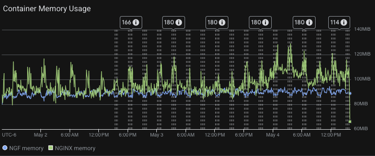
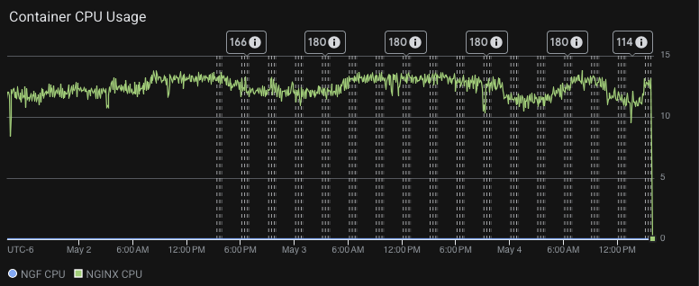

# Results

## Test environment

NGINX Plus: false

NGINX Gateway Fabric:

- Commit: 218bad2df3caa22e9d6293a11a8aba03c6c5adf3
- Date: 2026-05-01T16:51:46Z
- Dirty: false

GKE Cluster:

- Node count: 3
- k8s version: v1.35.3-gke.1234000
- vCPUs per node: 16
- RAM per node: 65848300Ki
- Max pods per node: 110
- Zone: us-west1-b
- Instance Type: n2d-standard-16

## Summary

- Similar traffic numbers to prior releases. HTTP throughput slightly decreased (~6%) compared to 2.5.0; HTTPS throughput is consistent.
- HTTPS reported ~47M non-2xx/3xx responses (~0.38% of total requests), which is a significant regression compared to 2.5.0 where none were reported. This needs to be investigated.
- Memory usage for both NGF and NGINX containers remained relatively stable with periodic spikes, consistent with past results.
- CPU usage is consistent with previous results.
- New error pattern in nginx-gateway: config apply failures ("file not found" via gRPC) during a short window, replacing the lease election errors seen in 2.5.0.
- NGINX upstream errors (timeouts, premature connection closures, no live upstreams) occurred in a concentrated burst around 03:00-03:18 on May 4th, likely related to the config apply failures and upstream pod churn during that period.

## Traffic

HTTP:

```text
Running 4320m test @ http://cafe.example.com/coffee
  2 threads and 100 connections
  Thread Stats   Avg      Stdev     Max   +/- Stdev
    Latency     1.47ms    1.57ms   1.06s    90.77%
    Req/Sec    37.18k     4.42k   71.99k    65.50%
  19176301759 requests in 4320.00m, 2.44TB read
  Socket errors: connect 0, read 774357, write 0, timeout 0
Requests/sec:  73982.64
Transfer/sec:      9.88MB
```

HTTPS:

```text
Running 4320m test @ https://cafe.example.com/tea
  2 threads and 100 connections
  Thread Stats   Avg      Stdev     Max   +/- Stdev
    Latency     2.10ms    2.17ms   1.05s    88.44%
    Req/Sec    23.87k     3.03k   54.39k    76.16%
  12304228226 requests in 4320.00m, 1.57TB read
  Socket errors: connect 0, read 893390, write 0, timeout 209
  Non-2xx or 3xx responses: 46988208
Requests/sec:  47470.01
Transfer/sec:      6.37MB
```


## Key Metrics

### Containers memory



### Containers CPU



## Error Logs

### nginx-gateway

error=msg: Config apply failed, rolling back config; error: error getting file data for name:"/etc/nginx/conf.d/http.conf"  hash:"V6lhbbLCvj3GB8OzCRN7CoVu+ZIRF7x/Et1X6qUd1Sc="  permissions:"0644"  size:6424: rpc error: code = NotFound desc = file not found;level=error;logger=eventHandler;msg=Failed to update NGINX configuration;stacktrace=github.com/nginx/nginx-gateway-fabric/v2/internal/controller.(*eventHandlerImpl).waitForStatusUpdates
	/opt/actions-runner/_work/nginx-gateway-fabric/nginx-gateway-fabric/internal/controller/handler.go:517;ts=2026-05-04T03:16:02Z
error=msg: Config apply failed, rolling back config; error: error getting file data for name:"/etc/nginx/conf.d/http.conf"  hash:"V6lhbbLCvj3GB8OzCRN7CoVu+ZIRF7x/Et1X6qUd1Sc="  permissions:"0644"  size:6424: rpc error: code = NotFound desc = file not found;level=error;logger=eventHandler;msg=Failed to update NGINX configuration;stacktrace=github.com/nginx/nginx-gateway-fabric/v2/internal/controller.(*eventHandlerImpl).waitForStatusUpdates
	/opt/actions-runner/_work/nginx-gateway-fabric/nginx-gateway-fabric/internal/controller/handler.go:517;ts=2026-05-04T03:16:01Z
error=msg: Config apply failed, rolling back config; error: error getting file data for name:"/etc/nginx/conf.d/http.conf"  hash:"V6lhbbLCvj3GB8OzCRN7CoVu+ZIRF7x/Et1X6qUd1Sc="  permissions:"0644"  size:6424: rpc error: code = NotFound desc = file not found;level=error;logger=eventHandler;msg=Failed to update NGINX configuration;stacktrace=github.com/nginx/nginx-gateway-fabric/v2/internal/controller.(*eventHandlerImpl).waitForStatusUpdates
	/opt/actions-runner/_work/nginx-gateway-fabric/nginx-gateway-fabric/internal/controller/handler.go:517;ts=2026-05-04T03:16:01Z
error=msg: Config apply failed, rolling back config; error: error getting file data for name:"/etc/nginx/conf.d/http.conf"  hash:"SNuQske4b5dRRybgpqOzMIAsuVkTN7vmOuFp1jves6M="  permissions:"0644"  size:6424: rpc error: code = NotFound desc = file not found;level=error;logger=eventHandler;msg=Failed to update NGINX configuration;stacktrace=github.com/nginx/nginx-gateway-fabric/v2/internal/controller.(*eventHandlerImpl).waitForStatusUpdates
	/opt/actions-runner/_work/nginx-gateway-fabric/nginx-gateway-fabric/internal/controller/handler.go:517;ts=2026-05-04T03:15:11Z
error=msg: Config apply failed, rolling back config; error: error getting file data for name:"/etc/nginx/conf.d/http.conf"  hash:"yXd4cIHhSlUsnHsasQ1G/rsV9zwhlcjwvHi/RJ78CeA="  permissions:"0644"  size:6424: rpc error: code = NotFound desc = file not found;level=error;logger=eventHandler;msg=Failed to update NGINX configuration;stacktrace=github.com/nginx/nginx-gateway-fabric/v2/internal/controller.(*eventHandlerImpl).waitForStatusUpdates
	/opt/actions-runner/_work/nginx-gateway-fabric/nginx-gateway-fabric/internal/controller/handler.go:517;ts=2026-05-04T03:14:22Z
error=msg: Config apply failed, rolling back config; error: error getting file data for name:"/etc/nginx/conf.d/http.conf"  hash:"Rv0nUvP+WfVSZZ2Qq9p5uP/W+IjXhwupIP5uit1eckg="  permissions:"0644"  size:6424: rpc error: code = NotFound desc = file not found;level=error;logger=eventHandler;msg=Failed to update NGINX configuration;stacktrace=github.com/nginx/nginx-gateway-fabric/v2/internal/controller.(*eventHandlerImpl).waitForStatusUpdates
	/opt/actions-runner/_work/nginx-gateway-fabric/nginx-gateway-fabric/internal/controller/handler.go:517;ts=2026-05-04T03:13:39Z
error=msg: Config apply failed, rolling back config; error: error getting file data for name:"/etc/nginx/conf.d/http.conf"  hash:"+QIxZkYmUBM8CRUOAZ5ID/Z6bND3NuZjRMXEeDOxStQ="  permissions:"0644"  size:6424: rpc error: code = NotFound desc = file not found;level=error;logger=eventHandler;msg=Failed to update NGINX configuration;stacktrace=github.com/nginx/nginx-gateway-fabric/v2/internal/controller.(*eventHandlerImpl).waitForStatusUpdates
	/opt/actions-runner/_work/nginx-gateway-fabric/nginx-gateway-fabric/internal/controller/handler.go:517;ts=2026-05-04T03:12:54Z
error=msg: Config apply failed, rolling back config; error: error getting file data for name:"/etc/nginx/conf.d/http.conf"  hash:"sGAQfPCr8GmIFahHmIC3tafBziLWpmo9s+0lo7inqdc="  permissions:"0644"  size:6424: rpc error: code = NotFound desc = file not found;level=error;logger=eventHandler;msg=Failed to update NGINX configuration;stacktrace=github.com/nginx/nginx-gateway-fabric/v2/internal/controller.(*eventHandlerImpl).waitForStatusUpdates
	/opt/actions-runner/_work/nginx-gateway-fabric/nginx-gateway-fabric/internal/controller/handler.go:517;ts=2026-05-04T03:11:55Z
error=msg: Config apply failed, rolling back config; error: error getting file data for name:"/etc/nginx/conf.d/http.conf"  hash:"2mIbSfgQqOT+XQSIcJ9wNZf0JqktVhnRLvnYidDTngg="  permissions:"0644"  size:6424: rpc error: code = NotFound desc = file not found;level=error;logger=eventHandler;msg=Failed to update NGINX configuration;stacktrace=github.com/nginx/nginx-gateway-fabric/v2/internal/controller.(*eventHandlerImpl).waitForStatusUpdates
	/opt/actions-runner/_work/nginx-gateway-fabric/nginx-gateway-fabric/internal/controller/handler.go:517;ts=2026-05-04T03:11:13Z
error=msg: Config apply failed, rolling back config; error: error getting file data for name:"/etc/nginx/conf.d/http.conf"  hash:"E+To+424sH+wH3nKdL6UPf5CX3e1Tw5u0BE+KVit+IE="  permissions:"0644"  size:6424: rpc error: code = NotFound desc = file not found;level=error;logger=eventHandler;msg=Failed to update NGINX configuration;stacktrace=github.com/nginx/nginx-gateway-fabric/v2/internal/controller.(*eventHandlerImpl).waitForStatusUpdates
	/opt/actions-runner/_work/nginx-gateway-fabric/nginx-gateway-fabric/internal/controller/handler.go:517;ts=2026-05-04T03:10:34Z
error=msg: Config apply failed, rolling back config; error: error getting file data for name:"/etc/nginx/conf.d/http.conf"  hash:"E+To+424sH+wH3nKdL6UPf5CX3e1Tw5u0BE+KVit+IE="  permissions:"0644"  size:6424: rpc error: code = NotFound desc = file not found;level=error;logger=nginxUpdater.commandService;msg=error sending request to agent;stacktrace=github.com/nginx/nginx-gateway-fabric/v2/internal/controller/nginx/agent.(*commandService).logAndSendErrorStatus
	/opt/actions-runner/_work/nginx-gateway-fabric/nginx-gateway-fabric/internal/controller/nginx/agent/command.go:448
github.com/nginx/nginx-gateway-fabric/v2/internal/controller/nginx/agent.(*commandService).setInitialConfig
	/opt/actions-runner/_work/nginx-gateway-fabric/nginx-gateway-fabric/internal/controller/nginx/agent/command.go:398
github.com/nginx/nginx-gateway-fabric/v2/internal/controller/nginx/agent.(*commandService).Subscribe
	/opt/actions-runner/_work/nginx-gateway-fabric/nginx-gateway-fabric/internal/controller/nginx/agent/command.go:176
github.com/nginx/agent/v3/api/grpc/mpi/v1._CommandService_Subscribe_Handler
	/opt/actions-runner/_work/nginx-gateway-fabric/nginx-gateway-fabric/.gocache/github.com/nginx/agent/v3@v3.9.1/api/grpc/mpi/v1/command_grpc.pb.go:233
github.com/nginx/nginx-gateway-fabric/v2/internal/controller/nginx/agent/grpc/interceptor.(*ContextSetter).Stream.ContextSetter.Stream.func1
	/opt/actions-runner/_work/nginx-gateway-fabric/nginx-gateway-fabric/internal/controller/nginx/agent/grpc/interceptor/interceptor.go:62
google.golang.org/grpc.(*Server).processStreamingRPC
	/opt/actions-runner/_work/nginx-gateway-fabric/nginx-gateway-fabric/.gocache/google.golang.org/grpc@v1.80.0/server.go:1723
google.golang.org/grpc.(*Server).handleStream
	/opt/actions-runner/_work/nginx-gateway-fabric/nginx-gateway-fabric/.gocache/google.golang.org/grpc@v1.80.0/server.go:1860
google.golang.org/grpc.(*Server).serveStreams.func2.1
	/opt/actions-runner/_work/nginx-gateway-fabric/nginx-gateway-fabric/.gocache/google.golang.org/grpc@v1.80.0/server.go:1065;ts=2026-05-04T03:10:34Z;uuid=4eaaaeb4-ce37-3766-a0e4-8d2c73dae01a
error=msg: Config apply failed, rolling back config; error: error getting file data for name:"/etc/nginx/conf.d/http.conf"  hash:"vS8otMvd9r+raDJ8UVFuulWFw8xuD/GZ7+OetAMufdM="  permissions:"0644"  size:6424: rpc error: code = NotFound desc = connection not found;level=error;logger=eventHandler;msg=Failed to update NGINX configuration;stacktrace=github.com/nginx/nginx-gateway-fabric/v2/internal/controller.(*eventHandlerImpl).waitForStatusUpdates
	/opt/actions-runner/_work/nginx-gateway-fabric/nginx-gateway-fabric/internal/controller/handler.go:517;ts=2026-05-04T03:00:46Z

### nginx
2026/05/04 03:18:56 [error] 220547#220547: *81388340 upstream timed out (110: Operation timed out) while connecting to upstream, client: 10.138.0.74, server: cafe.example.com, request: "GET /tea HTTP/1.1", upstream: "http://10.8.2.175:8080/tea", host: "cafe.example.com"
2026/05/04 03:18:56 [warn] 220547#220547: *81388340 upstream server temporarily disabled while connecting to upstream, client: 10.138.0.74, server: cafe.example.com, request: "GET /tea HTTP/1.1", upstream: "http://10.8.2.175:8080/tea", host: "cafe.example.com"
2026/05/04 03:18:42 [error] 220550#220550: *81384934 upstream timed out (110: Operation timed out) while connecting to upstream, client: 10.138.0.74, server: cafe.example.com, request: "GET /tea HTTP/1.1", upstream: "http://10.8.2.175:8080/tea", host: "cafe.example.com"
2026/05/04 03:18:42 [warn] 220550#220550: *81384934 upstream server temporarily disabled while connecting to upstream, client: 10.138.0.74, server: cafe.example.com, request: "GET /tea HTTP/1.1", upstream: "http://10.8.2.175:8080/tea", host: "cafe.example.com"
2026/05/04 03:18:39 [error] 220540#220540: *81384286 upstream timed out (110: Operation timed out) while connecting to upstream, client: 10.138.0.74, server: cafe.example.com, request: "GET /tea HTTP/1.1", upstream: "http://10.8.1.15:8080/tea", host: "cafe.example.com"
2026/05/04 03:18:39 [warn] 220540#220540: *81384286 upstream server temporarily disabled while connecting to upstream, client: 10.138.0.74, server: cafe.example.com, request: "GET /tea HTTP/1.1", upstream: "http://10.8.1.15:8080/tea", host: "cafe.example.com"
2026/05/04 03:18:27 [error] 220553#220553: *81381450 upstream timed out (110: Operation timed out) while connecting to upstream, client: 10.138.0.74, server: cafe.example.com, request: "GET /tea HTTP/1.1", upstream: "http://10.8.1.15:8080/tea", host: "cafe.example.com"
2026/05/04 03:18:27 [warn] 220553#220553: *81381450 upstream server temporarily disabled while connecting to upstream, client: 10.138.0.74, server: cafe.example.com, request: "GET /tea HTTP/1.1", upstream: "http://10.8.1.15:8080/tea", host: "cafe.example.com"
2026/05/04 03:18:08 [error] 220546#220546: *81377053 upstream timed out (110: Operation timed out) while connecting to upstream, client: 10.138.0.74, server: cafe.example.com, request: "GET /tea HTTP/1.1", upstream: "http://10.8.0.20:8080/tea", host: "cafe.example.com"
2026/05/04 03:18:08 [warn] 220546#220546: *81377053 upstream server temporarily disabled while connecting to upstream, client: 10.138.0.74, server: cafe.example.com, request: "GET /tea HTTP/1.1", upstream: "http://10.8.0.20:8080/tea", host: "cafe.example.com"
2026/05/04 03:17:56 [error] 220547#220547: *81388340 upstream timed out (110: Operation timed out) while connecting to upstream, client: 10.138.0.74, server: cafe.example.com, request: "GET /tea HTTP/1.1", upstream: "http://10.8.1.15:8080/tea", host: "cafe.example.com"
2026/05/04 03:17:56 [warn] 220547#220547: *81388340 upstream server temporarily disabled while connecting to upstream, client: 10.138.0.74, server: cafe.example.com, request: "GET /tea HTTP/1.1", upstream: "http://10.8.1.15:8080/tea", host: "cafe.example.com"
2026/05/04 03:17:42 [error] 220550#220550: *81384934 upstream timed out (110: Operation timed out) while connecting to upstream, client: 10.138.0.74, server: cafe.example.com, request: "GET /tea HTTP/1.1", upstream: "http://10.8.1.15:8080/tea", host: "cafe.example.com"
2026/05/04 03:17:42 [warn] 220550#220550: *81384934 upstream server temporarily disabled while connecting to upstream, client: 10.138.0.74, server: cafe.example.com, request: "GET /tea HTTP/1.1", upstream: "http://10.8.1.15:8080/tea", host: "cafe.example.com"
2026/05/04 03:17:39 [error] 220540#220540: *81384286 upstream timed out (110: Operation timed out) while connecting to upstream, client: 10.138.0.74, server: cafe.example.com, request: "GET /tea HTTP/1.1", upstream: "http://10.8.0.20:8080/tea", host: "cafe.example.com"
2026/05/04 03:17:39 [warn] 220540#220540: *81384286 upstream server temporarily disabled while connecting to upstream, client: 10.138.0.74, server: cafe.example.com, request: "GET /tea HTTP/1.1", upstream: "http://10.8.0.20:8080/tea", host: "cafe.example.com"
2026/05/04 03:17:27 [error] 220553#220553: *81381450 upstream timed out (110: Operation timed out) while connecting to upstream, client: 10.138.0.74, server: cafe.example.com, request: "GET /tea HTTP/1.1", upstream: "http://10.8.0.20:8080/tea", host: "cafe.example.com"
2026/05/04 03:17:27 [warn] 220553#220553: *81381450 upstream server temporarily disabled while connecting to upstream, client: 10.138.0.74, server: cafe.example.com, request: "GET /tea HTTP/1.1", upstream: "http://10.8.0.20:8080/tea", host: "cafe.example.com"
2026/05/04 03:17:08 [error] 220546#220546: *81377053 upstream timed out (110: Operation timed out) while connecting to upstream, client: 10.138.0.74, server: cafe.example.com, request: "GET /tea HTTP/1.1", upstream: "http://10.8.2.175:8080/tea", host: "cafe.example.com"
2026/05/04 03:17:08 [warn] 220546#220546: *81377053 upstream server temporarily disabled while connecting to upstream, client: 10.138.0.74, server: cafe.example.com, request: "GET /tea HTTP/1.1", upstream: "http://10.8.2.175:8080/tea", host: "cafe.example.com"
2026/05/04 03:16:56 [error] 220547#220547: *81388340 upstream timed out (110: Operation timed out) while connecting to upstream, client: 10.138.0.74, server: cafe.example.com, request: "GET /tea HTTP/1.1", upstream: "http://10.8.0.20:8080/tea", host: "cafe.example.com"
2026/05/04 03:16:56 [warn] 220547#220547: *81388340 upstream server temporarily disabled while connecting to upstream, client: 10.138.0.74, server: cafe.example.com, request: "GET /tea HTTP/1.1", upstream: "http://10.8.0.20:8080/tea", host: "cafe.example.com"
2026/05/04 03:16:52 [error] 220548#220548: *81387618 no live upstreams while connecting to upstream, client: 10.138.0.74, server: cafe.example.com, request: "GET /tea HTTP/1.1", upstream: "http://longevity_tea_80/tea", host: "cafe.example.com"
2026/05/04 03:16:52 [error] 220548#220548: *81387618 upstream timed out (110: Operation timed out) while connecting to upstream, client: 10.138.0.74, server: cafe.example.com, request: "GET /tea HTTP/1.1", upstream: "http://10.8.2.175:8080/tea", host: "cafe.example.com"
2026/05/04 03:16:52 [warn] 220548#220548: *81387618 upstream server temporarily disabled while connecting to upstream, client: 10.138.0.74, server: cafe.example.com, request: "GET /tea HTTP/1.1", upstream: "http://10.8.2.175:8080/tea", host: "cafe.example.com"
2026/05/04 03:16:44 [error] 220542#220542: *81385513 no live upstreams while connecting to upstream, client: 10.138.0.74, server: cafe.example.com, request: "GET /tea HTTP/1.1", upstream: "http://longevity_tea_80/tea", host: "cafe.example.com"
2026/05/04 03:16:44 [error] 220542#220542: *81385513 upstream timed out (110: Operation timed out) while connecting to upstream, client: 10.138.0.74, server: cafe.example.com, request: "GET /tea HTTP/1.1", upstream: "http://10.8.1.15:8080/tea", host: "cafe.example.com"
2026/05/04 03:16:44 [warn] 220542#220542: *81385513 upstream server temporarily disabled while connecting to upstream, client: 10.138.0.74, server: cafe.example.com, request: "GET /tea HTTP/1.1", upstream: "http://10.8.1.15:8080/tea", host: "cafe.example.com"
2026/05/04 03:16:42 [error] 220550#220550: *81384934 upstream timed out (110: Operation timed out) while connecting to upstream, client: 10.138.0.74, server: cafe.example.com, request: "GET /tea HTTP/1.1", upstream: "http://10.8.0.20:8080/tea", host: "cafe.example.com"
2026/05/04 03:16:42 [warn] 220550#220550: *81384934 upstream server temporarily disabled while connecting to upstream, client: 10.138.0.74, server: cafe.example.com, request: "GET /tea HTTP/1.1", upstream: "http://10.8.0.20:8080/tea", host: "cafe.example.com"
2026/05/04 03:16:39 [error] 220540#220540: *81384286 upstream timed out (110: Operation timed out) while connecting to upstream, client: 10.138.0.74, server: cafe.example.com, request: "GET /tea HTTP/1.1", upstream: "http://10.8.2.175:8080/tea", host: "cafe.example.com"
2026/05/04 03:16:39 [warn] 220540#220540: *81384286 upstream server temporarily disabled while connecting to upstream, client: 10.138.0.74, server: cafe.example.com, request: "GET /tea HTTP/1.1", upstream: "http://10.8.2.175:8080/tea", host: "cafe.example.com"
2026/05/04 03:16:31 [error] 220551#220551: *81382401 no live upstreams while connecting to upstream, client: 10.138.0.74, server: cafe.example.com, request: "GET /tea HTTP/1.1", upstream: "http://longevity_tea_80/tea", host: "cafe.example.com"
2026/05/04 03:16:31 [error] 220551#220551: *81382401 upstream timed out (110: Operation timed out) while connecting to upstream, client: 10.138.0.74, server: cafe.example.com, request: "GET /tea HTTP/1.1", upstream: "http://10.8.1.15:8080/tea", host: "cafe.example.com"
2026/05/04 03:16:31 [warn] 220551#220551: *81382401 upstream server temporarily disabled while connecting to upstream, client: 10.138.0.74, server: cafe.example.com, request: "GET /tea HTTP/1.1", upstream: "http://10.8.1.15:8080/tea", host: "cafe.example.com"
2026/05/04 03:16:27 [error] 220541#220541: *81381647 no live upstreams while connecting to upstream, client: 10.138.0.74, server: cafe.example.com, request: "GET /tea HTTP/1.1", upstream: "http://longevity_tea_80/tea", host: "cafe.example.com"
2026/05/04 03:16:27 [error] 220541#220541: *81381647 upstream timed out (110: Operation timed out) while connecting to upstream, client: 10.138.0.74, server: cafe.example.com, request: "GET /tea HTTP/1.1", upstream: "http://10.8.0.20:8080/tea", host: "cafe.example.com"
2026/05/04 03:16:27 [warn] 220541#220541: *81381647 upstream server temporarily disabled while connecting to upstream, client: 10.138.0.74, server: cafe.example.com, request: "GET /tea HTTP/1.1", upstream: "http://10.8.0.20:8080/tea", host: "cafe.example.com"
2026/05/04 03:16:27 [error] 220553#220553: *81381450 upstream timed out (110: Operation timed out) while connecting to upstream, client: 10.138.0.74, server: cafe.example.com, request: "GET /tea HTTP/1.1", upstream: "http://10.8.2.175:8080/tea", host: "cafe.example.com"
2026/05/04 03:16:27 [warn] 220553#220553: *81381450 upstream server temporarily disabled while connecting to upstream, client: 10.138.0.74, server: cafe.example.com, request: "GET /tea HTTP/1.1", upstream: "http://10.8.2.175:8080/tea", host: "cafe.example.com"
2026/05/04 03:16:19 [error] 220548#220548: *81379939 no live upstreams while connecting to upstream, client: 10.138.0.74, server: cafe.example.com, request: "GET /tea HTTP/1.1", upstream: "http://longevity_tea_80/tea", host: "cafe.example.com"
2026/05/04 03:16:19 [error] 220548#220548: *81379939 upstream timed out (110: Operation timed out) while connecting to upstream, client: 10.138.0.74, server: cafe.example.com, request: "GET /tea HTTP/1.1", upstream: "http://10.8.1.15:8080/tea", host: "cafe.example.com"
2026/05/04 03:16:19 [warn] 220548#220548: *81379939 upstream server temporarily disabled while connecting to upstream, client: 10.138.0.74, server: cafe.example.com, request: "GET /tea HTTP/1.1", upstream: "http://10.8.1.15:8080/tea", host: "cafe.example.com"
2026/05/04 03:16:16 [error] 220541#220541: *81379073 no live upstreams while connecting to upstream, client: 10.138.0.74, server: cafe.example.com, request: "GET /tea HTTP/1.1", upstream: "http://longevity_tea_80/tea", host: "cafe.example.com"
2026/05/04 03:16:16 [error] 220541#220541: *81379073 upstream timed out (110: Operation timed out) while connecting to upstream, client: 10.138.0.74, server: cafe.example.com, request: "GET /tea HTTP/1.1", upstream: "http://10.8.2.175:8080/tea", host: "cafe.example.com"
2026/05/04 03:16:16 [warn] 220541#220541: *81379073 upstream server temporarily disabled while connecting to upstream, client: 10.138.0.74, server: cafe.example.com, request: "GET /tea HTTP/1.1", upstream: "http://10.8.2.175:8080/tea", host: "cafe.example.com"
2026/05/04 03:16:14 [error] 220544#220544: *81378477 no live upstreams while connecting to upstream, client: 10.138.0.74, server: cafe.example.com, request: "GET /tea HTTP/1.1", upstream: "http://longevity_tea_80/tea", host: "cafe.example.com"
2026/05/04 03:16:14 [error] 220544#220544: *81378477 upstream timed out (110: Operation timed out) while connecting to upstream, client: 10.138.0.74, server: cafe.example.com, request: "GET /tea HTTP/1.1", upstream: "http://10.8.0.20:8080/tea", host: "cafe.example.com"
2026/05/04 03:16:14 [warn] 220544#220544: *81378477 upstream server temporarily disabled while connecting to upstream, client: 10.138.0.74, server: cafe.example.com, request: "GET /tea HTTP/1.1", upstream: "http://10.8.0.20:8080/tea", host: "cafe.example.com"
2026/05/04 03:00:18 [warn] 220540#220540: *81168965 upstream server temporarily disabled while reading response header from upstream, client: 10.138.0.74, server: cafe.example.com, request: "GET /tea HTTP/1.1", upstream: "http://10.8.0.20:8080/tea", host: "cafe.example.com"
2026/05/04 03:00:18 [error] 220540#220540: *81168965 upstream prematurely closed connection while reading response header from upstream, client: 10.138.0.74, server: cafe.example.com, request: "GET /tea HTTP/1.1", upstream: "http://10.8.0.20:8080/tea", host: "cafe.example.com"
2026/05/04 03:00:18 [warn] 220549#220549: *81169042 upstream server temporarily disabled while reading response header from upstream, client: 10.138.0.74, server: cafe.example.com, request: "GET /tea HTTP/1.1", upstream: "http://10.8.0.20:8080/tea", host: "cafe.example.com"
2026/05/04 03:00:18 [error] 220549#220549: *81169042 recv() failed (104: Connection reset by peer) while reading response header from upstream, client: 10.138.0.74, server: cafe.example.com, request: "GET /tea HTTP/1.1", upstream: "http://10.8.0.20:8080/tea", host: "cafe.example.com"
2026/05/04 03:00:18 [warn] 220544#220544: *81169462 upstream server temporarily disabled while reading response header from upstream, client: 10.138.0.74, server: cafe.example.com, request: "GET /tea HTTP/1.1", upstream: "http://10.8.0.20:8080/tea", host: "cafe.example.com"
2026/05/04 03:00:18 [error] 220544#220544: *81169462 recv() failed (104: Connection reset by peer) while reading response header from upstream, client: 10.138.0.74, server: cafe.example.com, request: "GET /tea HTTP/1.1", upstream: "http://10.8.0.20:8080/tea", host: "cafe.example.com"
2026/05/04 03:00:18 [warn] 220549#220549: *81169635 upstream server temporarily disabled while reading response header from upstream, client: 10.138.0.74, server: cafe.example.com, request: "GET /tea HTTP/1.1", upstream: "http://10.8.0.20:8080/tea", host: "cafe.example.com"
2026/05/04 03:00:18 [error] 220549#220549: *81169635 recv() failed (104: Connection reset by peer) while reading response header from upstream, client: 10.138.0.74, server: cafe.example.com, request: "GET /tea HTTP/1.1", upstream: "http://10.8.0.20:8080/tea", host: "cafe.example.com"
2026/05/04 03:00:18 [warn] 220549#220549: *81169638 upstream server temporarily disabled while reading response header from upstream, client: 10.138.0.74, server: cafe.example.com, request: "GET /tea HTTP/1.1", upstream: "http://10.8.0.20:8080/tea", host: "cafe.example.com"
2026/05/04 03:00:18 [error] 220549#220549: *81169638 upstream prematurely closed connection while reading response header from upstream, client: 10.138.0.74, server: cafe.example.com, request: "GET /tea HTTP/1.1", upstream: "http://10.8.0.20:8080/tea", host: "cafe.example.com"
2026/05/04 03:00:18 [warn] 220548#220548: *81169060 upstream server temporarily disabled while reading response header from upstream, client: 10.138.0.74, server: cafe.example.com, request: "GET /tea HTTP/1.1", upstream: "http://10.8.0.20:8080/tea", host: "cafe.example.com"
2026/05/04 03:00:18 [error] 220548#220548: *81169060 upstream prematurely closed connection while reading response header from upstream, client: 10.138.0.74, server: cafe.example.com, request: "GET /tea HTTP/1.1", upstream: "http://10.8.0.20:8080/tea", host: "cafe.example.com"
2026/05/04 03:00:18 [warn] 220548#220548: *81169491 upstream server temporarily disabled while reading response header from upstream, client: 10.138.0.74, server: cafe.example.com, request: "GET /tea HTTP/1.1", upstream: "http://10.8.0.20:8080/tea", host: "cafe.example.com"
2026/05/04 03:00:18 [warn] 220544#220544: *81169631 upstream server temporarily disabled while reading response header from upstream, client: 10.138.0.74, server: cafe.example.com, request: "GET /tea HTTP/1.1", upstream: "http://10.8.0.20:8080/tea", host: "cafe.example.com"
2026/05/04 03:00:18 [error] 220544#220544: *81169631 upstream prematurely closed connection while reading response header from upstream, client: 10.138.0.74, server: cafe.example.com, request: "GET /tea HTTP/1.1", upstream: "http://10.8.0.20:8080/tea", host: "cafe.example.com"
2026/05/04 03:00:18 [error] 220548#220548: *81169491 recv() failed (104: Connection reset by peer) while reading response header from upstream, client: 10.138.0.74, server: cafe.example.com, request: "GET /tea HTTP/1.1", upstream: "http://10.8.0.20:8080/tea", host: "cafe.example.com"

10.138.0.74 - - [04/May/2026:03:18:56 +0000] "GET /tea HTTP/1.1" 504 160 "-" "-"
2026/05/04 03:18:56 [error] 220547#220547: *81388340 upstream timed out (110: Operation timed out) while connecting to upstream, client: 10.138.0.74, server: cafe.example.com, request: "GET /tea HTTP/1.1", upstream: "http://10.8.2.175:8080/tea", host: "cafe.example.com"
2026/05/04 03:18:56 [warn] 220547#220547: *81388340 upstream server temporarily disabled while connecting to upstream, client: 10.138.0.74, server: cafe.example.com, request: "GET /tea HTTP/1.1", upstream: "http://10.8.2.175:8080/tea", host: "cafe.example.com"
2026/05/04 03:18:42 [error] 220550#220550: *81384934 upstream timed out (110: Operation timed out) while connecting to upstream, client: 10.138.0.74, server: cafe.example.com, request: "GET /tea HTTP/1.1", upstream: "http://10.8.2.175:8080/tea", host: "cafe.example.com"
10.138.0.74 - - [04/May/2026:03:18:42 +0000] "GET /tea HTTP/1.1" 504 160 "-" "-"
2026/05/04 03:18:42 [warn] 220550#220550: *81384934 upstream server temporarily disabled while connecting to upstream, client: 10.138.0.74, server: cafe.example.com, request: "GET /tea HTTP/1.1", upstream: "http://10.8.2.175:8080/tea", host: "cafe.example.com"
10.138.0.74 - - [04/May/2026:03:18:39 +0000] "GET /tea HTTP/1.1" 504 160 "-" "-"
2026/05/04 03:18:39 [error] 220540#220540: *81384286 upstream timed out (110: Operation timed out) while connecting to upstream, client: 10.138.0.74, server: cafe.example.com, request: "GET /tea HTTP/1.1", upstream: "http://10.8.1.15:8080/tea", host: "cafe.example.com"
2026/05/04 03:18:39 [warn] 220540#220540: *81384286 upstream server temporarily disabled while connecting to upstream, client: 10.138.0.74, server: cafe.example.com, request: "GET /tea HTTP/1.1", upstream: "http://10.8.1.15:8080/tea", host: "cafe.example.com"
2026/05/04 03:18:27 [error] 220553#220553: *81381450 upstream timed out (110: Operation timed out) while connecting to upstream, client: 10.138.0.74, server: cafe.example.com, request: "GET /tea HTTP/1.1", upstream: "http://10.8.1.15:8080/tea", host: "cafe.example.com"
2026/05/04 03:18:27 [warn] 220553#220553: *81381450 upstream server temporarily disabled while connecting to upstream, client: 10.138.0.74, server: cafe.example.com, request: "GET /tea HTTP/1.1", upstream: "http://10.8.1.15:8080/tea", host: "cafe.example.com"
10.138.0.74 - - [04/May/2026:03:18:27 +0000] "GET /tea HTTP/1.1" 504 160 "-" "-"
10.138.0.74 - - [04/May/2026:03:18:08 +0000] "GET /tea HTTP/1.1" 504 160 "-" "-"
2026/05/04 03:18:08 [error] 220546#220546: *81377053 upstream timed out (110: Operation timed out) while connecting to upstream, client: 10.138.0.74, server: cafe.example.com, request: "GET /tea HTTP/1.1", upstream: "http://10.8.0.20:8080/tea", host: "cafe.example.com"
2026/05/04 03:18:08 [warn] 220546#220546: *81377053 upstream server temporarily disabled while connecting to upstream, client: 10.138.0.74, server: cafe.example.com, request: "GET /tea HTTP/1.1", upstream: "http://10.8.0.20:8080/tea", host: "cafe.example.com"
2026/05/04 03:17:56 [error] 220547#220547: *81388340 upstream timed out (110: Operation timed out) while connecting to upstream, client: 10.138.0.74, server: cafe.example.com, request: "GET /tea HTTP/1.1", upstream: "http://10.8.1.15:8080/tea", host: "cafe.example.com"
2026/05/04 03:17:56 [warn] 220547#220547: *81388340 upstream server temporarily disabled while connecting to upstream, client: 10.138.0.74, server: cafe.example.com, request: "GET /tea HTTP/1.1", upstream: "http://10.8.1.15:8080/tea", host: "cafe.example.com"
2026/05/04 03:17:42 [error] 220550#220550: *81384934 upstream timed out (110: Operation timed out) while connecting to upstream, client: 10.138.0.74, server: cafe.example.com, request: "GET /tea HTTP/1.1", upstream: "http://10.8.1.15:8080/tea", host: "cafe.example.com"
2026/05/04 03:17:42 [warn] 220550#220550: *81384934 upstream server temporarily disabled while connecting to upstream, client: 10.138.0.74, server: cafe.example.com, request: "GET /tea HTTP/1.1", upstream: "http://10.8.1.15:8080/tea", host: "cafe.example.com"
2026/05/04 03:17:39 [error] 220540#220540: *81384286 upstream timed out (110: Operation timed out) while connecting to upstream, client: 10.138.0.74, server: cafe.example.com, request: "GET /tea HTTP/1.1", upstream: "http://10.8.0.20:8080/tea", host: "cafe.example.com"
2026/05/04 03:17:39 [warn] 220540#220540: *81384286 upstream server temporarily disabled while connecting to upstream, client: 10.138.0.74, server: cafe.example.com, request: "GET /tea HTTP/1.1", upstream: "http://10.8.0.20:8080/tea", host: "cafe.example.com"
2026/05/04 03:17:27 [error] 220553#220553: *81381450 upstream timed out (110: Operation timed out) while connecting to upstream, client: 10.138.0.74, server: cafe.example.com, request: "GET /tea HTTP/1.1", upstream: "http://10.8.0.20:8080/tea", host: "cafe.example.com"
2026/05/04 03:17:27 [warn] 220553#220553: *81381450 upstream server temporarily disabled while connecting to upstream, client: 10.138.0.74, server: cafe.example.com, request: "GET /tea HTTP/1.1", upstream: "http://10.8.0.20:8080/tea", host: "cafe.example.com"
2026/05/04 03:17:08 [error] 220546#220546: *81377053 upstream timed out (110: Operation timed out) while connecting to upstream, client: 10.138.0.74, server: cafe.example.com, request: "GET /tea HTTP/1.1", upstream: "http://10.8.2.175:8080/tea", host: "cafe.example.com"
2026/05/04 03:17:08 [warn] 220546#220546: *81377053 upstream server temporarily disabled while connecting to upstream, client: 10.138.0.74, server: cafe.example.com, request: "GET /tea HTTP/1.1", upstream: "http://10.8.2.175:8080/tea", host: "cafe.example.com"
2026/05/04 03:16:56 [error] 220547#220547: *81388340 upstream timed out (110: Operation timed out) while connecting to upstream, client: 10.138.0.74, server: cafe.example.com, request: "GET /tea HTTP/1.1", upstream: "http://10.8.0.20:8080/tea", host: "cafe.example.com"
2026/05/04 03:16:56 [warn] 220547#220547: *81388340 upstream server temporarily disabled while connecting to upstream, client: 10.138.0.74, server: cafe.example.com, request: "GET /tea HTTP/1.1", upstream: "http://10.8.0.20:8080/tea", host: "cafe.example.com"
10.138.0.74 - - [04/May/2026:03:16:52 +0000] "GET /tea HTTP/1.1" 502 150 "-" "-"
2026/05/04 03:16:52 [error] 220548#220548: *81387618 no live upstreams while connecting to upstream, client: 10.138.0.74, server: cafe.example.com, request: "GET /tea HTTP/1.1", upstream: "http://longevity_tea_80/tea", host: "cafe.example.com"
2026/05/04 03:16:52 [error] 220548#220548: *81387618 upstream timed out (110: Operation timed out) while connecting to upstream, client: 10.138.0.74, server: cafe.example.com, request: "GET /tea HTTP/1.1", upstream: "http://10.8.2.175:8080/tea", host: "cafe.example.com"
2026/05/04 03:16:52 [warn] 220548#220548: *81387618 upstream server temporarily disabled while connecting to upstream, client: 10.138.0.74, server: cafe.example.com, request: "GET /tea HTTP/1.1", upstream: "http://10.8.2.175:8080/tea", host: "cafe.example.com"
10.138.0.74 - - [04/May/2026:03:16:44 +0000] "GET /tea HTTP/1.1" 502 150 "-" "-"
2026/05/04 03:16:44 [error] 220542#220542: *81385513 no live upstreams while connecting to upstream, client: 10.138.0.74, server: cafe.example.com, request: "GET /tea HTTP/1.1", upstream: "http://longevity_tea_80/tea", host: "cafe.example.com"
2026/05/04 03:16:44 [error] 220542#220542: *81385513 upstream timed out (110: Operation timed out) while connecting to upstream, client: 10.138.0.74, server: cafe.example.com, request: "GET /tea HTTP/1.1", upstream: "http://10.8.1.15:8080/tea", host: "cafe.example.com"
2026/05/04 03:16:44 [warn] 220542#220542: *81385513 upstream server temporarily disabled while connecting to upstream, client: 10.138.0.74, server: cafe.example.com, request: "GET /tea HTTP/1.1", upstream: "http://10.8.1.15:8080/tea", host: "cafe.example.com"
2026/05/04 03:16:42 [error] 220550#220550: *81384934 upstream timed out (110: Operation timed out) while connecting to upstream, client: 10.138.0.74, server: cafe.example.com, request: "GET /tea HTTP/1.1", upstream: "http://10.8.0.20:8080/tea", host: "cafe.example.com"
2026/05/04 03:16:42 [warn] 220550#220550: *81384934 upstream server temporarily disabled while connecting to upstream, client: 10.138.0.74, server: cafe.example.com, request: "GET /tea HTTP/1.1", upstream: "http://10.8.0.20:8080/tea", host: "cafe.example.com"
2026/05/04 03:16:39 [error] 220540#220540: *81384286 upstream timed out (110: Operation timed out) while connecting to upstream, client: 10.138.0.74, server: cafe.example.com, request: "GET /tea HTTP/1.1", upstream: "http://10.8.2.175:8080/tea", host: "cafe.example.com"
2026/05/04 03:16:39 [warn] 220540#220540: *81384286 upstream server temporarily disabled while connecting to upstream, client: 10.138.0.74, server: cafe.example.com, request: "GET /tea HTTP/1.1", upstream: "http://10.8.2.175:8080/tea", host: "cafe.example.com"
10.138.0.74 - - [04/May/2026:03:16:31 +0000] "GET /tea HTTP/1.1" 502 150 "-" "-"
2026/05/04 03:16:31 [error] 220551#220551: *81382401 no live upstreams while connecting to upstream, client: 10.138.0.74, server: cafe.example.com, request: "GET /tea HTTP/1.1", upstream: "http://longevity_tea_80/tea", host: "cafe.example.com"
2026/05/04 03:16:31 [error] 220551#220551: *81382401 upstream timed out (110: Operation timed out) while connecting to upstream, client: 10.138.0.74, server: cafe.example.com, request: "GET /tea HTTP/1.1", upstream: "http://10.8.1.15:8080/tea", host: "cafe.example.com"
2026/05/04 03:16:31 [warn] 220551#220551: *81382401 upstream server temporarily disabled while connecting to upstream, client: 10.138.0.74, server: cafe.example.com, request: "GET /tea HTTP/1.1", upstream: "http://10.8.1.15:8080/tea", host: "cafe.example.com"
2026/05/04 03:16:27 [error] 220541#220541: *81381647 no live upstreams while connecting to upstream, client: 10.138.0.74, server: cafe.example.com, request: "GET /tea HTTP/1.1", upstream: "http://longevity_tea_80/tea", host: "cafe.example.com"
2026/05/04 03:16:27 [error] 220541#220541: *81381647 upstream timed out (110: Operation timed out) while connecting to upstream, client: 10.138.0.74, server: cafe.example.com, request: "GET /tea HTTP/1.1", upstream: "http://10.8.0.20:8080/tea", host: "cafe.example.com"
2026/05/04 03:16:27 [warn] 220541#220541: *81381647 upstream server temporarily disabled while connecting to upstream, client: 10.138.0.74, server: cafe.example.com, request: "GET /tea HTTP/1.1", upstream: "http://10.8.0.20:8080/tea", host: "cafe.example.com"
10.138.0.74 - - [04/May/2026:03:16:27 +0000] "GET /tea HTTP/1.1" 502 150 "-" "-"
2026/05/04 03:16:27 [error] 220553#220553: *81381450 upstream timed out (110: Operation timed out) while connecting to upstream, client: 10.138.0.74, server: cafe.example.com, request: "GET /tea HTTP/1.1", upstream: "http://10.8.2.175:8080/tea", host: "cafe.example.com"
2026/05/04 03:16:27 [warn] 220553#220553: *81381450 upstream server temporarily disabled while connecting to upstream, client: 10.138.0.74, server: cafe.example.com, request: "GET /tea HTTP/1.1", upstream: "http://10.8.2.175:8080/tea", host: "cafe.example.com"
10.138.0.74 - - [04/May/2026:03:16:19 +0000] "GET /tea HTTP/1.1" 502 150 "-" "-"
2026/05/04 03:16:19 [error] 220548#220548: *81379939 no live upstreams while connecting to upstream, client: 10.138.0.74, server: cafe.example.com, request: "GET /tea HTTP/1.1", upstream: "http://longevity_tea_80/tea", host: "cafe.example.com"
2026/05/04 03:16:19 [error] 220548#220548: *81379939 upstream timed out (110: Operation timed out) while connecting to upstream, client: 10.138.0.74, server: cafe.example.com, request: "GET /tea HTTP/1.1", upstream: "http://10.8.1.15:8080/tea", host: "cafe.example.com"
2026/05/04 03:16:19 [warn] 220548#220548: *81379939 upstream server temporarily disabled while connecting to upstream, client: 10.138.0.74, server: cafe.example.com, request: "GET /tea HTTP/1.1", upstream: "http://10.8.1.15:8080/tea", host: "cafe.example.com"
10.138.0.74 - - [04/May/2026:03:16:16 +0000] "GET /tea HTTP/1.1" 502 150 "-" "-"
2026/05/04 03:16:16 [error] 220541#220541: *81379073 no live upstreams while connecting to upstream, client: 10.138.0.74, server: cafe.example.com, request: "GET /tea HTTP/1.1", upstream: "http://longevity_tea_80/tea", host: "cafe.example.com"
2026/05/04 03:16:16 [error] 220541#220541: *81379073 upstream timed out (110: Operation timed out) while connecting to upstream, client: 10.138.0.74, server: cafe.example.com, request: "GET /tea HTTP/1.1", upstream: "http://10.8.2.175:8080/tea", host: "cafe.example.com"
2026/05/04 03:16:16 [warn] 220541#220541: *81379073 upstream server temporarily disabled while connecting to upstream, client: 10.138.0.74, server: cafe.example.com, request: "GET /tea HTTP/1.1", upstream: "http://10.8.2.175:8080/tea", host: "cafe.example.com"
2026/05/04 03:16:14 [error] 220544#220544: *81378477 no live upstreams while connecting to upstream, client: 10.138.0.74, server: cafe.example.com, request: "GET /tea HTTP/1.1", upstream: "http://longevity_tea_80/tea", host: "cafe.example.com"
10.138.0.74 - - [04/May/2026:03:16:14 +0000] "GET /tea HTTP/1.1" 502 150 "-" "-"
2026/05/04 03:16:14 [error] 220544#220544: *81378477 upstream timed out (110: Operation timed out) while connecting to upstream, client: 10.138.0.74, server: cafe.example.com, request: "GET /tea HTTP/1.1", upstream: "http://10.8.0.20:8080/tea", host: "cafe.example.com"
2026/05/04 03:16:14 [warn] 220544#220544: *81378477 upstream server temporarily disabled while connecting to upstream, client: 10.138.0.74, server: cafe.example.com, request: "GET /tea HTTP/1.1", upstream: "http://10.8.0.20:8080/tea", host: "cafe.example.com"
2026/05/04 03:00:18 [warn] 220540#220540: *81168965 upstream server temporarily disabled while reading response header from upstream, client: 10.138.0.74, server: cafe.example.com, request: "GET /tea HTTP/1.1", upstream: "http://10.8.0.20:8080/tea", host: "cafe.example.com"
2026/05/04 03:00:18 [error] 220540#220540: *81168965 upstream prematurely closed connection while reading response header from upstream, client: 10.138.0.74, server: cafe.example.com, request: "GET /tea HTTP/1.1", upstream: "http://10.8.0.20:8080/tea", host: "cafe.example.com"
2026/05/04 03:00:18 [warn] 220549#220549: *81169042 upstream server temporarily disabled while reading response header from upstream, client: 10.138.0.74, server: cafe.example.com, request: "GET /tea HTTP/1.1", upstream: "http://10.8.0.20:8080/tea", host: "cafe.example.com"
2026/05/04 03:00:18 [error] 220549#220549: *81169042 recv() failed (104: Connection reset by peer) while reading response header from upstream, client: 10.138.0.74, server: cafe.example.com, request: "GET /tea HTTP/1.1", upstream: "http://10.8.0.20:8080/tea", host: "cafe.example.com"
2026/05/04 03:00:18 [warn] 220544#220544: *81169462 upstream server temporarily disabled while reading response header from upstream, client: 10.138.0.74, server: cafe.example.com, request: "GET /tea HTTP/1.1", upstream: "http://10.8.0.20:8080/tea", host: "cafe.example.com"
2026/05/04 03:00:18 [error] 220544#220544: *81169462 recv() failed (104: Connection reset by peer) while reading response header from upstream, client: 10.138.0.74, server: cafe.example.com, request: "GET /tea HTTP/1.1", upstream: "http://10.8.0.20:8080/tea", host: "cafe.example.com"
2026/05/04 03:00:18 [warn] 220549#220549: *81169635 upstream server temporarily disabled while reading response header from upstream, client: 10.138.0.74, server: cafe.example.com, request: "GET /tea HTTP/1.1", upstream: "http://10.8.0.20:8080/tea", host: "cafe.example.com"
2026/05/04 03:00:18 [error] 220549#220549: *81169635 recv() failed (104: Connection reset by peer) while reading response header from upstream, client: 10.138.0.74, server: cafe.example.com, request: "GET /tea HTTP/1.1", upstream: "http://10.8.0.20:8080/tea", host: "cafe.example.com"
2026/05/04 03:00:18 [warn] 220549#220549: *81169638 upstream server temporarily disabled while reading response header from upstream, client: 10.138.0.74, server: cafe.example.com, request: "GET /tea HTTP/1.1", upstream: "http://10.8.0.20:8080/tea", host: "cafe.example.com"
2026/05/04 03:00:18 [error] 220549#220549: *81169638 upstream prematurely closed connection while reading response header from upstream, client: 10.138.0.74, server: cafe.example.com, request: "GET /tea HTTP/1.1", upstream: "http://10.8.0.20:8080/tea", host: "cafe.example.com"
2026/05/04 03:00:18 [warn] 220548#220548: *81169060 upstream server temporarily disabled while reading response header from upstream, client: 10.138.0.74, server: cafe.example.com, request: "GET /tea HTTP/1.1", upstream: "http://10.8.0.20:8080/tea", host: "cafe.example.com"
2026/05/04 03:00:18 [error] 220548#220548: *81169060 upstream prematurely closed connection while reading response header from upstream, client: 10.138.0.74, server: cafe.example.com, request: "GET /tea HTTP/1.1", upstream: "http://10.8.0.20:8080/tea", host: "cafe.example.com"
2026/05/04 03:00:18 [warn] 220548#220548: *81169491 upstream server temporarily disabled while reading response header from upstream, client: 10.138.0.74, server: cafe.example.com, request: "GET /tea HTTP/1.1", upstream: "http://10.8.0.20:8080/tea", host: "cafe.example.com"
2026/05/04 03:00:18 [warn] 220544#220544: *81169631 upstream server temporarily disabled while reading response header from upstream, client: 10.138.0.74, server: cafe.example.com, request: "GET /tea HTTP/1.1", upstream: "http://10.8.0.20:8080/tea", host: "cafe.example.com"
2026/05/04 03:00:18 [error] 220544#220544: *81169631 upstream prematurely closed connection while reading response header from upstream, client: 10.138.0.74, server: cafe.example.com, request: "GET /tea HTTP/1.1", upstream: "http://10.8.0.20:8080/tea", host: "cafe.example.com"
2026/05/04 03:00:18 [error] 220548#220548: *81169491 recv() failed (104: Connection reset by peer) while reading response header from upstream, client: 10.138.0.74, server: cafe.example.com, request: "GET /tea HTTP/1.1", upstream: "http://10.8.0.20:8080/tea", host: "cafe.example.com"
