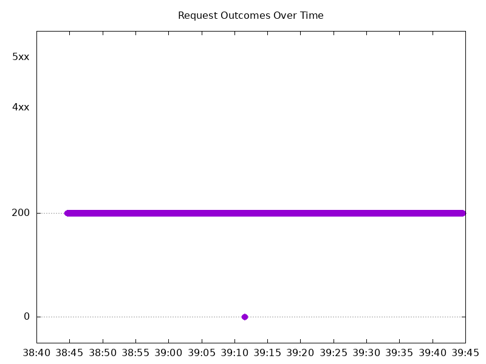

# Results

## Test environment

NGINX Plus: false

NGINX Gateway Fabric:

- Commit: 9fbef714ea22a35c4f1a8c97bd5b4e406ae0c1e9
- Date: 2025-10-21T10:57:37Z
- Dirty: false

GKE Cluster:

- Node count: 12
- k8s version: v1.33.5-gke.1080000
- vCPUs per node: 16
- RAM per node: 65851524Ki
- Max pods per node: 110
- Zone: us-west1-b
- Instance Type: n2d-standard-16

## Test: Send http /coffee traffic

```text
Requests      [total, rate, throughput]         6000, 100.01, 99.83
Duration      [total, attack, wait]             59.995s, 59.992s, 2.616ms
Latencies     [min, mean, 50, 90, 95, 99, max]  568.436µs, 579.689ms, 1.075ms, 2.351s, 5.311s, 7.657s, 8.224s
Bytes In      [total, mean]                     958240, 159.71
Bytes Out     [total, mean]                     0, 0.00
Success       [ratio]                           99.82%
Status Codes  [code:count]                      0:11  200:5989  
Error Set:
Get "http://cafe.example.com/coffee": dial tcp 0.0.0.0:0->10.138.0.101:80: connect: connection refused
```



## Test: Send https /tea traffic

```text
Requests      [total, rate, throughput]         6000, 100.01, 99.83
Duration      [total, attack, wait]             59.995s, 59.992s, 2.394ms
Latencies     [min, mean, 50, 90, 95, 99, max]  568.59µs, 586.782ms, 1.112ms, 2.315s, 5.356s, 7.672s, 8.229s
Bytes In      [total, mean]                     924268, 154.04
Bytes Out     [total, mean]                     0, 0.00
Success       [ratio]                           99.82%
Status Codes  [code:count]                      0:11  200:5989  
Error Set:
Get "https://cafe.example.com/tea": dial tcp 0.0.0.0:0->10.138.0.101:443: connect: connection refused
```


