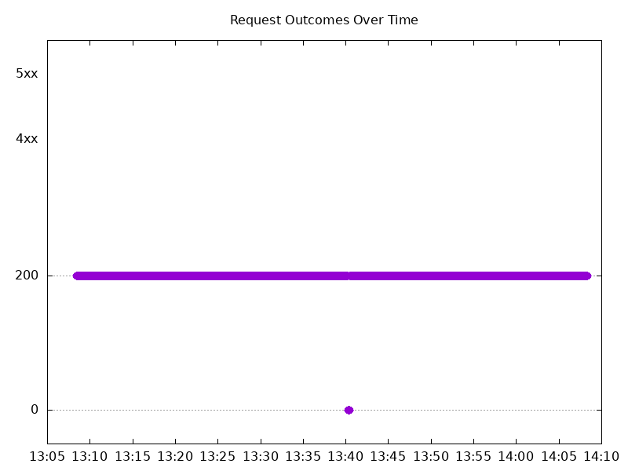

# Results

## Test environment

NGINX Plus: false

NGINX Gateway Fabric:

- Commit: 9baad92b868ab0120bbea128ecfb1e5b14358bbe
- Date: 2026-03-26T17:23:01Z
- Dirty: false

GKE Cluster:

- Node count: 12
- k8s version: v1.34.4-gke.1130000
- vCPUs per node: 16
- RAM per node: 64305Mi
- Max pods per node: 110
- Zone: us-west1-b
- Instance Type: n2d-standard-16

## Summary:

- Similar results to 2.4.0, with a brief interruption in traffic.
- Slightly more failed requests (19 vs 14 in 2.4.0).
- Mean latency increased (528ms vs 446ms in 2.4.0).

## Test: Send http /coffee traffic

```text
Requests      [total, rate, throughput]         6000, 100.01, 99.69
Duration      [total, attack, wait]             59.995s, 59.992s, 2.507ms
Latencies     [min, mean, 50, 90, 95, 99, max]  602.828µs, 528.66ms, 1.055ms, 2.025s, 4.93s, 7.245s, 7.804s
Bytes In      [total, mean]                     956960, 159.49
Bytes Out     [total, mean]                     0, 0.00
Success       [ratio]                           99.68%
Status Codes  [code:count]                      0:19  200:5981  
Error Set:
Get "http://cafe.example.com/coffee": dial tcp 0.0.0.0:0->10.138.0.114:80: connect: connection refused
```



## Test: Send https /tea traffic

```text
Requests      [total, rate, throughput]         6000, 100.01, 99.69
Duration      [total, attack, wait]             59.995s, 59.992s, 2.63ms
Latencies     [min, mean, 50, 90, 95, 99, max]  568.783µs, 527.833ms, 1.085ms, 2.019s, 4.917s, 7.244s, 7.812s
Bytes In      [total, mean]                     921074, 153.51
Bytes Out     [total, mean]                     0, 0.00
Success       [ratio]                           99.68%
Status Codes  [code:count]                      0:19  200:5981  
Error Set:
Get "https://cafe.example.com/tea": dial tcp 0.0.0.0:0->10.138.0.114:443: connect: connection refused
```


