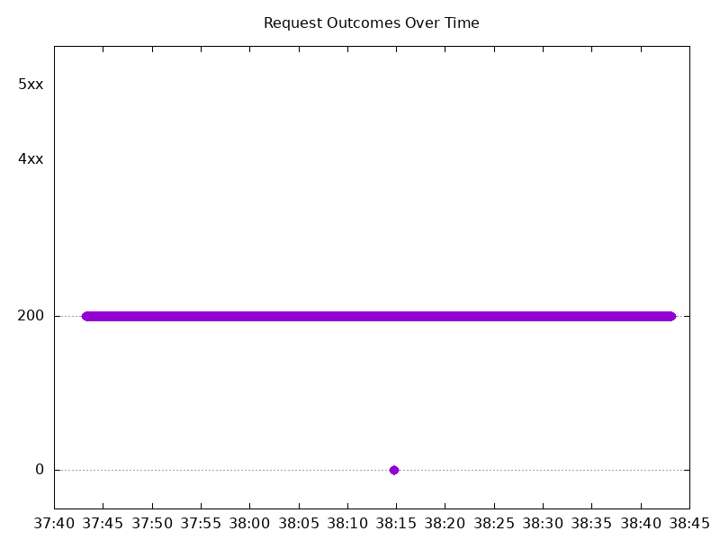

# Results

## Test environment

NGINX Plus: true

NGINX Gateway Fabric:

- Commit: 9baad92b868ab0120bbea128ecfb1e5b14358bbe
- Date: 2026-03-26T17:23:01Z
- Dirty: false

GKE Cluster:

- Node count: 12
- k8s version: v1.34.4-gke.1130000
- vCPUs per node: 16
- RAM per node: 65848324Ki
- Max pods per node: 110
- Zone: us-west1-b
- Instance Type: n2d-standard-16

## Test: Send https /tea traffic

```text
Requests      [total, rate, throughput]         6000, 100.01, 99.78
Duration      [total, attack, wait]             59.994s, 59.992s, 1.733ms
Latencies     [min, mean, 50, 90, 95, 99, max]  719.977µs, 291.648ms, 1.232ms, 85.899ms, 2.926s, 5.166s, 5.782s
Bytes In      [total, mean]                     929835, 154.97
Bytes Out     [total, mean]                     0, 0.00
Success       [ratio]                           99.77%
Status Codes  [code:count]                      0:14  200:5986  
Error Set:
Get "https://cafe.example.com/tea": read tcp 10.138.0.86:54327->10.138.0.121:443: read: connection reset by peer
Get "https://cafe.example.com/tea": read tcp 10.138.0.86:52443->10.138.0.121:443: read: connection reset by peer
Get "https://cafe.example.com/tea": read tcp 10.138.0.86:53483->10.138.0.121:443: read: connection reset by peer
Get "https://cafe.example.com/tea": dial tcp 0.0.0.0:0->10.138.0.121:443: connect: connection refused
```


## Test: Send http /coffee traffic

```text
Requests      [total, rate, throughput]         6000, 100.01, 99.78
Duration      [total, attack, wait]             59.994s, 59.992s, 1.737ms
Latencies     [min, mean, 50, 90, 95, 99, max]  723.162µs, 298.303ms, 1.217ms, 161.764ms, 3.03s, 5.162s, 5.784s
Bytes In      [total, mean]                     965734, 160.96
Bytes Out     [total, mean]                     0, 0.00
Success       [ratio]                           99.77%
Status Codes  [code:count]                      0:14  200:5986  
Error Set:
Get "http://cafe.example.com/coffee": read tcp 10.138.0.86:44773->10.138.0.121:80: read: connection reset by peer
Get "http://cafe.example.com/coffee": read tcp 10.138.0.86:56917->10.138.0.121:80: read: connection reset by peer
Get "http://cafe.example.com/coffee": read tcp 10.138.0.86:54709->10.138.0.121:80: read: connection reset by peer
Get "http://cafe.example.com/coffee": dial tcp 0.0.0.0:0->10.138.0.121:80: connect: connection refused
```


