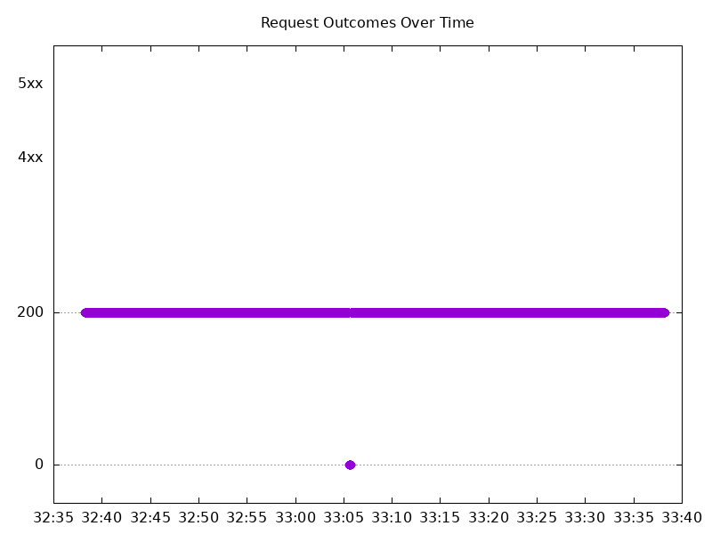

# Results

## Test environment

NGINX Plus: false

NGINX Gateway Fabric:

- Commit: 218bad2df3caa22e9d6293a11a8aba03c6c5adf3
- Date: 2026-05-01T16:51:46Z
- Dirty: false

GKE Cluster:

- Node count: 12
- k8s version: v1.35.3-gke.1234000
- vCPUs per node: 16
- RAM per node: 65848300Ki
- Max pods per node: 110
- Zone: us-west1-b
- Instance Type: n2d-standard-16

## Summary:

- Same error type seen with connection refused errors.

## Test: Send http /coffee traffic

```text
Requests      [total, rate, throughput]         6000, 100.01, 99.72
Duration      [total, attack, wait]             59.995s, 59.991s, 3.661ms
Latencies     [min, mean, 50, 90, 95, 99, max]  633.283µs, 900.124ms, 1.309ms, 4.311s, 7.319s, 9.627s, 10.164s
Bytes In      [total, mean]                     965226, 160.87
Bytes Out     [total, mean]                     0, 0.00
Success       [ratio]                           99.72%
Status Codes  [code:count]                      0:17  200:5983  
Error Set:
Get "http://cafe.example.com/coffee": dial tcp 0.0.0.0:0->10.138.0.11:80: connect: connection refused
```


## Test: Send https /tea traffic

```text
Requests      [total, rate, throughput]         6000, 100.01, 99.72
Duration      [total, attack, wait]             59.995s, 59.993s, 2.495ms
Latencies     [min, mean, 50, 90, 95, 99, max]  557.622µs, 909.984ms, 1.33ms, 4.318s, 7.339s, 9.605s, 10.163s
Bytes In      [total, mean]                     927365, 154.56
Bytes Out     [total, mean]                     0, 0.00
Success       [ratio]                           99.72%
Status Codes  [code:count]                      0:17  200:5983  
Error Set:
Get "https://cafe.example.com/tea": dial tcp 0.0.0.0:0->10.138.0.11:443: connect: connection refused
```


