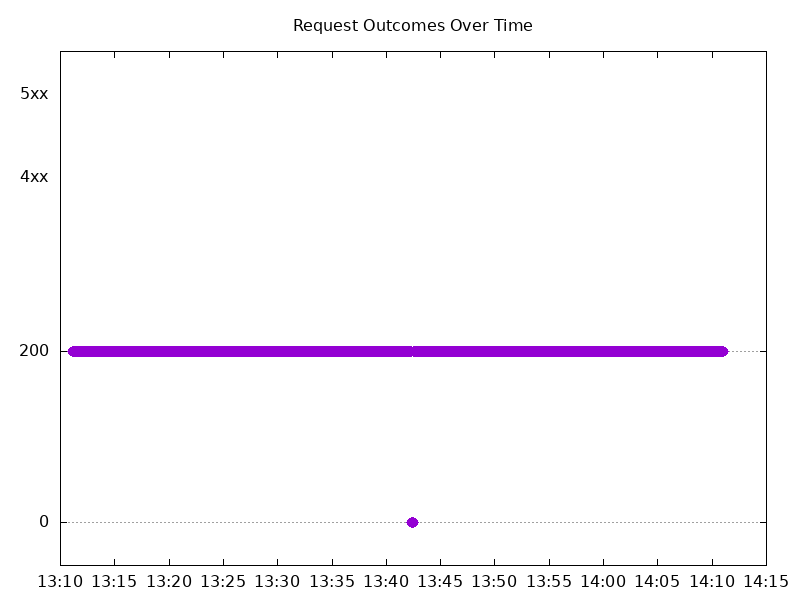

# Results

## Test environment

NGINX Plus: true

NGINX Gateway Fabric:

- Commit: 218bad2df3caa22e9d6293a11a8aba03c6c5adf3
- Date: 2026-05-01T16:51:46Z
- Dirty: false

GKE Cluster:

- Node count: 12
- k8s version: v1.35.3-gke.1234000
- vCPUs per node: 16
- RAM per node: 65848304Ki
- Max pods per node: 110
- Zone: us-west1-b
- Instance Type: n2d-standard-16

## Summary:

- Same error types seen with connection resets and refused connections.

## Test: Send https /tea traffic

```text
Requests      [total, rate, throughput]         6000, 100.01, 99.71
Duration      [total, attack, wait]             59.993s, 59.992s, 1.483ms
Latencies     [min, mean, 50, 90, 95, 99, max]  643.643µs, 143.444ms, 1.228ms, 1.616ms, 1.19s, 3.399s, 4.032s
Bytes In      [total, mean]                     921228, 153.54
Bytes Out     [total, mean]                     0, 0.00
Success       [ratio]                           99.70%
Status Codes  [code:count]                      0:18  200:5982  
Error Set:
Get "https://cafe.example.com/tea": write tcp 10.138.15.201:45401->10.138.0.12:443: write: connection reset by peer
Get "https://cafe.example.com/tea": read tcp 10.138.15.201:58033->10.138.0.12:443: read: connection reset by peer
Get "https://cafe.example.com/tea": dial tcp 0.0.0.0:0->10.138.0.12:443: connect: connection refused
Get "https://cafe.example.com/tea": write tcp 10.138.15.201:57087->10.138.0.12:443: write: connection reset by peer
```


## Test: Send http /coffee traffic

```text
Requests      [total, rate, throughput]         6000, 100.01, 99.71
Duration      [total, attack, wait]             59.993s, 59.992s, 1.889ms
Latencies     [min, mean, 50, 90, 95, 99, max]  639.869µs, 142.266ms, 1.212ms, 1.605ms, 1.196s, 3.395s, 4.027s
Bytes In      [total, mean]                     959096, 159.85
Bytes Out     [total, mean]                     0, 0.00
Success       [ratio]                           99.70%
Status Codes  [code:count]                      0:18  200:5982  
Error Set:
Get "http://cafe.example.com/coffee": read tcp 10.138.15.201:55063->10.138.0.12:80: read: connection reset by peer
Get "http://cafe.example.com/coffee": read tcp 10.138.15.201:51487->10.138.0.12:80: read: connection reset by peer
Get "http://cafe.example.com/coffee": dial tcp 0.0.0.0:0->10.138.0.12:80: connect: connection reset by peer
Get "http://cafe.example.com/coffee": dial tcp 0.0.0.0:0->10.138.0.12:80: connect: connection refused
```


