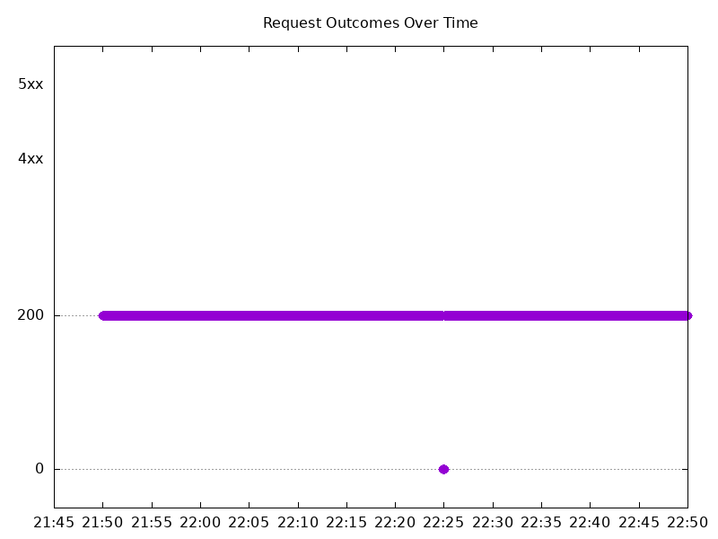

# Results

## Test environment

NGINX Plus: false

NGINX Gateway Fabric:

- Commit: 97fbe08edc096cf95f21939b6ec81975019c26fc
- Date: 2026-08-28T16:57:03Z
- Dirty: false

GKE Cluster:

- Node count: 12
- k8s version: v1.35.7-gke.1027000
- vCPUs per node: 16
- RAM per node: 65848292Ki
- Max pods per node: 110
- Zone: us-west1-b
- Instance Type: n2d-standard-16

## Test: Send http /coffee traffic

```text
Requests      [total, rate, throughput]         6000, 100.01, 99.71
Duration      [total, attack, wait]             59.994s, 59.992s, 1.569ms
Latencies     [min, mean, 50, 90, 95, 99, max]  585.51µs, 329.539ms, 1.07ms, 359.753ms, 3.26s, 5.6s, 6.165s
Bytes In      [total, mean]                     953130, 158.85
Bytes Out     [total, mean]                     0, 0.00
Success       [ratio]                           99.70%
Status Codes  [code:count]                      0:18  200:5982  
Error Set:
Get "http://cafe.example.com/coffee": read tcp 10.138.15.201:33651->10.138.0.71:80: read: connection reset by peer
Get "http://cafe.example.com/coffee": read tcp 10.138.15.201:33883->10.138.0.71:80: read: connection reset by peer
Get "http://cafe.example.com/coffee": read tcp 10.138.15.201:40291->10.138.0.71:80: read: connection reset by peer
Get "http://cafe.example.com/coffee": dial tcp 0.0.0.0:0->10.138.0.71:80: connect: connection refused
```


## Test: Send https /tea traffic

```text
Requests      [total, rate, throughput]         6000, 100.01, 99.71
Duration      [total, attack, wait]             59.994s, 59.992s, 1.535ms
Latencies     [min, mean, 50, 90, 95, 99, max]  571.587µs, 334.849ms, 1.13ms, 485.321ms, 3.348s, 5.62s, 6.179s
Bytes In      [total, mean]                     917295, 152.88
Bytes Out     [total, mean]                     0, 0.00
Success       [ratio]                           99.70%
Status Codes  [code:count]                      0:18  200:5982  
Error Set:
Get "https://cafe.example.com/tea": read tcp 10.138.15.201:44655->10.138.0.71:443: read: connection reset by peer
Get "https://cafe.example.com/tea": read tcp 10.138.15.201:36217->10.138.0.71:443: read: connection reset by peer
Get "https://cafe.example.com/tea": read tcp 10.138.15.201:33697->10.138.0.71:443: read: connection reset by peer
Get "https://cafe.example.com/tea": dial tcp 0.0.0.0:0->10.138.0.71:443: connect: connection refused
```


