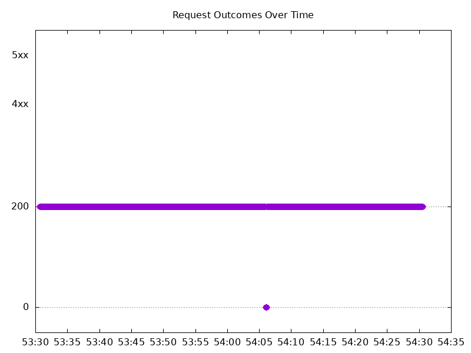

# Results

## Test environment

NGINX Plus: true

NGINX Gateway Fabric:

- Commit: 97fbe08edc096cf95f21939b6ec81975019c26fc
- Date: 2026-08-28T16:57:03Z
- Dirty: false

GKE Cluster:

- Node count: 12
- k8s version: v1.35.7-gke.1027000
- vCPUs per node: 16
- RAM per node: 65848292Ki
- Max pods per node: 110
- Zone: us-west1-b
- Instance Type: n2d-standard-16

## Summary:

- Higher tail latencies (p95/p99/max) than 2.6.0 for both tests.

## Test: Send https /tea traffic

```text
Requests      [total, rate, throughput]         6000, 100.01, 99.73
Duration      [total, attack, wait]             59.993s, 59.992s, 1.365ms
Latencies     [min, mean, 50, 90, 95, 99, max]  431.259µs, 235.672ms, 1.107ms, 14.467ms, 2.317s, 4.658s, 5.221s
Bytes In      [total, mean]                     927365, 154.56
Bytes Out     [total, mean]                     0, 0.00
Success       [ratio]                           99.72%
Status Codes  [code:count]                      0:17  200:5983  
Error Set:
Get "https://cafe.example.com/tea": read tcp 10.138.15.202:36829->10.138.0.13:443: read: connection reset by peer
Get "https://cafe.example.com/tea": read tcp 10.138.15.202:36041->10.138.0.13:443: read: connection reset by peer
Get "https://cafe.example.com/tea": read tcp 10.138.15.202:38955->10.138.0.13:443: read: connection reset by peer
Get "https://cafe.example.com/tea": dial tcp 0.0.0.0:0->10.138.0.13:443: connect: connection refused
```



## Test: Send http /coffee traffic

```text
Requests      [total, rate, throughput]         6000, 100.02, 99.73
Duration      [total, attack, wait]             59.992s, 59.991s, 1.516ms
Latencies     [min, mean, 50, 90, 95, 99, max]  399.74µs, 240.989ms, 1.022ms, 15.674ms, 2.38s, 4.717s, 5.265s
Bytes In      [total, mean]                     963263, 160.54
Bytes Out     [total, mean]                     0, 0.00
Success       [ratio]                           99.72%
Status Codes  [code:count]                      0:17  200:5983  
Error Set:
Get "http://cafe.example.com/coffee": read tcp 10.138.15.202:52457->10.138.0.13:80: read: connection reset by peer
Get "http://cafe.example.com/coffee": read tcp 10.138.15.202:42393->10.138.0.13:80: read: connection reset by peer
Get "http://cafe.example.com/coffee": dial tcp 0.0.0.0:0->10.138.0.13:80: connect: connection refused
```


