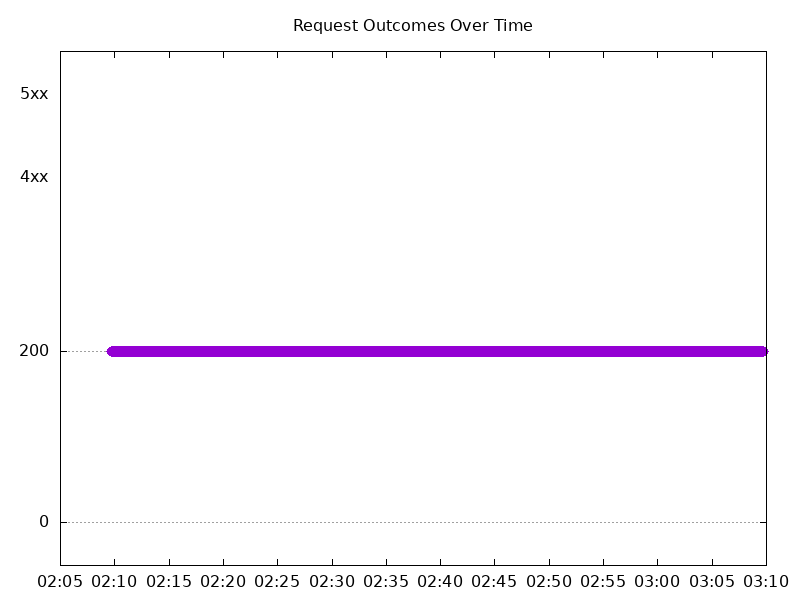
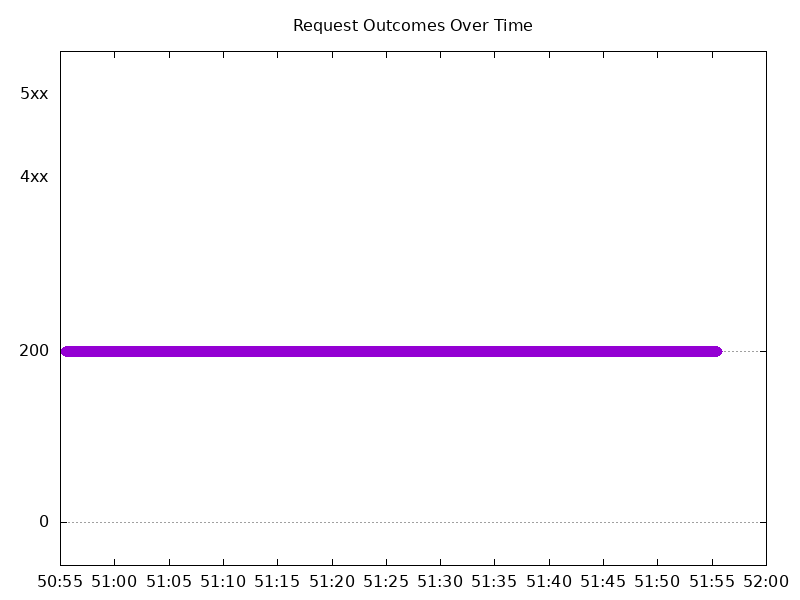

# Results

## Test environment

NGINX Plus: false

NGINX Gateway Fabric:

- Commit: e8ee7c1c4f14e249927a5447a1af2615ddbe0f87
- Date: 2025-12-17T20:04:03Z
- Dirty: false

GKE Cluster:

- Node count: 12
- k8s version: v1.33.5-gke.1308000
- vCPUs per node: 16
- RAM per node: 65851520Ki
- Max pods per node: 110
- Zone: us-west1-b
- Instance Type: n2d-standard-16

## Test: Send https /tea traffic

```text
Requests      [total, rate, throughput]         6000, 100.01, 99.81
Duration      [total, attack, wait]             59.995s, 59.992s, 3.217ms
Latencies     [min, mean, 50, 90, 95, 99, max]  567.655µs, 924.573ms, 1.177ms, 4.552s, 7.478s, 9.782s, 10.343s
Bytes In      [total, mean]                     928140, 154.69
Bytes Out     [total, mean]                     0, 0.00
Success       [ratio]                           99.80%
Status Codes  [code:count]                      0:12  200:5988  
Error Set:
Get "https://cafe.example.com/tea": dial tcp 0.0.0.0:0->10.138.0.69:443: connect: connection refused
```



## Test: Send http /coffee traffic

```text
Requests      [total, rate, throughput]         6000, 100.01, 99.81
Duration      [total, attack, wait]             59.995s, 59.992s, 3.458ms
Latencies     [min, mean, 50, 90, 95, 99, max]  465.788µs, 927.62ms, 1.092ms, 4.575s, 7.488s, 9.782s, 10.339s
Bytes In      [total, mean]                     966032, 161.01
Bytes Out     [total, mean]                     0, 0.00
Success       [ratio]                           99.80%
Status Codes  [code:count]                      0:12  200:5988  
Error Set:
Get "http://cafe.example.com/coffee": dial tcp 0.0.0.0:0->10.138.0.69:80: connect: connection refused
```


