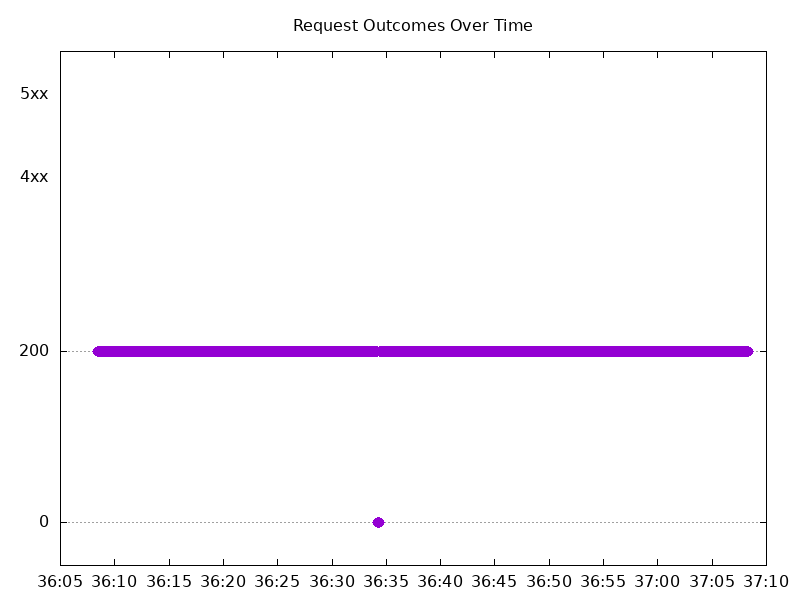

# Results

## Test environment

NGINX Plus: false

NGINX Gateway Fabric:

- Commit: 17c42c8bbbb004ba9c0e9b867396c5f8937207cd
- Date: 2026-04-01T18:33:47Z
- Dirty: false

GKE Cluster:

- Node count: 12
- k8s version: v1.35.1-gke.1396002
- vCPUs per node: 16
- RAM per node: 64305Mi
- Max pods per node: 110
- Zone: us-west1-b
- Instance Type: n2d-standard-16

## Test: Send http /coffee traffic

```text
Requests      [total, rate, throughput]         6000, 100.01, 99.78
Duration      [total, attack, wait]             59.994s, 59.992s, 1.851ms
Latencies     [min, mean, 50, 90, 95, 99, max]  623.703µs, 351.873ms, 1.036ms, 553.208ms, 3.485s, 5.825s, 6.385s
Bytes In      [total, mean]                     963746, 160.62
Bytes Out     [total, mean]                     0, 0.00
Success       [ratio]                           99.77%
Status Codes  [code:count]                      0:14  200:5986  
Error Set:
Get "http://cafe.example.com/coffee": dial tcp 0.0.0.0:0->10.138.0.17:80: connect: connection refused
```



## Test: Send https /tea traffic

```text
Requests      [total, rate, throughput]         6000, 100.01, 99.78
Duration      [total, attack, wait]             59.994s, 59.993s, 1.59ms
Latencies     [min, mean, 50, 90, 95, 99, max]  687.224µs, 356.759ms, 1.124ms, 595.976ms, 3.541s, 5.835s, 6.383s
Bytes In      [total, mean]                     927830, 154.64
Bytes Out     [total, mean]                     0, 0.00
Success       [ratio]                           99.77%
Status Codes  [code:count]                      0:14  200:5986  
Error Set:
Get "https://cafe.example.com/tea": dial tcp 0.0.0.0:0->10.138.0.17:443: connect: connection refused
```


