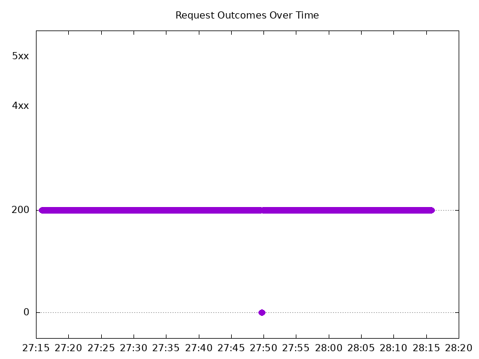

# Results

## Test environment

NGINX Plus: false

NGINX Gateway Fabric:

- Commit: fef4f734728239e3248cda180e74f72e436b06b9
- Date: 2026-08-14T15:07:13Z
- Dirty: false

GKE Cluster:

- Node count: 12
- k8s version: v1.35.6-gke.1258000
- vCPUs per node: 16
- RAM per node: 65848288Ki
- Max pods per node: 110
- Zone: us-west1-b
- Instance Type: n2d-standard-16

## Test: Send https /tea traffic

```text
Requests      [total, rate, throughput]         6000, 100.01, 99.74
Duration      [total, attack, wait]             59.994s, 59.992s, 1.495ms
Latencies     [min, mean, 50, 90, 95, 99, max]  698.074µs, 407.457ms, 1.208ms, 1.062s, 3.979s, 6.268s, 6.821s
Bytes In      [total, mean]                     929627, 154.94
Bytes Out     [total, mean]                     0, 0.00
Success       [ratio]                           99.73%
Status Codes  [code:count]                      0:16  200:5984  
Error Set:
Get "https://cafe.example.com/tea": read tcp 10.138.0.127:54213->10.138.0.5:443: read: connection reset by peer
Get "https://cafe.example.com/tea": read tcp 10.138.0.127:37431->10.138.0.5:443: read: connection reset by peer
Get "https://cafe.example.com/tea": read tcp 10.138.0.127:39053->10.138.0.5:443: read: connection reset by peer
Get "https://cafe.example.com/tea": dial tcp 0.0.0.0:0->10.138.0.5:443: connect: connection refused
```



## Test: Send http /coffee traffic

```text
Requests      [total, rate, throughput]         6000, 100.01, 99.74
Duration      [total, attack, wait]             59.993s, 59.991s, 2.212ms
Latencies     [min, mean, 50, 90, 95, 99, max]  749.976µs, 402.446ms, 1.203ms, 1.013s, 3.929s, 6.261s, 6.816s
Bytes In      [total, mean]                     965427, 160.90
Bytes Out     [total, mean]                     0, 0.00
Success       [ratio]                           99.73%
Status Codes  [code:count]                      0:16  200:5984  
Error Set:
Get "http://cafe.example.com/coffee": read tcp 10.138.0.127:46655->10.138.0.5:80: read: connection reset by peer
Get "http://cafe.example.com/coffee": read tcp 10.138.0.127:33199->10.138.0.5:80: read: connection reset by peer
Get "http://cafe.example.com/coffee": read tcp 10.138.0.127:39927->10.138.0.5:80: read: connection reset by peer
Get "http://cafe.example.com/coffee": dial tcp 0.0.0.0:0->10.138.0.5:80: connect: connection refused
```


