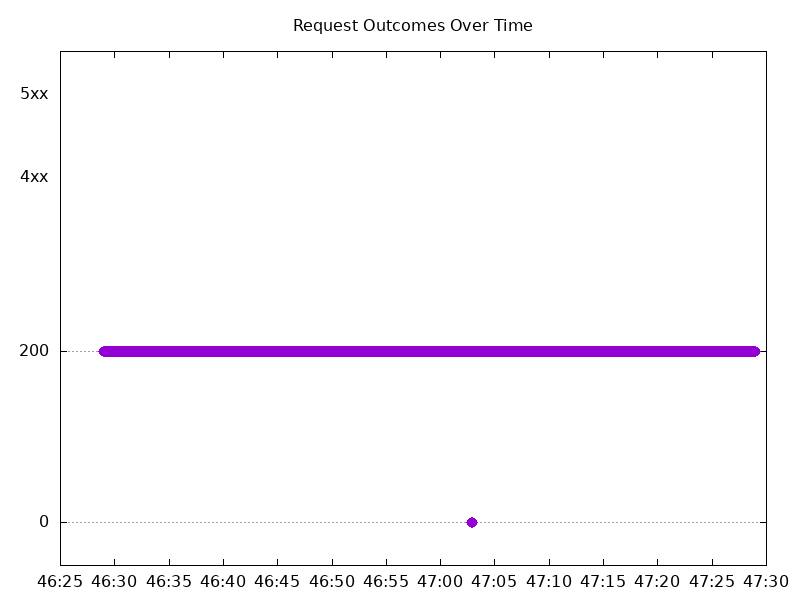

# Results

## Test environment

NGINX Plus: false

NGINX Gateway Fabric:

- Commit: ea67c576e39284e758352dda72242024cc98fa7f
- Date: 2026-10-01T15:28:08Z
- Dirty: false

GKE Cluster:

- Node count: 12
- k8s version: v1.35.8-gke.1225000
- vCPUs per node: 16
- RAM per node: 65848288Ki
- Max pods per node: 110
- Zone: us-west1-b
- Instance Type: n2d-standard-16

## Test: Send https /tea traffic

```text
Requests      [total, rate, throughput]         6000, 100.01, 99.76
Duration      [total, attack, wait]             59.995s, 59.992s, 2.837ms
Latencies     [min, mean, 50, 90, 95, 99, max]  553.907µs, 195.649ms, 1.239ms, 12.892ms, 1.904s, 4.063s, 4.603s
Bytes In      [total, mean]                     921690, 153.62
Bytes Out     [total, mean]                     0, 0.00
Success       [ratio]                           99.75%
Status Codes  [code:count]                      0:15  200:5985  
Error Set:
Get "https://cafe.example.com/tea": read tcp 10.138.0.90:50973->10.138.0.39:443: read: connection reset by peer
Get "https://cafe.example.com/tea": read tcp 10.138.0.90:60533->10.138.0.39:443: read: connection reset by peer
Get "https://cafe.example.com/tea": read tcp 10.138.0.90:38049->10.138.0.39:443: read: connection reset by peer
Get "https://cafe.example.com/tea": dial tcp 0.0.0.0:0->10.138.0.39:443: connect: connection refused
```


## Test: Send http /coffee traffic

```text
Requests      [total, rate, throughput]         6000, 100.01, 99.75
Duration      [total, attack, wait]             59.999s, 59.994s, 5.136ms
Latencies     [min, mean, 50, 90, 95, 99, max]  445.683µs, 195.13ms, 1.23ms, 9.284ms, 1.906s, 4.051s, 4.585s
Bytes In      [total, mean]                     957600, 159.60
Bytes Out     [total, mean]                     0, 0.00
Success       [ratio]                           99.75%
Status Codes  [code:count]                      0:15  200:5985  
Error Set:
Get "http://cafe.example.com/coffee": read tcp 10.138.0.90:41309->10.138.0.39:80: read: connection reset by peer
Get "http://cafe.example.com/coffee": read tcp 10.138.0.90:41279->10.138.0.39:80: read: connection reset by peer
Get "http://cafe.example.com/coffee": read tcp 10.138.0.90:46555->10.138.0.39:80: read: connection reset by peer
Get "http://cafe.example.com/coffee": dial tcp 0.0.0.0:0->10.138.0.39:80: connect: connection refused
```


