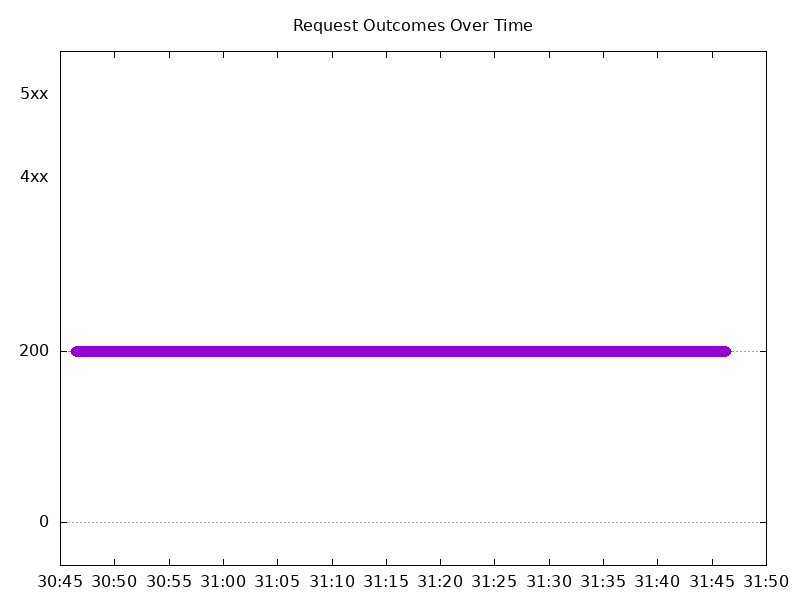

# Results

## Test environment

NGINX Plus: false

NGINX Gateway Fabric:

- Commit: fe52764cce240bb5a3713f56aa113694c2793f93
- Date: 2026-01-20T16:40:22Z
- Dirty: false

GKE Cluster:

- Node count: 12
- k8s version: v1.33.5-gke.2072000
- vCPUs per node: 16
- RAM per node: 65851520Ki
- Max pods per node: 110
- Zone: us-west1-b
- Instance Type: n2d-standard-16

## Test: Send http /coffee traffic

```text
Requests      [total, rate, throughput]         6000, 100.02, 99.75
Duration      [total, attack, wait]             59.993s, 59.991s, 2.187ms
Latencies     [min, mean, 50, 90, 95, 99, max]  561.16µs, 55.298ms, 1.152ms, 1.443ms, 1.833ms, 1.909s, 2.475s
Bytes In      [total, mean]                     965387, 160.90
Bytes Out     [total, mean]                     0, 0.00
Success       [ratio]                           99.73%
Status Codes  [code:count]                      0:16  200:5984  
Error Set:
Get "http://cafe.example.com/coffee": dial tcp 0.0.0.0:0->10.138.0.51:80: connect: connection refused
```



## Test: Send https /tea traffic

```text
Requests      [total, rate, throughput]         6000, 100.02, 99.75
Duration      [total, attack, wait]             59.993s, 59.991s, 2.031ms
Latencies     [min, mean, 50, 90, 95, 99, max]  611.78µs, 56.182ms, 1.192ms, 1.492ms, 1.894ms, 1.918s, 2.482s
Bytes In      [total, mean]                     927520, 154.59
Bytes Out     [total, mean]                     0, 0.00
Success       [ratio]                           99.73%
Status Codes  [code:count]                      0:16  200:5984  
Error Set:
Get "https://cafe.example.com/tea": dial tcp 0.0.0.0:0->10.138.0.51:443: connect: connection refused
```


