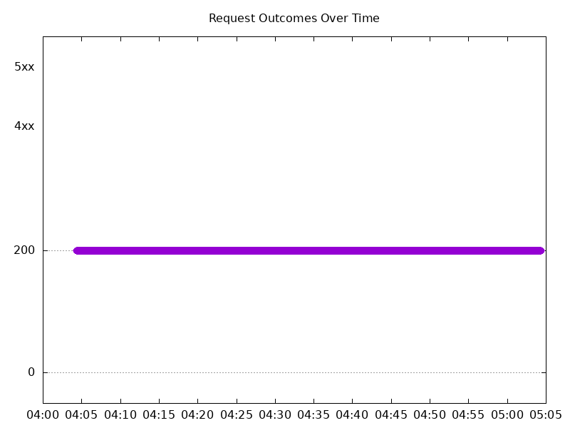
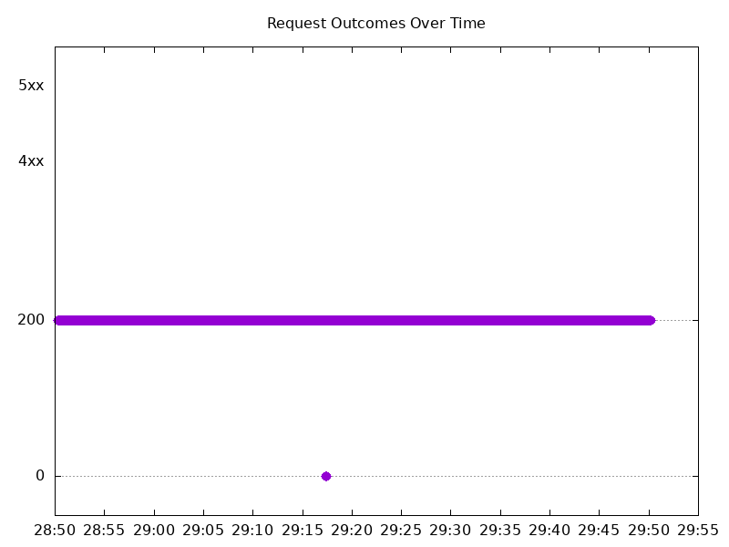

# Results

## Test environment

NGINX Plus: true

NGINX Gateway Fabric:

- Commit: eb3a090367b0c4a450224993fc4eed39e6dd9dc4
- Date: 2026-01-22T21:37:34Z
- Dirty: false

GKE Cluster:

- Node count: 12
- k8s version: v1.33.5-gke.2072000
- vCPUs per node: 16
- RAM per node: 65851520Ki
- Max pods per node: 110
- Zone: us-west1-b
- Instance Type: n2d-standard-16

## Test: Send http /coffee traffic

```text
Requests      [total, rate, throughput]         6000, 100.01, 99.68
Duration      [total, attack, wait]             59.994s, 59.992s, 1.555ms
Latencies     [min, mean, 50, 90, 95, 99, max]  596.874µs, 126.147ms, 1.237ms, 1.553ms, 905.039ms, 3.23s, 3.799s
Bytes In      [total, mean]                     952800, 158.80
Bytes Out     [total, mean]                     0, 0.00
Success       [ratio]                           99.67%
Status Codes  [code:count]                      0:20  200:5980  
Error Set:
Get "http://cafe.example.com/coffee": read tcp 10.138.0.105:52817->10.138.0.45:80: read: connection reset by peer
Get "http://cafe.example.com/coffee": read tcp 10.138.0.105:60215->10.138.0.45:80: read: connection reset by peer
Get "http://cafe.example.com/coffee": read tcp 10.138.0.105:36799->10.138.0.45:80: read: connection reset by peer
Get "http://cafe.example.com/coffee": read tcp 10.138.0.105:41655->10.138.0.45:80: read: connection reset by peer
Get "http://cafe.example.com/coffee": dial tcp 0.0.0.0:0->10.138.0.45:80: connect: connection refused
```



## Test: Send https /tea traffic

```text
Requests      [total, rate, throughput]         6000, 100.01, 99.68
Duration      [total, attack, wait]             59.994s, 59.992s, 1.173ms
Latencies     [min, mean, 50, 90, 95, 99, max]  597.467µs, 126.963ms, 1.297ms, 1.596ms, 915.709ms, 3.245s, 3.802s
Bytes In      [total, mean]                     914940, 152.49
Bytes Out     [total, mean]                     0, 0.00
Success       [ratio]                           99.67%
Status Codes  [code:count]                      0:20  200:5980  
Error Set:
Get "https://cafe.example.com/tea": read tcp 10.138.0.105:52083->10.138.0.45:443: read: connection reset by peer
Get "https://cafe.example.com/tea": dial tcp 0.0.0.0:0->10.138.0.45:443: connect: connection refused
Get "https://cafe.example.com/tea": dial tcp 0.0.0.0:0->10.138.0.45:443: connect: connection reset by peer
Get "https://cafe.example.com/tea": read tcp 10.138.0.105:56277->10.138.0.45:443: read: connection reset by peer
```


