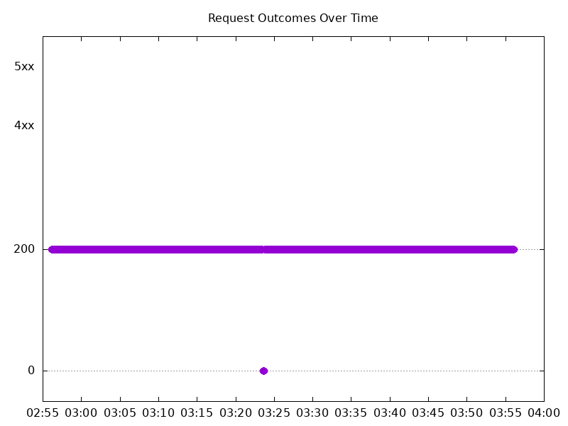

# Results

## Test environment

NGINX Plus: true

NGINX Gateway Fabric:

- Commit: 09f31a0defdd4bf13c648139f55567bf908cfaac
- Date: 2026-04-15T14:59:42Z
- Dirty: false

GKE Cluster:

- Node count: 12
- k8s version: v1.35.1-gke.1396002
- vCPUs per node: 16
- RAM per node: 65848324Ki
- Max pods per node: 110
- Zone: us-west1-b
- Instance Type: n2d-standard-16

## Test: Send http /coffee traffic

```text
Requests      [total, rate, throughput]         6000, 100.01, 99.77
Duration      [total, attack, wait]             59.995s, 59.992s, 3.196ms
Latencies     [min, mean, 50, 90, 95, 99, max]  577.083µs, 880.858ms, 1.075ms, 4.303s, 7.205s, 9.532s, 10.095s
Bytes In      [total, mean]                     957760, 159.63
Bytes Out     [total, mean]                     0, 0.00
Success       [ratio]                           99.77%
Status Codes  [code:count]                      0:14  200:5986  
Error Set:
Get "http://cafe.example.com/coffee": read tcp 10.138.0.43:40179->10.138.0.41:80: read: connection reset by peer
Get "http://cafe.example.com/coffee": read tcp 10.138.0.43:33523->10.138.0.41:80: read: connection reset by peer
Get "http://cafe.example.com/coffee": read tcp 10.138.0.43:56761->10.138.0.41:80: read: connection reset by peer
Get "http://cafe.example.com/coffee": dial tcp 0.0.0.0:0->10.138.0.41:80: connect: connection refused
```


## Test: Send https /tea traffic

```text
Requests      [total, rate, throughput]         6000, 100.01, 99.77
Duration      [total, attack, wait]             59.995s, 59.992s, 3.276ms
Latencies     [min, mean, 50, 90, 95, 99, max]  521.011µs, 885.594ms, 1.121ms, 4.398s, 7.224s, 9.551s, 10.113s
Bytes In      [total, mean]                     921844, 153.64
Bytes Out     [total, mean]                     0, 0.00
Success       [ratio]                           99.77%
Status Codes  [code:count]                      0:14  200:5986  
Error Set:
Get "https://cafe.example.com/tea": read tcp 10.138.0.43:46667->10.138.0.41:443: read: connection reset by peer
Get "https://cafe.example.com/tea": read tcp 10.138.0.43:40281->10.138.0.41:443: read: connection reset by peer
Get "https://cafe.example.com/tea": read tcp 10.138.0.43:37515->10.138.0.41:443: read: connection reset by peer
Get "https://cafe.example.com/tea": dial tcp 0.0.0.0:0->10.138.0.41:443: connect: connection refused
```


