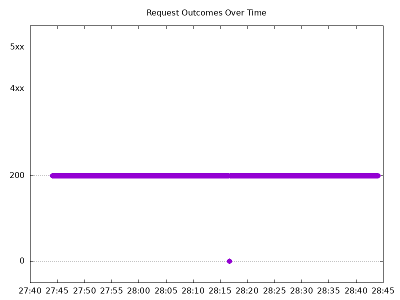

# Results

## Test environment

NGINX Plus: true

NGINX Gateway Fabric:

- Commit: fef4f734728239e3248cda180e74f72e436b06b9
- Date: 2026-08-14T15:07:13Z
- Dirty: false

GKE Cluster:

- Node count: 12
- k8s version: v1.35.6-gke.1258000
- vCPUs per node: 16
- RAM per node: 65848296Ki
- Max pods per node: 110
- Zone: us-west1-b
- Instance Type: n2d-standard-16

## Test: Send https /tea traffic

```text
Requests      [total, rate, throughput]         6000, 100.01, 99.71
Duration      [total, attack, wait]             59.995s, 59.992s, 2.909ms
Latencies     [min, mean, 50, 90, 95, 99, max]  609.326µs, 66.243ms, 1.154ms, 1.566ms, 34.676ms, 2.178s, 2.74s
Bytes In      [total, mean]                     929228, 154.87
Bytes Out     [total, mean]                     0, 0.00
Success       [ratio]                           99.70%
Status Codes  [code:count]                      0:18  200:5982  
Error Set:
Get "https://cafe.example.com/tea": read tcp 10.138.0.126:55367->10.138.0.107:443: read: connection reset by peer
Get "https://cafe.example.com/tea": read tcp 10.138.0.126:36971->10.138.0.107:443: read: connection reset by peer
Get "https://cafe.example.com/tea": read tcp 10.138.0.126:58107->10.138.0.107:443: read: connection reset by peer
Get "https://cafe.example.com/tea": dial tcp 0.0.0.0:0->10.138.0.107:443: connect: connection refused
```


## Test: Send http /coffee traffic

```text
Requests      [total, rate, throughput]         6000, 100.01, 99.71
Duration      [total, attack, wait]             59.994s, 59.991s, 2.6ms
Latencies     [min, mean, 50, 90, 95, 99, max]  591.007µs, 67.163ms, 1.065ms, 1.506ms, 41.348ms, 2.182s, 2.715s
Bytes In      [total, mean]                     965172, 160.86
Bytes Out     [total, mean]                     0, 0.00
Success       [ratio]                           99.70%
Status Codes  [code:count]                      0:18  200:5982  
Error Set:
Get "http://cafe.example.com/coffee": read tcp 10.138.0.126:58391->10.138.0.107:80: read: connection reset by peer
Get "http://cafe.example.com/coffee": read tcp 10.138.0.126:45537->10.138.0.107:80: read: connection reset by peer
Get "http://cafe.example.com/coffee": dial tcp 0.0.0.0:0->10.138.0.107:80: connect: connection refused
```


