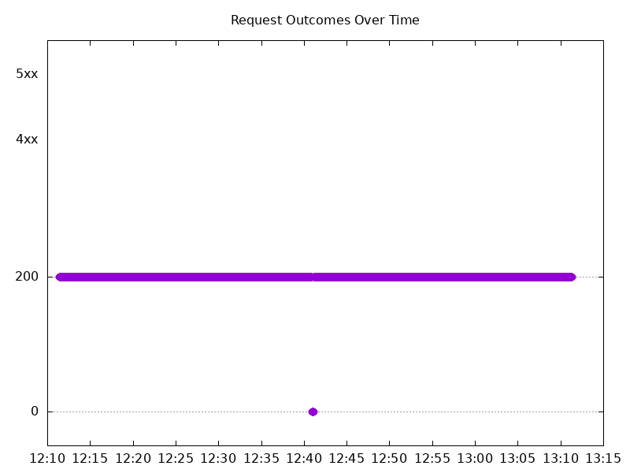

# Results

## Test environment

NGINX Plus: true

NGINX Gateway Fabric:

- Commit: ea67c576e39284e758352dda72242024cc98fa7f
- Date: 2026-10-01T15:28:08Z
- Dirty: false

GKE Cluster:

- Node count: 12
- k8s version: v1.35.8-gke.1225000
- vCPUs per node: 16
- RAM per node: 65848284Ki
- Max pods per node: 110
- Zone: us-west1-b
- Instance Type: n2d-standard-16

## Test: Send https /tea traffic

```text
Requests      [total, rate, throughput]         6000, 100.01, 99.72
Duration      [total, attack, wait]             59.996s, 59.993s, 3.61ms
Latencies     [min, mean, 50, 90, 95, 99, max]  567.088µs, 1.221s, 1.372ms, 6.193s, 8.872s, 11.318s, 11.863s
Bytes In      [total, mean]                     929343, 154.89
Bytes Out     [total, mean]                     0, 0.00
Success       [ratio]                           99.72%
Status Codes  [code:count]                      0:17  200:5983  
Error Set:
Get "https://cafe.example.com/tea": write tcp 10.138.0.89:50427->10.138.0.27:443: write: connection reset by peer
Get "https://cafe.example.com/tea": read tcp 10.138.0.89:37041->10.138.0.27:443: read: connection reset by peer
Get "https://cafe.example.com/tea": dial tcp 0.0.0.0:0->10.138.0.27:443: connect: connection refused
```


## Test: Send http /coffee traffic

```text
Requests      [total, rate, throughput]         6000, 100.01, 99.72
Duration      [total, attack, wait]             59.996s, 59.993s, 3.146ms
Latencies     [min, mean, 50, 90, 95, 99, max]  512.619µs, 1.197s, 1.354ms, 5.935s, 8.869s, 11.258s, 11.825s
Bytes In      [total, mean]                     965266, 160.88
Bytes Out     [total, mean]                     0, 0.00
Success       [ratio]                           99.72%
Status Codes  [code:count]                      0:17  200:5983  
Error Set:
Get "http://cafe.example.com/coffee": read tcp 10.138.0.89:51629->10.138.0.27:80: read: connection reset by peer
Get "http://cafe.example.com/coffee": read tcp 10.138.0.89:52051->10.138.0.27:80: read: connection reset by peer
Get "http://cafe.example.com/coffee": read tcp 10.138.0.89:37183->10.138.0.27:80: read: connection reset by peer
Get "http://cafe.example.com/coffee": dial tcp 0.0.0.0:0->10.138.0.27:80: connect: connection refused
```


