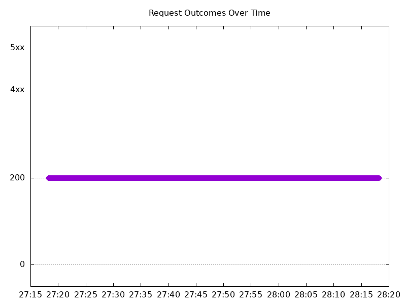

# Results

## Test environment

NGINX Plus: true

NGINX Gateway Fabric:

- Commit: dbebd9791cb7aa5e8d10735800f776fd516b06c3
- Date: 2025-12-02T17:38:16Z
- Dirty: false

GKE Cluster:

- Node count: 12
- k8s version: v1.33.5-gke.1201000
- vCPUs per node: 16
- RAM per node: 65851520Ki
- Max pods per node: 110
- Zone: us-west1-b
- Instance Type: n2d-standard-16

## Test: Send http /coffee traffic

```text
Requests      [total, rate, throughput]         6000, 100.01, 99.72
Duration      [total, attack, wait]             59.997s, 59.993s, 3.981ms
Latencies     [min, mean, 50, 90, 95, 99, max]  610.273µs, 1.185s, 1.23ms, 5.83s, 8.834s, 11.17s, 11.733s
Bytes In      [total, mean]                     963263, 160.54
Bytes Out     [total, mean]                     0, 0.00
Success       [ratio]                           99.72%
Status Codes  [code:count]                      0:17  200:5983  
Error Set:
Get "http://cafe.example.com/coffee": read tcp 10.138.0.54:51295->10.138.0.113:80: read: connection reset by peer
Get "http://cafe.example.com/coffee": read tcp 10.138.0.54:56235->10.138.0.113:80: read: connection reset by peer
Get "http://cafe.example.com/coffee": read tcp 10.138.0.54:45899->10.138.0.113:80: read: connection reset by peer
Get "http://cafe.example.com/coffee": read tcp 10.138.0.54:38389->10.138.0.113:80: read: connection reset by peer
Get "http://cafe.example.com/coffee": dial tcp 0.0.0.0:0->10.138.0.113:80: connect: connection refused
```



## Test: Send https /tea traffic

```text
Requests      [total, rate, throughput]         6000, 100.01, 99.72
Duration      [total, attack, wait]             59.997s, 59.993s, 4.038ms
Latencies     [min, mean, 50, 90, 95, 99, max]  576.613µs, 1.202s, 1.273ms, 5.919s, 8.873s, 11.175s, 11.731s
Bytes In      [total, mean]                     929317, 154.89
Bytes Out     [total, mean]                     0, 0.00
Success       [ratio]                           99.72%
Status Codes  [code:count]                      0:17  200:5983  
Error Set:
Get "https://cafe.example.com/tea": read tcp 10.138.0.54:56879->10.138.0.113:443: read: connection reset by peer
Get "https://cafe.example.com/tea": read tcp 10.138.0.54:50155->10.138.0.113:443: read: connection reset by peer
Get "https://cafe.example.com/tea": read tcp 10.138.0.54:47769->10.138.0.113:443: read: connection reset by peer
Get "https://cafe.example.com/tea": read tcp 10.138.0.54:58107->10.138.0.113:443: read: connection reset by peer
Get "https://cafe.example.com/tea": dial tcp 0.0.0.0:0->10.138.0.113:443: connect: connection refused
```


