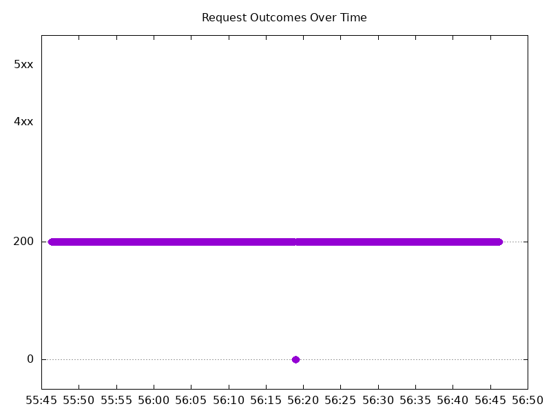

# Results

## Test environment

NGINX Plus: false

NGINX Gateway Fabric:

- Commit: 8241478604f782eca497329ae47507b978d117b1
- Date: 2025-09-24T18:19:40Z
- Dirty: false

GKE Cluster:

- Node count: 15
- k8s version: v1.33.4-gke.1134000
- vCPUs per node: 2
- RAM per node: 4015668Ki
- Max pods per node: 110
- Zone: us-east1-b
- Instance Type: e2-medium

## Test: Send https /tea traffic

```text
Requests      [total, rate, throughput]         6000, 100.01, 99.66
Duration      [total, attack, wait]             59.994s, 59.993s, 1.742ms
Latencies     [min, mean, 50, 90, 95, 99, max]  579.788µs, 236.428ms, 1.95ms, 12.814ms, 2.333s, 4.553s, 5.076s
Bytes In      [total, mean]                     928726, 154.79
Bytes Out     [total, mean]                     0, 0.00
Success       [ratio]                           99.65%
Status Codes  [code:count]                      0:21  200:5979  
Error Set:
Get "https://cafe.example.com/tea": dial tcp 0.0.0.0:0->10.142.0.59:443: connect: connection refused
```



## Test: Send http /coffee traffic

```text
Requests      [total, rate, throughput]         6000, 100.01, 99.64
Duration      [total, attack, wait]             59.994s, 59.992s, 1.987ms
Latencies     [min, mean, 50, 90, 95, 99, max]  591.987µs, 232.293ms, 1.892ms, 12.183ms, 2.28s, 4.543s, 5.056s
Bytes In      [total, mean]                     962458, 160.41
Bytes Out     [total, mean]                     0, 0.00
Success       [ratio]                           99.63%
Status Codes  [code:count]                      0:22  200:5978  
Error Set:
Get "http://cafe.example.com/coffee": dial tcp 0.0.0.0:0->10.142.0.59:80: connect: connection refused
```


