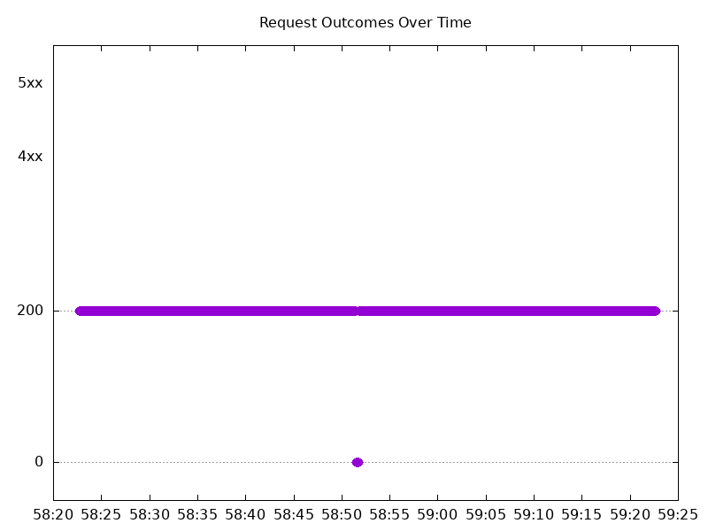

# Results

## Test environment

NGINX Plus: true

NGINX Gateway Fabric:

- Commit: 8241478604f782eca497329ae47507b978d117b1
- Date: 2025-09-25T01:19:35Z
- Dirty: false

GKE Cluster:

- Node count: 15
- k8s version: v1.33.4-gke.1134000
- vCPUs per node: 2
- RAM per node: 4015672Ki
- Max pods per node: 110
- Zone: us-south1-a
- Instance Type: e2-medium

## Test: Send https /tea traffic

```text
Requests      [total, rate, throughput]         6000, 100.01, 99.61
Duration      [total, attack, wait]             59.994s, 59.992s, 2.553ms
Latencies     [min, mean, 50, 90, 95, 99, max]  501.4µs, 629.899ms, 1.546ms, 2.856s, 5.518s, 7.81s, 8.341s
Bytes In      [total, mean]                     928271, 154.71
Bytes Out     [total, mean]                     0, 0.00
Success       [ratio]                           99.60%
Status Codes  [code:count]                      0:24  200:5976  
Error Set:
Get "https://cafe.example.com/tea": read tcp 10.206.0.17:60039->10.206.0.24:443: read: connection reset by peer
Get "https://cafe.example.com/tea": write tcp 10.206.0.17:44027->10.206.0.24:443: write: connection reset by peer
Get "https://cafe.example.com/tea": dial tcp 0.0.0.0:0->10.206.0.24:443: connect: connection refused
```



## Test: Send http /coffee traffic

```text
Requests      [total, rate, throughput]         6000, 100.01, 99.61
Duration      [total, attack, wait]             59.994s, 59.992s, 2.318ms
Latencies     [min, mean, 50, 90, 95, 99, max]  492.213µs, 611.258ms, 1.381ms, 2.64s, 5.498s, 7.789s, 8.344s
Bytes In      [total, mean]                     962095, 160.35
Bytes Out     [total, mean]                     0, 0.00
Success       [ratio]                           99.60%
Status Codes  [code:count]                      0:24  200:5976  
Error Set:
Get "http://cafe.example.com/coffee": read tcp 10.206.0.17:42805->10.206.0.24:80: read: connection reset by peer
Get "http://cafe.example.com/coffee": read tcp 10.206.0.17:46097->10.206.0.24:80: read: connection reset by peer
Get "http://cafe.example.com/coffee": dial tcp 0.0.0.0:0->10.206.0.24:80: connect: connection refused
```


