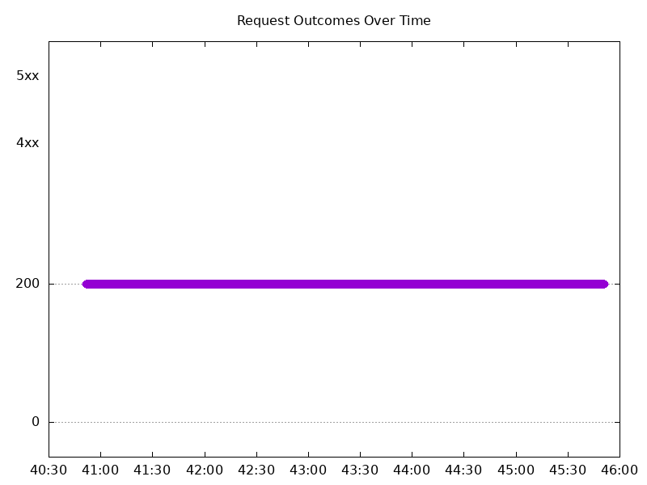
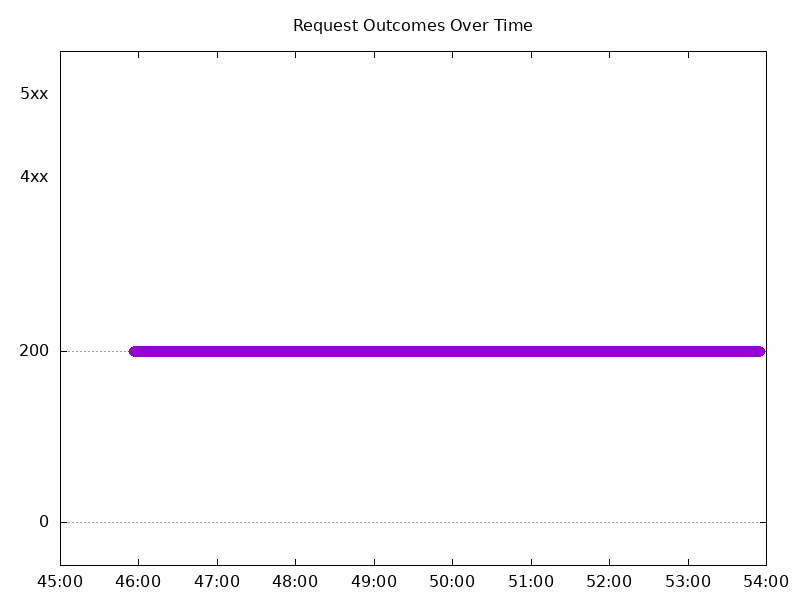
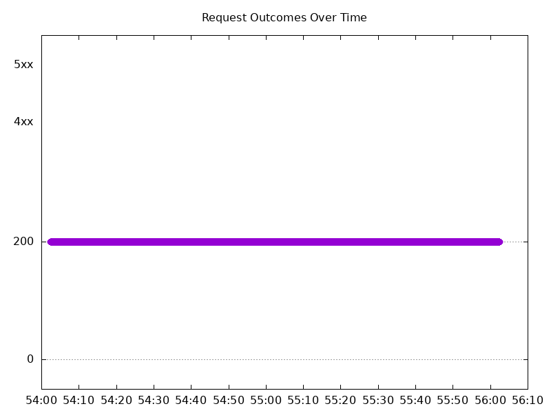
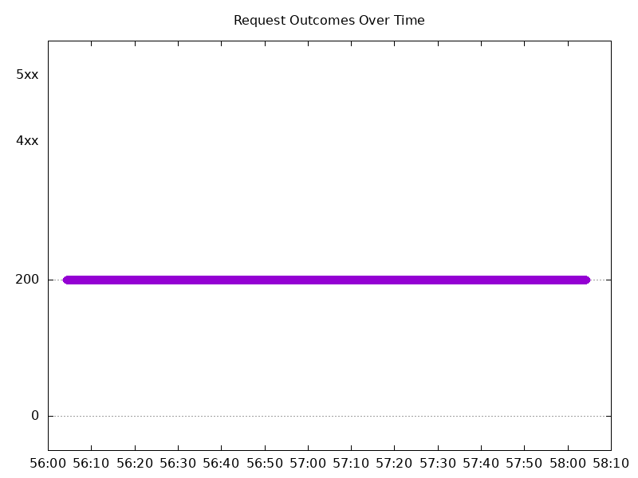
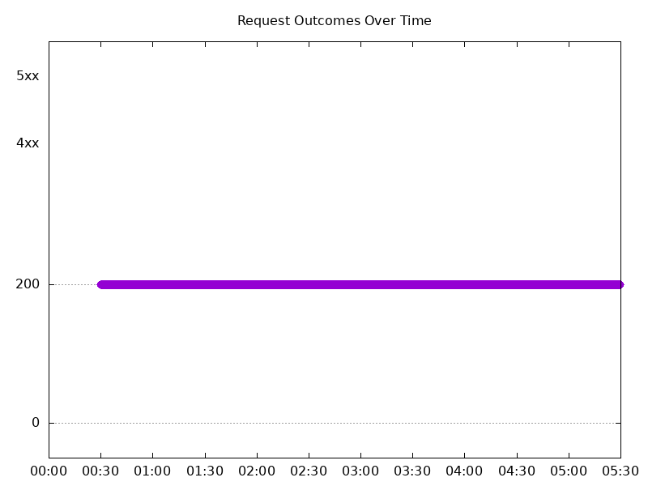
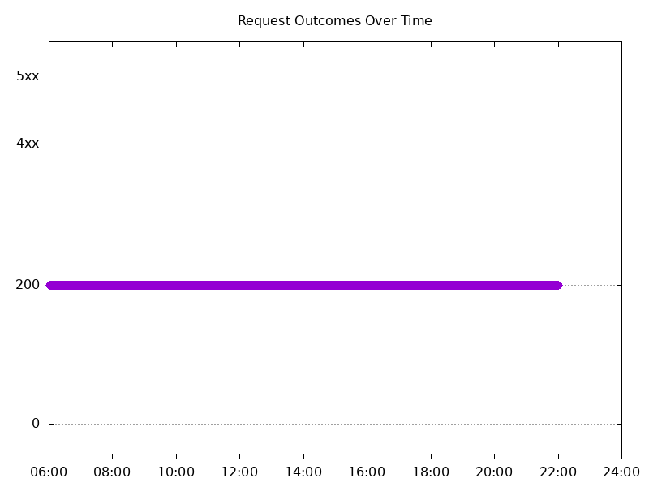
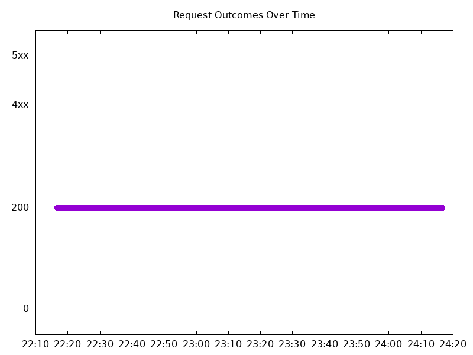
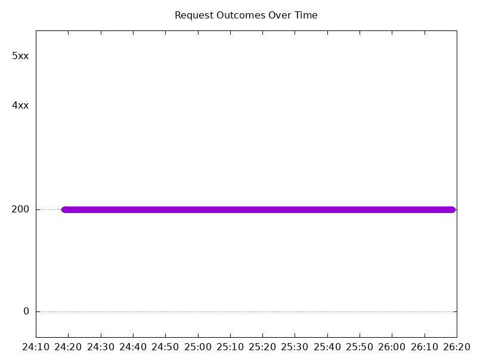

# Results

## Test environment

NGINX Plus: false

NGINX Gateway Fabric:

- Commit: 9baad92b868ab0120bbea128ecfb1e5b14358bbe
- Date: 2026-03-26T17:23:01Z
- Dirty: false

GKE Cluster:

- Node count: 12
- k8s version: v1.34.4-gke.1130000
- vCPUs per node: 16
- RAM per node: 65848324Ki
- Max pods per node: 110
- Zone: us-west1-b
- Instance Type: n2d-standard-16

## One NGINX Pod runs per node Test Results

### Scale Up Gradually

#### Test: Send https /tea traffic

```text
Requests      [total, rate, throughput]         30000, 100.00, 100.00
Duration      [total, attack, wait]             5m0s, 5m0s, 1.107ms
Latencies     [min, mean, 50, 90, 95, 99, max]  653.556µs, 1.159ms, 1.128ms, 1.318ms, 1.384ms, 1.996ms, 21.694ms
Bytes In      [total, mean]                     4656053, 155.20
Bytes Out     [total, mean]                     0, 0.00
Success       [ratio]                           100.00%
Status Codes  [code:count]                      200:30000  
Error Set:
```


#### Test: Send http /coffee traffic

```text
Requests      [total, rate, throughput]         30000, 100.00, 100.00
Duration      [total, attack, wait]             5m0s, 5m0s, 1.228ms
Latencies     [min, mean, 50, 90, 95, 99, max]  583.128µs, 1.114ms, 1.093ms, 1.282ms, 1.35ms, 1.997ms, 23.212ms
Bytes In      [total, mean]                     4836078, 161.20
Bytes Out     [total, mean]                     0, 0.00
Success       [ratio]                           100.00%
Status Codes  [code:count]                      200:30000  
Error Set:
```



### Scale Down Gradually

#### Test: Send http /coffee traffic

```text
Requests      [total, rate, throughput]         48000, 100.00, 100.00
Duration      [total, attack, wait]             8m0s, 8m0s, 1.083ms
Latencies     [min, mean, 50, 90, 95, 99, max]  591.952µs, 1.089ms, 1.059ms, 1.273ms, 1.355ms, 1.767ms, 47.312ms
Bytes In      [total, mean]                     7737706, 161.20
Bytes Out     [total, mean]                     0, 0.00
Success       [ratio]                           100.00%
Status Codes  [code:count]                      200:48000  
Error Set:
```


#### Test: Send https /tea traffic

```text
Requests      [total, rate, throughput]         48000, 100.00, 100.00
Duration      [total, attack, wait]             8m0s, 8m0s, 1.242ms
Latencies     [min, mean, 50, 90, 95, 99, max]  649.383µs, 1.194ms, 1.15ms, 1.4ms, 1.502ms, 1.972ms, 41.306ms
Bytes In      [total, mean]                     7449468, 155.20
Bytes Out     [total, mean]                     0, 0.00
Success       [ratio]                           100.00%
Status Codes  [code:count]                      200:48000  
Error Set:
```



### Scale Up Abruptly

#### Test: Send http /coffee traffic

```text
Requests      [total, rate, throughput]         12000, 100.01, 100.01
Duration      [total, attack, wait]             2m0s, 2m0s, 1.311ms
Latencies     [min, mean, 50, 90, 95, 99, max]  615.584µs, 1.061ms, 1.039ms, 1.202ms, 1.263ms, 1.595ms, 19.841ms
Bytes In      [total, mean]                     1934412, 161.20
Bytes Out     [total, mean]                     0, 0.00
Success       [ratio]                           100.00%
Status Codes  [code:count]                      200:12000  
Error Set:
```



#### Test: Send https /tea traffic

```text
Requests      [total, rate, throughput]         12000, 100.01, 100.01
Duration      [total, attack, wait]             2m0s, 2m0s, 1.212ms
Latencies     [min, mean, 50, 90, 95, 99, max]  677.521µs, 1.14ms, 1.112ms, 1.279ms, 1.342ms, 1.89ms, 65.45ms
Bytes In      [total, mean]                     1862396, 155.20
Bytes Out     [total, mean]                     0, 0.00
Success       [ratio]                           100.00%
Status Codes  [code:count]                      200:12000  
Error Set:
```


### Scale Down Abruptly

#### Test: Send https /tea traffic

```text
Requests      [total, rate, throughput]         12000, 100.01, 100.01
Duration      [total, attack, wait]             2m0s, 2m0s, 1.136ms
Latencies     [min, mean, 50, 90, 95, 99, max]  703.393µs, 1.141ms, 1.125ms, 1.289ms, 1.344ms, 1.552ms, 30.156ms
Bytes In      [total, mean]                     1862372, 155.20
Bytes Out     [total, mean]                     0, 0.00
Success       [ratio]                           100.00%
Status Codes  [code:count]                      200:12000  
Error Set:
```


#### Test: Send http /coffee traffic

```text
Requests      [total, rate, throughput]         12000, 100.01, 100.01
Duration      [total, attack, wait]             2m0s, 2m0s, 1.13ms
Latencies     [min, mean, 50, 90, 95, 99, max]  669.922µs, 1.082ms, 1.067ms, 1.215ms, 1.263ms, 1.428ms, 30.892ms
Bytes In      [total, mean]                     1934390, 161.20
Bytes Out     [total, mean]                     0, 0.00
Success       [ratio]                           100.00%
Status Codes  [code:count]                      200:12000  
Error Set:
```



## Multiple NGINX Pods run per node Test Results

### Scale Up Gradually

#### Test: Send http /coffee traffic

```text
Requests      [total, rate, throughput]         30000, 100.00, 100.00
Duration      [total, attack, wait]             5m0s, 5m0s, 984.228µs
Latencies     [min, mean, 50, 90, 95, 99, max]  612.093µs, 1.102ms, 1.071ms, 1.274ms, 1.353ms, 2.161ms, 26.046ms
Bytes In      [total, mean]                     4833019, 161.10
Bytes Out     [total, mean]                     0, 0.00
Success       [ratio]                           100.00%
Status Codes  [code:count]                      200:30000  
Error Set:
```



#### Test: Send https /tea traffic

```text
Requests      [total, rate, throughput]         30000, 100.00, 100.00
Duration      [total, attack, wait]             5m0s, 5m0s, 861.191µs
Latencies     [min, mean, 50, 90, 95, 99, max]  649.328µs, 1.166ms, 1.123ms, 1.316ms, 1.393ms, 2.204ms, 29.224ms
Bytes In      [total, mean]                     4653083, 155.10
Bytes Out     [total, mean]                     0, 0.00
Success       [ratio]                           100.00%
Status Codes  [code:count]                      200:30000  
Error Set:
```


### Scale Down Gradually

#### Test: Send http /coffee traffic

```text
Requests      [total, rate, throughput]         96000, 100.00, 100.00
Duration      [total, attack, wait]             16m0s, 16m0s, 1.346ms
Latencies     [min, mean, 50, 90, 95, 99, max]  620.962µs, 1.122ms, 1.099ms, 1.278ms, 1.342ms, 1.912ms, 62.872ms
Bytes In      [total, mean]                     15465569, 161.10
Bytes Out     [total, mean]                     0, 0.00
Success       [ratio]                           100.00%
Status Codes  [code:count]                      200:96000  
Error Set:
```


#### Test: Send https /tea traffic

```text
Requests      [total, rate, throughput]         96000, 100.00, 100.00
Duration      [total, attack, wait]             16m0s, 16m0s, 1.239ms
Latencies     [min, mean, 50, 90, 95, 99, max]  668.702µs, 1.183ms, 1.151ms, 1.335ms, 1.402ms, 1.95ms, 63.404ms
Bytes In      [total, mean]                     14889634, 155.10
Bytes Out     [total, mean]                     0, 0.00
Success       [ratio]                           100.00%
Status Codes  [code:count]                      200:96000  
Error Set:
```



### Scale Up Abruptly

#### Test: Send http /coffee traffic

```text
Requests      [total, rate, throughput]         12000, 100.01, 100.01
Duration      [total, attack, wait]             2m0s, 2m0s, 770.755µs
Latencies     [min, mean, 50, 90, 95, 99, max]  692.579µs, 1.123ms, 1.114ms, 1.281ms, 1.334ms, 1.541ms, 8.48ms
Bytes In      [total, mean]                     1933189, 161.10
Bytes Out     [total, mean]                     0, 0.00
Success       [ratio]                           100.00%
Status Codes  [code:count]                      200:12000  
Error Set:
```


#### Test: Send https /tea traffic

```text
Requests      [total, rate, throughput]         12000, 100.01, 100.01
Duration      [total, attack, wait]             2m0s, 2m0s, 1.254ms
Latencies     [min, mean, 50, 90, 95, 99, max]  687.459µs, 1.178ms, 1.16ms, 1.341ms, 1.4ms, 1.746ms, 11.363ms
Bytes In      [total, mean]                     1861191, 155.10
Bytes Out     [total, mean]                     0, 0.00
Success       [ratio]                           100.00%
Status Codes  [code:count]                      200:12000  
Error Set:
```



### Scale Down Abruptly

#### Test: Send https /tea traffic

```text
Requests      [total, rate, throughput]         12000, 100.01, 100.01
Duration      [total, attack, wait]             2m0s, 2m0s, 1.221ms
Latencies     [min, mean, 50, 90, 95, 99, max]  739.64µs, 1.194ms, 1.178ms, 1.361ms, 1.42ms, 1.607ms, 11.945ms
Bytes In      [total, mean]                     1861238, 155.10
Bytes Out     [total, mean]                     0, 0.00
Success       [ratio]                           100.00%
Status Codes  [code:count]                      200:12000  
Error Set:
```


#### Test: Send http /coffee traffic

```text
Requests      [total, rate, throughput]         12000, 100.01, 100.01
Duration      [total, attack, wait]             2m0s, 2m0s, 1.318ms
Latencies     [min, mean, 50, 90, 95, 99, max]  725.658µs, 1.148ms, 1.132ms, 1.32ms, 1.384ms, 1.616ms, 11.56ms
Bytes In      [total, mean]                     1933231, 161.10
Bytes Out     [total, mean]                     0, 0.00
Success       [ratio]                           100.00%
Status Codes  [code:count]                      200:12000  
Error Set:
```


