# Results

## Test environment

NGINX Plus: true

NGINX Gateway Fabric:

- Commit: 9baad92b868ab0120bbea128ecfb1e5b14358bbe
- Date: 2026-03-26T17:23:01Z
- Dirty: false

GKE Cluster:

- Node count: 12
- k8s version: v1.34.4-gke.1130000
- vCPUs per node: 16
- RAM per node: 65848324Ki
- Max pods per node: 110
- Zone: us-west1-b
- Instance Type: n2d-standard-16

## One NGINX Pod runs per node Test Results

### Scale Up Gradually

#### Test: Send https /tea traffic

```text
Requests      [total, rate, throughput]         30000, 100.00, 100.00
Duration      [total, attack, wait]             5m0s, 5m0s, 1.275ms
Latencies     [min, mean, 50, 90, 95, 99, max]  696.143µs, 1.186ms, 1.166ms, 1.348ms, 1.417ms, 1.803ms, 16.809ms
Bytes In      [total, mean]                     4656126, 155.20
Bytes Out     [total, mean]                     0, 0.00
Success       [ratio]                           100.00%
Status Codes  [code:count]                      200:30000  
Error Set:
```

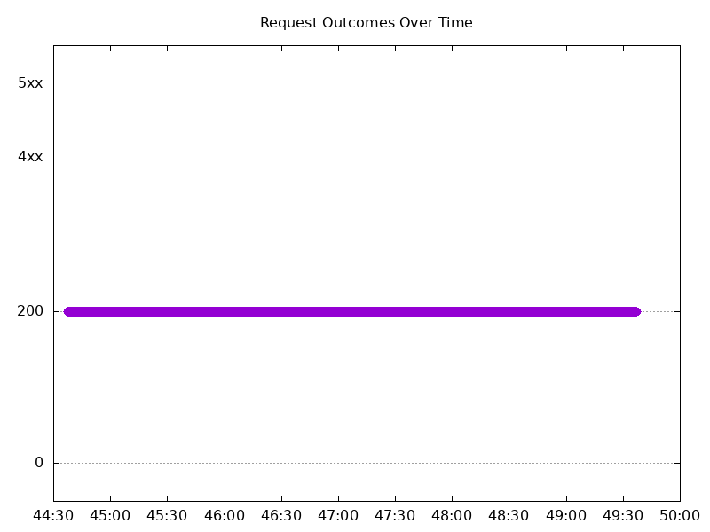

#### Test: Send http /coffee traffic

```text
Requests      [total, rate, throughput]         30000, 100.00, 100.00
Duration      [total, attack, wait]             5m0s, 5m0s, 1.131ms
Latencies     [min, mean, 50, 90, 95, 99, max]  638.049µs, 1.112ms, 1.098ms, 1.275ms, 1.336ms, 1.665ms, 27.2ms
Bytes In      [total, mean]                     4835978, 161.20
Bytes Out     [total, mean]                     0, 0.00
Success       [ratio]                           100.00%
Status Codes  [code:count]                      200:30000  
Error Set:
```


### Scale Down Gradually

#### Test: Send http /coffee traffic

```text
Requests      [total, rate, throughput]         48000, 100.00, 100.00
Duration      [total, attack, wait]             8m0s, 8m0s, 1.12ms
Latencies     [min, mean, 50, 90, 95, 99, max]  649.559µs, 1.122ms, 1.111ms, 1.273ms, 1.325ms, 1.576ms, 43.634ms
Bytes In      [total, mean]                     7737643, 161.20
Bytes Out     [total, mean]                     0, 0.00
Success       [ratio]                           100.00%
Status Codes  [code:count]                      200:48000  
Error Set:
```

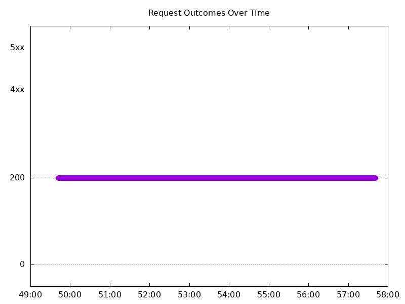

#### Test: Send https /tea traffic

```text
Requests      [total, rate, throughput]         48000, 100.00, 100.00
Duration      [total, attack, wait]             8m0s, 8m0s, 1.413ms
Latencies     [min, mean, 50, 90, 95, 99, max]  668.728µs, 1.18ms, 1.162ms, 1.332ms, 1.391ms, 1.67ms, 41.076ms
Bytes In      [total, mean]                     7449614, 155.20
Bytes Out     [total, mean]                     0, 0.00
Success       [ratio]                           100.00%
Status Codes  [code:count]                      200:48000  
Error Set:
```


### Scale Up Abruptly

#### Test: Send https /tea traffic

```text
Requests      [total, rate, throughput]         12000, 100.01, 100.01
Duration      [total, attack, wait]             2m0s, 2m0s, 1.117ms
Latencies     [min, mean, 50, 90, 95, 99, max]  730.887µs, 1.215ms, 1.189ms, 1.364ms, 1.424ms, 1.686ms, 64.075ms
Bytes In      [total, mean]                     1862424, 155.20
Bytes Out     [total, mean]                     0, 0.00
Success       [ratio]                           100.00%
Status Codes  [code:count]                      200:12000  
Error Set:
```

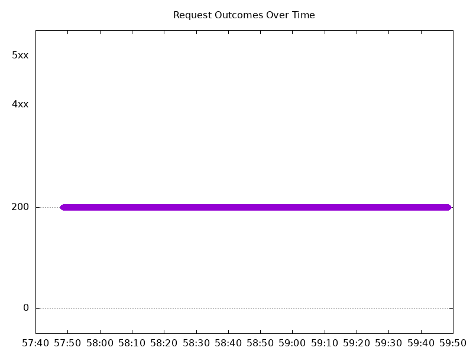

#### Test: Send http /coffee traffic

```text
Requests      [total, rate, throughput]         12000, 100.01, 91.67
Duration      [total, attack, wait]             2m0s, 2m0s, 1.216ms
Latencies     [min, mean, 50, 90, 95, 99, max]  546.288µs, 1.109ms, 1.116ms, 1.295ms, 1.355ms, 1.61ms, 19.555ms
Bytes In      [total, mean]                     1923171, 160.26
Bytes Out     [total, mean]                     0, 0.00
Success       [ratio]                           91.67%
Status Codes  [code:count]                      200:11000  502:1000  
Error Set:
502 Bad Gateway
```

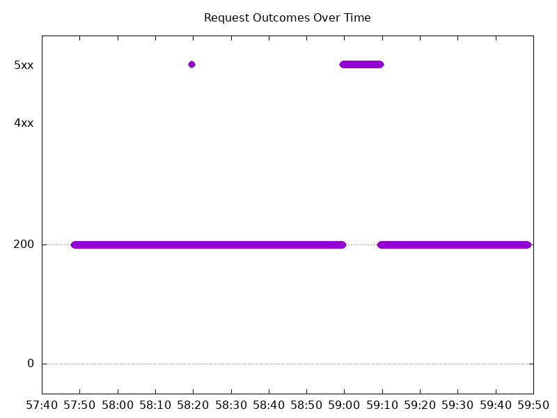

### Scale Down Abruptly

#### Test: Send http /coffee traffic

```text
Requests      [total, rate, throughput]         12000, 100.01, 91.67
Duration      [total, attack, wait]             2m0s, 2m0s, 1.36ms
Latencies     [min, mean, 50, 90, 95, 99, max]  551.385µs, 1.155ms, 1.167ms, 1.371ms, 1.439ms, 1.616ms, 26.979ms
Bytes In      [total, mean]                     1923208, 160.27
Bytes Out     [total, mean]                     0, 0.00
Success       [ratio]                           91.67%
Status Codes  [code:count]                      200:11000  502:1000  
Error Set:
502 Bad Gateway
```

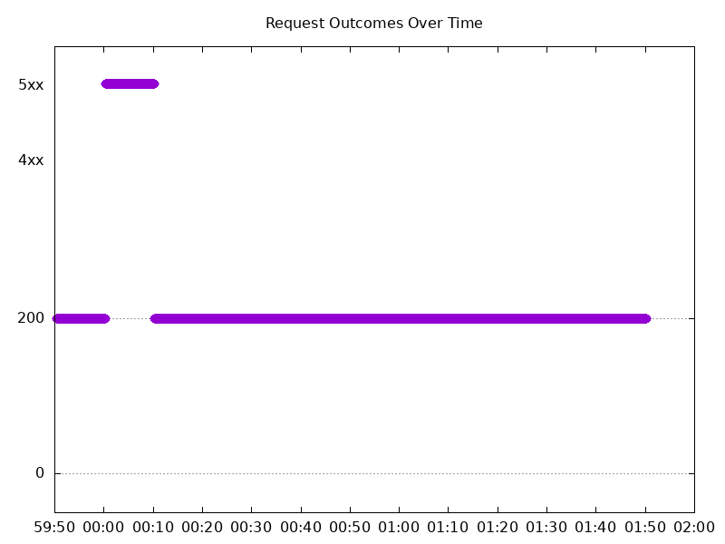

#### Test: Send https /tea traffic

```text
Requests      [total, rate, throughput]         12000, 100.01, 100.01
Duration      [total, attack, wait]             2m0s, 2m0s, 1.588ms
Latencies     [min, mean, 50, 90, 95, 99, max]  754.894µs, 1.248ms, 1.231ms, 1.423ms, 1.49ms, 1.697ms, 29.315ms
Bytes In      [total, mean]                     1862348, 155.20
Bytes Out     [total, mean]                     0, 0.00
Success       [ratio]                           100.00%
Status Codes  [code:count]                      200:12000  
Error Set:
```

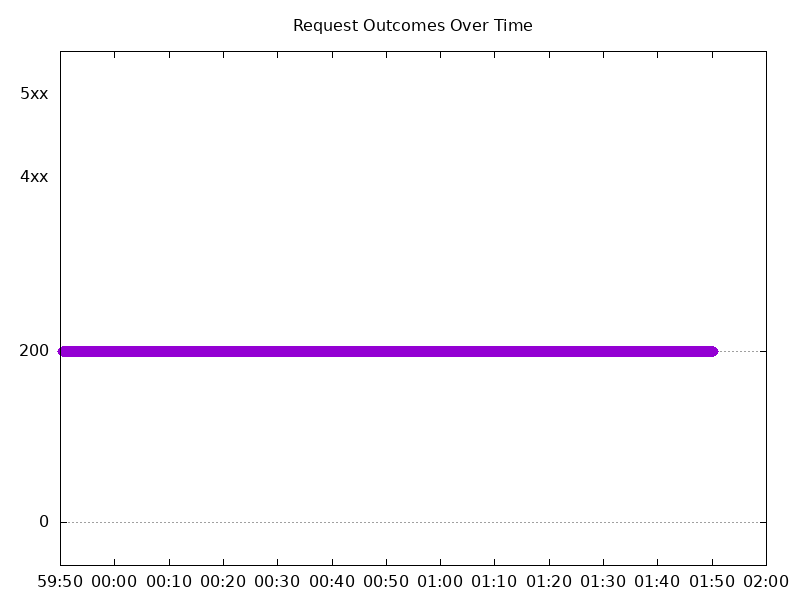

## Multiple NGINX Pods run per node Test Results

### Scale Up Gradually

#### Test: Send https /tea traffic

```text
Requests      [total, rate, throughput]         30000, 100.00, 100.00
Duration      [total, attack, wait]             5m0s, 5m0s, 1.403ms
Latencies     [min, mean, 50, 90, 95, 99, max]  719.147µs, 1.217ms, 1.183ms, 1.398ms, 1.513ms, 2.057ms, 28.173ms
Bytes In      [total, mean]                     4656035, 155.20
Bytes Out     [total, mean]                     0, 0.00
Success       [ratio]                           100.00%
Status Codes  [code:count]                      200:30000  
Error Set:
```

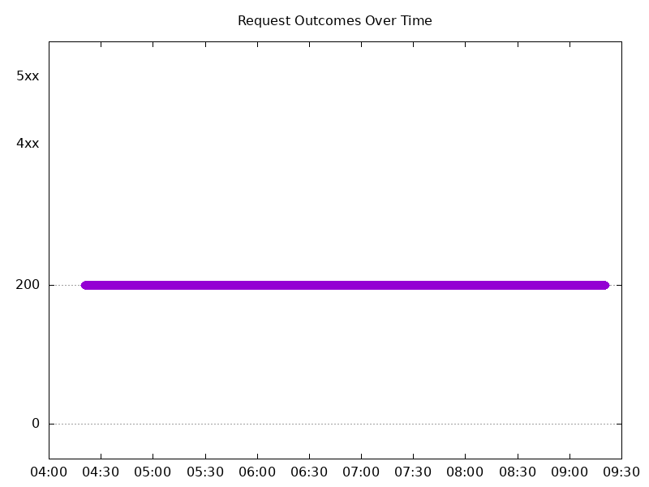

#### Test: Send http /coffee traffic

```text
Requests      [total, rate, throughput]         30000, 100.00, 100.00
Duration      [total, attack, wait]             5m0s, 5m0s, 1.105ms
Latencies     [min, mean, 50, 90, 95, 99, max]  660.223µs, 1.136ms, 1.119ms, 1.3ms, 1.375ms, 1.89ms, 27.632ms
Bytes In      [total, mean]                     4835957, 161.20
Bytes Out     [total, mean]                     0, 0.00
Success       [ratio]                           100.00%
Status Codes  [code:count]                      200:30000  
Error Set:
```


### Scale Down Gradually

#### Test: Send http /coffee traffic

```text
Requests      [total, rate, throughput]         96000, 100.00, 100.00
Duration      [total, attack, wait]             16m0s, 16m0s, 1.267ms
Latencies     [min, mean, 50, 90, 95, 99, max]  636.579µs, 1.169ms, 1.14ms, 1.333ms, 1.412ms, 1.832ms, 104.646ms
Bytes In      [total, mean]                     15475291, 161.20
Bytes Out     [total, mean]                     0, 0.00
Success       [ratio]                           100.00%
Status Codes  [code:count]                      200:96000  
Error Set:
```


#### Test: Send https /tea traffic

```text
Requests      [total, rate, throughput]         96000, 100.00, 100.00
Duration      [total, attack, wait]             16m0s, 16m0s, 1.146ms
Latencies     [min, mean, 50, 90, 95, 99, max]  639.783µs, 1.221ms, 1.189ms, 1.391ms, 1.476ms, 1.931ms, 62.937ms
Bytes In      [total, mean]                     14899258, 155.20
Bytes Out     [total, mean]                     0, 0.00
Success       [ratio]                           100.00%
Status Codes  [code:count]                      200:96000  
Error Set:
```

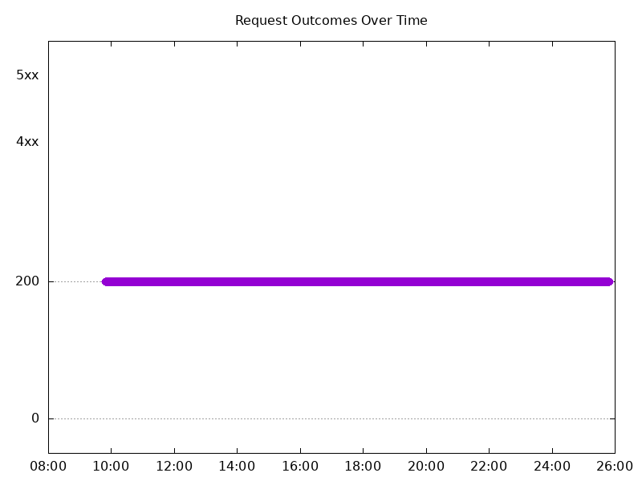

### Scale Up Abruptly

#### Test: Send https /tea traffic

```text
Requests      [total, rate, throughput]         12000, 100.01, 100.01
Duration      [total, attack, wait]             2m0s, 2m0s, 1.374ms
Latencies     [min, mean, 50, 90, 95, 99, max]  662.054µs, 1.291ms, 1.216ms, 1.428ms, 1.526ms, 1.966ms, 165.685ms
Bytes In      [total, mean]                     1862416, 155.20
Bytes Out     [total, mean]                     0, 0.00
Success       [ratio]                           100.00%
Status Codes  [code:count]                      200:12000  
Error Set:
```

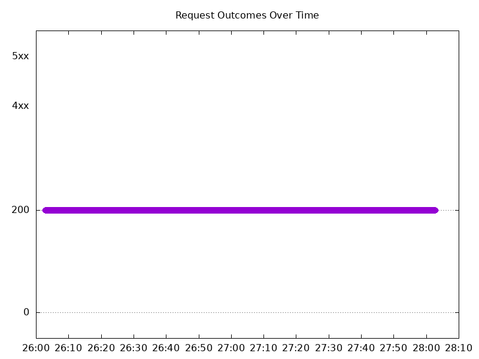

#### Test: Send http /coffee traffic

```text
Requests      [total, rate, throughput]         12000, 100.01, 83.31
Duration      [total, attack, wait]             2m0s, 2m0s, 1.154ms
Latencies     [min, mean, 50, 90, 95, 99, max]  457.921µs, 1.123ms, 1.106ms, 1.346ms, 1.436ms, 1.723ms, 159.32ms
Bytes In      [total, mean]                     1911940, 159.33
Bytes Out     [total, mean]                     0, 0.00
Success       [ratio]                           83.31%
Status Codes  [code:count]                      200:9997  502:2003  
Error Set:
502 Bad Gateway
```

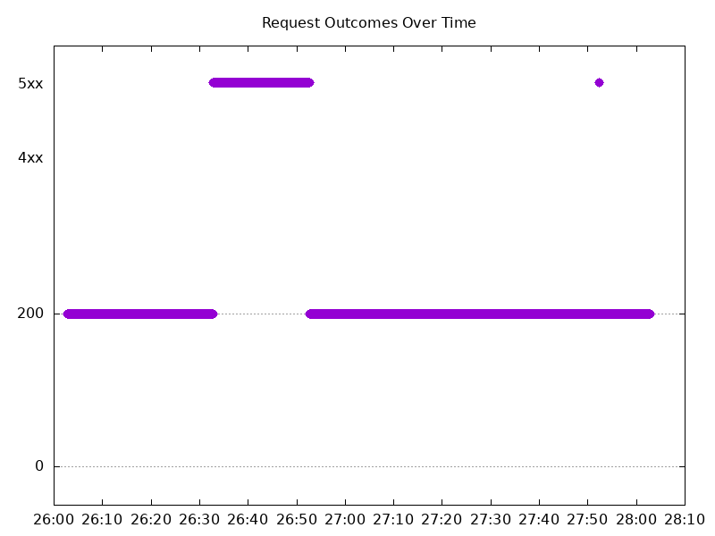

### Scale Down Abruptly

#### Test: Send http /coffee traffic

```text
Requests      [total, rate, throughput]         12000, 100.01, 91.67
Duration      [total, attack, wait]             2m0s, 2m0s, 1.378ms
Latencies     [min, mean, 50, 90, 95, 99, max]  539.23µs, 1.207ms, 1.211ms, 1.469ms, 1.56ms, 1.833ms, 6.832ms
Bytes In      [total, mean]                     1923172, 160.26
Bytes Out     [total, mean]                     0, 0.00
Success       [ratio]                           91.67%
Status Codes  [code:count]                      200:11000  502:1000  
Error Set:
502 Bad Gateway
```

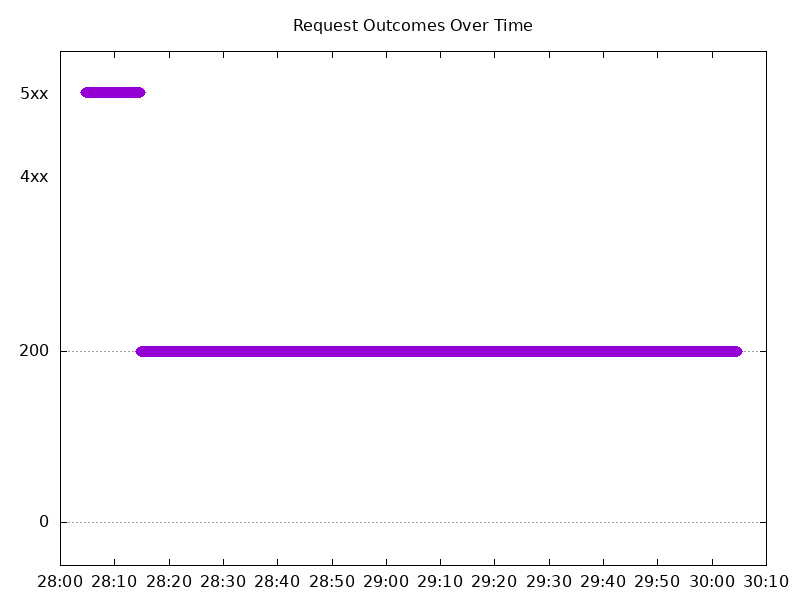

#### Test: Send https /tea traffic

```text
Requests      [total, rate, throughput]         12000, 100.01, 100.01
Duration      [total, attack, wait]             2m0s, 2m0s, 1.072ms
Latencies     [min, mean, 50, 90, 95, 99, max]  722.901µs, 1.315ms, 1.288ms, 1.534ms, 1.624ms, 1.923ms, 33.224ms
Bytes In      [total, mean]                     1862327, 155.19
Bytes Out     [total, mean]                     0, 0.00
Success       [ratio]                           100.00%
Status Codes  [code:count]                      200:12000  
Error Set:
```

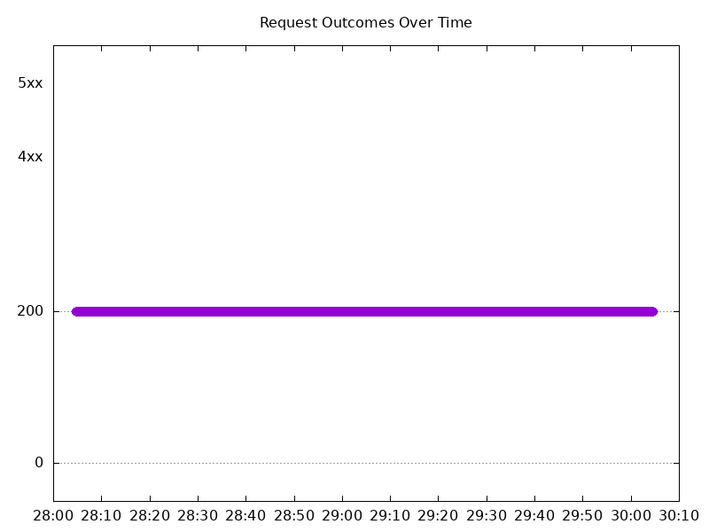
