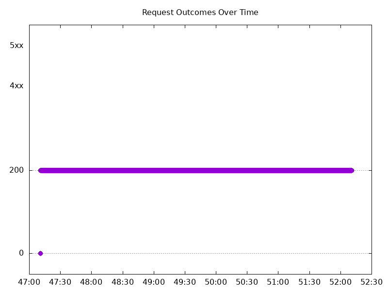
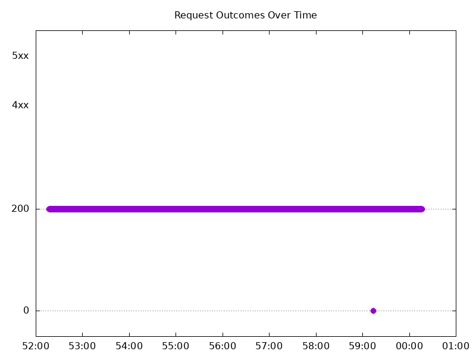
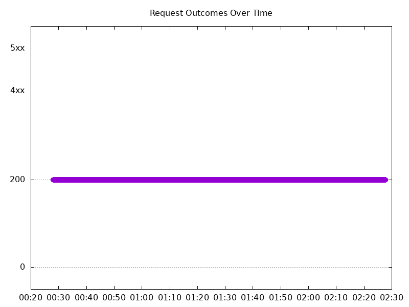
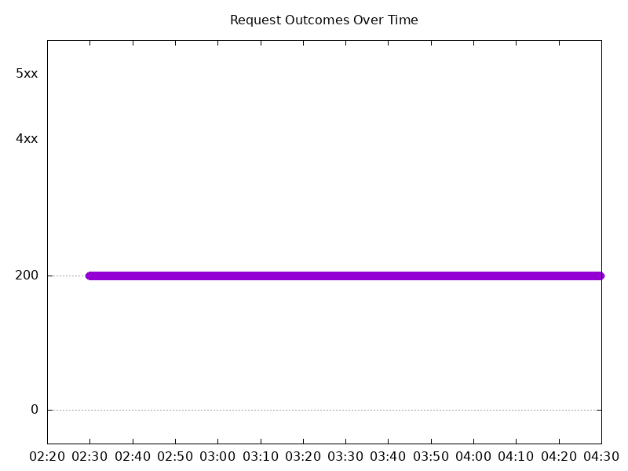
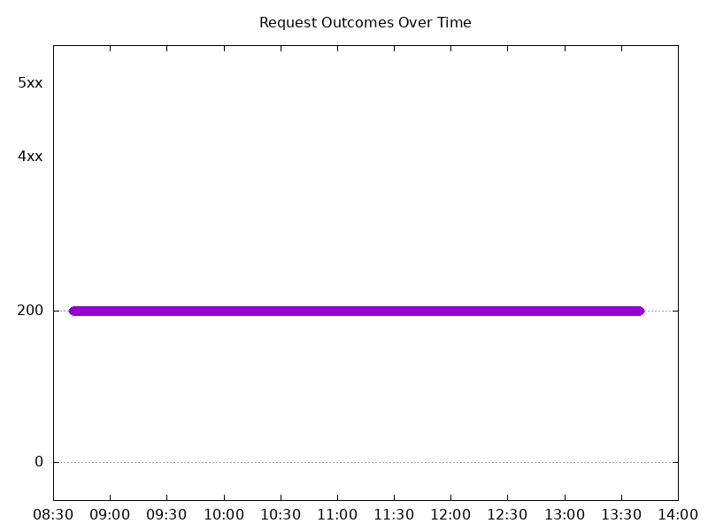
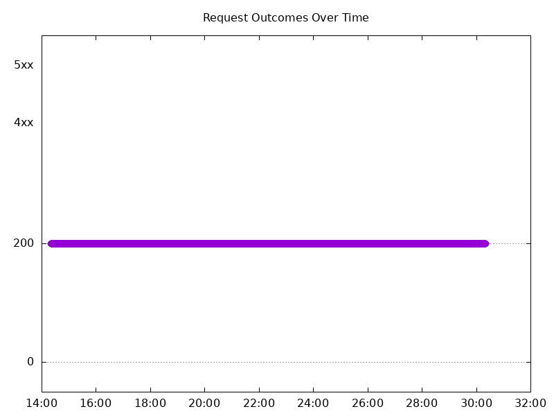
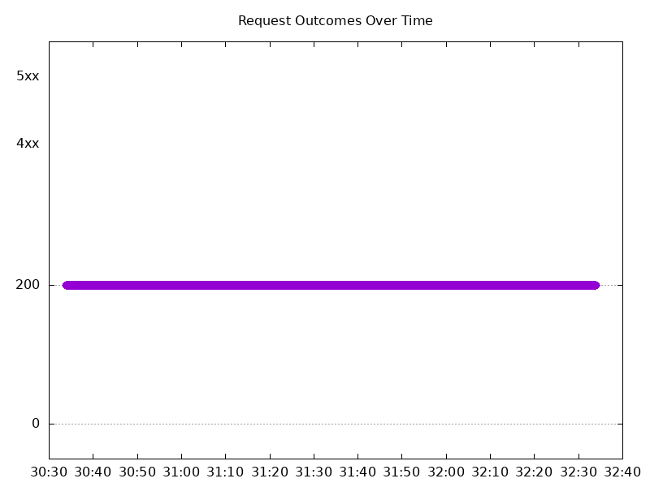
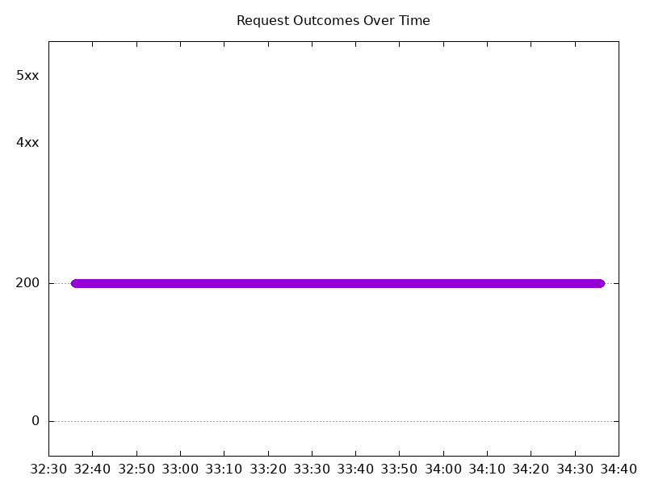

# Results

## Test environment

NGINX Plus: false

NGINX Gateway Fabric:

- Commit: 218bad2df3caa22e9d6293a11a8aba03c6c5adf3
- Date: 2026-05-01T16:51:46Z
- Dirty: false

GKE Cluster:

- Node count: 12
- k8s version: v1.35.3-gke.1234000
- vCPUs per node: 16
- RAM per node: 65848300Ki
- Max pods per node: 110
- Zone: us-west1-b
- Instance Type: n2d-standard-16

## Summary:

- Higher latency overall compared to 2.5.0.
- Connection errors in gradual scale down and scale up tests, similar to 2.5.0.
- 100% success rate maintained for all abrupt scaling tests.

## One NGINX Pod runs per node Test Results

### Scale Up Gradually

#### Test: Send https /tea traffic

```text
Requests      [total, rate, throughput]         30000, 100.00, 100.00
Duration      [total, attack, wait]             5m0s, 5m0s, 969.765µs
Latencies     [min, mean, 50, 90, 95, 99, max]  672.891µs, 1.187ms, 1.149ms, 1.385ms, 1.502ms, 2.031ms, 13.365ms
Bytes In      [total, mean]                     4595917, 153.20
Bytes Out     [total, mean]                     0, 0.00
Success       [ratio]                           100.00%
Status Codes  [code:count]                      0:1  200:29999  
Error Set:
Get "https://cafe.example.com/tea": dial tcp 0.0.0.0:0->10.138.15.202:443: connect: connection refused
```



#### Test: Send http /coffee traffic

```text
Requests      [total, rate, throughput]         30000, 100.00, 100.00
Duration      [total, attack, wait]             5m0s, 5m0s, 897.765µs
Latencies     [min, mean, 50, 90, 95, 99, max]  638.312µs, 1.128ms, 1.102ms, 1.323ms, 1.423ms, 1.891ms, 12.122ms
Bytes In      [total, mean]                     4775839, 159.19
Bytes Out     [total, mean]                     0, 0.00
Success       [ratio]                           100.00%
Status Codes  [code:count]                      0:1  200:29999  
Error Set:
Get "http://cafe.example.com/coffee": dial tcp 0.0.0.0:0->10.138.15.202:80: connect: connection refused
```


### Scale Down Gradually

#### Test: Send http /coffee traffic

```text
Requests      [total, rate, throughput]         48000, 100.00, 100.00
Duration      [total, attack, wait]             8m0s, 8m0s, 1.324ms
Latencies     [min, mean, 50, 90, 95, 99, max]  300.211µs, 1.3ms, 1.229ms, 1.645ms, 1.794ms, 2.152ms, 249.123ms
Bytes In      [total, mean]                     7641291, 159.19
Bytes Out     [total, mean]                     0, 0.00
Success       [ratio]                           100.00%
Status Codes  [code:count]                      0:2  200:47998  
Error Set:
Get "http://cafe.example.com/coffee": dial tcp 0.0.0.0:0->10.138.15.202:80: connect: network is unreachable
```


#### Test: Send https /tea traffic

```text
Requests      [total, rate, throughput]         48000, 100.00, 100.00
Duration      [total, attack, wait]             8m0s, 8m0s, 1.41ms
Latencies     [min, mean, 50, 90, 95, 99, max]  214.436µs, 1.355ms, 1.261ms, 1.738ms, 1.88ms, 2.215ms, 250.234ms
Bytes In      [total, mean]                     7353449, 153.20
Bytes Out     [total, mean]                     0, 0.00
Success       [ratio]                           100.00%
Status Codes  [code:count]                      0:2  200:47998  
Error Set:
Get "https://cafe.example.com/tea": dial tcp 0.0.0.0:0->10.138.15.202:443: connect: network is unreachable
```



### Scale Up Abruptly

#### Test: Send https /tea traffic

```text
Requests      [total, rate, throughput]         12000, 100.01, 100.01
Duration      [total, attack, wait]             2m0s, 2m0s, 1.351ms
Latencies     [min, mean, 50, 90, 95, 99, max]  805.261µs, 1.703ms, 1.636ms, 1.997ms, 2.112ms, 2.459ms, 107.811ms
Bytes In      [total, mean]                     1838419, 153.20
Bytes Out     [total, mean]                     0, 0.00
Success       [ratio]                           100.00%
Status Codes  [code:count]                      200:12000  
Error Set:
```



#### Test: Send http /coffee traffic

```text
Requests      [total, rate, throughput]         12000, 100.01, 100.01
Duration      [total, attack, wait]             2m0s, 2m0s, 1.198ms
Latencies     [min, mean, 50, 90, 95, 99, max]  829.061µs, 1.62ms, 1.56ms, 1.936ms, 2.047ms, 2.417ms, 101.676ms
Bytes In      [total, mean]                     1910435, 159.20
Bytes Out     [total, mean]                     0, 0.00
Success       [ratio]                           100.00%
Status Codes  [code:count]                      200:12000  
Error Set:
```


### Scale Down Abruptly

#### Test: Send https /tea traffic

```text
Requests      [total, rate, throughput]         12000, 100.01, 100.01
Duration      [total, attack, wait]             2m0s, 2m0s, 1.54ms
Latencies     [min, mean, 50, 90, 95, 99, max]  770.586µs, 1.672ms, 1.705ms, 2.008ms, 2.099ms, 2.37ms, 26.909ms
Bytes In      [total, mean]                     1838471, 153.21
Bytes Out     [total, mean]                     0, 0.00
Success       [ratio]                           100.00%
Status Codes  [code:count]                      200:12000  
Error Set:
```


#### Test: Send http /coffee traffic

```text
Requests      [total, rate, throughput]         12000, 100.01, 100.01
Duration      [total, attack, wait]             2m0s, 2m0s, 1.644ms
Latencies     [min, mean, 50, 90, 95, 99, max]  702.981µs, 1.596ms, 1.622ms, 1.912ms, 2.003ms, 2.24ms, 26.778ms
Bytes In      [total, mean]                     1910417, 159.20
Bytes Out     [total, mean]                     0, 0.00
Success       [ratio]                           100.00%
Status Codes  [code:count]                      200:12000  
Error Set:
```



## Multiple NGINX Pods run per node Test Results

### Scale Up Gradually

#### Test: Send http /coffee traffic

```text
Requests      [total, rate, throughput]         30000, 100.00, 100.00
Duration      [total, attack, wait]             5m0s, 5m0s, 1.061ms
Latencies     [min, mean, 50, 90, 95, 99, max]  617.355µs, 1.16ms, 1.125ms, 1.384ms, 1.499ms, 2.18ms, 24.204ms
Bytes In      [total, mean]                     4779102, 159.30
Bytes Out     [total, mean]                     0, 0.00
Success       [ratio]                           100.00%
Status Codes  [code:count]                      200:30000  
Error Set:
```


#### Test: Send https /tea traffic

```text
Requests      [total, rate, throughput]         30000, 100.00, 100.00
Duration      [total, attack, wait]             5m0s, 5m0s, 954.569µs
Latencies     [min, mean, 50, 90, 95, 99, max]  628.253µs, 1.222ms, 1.161ms, 1.458ms, 1.596ms, 2.285ms, 25.036ms
Bytes In      [total, mean]                     4598846, 153.29
Bytes Out     [total, mean]                     0, 0.00
Success       [ratio]                           100.00%
Status Codes  [code:count]                      200:30000  
Error Set:
```



### Scale Down Gradually

#### Test: Send https /tea traffic

```text
Requests      [total, rate, throughput]         96000, 100.00, 100.00
Duration      [total, attack, wait]             16m0s, 16m0s, 1.656ms
Latencies     [min, mean, 50, 90, 95, 99, max]  641.145µs, 1.296ms, 1.249ms, 1.568ms, 1.711ms, 2.152ms, 44.02ms
Bytes In      [total, mean]                     14717089, 153.30
Bytes Out     [total, mean]                     0, 0.00
Success       [ratio]                           100.00%
Status Codes  [code:count]                      200:96000  
Error Set:
```



#### Test: Send http /coffee traffic

```text
Requests      [total, rate, throughput]         96000, 100.00, 100.00
Duration      [total, attack, wait]             16m0s, 16m0s, 1.336ms
Latencies     [min, mean, 50, 90, 95, 99, max]  597.612µs, 1.206ms, 1.166ms, 1.48ms, 1.608ms, 2.009ms, 48.214ms
Bytes In      [total, mean]                     15292752, 159.30
Bytes Out     [total, mean]                     0, 0.00
Success       [ratio]                           100.00%
Status Codes  [code:count]                      200:96000  
Error Set:
```


### Scale Up Abruptly

#### Test: Send https /tea traffic

```text
Requests      [total, rate, throughput]         12000, 100.01, 100.01
Duration      [total, attack, wait]             2m0s, 2m0s, 1.186ms
Latencies     [min, mean, 50, 90, 95, 99, max]  662.918µs, 1.276ms, 1.21ms, 1.454ms, 1.535ms, 1.886ms, 118.968ms
Bytes In      [total, mean]                     1839535, 153.29
Bytes Out     [total, mean]                     0, 0.00
Success       [ratio]                           100.00%
Status Codes  [code:count]                      200:12000  
Error Set:
```


#### Test: Send http /coffee traffic

```text
Requests      [total, rate, throughput]         12000, 100.01, 100.01
Duration      [total, attack, wait]             2m0s, 2m0s, 1.177ms
Latencies     [min, mean, 50, 90, 95, 99, max]  571.134µs, 1.196ms, 1.155ms, 1.407ms, 1.501ms, 1.913ms, 46.28ms
Bytes In      [total, mean]                     1911641, 159.30
Bytes Out     [total, mean]                     0, 0.00
Success       [ratio]                           100.00%
Status Codes  [code:count]                      200:12000  
Error Set:
```



### Scale Down Abruptly

#### Test: Send http /coffee traffic

```text
Requests      [total, rate, throughput]         12000, 100.01, 100.01
Duration      [total, attack, wait]             2m0s, 2m0s, 1.441ms
Latencies     [min, mean, 50, 90, 95, 99, max]  643.7µs, 1.341ms, 1.338ms, 1.618ms, 1.713ms, 1.982ms, 6.411ms
Bytes In      [total, mean]                     1911494, 159.29
Bytes Out     [total, mean]                     0, 0.00
Success       [ratio]                           100.00%
Status Codes  [code:count]                      200:12000  
Error Set:
```



#### Test: Send https /tea traffic

```text
Requests      [total, rate, throughput]         12000, 100.01, 100.01
Duration      [total, attack, wait]             2m0s, 2m0s, 1.327ms
Latencies     [min, mean, 50, 90, 95, 99, max]  761.66µs, 1.458ms, 1.445ms, 1.701ms, 1.79ms, 2.073ms, 11.212ms
Bytes In      [total, mean]                     1839564, 153.30
Bytes Out     [total, mean]                     0, 0.00
Success       [ratio]                           100.00%
Status Codes  [code:count]                      200:12000  
Error Set:
```


