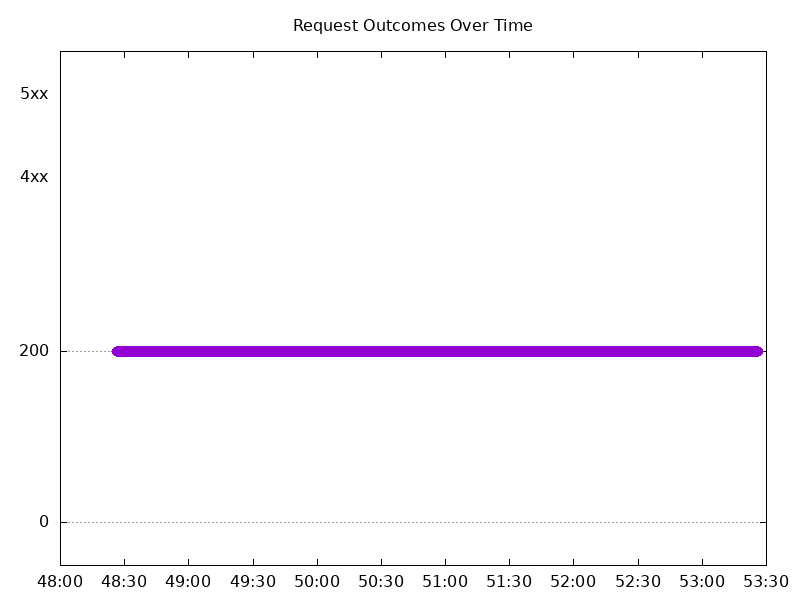
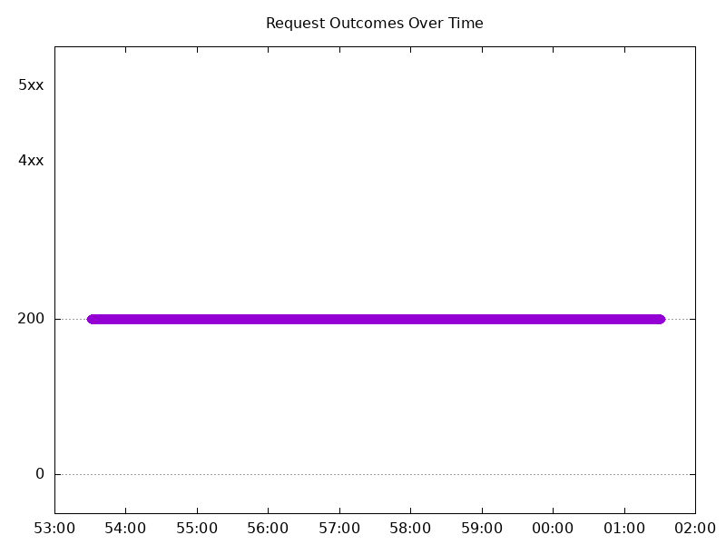
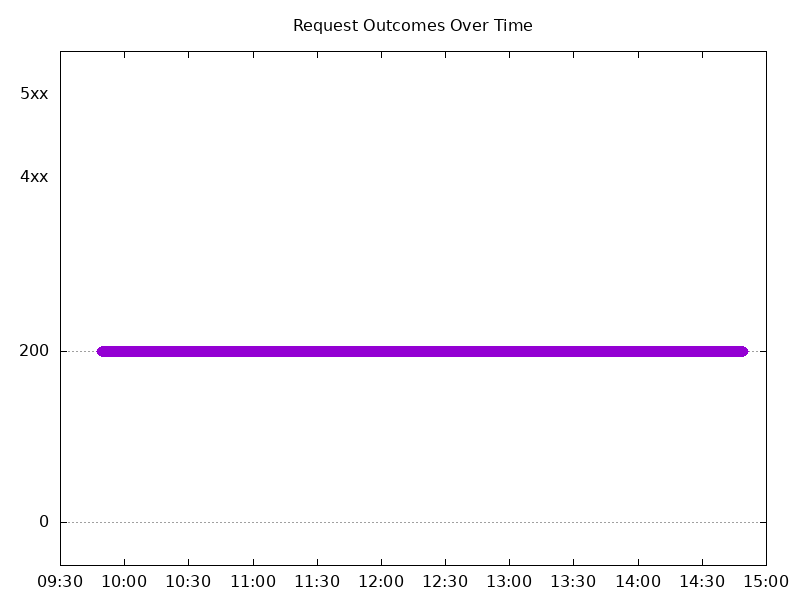
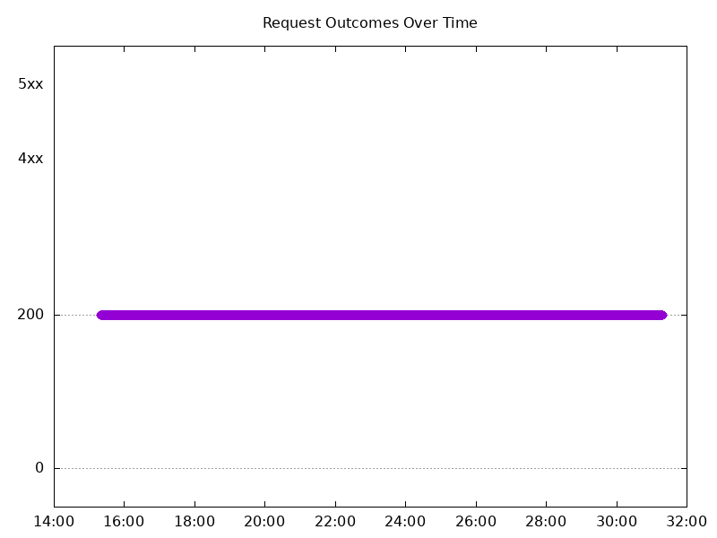
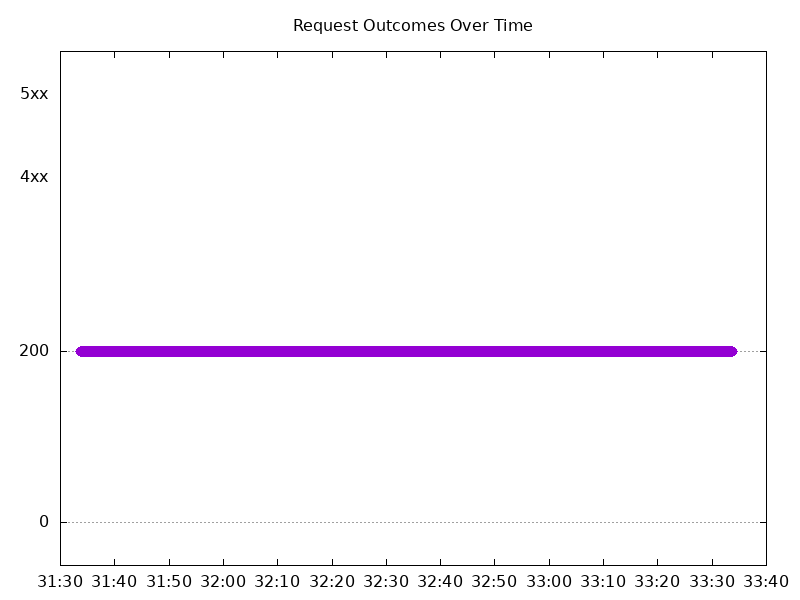
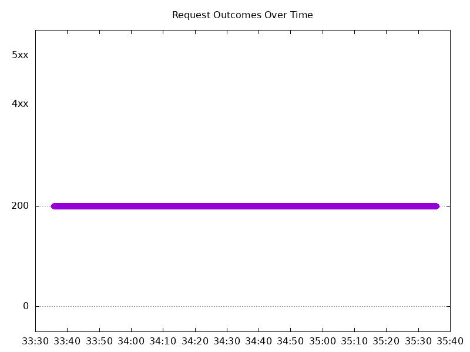

# Results

## Test environment

NGINX Plus: true

NGINX Gateway Fabric:

- Commit: 218bad2df3caa22e9d6293a11a8aba03c6c5adf3
- Date: 2026-05-01T16:51:46Z
- Dirty: false

GKE Cluster:

- Node count: 12
- k8s version: v1.35.3-gke.1234000
- vCPUs per node: 16
- RAM per node: 65848304Ki
- Max pods per node: 110
- Zone: us-west1-b
- Instance Type: n2d-standard-16

## One NGINX Pod runs per node Test Results

### Scale Up Gradually

#### Test: Send https /tea traffic

```text
Requests      [total, rate, throughput]         30000, 100.00, 100.00
Duration      [total, attack, wait]             5m0s, 5m0s, 1.337ms
Latencies     [min, mean, 50, 90, 95, 99, max]  748.012µs, 1.305ms, 1.283ms, 1.489ms, 1.567ms, 2.081ms, 21.371ms
Bytes In      [total, mean]                     4655928, 155.20
Bytes Out     [total, mean]                     0, 0.00
Success       [ratio]                           100.00%
Status Codes  [code:count]                      200:30000  
Error Set:
```


#### Test: Send http /coffee traffic

```text
Requests      [total, rate, throughput]         30000, 100.00, 100.00
Duration      [total, attack, wait]             5m0s, 5m0s, 1.197ms
Latencies     [min, mean, 50, 90, 95, 99, max]  687.048µs, 1.218ms, 1.204ms, 1.401ms, 1.471ms, 1.876ms, 16.166ms
Bytes In      [total, mean]                     4835998, 161.20
Bytes Out     [total, mean]                     0, 0.00
Success       [ratio]                           100.00%
Status Codes  [code:count]                      200:30000  
Error Set:
```



### Scale Down Gradually

#### Test: Send https /tea traffic

```text
Requests      [total, rate, throughput]         48000, 100.00, 100.00
Duration      [total, attack, wait]             8m0s, 8m0s, 1.567ms
Latencies     [min, mean, 50, 90, 95, 99, max]  730.673µs, 1.354ms, 1.328ms, 1.524ms, 1.598ms, 1.975ms, 68.684ms
Bytes In      [total, mean]                     7449649, 155.20
Bytes Out     [total, mean]                     0, 0.00
Success       [ratio]                           100.00%
Status Codes  [code:count]                      200:48000  
Error Set:
```


#### Test: Send http /coffee traffic

```text
Requests      [total, rate, throughput]         48000, 100.00, 100.00
Duration      [total, attack, wait]             8m0s, 8m0s, 1.37ms
Latencies     [min, mean, 50, 90, 95, 99, max]  700.428µs, 1.277ms, 1.256ms, 1.454ms, 1.522ms, 1.891ms, 84.762ms
Bytes In      [total, mean]                     7737587, 161.20
Bytes Out     [total, mean]                     0, 0.00
Success       [ratio]                           100.00%
Status Codes  [code:count]                      200:48000  
Error Set:
```



### Scale Up Abruptly

#### Test: Send https /tea traffic

```text
Requests      [total, rate, throughput]         12000, 100.01, 100.01
Duration      [total, attack, wait]             2m0s, 2m0s, 1.27ms
Latencies     [min, mean, 50, 90, 95, 99, max]  811.706µs, 1.347ms, 1.334ms, 1.515ms, 1.577ms, 1.822ms, 14.429ms
Bytes In      [total, mean]                     1862435, 155.20
Bytes Out     [total, mean]                     0, 0.00
Success       [ratio]                           100.00%
Status Codes  [code:count]                      200:12000  
Error Set:
```


#### Test: Send http /coffee traffic

```text
Requests      [total, rate, throughput]         12000, 100.01, 100.01
Duration      [total, attack, wait]             2m0s, 2m0s, 1.223ms
Latencies     [min, mean, 50, 90, 95, 99, max]  756.96µs, 1.31ms, 1.3ms, 1.492ms, 1.557ms, 1.819ms, 14.352ms
Bytes In      [total, mean]                     1934477, 161.21
Bytes Out     [total, mean]                     0, 0.00
Success       [ratio]                           100.00%
Status Codes  [code:count]                      200:12000  
Error Set:
```


### Scale Down Abruptly

#### Test: Send http /coffee traffic

```text
Requests      [total, rate, throughput]         12000, 100.01, 100.01
Duration      [total, attack, wait]             2m0s, 2m0s, 1.391ms
Latencies     [min, mean, 50, 90, 95, 99, max]  677.422µs, 1.347ms, 1.326ms, 1.52ms, 1.589ms, 1.767ms, 66.988ms
Bytes In      [total, mean]                     1934389, 161.20
Bytes Out     [total, mean]                     0, 0.00
Success       [ratio]                           100.00%
Status Codes  [code:count]                      200:12000  
Error Set:
```


#### Test: Send https /tea traffic

```text
Requests      [total, rate, throughput]         12000, 100.01, 100.01
Duration      [total, attack, wait]             2m0s, 2m0s, 1.351ms
Latencies     [min, mean, 50, 90, 95, 99, max]  817.839µs, 1.397ms, 1.377ms, 1.562ms, 1.622ms, 1.82ms, 67.288ms
Bytes In      [total, mean]                     1862453, 155.20
Bytes Out     [total, mean]                     0, 0.00
Success       [ratio]                           100.00%
Status Codes  [code:count]                      200:12000  
Error Set:
```


## Multiple NGINX Pods run per node Test Results

### Scale Up Gradually

#### Test: Send http /coffee traffic

```text
Requests      [total, rate, throughput]         30000, 100.00, 100.00
Duration      [total, attack, wait]             5m0s, 5m0s, 1.384ms
Latencies     [min, mean, 50, 90, 95, 99, max]  665.488µs, 1.26ms, 1.244ms, 1.457ms, 1.531ms, 1.976ms, 31.826ms
Bytes In      [total, mean]                     4835893, 161.20
Bytes Out     [total, mean]                     0, 0.00
Success       [ratio]                           100.00%
Status Codes  [code:count]                      200:30000  
Error Set:
```



#### Test: Send https /tea traffic

```text
Requests      [total, rate, throughput]         30000, 100.00, 100.00
Duration      [total, attack, wait]             5m0s, 5m0s, 1.395ms
Latencies     [min, mean, 50, 90, 95, 99, max]  754.772µs, 1.307ms, 1.285ms, 1.485ms, 1.558ms, 2.136ms, 31.385ms
Bytes In      [total, mean]                     4656003, 155.20
Bytes Out     [total, mean]                     0, 0.00
Success       [ratio]                           100.00%
Status Codes  [code:count]                      200:30000  
Error Set:
```


### Scale Down Gradually

#### Test: Send https /tea traffic

```text
Requests      [total, rate, throughput]         96000, 100.00, 100.00
Duration      [total, attack, wait]             16m0s, 16m0s, 1.574ms
Latencies     [min, mean, 50, 90, 95, 99, max]  734.484µs, 1.339ms, 1.313ms, 1.539ms, 1.621ms, 2.115ms, 46.696ms
Bytes In      [total, mean]                     14899044, 155.20
Bytes Out     [total, mean]                     0, 0.00
Success       [ratio]                           100.00%
Status Codes  [code:count]                      200:96000  
Error Set:
```


#### Test: Send http /coffee traffic

```text
Requests      [total, rate, throughput]         96000, 100.00, 100.00
Duration      [total, attack, wait]             16m0s, 16m0s, 1.36ms
Latencies     [min, mean, 50, 90, 95, 99, max]  671.137µs, 1.276ms, 1.258ms, 1.471ms, 1.549ms, 1.958ms, 51.046ms
Bytes In      [total, mean]                     15475103, 161.20
Bytes Out     [total, mean]                     0, 0.00
Success       [ratio]                           100.00%
Status Codes  [code:count]                      200:96000  
Error Set:
```



### Scale Up Abruptly

#### Test: Send https /tea traffic

```text
Requests      [total, rate, throughput]         12000, 100.01, 100.01
Duration      [total, attack, wait]             2m0s, 2m0s, 1.563ms
Latencies     [min, mean, 50, 90, 95, 99, max]  849.039µs, 1.479ms, 1.4ms, 1.632ms, 1.722ms, 2.198ms, 130.556ms
Bytes In      [total, mean]                     1862350, 155.20
Bytes Out     [total, mean]                     0, 0.00
Success       [ratio]                           100.00%
Status Codes  [code:count]                      200:12000  
Error Set:
```


#### Test: Send http /coffee traffic

```text
Requests      [total, rate, throughput]         12000, 100.01, 100.01
Duration      [total, attack, wait]             2m0s, 2m0s, 1.349ms
Latencies     [min, mean, 50, 90, 95, 99, max]  730.909µs, 1.363ms, 1.314ms, 1.528ms, 1.608ms, 1.963ms, 164.615ms
Bytes In      [total, mean]                     1934312, 161.19
Bytes Out     [total, mean]                     0, 0.00
Success       [ratio]                           100.00%
Status Codes  [code:count]                      200:12000  
Error Set:
```



### Scale Down Abruptly

#### Test: Send http /coffee traffic

```text
Requests      [total, rate, throughput]         12000, 100.01, 100.01
Duration      [total, attack, wait]             2m0s, 2m0s, 1.225ms
Latencies     [min, mean, 50, 90, 95, 99, max]  765.807µs, 1.371ms, 1.349ms, 1.557ms, 1.634ms, 1.889ms, 69.461ms
Bytes In      [total, mean]                     1934386, 161.20
Bytes Out     [total, mean]                     0, 0.00
Success       [ratio]                           100.00%
Status Codes  [code:count]                      200:12000  
Error Set:
```


#### Test: Send https /tea traffic

```text
Requests      [total, rate, throughput]         12000, 100.01, 100.01
Duration      [total, attack, wait]             2m0s, 2m0s, 1.424ms
Latencies     [min, mean, 50, 90, 95, 99, max]  811.457µs, 1.409ms, 1.384ms, 1.601ms, 1.676ms, 1.935ms, 61.286ms
Bytes In      [total, mean]                     1862300, 155.19
Bytes Out     [total, mean]                     0, 0.00
Success       [ratio]                           100.00%
Status Codes  [code:count]                      200:12000  
Error Set:
```


