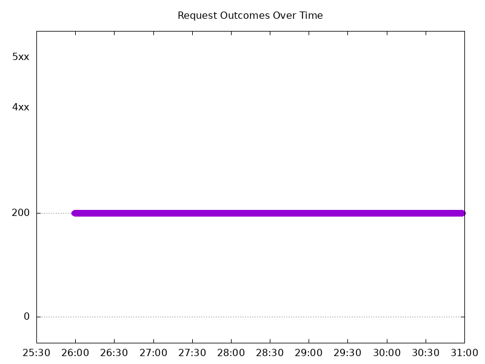
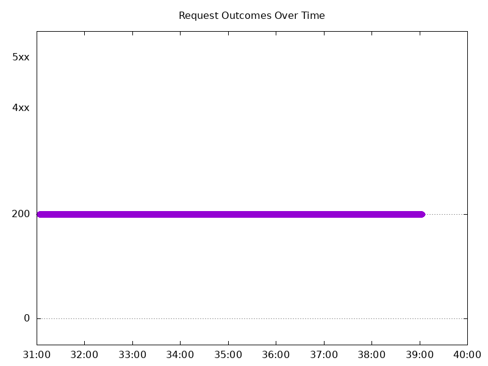
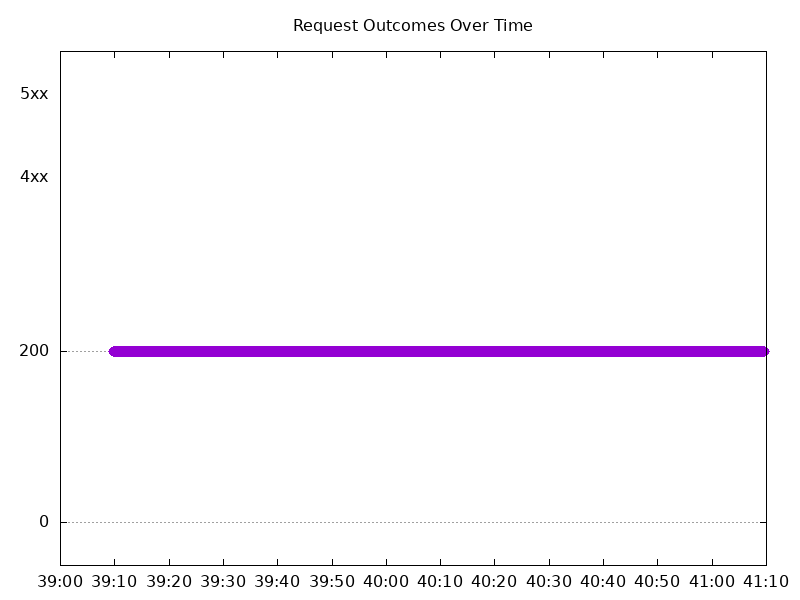
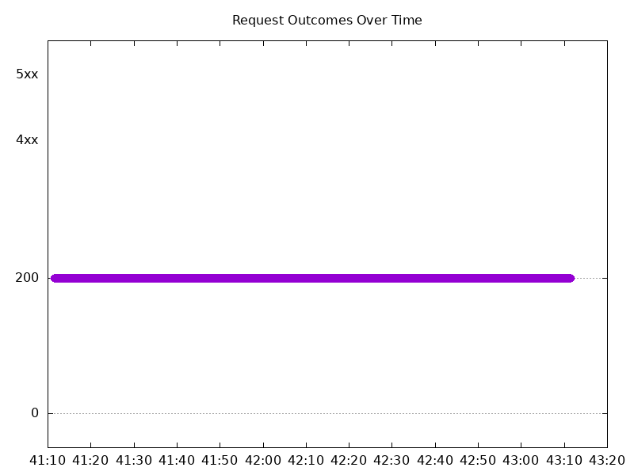
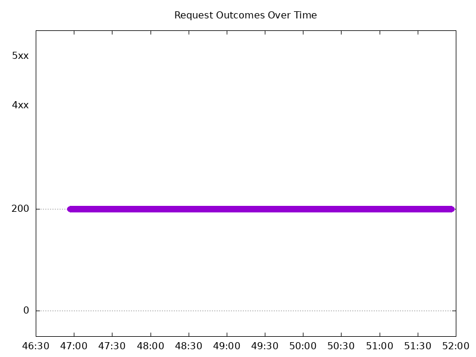
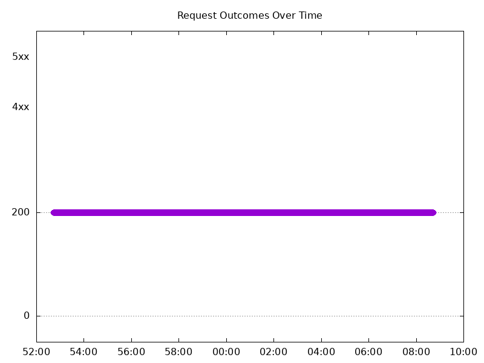
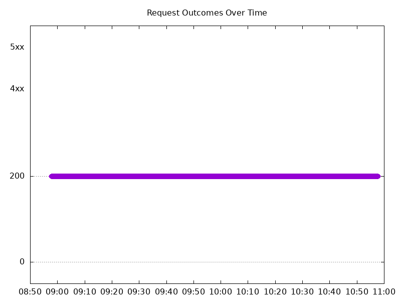
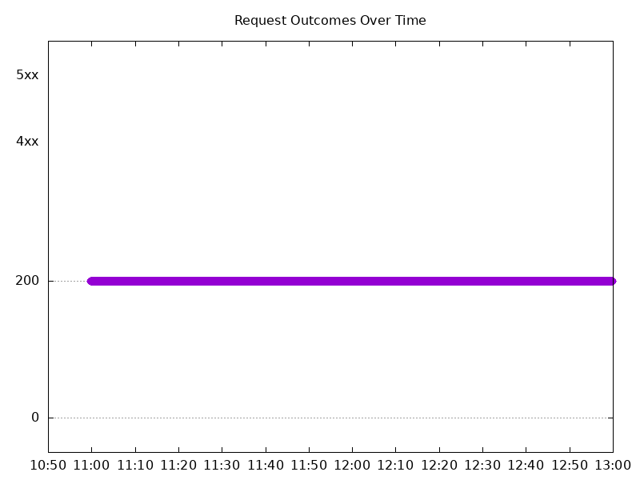

# Results

## Test environment

NGINX Plus: false

NGINX Gateway Fabric:

- Commit: 97fbe08edc096cf95f21939b6ec81975019c26fc
- Date: 2026-08-28T16:57:03Z
- Dirty: false

GKE Cluster:

- Node count: 12
- k8s version: v1.35.7-gke.1027000
- vCPUs per node: 16
- RAM per node: 65848292Ki
- Max pods per node: 110
- Zone: us-west1-b
- Instance Type: n2d-standard-16

## One NGINX Pod runs per node Test Results

### Scale Up Gradually

#### Test: Send https /tea traffic

```text
Requests      [total, rate, throughput]         30000, 100.00, 100.00
Duration      [total, attack, wait]             5m0s, 5m0s, 1.155ms
Latencies     [min, mean, 50, 90, 95, 99, max]  719.561µs, 1.366ms, 1.351ms, 1.544ms, 1.617ms, 1.973ms, 22.562ms
Bytes In      [total, mean]                     4602003, 153.40
Bytes Out     [total, mean]                     0, 0.00
Success       [ratio]                           100.00%
Status Codes  [code:count]                      200:30000  
Error Set:
```


#### Test: Send http /coffee traffic

```text
Requests      [total, rate, throughput]         30000, 100.00, 100.00
Duration      [total, attack, wait]             5m0s, 5m0s, 1.146ms
Latencies     [min, mean, 50, 90, 95, 99, max]  711.632µs, 1.292ms, 1.287ms, 1.477ms, 1.546ms, 1.859ms, 21.829ms
Bytes In      [total, mean]                     4776126, 159.20
Bytes Out     [total, mean]                     0, 0.00
Success       [ratio]                           100.00%
Status Codes  [code:count]                      200:30000  
Error Set:
```



### Scale Down Gradually

#### Test: Send https /tea traffic

```text
Requests      [total, rate, throughput]         48000, 100.00, 100.00
Duration      [total, attack, wait]             8m0s, 8m0s, 1.42ms
Latencies     [min, mean, 50, 90, 95, 99, max]  734.758µs, 1.371ms, 1.344ms, 1.552ms, 1.623ms, 1.937ms, 58.964ms
Bytes In      [total, mean]                     7363185, 153.40
Bytes Out     [total, mean]                     0, 0.00
Success       [ratio]                           100.00%
Status Codes  [code:count]                      200:48000  
Error Set:
```


#### Test: Send http /coffee traffic

```text
Requests      [total, rate, throughput]         48000, 100.00, 100.00
Duration      [total, attack, wait]             8m0s, 8m0s, 1.304ms
Latencies     [min, mean, 50, 90, 95, 99, max]  659.985µs, 1.299ms, 1.288ms, 1.483ms, 1.547ms, 1.851ms, 46.82ms
Bytes In      [total, mean]                     7641664, 159.20
Bytes Out     [total, mean]                     0, 0.00
Success       [ratio]                           100.00%
Status Codes  [code:count]                      200:48000  
Error Set:
```



### Scale Up Abruptly

#### Test: Send https /tea traffic

```text
Requests      [total, rate, throughput]         12000, 100.01, 100.01
Duration      [total, attack, wait]             2m0s, 2m0s, 1.434ms
Latencies     [min, mean, 50, 90, 95, 99, max]  775.174µs, 1.369ms, 1.35ms, 1.509ms, 1.56ms, 1.714ms, 65.857ms
Bytes In      [total, mean]                     1840852, 153.40
Bytes Out     [total, mean]                     0, 0.00
Success       [ratio]                           100.00%
Status Codes  [code:count]                      200:12000  
Error Set:
```


#### Test: Send http /coffee traffic

```text
Requests      [total, rate, throughput]         12000, 100.01, 100.01
Duration      [total, attack, wait]             2m0s, 2m0s, 1.471ms
Latencies     [min, mean, 50, 90, 95, 99, max]  743.945µs, 1.311ms, 1.3ms, 1.461ms, 1.513ms, 1.653ms, 70.262ms
Bytes In      [total, mean]                     1910413, 159.20
Bytes Out     [total, mean]                     0, 0.00
Success       [ratio]                           100.00%
Status Codes  [code:count]                      200:12000  
Error Set:
```



### Scale Down Abruptly

#### Test: Send http /coffee traffic

```text
Requests      [total, rate, throughput]         12000, 100.01, 100.01
Duration      [total, attack, wait]             2m0s, 2m0s, 1.262ms
Latencies     [min, mean, 50, 90, 95, 99, max]  688.734µs, 1.584ms, 1.472ms, 1.782ms, 1.852ms, 2.075ms, 248.415ms
Bytes In      [total, mean]                     1910408, 159.20
Bytes Out     [total, mean]                     0, 0.00
Success       [ratio]                           100.00%
Status Codes  [code:count]                      200:12000  
Error Set:
```


#### Test: Send https /tea traffic

```text
Requests      [total, rate, throughput]         12000, 100.01, 100.00
Duration      [total, attack, wait]             2m0s, 2m0s, 9.166ms
Latencies     [min, mean, 50, 90, 95, 99, max]  834.984µs, 1.64ms, 1.541ms, 1.814ms, 1.891ms, 2.175ms, 249.465ms
Bytes In      [total, mean]                     1840832, 153.40
Bytes Out     [total, mean]                     0, 0.00
Success       [ratio]                           100.00%
Status Codes  [code:count]                      200:12000  
Error Set:
```



## Multiple NGINX Pods run per node Test Results

### Scale Up Gradually

#### Test: Send https /tea traffic

```text
Requests      [total, rate, throughput]         30000, 100.00, 100.00
Duration      [total, attack, wait]             5m0s, 5m0s, 1.325ms
Latencies     [min, mean, 50, 90, 95, 99, max]  735.438µs, 1.355ms, 1.328ms, 1.521ms, 1.598ms, 2.092ms, 21.881ms
Bytes In      [total, mean]                     4617067, 153.90
Bytes Out     [total, mean]                     0, 0.00
Success       [ratio]                           100.00%
Status Codes  [code:count]                      200:30000  
Error Set:
```



#### Test: Send http /coffee traffic

```text
Requests      [total, rate, throughput]         30000, 100.00, 100.00
Duration      [total, attack, wait]             5m0s, 5m0s, 2.415ms
Latencies     [min, mean, 50, 90, 95, 99, max]  652.969µs, 1.279ms, 1.269ms, 1.454ms, 1.523ms, 1.983ms, 21.811ms
Bytes In      [total, mean]                     4784987, 159.50
Bytes Out     [total, mean]                     0, 0.00
Success       [ratio]                           100.00%
Status Codes  [code:count]                      200:30000  
Error Set:
```


### Scale Down Gradually

#### Test: Send https /tea traffic

```text
Requests      [total, rate, throughput]         96000, 100.00, 100.00
Duration      [total, attack, wait]             16m0s, 16m0s, 1.53ms
Latencies     [min, mean, 50, 90, 95, 99, max]  743.898µs, 1.408ms, 1.384ms, 1.586ms, 1.655ms, 2.021ms, 94.292ms
Bytes In      [total, mean]                     14774132, 153.90
Bytes Out     [total, mean]                     0, 0.00
Success       [ratio]                           100.00%
Status Codes  [code:count]                      200:96000  
Error Set:
```



#### Test: Send http /coffee traffic

```text
Requests      [total, rate, throughput]         96000, 100.00, 100.00
Duration      [total, attack, wait]             16m0s, 16m0s, 1.415ms
Latencies     [min, mean, 50, 90, 95, 99, max]  701.063µs, 1.344ms, 1.327ms, 1.532ms, 1.602ms, 1.91ms, 80.034ms
Bytes In      [total, mean]                     15312059, 159.50
Bytes Out     [total, mean]                     0, 0.00
Success       [ratio]                           100.00%
Status Codes  [code:count]                      200:96000  
Error Set:
```


### Scale Up Abruptly

#### Test: Send https /tea traffic

```text
Requests      [total, rate, throughput]         12000, 100.01, 100.01
Duration      [total, attack, wait]             2m0s, 2m0s, 1.531ms
Latencies     [min, mean, 50, 90, 95, 99, max]  752.241µs, 1.422ms, 1.363ms, 1.545ms, 1.603ms, 1.897ms, 134.676ms
Bytes In      [total, mean]                     1846849, 153.90
Bytes Out     [total, mean]                     0, 0.00
Success       [ratio]                           100.00%
Status Codes  [code:count]                      200:12000  
Error Set:
```


#### Test: Send http /coffee traffic

```text
Requests      [total, rate, throughput]         12000, 100.01, 100.01
Duration      [total, attack, wait]             2m0s, 2m0s, 1.408ms
Latencies     [min, mean, 50, 90, 95, 99, max]  719.262µs, 1.369ms, 1.323ms, 1.509ms, 1.569ms, 1.84ms, 138.715ms
Bytes In      [total, mean]                     1913942, 159.50
Bytes Out     [total, mean]                     0, 0.00
Success       [ratio]                           100.00%
Status Codes  [code:count]                      200:12000  
Error Set:
```



### Scale Down Abruptly

#### Test: Send http /coffee traffic

```text
Requests      [total, rate, throughput]         12000, 100.01, 100.01
Duration      [total, attack, wait]             2m0s, 2m0s, 1.159ms
Latencies     [min, mean, 50, 90, 95, 99, max]  723.836µs, 1.385ms, 1.388ms, 1.593ms, 1.65ms, 1.807ms, 9.901ms
Bytes In      [total, mean]                     1914093, 159.51
Bytes Out     [total, mean]                     0, 0.00
Success       [ratio]                           100.00%
Status Codes  [code:count]                      200:12000  
Error Set:
```



#### Test: Send https /tea traffic

```text
Requests      [total, rate, throughput]         12000, 100.01, 100.01
Duration      [total, attack, wait]             2m0s, 2m0s, 1.365ms
Latencies     [min, mean, 50, 90, 95, 99, max]  762.401µs, 1.444ms, 1.442ms, 1.641ms, 1.697ms, 1.885ms, 11.266ms
Bytes In      [total, mean]                     1846968, 153.91
Bytes Out     [total, mean]                     0, 0.00
Success       [ratio]                           100.00%
Status Codes  [code:count]                      200:12000  
Error Set:
```


