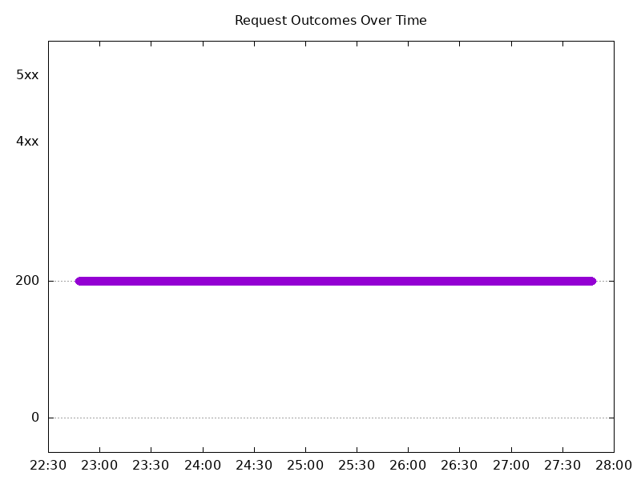
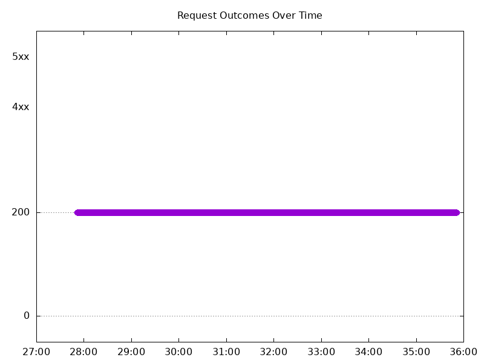
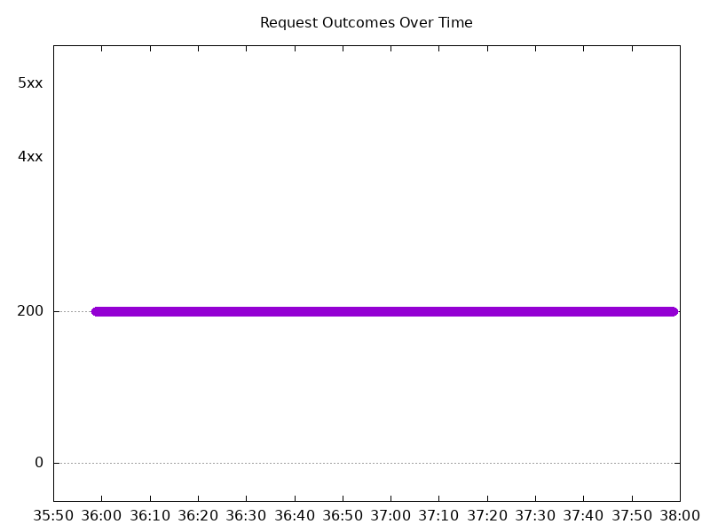
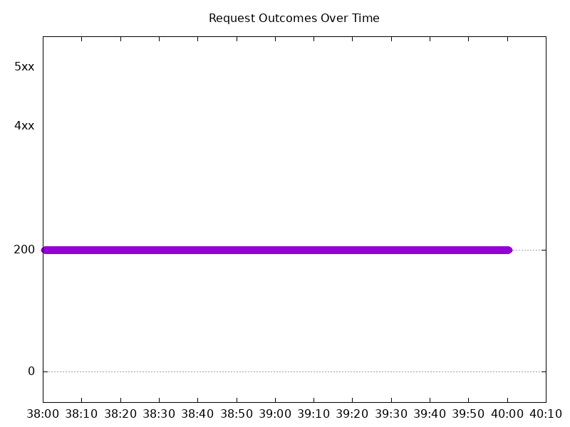
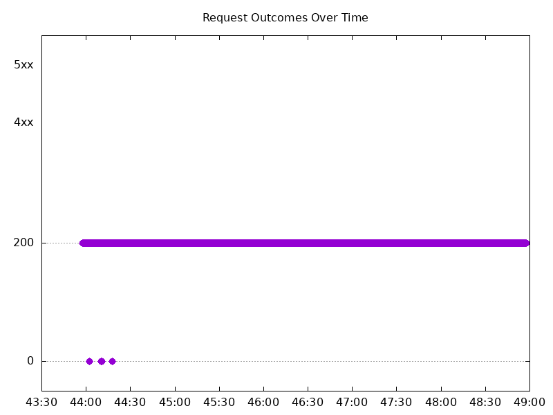
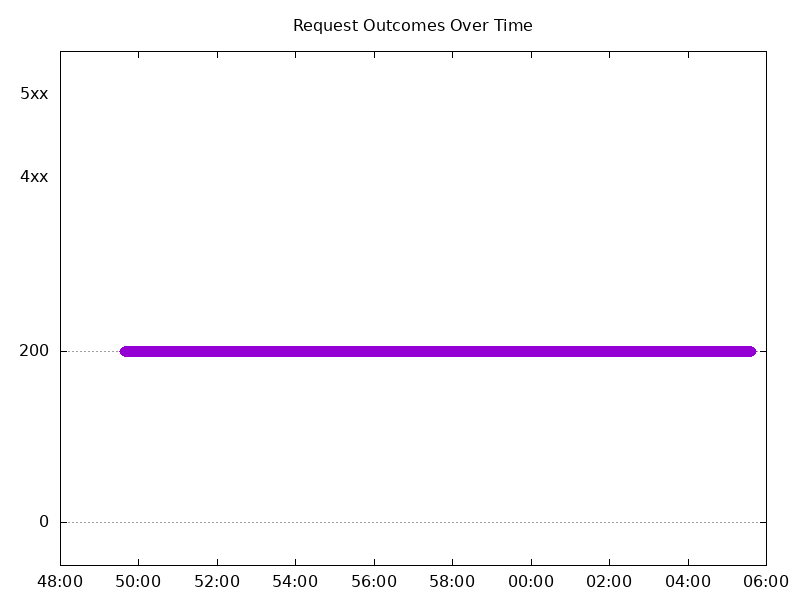
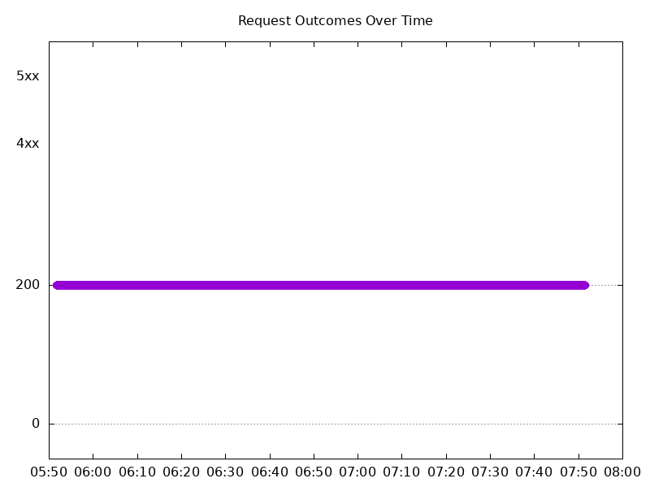
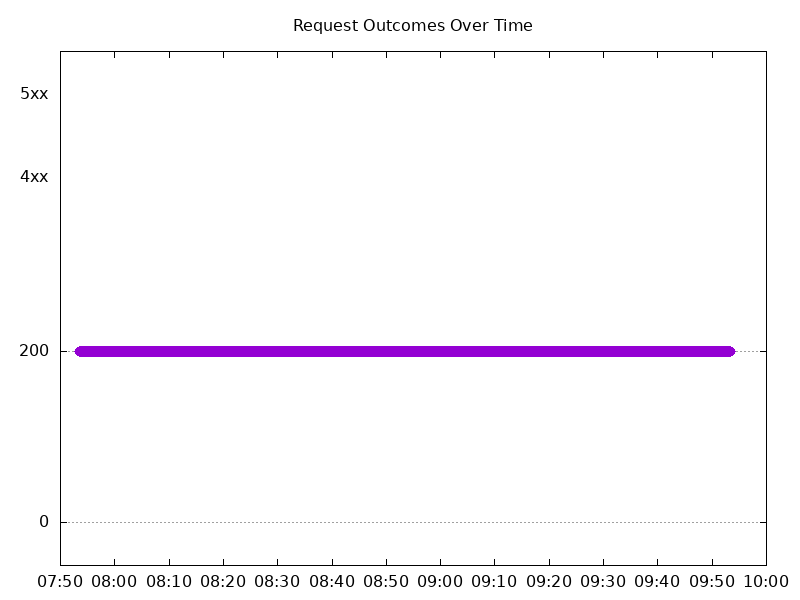

# Results

## Test environment

NGINX Plus: true

NGINX Gateway Fabric:

- Commit: 97fbe08edc096cf95f21939b6ec81975019c26fc
- Date: 2026-08-28T16:57:03Z
- Dirty: false

GKE Cluster:

- Node count: 12
- k8s version: v1.35.7-gke.1027000
- vCPUs per node: 16
- RAM per node: 65848292Ki
- Max pods per node: 110
- Zone: us-west1-b
- Instance Type: n2d-standard-16

## One NGINX Pod runs per node Test Results

### Scale Up Gradually

#### Test: Send http /coffee traffic

```text
Requests      [total, rate, throughput]         30000, 100.00, 100.00
Duration      [total, attack, wait]             5m0s, 5m0s, 1.356ms
Latencies     [min, mean, 50, 90, 95, 99, max]  592.751µs, 1.272ms, 1.254ms, 1.517ms, 1.601ms, 1.874ms, 21.195ms
Bytes In      [total, mean]                     4865950, 162.20
Bytes Out     [total, mean]                     0, 0.00
Success       [ratio]                           100.00%
Status Codes  [code:count]                      200:30000  
Error Set:
```


#### Test: Send https /tea traffic

```text
Requests      [total, rate, throughput]         30000, 100.00, 100.00
Duration      [total, attack, wait]             5m0s, 5m0s, 1.696ms
Latencies     [min, mean, 50, 90, 95, 99, max]  663.459µs, 1.351ms, 1.334ms, 1.603ms, 1.69ms, 1.981ms, 20.148ms
Bytes In      [total, mean]                     4686004, 156.20
Bytes Out     [total, mean]                     0, 0.00
Success       [ratio]                           100.00%
Status Codes  [code:count]                      200:30000  
Error Set:
```



### Scale Down Gradually

#### Test: Send http /coffee traffic

```text
Requests      [total, rate, throughput]         48000, 100.00, 100.00
Duration      [total, attack, wait]             8m0s, 8m0s, 1.517ms
Latencies     [min, mean, 50, 90, 95, 99, max]  615.199µs, 1.257ms, 1.249ms, 1.512ms, 1.595ms, 1.801ms, 24.705ms
Bytes In      [total, mean]                     7785483, 162.20
Bytes Out     [total, mean]                     0, 0.00
Success       [ratio]                           100.00%
Status Codes  [code:count]                      200:48000  
Error Set:
```



#### Test: Send https /tea traffic

```text
Requests      [total, rate, throughput]         48000, 100.00, 100.00
Duration      [total, attack, wait]             8m0s, 8m0s, 1.494ms
Latencies     [min, mean, 50, 90, 95, 99, max]  648.309µs, 1.302ms, 1.278ms, 1.579ms, 1.67ms, 1.889ms, 38.821ms
Bytes In      [total, mean]                     7497495, 156.20
Bytes Out     [total, mean]                     0, 0.00
Success       [ratio]                           100.00%
Status Codes  [code:count]                      200:48000  
Error Set:
```


### Scale Up Abruptly

#### Test: Send https /tea traffic

```text
Requests      [total, rate, throughput]         12000, 100.01, 100.01
Duration      [total, attack, wait]             2m0s, 2m0s, 1.233ms
Latencies     [min, mean, 50, 90, 95, 99, max]  675.312µs, 1.329ms, 1.317ms, 1.542ms, 1.616ms, 1.869ms, 56.986ms
Bytes In      [total, mean]                     1874443, 156.20
Bytes Out     [total, mean]                     0, 0.00
Success       [ratio]                           100.00%
Status Codes  [code:count]                      200:12000  
Error Set:
```


#### Test: Send http /coffee traffic

```text
Requests      [total, rate, throughput]         12000, 100.01, 100.01
Duration      [total, attack, wait]             2m0s, 2m0s, 1.103ms
Latencies     [min, mean, 50, 90, 95, 99, max]  663.655µs, 1.24ms, 1.234ms, 1.455ms, 1.521ms, 1.74ms, 13.925ms
Bytes In      [total, mean]                     1946449, 162.20
Bytes Out     [total, mean]                     0, 0.00
Success       [ratio]                           100.00%
Status Codes  [code:count]                      200:12000  
Error Set:
```



### Scale Down Abruptly

#### Test: Send https /tea traffic

```text
Requests      [total, rate, throughput]         12000, 100.01, 100.01
Duration      [total, attack, wait]             2m0s, 2m0s, 1.258ms
Latencies     [min, mean, 50, 90, 95, 99, max]  648.459µs, 1.312ms, 1.31ms, 1.527ms, 1.588ms, 1.725ms, 25.31ms
Bytes In      [total, mean]                     1874411, 156.20
Bytes Out     [total, mean]                     0, 0.00
Success       [ratio]                           100.00%
Status Codes  [code:count]                      200:12000  
Error Set:
```



#### Test: Send http /coffee traffic

```text
Requests      [total, rate, throughput]         12000, 100.01, 100.01
Duration      [total, attack, wait]             2m0s, 2m0s, 1.464ms
Latencies     [min, mean, 50, 90, 95, 99, max]  640.758µs, 1.261ms, 1.264ms, 1.476ms, 1.54ms, 1.684ms, 25.119ms
Bytes In      [total, mean]                     1946422, 162.20
Bytes Out     [total, mean]                     0, 0.00
Success       [ratio]                           100.00%
Status Codes  [code:count]                      200:12000  
Error Set:
```


## Multiple NGINX Pods run per node Test Results

### Scale Up Gradually

#### Test: Send https /tea traffic

```text
Requests      [total, rate, throughput]         30000, 100.00, 99.96
Duration      [total, attack, wait]             5m0s, 5m0s, 5.046ms
Latencies     [min, mean, 50, 90, 95, 99, max]  647.237µs, 693.476ms, 1.311ms, 1.93ms, 5.616s, 17.099s, 19.978s
Bytes In      [total, mean]                     4684201, 156.14
Bytes Out     [total, mean]                     0, 0.00
Success       [ratio]                           99.96%
Status Codes  [code:count]                      0:12  200:29988  
Error Set:
Get "https://cafe.example.com/tea": dial tcp 0.0.0.0:0->10.138.0.111:443: connect: connection refused
```



#### Test: Send http /coffee traffic

```text
Requests      [total, rate, throughput]         30000, 100.00, 99.96
Duration      [total, attack, wait]             5m0s, 5m0s, 4.683ms
Latencies     [min, mean, 50, 90, 95, 99, max]  621.786µs, 703.411ms, 1.261ms, 1.86ms, 5.816s, 17.143s, 19.966s
Bytes In      [total, mean]                     4863896, 162.13
Bytes Out     [total, mean]                     0, 0.00
Success       [ratio]                           99.96%
Status Codes  [code:count]                      0:13  200:29987  
Error Set:
Get "http://cafe.example.com/coffee": dial tcp 0.0.0.0:0->10.138.0.111:80: connect: connection refused
```


### Scale Down Gradually

#### Test: Send https /tea traffic

```text
Requests      [total, rate, throughput]         96000, 100.00, 100.00
Duration      [total, attack, wait]             16m0s, 16m0s, 1.297ms
Latencies     [min, mean, 50, 90, 95, 99, max]  639.275µs, 1.295ms, 1.257ms, 1.504ms, 1.595ms, 1.937ms, 167.509ms
Bytes In      [total, mean]                     14995088, 156.20
Bytes Out     [total, mean]                     0, 0.00
Success       [ratio]                           100.00%
Status Codes  [code:count]                      200:96000  
Error Set:
```



#### Test: Send http /coffee traffic

```text
Requests      [total, rate, throughput]         96000, 100.00, 100.00
Duration      [total, attack, wait]             16m0s, 16m0s, 1.412ms
Latencies     [min, mean, 50, 90, 95, 99, max]  618.229µs, 1.226ms, 1.199ms, 1.429ms, 1.51ms, 1.849ms, 152.232ms
Bytes In      [total, mean]                     15571149, 162.20
Bytes Out     [total, mean]                     0, 0.00
Success       [ratio]                           100.00%
Status Codes  [code:count]                      200:96000  
Error Set:
```


### Scale Up Abruptly

#### Test: Send https /tea traffic

```text
Requests      [total, rate, throughput]         12000, 100.01, 100.01
Duration      [total, attack, wait]             2m0s, 2m0s, 1.363ms
Latencies     [min, mean, 50, 90, 95, 99, max]  699.036µs, 1.446ms, 1.278ms, 1.514ms, 1.593ms, 1.971ms, 175.396ms
Bytes In      [total, mean]                     1874348, 156.20
Bytes Out     [total, mean]                     0, 0.00
Success       [ratio]                           100.00%
Status Codes  [code:count]                      200:12000  
Error Set:
```


#### Test: Send http /coffee traffic

```text
Requests      [total, rate, throughput]         12000, 100.01, 100.01
Duration      [total, attack, wait]             2m0s, 2m0s, 1.506ms
Latencies     [min, mean, 50, 90, 95, 99, max]  640.679µs, 1.37ms, 1.203ms, 1.437ms, 1.517ms, 1.853ms, 175.046ms
Bytes In      [total, mean]                     1946464, 162.21
Bytes Out     [total, mean]                     0, 0.00
Success       [ratio]                           100.00%
Status Codes  [code:count]                      200:12000  
Error Set:
```



### Scale Down Abruptly

#### Test: Send https /tea traffic

```text
Requests      [total, rate, throughput]         12000, 100.01, 100.01
Duration      [total, attack, wait]             2m0s, 2m0s, 1.421ms
Latencies     [min, mean, 50, 90, 95, 99, max]  697.778µs, 1.285ms, 1.274ms, 1.504ms, 1.578ms, 1.791ms, 10.09ms
Bytes In      [total, mean]                     1874425, 156.20
Bytes Out     [total, mean]                     0, 0.00
Success       [ratio]                           100.00%
Status Codes  [code:count]                      200:12000  
Error Set:
```



#### Test: Send http /coffee traffic

```text
Requests      [total, rate, throughput]         12000, 100.01, 100.01
Duration      [total, attack, wait]             2m0s, 2m0s, 1.12ms
Latencies     [min, mean, 50, 90, 95, 99, max]  683.029µs, 1.236ms, 1.233ms, 1.45ms, 1.52ms, 1.717ms, 10.129ms
Bytes In      [total, mean]                     1946492, 162.21
Bytes Out     [total, mean]                     0, 0.00
Success       [ratio]                           100.00%
Status Codes  [code:count]                      200:12000  
Error Set:
```


