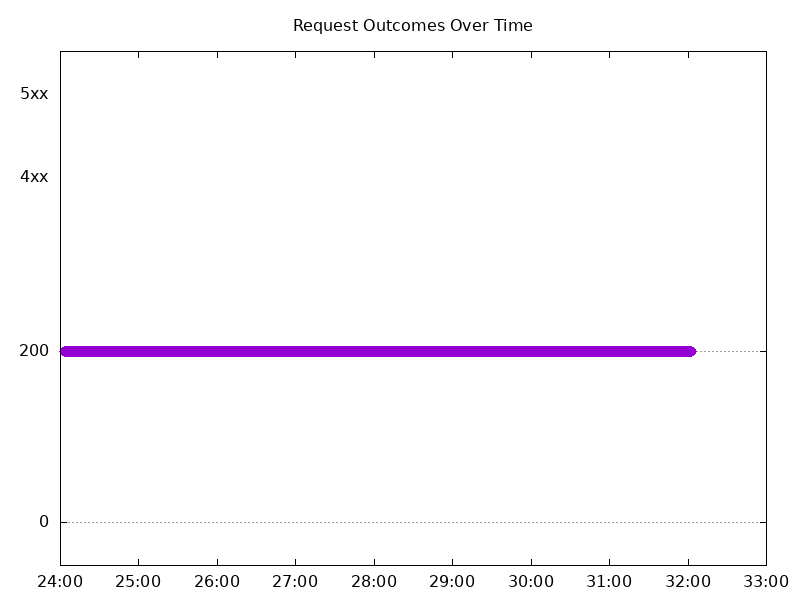
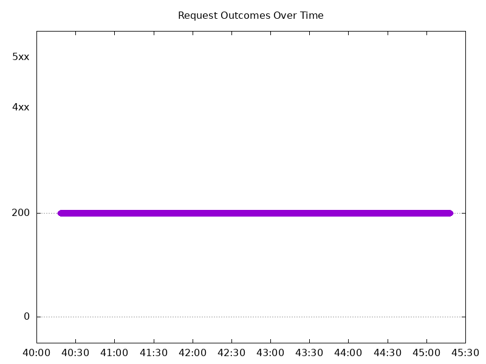
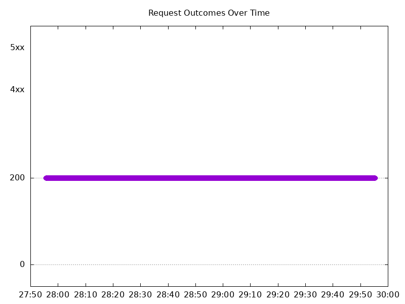

# Results

## Test environment

NGINX Plus: false

NGINX Gateway Fabric:

- Commit: 2f3153c547e0442fbb26aa9165118f4dc2b20f23
- Date: 2026-04-01T15:39:22Z
- Dirty: false

GKE Cluster:

- Node count: 12
- k8s version: v1.35.1-gke.1396002
- vCPUs per node: 16
- RAM per node: 65848316Ki
- Max pods per node: 110
- Zone: us-west1-b
- Instance Type: n2d-standard-16

## One NGINX Pod runs per node Test Results

### Scale Up Gradually

#### Test: Send https /tea traffic

```text
Requests      [total, rate, throughput]         30000, 100.00, 100.00
Duration      [total, attack, wait]             5m0s, 5m0s, 1.324ms
Latencies     [min, mean, 50, 90, 95, 99, max]  699.372µs, 1.2ms, 1.158ms, 1.38ms, 1.523ms, 2.086ms, 19.077ms
Bytes In      [total, mean]                     4656049, 155.20
Bytes Out     [total, mean]                     0, 0.00
Success       [ratio]                           100.00%
Status Codes  [code:count]                      200:30000  
Error Set:
```


#### Test: Send http /coffee traffic

```text
Requests      [total, rate, throughput]         30000, 100.00, 100.00
Duration      [total, attack, wait]             5m0s, 5m0s, 798.757µs
Latencies     [min, mean, 50, 90, 95, 99, max]  666.99µs, 1.112ms, 1.095ms, 1.278ms, 1.346ms, 1.814ms, 19.501ms
Bytes In      [total, mean]                     4835994, 161.20
Bytes Out     [total, mean]                     0, 0.00
Success       [ratio]                           100.00%
Status Codes  [code:count]                      200:30000  
Error Set:
```


### Scale Down Gradually

#### Test: Send http /coffee traffic

```text
Requests      [total, rate, throughput]         48000, 100.00, 100.00
Duration      [total, attack, wait]             8m0s, 8m0s, 931.045µs
Latencies     [min, mean, 50, 90, 95, 99, max]  670.453µs, 1.12ms, 1.106ms, 1.282ms, 1.345ms, 1.604ms, 28.651ms
Bytes In      [total, mean]                     7737689, 161.20
Bytes Out     [total, mean]                     0, 0.00
Success       [ratio]                           100.00%
Status Codes  [code:count]                      200:48000  
Error Set:
```


#### Test: Send https /tea traffic

```text
Requests      [total, rate, throughput]         48000, 100.00, 100.00
Duration      [total, attack, wait]             8m0s, 8m0s, 804.955µs
Latencies     [min, mean, 50, 90, 95, 99, max]  688.825µs, 1.228ms, 1.193ms, 1.421ms, 1.535ms, 1.942ms, 46.521ms
Bytes In      [total, mean]                     7449694, 155.20
Bytes Out     [total, mean]                     0, 0.00
Success       [ratio]                           100.00%
Status Codes  [code:count]                      200:48000  
Error Set:
```



### Scale Up Abruptly

#### Test: Send http /coffee traffic

```text
Requests      [total, rate, throughput]         12000, 100.01, 100.01
Duration      [total, attack, wait]             2m0s, 2m0s, 1.073ms
Latencies     [min, mean, 50, 90, 95, 99, max]  702.259µs, 1.127ms, 1.106ms, 1.271ms, 1.326ms, 1.614ms, 71.845ms
Bytes In      [total, mean]                     1934417, 161.20
Bytes Out     [total, mean]                     0, 0.00
Success       [ratio]                           100.00%
Status Codes  [code:count]                      200:12000  
Error Set:
```


#### Test: Send https /tea traffic

```text
Requests      [total, rate, throughput]         12000, 100.01, 100.01
Duration      [total, attack, wait]             2m0s, 2m0s, 1.179ms
Latencies     [min, mean, 50, 90, 95, 99, max]  717.915µs, 1.174ms, 1.138ms, 1.336ms, 1.411ms, 1.708ms, 71.7ms
Bytes In      [total, mean]                     1862448, 155.20
Bytes Out     [total, mean]                     0, 0.00
Success       [ratio]                           100.00%
Status Codes  [code:count]                      200:12000  
Error Set:
```


### Scale Down Abruptly

#### Test: Send http /coffee traffic

```text
Requests      [total, rate, throughput]         12000, 100.01, 100.01
Duration      [total, attack, wait]             2m0s, 2m0s, 1.127ms
Latencies     [min, mean, 50, 90, 95, 99, max]  704.619µs, 1.141ms, 1.124ms, 1.311ms, 1.386ms, 1.584ms, 31.652ms
Bytes In      [total, mean]                     1934373, 161.20
Bytes Out     [total, mean]                     0, 0.00
Success       [ratio]                           100.00%
Status Codes  [code:count]                      200:12000  
Error Set:
```


#### Test: Send https /tea traffic

```text
Requests      [total, rate, throughput]         12000, 100.01, 100.01
Duration      [total, attack, wait]             2m0s, 2m0s, 1.282ms
Latencies     [min, mean, 50, 90, 95, 99, max]  748.084µs, 1.203ms, 1.177ms, 1.38ms, 1.453ms, 1.685ms, 31.198ms
Bytes In      [total, mean]                     1862346, 155.20
Bytes Out     [total, mean]                     0, 0.00
Success       [ratio]                           100.00%
Status Codes  [code:count]                      200:12000  
Error Set:
```


## Multiple NGINX Pods run per node Test Results

### Scale Up Gradually

#### Test: Send https /tea traffic

```text
Requests      [total, rate, throughput]         30000, 100.00, 100.00
Duration      [total, attack, wait]             5m0s, 5m0s, 1.134ms
Latencies     [min, mean, 50, 90, 95, 99, max]  689.696µs, 1.203ms, 1.141ms, 1.401ms, 1.58ms, 2.295ms, 17.824ms
Bytes In      [total, mean]                     4655938, 155.20
Bytes Out     [total, mean]                     0, 0.00
Success       [ratio]                           100.00%
Status Codes  [code:count]                      200:30000  
Error Set:
```



#### Test: Send http /coffee traffic

```text
Requests      [total, rate, throughput]         30000, 100.00, 100.00
Duration      [total, attack, wait]             5m0s, 5m0s, 984.824µs
Latencies     [min, mean, 50, 90, 95, 99, max]  604.88µs, 1.108ms, 1.081ms, 1.273ms, 1.357ms, 2.16ms, 14.571ms
Bytes In      [total, mean]                     4836012, 161.20
Bytes Out     [total, mean]                     0, 0.00
Success       [ratio]                           100.00%
Status Codes  [code:count]                      200:30000  
Error Set:
```


### Scale Down Gradually

#### Test: Send http /coffee traffic

```text
Requests      [total, rate, throughput]         96000, 100.00, 100.00
Duration      [total, attack, wait]             16m0s, 16m0s, 1.288ms
Latencies     [min, mean, 50, 90, 95, 99, max]  655.241µs, 1.158ms, 1.131ms, 1.34ms, 1.433ms, 1.963ms, 60.45ms
Bytes In      [total, mean]                     15475205, 161.20
Bytes Out     [total, mean]                     0, 0.00
Success       [ratio]                           100.00%
Status Codes  [code:count]                      200:96000  
Error Set:
```


#### Test: Send https /tea traffic

```text
Requests      [total, rate, throughput]         96000, 100.00, 100.00
Duration      [total, attack, wait]             16m0s, 16m0s, 1.402ms
Latencies     [min, mean, 50, 90, 95, 99, max]  707.123µs, 1.218ms, 1.178ms, 1.397ms, 1.5ms, 2.027ms, 60.223ms
Bytes In      [total, mean]                     14899236, 155.20
Bytes Out     [total, mean]                     0, 0.00
Success       [ratio]                           100.00%
Status Codes  [code:count]                      200:96000  
Error Set:
```


### Scale Up Abruptly

#### Test: Send http /coffee traffic

```text
Requests      [total, rate, throughput]         12000, 100.01, 100.01
Duration      [total, attack, wait]             2m0s, 2m0s, 1.455ms
Latencies     [min, mean, 50, 90, 95, 99, max]  640.684µs, 1.223ms, 1.2ms, 1.487ms, 1.584ms, 1.903ms, 6.649ms
Bytes In      [total, mean]                     1934401, 161.20
Bytes Out     [total, mean]                     0, 0.00
Success       [ratio]                           100.00%
Status Codes  [code:count]                      200:12000  
Error Set:
```



#### Test: Send https /tea traffic

```text
Requests      [total, rate, throughput]         12000, 100.01, 100.01
Duration      [total, attack, wait]             2m0s, 2m0s, 1.095ms
Latencies     [min, mean, 50, 90, 95, 99, max]  681.925µs, 1.176ms, 1.154ms, 1.368ms, 1.442ms, 1.803ms, 11.748ms
Bytes In      [total, mean]                     1862381, 155.20
Bytes Out     [total, mean]                     0, 0.00
Success       [ratio]                           100.00%
Status Codes  [code:count]                      200:12000  
Error Set:
```


### Scale Down Abruptly

#### Test: Send https /tea traffic

```text
Requests      [total, rate, throughput]         12000, 100.01, 100.01
Duration      [total, attack, wait]             2m0s, 2m0s, 1.31ms
Latencies     [min, mean, 50, 90, 95, 99, max]  732.522µs, 1.239ms, 1.225ms, 1.396ms, 1.454ms, 1.655ms, 13.793ms
Bytes In      [total, mean]                     1862308, 155.19
Bytes Out     [total, mean]                     0, 0.00
Success       [ratio]                           100.00%
Status Codes  [code:count]                      200:12000  
Error Set:
```


#### Test: Send http /coffee traffic

```text
Requests      [total, rate, throughput]         12000, 100.01, 100.01
Duration      [total, attack, wait]             2m0s, 2m0s, 1.003ms
Latencies     [min, mean, 50, 90, 95, 99, max]  636.045µs, 1.151ms, 1.145ms, 1.339ms, 1.399ms, 1.562ms, 13.817ms
Bytes In      [total, mean]                     1934355, 161.20
Bytes Out     [total, mean]                     0, 0.00
Success       [ratio]                           100.00%
Status Codes  [code:count]                      200:12000  
Error Set:
```


