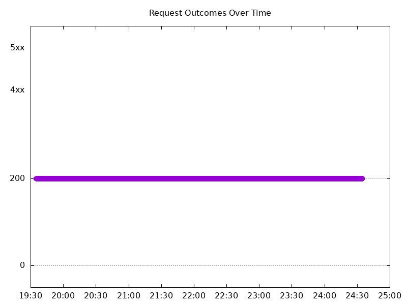
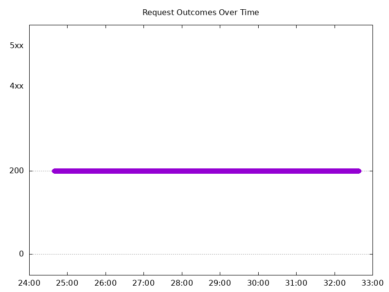
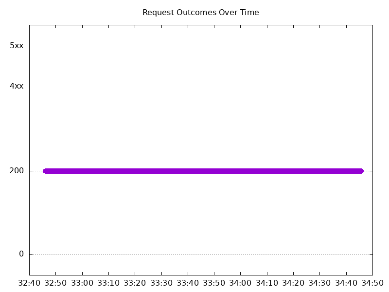
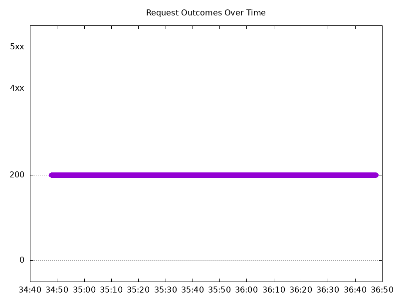
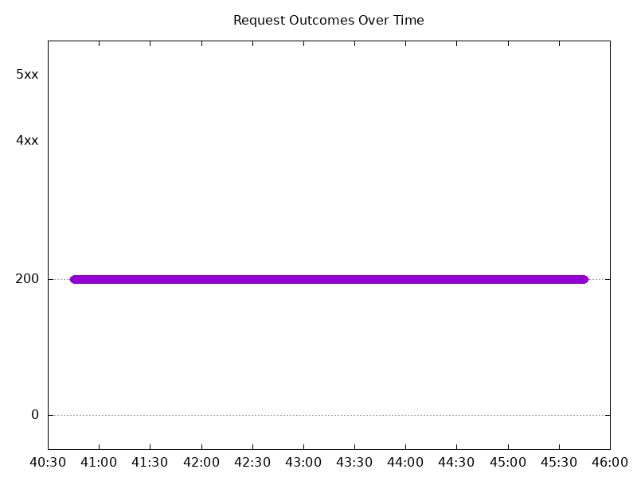
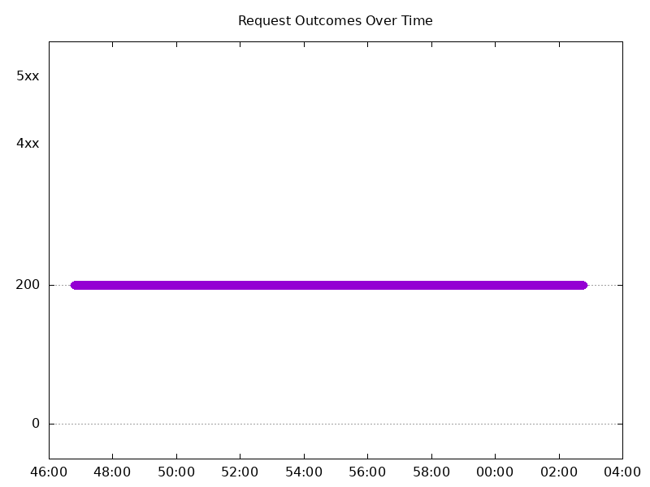
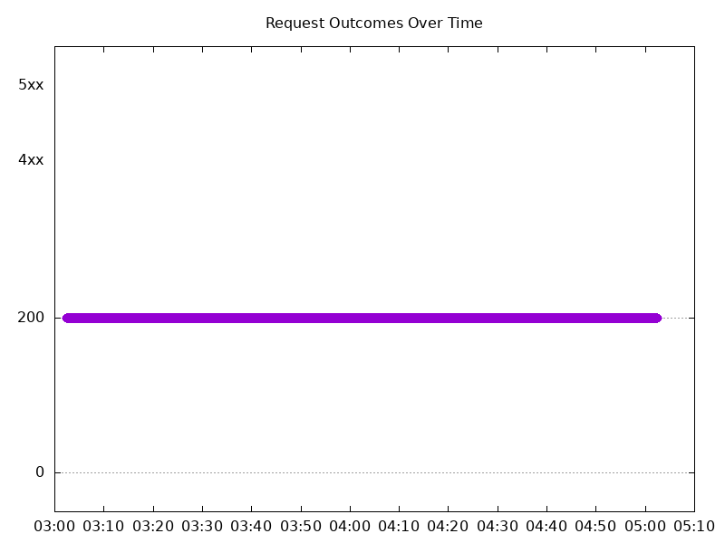
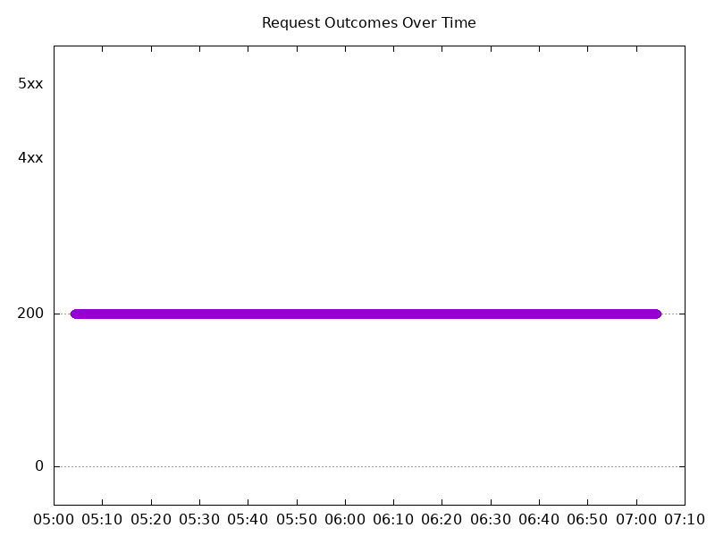

# Results

## Test environment

NGINX Plus: false

NGINX Gateway Fabric:

- Commit: fef4f734728239e3248cda180e74f72e436b06b9
- Date: 2026-08-14T15:07:13Z
- Dirty: false

GKE Cluster:

- Node count: 12
- k8s version: v1.35.6-gke.1258000
- vCPUs per node: 16
- RAM per node: 65848288Ki
- Max pods per node: 110
- Zone: us-west1-b
- Instance Type: n2d-standard-16

## One NGINX Pod runs per node Test Results

### Scale Up Gradually

#### Test: Send https /tea traffic

```text
Requests      [total, rate, throughput]         30000, 100.00, 100.00
Duration      [total, attack, wait]             5m0s, 5m0s, 1.33ms
Latencies     [min, mean, 50, 90, 95, 99, max]  751.815µs, 1.368ms, 1.347ms, 1.554ms, 1.645ms, 2.067ms, 25.179ms
Bytes In      [total, mean]                     4655986, 155.20
Bytes Out     [total, mean]                     0, 0.00
Success       [ratio]                           100.00%
Status Codes  [code:count]                      200:30000  
Error Set:
```



#### Test: Send http /coffee traffic

```text
Requests      [total, rate, throughput]         30000, 100.00, 100.00
Duration      [total, attack, wait]             5m0s, 5m0s, 1.472ms
Latencies     [min, mean, 50, 90, 95, 99, max]  690.011µs, 1.309ms, 1.298ms, 1.496ms, 1.564ms, 1.951ms, 25.095ms
Bytes In      [total, mean]                     4833005, 161.10
Bytes Out     [total, mean]                     0, 0.00
Success       [ratio]                           100.00%
Status Codes  [code:count]                      200:30000  
Error Set:
```


### Scale Down Gradually

#### Test: Send http /coffee traffic

```text
Requests      [total, rate, throughput]         48000, 100.00, 100.00
Duration      [total, attack, wait]             8m0s, 8m0s, 1.515ms
Latencies     [min, mean, 50, 90, 95, 99, max]  743.618µs, 1.33ms, 1.319ms, 1.509ms, 1.578ms, 1.842ms, 56.212ms
Bytes In      [total, mean]                     7732800, 161.10
Bytes Out     [total, mean]                     0, 0.00
Success       [ratio]                           100.00%
Status Codes  [code:count]                      200:48000  
Error Set:
```


#### Test: Send https /tea traffic

```text
Requests      [total, rate, throughput]         48000, 100.00, 100.00
Duration      [total, attack, wait]             8m0s, 8m0s, 1.498ms
Latencies     [min, mean, 50, 90, 95, 99, max]  783.465µs, 1.37ms, 1.349ms, 1.544ms, 1.619ms, 1.997ms, 54.76ms
Bytes In      [total, mean]                     7449550, 155.20
Bytes Out     [total, mean]                     0, 0.00
Success       [ratio]                           100.00%
Status Codes  [code:count]                      200:48000  
Error Set:
```



### Scale Up Abruptly

#### Test: Send https /tea traffic

```text
Requests      [total, rate, throughput]         12000, 100.01, 100.01
Duration      [total, attack, wait]             2m0s, 2m0s, 1.48ms
Latencies     [min, mean, 50, 90, 95, 99, max]  789.214µs, 1.408ms, 1.384ms, 1.617ms, 1.697ms, 2.016ms, 69.194ms
Bytes In      [total, mean]                     1862375, 155.20
Bytes Out     [total, mean]                     0, 0.00
Success       [ratio]                           100.00%
Status Codes  [code:count]                      200:12000  
Error Set:
```


#### Test: Send http /coffee traffic

```text
Requests      [total, rate, throughput]         12000, 100.01, 100.01
Duration      [total, attack, wait]             2m0s, 2m0s, 1.466ms
Latencies     [min, mean, 50, 90, 95, 99, max]  777.47µs, 1.372ms, 1.364ms, 1.574ms, 1.645ms, 1.919ms, 16.396ms
Bytes In      [total, mean]                     1933206, 161.10
Bytes Out     [total, mean]                     0, 0.00
Success       [ratio]                           100.00%
Status Codes  [code:count]                      200:12000  
Error Set:
```



### Scale Down Abruptly

#### Test: Send https /tea traffic

```text
Requests      [total, rate, throughput]         12000, 100.01, 100.01
Duration      [total, attack, wait]             2m0s, 2m0s, 1.424ms
Latencies     [min, mean, 50, 90, 95, 99, max]  829.349µs, 1.463ms, 1.453ms, 1.656ms, 1.721ms, 1.93ms, 11.986ms
Bytes In      [total, mean]                     1862404, 155.20
Bytes Out     [total, mean]                     0, 0.00
Success       [ratio]                           100.00%
Status Codes  [code:count]                      200:12000  
Error Set:
```


#### Test: Send http /coffee traffic

```text
Requests      [total, rate, throughput]         12000, 100.01, 100.01
Duration      [total, attack, wait]             2m0s, 2m0s, 1.55ms
Latencies     [min, mean, 50, 90, 95, 99, max]  873.282µs, 1.422ms, 1.423ms, 1.615ms, 1.678ms, 1.86ms, 4.772ms
Bytes In      [total, mean]                     1933186, 161.10
Bytes Out     [total, mean]                     0, 0.00
Success       [ratio]                           100.00%
Status Codes  [code:count]                      200:12000  
Error Set:
```



## Multiple NGINX Pods run per node Test Results

### Scale Up Gradually

#### Test: Send http /coffee traffic

```text
Requests      [total, rate, throughput]         30000, 100.00, 100.00
Duration      [total, attack, wait]             5m0s, 5m0s, 1.624ms
Latencies     [min, mean, 50, 90, 95, 99, max]  710.777µs, 1.318ms, 1.302ms, 1.505ms, 1.59ms, 2.097ms, 32.999ms
Bytes In      [total, mean]                     4833045, 161.10
Bytes Out     [total, mean]                     0, 0.00
Success       [ratio]                           100.00%
Status Codes  [code:count]                      200:30000  
Error Set:
```



#### Test: Send https /tea traffic

```text
Requests      [total, rate, throughput]         30000, 100.00, 100.00
Duration      [total, attack, wait]             5m0s, 5m0s, 1.253ms
Latencies     [min, mean, 50, 90, 95, 99, max]  746.088µs, 1.366ms, 1.338ms, 1.552ms, 1.646ms, 2.174ms, 15.674ms
Bytes In      [total, mean]                     4655955, 155.20
Bytes Out     [total, mean]                     0, 0.00
Success       [ratio]                           100.00%
Status Codes  [code:count]                      200:30000  
Error Set:
```


### Scale Down Gradually

#### Test: Send http /coffee traffic

```text
Requests      [total, rate, throughput]         96000, 100.00, 100.00
Duration      [total, attack, wait]             16m0s, 16m0s, 1.335ms
Latencies     [min, mean, 50, 90, 95, 99, max]  736.8µs, 1.337ms, 1.325ms, 1.526ms, 1.597ms, 1.903ms, 67.467ms
Bytes In      [total, mean]                     15465631, 161.10
Bytes Out     [total, mean]                     0, 0.00
Success       [ratio]                           100.00%
Status Codes  [code:count]                      200:96000  
Error Set:
```



#### Test: Send https /tea traffic

```text
Requests      [total, rate, throughput]         96000, 100.00, 100.00
Duration      [total, attack, wait]             16m0s, 16m0s, 1.33ms
Latencies     [min, mean, 50, 90, 95, 99, max]  773.414µs, 1.397ms, 1.371ms, 1.581ms, 1.66ms, 2.03ms, 68.602ms
Bytes In      [total, mean]                     14899367, 155.20
Bytes Out     [total, mean]                     0, 0.00
Success       [ratio]                           100.00%
Status Codes  [code:count]                      200:96000  
Error Set:
```


### Scale Up Abruptly

#### Test: Send https /tea traffic

```text
Requests      [total, rate, throughput]         12000, 100.01, 100.01
Duration      [total, attack, wait]             2m0s, 2m0s, 1.351ms
Latencies     [min, mean, 50, 90, 95, 99, max]  821.561µs, 1.493ms, 1.439ms, 1.658ms, 1.729ms, 2.01ms, 126.08ms
Bytes In      [total, mean]                     1862426, 155.20
Bytes Out     [total, mean]                     0, 0.00
Success       [ratio]                           100.00%
Status Codes  [code:count]                      200:12000  
Error Set:
```


#### Test: Send http /coffee traffic

```text
Requests      [total, rate, throughput]         12000, 100.01, 100.01
Duration      [total, attack, wait]             2m0s, 2m0s, 1.42ms
Latencies     [min, mean, 50, 90, 95, 99, max]  763.931µs, 1.417ms, 1.372ms, 1.596ms, 1.669ms, 1.926ms, 126.7ms
Bytes In      [total, mean]                     1933186, 161.10
Bytes Out     [total, mean]                     0, 0.00
Success       [ratio]                           100.00%
Status Codes  [code:count]                      200:12000  
Error Set:
```



### Scale Down Abruptly

#### Test: Send https /tea traffic

```text
Requests      [total, rate, throughput]         12000, 100.01, 100.01
Duration      [total, attack, wait]             2m0s, 2m0s, 1.354ms
Latencies     [min, mean, 50, 90, 95, 99, max]  767.931µs, 1.441ms, 1.427ms, 1.65ms, 1.714ms, 1.892ms, 53.841ms
Bytes In      [total, mean]                     1862350, 155.20
Bytes Out     [total, mean]                     0, 0.00
Success       [ratio]                           100.00%
Status Codes  [code:count]                      200:12000  
Error Set:
```



#### Test: Send http /coffee traffic

```text
Requests      [total, rate, throughput]         12000, 100.01, 100.01
Duration      [total, attack, wait]             2m0s, 2m0s, 1.343ms
Latencies     [min, mean, 50, 90, 95, 99, max]  701.423µs, 1.404ms, 1.397ms, 1.616ms, 1.677ms, 1.871ms, 45.829ms
Bytes In      [total, mean]                     1933221, 161.10
Bytes Out     [total, mean]                     0, 0.00
Success       [ratio]                           100.00%
Status Codes  [code:count]                      200:12000  
Error Set:
```


