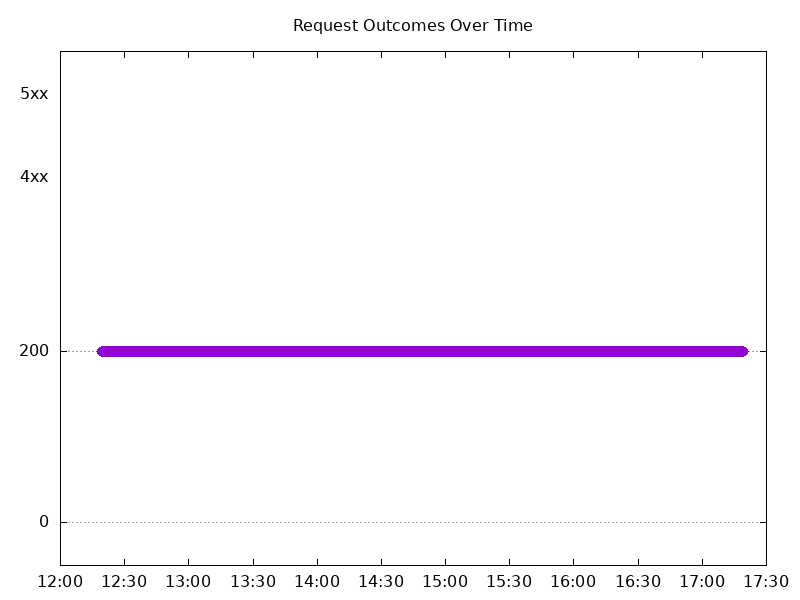
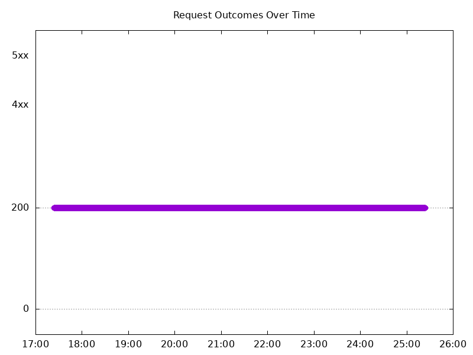
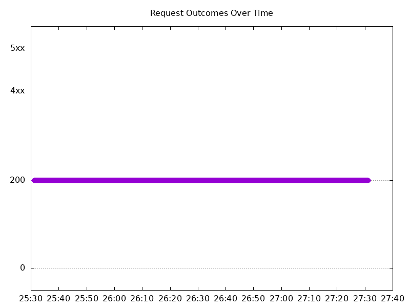
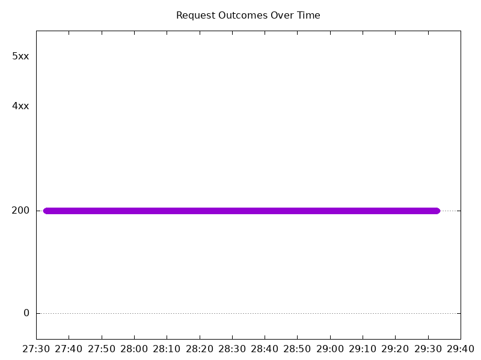
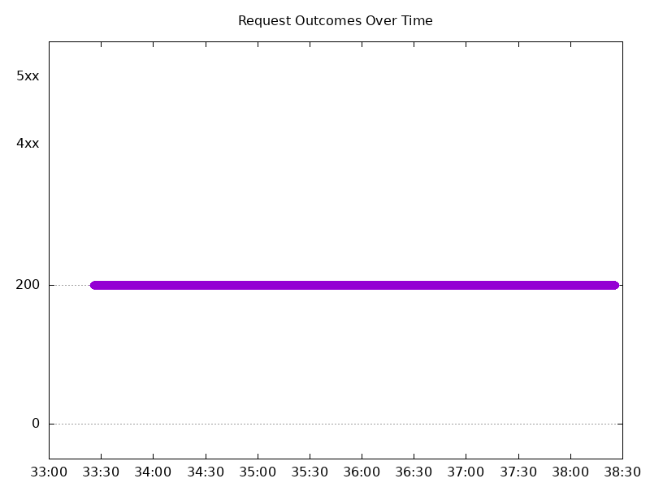
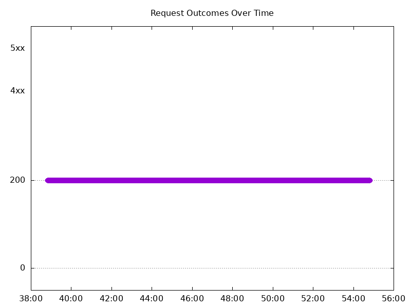
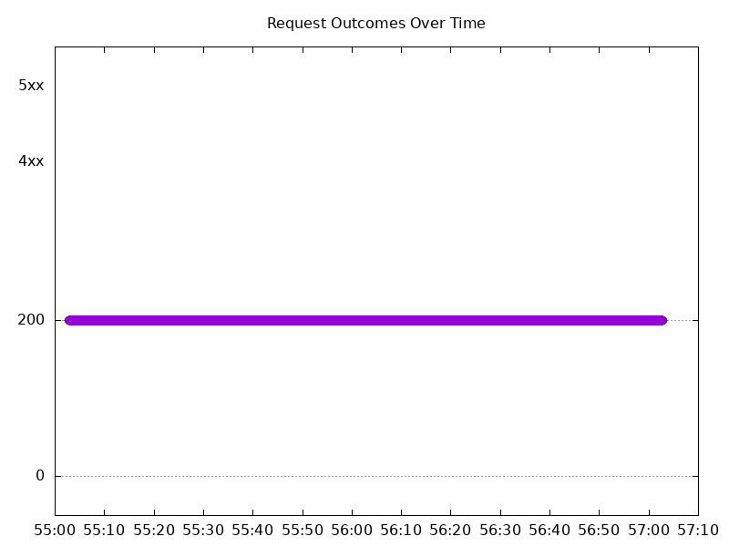
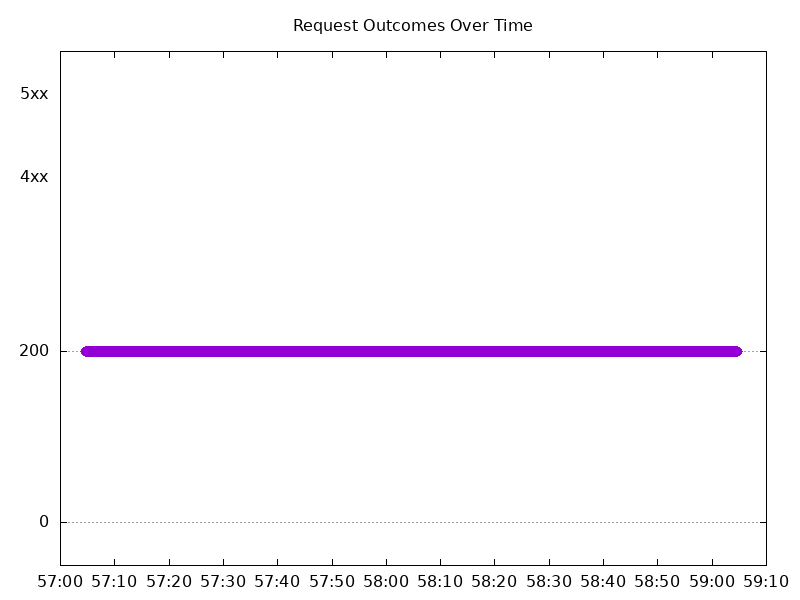

# Results

## Test environment

NGINX Plus: false

NGINX Gateway Fabric:

- Commit: ea67c576e39284e758352dda72242024cc98fa7f
- Date: 2026-10-01T15:28:08Z
- Dirty: false

GKE Cluster:

- Node count: 12
- k8s version: v1.35.8-gke.1225000
- vCPUs per node: 16
- RAM per node: 65848288Ki
- Max pods per node: 110
- Zone: us-west1-b
- Instance Type: n2d-standard-16

## One NGINX Pod runs per node Test Results

### Scale Up Gradually

#### Test: Send https /tea traffic

```text
Requests      [total, rate, throughput]         30000, 100.00, 100.00
Duration      [total, attack, wait]             5m0s, 5m0s, 965.327µs
Latencies     [min, mean, 50, 90, 95, 99, max]  631.322µs, 1.098ms, 1.077ms, 1.259ms, 1.325ms, 1.715ms, 21.39ms
Bytes In      [total, mean]                     4653002, 155.10
Bytes Out     [total, mean]                     0, 0.00
Success       [ratio]                           100.00%
Status Codes  [code:count]                      200:30000  
Error Set:
```



#### Test: Send http /coffee traffic

```text
Requests      [total, rate, throughput]         30000, 100.00, 100.00
Duration      [total, attack, wait]             5m0s, 5m0s, 1.265ms
Latencies     [min, mean, 50, 90, 95, 99, max]  597.469µs, 1.046ms, 1.031ms, 1.207ms, 1.265ms, 1.648ms, 21.58ms
Bytes In      [total, mean]                     4832964, 161.10
Bytes Out     [total, mean]                     0, 0.00
Success       [ratio]                           100.00%
Status Codes  [code:count]                      200:30000  
Error Set:
```


### Scale Down Gradually

#### Test: Send https /tea traffic

```text
Requests      [total, rate, throughput]         48000, 100.00, 100.00
Duration      [total, attack, wait]             8m0s, 8m0s, 1.364ms
Latencies     [min, mean, 50, 90, 95, 99, max]  642.507µs, 1.139ms, 1.119ms, 1.305ms, 1.365ms, 1.598ms, 55.518ms
Bytes In      [total, mean]                     7444754, 155.10
Bytes Out     [total, mean]                     0, 0.00
Success       [ratio]                           100.00%
Status Codes  [code:count]                      200:48000  
Error Set:
```



#### Test: Send http /coffee traffic

```text
Requests      [total, rate, throughput]         48000, 100.00, 100.00
Duration      [total, attack, wait]             8m0s, 8m0s, 1.192ms
Latencies     [min, mean, 50, 90, 95, 99, max]  609.998µs, 1.081ms, 1.067ms, 1.259ms, 1.319ms, 1.522ms, 54.237ms
Bytes In      [total, mean]                     7732712, 161.10
Bytes Out     [total, mean]                     0, 0.00
Success       [ratio]                           100.00%
Status Codes  [code:count]                      200:48000  
Error Set:
```


### Scale Up Abruptly

#### Test: Send https /tea traffic

```text
Requests      [total, rate, throughput]         12000, 100.01, 100.01
Duration      [total, attack, wait]             2m0s, 2m0s, 1.052ms
Latencies     [min, mean, 50, 90, 95, 99, max]  692.868µs, 1.123ms, 1.105ms, 1.292ms, 1.351ms, 1.498ms, 12.752ms
Bytes In      [total, mean]                     1861208, 155.10
Bytes Out     [total, mean]                     0, 0.00
Success       [ratio]                           100.00%
Status Codes  [code:count]                      200:12000  
Error Set:
```


#### Test: Send http /coffee traffic

```text
Requests      [total, rate, throughput]         12000, 100.01, 100.01
Duration      [total, attack, wait]             2m0s, 2m0s, 1.02ms
Latencies     [min, mean, 50, 90, 95, 99, max]  635.829µs, 1.052ms, 1.036ms, 1.231ms, 1.298ms, 1.467ms, 12.704ms
Bytes In      [total, mean]                     1933225, 161.10
Bytes Out     [total, mean]                     0, 0.00
Success       [ratio]                           100.00%
Status Codes  [code:count]                      200:12000  
Error Set:
```



### Scale Down Abruptly

#### Test: Send http /coffee traffic

```text
Requests      [total, rate, throughput]         12000, 100.01, 100.01
Duration      [total, attack, wait]             2m0s, 2m0s, 1.157ms
Latencies     [min, mean, 50, 90, 95, 99, max]  679.702µs, 1.101ms, 1.079ms, 1.251ms, 1.305ms, 1.46ms, 73.734ms
Bytes In      [total, mean]                     1933220, 161.10
Bytes Out     [total, mean]                     0, 0.00
Success       [ratio]                           100.00%
Status Codes  [code:count]                      200:12000  
Error Set:
```



#### Test: Send https /tea traffic

```text
Requests      [total, rate, throughput]         12000, 100.01, 100.01
Duration      [total, attack, wait]             2m0s, 2m0s, 1.005ms
Latencies     [min, mean, 50, 90, 95, 99, max]  694.059µs, 1.156ms, 1.129ms, 1.289ms, 1.347ms, 1.498ms, 66.777ms
Bytes In      [total, mean]                     1861174, 155.10
Bytes Out     [total, mean]                     0, 0.00
Success       [ratio]                           100.00%
Status Codes  [code:count]                      200:12000  
Error Set:
```


## Multiple NGINX Pods run per node Test Results

### Scale Up Gradually

#### Test: Send https /tea traffic

```text
Requests      [total, rate, throughput]         30000, 100.00, 100.00
Duration      [total, attack, wait]             5m0s, 5m0s, 1.217ms
Latencies     [min, mean, 50, 90, 95, 99, max]  674.14µs, 1.142ms, 1.119ms, 1.29ms, 1.352ms, 1.789ms, 25.713ms
Bytes In      [total, mean]                     4653015, 155.10
Bytes Out     [total, mean]                     0, 0.00
Success       [ratio]                           100.00%
Status Codes  [code:count]                      200:30000  
Error Set:
```


#### Test: Send http /coffee traffic

```text
Requests      [total, rate, throughput]         30000, 100.00, 100.00
Duration      [total, attack, wait]             5m0s, 5m0s, 1.129ms
Latencies     [min, mean, 50, 90, 95, 99, max]  624.981µs, 1.072ms, 1.058ms, 1.227ms, 1.288ms, 1.697ms, 18.306ms
Bytes In      [total, mean]                     4832958, 161.10
Bytes Out     [total, mean]                     0, 0.00
Success       [ratio]                           100.00%
Status Codes  [code:count]                      200:30000  
Error Set:
```



### Scale Down Gradually

#### Test: Send https /tea traffic

```text
Requests      [total, rate, throughput]         96000, 100.00, 100.00
Duration      [total, attack, wait]             16m0s, 16m0s, 1.034ms
Latencies     [min, mean, 50, 90, 95, 99, max]  657.832µs, 1.145ms, 1.114ms, 1.278ms, 1.334ms, 1.642ms, 126.724ms
Bytes In      [total, mean]                     14889579, 155.10
Bytes Out     [total, mean]                     0, 0.00
Success       [ratio]                           100.00%
Status Codes  [code:count]                      200:96000  
Error Set:
```



#### Test: Send http /coffee traffic

```text
Requests      [total, rate, throughput]         96000, 100.00, 100.00
Duration      [total, attack, wait]             16m0s, 16m0s, 1.069ms
Latencies     [min, mean, 50, 90, 95, 99, max]  595.781µs, 1.081ms, 1.058ms, 1.223ms, 1.279ms, 1.575ms, 104.668ms
Bytes In      [total, mean]                     15465601, 161.10
Bytes Out     [total, mean]                     0, 0.00
Success       [ratio]                           100.00%
Status Codes  [code:count]                      200:96000  
Error Set:
```


### Scale Up Abruptly

#### Test: Send https /tea traffic

```text
Requests      [total, rate, throughput]         12000, 100.01, 100.01
Duration      [total, attack, wait]             2m0s, 2m0s, 1.067ms
Latencies     [min, mean, 50, 90, 95, 99, max]  676.326µs, 1.156ms, 1.082ms, 1.244ms, 1.307ms, 1.737ms, 136.569ms
Bytes In      [total, mean]                     1861225, 155.10
Bytes Out     [total, mean]                     0, 0.00
Success       [ratio]                           100.00%
Status Codes  [code:count]                      200:12000  
Error Set:
```



#### Test: Send http /coffee traffic

```text
Requests      [total, rate, throughput]         12000, 100.01, 100.01
Duration      [total, attack, wait]             2m0s, 2m0s, 1.169ms
Latencies     [min, mean, 50, 90, 95, 99, max]  593.08µs, 1.1ms, 1.043ms, 1.218ms, 1.284ms, 1.639ms, 153.921ms
Bytes In      [total, mean]                     1933198, 161.10
Bytes Out     [total, mean]                     0, 0.00
Success       [ratio]                           100.00%
Status Codes  [code:count]                      200:12000  
Error Set:
```


### Scale Down Abruptly

#### Test: Send https /tea traffic

```text
Requests      [total, rate, throughput]         12000, 100.01, 100.01
Duration      [total, attack, wait]             2m0s, 2m0s, 1.473ms
Latencies     [min, mean, 50, 90, 95, 99, max]  775.686µs, 1.159ms, 1.128ms, 1.286ms, 1.343ms, 1.508ms, 72.633ms
Bytes In      [total, mean]                     1861189, 155.10
Bytes Out     [total, mean]                     0, 0.00
Success       [ratio]                           100.00%
Status Codes  [code:count]                      200:12000  
Error Set:
```



#### Test: Send http /coffee traffic

```text
Requests      [total, rate, throughput]         12000, 100.01, 100.01
Duration      [total, attack, wait]             2m0s, 2m0s, 937.541µs
Latencies     [min, mean, 50, 90, 95, 99, max]  681.477µs, 1.096ms, 1.075ms, 1.234ms, 1.289ms, 1.423ms, 72.14ms
Bytes In      [total, mean]                     1933169, 161.10
Bytes Out     [total, mean]                     0, 0.00
Success       [ratio]                           100.00%
Status Codes  [code:count]                      200:12000  
Error Set:
```


