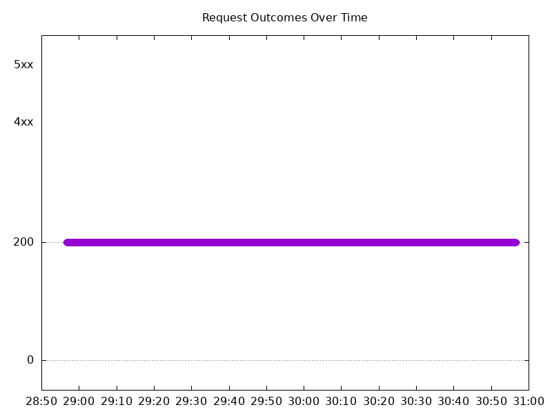
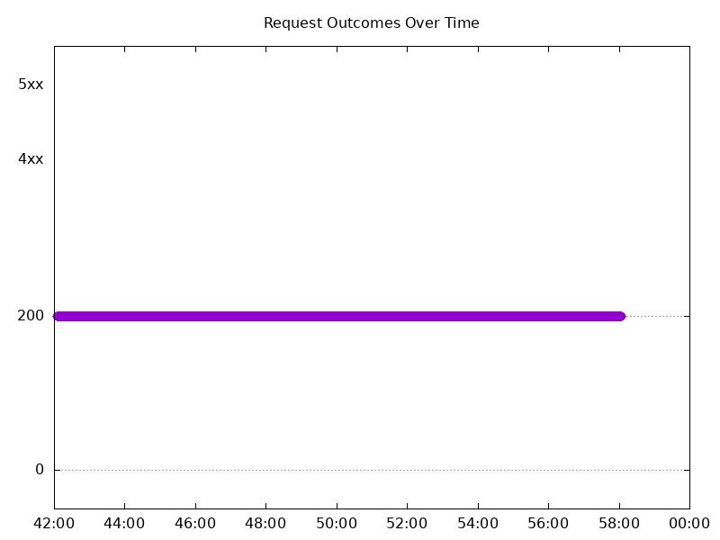

# Results

## Test environment

NGINX Plus: false

NGINX Gateway Fabric:

- Commit: d4376776aecc98294dc881a49cfbfa491773f74d
- Date: 2026-01-15T17:08:16Z
- Dirty: false

GKE Cluster:

- Node count: 12
- k8s version: v1.33.5-gke.2019000
- vCPUs per node: 16
- RAM per node: 65851520Ki
- Max pods per node: 110
- Zone: us-west1-b
- Instance Type: n2d-standard-16

## One NGINX Pod runs per node Test Results

### Scale Up Gradually

#### Test: Send https /tea traffic

```text
Requests      [total, rate, throughput]         30000, 100.00, 100.00
Duration      [total, attack, wait]             5m0s, 5m0s, 930.553µs
Latencies     [min, mean, 50, 90, 95, 99, max]  573.112µs, 1.021ms, 997.165µs, 1.154ms, 1.217ms, 1.694ms, 13.888ms
Bytes In      [total, mean]                     4596152, 153.21
Bytes Out     [total, mean]                     0, 0.00
Success       [ratio]                           100.00%
Status Codes  [code:count]                      200:30000  
Error Set:
```


#### Test: Send http /coffee traffic

```text
Requests      [total, rate, throughput]         30000, 100.00, 100.00
Duration      [total, attack, wait]             5m0s, 5m0s, 819.385µs
Latencies     [min, mean, 50, 90, 95, 99, max]  534.4µs, 960.006µs, 944.392µs, 1.103ms, 1.162ms, 1.636ms, 13.514ms
Bytes In      [total, mean]                     4775992, 159.20
Bytes Out     [total, mean]                     0, 0.00
Success       [ratio]                           100.00%
Status Codes  [code:count]                      200:30000  
Error Set:
```


### Scale Down Gradually

#### Test: Send http /coffee traffic

```text
Requests      [total, rate, throughput]         48000, 100.00, 100.00
Duration      [total, attack, wait]             8m0s, 8m0s, 695.968µs
Latencies     [min, mean, 50, 90, 95, 99, max]  572.694µs, 976.262µs, 963.235µs, 1.115ms, 1.17ms, 1.594ms, 25.797ms
Bytes In      [total, mean]                     7641493, 159.20
Bytes Out     [total, mean]                     0, 0.00
Success       [ratio]                           100.00%
Status Codes  [code:count]                      200:48000  
Error Set:
```


#### Test: Send https /tea traffic

```text
Requests      [total, rate, throughput]         48000, 100.00, 100.00
Duration      [total, attack, wait]             8m0s, 8m0s, 966.004µs
Latencies     [min, mean, 50, 90, 95, 99, max]  609.078µs, 1.014ms, 993.184µs, 1.144ms, 1.201ms, 1.629ms, 36.263ms
Bytes In      [total, mean]                     7353654, 153.20
Bytes Out     [total, mean]                     0, 0.00
Success       [ratio]                           100.00%
Status Codes  [code:count]                      200:48000  
Error Set:
```


### Scale Up Abruptly

#### Test: Send https /tea traffic

```text
Requests      [total, rate, throughput]         12000, 100.01, 100.01
Duration      [total, attack, wait]             2m0s, 2m0s, 905.403µs
Latencies     [min, mean, 50, 90, 95, 99, max]  555.251µs, 946.866µs, 930.355µs, 1.064ms, 1.109ms, 1.239ms, 17.977ms
Bytes In      [total, mean]                     1838428, 153.20
Bytes Out     [total, mean]                     0, 0.00
Success       [ratio]                           100.00%
Status Codes  [code:count]                      200:12000  
Error Set:
```



#### Test: Send http /coffee traffic

```text
Requests      [total, rate, throughput]         12000, 100.01, 100.01
Duration      [total, attack, wait]             2m0s, 2m0s, 747.111µs
Latencies     [min, mean, 50, 90, 95, 99, max]  560.183µs, 930.022µs, 916.739µs, 1.053ms, 1.095ms, 1.259ms, 59.837ms
Bytes In      [total, mean]                     1910369, 159.20
Bytes Out     [total, mean]                     0, 0.00
Success       [ratio]                           100.00%
Status Codes  [code:count]                      200:12000  
Error Set:
```


### Scale Down Abruptly

#### Test: Send http /coffee traffic

```text
Requests      [total, rate, throughput]         12000, 100.01, 100.01
Duration      [total, attack, wait]             2m0s, 2m0s, 997.703µs
Latencies     [min, mean, 50, 90, 95, 99, max]  547.553µs, 916.683µs, 911.66µs, 1.053ms, 1.096ms, 1.215ms, 26.349ms
Bytes In      [total, mean]                     1910424, 159.20
Bytes Out     [total, mean]                     0, 0.00
Success       [ratio]                           100.00%
Status Codes  [code:count]                      200:12000  
Error Set:
```


#### Test: Send https /tea traffic

```text
Requests      [total, rate, throughput]         12000, 100.01, 100.01
Duration      [total, attack, wait]             2m0s, 2m0s, 824.786µs
Latencies     [min, mean, 50, 90, 95, 99, max]  596.611µs, 965.252µs, 950.494µs, 1.092ms, 1.138ms, 1.281ms, 26.575ms
Bytes In      [total, mean]                     1838388, 153.20
Bytes Out     [total, mean]                     0, 0.00
Success       [ratio]                           100.00%
Status Codes  [code:count]                      200:12000  
Error Set:
```


## Multiple NGINX Pods run per node Test Results

### Scale Up Gradually

#### Test: Send https /tea traffic

```text
Requests      [total, rate, throughput]         30000, 100.00, 100.00
Duration      [total, attack, wait]             5m0s, 5m0s, 1.019ms
Latencies     [min, mean, 50, 90, 95, 99, max]  609.856µs, 1.014ms, 975.68µs, 1.128ms, 1.193ms, 1.852ms, 23.16ms
Bytes In      [total, mean]                     4601909, 153.40
Bytes Out     [total, mean]                     0, 0.00
Success       [ratio]                           100.00%
Status Codes  [code:count]                      200:30000  
Error Set:
```


#### Test: Send http /coffee traffic

```text
Requests      [total, rate, throughput]         30000, 100.00, 100.00
Duration      [total, attack, wait]             5m0s, 5m0s, 892.504µs
Latencies     [min, mean, 50, 90, 95, 99, max]  557.271µs, 969.964µs, 946.234µs, 1.101ms, 1.163ms, 1.813ms, 22.935ms
Bytes In      [total, mean]                     4782075, 159.40
Bytes Out     [total, mean]                     0, 0.00
Success       [ratio]                           100.00%
Status Codes  [code:count]                      200:30000  
Error Set:
```


### Scale Down Gradually

#### Test: Send https /tea traffic

```text
Requests      [total, rate, throughput]         96000, 100.00, 100.00
Duration      [total, attack, wait]             16m0s, 16m0s, 974.51µs
Latencies     [min, mean, 50, 90, 95, 99, max]  586.706µs, 1.021ms, 991.168µs, 1.15ms, 1.206ms, 1.615ms, 90.983ms
Bytes In      [total, mean]                     14726355, 153.40
Bytes Out     [total, mean]                     0, 0.00
Success       [ratio]                           100.00%
Status Codes  [code:count]                      200:96000  
Error Set:
```


#### Test: Send http /coffee traffic

```text
Requests      [total, rate, throughput]         96000, 100.00, 100.00
Duration      [total, attack, wait]             16m0s, 16m0s, 852.804µs
Latencies     [min, mean, 50, 90, 95, 99, max]  542.696µs, 973.518µs, 957.254µs, 1.107ms, 1.158ms, 1.561ms, 82.131ms
Bytes In      [total, mean]                     15302506, 159.40
Bytes Out     [total, mean]                     0, 0.00
Success       [ratio]                           100.00%
Status Codes  [code:count]                      200:96000  
Error Set:
```



### Scale Up Abruptly

#### Test: Send https /tea traffic

```text
Requests      [total, rate, throughput]         12000, 100.01, 100.01
Duration      [total, attack, wait]             2m0s, 2m0s, 993.081µs
Latencies     [min, mean, 50, 90, 95, 99, max]  576.227µs, 1.024ms, 979.073µs, 1.13ms, 1.182ms, 1.584ms, 109.134ms
Bytes In      [total, mean]                     1840895, 153.41
Bytes Out     [total, mean]                     0, 0.00
Success       [ratio]                           100.00%
Status Codes  [code:count]                      200:12000  
Error Set:
```


#### Test: Send http /coffee traffic

```text
Requests      [total, rate, throughput]         12000, 100.01, 100.01
Duration      [total, attack, wait]             2m0s, 2m0s, 882.777µs
Latencies     [min, mean, 50, 90, 95, 99, max]  575.787µs, 968.726µs, 946.408µs, 1.095ms, 1.145ms, 1.438ms, 109.564ms
Bytes In      [total, mean]                     1912928, 159.41
Bytes Out     [total, mean]                     0, 0.00
Success       [ratio]                           100.00%
Status Codes  [code:count]                      200:12000  
Error Set:
```


### Scale Down Abruptly

#### Test: Send https /tea traffic

```text
Requests      [total, rate, throughput]         12000, 100.01, 100.01
Duration      [total, attack, wait]             2m0s, 2m0s, 1.019ms
Latencies     [min, mean, 50, 90, 95, 99, max]  600.985µs, 974.455µs, 964.488µs, 1.094ms, 1.138ms, 1.274ms, 13.229ms
Bytes In      [total, mean]                     1840723, 153.39
Bytes Out     [total, mean]                     0, 0.00
Success       [ratio]                           100.00%
Status Codes  [code:count]                      200:12000  
Error Set:
```


#### Test: Send http /coffee traffic

```text
Requests      [total, rate, throughput]         12000, 100.01, 100.01
Duration      [total, attack, wait]             2m0s, 2m0s, 977.994µs
Latencies     [min, mean, 50, 90, 95, 99, max]  561.731µs, 926.852µs, 922.804µs, 1.068ms, 1.115ms, 1.275ms, 3.039ms
Bytes In      [total, mean]                     1912912, 159.41
Bytes Out     [total, mean]                     0, 0.00
Success       [ratio]                           100.00%
Status Codes  [code:count]                      200:12000  
Error Set:
```


