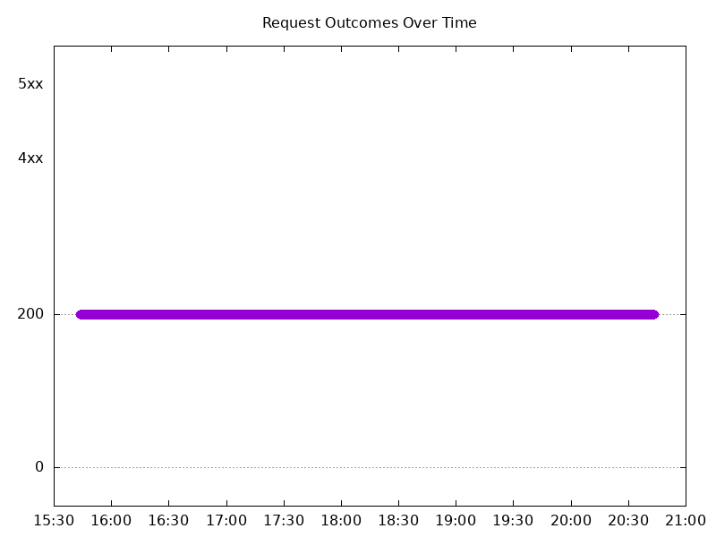
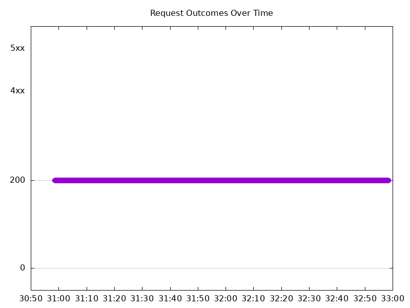
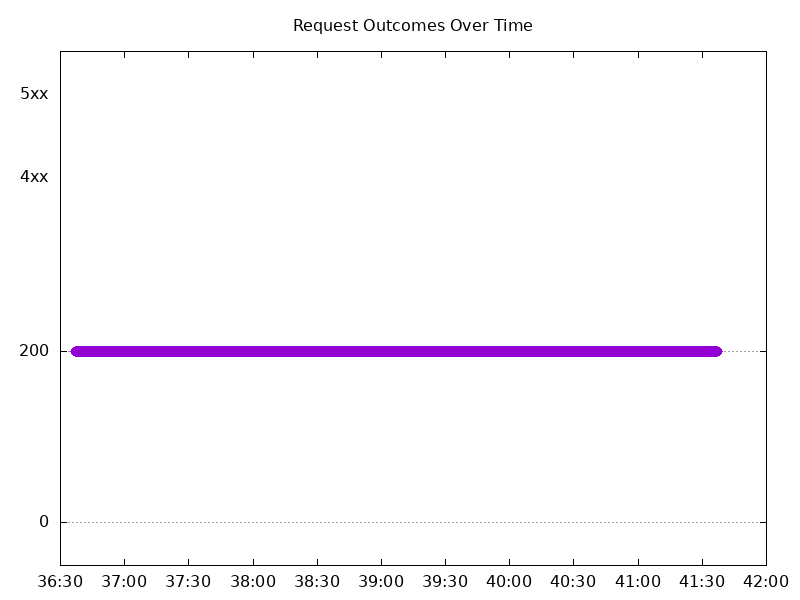
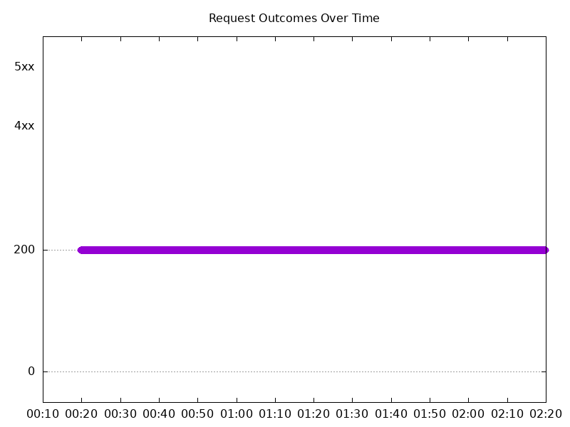

# Results

## Test environment

NGINX Plus: false

NGINX Gateway Fabric:

- Commit: e8ee7c1c4f14e249927a5447a1af2615ddbe0f87
- Date: 2025-12-17T20:04:03Z
- Dirty: false

GKE Cluster:

- Node count: 12
- k8s version: v1.33.5-gke.1308000
- vCPUs per node: 16
- RAM per node: 65851520Ki
- Max pods per node: 110
- Zone: us-west1-b
- Instance Type: n2d-standard-16

## One NGINX Pod runs per node Test Results

### Scale Up Gradually

#### Test: Send http /coffee traffic

```text
Requests      [total, rate, throughput]         30000, 100.00, 100.00
Duration      [total, attack, wait]             5m0s, 5m0s, 1.276ms
Latencies     [min, mean, 50, 90, 95, 99, max]  579.496µs, 1.097ms, 1.09ms, 1.273ms, 1.34ms, 1.659ms, 12.568ms
Bytes In      [total, mean]                     4775950, 159.20
Bytes Out     [total, mean]                     0, 0.00
Success       [ratio]                           100.00%
Status Codes  [code:count]                      200:30000  
Error Set:
```


#### Test: Send https /tea traffic

```text
Requests      [total, rate, throughput]         30000, 100.00, 100.00
Duration      [total, attack, wait]             5m0s, 5m0s, 844.832µs
Latencies     [min, mean, 50, 90, 95, 99, max]  638.678µs, 1.149ms, 1.132ms, 1.328ms, 1.406ms, 1.711ms, 12.698ms
Bytes In      [total, mean]                     4595998, 153.20
Bytes Out     [total, mean]                     0, 0.00
Success       [ratio]                           100.00%
Status Codes  [code:count]                      200:30000  
Error Set:
```



### Scale Down Gradually

#### Test: Send http /coffee traffic

```text
Requests      [total, rate, throughput]         48000, 100.00, 100.00
Duration      [total, attack, wait]             8m0s, 8m0s, 992.251µs
Latencies     [min, mean, 50, 90, 95, 99, max]  605.751µs, 1.095ms, 1.087ms, 1.266ms, 1.33ms, 1.649ms, 35.756ms
Bytes In      [total, mean]                     7641744, 159.20
Bytes Out     [total, mean]                     0, 0.00
Success       [ratio]                           100.00%
Status Codes  [code:count]                      200:48000  
Error Set:
```


#### Test: Send https /tea traffic

```text
Requests      [total, rate, throughput]         48000, 100.00, 100.00
Duration      [total, attack, wait]             8m0s, 8m0s, 1.094ms
Latencies     [min, mean, 50, 90, 95, 99, max]  635.67µs, 1.129ms, 1.119ms, 1.286ms, 1.347ms, 1.644ms, 39.933ms
Bytes In      [total, mean]                     7353675, 153.20
Bytes Out     [total, mean]                     0, 0.00
Success       [ratio]                           100.00%
Status Codes  [code:count]                      200:48000  
Error Set:
```


### Scale Up Abruptly

#### Test: Send https /tea traffic

```text
Requests      [total, rate, throughput]         12000, 100.01, 100.01
Duration      [total, attack, wait]             2m0s, 2m0s, 1.095ms
Latencies     [min, mean, 50, 90, 95, 99, max]  665.483µs, 1.139ms, 1.126ms, 1.291ms, 1.349ms, 1.604ms, 71.335ms
Bytes In      [total, mean]                     1838431, 153.20
Bytes Out     [total, mean]                     0, 0.00
Success       [ratio]                           100.00%
Status Codes  [code:count]                      200:12000  
Error Set:
```


#### Test: Send http /coffee traffic

```text
Requests      [total, rate, throughput]         12000, 100.01, 100.01
Duration      [total, attack, wait]             2m0s, 2m0s, 1.205ms
Latencies     [min, mean, 50, 90, 95, 99, max]  611.799µs, 1.121ms, 1.108ms, 1.284ms, 1.345ms, 1.606ms, 67.501ms
Bytes In      [total, mean]                     1910320, 159.19
Bytes Out     [total, mean]                     0, 0.00
Success       [ratio]                           100.00%
Status Codes  [code:count]                      200:12000  
Error Set:
```


### Scale Down Abruptly

#### Test: Send https /tea traffic

```text
Requests      [total, rate, throughput]         12000, 100.01, 100.01
Duration      [total, attack, wait]             2m0s, 2m0s, 1.341ms
Latencies     [min, mean, 50, 90, 95, 99, max]  657.926µs, 1.172ms, 1.151ms, 1.391ms, 1.474ms, 1.676ms, 25.128ms
Bytes In      [total, mean]                     1838334, 153.19
Bytes Out     [total, mean]                     0, 0.00
Success       [ratio]                           100.00%
Status Codes  [code:count]                      200:12000  
Error Set:
```



#### Test: Send http /coffee traffic

```text
Requests      [total, rate, throughput]         12000, 100.01, 100.01
Duration      [total, attack, wait]             2m0s, 2m0s, 1.836ms
Latencies     [min, mean, 50, 90, 95, 99, max]  626.192µs, 1.135ms, 1.115ms, 1.317ms, 1.407ms, 1.608ms, 25.119ms
Bytes In      [total, mean]                     1910374, 159.20
Bytes Out     [total, mean]                     0, 0.00
Success       [ratio]                           100.00%
Status Codes  [code:count]                      200:12000  
Error Set:
```


## Multiple NGINX Pods run per node Test Results

### Scale Up Gradually

#### Test: Send http /coffee traffic

```text
Requests      [total, rate, throughput]         30000, 100.00, 100.00
Duration      [total, attack, wait]             5m0s, 5m0s, 1.069ms
Latencies     [min, mean, 50, 90, 95, 99, max]  587.088µs, 1.125ms, 1.109ms, 1.295ms, 1.368ms, 1.842ms, 20.689ms
Bytes In      [total, mean]                     4775932, 159.20
Bytes Out     [total, mean]                     0, 0.00
Success       [ratio]                           100.00%
Status Codes  [code:count]                      200:30000  
Error Set:
```


#### Test: Send https /tea traffic

```text
Requests      [total, rate, throughput]         30000, 100.00, 100.00
Duration      [total, attack, wait]             5m0s, 5m0s, 1.169ms
Latencies     [min, mean, 50, 90, 95, 99, max]  638.064µs, 1.176ms, 1.144ms, 1.335ms, 1.415ms, 1.859ms, 25.239ms
Bytes In      [total, mean]                     4607945, 153.60
Bytes Out     [total, mean]                     0, 0.00
Success       [ratio]                           100.00%
Status Codes  [code:count]                      200:30000  
Error Set:
```



### Scale Down Gradually

#### Test: Send https /tea traffic

```text
Requests      [total, rate, throughput]         96000, 100.00, 100.00
Duration      [total, attack, wait]             16m0s, 16m0s, 1.252ms
Latencies     [min, mean, 50, 90, 95, 99, max]  643.315µs, 1.176ms, 1.158ms, 1.345ms, 1.414ms, 1.724ms, 51.3ms
Bytes In      [total, mean]                     14745874, 153.60
Bytes Out     [total, mean]                     0, 0.00
Success       [ratio]                           100.00%
Status Codes  [code:count]                      200:96000  
Error Set:
```


#### Test: Send http /coffee traffic

```text
Requests      [total, rate, throughput]         96000, 100.00, 100.00
Duration      [total, attack, wait]             16m0s, 16m0s, 1.275ms
Latencies     [min, mean, 50, 90, 95, 99, max]  584.197µs, 1.118ms, 1.109ms, 1.294ms, 1.356ms, 1.657ms, 50.674ms
Bytes In      [total, mean]                     15283349, 159.20
Bytes Out     [total, mean]                     0, 0.00
Success       [ratio]                           100.00%
Status Codes  [code:count]                      200:96000  
Error Set:
```


### Scale Up Abruptly

#### Test: Send http /coffee traffic

```text
Requests      [total, rate, throughput]         12000, 100.01, 100.01
Duration      [total, attack, wait]             2m0s, 2m0s, 1.027ms
Latencies     [min, mean, 50, 90, 95, 99, max]  609.1µs, 1.123ms, 1.102ms, 1.269ms, 1.324ms, 1.575ms, 34.303ms
Bytes In      [total, mean]                     1910331, 159.19
Bytes Out     [total, mean]                     0, 0.00
Success       [ratio]                           100.00%
Status Codes  [code:count]                      200:12000  
Error Set:
```


#### Test: Send https /tea traffic

```text
Requests      [total, rate, throughput]         12000, 100.01, 100.01
Duration      [total, attack, wait]             2m0s, 2m0s, 1.144ms
Latencies     [min, mean, 50, 90, 95, 99, max]  666.159µs, 1.185ms, 1.145ms, 1.297ms, 1.351ms, 1.615ms, 116.22ms
Bytes In      [total, mean]                     1843150, 153.60
Bytes Out     [total, mean]                     0, 0.00
Success       [ratio]                           100.00%
Status Codes  [code:count]                      200:12000  
Error Set:
```


### Scale Down Abruptly

#### Test: Send http /coffee traffic

```text
Requests      [total, rate, throughput]         12000, 100.01, 100.01
Duration      [total, attack, wait]             2m0s, 2m0s, 1.315ms
Latencies     [min, mean, 50, 90, 95, 99, max]  629.078µs, 1.125ms, 1.124ms, 1.291ms, 1.343ms, 1.489ms, 50.904ms
Bytes In      [total, mean]                     1910392, 159.20
Bytes Out     [total, mean]                     0, 0.00
Success       [ratio]                           100.00%
Status Codes  [code:count]                      200:12000  
Error Set:
```


#### Test: Send https /tea traffic

```text
Requests      [total, rate, throughput]         12000, 100.01, 100.01
Duration      [total, attack, wait]             2m0s, 2m0s, 1.225ms
Latencies     [min, mean, 50, 90, 95, 99, max]  662.789µs, 1.165ms, 1.157ms, 1.32ms, 1.372ms, 1.569ms, 55.654ms
Bytes In      [total, mean]                     1843133, 153.59
Bytes Out     [total, mean]                     0, 0.00
Success       [ratio]                           100.00%
Status Codes  [code:count]                      200:12000  
Error Set:
```


