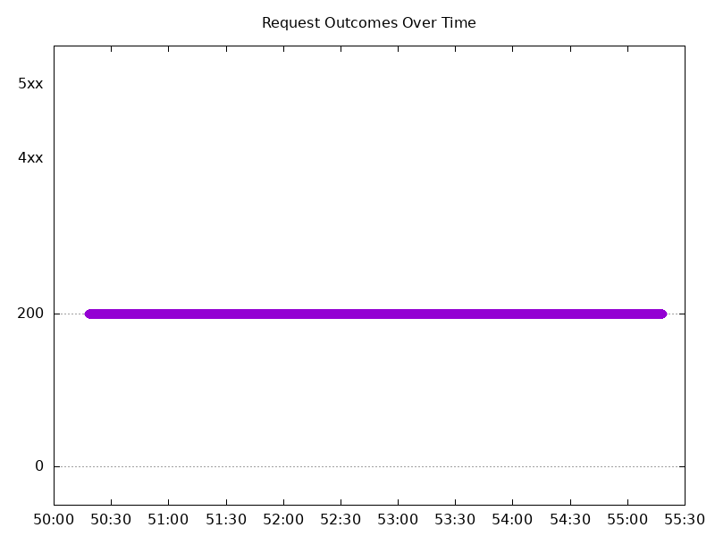
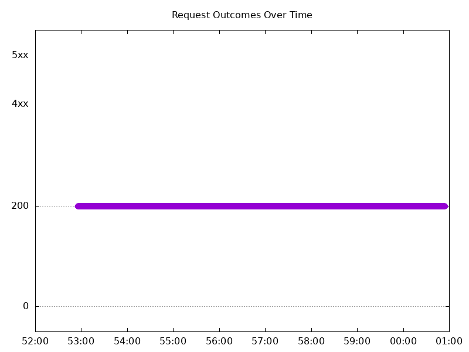
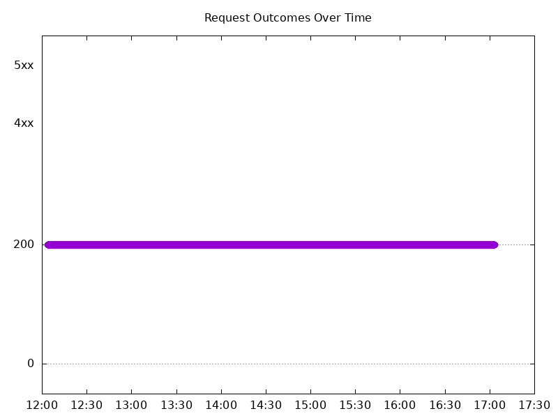
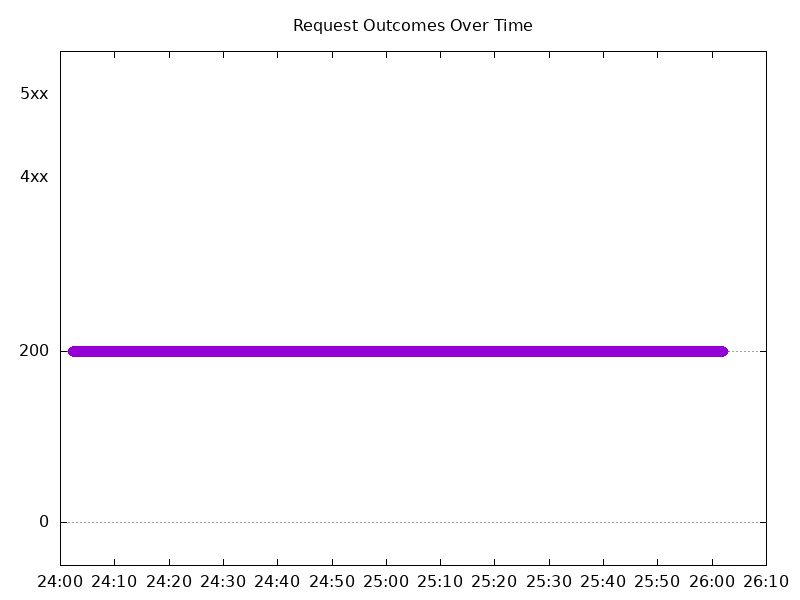

# Results

## Test environment

NGINX Plus: true

NGINX Gateway Fabric:

- Commit: 17c42c8bbbb004ba9c0e9b867396c5f8937207cd
- Date: 2026-04-01T18:33:47Z
- Dirty: false

GKE Cluster:

- Node count: 12
- k8s version: v1.35.1-gke.1396002
- vCPUs per node: 16
- RAM per node: 64305Mi
- Max pods per node: 110
- Zone: us-west1-b
- Instance Type: n2d-standard-16

## One NGINX Pod runs per node Test Results

### Scale Up Gradually

#### Test: Send http /coffee traffic

```text
Requests      [total, rate, throughput]         30000, 100.00, 100.00
Duration      [total, attack, wait]             5m0s, 5m0s, 1.015ms
Latencies     [min, mean, 50, 90, 95, 99, max]  587.215µs, 972.943µs, 958.984µs, 1.094ms, 1.139ms, 1.552ms, 24.74ms
Bytes In      [total, mean]                     4805842, 160.19
Bytes Out     [total, mean]                     0, 0.00
Success       [ratio]                           100.00%
Status Codes  [code:count]                      200:30000  
Error Set:
```


#### Test: Send https /tea traffic

```text
Requests      [total, rate, throughput]         30000, 100.00, 100.00
Duration      [total, attack, wait]             5m0s, 5m0s, 1.149ms
Latencies     [min, mean, 50, 90, 95, 99, max]  629.411µs, 1.025ms, 1.008ms, 1.136ms, 1.183ms, 1.611ms, 19.634ms
Bytes In      [total, mean]                     4626045, 154.20
Bytes Out     [total, mean]                     0, 0.00
Success       [ratio]                           100.00%
Status Codes  [code:count]                      200:30000  
Error Set:
```



### Scale Down Gradually

#### Test: Send http /coffee traffic

```text
Requests      [total, rate, throughput]         48000, 100.00, 100.00
Duration      [total, attack, wait]             8m0s, 8m0s, 1.439ms
Latencies     [min, mean, 50, 90, 95, 99, max]  209.521µs, 1.24ms, 1.033ms, 1.402ms, 1.501ms, 1.781ms, 292.883ms
Bytes In      [total, mean]                     7688979, 160.19
Bytes Out     [total, mean]                     0, 0.00
Success       [ratio]                           99.99%
Status Codes  [code:count]                      0:3  200:47997  
Error Set:
Get "http://cafe.example.com/coffee": dial tcp 0.0.0.0:0->10.138.0.19:80: connect: network is unreachable
```



#### Test: Send https /tea traffic

```text
Requests      [total, rate, throughput]         48000, 100.00, 100.00
Duration      [total, attack, wait]             8m0s, 8m0s, 1.313ms
Latencies     [min, mean, 50, 90, 95, 99, max]  285.593µs, 1.358ms, 1.085ms, 1.428ms, 1.522ms, 1.821ms, 309.394ms
Bytes In      [total, mean]                     7401420, 154.20
Bytes Out     [total, mean]                     0, 0.00
Success       [ratio]                           100.00%
Status Codes  [code:count]                      0:2  200:47998  
Error Set:
Get "https://cafe.example.com/tea": dial tcp 0.0.0.0:0->10.138.0.19:443: connect: network is unreachable
```


### Scale Up Abruptly

#### Test: Send https /tea traffic

```text
Requests      [total, rate, throughput]         12000, 100.01, 100.01
Duration      [total, attack, wait]             2m0s, 2m0s, 1.025ms
Latencies     [min, mean, 50, 90, 95, 99, max]  705.515µs, 1.121ms, 1.078ms, 1.277ms, 1.388ms, 1.695ms, 67.969ms
Bytes In      [total, mean]                     1850328, 154.19
Bytes Out     [total, mean]                     0, 0.00
Success       [ratio]                           100.00%
Status Codes  [code:count]                      200:12000  
Error Set:
```


#### Test: Send http /coffee traffic

```text
Requests      [total, rate, throughput]         12000, 100.01, 100.01
Duration      [total, attack, wait]             2m0s, 2m0s, 1.14ms
Latencies     [min, mean, 50, 90, 95, 99, max]  703.084µs, 1.09ms, 1.058ms, 1.259ms, 1.392ms, 1.724ms, 15.431ms
Bytes In      [total, mean]                     1922359, 160.20
Bytes Out     [total, mean]                     0, 0.00
Success       [ratio]                           100.00%
Status Codes  [code:count]                      200:12000  
Error Set:
```


### Scale Down Abruptly

#### Test: Send https /tea traffic

```text
Requests      [total, rate, throughput]         12000, 100.01, 100.01
Duration      [total, attack, wait]             2m0s, 2m0s, 1.25ms
Latencies     [min, mean, 50, 90, 95, 99, max]  731.007µs, 1.094ms, 1.084ms, 1.207ms, 1.248ms, 1.359ms, 11.516ms
Bytes In      [total, mean]                     1850370, 154.20
Bytes Out     [total, mean]                     0, 0.00
Success       [ratio]                           100.00%
Status Codes  [code:count]                      200:12000  
Error Set:
```


#### Test: Send http /coffee traffic

```text
Requests      [total, rate, throughput]         12000, 100.01, 100.01
Duration      [total, attack, wait]             2m0s, 2m0s, 1.053ms
Latencies     [min, mean, 50, 90, 95, 99, max]  687.738µs, 1.031ms, 1.026ms, 1.152ms, 1.19ms, 1.294ms, 4.2ms
Bytes In      [total, mean]                     1922353, 160.20
Bytes Out     [total, mean]                     0, 0.00
Success       [ratio]                           100.00%
Status Codes  [code:count]                      200:12000  
Error Set:
```


## Multiple NGINX Pods run per node Test Results

### Scale Up Gradually

#### Test: Send http /coffee traffic

```text
Requests      [total, rate, throughput]         30000, 100.00, 100.00
Duration      [total, attack, wait]             5m0s, 5m0s, 884.308µs
Latencies     [min, mean, 50, 90, 95, 99, max]  633.821µs, 1.055ms, 1.039ms, 1.186ms, 1.239ms, 1.725ms, 18.536ms
Bytes In      [total, mean]                     4809113, 160.30
Bytes Out     [total, mean]                     0, 0.00
Success       [ratio]                           100.00%
Status Codes  [code:count]                      200:30000  
Error Set:
```



#### Test: Send https /tea traffic

```text
Requests      [total, rate, throughput]         30000, 100.00, 100.00
Duration      [total, attack, wait]             5m0s, 5m0s, 1.134ms
Latencies     [min, mean, 50, 90, 95, 99, max]  700.248µs, 1.114ms, 1.095ms, 1.237ms, 1.287ms, 1.724ms, 19.027ms
Bytes In      [total, mean]                     4631917, 154.40
Bytes Out     [total, mean]                     0, 0.00
Success       [ratio]                           100.00%
Status Codes  [code:count]                      200:30000  
Error Set:
```


### Scale Down Gradually

#### Test: Send http /coffee traffic

```text
Requests      [total, rate, throughput]         96000, 100.00, 100.00
Duration      [total, attack, wait]             16m0s, 16m0s, 1.041ms
Latencies     [min, mean, 50, 90, 95, 99, max]  641.797µs, 1.086ms, 1.058ms, 1.208ms, 1.259ms, 1.621ms, 158.755ms
Bytes In      [total, mean]                     15388749, 160.30
Bytes Out     [total, mean]                     0, 0.00
Success       [ratio]                           100.00%
Status Codes  [code:count]                      200:96000  
Error Set:
```


#### Test: Send https /tea traffic

```text
Requests      [total, rate, throughput]         96000, 100.00, 100.00
Duration      [total, attack, wait]             16m0s, 16m0s, 1.021ms
Latencies     [min, mean, 50, 90, 95, 99, max]  719.292µs, 1.151ms, 1.111ms, 1.261ms, 1.316ms, 1.65ms, 176.785ms
Bytes In      [total, mean]                     14822703, 154.40
Bytes Out     [total, mean]                     0, 0.00
Success       [ratio]                           100.00%
Status Codes  [code:count]                      200:96000  
Error Set:
```


### Scale Up Abruptly

#### Test: Send http /coffee traffic

```text
Requests      [total, rate, throughput]         12000, 100.01, 83.34
Duration      [total, attack, wait]             2m0s, 2m0s, 963.902µs
Latencies     [min, mean, 50, 90, 95, 99, max]  549.93µs, 978.982µs, 998µs, 1.153ms, 1.199ms, 1.4ms, 6.505ms
Bytes In      [total, mean]                     1902988, 158.58
Bytes Out     [total, mean]                     0, 0.00
Success       [ratio]                           83.33%
Status Codes  [code:count]                      200:10000  502:2000  
Error Set:
502 Bad Gateway
```


#### Test: Send https /tea traffic

```text
Requests      [total, rate, throughput]         12000, 100.01, 100.01
Duration      [total, attack, wait]             2m0s, 2m0s, 1.118ms
Latencies     [min, mean, 50, 90, 95, 99, max]  702.143µs, 1.083ms, 1.065ms, 1.212ms, 1.266ms, 1.679ms, 11.184ms
Bytes In      [total, mean]                     1852741, 154.40
Bytes Out     [total, mean]                     0, 0.00
Success       [ratio]                           100.00%
Status Codes  [code:count]                      200:12000  
Error Set:
```


### Scale Down Abruptly

#### Test: Send http /coffee traffic

```text
Requests      [total, rate, throughput]         12000, 100.01, 92.30
Duration      [total, attack, wait]             2m0s, 2m0s, 1.042ms
Latencies     [min, mean, 50, 90, 95, 99, max]  559.71µs, 1.026ms, 1.017ms, 1.17ms, 1.229ms, 1.417ms, 89.484ms
Bytes In      [total, mean]                     1914051, 159.50
Bytes Out     [total, mean]                     0, 0.00
Success       [ratio]                           92.29%
Status Codes  [code:count]                      200:11075  502:925  
Error Set:
502 Bad Gateway
```



#### Test: Send https /tea traffic

```text
Requests      [total, rate, throughput]         12000, 100.01, 100.01
Duration      [total, attack, wait]             2m0s, 2m0s, 1.045ms
Latencies     [min, mean, 50, 90, 95, 99, max]  725.516µs, 1.102ms, 1.071ms, 1.217ms, 1.278ms, 1.463ms, 89.717ms
Bytes In      [total, mean]                     1852678, 154.39
Bytes Out     [total, mean]                     0, 0.00
Success       [ratio]                           100.00%
Status Codes  [code:count]                      200:12000  
Error Set:
```


