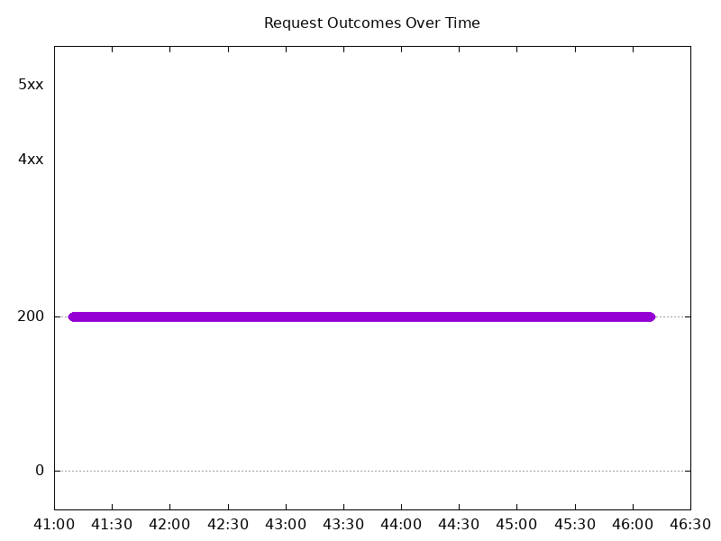
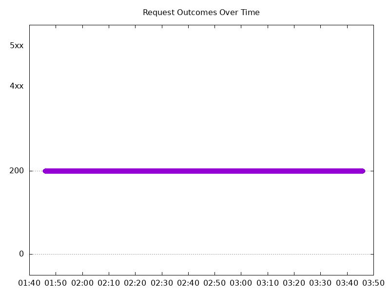
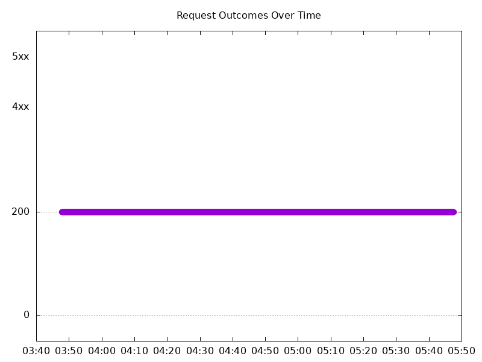
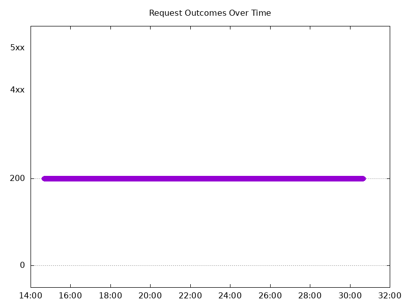
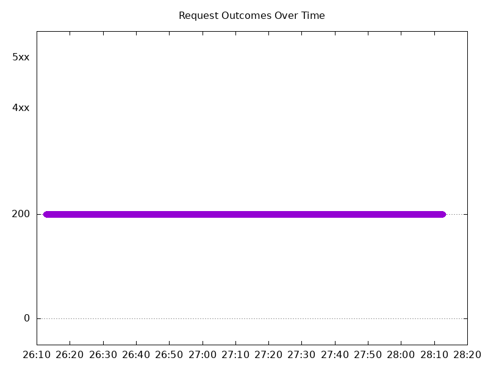

# Results

## Test environment

NGINX Plus: true

NGINX Gateway Fabric:

- Commit: fef4f734728239e3248cda180e74f72e436b06b9
- Date: 2026-08-14T15:07:13Z
- Dirty: false

GKE Cluster:

- Node count: 12
- k8s version: v1.35.6-gke.1258000
- vCPUs per node: 16
- RAM per node: 65848296Ki
- Max pods per node: 110
- Zone: us-west1-b
- Instance Type: n2d-standard-16

## One NGINX Pod runs per node Test Results

### Scale Up Gradually

#### Test: Send https /tea traffic

```text
Requests      [total, rate, throughput]         30000, 100.00, 100.00
Duration      [total, attack, wait]             5m0s, 5m0s, 1.472ms
Latencies     [min, mean, 50, 90, 95, 99, max]  730.343µs, 1.397ms, 1.34ms, 1.686ms, 1.805ms, 2.217ms, 44.65ms
Bytes In      [total, mean]                     4655982, 155.20
Bytes Out     [total, mean]                     0, 0.00
Success       [ratio]                           100.00%
Status Codes  [code:count]                      200:30000  
Error Set:
```



#### Test: Send http /coffee traffic

```text
Requests      [total, rate, throughput]         30000, 100.00, 100.00
Duration      [total, attack, wait]             5m0s, 5m0s, 1.508ms
Latencies     [min, mean, 50, 90, 95, 99, max]  704.968µs, 1.38ms, 1.329ms, 1.677ms, 1.803ms, 2.268ms, 37.371ms
Bytes In      [total, mean]                     4836005, 161.20
Bytes Out     [total, mean]                     0, 0.00
Success       [ratio]                           100.00%
Status Codes  [code:count]                      200:30000  
Error Set:
```


### Scale Down Gradually

#### Test: Send https /tea traffic

```text
Requests      [total, rate, throughput]         48000, 100.00, 100.00
Duration      [total, attack, wait]             8m0s, 8m0s, 1.533ms
Latencies     [min, mean, 50, 90, 95, 99, max]  717.054µs, 1.369ms, 1.349ms, 1.58ms, 1.661ms, 2.007ms, 43.16ms
Bytes In      [total, mean]                     7449496, 155.20
Bytes Out     [total, mean]                     0, 0.00
Success       [ratio]                           100.00%
Status Codes  [code:count]                      200:48000  
Error Set:
```


#### Test: Send http /coffee traffic

```text
Requests      [total, rate, throughput]         48000, 100.00, 100.00
Duration      [total, attack, wait]             8m0s, 8m0s, 1.45ms
Latencies     [min, mean, 50, 90, 95, 99, max]  581.245µs, 1.325ms, 1.313ms, 1.536ms, 1.618ms, 1.943ms, 42.715ms
Bytes In      [total, mean]                     7737663, 161.20
Bytes Out     [total, mean]                     0, 0.00
Success       [ratio]                           100.00%
Status Codes  [code:count]                      200:48000  
Error Set:
```


### Scale Up Abruptly

#### Test: Send http /coffee traffic

```text
Requests      [total, rate, throughput]         12000, 100.01, 100.01
Duration      [total, attack, wait]             2m0s, 2m0s, 1.327ms
Latencies     [min, mean, 50, 90, 95, 99, max]  720.784µs, 1.347ms, 1.326ms, 1.599ms, 1.701ms, 2.052ms, 4.046ms
Bytes In      [total, mean]                     1934399, 161.20
Bytes Out     [total, mean]                     0, 0.00
Success       [ratio]                           100.00%
Status Codes  [code:count]                      200:12000  
Error Set:
```



#### Test: Send https /tea traffic

```text
Requests      [total, rate, throughput]         12000, 100.01, 100.01
Duration      [total, attack, wait]             2m0s, 2m0s, 1.279ms
Latencies     [min, mean, 50, 90, 95, 99, max]  757.566µs, 1.393ms, 1.366ms, 1.623ms, 1.737ms, 2.148ms, 14.878ms
Bytes In      [total, mean]                     1862359, 155.20
Bytes Out     [total, mean]                     0, 0.00
Success       [ratio]                           100.00%
Status Codes  [code:count]                      200:12000  
Error Set:
```


### Scale Down Abruptly

#### Test: Send http /coffee traffic

```text
Requests      [total, rate, throughput]         12000, 100.01, 100.01
Duration      [total, attack, wait]             2m0s, 2m0s, 1.423ms
Latencies     [min, mean, 50, 90, 95, 99, max]  736.923µs, 1.324ms, 1.297ms, 1.514ms, 1.585ms, 1.826ms, 84.127ms
Bytes In      [total, mean]                     1934380, 161.20
Bytes Out     [total, mean]                     0, 0.00
Success       [ratio]                           100.00%
Status Codes  [code:count]                      200:12000  
Error Set:
```



#### Test: Send https /tea traffic

```text
Requests      [total, rate, throughput]         12000, 100.01, 100.01
Duration      [total, attack, wait]             2m0s, 2m0s, 1.439ms
Latencies     [min, mean, 50, 90, 95, 99, max]  789.909µs, 1.431ms, 1.384ms, 1.656ms, 1.766ms, 2.105ms, 94.485ms
Bytes In      [total, mean]                     1862379, 155.20
Bytes Out     [total, mean]                     0, 0.00
Success       [ratio]                           100.00%
Status Codes  [code:count]                      200:12000  
Error Set:
```


## Multiple NGINX Pods run per node Test Results

### Scale Up Gradually

#### Test: Send http /coffee traffic

```text
Requests      [total, rate, throughput]         30000, 100.00, 100.00
Duration      [total, attack, wait]             5m0s, 5m0s, 1.296ms
Latencies     [min, mean, 50, 90, 95, 99, max]  693.572µs, 1.313ms, 1.29ms, 1.551ms, 1.651ms, 2.036ms, 25.77ms
Bytes In      [total, mean]                     4836002, 161.20
Bytes Out     [total, mean]                     0, 0.00
Success       [ratio]                           100.00%
Status Codes  [code:count]                      200:30000  
Error Set:
```


#### Test: Send https /tea traffic

```text
Requests      [total, rate, throughput]         30000, 100.00, 100.00
Duration      [total, attack, wait]             5m0s, 5m0s, 1.43ms
Latencies     [min, mean, 50, 90, 95, 99, max]  712.252µs, 1.364ms, 1.339ms, 1.591ms, 1.689ms, 2.068ms, 18.987ms
Bytes In      [total, mean]                     4655858, 155.20
Bytes Out     [total, mean]                     0, 0.00
Success       [ratio]                           100.00%
Status Codes  [code:count]                      200:30000  
Error Set:
```


### Scale Down Gradually

#### Test: Send http /coffee traffic

```text
Requests      [total, rate, throughput]         96000, 100.00, 100.00
Duration      [total, attack, wait]             16m0s, 16m0s, 1.324ms
Latencies     [min, mean, 50, 90, 95, 99, max]  647.965µs, 1.329ms, 1.316ms, 1.532ms, 1.612ms, 1.97ms, 46.949ms
Bytes In      [total, mean]                     15475317, 161.20
Bytes Out     [total, mean]                     0, 0.00
Success       [ratio]                           100.00%
Status Codes  [code:count]                      200:96000  
Error Set:
```


#### Test: Send https /tea traffic

```text
Requests      [total, rate, throughput]         96000, 100.00, 100.00
Duration      [total, attack, wait]             16m0s, 16m0s, 1.649ms
Latencies     [min, mean, 50, 90, 95, 99, max]  734.177µs, 1.371ms, 1.351ms, 1.569ms, 1.65ms, 1.993ms, 46.935ms
Bytes In      [total, mean]                     14899437, 155.20
Bytes Out     [total, mean]                     0, 0.00
Success       [ratio]                           100.00%
Status Codes  [code:count]                      200:96000  
Error Set:
```



### Scale Up Abruptly

#### Test: Send http /coffee traffic

```text
Requests      [total, rate, throughput]         12000, 100.01, 100.01
Duration      [total, attack, wait]             2m0s, 2m0s, 1.338ms
Latencies     [min, mean, 50, 90, 95, 99, max]  753.706µs, 1.314ms, 1.267ms, 1.466ms, 1.538ms, 1.865ms, 155.66ms
Bytes In      [total, mean]                     1934432, 161.20
Bytes Out     [total, mean]                     0, 0.00
Success       [ratio]                           100.00%
Status Codes  [code:count]                      200:12000  
Error Set:
```


#### Test: Send https /tea traffic

```text
Requests      [total, rate, throughput]         12000, 100.01, 100.01
Duration      [total, attack, wait]             2m0s, 2m0s, 1.338ms
Latencies     [min, mean, 50, 90, 95, 99, max]  756.467µs, 1.366ms, 1.314ms, 1.51ms, 1.58ms, 1.846ms, 158.641ms
Bytes In      [total, mean]                     1862407, 155.20
Bytes Out     [total, mean]                     0, 0.00
Success       [ratio]                           100.00%
Status Codes  [code:count]                      200:12000  
Error Set:
```


### Scale Down Abruptly

#### Test: Send https /tea traffic

```text
Requests      [total, rate, throughput]         12000, 100.01, 100.01
Duration      [total, attack, wait]             2m0s, 2m0s, 1.477ms
Latencies     [min, mean, 50, 90, 95, 99, max]  785.167µs, 1.32ms, 1.311ms, 1.497ms, 1.56ms, 1.735ms, 46.072ms
Bytes In      [total, mean]                     1862409, 155.20
Bytes Out     [total, mean]                     0, 0.00
Success       [ratio]                           100.00%
Status Codes  [code:count]                      200:12000  
Error Set:
```



#### Test: Send http /coffee traffic

```text
Requests      [total, rate, throughput]         12000, 100.01, 100.01
Duration      [total, attack, wait]             2m0s, 2m0s, 1.312ms
Latencies     [min, mean, 50, 90, 95, 99, max]  740.735µs, 1.29ms, 1.283ms, 1.482ms, 1.547ms, 1.755ms, 38.172ms
Bytes In      [total, mean]                     1934439, 161.20
Bytes Out     [total, mean]                     0, 0.00
Success       [ratio]                           100.00%
Status Codes  [code:count]                      200:12000  
Error Set:
```


