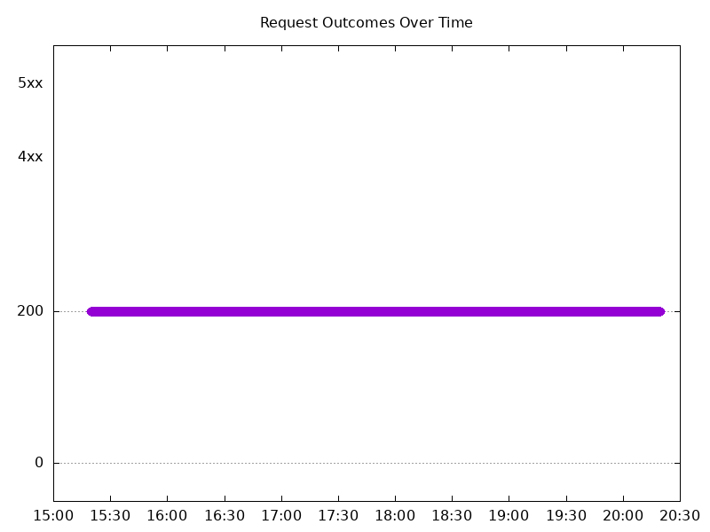
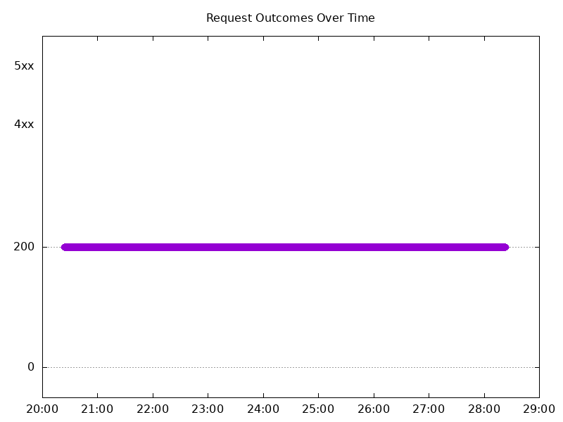
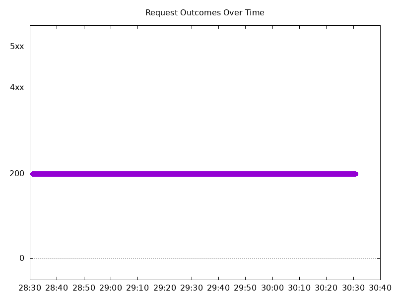
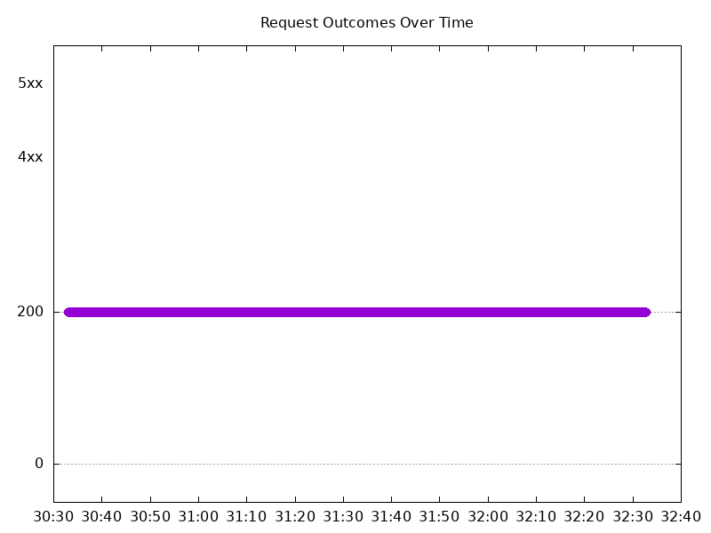
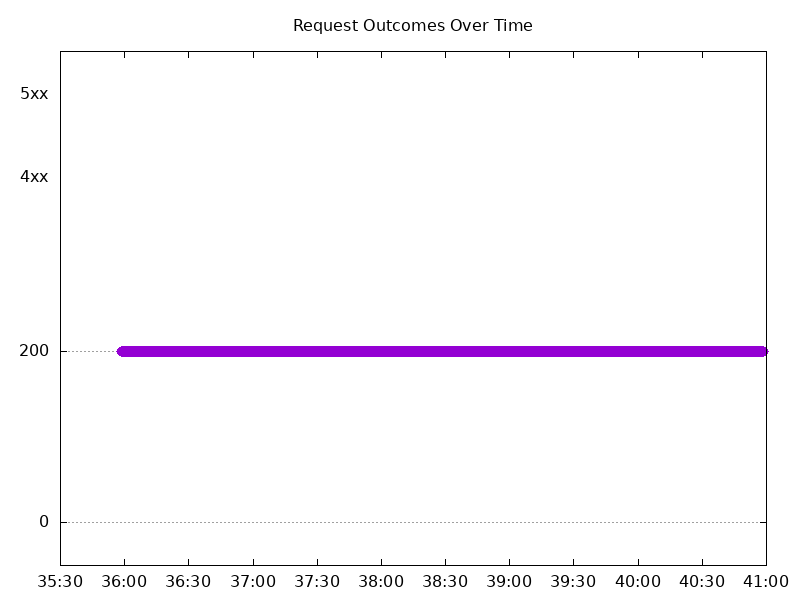
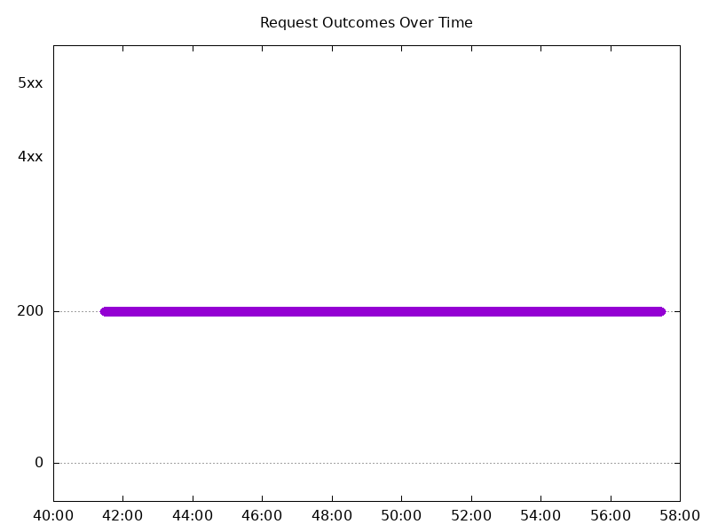
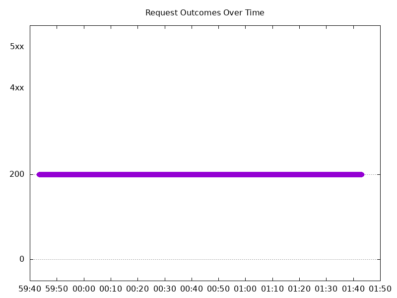

# Results

## Test environment

NGINX Plus: true

NGINX Gateway Fabric:

- Commit: ea67c576e39284e758352dda72242024cc98fa7f
- Date: 2026-10-01T15:28:08Z
- Dirty: false

GKE Cluster:

- Node count: 12
- k8s version: v1.35.8-gke.1225000
- vCPUs per node: 16
- RAM per node: 65848284Ki
- Max pods per node: 110
- Zone: us-west1-b
- Instance Type: n2d-standard-16

## One NGINX Pod runs per node Test Results

### Scale Up Gradually

#### Test: Send http /coffee traffic

```text
Requests      [total, rate, throughput]         30000, 100.00, 100.00
Duration      [total, attack, wait]             5m0s, 5m0s, 1.245ms
Latencies     [min, mean, 50, 90, 95, 99, max]  634.498µs, 1.128ms, 1.097ms, 1.322ms, 1.443ms, 1.929ms, 29.406ms
Bytes In      [total, mean]                     4833099, 161.10
Bytes Out     [total, mean]                     0, 0.00
Success       [ratio]                           100.00%
Status Codes  [code:count]                      200:30000  
Error Set:
```



#### Test: Send https /tea traffic

```text
Requests      [total, rate, throughput]         30000, 100.00, 100.00
Duration      [total, attack, wait]             5m0s, 5m0s, 1.005ms
Latencies     [min, mean, 50, 90, 95, 99, max]  685.764µs, 1.176ms, 1.133ms, 1.378ms, 1.524ms, 2.041ms, 29.221ms
Bytes In      [total, mean]                     4653057, 155.10
Bytes Out     [total, mean]                     0, 0.00
Success       [ratio]                           100.00%
Status Codes  [code:count]                      200:30000  
Error Set:
```


### Scale Down Gradually

#### Test: Send http /coffee traffic

```text
Requests      [total, rate, throughput]         48000, 100.00, 100.00
Duration      [total, attack, wait]             8m0s, 8m0s, 1.077ms
Latencies     [min, mean, 50, 90, 95, 99, max]  616.472µs, 1.144ms, 1.099ms, 1.413ms, 1.57ms, 1.943ms, 44.024ms
Bytes In      [total, mean]                     7732830, 161.10
Bytes Out     [total, mean]                     0, 0.00
Success       [ratio]                           100.00%
Status Codes  [code:count]                      200:48000  
Error Set:
```


#### Test: Send https /tea traffic

```text
Requests      [total, rate, throughput]         48000, 100.00, 100.00
Duration      [total, attack, wait]             8m0s, 8m0s, 1.276ms
Latencies     [min, mean, 50, 90, 95, 99, max]  708.279µs, 1.232ms, 1.182ms, 1.508ms, 1.66ms, 2.057ms, 43.481ms
Bytes In      [total, mean]                     7444886, 155.10
Bytes Out     [total, mean]                     0, 0.00
Success       [ratio]                           100.00%
Status Codes  [code:count]                      200:48000  
Error Set:
```



### Scale Up Abruptly

#### Test: Send https /tea traffic

```text
Requests      [total, rate, throughput]         12000, 100.01, 100.01
Duration      [total, attack, wait]             2m0s, 2m0s, 1.675ms
Latencies     [min, mean, 50, 90, 95, 99, max]  707.232µs, 1.194ms, 1.145ms, 1.368ms, 1.451ms, 1.807ms, 89.062ms
Bytes In      [total, mean]                     1861204, 155.10
Bytes Out     [total, mean]                     0, 0.00
Success       [ratio]                           100.00%
Status Codes  [code:count]                      200:12000  
Error Set:
```


#### Test: Send http /coffee traffic

```text
Requests      [total, rate, throughput]         12000, 100.01, 100.01
Duration      [total, attack, wait]             2m0s, 2m0s, 1.817ms
Latencies     [min, mean, 50, 90, 95, 99, max]  682.815µs, 1.144ms, 1.106ms, 1.334ms, 1.421ms, 1.81ms, 85.416ms
Bytes In      [total, mean]                     1933280, 161.11
Bytes Out     [total, mean]                     0, 0.00
Success       [ratio]                           100.00%
Status Codes  [code:count]                      200:12000  
Error Set:
```



### Scale Down Abruptly

#### Test: Send http /coffee traffic

```text
Requests      [total, rate, throughput]         12000, 100.01, 100.01
Duration      [total, attack, wait]             2m0s, 2m0s, 1.414ms
Latencies     [min, mean, 50, 90, 95, 99, max]  662.651µs, 1.162ms, 1.133ms, 1.405ms, 1.545ms, 1.902ms, 12.964ms
Bytes In      [total, mean]                     1933234, 161.10
Bytes Out     [total, mean]                     0, 0.00
Success       [ratio]                           100.00%
Status Codes  [code:count]                      200:12000  
Error Set:
```


#### Test: Send https /tea traffic

```text
Requests      [total, rate, throughput]         12000, 100.01, 100.01
Duration      [total, attack, wait]             2m0s, 2m0s, 927.604µs
Latencies     [min, mean, 50, 90, 95, 99, max]  731.757µs, 1.212ms, 1.187ms, 1.413ms, 1.5ms, 1.739ms, 22.755ms
Bytes In      [total, mean]                     1861169, 155.10
Bytes Out     [total, mean]                     0, 0.00
Success       [ratio]                           100.00%
Status Codes  [code:count]                      200:12000  
Error Set:
```



## Multiple NGINX Pods run per node Test Results

### Scale Up Gradually

#### Test: Send https /tea traffic

```text
Requests      [total, rate, throughput]         30000, 100.00, 100.00
Duration      [total, attack, wait]             5m0s, 5m0s, 1.169ms
Latencies     [min, mean, 50, 90, 95, 99, max]  675.543µs, 1.135ms, 1.11ms, 1.295ms, 1.364ms, 1.929ms, 35.752ms
Bytes In      [total, mean]                     4653142, 155.10
Bytes Out     [total, mean]                     0, 0.00
Success       [ratio]                           100.00%
Status Codes  [code:count]                      200:30000  
Error Set:
```



#### Test: Send http /coffee traffic

```text
Requests      [total, rate, throughput]         30000, 100.00, 100.00
Duration      [total, attack, wait]             5m0s, 5m0s, 1.472ms
Latencies     [min, mean, 50, 90, 95, 99, max]  612.939µs, 1.059ms, 1.041ms, 1.211ms, 1.272ms, 1.72ms, 20.828ms
Bytes In      [total, mean]                     4832915, 161.10
Bytes Out     [total, mean]                     0, 0.00
Success       [ratio]                           100.00%
Status Codes  [code:count]                      200:30000  
Error Set:
```


### Scale Down Gradually

#### Test: Send https /tea traffic

```text
Requests      [total, rate, throughput]         96000, 100.00, 100.00
Duration      [total, attack, wait]             16m0s, 16m0s, 1.003ms
Latencies     [min, mean, 50, 90, 95, 99, max]  650.48µs, 1.11ms, 1.087ms, 1.241ms, 1.298ms, 1.718ms, 56.328ms
Bytes In      [total, mean]                     14889564, 155.10
Bytes Out     [total, mean]                     0, 0.00
Success       [ratio]                           100.00%
Status Codes  [code:count]                      200:96000  
Error Set:
```


#### Test: Send http /coffee traffic

```text
Requests      [total, rate, throughput]         96000, 100.00, 100.00
Duration      [total, attack, wait]             16m0s, 16m0s, 1.094ms
Latencies     [min, mean, 50, 90, 95, 99, max]  641.963µs, 1.068ms, 1.051ms, 1.212ms, 1.266ms, 1.614ms, 50.963ms
Bytes In      [total, mean]                     15465634, 161.10
Bytes Out     [total, mean]                     0, 0.00
Success       [ratio]                           100.00%
Status Codes  [code:count]                      200:96000  
Error Set:
```



### Scale Up Abruptly

#### Test: Send https /tea traffic

```text
Requests      [total, rate, throughput]         12000, 100.01, 100.01
Duration      [total, attack, wait]             2m0s, 2m0s, 1.109ms
Latencies     [min, mean, 50, 90, 95, 99, max]  699.799µs, 1.144ms, 1.073ms, 1.217ms, 1.263ms, 1.563ms, 135.818ms
Bytes In      [total, mean]                     1861232, 155.10
Bytes Out     [total, mean]                     0, 0.00
Success       [ratio]                           100.00%
Status Codes  [code:count]                      200:12000  
Error Set:
```


#### Test: Send http /coffee traffic

```text
Requests      [total, rate, throughput]         12000, 100.01, 100.01
Duration      [total, attack, wait]             2m0s, 2m0s, 1.185ms
Latencies     [min, mean, 50, 90, 95, 99, max]  653.479µs, 1.069ms, 1.015ms, 1.164ms, 1.212ms, 1.5ms, 137.608ms
Bytes In      [total, mean]                     1933219, 161.10
Bytes Out     [total, mean]                     0, 0.00
Success       [ratio]                           100.00%
Status Codes  [code:count]                      200:12000  
Error Set:
```


### Scale Down Abruptly

#### Test: Send http /coffee traffic

```text
Requests      [total, rate, throughput]         12000, 100.01, 100.01
Duration      [total, attack, wait]             2m0s, 2m0s, 1.148ms
Latencies     [min, mean, 50, 90, 95, 99, max]  613.411µs, 1.082ms, 1.072ms, 1.222ms, 1.272ms, 1.426ms, 57.134ms
Bytes In      [total, mean]                     1933160, 161.10
Bytes Out     [total, mean]                     0, 0.00
Success       [ratio]                           100.00%
Status Codes  [code:count]                      200:12000  
Error Set:
```



#### Test: Send https /tea traffic

```text
Requests      [total, rate, throughput]         12000, 100.01, 100.01
Duration      [total, attack, wait]             2m0s, 2m0s, 1.037ms
Latencies     [min, mean, 50, 90, 95, 99, max]  712.602µs, 1.127ms, 1.108ms, 1.258ms, 1.31ms, 1.468ms, 57.279ms
Bytes In      [total, mean]                     1861160, 155.10
Bytes Out     [total, mean]                     0, 0.00
Success       [ratio]                           100.00%
Status Codes  [code:count]                      200:12000  
Error Set:
```


