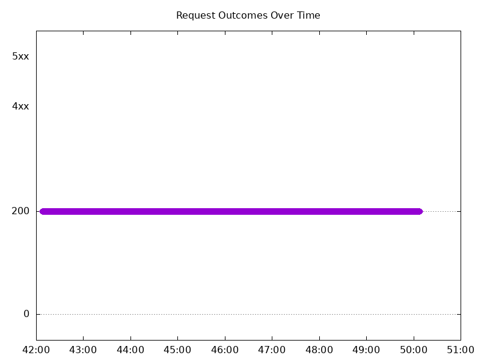
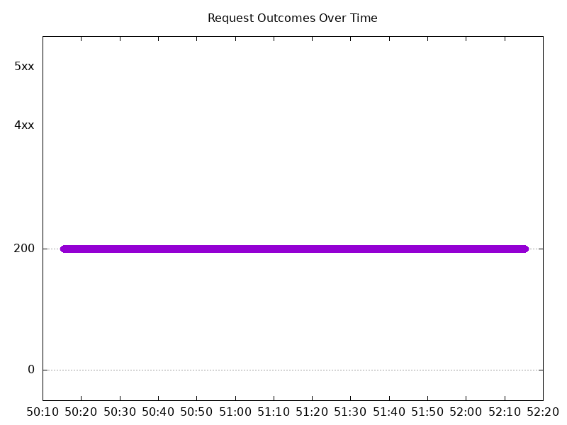
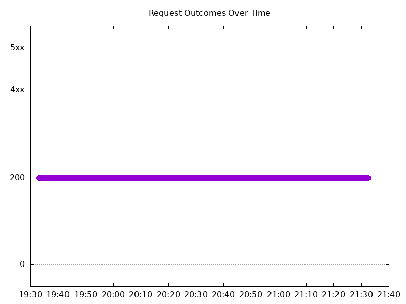
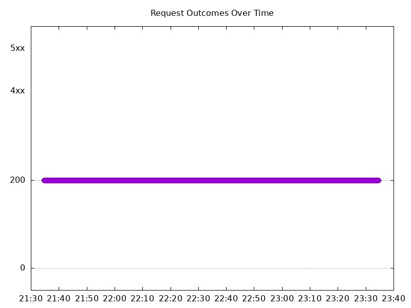

# Results

## Test environment

NGINX Plus: true

NGINX Gateway Fabric:

- Commit: dbebd9791cb7aa5e8d10735800f776fd516b06c3
- Date: 2025-12-02T17:38:16Z
- Dirty: false

GKE Cluster:

- Node count: 12
- k8s version: v1.33.5-gke.1201000
- vCPUs per node: 16
- RAM per node: 65851520Ki
- Max pods per node: 110
- Zone: us-west1-b
- Instance Type: n2d-standard-16

## One NGINX Pod runs per node Test Results

### Scale Up Gradually

#### Test: Send http /coffee traffic

```text
Requests      [total, rate, throughput]         30000, 100.00, 100.00
Duration      [total, attack, wait]             5m0s, 5m0s, 1.093ms
Latencies     [min, mean, 50, 90, 95, 99, max]  668.093µs, 1.213ms, 1.211ms, 1.37ms, 1.428ms, 1.706ms, 16.209ms
Bytes In      [total, mean]                     4806014, 160.20
Bytes Out     [total, mean]                     0, 0.00
Success       [ratio]                           100.00%
Status Codes  [code:count]                      200:30000  
Error Set:
```


#### Test: Send https /tea traffic

```text
Requests      [total, rate, throughput]         30000, 100.00, 100.00
Duration      [total, attack, wait]             5m0s, 5m0s, 1.104ms
Latencies     [min, mean, 50, 90, 95, 99, max]  714.896µs, 1.252ms, 1.248ms, 1.411ms, 1.469ms, 1.758ms, 16.543ms
Bytes In      [total, mean]                     4626000, 154.20
Bytes Out     [total, mean]                     0, 0.00
Success       [ratio]                           100.00%
Status Codes  [code:count]                      200:30000  
Error Set:
```


### Scale Down Gradually

#### Test: Send http /coffee traffic

```text
Requests      [total, rate, throughput]         48000, 100.00, 100.00
Duration      [total, attack, wait]             8m0s, 8m0s, 1.311ms
Latencies     [min, mean, 50, 90, 95, 99, max]  684.683µs, 1.199ms, 1.197ms, 1.369ms, 1.431ms, 1.683ms, 37.592ms
Bytes In      [total, mean]                     7689577, 160.20
Bytes Out     [total, mean]                     0, 0.00
Success       [ratio]                           100.00%
Status Codes  [code:count]                      200:48000  
Error Set:
```


#### Test: Send https /tea traffic

```text
Requests      [total, rate, throughput]         48000, 100.00, 100.00
Duration      [total, attack, wait]             8m0s, 8m0s, 1.199ms
Latencies     [min, mean, 50, 90, 95, 99, max]  717.746µs, 1.264ms, 1.256ms, 1.424ms, 1.488ms, 1.761ms, 40.099ms
Bytes In      [total, mean]                     7401613, 154.20
Bytes Out     [total, mean]                     0, 0.00
Success       [ratio]                           100.00%
Status Codes  [code:count]                      200:48000  
Error Set:
```



### Scale Up Abruptly

#### Test: Send https /tea traffic

```text
Requests      [total, rate, throughput]         12000, 100.01, 100.01
Duration      [total, attack, wait]             2m0s, 2m0s, 1.307ms
Latencies     [min, mean, 50, 90, 95, 99, max]  713.704µs, 1.224ms, 1.214ms, 1.373ms, 1.43ms, 1.674ms, 57.077ms
Bytes In      [total, mean]                     1850438, 154.20
Bytes Out     [total, mean]                     0, 0.00
Success       [ratio]                           100.00%
Status Codes  [code:count]                      200:12000  
Error Set:
```



#### Test: Send http /coffee traffic

```text
Requests      [total, rate, throughput]         12000, 100.01, 100.01
Duration      [total, attack, wait]             2m0s, 2m0s, 1.392ms
Latencies     [min, mean, 50, 90, 95, 99, max]  677.382µs, 1.186ms, 1.181ms, 1.337ms, 1.388ms, 1.579ms, 58.288ms
Bytes In      [total, mean]                     1922377, 160.20
Bytes Out     [total, mean]                     0, 0.00
Success       [ratio]                           100.00%
Status Codes  [code:count]                      200:12000  
Error Set:
```


### Scale Down Abruptly

#### Test: Send http /coffee traffic

```text
Requests      [total, rate, throughput]         12000, 100.01, 100.01
Duration      [total, attack, wait]             2m0s, 2m0s, 1.559ms
Latencies     [min, mean, 50, 90, 95, 99, max]  709.761µs, 1.268ms, 1.263ms, 1.469ms, 1.536ms, 1.682ms, 25.817ms
Bytes In      [total, mean]                     1922344, 160.20
Bytes Out     [total, mean]                     0, 0.00
Success       [ratio]                           100.00%
Status Codes  [code:count]                      200:12000  
Error Set:
```


#### Test: Send https /tea traffic

```text
Requests      [total, rate, throughput]         12000, 100.01, 100.01
Duration      [total, attack, wait]             2m0s, 2m0s, 1.535ms
Latencies     [min, mean, 50, 90, 95, 99, max]  719.833µs, 1.327ms, 1.315ms, 1.531ms, 1.593ms, 1.772ms, 30.527ms
Bytes In      [total, mean]                     1850396, 154.20
Bytes Out     [total, mean]                     0, 0.00
Success       [ratio]                           100.00%
Status Codes  [code:count]                      200:12000  
Error Set:
```


## Multiple NGINX Pods run per node Test Results

### Scale Up Gradually

#### Test: Send http /coffee traffic

```text
Requests      [total, rate, throughput]         30000, 100.00, 100.00
Duration      [total, attack, wait]             5m0s, 5m0s, 1.166ms
Latencies     [min, mean, 50, 90, 95, 99, max]  631.784µs, 1.202ms, 1.192ms, 1.36ms, 1.423ms, 1.758ms, 27.601ms
Bytes In      [total, mean]                     4806033, 160.20
Bytes Out     [total, mean]                     0, 0.00
Success       [ratio]                           100.00%
Status Codes  [code:count]                      200:30000  
Error Set:
```


#### Test: Send https /tea traffic

```text
Requests      [total, rate, throughput]         30000, 100.00, 100.00
Duration      [total, attack, wait]             5m0s, 5m0s, 1.336ms
Latencies     [min, mean, 50, 90, 95, 99, max]  694.691µs, 1.255ms, 1.243ms, 1.414ms, 1.481ms, 1.842ms, 26.522ms
Bytes In      [total, mean]                     4626056, 154.20
Bytes Out     [total, mean]                     0, 0.00
Success       [ratio]                           100.00%
Status Codes  [code:count]                      200:30000  
Error Set:
```


### Scale Down Gradually

#### Test: Send http /coffee traffic

```text
Requests      [total, rate, throughput]         96000, 100.00, 100.00
Duration      [total, attack, wait]             16m0s, 16m0s, 1.267ms
Latencies     [min, mean, 50, 90, 95, 99, max]  633.994µs, 1.193ms, 1.176ms, 1.349ms, 1.407ms, 1.702ms, 111.054ms
Bytes In      [total, mean]                     15379218, 160.20
Bytes Out     [total, mean]                     0, 0.00
Success       [ratio]                           100.00%
Status Codes  [code:count]                      200:96000  
Error Set:
```


#### Test: Send https /tea traffic

```text
Requests      [total, rate, throughput]         96000, 100.00, 100.00
Duration      [total, attack, wait]             16m0s, 16m0s, 1.508ms
Latencies     [min, mean, 50, 90, 95, 99, max]  660.23µs, 1.239ms, 1.218ms, 1.386ms, 1.449ms, 1.763ms, 128.947ms
Bytes In      [total, mean]                     14803314, 154.20
Bytes Out     [total, mean]                     0, 0.00
Success       [ratio]                           100.00%
Status Codes  [code:count]                      200:96000  
Error Set:
```


### Scale Up Abruptly

#### Test: Send https /tea traffic

```text
Requests      [total, rate, throughput]         12000, 100.01, 100.01
Duration      [total, attack, wait]             2m0s, 2m0s, 1.104ms
Latencies     [min, mean, 50, 90, 95, 99, max]  704.135µs, 1.29ms, 1.245ms, 1.424ms, 1.49ms, 1.739ms, 115.208ms
Bytes In      [total, mean]                     1850396, 154.20
Bytes Out     [total, mean]                     0, 0.00
Success       [ratio]                           100.00%
Status Codes  [code:count]                      200:12000  
Error Set:
```



#### Test: Send http /coffee traffic

```text
Requests      [total, rate, throughput]         12000, 100.01, 100.01
Duration      [total, attack, wait]             2m0s, 2m0s, 1.614ms
Latencies     [min, mean, 50, 90, 95, 99, max]  679.798µs, 1.259ms, 1.216ms, 1.392ms, 1.46ms, 1.71ms, 115.628ms
Bytes In      [total, mean]                     1922435, 160.20
Bytes Out     [total, mean]                     0, 0.00
Success       [ratio]                           100.00%
Status Codes  [code:count]                      200:12000  
Error Set:
```


### Scale Down Abruptly

#### Test: Send http /coffee traffic

```text
Requests      [total, rate, throughput]         12000, 100.01, 100.01
Duration      [total, attack, wait]             2m0s, 2m0s, 1.286ms
Latencies     [min, mean, 50, 90, 95, 99, max]  712.291µs, 1.258ms, 1.243ms, 1.427ms, 1.49ms, 1.716ms, 39.682ms
Bytes In      [total, mean]                     1922377, 160.20
Bytes Out     [total, mean]                     0, 0.00
Success       [ratio]                           100.00%
Status Codes  [code:count]                      200:12000  
Error Set:
```


#### Test: Send https /tea traffic

```text
Requests      [total, rate, throughput]         12000, 100.01, 100.01
Duration      [total, attack, wait]             2m0s, 2m0s, 1.244ms
Latencies     [min, mean, 50, 90, 95, 99, max]  733.439µs, 1.33ms, 1.302ms, 1.541ms, 1.692ms, 2.161ms, 39.141ms
Bytes In      [total, mean]                     1850337, 154.19
Bytes Out     [total, mean]                     0, 0.00
Success       [ratio]                           100.00%
Status Codes  [code:count]                      200:12000  
Error Set:
```


