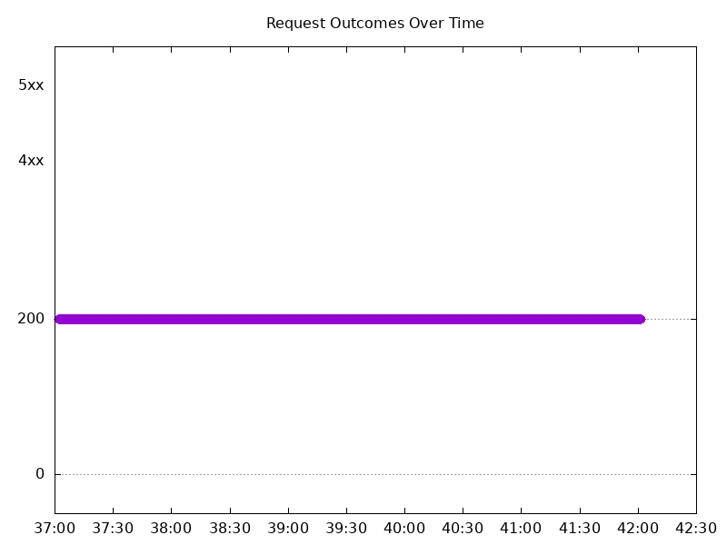
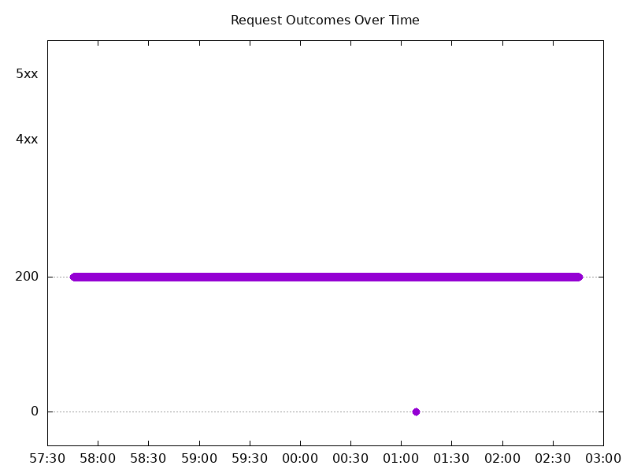

# Results

## Test environment

NGINX Plus: true

NGINX Gateway Fabric:

- Commit: eb3a090367b0c4a450224993fc4eed39e6dd9dc4
- Date: 2026-01-22T21:37:34Z
- Dirty: false

GKE Cluster:

- Node count: 12
- k8s version: v1.33.5-gke.2072000
- vCPUs per node: 16
- RAM per node: 65851520Ki
- Max pods per node: 110
- Zone: us-west1-b
- Instance Type: n2d-standard-16

## One NGINX Pod runs per node Test Results

### Scale Up Gradually

#### Test: Send https /tea traffic

```text
Requests      [total, rate, throughput]         30000, 100.00, 100.00
Duration      [total, attack, wait]             5m0s, 5m0s, 962.998µs
Latencies     [min, mean, 50, 90, 95, 99, max]  656.842µs, 1.115ms, 1.09ms, 1.305ms, 1.393ms, 1.729ms, 19.14ms
Bytes In      [total, mean]                     4625954, 154.20
Bytes Out     [total, mean]                     0, 0.00
Success       [ratio]                           100.00%
Status Codes  [code:count]                      200:30000  
Error Set:
```



#### Test: Send http /coffee traffic

```text
Requests      [total, rate, throughput]         30000, 100.00, 100.00
Duration      [total, attack, wait]             5m0s, 5m0s, 1.14ms
Latencies     [min, mean, 50, 90, 95, 99, max]  590.916µs, 1.072ms, 1.054ms, 1.268ms, 1.342ms, 1.635ms, 18.912ms
Bytes In      [total, mean]                     4806037, 160.20
Bytes Out     [total, mean]                     0, 0.00
Success       [ratio]                           100.00%
Status Codes  [code:count]                      200:30000  
Error Set:
```


### Scale Down Gradually

#### Test: Send https /tea traffic

```text
Requests      [total, rate, throughput]         48000, 100.00, 100.00
Duration      [total, attack, wait]             8m0s, 8m0s, 1.298ms
Latencies     [min, mean, 50, 90, 95, 99, max]  156.971µs, 1.21ms, 1.146ms, 1.453ms, 1.543ms, 1.868ms, 217.883ms
Bytes In      [total, mean]                     7401111, 154.19
Bytes Out     [total, mean]                     0, 0.00
Success       [ratio]                           99.99%
Status Codes  [code:count]                      0:3  200:47997  
Error Set:
Get "https://cafe.example.com/tea": dial tcp 0.0.0.0:0->10.138.0.41:443: connect: network is unreachable
```


#### Test: Send http /coffee traffic

```text
Requests      [total, rate, throughput]         48000, 100.00, 100.00
Duration      [total, attack, wait]             8m0s, 8m0s, 1.09ms
Latencies     [min, mean, 50, 90, 95, 99, max]  210.31µs, 1.165ms, 1.111ms, 1.404ms, 1.504ms, 1.801ms, 205.261ms
Bytes In      [total, mean]                     7689124, 160.19
Bytes Out     [total, mean]                     0, 0.00
Success       [ratio]                           99.99%
Status Codes  [code:count]                      0:3  200:47997  
Error Set:
Get "http://cafe.example.com/coffee": dial tcp 0.0.0.0:0->10.138.0.41:80: connect: network is unreachable
```


### Scale Up Abruptly

#### Test: Send http /coffee traffic

```text
Requests      [total, rate, throughput]         12000, 100.01, 91.67
Duration      [total, attack, wait]             2m0s, 2m0s, 1.277ms
Latencies     [min, mean, 50, 90, 95, 99, max]  529.118µs, 1.092ms, 1.098ms, 1.332ms, 1.407ms, 1.625ms, 8.982ms
Bytes In      [total, mean]                     1912103, 159.34
Bytes Out     [total, mean]                     0, 0.00
Success       [ratio]                           91.67%
Status Codes  [code:count]                      200:11000  502:1000  
Error Set:
502 Bad Gateway
```


#### Test: Send https /tea traffic

```text
Requests      [total, rate, throughput]         12000, 100.01, 100.01
Duration      [total, attack, wait]             2m0s, 2m0s, 1.242ms
Latencies     [min, mean, 50, 90, 95, 99, max]  673.73µs, 1.203ms, 1.182ms, 1.406ms, 1.483ms, 1.771ms, 10.912ms
Bytes In      [total, mean]                     1850357, 154.20
Bytes Out     [total, mean]                     0, 0.00
Success       [ratio]                           100.00%
Status Codes  [code:count]                      200:12000  
Error Set:
```


### Scale Down Abruptly

#### Test: Send https /tea traffic

```text
Requests      [total, rate, throughput]         12000, 100.01, 100.01
Duration      [total, attack, wait]             2m0s, 2m0s, 873.196µs
Latencies     [min, mean, 50, 90, 95, 99, max]  670.571µs, 1.285ms, 1.258ms, 1.475ms, 1.552ms, 1.842ms, 74.421ms
Bytes In      [total, mean]                     1850431, 154.20
Bytes Out     [total, mean]                     0, 0.00
Success       [ratio]                           100.00%
Status Codes  [code:count]                      200:12000  
Error Set:
```


#### Test: Send http /coffee traffic

```text
Requests      [total, rate, throughput]         12000, 100.01, 100.01
Duration      [total, attack, wait]             2m0s, 2m0s, 993.186µs
Latencies     [min, mean, 50, 90, 95, 99, max]  643.561µs, 1.186ms, 1.164ms, 1.391ms, 1.461ms, 1.685ms, 66.582ms
Bytes In      [total, mean]                     1922499, 160.21
Bytes Out     [total, mean]                     0, 0.00
Success       [ratio]                           100.00%
Status Codes  [code:count]                      200:12000  
Error Set:
```


## Multiple NGINX Pods run per node Test Results

### Scale Up Gradually

#### Test: Send http /coffee traffic

```text
Requests      [total, rate, throughput]         30000, 100.00, 100.00
Duration      [total, attack, wait]             5m0s, 5m0s, 964.271µs
Latencies     [min, mean, 50, 90, 95, 99, max]  576.494µs, 1.056ms, 1.029ms, 1.253ms, 1.342ms, 1.735ms, 26.789ms
Bytes In      [total, mean]                     4805888, 160.20
Bytes Out     [total, mean]                     0, 0.00
Success       [ratio]                           100.00%
Status Codes  [code:count]                      200:30000  
Error Set:
```


#### Test: Send https /tea traffic

```text
Requests      [total, rate, throughput]         30000, 100.00, 100.00
Duration      [total, attack, wait]             5m0s, 5m0s, 1.135ms
Latencies     [min, mean, 50, 90, 95, 99, max]  651.522µs, 1.137ms, 1.106ms, 1.334ms, 1.431ms, 1.893ms, 27.145ms
Bytes In      [total, mean]                     4625915, 154.20
Bytes Out     [total, mean]                     0, 0.00
Success       [ratio]                           100.00%
Status Codes  [code:count]                      200:30000  
Error Set:
```



### Scale Down Gradually

#### Test: Send http /coffee traffic

```text
Requests      [total, rate, throughput]         96000, 100.00, 100.00
Duration      [total, attack, wait]             16m0s, 16m0s, 1.272ms
Latencies     [min, mean, 50, 90, 95, 99, max]  570.896µs, 1.171ms, 1.128ms, 1.44ms, 1.579ms, 1.942ms, 50.637ms
Bytes In      [total, mean]                     15379205, 160.20
Bytes Out     [total, mean]                     0, 0.00
Success       [ratio]                           100.00%
Status Codes  [code:count]                      200:96000  
Error Set:
```


#### Test: Send https /tea traffic

```text
Requests      [total, rate, throughput]         96000, 100.00, 100.00
Duration      [total, attack, wait]             16m0s, 16m0s, 1.131ms
Latencies     [min, mean, 50, 90, 95, 99, max]  634.991µs, 1.227ms, 1.175ms, 1.504ms, 1.66ms, 2.014ms, 48.013ms
Bytes In      [total, mean]                     14803204, 154.20
Bytes Out     [total, mean]                     0, 0.00
Success       [ratio]                           100.00%
Status Codes  [code:count]                      200:96000  
Error Set:
```


### Scale Up Abruptly

#### Test: Send http /coffee traffic

```text
Requests      [total, rate, throughput]         12000, 100.01, 58.36
Duration      [total, attack, wait]             2m0s, 2m0s, 498.542µs
Latencies     [min, mean, 50, 90, 95, 99, max]  425.77µs, 995.84µs, 1.022ms, 1.401ms, 1.514ms, 1.758ms, 39.867ms
Bytes In      [total, mean]                     1871451, 155.95
Bytes Out     [total, mean]                     0, 0.00
Success       [ratio]                           58.36%
Status Codes  [code:count]                      200:7003  502:4997  
Error Set:
502 Bad Gateway
```


#### Test: Send https /tea traffic

```text
Requests      [total, rate, throughput]         12000, 100.01, 100.01
Duration      [total, attack, wait]             2m0s, 2m0s, 873.11µs
Latencies     [min, mean, 50, 90, 95, 99, max]  622.093µs, 1.261ms, 1.194ms, 1.496ms, 1.61ms, 1.886ms, 118.396ms
Bytes In      [total, mean]                     1850360, 154.20
Bytes Out     [total, mean]                     0, 0.00
Success       [ratio]                           100.00%
Status Codes  [code:count]                      200:12000  
Error Set:
```


### Scale Down Abruptly

#### Test: Send https /tea traffic

```text
Requests      [total, rate, throughput]         12000, 100.01, 100.01
Duration      [total, attack, wait]             2m0s, 2m0s, 1.292ms
Latencies     [min, mean, 50, 90, 95, 99, max]  759.54µs, 1.373ms, 1.357ms, 1.639ms, 1.741ms, 1.954ms, 34.551ms
Bytes In      [total, mean]                     1850463, 154.21
Bytes Out     [total, mean]                     0, 0.00
Success       [ratio]                           100.00%
Status Codes  [code:count]                      200:12000  
Error Set:
```


#### Test: Send http /coffee traffic

```text
Requests      [total, rate, throughput]         12000, 100.01, 100.01
Duration      [total, attack, wait]             2m0s, 2m0s, 1.257ms
Latencies     [min, mean, 50, 90, 95, 99, max]  603.813µs, 1.305ms, 1.298ms, 1.577ms, 1.665ms, 1.852ms, 34.801ms
Bytes In      [total, mean]                     1922349, 160.20
Bytes Out     [total, mean]                     0, 0.00
Success       [ratio]                           100.00%
Status Codes  [code:count]                      200:12000  
Error Set:
```


