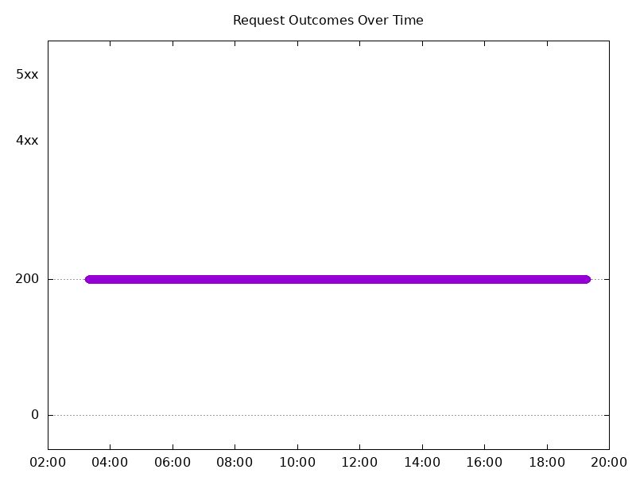

# Results

## Test environment

NGINX Plus: true

NGINX Gateway Fabric:

- Commit: e8ee7c1c4f14e249927a5447a1af2615ddbe0f87
- Date: 2025-12-17T20:04:03Z
- Dirty: false

GKE Cluster:

- Node count: 12
- k8s version: v1.33.5-gke.1308000
- vCPUs per node: 16
- RAM per node: 65851520Ki
- Max pods per node: 110
- Zone: us-west1-b
- Instance Type: n2d-standard-16

## One NGINX Pod runs per node Test Results

### Scale Up Gradually

#### Test: Send http /coffee traffic

```text
Requests      [total, rate, throughput]         30000, 100.00, 100.00
Duration      [total, attack, wait]             5m0s, 5m0s, 1.342ms
Latencies     [min, mean, 50, 90, 95, 99, max]  623.121µs, 1.185ms, 1.149ms, 1.315ms, 1.37ms, 1.584ms, 1.043s
Bytes In      [total, mean]                     4835924, 161.20
Bytes Out     [total, mean]                     0, 0.00
Success       [ratio]                           100.00%
Status Codes  [code:count]                      200:30000  
Error Set:
```


#### Test: Send https /tea traffic

```text
Requests      [total, rate, throughput]         30000, 100.00, 100.00
Duration      [total, attack, wait]             5m0s, 5m0s, 1.341ms
Latencies     [min, mean, 50, 90, 95, 99, max]  642.511µs, 1.193ms, 1.189ms, 1.366ms, 1.423ms, 1.66ms, 16.442ms
Bytes In      [total, mean]                     4653051, 155.10
Bytes Out     [total, mean]                     0, 0.00
Success       [ratio]                           100.00%
Status Codes  [code:count]                      200:30000  
Error Set:
```


### Scale Down Gradually

#### Test: Send http /coffee traffic

```text
Requests      [total, rate, throughput]         48000, 100.00, 100.00
Duration      [total, attack, wait]             8m0s, 8m0s, 1.351ms
Latencies     [min, mean, 50, 90, 95, 99, max]  612.987µs, 1.172ms, 1.172ms, 1.34ms, 1.393ms, 1.567ms, 39.696ms
Bytes In      [total, mean]                     7737566, 161.20
Bytes Out     [total, mean]                     0, 0.00
Success       [ratio]                           100.00%
Status Codes  [code:count]                      200:48000  
Error Set:
```


#### Test: Send https /tea traffic

```text
Requests      [total, rate, throughput]         48000, 100.00, 100.00
Duration      [total, attack, wait]             8m0s, 8m0s, 1.679ms
Latencies     [min, mean, 50, 90, 95, 99, max]  671.328µs, 1.229ms, 1.221ms, 1.393ms, 1.454ms, 1.663ms, 47.45ms
Bytes In      [total, mean]                     7444781, 155.10
Bytes Out     [total, mean]                     0, 0.00
Success       [ratio]                           100.00%
Status Codes  [code:count]                      200:48000  
Error Set:
```


### Scale Up Abruptly

#### Test: Send http /coffee traffic

```text
Requests      [total, rate, throughput]         12000, 100.01, 83.32
Duration      [total, attack, wait]             2m0s, 2m0s, 1.071ms
Latencies     [min, mean, 50, 90, 95, 99, max]  460.348µs, 1.084ms, 1.128ms, 1.317ms, 1.369ms, 1.549ms, 65.084ms
Bytes In      [total, mean]                     1912030, 159.34
Bytes Out     [total, mean]                     0, 0.00
Success       [ratio]                           83.32%
Status Codes  [code:count]                      200:9998  502:2002  
Error Set:
502 Bad Gateway
```


#### Test: Send https /tea traffic

```text
Requests      [total, rate, throughput]         12000, 100.01, 100.01
Duration      [total, attack, wait]             2m0s, 2m0s, 1.351ms
Latencies     [min, mean, 50, 90, 95, 99, max]  708.096µs, 1.229ms, 1.21ms, 1.376ms, 1.43ms, 1.613ms, 65.674ms
Bytes In      [total, mean]                     1861177, 155.10
Bytes Out     [total, mean]                     0, 0.00
Success       [ratio]                           100.00%
Status Codes  [code:count]                      200:12000  
Error Set:
```


### Scale Down Abruptly

#### Test: Send http /coffee traffic

```text
Requests      [total, rate, throughput]         12000, 100.01, 83.34
Duration      [total, attack, wait]             2m0s, 2m0s, 1.145ms
Latencies     [min, mean, 50, 90, 95, 99, max]  445.655µs, 1.114ms, 1.168ms, 1.378ms, 1.439ms, 1.571ms, 3.139ms
Bytes In      [total, mean]                     1911950, 159.33
Bytes Out     [total, mean]                     0, 0.00
Success       [ratio]                           83.33%
Status Codes  [code:count]                      200:10000  502:2000  
Error Set:
502 Bad Gateway
```


#### Test: Send https /tea traffic

```text
Requests      [total, rate, throughput]         12000, 100.01, 100.01
Duration      [total, attack, wait]             2m0s, 2m0s, 1.338ms
Latencies     [min, mean, 50, 90, 95, 99, max]  689.2µs, 1.265ms, 1.26ms, 1.447ms, 1.506ms, 1.656ms, 10.305ms
Bytes In      [total, mean]                     1861193, 155.10
Bytes Out     [total, mean]                     0, 0.00
Success       [ratio]                           100.00%
Status Codes  [code:count]                      200:12000  
Error Set:
```


## Multiple NGINX Pods run per node Test Results

### Scale Up Gradually

#### Test: Send http /coffee traffic

```text
Requests      [total, rate, throughput]         30000, 100.00, 100.00
Duration      [total, attack, wait]             5m0s, 5m0s, 945.018µs
Latencies     [min, mean, 50, 90, 95, 99, max]  610.677µs, 1.157ms, 1.149ms, 1.328ms, 1.389ms, 1.628ms, 35.328ms
Bytes In      [total, mean]                     4836068, 161.20
Bytes Out     [total, mean]                     0, 0.00
Success       [ratio]                           100.00%
Status Codes  [code:count]                      200:30000  
Error Set:
```


#### Test: Send https /tea traffic

```text
Requests      [total, rate, throughput]         30000, 100.00, 100.00
Duration      [total, attack, wait]             5m0s, 5m0s, 1.414ms
Latencies     [min, mean, 50, 90, 95, 99, max]  673.849µs, 1.217ms, 1.204ms, 1.385ms, 1.452ms, 1.707ms, 38.451ms
Bytes In      [total, mean]                     4653058, 155.10
Bytes Out     [total, mean]                     0, 0.00
Success       [ratio]                           100.00%
Status Codes  [code:count]                      200:30000  
Error Set:
```


### Scale Down Gradually

#### Test: Send https /tea traffic

```text
Requests      [total, rate, throughput]         96000, 100.00, 100.00
Duration      [total, attack, wait]             16m0s, 16m0s, 1.418ms
Latencies     [min, mean, 50, 90, 95, 99, max]  653.051µs, 1.236ms, 1.211ms, 1.389ms, 1.455ms, 1.673ms, 128.905ms
Bytes In      [total, mean]                     14889642, 155.10
Bytes Out     [total, mean]                     0, 0.00
Success       [ratio]                           100.00%
Status Codes  [code:count]                      200:96000  
Error Set:
```


#### Test: Send http /coffee traffic

```text
Requests      [total, rate, throughput]         96000, 100.00, 100.00
Duration      [total, attack, wait]             16m0s, 16m0s, 1.313ms
Latencies     [min, mean, 50, 90, 95, 99, max]  620.62µs, 1.182ms, 1.164ms, 1.345ms, 1.403ms, 1.603ms, 121.814ms
Bytes In      [total, mean]                     15475260, 161.20
Bytes Out     [total, mean]                     0, 0.00
Success       [ratio]                           100.00%
Status Codes  [code:count]                      200:96000  
Error Set:
```



### Scale Up Abruptly

#### Test: Send https /tea traffic

```text
Requests      [total, rate, throughput]         12000, 100.01, 100.01
Duration      [total, attack, wait]             2m0s, 2m0s, 1.17ms
Latencies     [min, mean, 50, 90, 95, 99, max]  694.878µs, 1.248ms, 1.197ms, 1.416ms, 1.496ms, 1.672ms, 118.319ms
Bytes In      [total, mean]                     1861261, 155.11
Bytes Out     [total, mean]                     0, 0.00
Success       [ratio]                           100.00%
Status Codes  [code:count]                      200:12000  
Error Set:
```


#### Test: Send http /coffee traffic

```text
Requests      [total, rate, throughput]         12000, 100.01, 100.01
Duration      [total, attack, wait]             2m0s, 2m0s, 993.218µs
Latencies     [min, mean, 50, 90, 95, 99, max]  653.322µs, 1.198ms, 1.165ms, 1.379ms, 1.456ms, 1.658ms, 118.576ms
Bytes In      [total, mean]                     1934395, 161.20
Bytes Out     [total, mean]                     0, 0.00
Success       [ratio]                           100.00%
Status Codes  [code:count]                      200:12000  
Error Set:
```


### Scale Down Abruptly

#### Test: Send http /coffee traffic

```text
Requests      [total, rate, throughput]         12000, 100.01, 100.01
Duration      [total, attack, wait]             2m0s, 2m0s, 1.262ms
Latencies     [min, mean, 50, 90, 95, 99, max]  659.913µs, 1.198ms, 1.194ms, 1.374ms, 1.435ms, 1.562ms, 11.497ms
Bytes In      [total, mean]                     1934359, 161.20
Bytes Out     [total, mean]                     0, 0.00
Success       [ratio]                           100.00%
Status Codes  [code:count]                      200:12000  
Error Set:
```


#### Test: Send https /tea traffic

```text
Requests      [total, rate, throughput]         12000, 100.01, 100.01
Duration      [total, attack, wait]             2m0s, 2m0s, 1.456ms
Latencies     [min, mean, 50, 90, 95, 99, max]  703.388µs, 1.235ms, 1.224ms, 1.409ms, 1.468ms, 1.595ms, 10.926ms
Bytes In      [total, mean]                     1861216, 155.10
Bytes Out     [total, mean]                     0, 0.00
Success       [ratio]                           100.00%
Status Codes  [code:count]                      200:12000  
Error Set:
```


