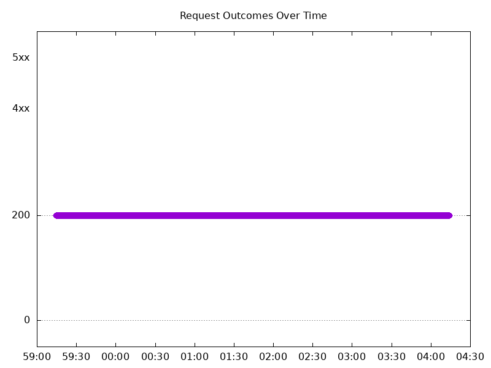
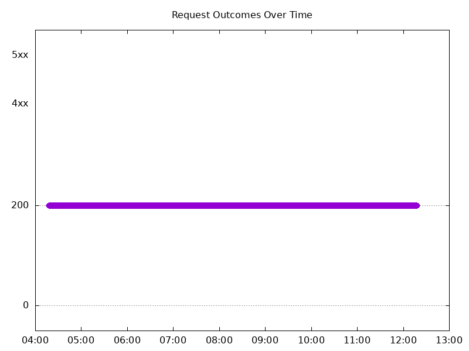
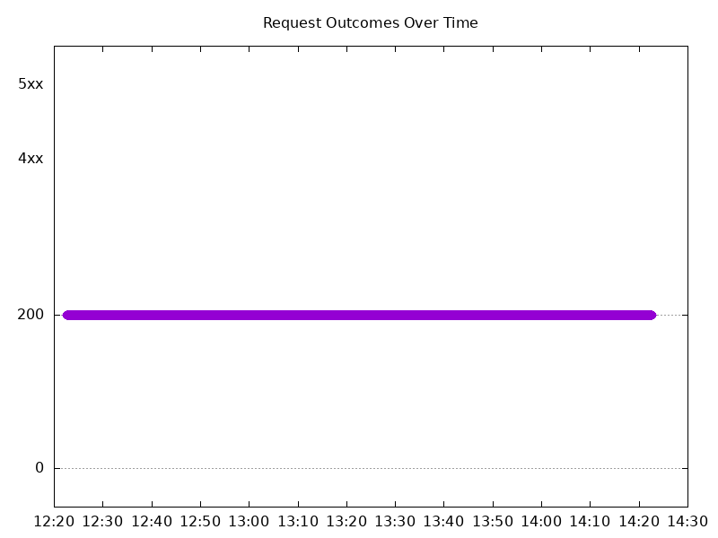
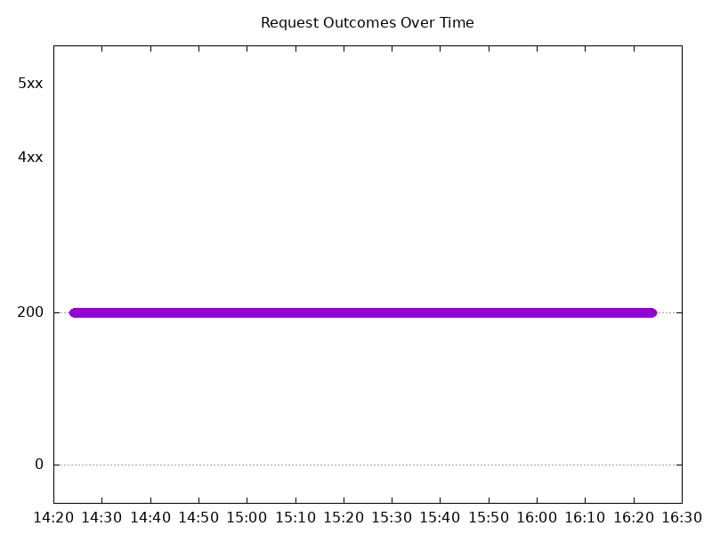
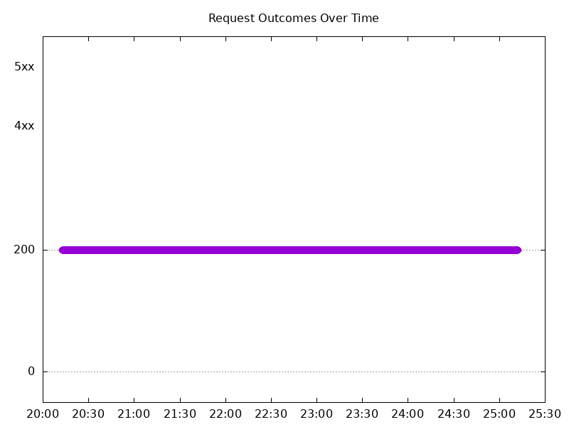
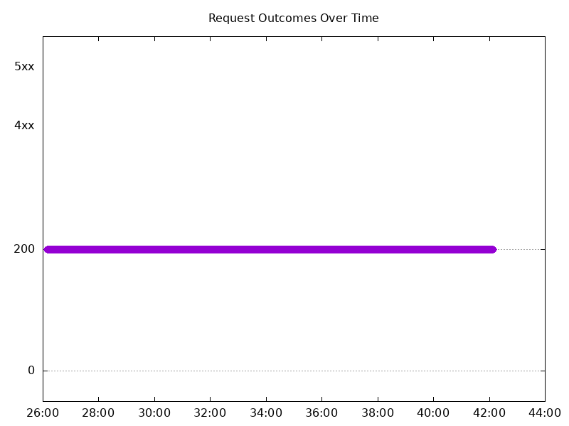
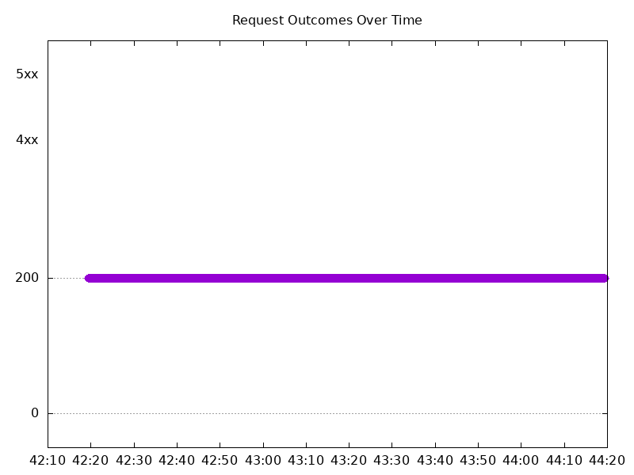
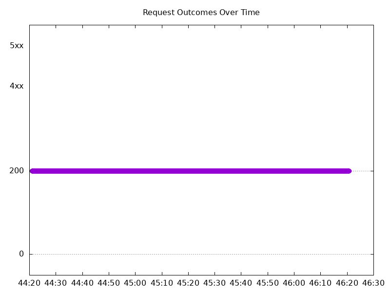

# Results

## Test environment

NGINX Plus: false

NGINX Gateway Fabric:

- Commit: 8241478604f782eca497329ae47507b978d117b1
- Date: 2025-09-24T18:19:40Z
- Dirty: false

GKE Cluster:

- Node count: 15
- k8s version: v1.33.4-gke.1134000
- vCPUs per node: 2
- RAM per node: 4015668Ki
- Max pods per node: 110
- Zone: us-east1-b
- Instance Type: e2-medium

## One NGINX Pod runs per node Test Results

### Scale Up Gradually

#### Test: Send https /tea traffic

```text
Requests      [total, rate, throughput]         30000, 100.00, 100.00
Duration      [total, attack, wait]             5m0s, 5m0s, 2.432ms
Latencies     [min, mean, 50, 90, 95, 99, max]  1.024ms, 2.146ms, 1.996ms, 2.344ms, 2.599ms, 4.647ms, 1.026s
Bytes In      [total, mean]                     4655918, 155.20
Bytes Out     [total, mean]                     0, 0.00
Success       [ratio]                           100.00%
Status Codes  [code:count]                      200:30000  
Error Set:
```



#### Test: Send http /coffee traffic

```text
Requests      [total, rate, throughput]         30000, 100.00, 100.00
Duration      [total, attack, wait]             5m0s, 5m0s, 1.827ms
Latencies     [min, mean, 50, 90, 95, 99, max]  957.55µs, 2.005ms, 1.923ms, 2.27ms, 2.508ms, 4.039ms, 41.988ms
Bytes In      [total, mean]                     4839173, 161.31
Bytes Out     [total, mean]                     0, 0.00
Success       [ratio]                           100.00%
Status Codes  [code:count]                      200:30000  
Error Set:
```


### Scale Down Gradually

#### Test: Send http /coffee traffic

```text
Requests      [total, rate, throughput]         48000, 100.00, 100.00
Duration      [total, attack, wait]             8m0s, 8m0s, 1.626ms
Latencies     [min, mean, 50, 90, 95, 99, max]  964.779µs, 2.007ms, 1.879ms, 2.253ms, 2.495ms, 4.251ms, 1.056s
Bytes In      [total, mean]                     7742250, 161.30
Bytes Out     [total, mean]                     0, 0.00
Success       [ratio]                           100.00%
Status Codes  [code:count]                      200:48000  
Error Set:
```



#### Test: Send https /tea traffic

```text
Requests      [total, rate, throughput]         48000, 100.00, 100.00
Duration      [total, attack, wait]             8m0s, 8m0s, 1.727ms
Latencies     [min, mean, 50, 90, 95, 99, max]  1.007ms, 2.072ms, 1.964ms, 2.327ms, 2.57ms, 4.296ms, 53.284ms
Bytes In      [total, mean]                     7449456, 155.20
Bytes Out     [total, mean]                     0, 0.00
Success       [ratio]                           100.00%
Status Codes  [code:count]                      200:48000  
Error Set:
```


### Scale Up Abruptly

#### Test: Send https /tea traffic

```text
Requests      [total, rate, throughput]         12000, 100.01, 100.01
Duration      [total, attack, wait]             2m0s, 2m0s, 1.686ms
Latencies     [min, mean, 50, 90, 95, 99, max]  987.822µs, 2.021ms, 1.908ms, 2.225ms, 2.408ms, 4.053ms, 56.349ms
Bytes In      [total, mean]                     1862480, 155.21
Bytes Out     [total, mean]                     0, 0.00
Success       [ratio]                           100.00%
Status Codes  [code:count]                      200:12000  
Error Set:
```



#### Test: Send http /coffee traffic

```text
Requests      [total, rate, throughput]         12000, 100.01, 100.01
Duration      [total, attack, wait]             2m0s, 2m0s, 2.051ms
Latencies     [min, mean, 50, 90, 95, 99, max]  970.719µs, 1.967ms, 1.86ms, 2.187ms, 2.371ms, 4.066ms, 58.449ms
Bytes In      [total, mean]                     1935652, 161.30
Bytes Out     [total, mean]                     0, 0.00
Success       [ratio]                           100.00%
Status Codes  [code:count]                      200:12000  
Error Set:
```


### Scale Down Abruptly

#### Test: Send http /coffee traffic

```text
Requests      [total, rate, throughput]         12000, 100.01, 100.01
Duration      [total, attack, wait]             2m0s, 2m0s, 1.967ms
Latencies     [min, mean, 50, 90, 95, 99, max]  931.537µs, 1.92ms, 1.855ms, 2.173ms, 2.318ms, 3.6ms, 40.02ms
Bytes In      [total, mean]                     1935630, 161.30
Bytes Out     [total, mean]                     0, 0.00
Success       [ratio]                           100.00%
Status Codes  [code:count]                      200:12000  
Error Set:
```



#### Test: Send https /tea traffic

```text
Requests      [total, rate, throughput]         12000, 100.01, 100.01
Duration      [total, attack, wait]             2m0s, 2m0s, 1.875ms
Latencies     [min, mean, 50, 90, 95, 99, max]  920.083µs, 1.975ms, 1.895ms, 2.218ms, 2.4ms, 4.104ms, 55.925ms
Bytes In      [total, mean]                     1862361, 155.20
Bytes Out     [total, mean]                     0, 0.00
Success       [ratio]                           100.00%
Status Codes  [code:count]                      200:12000  
Error Set:
```


## Multiple NGINX Pods run per node Test Results

### Scale Up Gradually

#### Test: Send https /tea traffic

```text
Requests      [total, rate, throughput]         30000, 100.00, 100.00
Duration      [total, attack, wait]             5m0s, 5m0s, 1.655ms
Latencies     [min, mean, 50, 90, 95, 99, max]  1.051ms, 2.055ms, 1.952ms, 2.312ms, 2.602ms, 4.581ms, 45.781ms
Bytes In      [total, mean]                     4659013, 155.30
Bytes Out     [total, mean]                     0, 0.00
Success       [ratio]                           100.00%
Status Codes  [code:count]                      200:30000  
Error Set:
```



#### Test: Send http /coffee traffic

```text
Requests      [total, rate, throughput]         30000, 100.00, 100.00
Duration      [total, attack, wait]             5m0s, 5m0s, 1.586ms
Latencies     [min, mean, 50, 90, 95, 99, max]  909.69µs, 1.913ms, 1.835ms, 2.174ms, 2.426ms, 4.029ms, 46.219ms
Bytes In      [total, mean]                     4835977, 161.20
Bytes Out     [total, mean]                     0, 0.00
Success       [ratio]                           100.00%
Status Codes  [code:count]                      200:30000  
Error Set:
```


### Scale Down Gradually

#### Test: Send http /coffee traffic

```text
Requests      [total, rate, throughput]         96000, 100.00, 100.00
Duration      [total, attack, wait]             16m0s, 16m0s, 1.245ms
Latencies     [min, mean, 50, 90, 95, 99, max]  859.648µs, 1.953ms, 1.854ms, 2.218ms, 2.45ms, 4.152ms, 46.252ms
Bytes In      [total, mean]                     15475301, 161.20
Bytes Out     [total, mean]                     0, 0.00
Success       [ratio]                           100.00%
Status Codes  [code:count]                      200:96000  
Error Set:
```



#### Test: Send https /tea traffic

```text
Requests      [total, rate, throughput]         96000, 100.00, 100.00
Duration      [total, attack, wait]             16m0s, 16m0s, 2.122ms
Latencies     [min, mean, 50, 90, 95, 99, max]  1.009ms, 2.081ms, 1.961ms, 2.34ms, 2.607ms, 4.62ms, 206.706ms
Bytes In      [total, mean]                     14908701, 155.30
Bytes Out     [total, mean]                     0, 0.00
Success       [ratio]                           100.00%
Status Codes  [code:count]                      200:96000  
Error Set:
```


### Scale Up Abruptly

#### Test: Send https /tea traffic

```text
Requests      [total, rate, throughput]         12000, 100.01, 100.01
Duration      [total, attack, wait]             2m0s, 2m0s, 1.839ms
Latencies     [min, mean, 50, 90, 95, 99, max]  1.051ms, 1.979ms, 1.916ms, 2.218ms, 2.417ms, 3.922ms, 45.363ms
Bytes In      [total, mean]                     1863713, 155.31
Bytes Out     [total, mean]                     0, 0.00
Success       [ratio]                           100.00%
Status Codes  [code:count]                      200:12000  
Error Set:
```



#### Test: Send http /coffee traffic

```text
Requests      [total, rate, throughput]         12000, 100.01, 100.01
Duration      [total, attack, wait]             2m0s, 2m0s, 1.069ms
Latencies     [min, mean, 50, 90, 95, 99, max]  909.917µs, 1.943ms, 1.862ms, 2.199ms, 2.395ms, 3.911ms, 48.928ms
Bytes In      [total, mean]                     1934377, 161.20
Bytes Out     [total, mean]                     0, 0.00
Success       [ratio]                           100.00%
Status Codes  [code:count]                      200:12000  
Error Set:
```


### Scale Down Abruptly

#### Test: Send https /tea traffic

```text
Requests      [total, rate, throughput]         12000, 100.01, 100.01
Duration      [total, attack, wait]             2m0s, 2m0s, 1.745ms
Latencies     [min, mean, 50, 90, 95, 99, max]  1.051ms, 2.098ms, 1.96ms, 2.32ms, 2.532ms, 4.892ms, 95.572ms
Bytes In      [total, mean]                     1863569, 155.30
Bytes Out     [total, mean]                     0, 0.00
Success       [ratio]                           100.00%
Status Codes  [code:count]                      200:12000  
Error Set:
```



#### Test: Send http /coffee traffic

```text
Requests      [total, rate, throughput]         12000, 100.01, 100.01
Duration      [total, attack, wait]             2m0s, 2m0s, 1.726ms
Latencies     [min, mean, 50, 90, 95, 99, max]  1.021ms, 2.026ms, 1.895ms, 2.278ms, 2.514ms, 4.462ms, 95.275ms
Bytes In      [total, mean]                     1934466, 161.21
Bytes Out     [total, mean]                     0, 0.00
Success       [ratio]                           100.00%
Status Codes  [code:count]                      200:12000  
Error Set:
```


