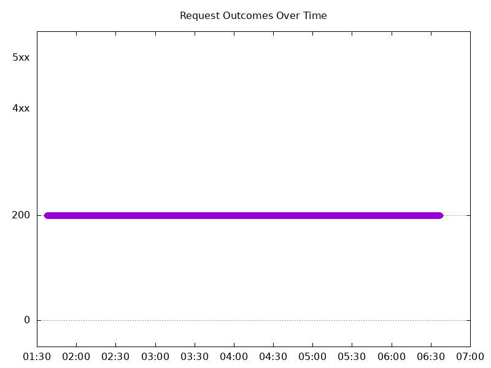
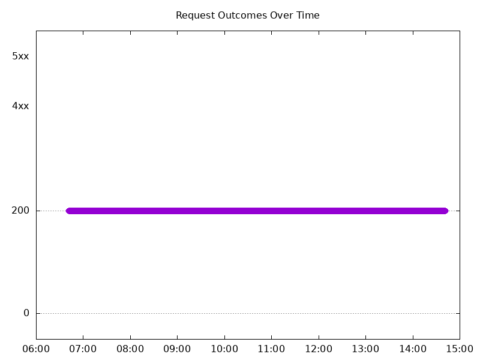
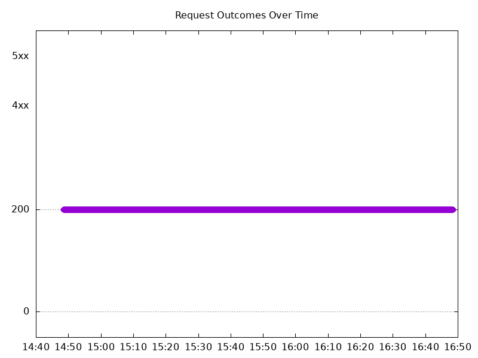
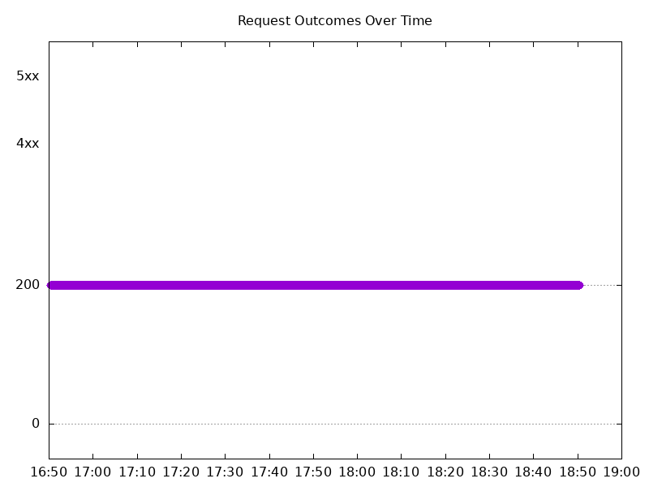
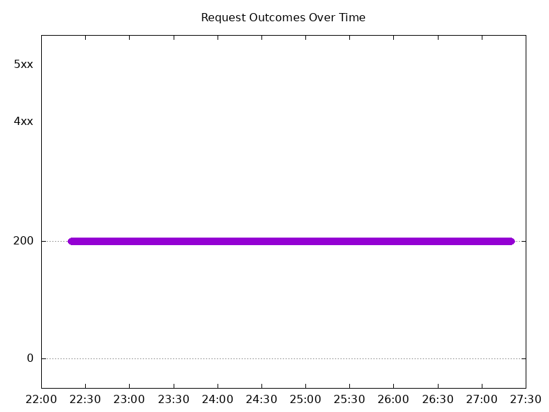
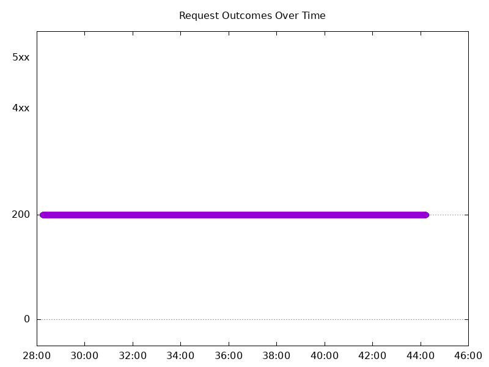
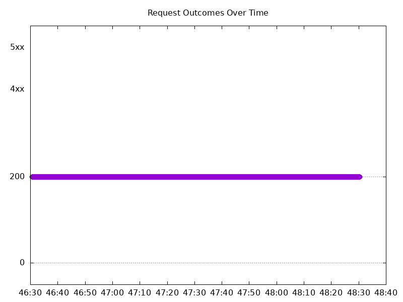

# Results

## Test environment

NGINX Plus: true

NGINX Gateway Fabric:

- Commit: 8241478604f782eca497329ae47507b978d117b1
- Date: 2025-09-25T01:19:35Z
- Dirty: false

GKE Cluster:

- Node count: 15
- k8s version: v1.33.4-gke.1134000
- vCPUs per node: 2
- RAM per node: 4015672Ki
- Max pods per node: 110
- Zone: us-south1-a
- Instance Type: e2-medium

## One NGINX Pod runs per node Test Results

### Scale Up Gradually

#### Test: Send https /tea traffic

```text
Requests      [total, rate, throughput]         30000, 100.00, 100.00
Duration      [total, attack, wait]             5m0s, 5m0s, 1.536ms
Latencies     [min, mean, 50, 90, 95, 99, max]  808.062µs, 1.414ms, 1.353ms, 1.638ms, 1.758ms, 2.595ms, 29.438ms
Bytes In      [total, mean]                     4653003, 155.10
Bytes Out     [total, mean]                     0, 0.00
Success       [ratio]                           100.00%
Status Codes  [code:count]                      200:30000  
Error Set:
```



#### Test: Send http /coffee traffic

```text
Requests      [total, rate, throughput]         30000, 100.00, 100.00
Duration      [total, attack, wait]             5m0s, 5m0s, 1.401ms
Latencies     [min, mean, 50, 90, 95, 99, max]  686.137µs, 1.296ms, 1.264ms, 1.536ms, 1.635ms, 2.197ms, 16.222ms
Bytes In      [total, mean]                     4836170, 161.21
Bytes Out     [total, mean]                     0, 0.00
Success       [ratio]                           100.00%
Status Codes  [code:count]                      200:30000  
Error Set:
```


### Scale Down Gradually

#### Test: Send https /tea traffic

```text
Requests      [total, rate, throughput]         48000, 100.00, 100.00
Duration      [total, attack, wait]             8m0s, 8m0s, 1.391ms
Latencies     [min, mean, 50, 90, 95, 99, max]  861.676µs, 1.364ms, 1.298ms, 1.567ms, 1.697ms, 2.48ms, 36.922ms
Bytes In      [total, mean]                     7444867, 155.10
Bytes Out     [total, mean]                     0, 0.00
Success       [ratio]                           100.00%
Status Codes  [code:count]                      200:48000  
Error Set:
```



#### Test: Send http /coffee traffic

```text
Requests      [total, rate, throughput]         48000, 100.00, 100.00
Duration      [total, attack, wait]             8m0s, 8m0s, 1.143ms
Latencies     [min, mean, 50, 90, 95, 99, max]  733.65µs, 1.273ms, 1.221ms, 1.497ms, 1.601ms, 2.282ms, 36.436ms
Bytes In      [total, mean]                     7737614, 161.20
Bytes Out     [total, mean]                     0, 0.00
Success       [ratio]                           100.00%
Status Codes  [code:count]                      200:48000  
Error Set:
```


### Scale Up Abruptly

#### Test: Send https /tea traffic

```text
Requests      [total, rate, throughput]         12000, 100.01, 100.01
Duration      [total, attack, wait]             2m0s, 2m0s, 1.379ms
Latencies     [min, mean, 50, 90, 95, 99, max]  832.098µs, 1.377ms, 1.318ms, 1.55ms, 1.659ms, 2.454ms, 68.23ms
Bytes In      [total, mean]                     1861078, 155.09
Bytes Out     [total, mean]                     0, 0.00
Success       [ratio]                           100.00%
Status Codes  [code:count]                      200:12000  
Error Set:
```



#### Test: Send http /coffee traffic

```text
Requests      [total, rate, throughput]         12000, 100.01, 100.01
Duration      [total, attack, wait]             2m0s, 2m0s, 1.475ms
Latencies     [min, mean, 50, 90, 95, 99, max]  737.493µs, 1.236ms, 1.191ms, 1.428ms, 1.524ms, 2.084ms, 74.984ms
Bytes In      [total, mean]                     1934451, 161.20
Bytes Out     [total, mean]                     0, 0.00
Success       [ratio]                           100.00%
Status Codes  [code:count]                      200:12000  
Error Set:
```


### Scale Down Abruptly

#### Test: Send https /tea traffic

```text
Requests      [total, rate, throughput]         12000, 100.01, 100.01
Duration      [total, attack, wait]             2m0s, 2m0s, 1.21ms
Latencies     [min, mean, 50, 90, 95, 99, max]  922.161µs, 1.321ms, 1.265ms, 1.502ms, 1.616ms, 2.37ms, 19.797ms
Bytes In      [total, mean]                     1861377, 155.11
Bytes Out     [total, mean]                     0, 0.00
Success       [ratio]                           100.00%
Status Codes  [code:count]                      200:12000  
Error Set:
```



#### Test: Send http /coffee traffic

```text
Requests      [total, rate, throughput]         12000, 100.01, 100.01
Duration      [total, attack, wait]             2m0s, 2m0s, 1.195ms
Latencies     [min, mean, 50, 90, 95, 99, max]  730.317µs, 1.209ms, 1.162ms, 1.396ms, 1.503ms, 2.324ms, 30.978ms
Bytes In      [total, mean]                     1934393, 161.20
Bytes Out     [total, mean]                     0, 0.00
Success       [ratio]                           100.00%
Status Codes  [code:count]                      200:12000  
Error Set:
```


## Multiple NGINX Pods run per node Test Results

### Scale Up Gradually

#### Test: Send http /coffee traffic

```text
Requests      [total, rate, throughput]         30000, 100.00, 100.00
Duration      [total, attack, wait]             5m0s, 5m0s, 1.308ms
Latencies     [min, mean, 50, 90, 95, 99, max]  792.33µs, 1.285ms, 1.241ms, 1.477ms, 1.583ms, 2.394ms, 31.062ms
Bytes In      [total, mean]                     4844936, 161.50
Bytes Out     [total, mean]                     0, 0.00
Success       [ratio]                           100.00%
Status Codes  [code:count]                      200:30000  
Error Set:
```



#### Test: Send https /tea traffic

```text
Requests      [total, rate, throughput]         30000, 100.00, 100.00
Duration      [total, attack, wait]             5m0s, 5m0s, 1.653ms
Latencies     [min, mean, 50, 90, 95, 99, max]  774.219µs, 1.398ms, 1.328ms, 1.641ms, 1.758ms, 2.728ms, 28.094ms
Bytes In      [total, mean]                     4655833, 155.19
Bytes Out     [total, mean]                     0, 0.00
Success       [ratio]                           100.00%
Status Codes  [code:count]                      200:30000  
Error Set:
```


### Scale Down Gradually

#### Test: Send http /coffee traffic

```text
Requests      [total, rate, throughput]         96000, 100.00, 100.00
Duration      [total, attack, wait]             16m0s, 16m0s, 1.39ms
Latencies     [min, mean, 50, 90, 95, 99, max]  724.976µs, 1.316ms, 1.268ms, 1.53ms, 1.636ms, 2.309ms, 90.802ms
Bytes In      [total, mean]                     15503925, 161.50
Bytes Out     [total, mean]                     0, 0.00
Success       [ratio]                           100.00%
Status Codes  [code:count]                      200:96000  
Error Set:
```



#### Test: Send https /tea traffic

```text
Requests      [total, rate, throughput]         96000, 100.00, 100.00
Duration      [total, attack, wait]             16m0s, 16m0s, 1.399ms
Latencies     [min, mean, 50, 90, 95, 99, max]  792.185µs, 1.39ms, 1.338ms, 1.599ms, 1.708ms, 2.374ms, 106.327ms
Bytes In      [total, mean]                     14899086, 155.20
Bytes Out     [total, mean]                     0, 0.00
Success       [ratio]                           100.00%
Status Codes  [code:count]                      200:96000  
Error Set:
```


### Scale Up Abruptly

#### Test: Send http /coffee traffic

```text
Requests      [total, rate, throughput]         12000, 100.01, 100.01
Duration      [total, attack, wait]             2m0s, 2m0s, 1.293ms
Latencies     [min, mean, 50, 90, 95, 99, max]  767.325µs, 1.317ms, 1.249ms, 1.479ms, 1.582ms, 2.38ms, 122.474ms
Bytes In      [total, mean]                     1938000, 161.50
Bytes Out     [total, mean]                     0, 0.00
Success       [ratio]                           100.00%
Status Codes  [code:count]                      200:12000  
Error Set:
```


#### Test: Send https /tea traffic

```text
Requests      [total, rate, throughput]         12000, 100.01, 100.01
Duration      [total, attack, wait]             2m0s, 2m0s, 1.48ms
Latencies     [min, mean, 50, 90, 95, 99, max]  821.479µs, 1.401ms, 1.323ms, 1.576ms, 1.686ms, 2.52ms, 122.667ms
Bytes In      [total, mean]                     1862357, 155.20
Bytes Out     [total, mean]                     0, 0.00
Success       [ratio]                           100.00%
Status Codes  [code:count]                      200:12000  
Error Set:
```


### Scale Down Abruptly

#### Test: Send http /coffee traffic

```text
Requests      [total, rate, throughput]         12000, 100.01, 100.01
Duration      [total, attack, wait]             2m0s, 2m0s, 1.274ms
Latencies     [min, mean, 50, 90, 95, 99, max]  755.024µs, 1.279ms, 1.235ms, 1.453ms, 1.538ms, 2.317ms, 28.779ms
Bytes In      [total, mean]                     1938033, 161.50
Bytes Out     [total, mean]                     0, 0.00
Success       [ratio]                           100.00%
Status Codes  [code:count]                      200:12000  
Error Set:
```



#### Test: Send https /tea traffic

```text
Requests      [total, rate, throughput]         12000, 100.01, 100.01
Duration      [total, attack, wait]             2m0s, 2m0s, 1.266ms
Latencies     [min, mean, 50, 90, 95, 99, max]  857.219µs, 1.369ms, 1.311ms, 1.532ms, 1.65ms, 2.562ms, 37.336ms
Bytes In      [total, mean]                     1862363, 155.20
Bytes Out     [total, mean]                     0, 0.00
Success       [ratio]                           100.00%
Status Codes  [code:count]                      200:12000  
Error Set:
```


