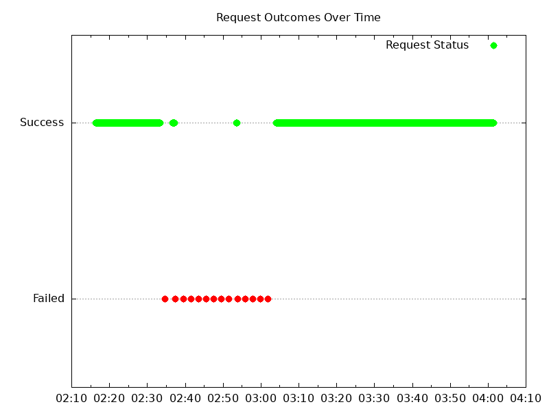
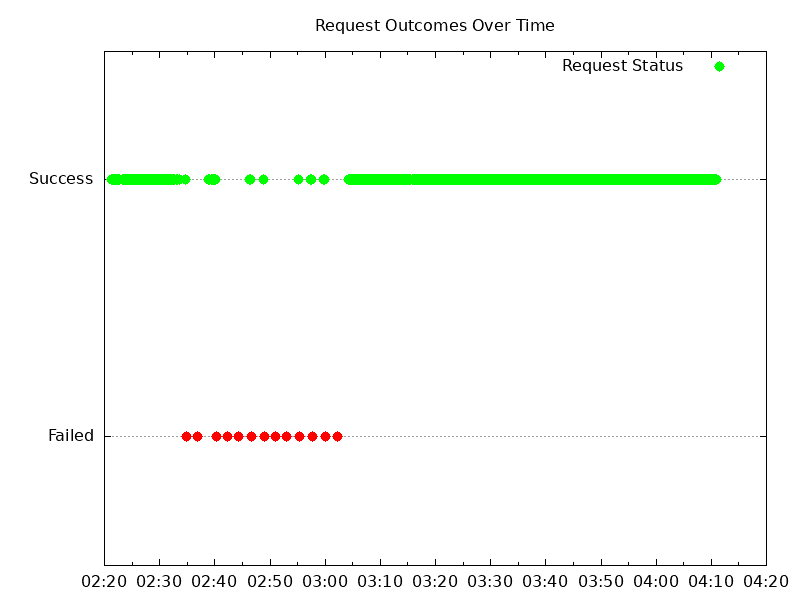

# Results

<!-- TOC -->
- [Results](#results)
  - [Versions](#versions)
  - [Start](#start)
  - [Upgrades](#upgrades)
    - [Analyze](#analyze)
      - [Tester VMs](#tester-vms)
      - [Old pods](#old-pods)
      - [New pods](#new-pods)
  - [Opened Issues](#opened-issues)
  - [Future Improvements](#future-improvements)
<!-- TOC -->

## Versions

Kubernetes:

```text
Server Version: version.Info{Major:"1", Minor:"27", GitVersion:"v1.27.3-gke.100", GitCommit:"6466b51b762a5c49ae3fb6c2c7233ffe1c96e48c", GitTreeState:"clean", BuildDate:"2023-06-23T09:27:28Z", GoVersion:"go1.20.5 X:boringcrypto", Compiler:"gc", Platform:"linux/amd64"}
```

Old NGF version:

```text
"version":"0.6.0"
"commit":"803e6d612a9574362bda28868d4410943ffaf66a"
"date":"2023-08-31T16:32:37Z"
```

New NGF version:

```text
version: "edge"
commit: "5324908e6e1145bec5f2f0ab80b312a809ad1744"
date: "2023-10-13T18:29:23Z"
```

## Start

Deployed Pods:

```text
NAME                             READY   STATUS    RESTARTS   AGE   IP            NODE                                       NOMINATED NODE   READINESS GATES
nginx-gateway-55cb958549-nbdqz   2/2     Running   0          11s   10.112.7.8    gke-michael-2-default-pool-18ad0f59-19nb   <none>           <none>
nginx-gateway-55cb958549-nj95k   2/2     Running   0          11s   10.112.6.25   gke-michael-2-default-pool-18ad0f59-zfw4   <none>           <none>
```

Logs check:

- nginx-gateway-55cb958549-nbdqz
  - NGINX logs - no errors
  - NGF logs - 2 errors like below with failure to update status of a resource.

      ```json
      {
        "name": "nginx",
        "ts": "2023-10-13T21:50:29Z",
        "logger": "statusUpdater",
        "error": "Operation cannot be fulfilled on gatewayclasses.gateway.networking.k8s.io \"nginx\": the object has been modified; please apply your changes to the latest version and try again",
        "kind": "GatewayClass",
        "namespace": "",
        "msg": "Failed to update status",
        "stacktrace": "github.com/nginxinc/nginx-kubernetes-gateway/internal/framework/status.(*updaterImpl).update\n\t/home/runner/work/nginx-kubernetes-gateway/nginx-kubernetes-gateway/internal/framework/status/updater.go:166\ngithub.com/nginxinc/nginx-kubernetes-gateway/internal/framework/status.(*updaterImpl).Update\n\t/home/runner/work/nginx-kubernetes-gateway/nginx-kubernetes-gateway/internal/framework/status/updater.go:90\ngithub.com/nginxinc/nginx-kubernetes-gateway/internal/mode/static.(*eventHandlerImpl).HandleEventBatch\n\t/home/runner/work/nginx-kubernetes-gateway/nginx-kubernetes-gateway/internal/mode/static/handler.go:101\ngithub.com/nginxinc/nginx-kubernetes-gateway/internal/framework/events.(*EventLoop).Start.func1.1\n\t/home/runner/work/nginx-kubernetes-gateway/nginx-kubernetes-gateway/internal/framework/events/loop.go:68",
        "level": "error"
      }
      ```

      Such errors are expected in 0.6.0 because we're running two replicas and leader election wasn't implemented yet.
      As a result, we see conflicts when both replicas try to update statuses.
- nginx-gateway-55cb958549-nj95k
  - NGINX logs - no error
  - NGF logs - 6 errors related to status updates.

## Upgrades

New pods:

```text
nginx-gateway-578b49bc58-hmx5x   2/2     Running   0          11s   10.112.1.9    gke-michael-2-default-pool-18ad0f59-7dqr   <none>           <none>
nginx-gateway-578b49bc58-r4ckb   2/2     Running   0          17s   10.112.5.26   gke-michael-2-default-pool-18ad0f59-l0cq   <none>           <none>
```

Note: the new pods were scheduled on different from the old pods nodes, as we wanted.

Check that one of the NGF pods became the leader:

```text
I1013 22:02:32.226414       7 leaderelection.go:250] attempting to acquire leader lease nginx-gateway/nginx-gateway-leader-election...
I1013 22:02:32.248857       7 leaderelection.go:260] successfully acquired lease nginx-gateway/nginx-gateway-leader-election
{"level":"info","ts":"2023-10-13T22:02:32Z","logger":"leaderElector","msg":"Started leading"}
```

Pod nginx-gateway-578b49bc58-r4ckb is the leader.

Gateway status has been updated with the new listener.

### Analyze

#### Tester VMs

Tester 1 wrk output:

```text
Running 1m test @ http://cafe.example.com/coffee
  2 threads and 100 connections
  Thread Stats   Avg      Stdev     Max   +/- Stdev
    Latency    29.23ms   39.24ms   1.15s    95.23%
    Req/Sec     1.47k   765.16     4.46k    82.25%
  Latency Distribution
     50%   21.66ms
     75%   36.03ms
     90%   56.05ms
     99%  113.86ms
  175177 requests in 1.00m, 62.59MB read
  Socket errors: connect 0, read 25, write 102, timeout 0
Requests/sec:   2918.55
Transfer/sec:      1.04MB
```

There are socket errors, but no timeout or connect errors.

Tester 1 graph:



As we can see, there is period when curl failed to send requests
to the tea app.

Tester 2 wrk output:

```text
Running 1m test @ https://cafe.example.com/tea
  2 threads and 100 connections
  Thread Stats   Avg      Stdev     Max   +/- Stdev
    Latency    27.59ms   20.92ms 276.16ms   75.13%
    Req/Sec     1.40k   717.86     3.85k    80.83%
  Latency Distribution
     50%   22.65ms
     75%   36.58ms
     90%   55.70ms
     99%   96.40ms
  166933 requests in 1.00m, 58.48MB read
  Socket errors: connect 85, read 43, write 0, timeout 0
Requests/sec:   2780.49
Transfer/sec:      0.97MB
```

There socket errors including 85 connect errors.

Tester 2 graph:



As we can see, there is period where curl failed to send requests
to the coffee app.

#### Old pods

- nginx-gateway-55cb958549-nbdqz
  - NGG handled a panic before exiting:

      ```text
      INFO 2023-10-13T22:02:33.321381968Z [resource.labels.containerName: nginx-gateway] {"level":"info", "msg":"Stopping and waiting for caches", "ts":"2023-10-13T22:02:33Z"}
      INFO 2023-10-13T22:02:33.321821473Z [resource.labels.containerName: nginx-gateway] {"level":"info", "msg":"Stopping and waiting for webhooks", "ts":"2023-10-13T22:02:33Z"}
      INFO 2023-10-13T22:02:33.322852013Z [resource.labels.containerName: nginx-gateway] {"level":"info", "msg":"Stopping and waiting for HTTP servers", "ts":"2023-10-13T22:02:33Z"}
      ERROR 2023-10-13T22:02:33.323409193Z [resource.labels.containerName: nginx-gateway] [controller-runtime] log.SetLogger(...) was never called; logs will not be displayed.
      ERROR 2023-10-13T22:02:33.323442347Z [resource.labels.containerName: nginx-gateway] Detected at:
      ERROR 2023-10-13T22:02:33.323451863Z [resource.labels.containerName: nginx-gateway] > goroutine 67 [running]:
      ERROR 2023-10-13T22:02:33.323457043Z [resource.labels.containerName: nginx-gateway] > runtime/debug.Stack()
      ERROR 2023-10-13T22:02:33.323462448Z [resource.labels.containerName: nginx-gateway] > $GOROOT/src/runtime/debug/stack.go:24 +0x5e
      ERROR 2023-10-13T22:02:33.323467879Z [resource.labels.containerName: nginx-gateway] > sigs.k8s.io/controller-runtime/pkg/log.eventuallyFulfillRoot()
      ERROR 2023-10-13T22:02:33.323472975Z [resource.labels.containerName: nginx-gateway] > pkg/mod/sigs.k8s.io/controller-runtime@v0.16.0/pkg/log/log.go:60 +0xcd
      ERROR 2023-10-13T22:02:33.323478263Z [resource.labels.containerName: nginx-gateway] > sigs.k8s.io/controller-runtime/pkg/log.(*delegatingLogSink).Enabled(0xc0003d6dc0, 0xc000288418?)
      ERROR 2023-10-13T22:02:33.323483535Z [resource.labels.containerName: nginx-gateway] > pkg/mod/sigs.k8s.io/controller-runtime@v0.16.0/pkg/log/deleg.go:111 +0x32
      ERROR 2023-10-13T22:02:33.323488655Z [resource.labels.containerName: nginx-gateway] > github.com/go-logr/logr.Logger.Enabled(...)
      ERROR 2023-10-13T22:02:33.323494496Z [resource.labels.containerName: nginx-gateway] > pkg/mod/github.com/go-logr/logr@v1.2.4/logr.go:261
      ERROR 2023-10-13T22:02:33.323499859Z [resource.labels.containerName: nginx-gateway] > github.com/go-logr/logr.Logger.Info({{0x1b58a48?, 0xc0003d6dc0?}, 0x1b55578?}, {0x19139af, 0x35}, {0x0, 0x0, 0x0})
      ERROR 2023-10-13T22:02:33.323504827Z [resource.labels.containerName: nginx-gateway] > pkg/mod/github.com/go-logr/logr@v1.2.4/logr.go:274 +0x72
      ERROR 2023-10-13T22:02:33.323509715Z [resource.labels.containerName: nginx-gateway] > sigs.k8s.io/controller-runtime/pkg/metrics/server.(*defaultServer).Start.func1()
      ERROR 2023-10-13T22:02:33.323514683Z [resource.labels.containerName: nginx-gateway] > pkg/mod/sigs.k8s.io/controller-runtime@v0.16.0/pkg/metrics/server/server.go:231 +0x74
      ERROR 2023-10-13T22:02:33.323519441Z [resource.labels.containerName: nginx-gateway] > created by sigs.k8s.io/controller-runtime/pkg/metrics/server.(*defaultServer).Start in goroutine 65
      ERROR 2023-10-13T22:02:33.323524696Z [resource.labels.containerName: nginx-gateway] > pkg/mod/sigs.k8s.io/controller-runtime@v0.16.0/pkg/metrics/server/server.go:229 +0x825
      INFO 2023-10-13T22:02:33.325625043Z [resource.labels.containerName: nginx-gateway] {"level":"info", "msg":"Wait completed, proceeding to shutdown the manager", "ts":"2023-10-13T22:02:33Z"}
      ```

      This error is specific to 0.6.0 release, graceful shutdown of the used edge version (tried separately) doesn't
      lead to such an error.
  - NGINX
    - Access logs - all responses are 200.
    - Error logs - no errors or warnings.
- nginx-gateway-55cb958549-nj95k
  - NGF - same error.
  - NGINX
    - Access logs - only 200 responses.
    - Error logs - no errors or warnings.

#### New pods

- nginx-gateway-578b49bc58-hmx5x
  - NGF - no errors
  - NGINX
    - Access logs - 46 responses like below:

          ```text
          INFO 2023-10-13T22:03:17.618556029Z [resource.labels.containerName: nginx] 10.128.0.9 - - [13/Oct/2023:22:03:17 +0000] "GET /coffee HTTP/1.1" 499 0 "-" "-"
          . . .
          INFO 2023-10-13T22:03:22.747023411Z [resource.labels.containerName: nginx] 10.128.15.241 - - [13/Oct/2023:22:03:22 +0000] "GET /tea HTTP/1.1" 499 0 "-" "-"
          ```

          Meaning clients closed connection (499 status code).
          Those requests belong to wrk (curl requests have `curl` user agent in the logs).
          All requests for coffee are during the same time. Same for tea.
          That's probably how wrk closed connections before it exited after 60s.
    - Error logs - No errors or warnings.
- nginx-gateway-578b49bc58-r4ckb
  - NGF - no errors.
  - NGINX
    - Access logs - 35 responses similar to the first pod. Same conclusion as above.
    - Error logs - No errors or warnings.

## Opened Issues

- Traffic loss during an upgrade. (to be opened soon)

## Future Improvements

- Use helm for upgrade, to catch any helm-related bugs preventing an upgrade. In this test,
  we didn't use helm because 0.6.0 release does not allow you to configure the number of replicas
  and pod affinity.
